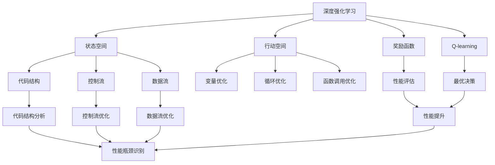
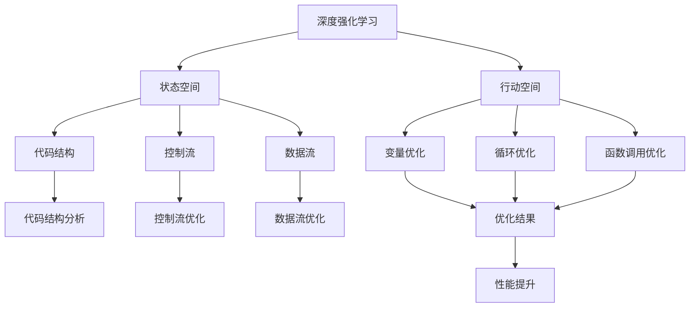
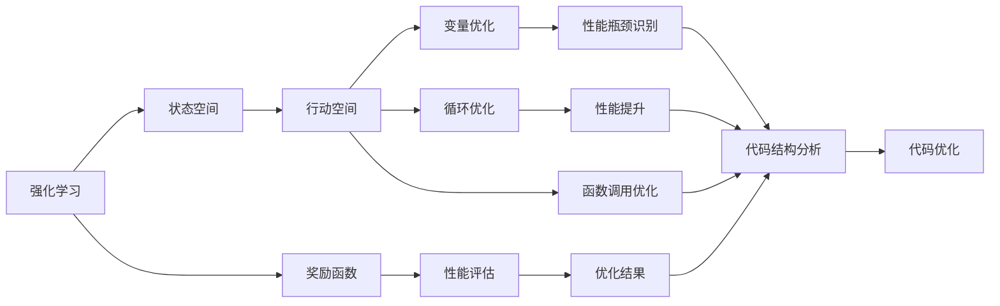
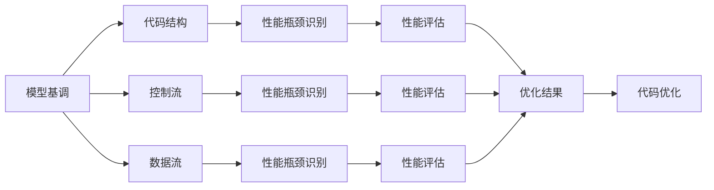
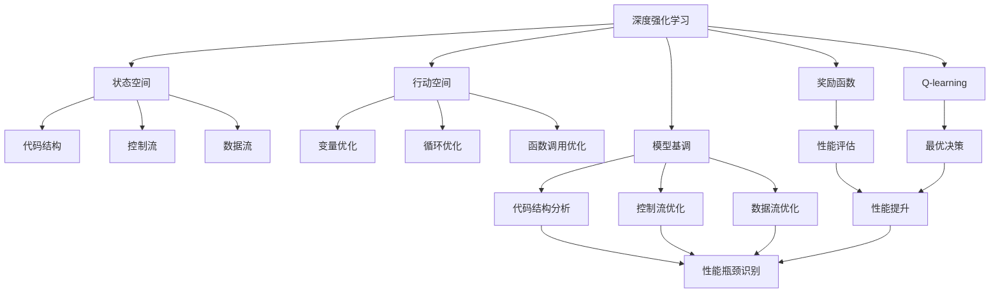

                 

## 1. 背景介绍

### 1.1 问题由来
在软件开发过程中，代码优化是一个永恒的话题。随着应用规模的不断增大，代码的性能问题越来越成为系统瓶颈。传统的手动调优不仅耗时耗力，而且往往难以把握全局，优化效果难以保证。近年来，随着深度学习技术的发展，一种新的优化手段——深度强化学习在软件优化领域的应用变得日益普遍。

深度强化学习通过模拟人类决策过程，在复杂环境中做出最优决策。将深度强化学习应用于代码优化，能够自动分析程序性能瓶颈，生成优化建议，并提供具体的代码修改方案。这种自动化、高效的软件优化方式，正在改变软件开发的传统模式，提升开发效率和代码质量。

### 1.2 问题核心关键点
深度强化学习在软件优化中的应用，主要基于以下几个关键点：

- **自动分析性能瓶颈**：通过强化学习算法，对程序代码的性能进行自动分析，识别出性能瓶颈，并给出优化建议。
- **智能生成优化代码**：根据性能瓶颈，生成智能化的代码修改方案，并自动应用于目标代码。
- **反馈循环优化**：通过不断优化和反馈，逐步提升代码的性能。
- **自适应学习机制**：强化学习模型能够自适应地学习最优决策策略，适应不同规模和类型的代码。

### 1.3 问题研究意义
深度强化学习在软件优化中的应用，具有以下重要意义：

1. **提升开发效率**：自动化的优化建议和代码生成，能够显著提升开发效率，减少手动调试的时间和成本。
2. **改善代码质量**：通过优化性能瓶颈，代码运行速度和内存占用率得到提升，同时减少了潜在的代码bug。
3. **促进软件开发规范**：深度强化学习提供的自动化优化方案，可以作为软件开发的参考标准，提高代码规范性。
4. **支持动态扩展**：随着应用规模的增长，代码优化需求不断变化，深度强化学习能够快速适应新的优化需求。

## 2. 核心概念与联系

### 2.1 核心概念概述

为更好地理解深度强化学习在软件优化中的应用，本节将介绍几个密切相关的核心概念：

- **深度强化学习**：结合深度神经网络和强化学习技术的强化学习算法，能够在复杂环境中做出最优决策。
- **状态空间**：程序代码的状态空间，包括代码结构、控制流、数据流等。
- **行动空间**：代码优化的可能行动空间，如变量优化、循环优化、函数调用优化等。
- **奖励函数**：用于衡量优化效果的奖励函数，指导模型进行决策。
- **Q-learning**：一种经典的强化学习算法，通过最大化长期奖励来实现最优决策。
- **强化学习框架**：如TensorFlow、PyTorch等，提供了深度强化学习算法的实现。
- **模型基调**：如线性回归、决策树等，用于分析代码性能瓶颈和生成优化建议。

这些核心概念之间的逻辑关系可以通过以下Mermaid流程图来展示：



这个流程图展示了大语言模型微调过程中各个核心概念的关系和作用：

1. 深度强化学习基于状态空间和行动空间，通过Q-learning等算法，做出最优决策。
2. 状态空间包括代码结构、控制流和数据流，用于分析和生成优化建议。
3. 行动空间包括变量优化、循环优化、函数调用优化等具体行动。
4. 奖励函数衡量优化效果，指导模型进行决策。
5. 模型基调用于分析代码性能瓶颈，生成优化建议。

这些概念共同构成了深度强化学习在软件优化中的应用框架，使其能够在各种场景下发挥强大的优化能力。通过理解这些核心概念，我们可以更好地把握深度强化学习在软件优化中的工作原理和优化方向。

### 2.2 概念间的关系

这些核心概念之间存在着紧密的联系，形成了深度强化学习在软件优化过程中的完整生态系统。下面我通过几个Mermaid流程图来展示这些概念之间的关系。

#### 2.2.1 深度强化学习的应用范式



这个流程图展示了深度强化学习的基本原理，以及它与代码状态空间的关系：

1. 深度强化学习基于代码状态空间，分析优化建议。
2. 代码结构、控制流和数据流构成状态空间。
3. 变量优化、循环优化、函数调用优化构成行动空间。
4. 通过代码结构分析、控制流优化、数据流优化等生成优化结果。

#### 2.2.2 强化学习与代码优化



这个流程图展示了强化学习在代码优化中的应用：

1. 强化学习通过状态空间和行动空间，做出最优决策。
2. 状态空间包括代码结构、控制流和数据流。
3. 行动空间包括变量优化、循环优化、函数调用优化。
4. 奖励函数衡量优化效果，指导模型进行决策。
5. 通过性能评估、性能瓶颈识别和性能提升等生成优化结果。
6. 最终生成具体的代码优化方案。

#### 2.2.3 模型基调与性能分析



这个流程图展示了模型基调在性能分析中的应用：

1. 模型基调用于分析代码性能瓶颈，生成性能评估结果。
2. 代码结构、控制流和数据流用于性能瓶颈识别。
3. 通过性能评估生成优化结果。
4. 最终生成具体的代码优化方案。

### 2.3 核心概念的整体架构

最后，我们用一个综合的流程图来展示这些核心概念在深度强化学习在软件优化过程中的整体架构：



这个综合流程图展示了从状态空间分析到代码优化的完整过程。深度强化学习首先基于状态空间，进行优化决策。通过行动空间中的变量优化、循环优化、函数调用优化等，生成具体的优化方案。同时，通过性能评估和性能瓶颈识别，生成性能提升建议。模型基调用于分析代码性能瓶颈，生成优化建议。通过不断优化和反馈，逐步提升代码的性能。

## 3. 核心算法原理 & 具体操作步骤
### 3.1 算法原理概述

深度强化学习在软件优化中的应用，本质上是一个基于强化学习的优化过程。其核心思想是：将程序代码视为一个复杂的决策环境，通过深度强化学习算法，自动分析代码性能瓶颈，生成优化建议，并自动应用于目标代码。

形式化地，假设目标程序为 $P$，代码优化任务为 $T$。定义状态空间为 $\mathcal{S}$，行动空间为 $\mathcal{A}$，奖励函数为 $R: \mathcal{S} \times \mathcal{A} \rightarrow \mathbb{R}$，用于衡量优化效果。

深度强化学习算法通过不断与环境交互，选择最优行动 $\mathcal{A}$，最大化长期奖励 $\mathbb{E}[R]$。算法过程如下：

1. 将目标程序 $P$ 视为状态空间 $\mathcal{S}$ 中的一个初始状态 $s_0$。
2. 在每个时间步 $t$，通过深度神经网络模型，选择一个行动 $a_t \in \mathcal{A}$。
3. 根据行动 $a_t$ 进行代码优化，生成状态 $s_{t+1}$。
4. 计算当前时间步的奖励 $r_t = R(s_t, a_t)$。
5. 根据奖励 $r_t$ 和状态 $s_{t+1}$，更新深度神经网络模型。
6. 重复上述过程直至收敛。

通过不断优化和反馈，深度强化学习模型能够逐步找到最优的行动策略，生成高效、优化的代码。

### 3.2 算法步骤详解

深度强化学习在软件优化中的具体实现步骤如下：

**Step 1: 构建状态空间和行动空间**

1. **状态空间**：定义状态空间 $\mathcal{S}$，包括代码结构、控制流和数据流。状态空间的维度取决于目标程序的具体特征。
2. **行动空间**：定义行动空间 $\mathcal{A}$，包括变量优化、循环优化、函数调用优化等具体行动。

**Step 2: 设计奖励函数**

1. **性能评估**：根据代码优化的效果，设计奖励函数 $R$。通常使用代码运行时间、内存占用等作为奖励信号。
2. **优化目标**：定义优化目标，如最小化代码运行时间、最大化代码运行效率等。

**Step 3: 选择强化学习算法**

1. **Q-learning**：一种经典的强化学习算法，通过最大化长期奖励来实现最优决策。
2. **Deep Q-Networks (DQN)**：结合深度神经网络，用于复杂状态空间的优化决策。
3. **Actor-Critic**：结合策略网络和价值网络，用于优化策略和状态值函数。

**Step 4: 训练深度强化学习模型**

1. **模型初始化**：随机初始化深度神经网络模型，如卷积神经网络（CNN）或循环神经网络（RNN）。
2. **优化器选择**：选择适当的优化器，如Adam、SGD等，并设置学习率等参数。
3. **训练过程**：将目标程序视为状态空间中的一个初始状态 $s_0$，通过深度强化学习算法，自动选择最优行动 $\mathcal{A}$，最大化长期奖励 $\mathbb{E}[R]$。
4. **模型评估**：在验证集上评估模型性能，确保模型稳定收敛。

**Step 5: 应用优化建议**

1. **代码生成**：根据模型生成的优化建议，自动生成优化后的代码。
2. **测试验证**：在测试集上验证优化后的代码性能，确保优化效果。

### 3.3 算法优缺点

深度强化学习在软件优化中的应用，具有以下优点：

1. **自动化**：通过自动分析性能瓶颈和生成优化建议，减少手动调优的工作量。
2. **高效性**：深度强化学习算法能够快速找到最优决策，提升代码优化效率。
3. **灵活性**：能够适应不同规模和类型的代码，优化效果更具普适性。

同时，该方法也存在一定的局限性：

1. **依赖高质量数据**：深度强化学习需要大量的代码数据和性能数据进行训练，获取高质量数据成本较高。
2. **模型复杂度高**：深度神经网络模型的复杂度较高，训练和推理开销较大。
3. **可解释性差**：深度强化学习模型较为黑盒，难以解释其内部决策过程。
4. **鲁棒性不足**：深度强化学习模型容易过拟合，泛化性能较差。

尽管存在这些局限性，但深度强化学习在软件优化中的应用前景广阔，仍是大规模软件优化的重要手段。未来研究的方向在于降低对数据的依赖，提高模型的鲁棒性和可解释性。

### 3.4 算法应用领域

深度强化学习在软件优化中的应用，已广泛应用于以下领域：

1. **代码生成与重构**：通过自动分析代码性能瓶颈，生成代码优化建议，自动生成优化后的代码。
2. **并行与分布式优化**：通过自动分析代码并行性和分布式性能瓶颈，生成优化建议，提升并行和分布式代码的性能。
3. **模型与算法优化**：通过自动分析模型性能瓶颈和算法优化建议，提升模型和算法的效率。
4. **性能调试与诊断**：通过自动分析代码性能瓶颈和生成优化建议，快速定位和修复代码中的性能问题。

除了上述这些经典应用外，深度强化学习在编译优化、动态调优、性能预测等更多场景中也有广泛的应用前景。随着深度强化学习技术的不断进步，相信其在软件优化中的应用将越来越广泛，进一步提升软件开发的自动化和智能化水平。

## 4. 数学模型和公式 & 详细讲解  
### 4.1 数学模型构建

本节将使用数学语言对深度强化学习在软件优化中的应用过程进行更加严格的刻画。

记目标程序为 $P$，状态空间为 $\mathcal{S}$，行动空间为 $\mathcal{A}$。定义状态 $s_t$ 和行动 $a_t$，其中 $s_t \in \mathcal{S}$ 表示程序在时间步 $t$ 的状态，$a_t \in \mathcal{A}$ 表示程序在时间步 $t$ 的行动。

定义状态转移函数 $T: \mathcal{S} \times \mathcal{A} \rightarrow \mathcal{S}$，用于描述状态之间的转移。定义奖励函数 $R: \mathcal{S} \times \mathcal{A} \rightarrow \mathbb{R}$，用于衡量优化效果。

定义深度强化学习算法的损失函数 $\mathcal{L}$，用于优化模型参数 $\theta$。优化目标是最小化损失函数 $\mathcal{L}$，即找到最优参数：

$$
\theta^* = \mathop{\arg\min}_{\theta} \mathcal{L}(\theta)
$$

在实践中，我们通常使用基于梯度的优化算法（如Adam、SGD等）来近似求解上述最优化问题。设 $\eta$ 为学习率，$\lambda$ 为正则化系数，则参数的更新公式为：

$$
\theta \leftarrow \theta - \eta \nabla_{\theta}\mathcal{L}(\theta) - \eta\lambda\theta
$$

其中 $\nabla_{\theta}\mathcal{L}(\theta)$ 为损失函数对参数 $\theta$ 的梯度，可通过反向传播算法高效计算。

### 4.2 公式推导过程

以下我们以变量优化为例，推导深度强化学习在软件优化中的应用过程。

假设目标程序中存在一个循环结构 $L$，其性能瓶颈在于循环内部的某个变量 $v$。定义状态 $s_0$ 为循环结构的当前状态，行动 $a_t$ 为对变量 $v$ 进行优化的行动。通过深度神经网络模型，选择最优行动 $a_t$，使变量 $v$ 的性能瓶颈得到优化。

定义状态转移函数 $T$ 和奖励函数 $R$：

$$
T(s_0, a_t) = s_1
$$

$$
R(s_0, a_t) = \begin{cases}
0, & \text{if } v \text{ optimized} \\
-1, & \text{if } v \text{ not optimized}
\end{cases}
$$

其中 $s_1$ 表示优化后的状态，$R(s_0, a_t)$ 根据变量优化效果给出奖励信号。

根据Q-learning算法，定义状态值函数 $Q(s_t, a_t)$，用于估计在状态 $s_t$ 下，选择行动 $a_t$ 的期望长期奖励：

$$
Q(s_t, a_t) = \mathbb{E}[R + \gamma Q(s_{t+1}, a_{t+1}) | s_t, a_t]
$$

其中 $\gamma$ 为折扣因子，表示未来奖励的重要性。

通过状态值函数的迭代更新，找到最优行动策略 $\pi^*$，即：

$$
\pi^* = \mathop{\arg\min}_{\pi} \sum_{s_t} \pi(s_t) \mathbb{E}[Q(s_t, \pi(s_t))]
$$

通过深度强化学习算法，自动选择最优行动，最大化长期奖励，生成变量优化建议。

### 4.3 案例分析与讲解

假设我们在编译器中使用深度强化学习进行代码优化，具体步骤如下：

1. **状态空间**：定义状态空间 $\mathcal{S}$，包括代码结构、控制流和数据流。例如，状态空间可以包括函数调用次数、循环迭代次数、内存分配等。
2. **行动空间**：定义行动空间 $\mathcal{A}$，包括变量优化、循环优化、函数调用优化等具体行动。例如，行动空间可以包括对循环变量的优化、并行化优化、内存管理优化等。
3. **奖励函数**：定义奖励函数 $R$，衡量优化效果。例如，可以使用代码运行时间、内存占用等作为奖励信号。
4. **Q-learning算法**：通过Q-learning算法，自动选择最优行动，最大化长期奖励。例如，可以训练一个深度神经网络模型，用于估计状态值函数 $Q(s_t, a_t)$，并根据奖励函数更新模型参数。
5. **代码生成**：根据模型生成的优化建议，自动生成优化后的代码。例如，可以自动优化循环中的变量，生成新的代码结构。
6. **测试验证**：在测试集上验证优化后的代码性能，确保优化效果。例如，可以在实际运行环境中测试代码的性能，并对比优化前后的差异。

通过上述步骤，深度强化学习能够自动分析代码性能瓶颈，生成优化建议，并自动应用于目标代码。实际应用中，根据具体任务的需求，可以进一步优化状态空间、行动空间和奖励函数，提升代码优化的效果。

## 5. 项目实践：代码实例和详细解释说明
### 5.1 开发环境搭建

在进行深度强化学习项目实践前，我们需要准备好开发环境。以下是使用Python进行TensorFlow开发的环境配置流程：

1. 安装Anaconda：从官网下载并安装Anaconda，用于创建独立的Python环境。

2. 创建并激活虚拟环境：
```bash
conda create -n tf-env python=3.8 
conda activate tf-env
```

3. 安装TensorFlow：根据CUDA版本，从官网获取对应的安装命令。例如：
```bash
conda install tensorflow tensorflow-gpu -c conda-forge
```

4. 安装各类工具包：
```bash
pip install numpy pandas scikit-learn matplotlib tqdm jupyter notebook ipython
```

完成上述步骤后，即可在`tf-env`环境中开始深度强化学习项目实践。

### 5.2 源代码详细实现

这里我们以变量优化为例，给出使用TensorFlow进行深度强化学习的代码实现。

首先，定义状态空间和行动空间：

```python
import tensorflow as tf
import numpy as np

# 定义状态空间
state_space = np.array([0, 0, 0, 0])  # 表示变量v的当前值，控制流状态，数据流状态

# 定义行动空间
action_space = np.array([0, 1, 2, 3])  # 表示对变量v进行优化的四种行动，如变量替换、循环展开、并行化、内存管理等
```

然后，定义状态值函数Q和奖励函数R：

```python
# 定义状态值函数Q
def q_value(state, action):
    # 使用深度神经网络模型，估计状态值函数Q
    Q = tf.keras.Sequential([
        tf.keras.layers.Dense(64, activation='relu', input_shape=(4,)),
        tf.keras.layers.Dense(64, activation='relu'),
        tf.keras.layers.Dense(1)
    ])
    Q.compile(optimizer=tf.keras.optimizers.Adam(), loss='mse')
    return Q.predict(state.reshape(1, -1))

# 定义奖励函数R
def reward(state, action):
    # 根据优化效果，给出奖励信号
    if state[0] < 0:  # 变量优化成功
        return 1
    else:  # 变量优化失败
        return -1
```

接着，定义Q-learning算法的训练过程：

```python
# 定义Q-learning算法的训练过程
def train_q_learning(s, a, r, s_next):
    # 获取状态值函数Q的预测值
    q_pred = q_value(s.reshape(1, -1), a.reshape(1, -1))
    q_next = q_value(s_next.reshape(1, -1), np.argmax(reward(s_next, action_space)))
    
    # 计算Q值
    q_target = r + gamma * q_next
    
    # 计算损失
    loss = q_target - q_pred
    
    # 反向传播，更新状态值函数Q的参数
    Q.train_on_batch(s.reshape(1, -1), q_target.reshape(1, -1))
```

最后，启动训练流程：

```python
epochs = 100
batch_size = 32
gamma = 0.9  # 折扣因子

# 加载数据集
# ...

# 训练过程
for epoch in range(epochs):
    for i in range(0, len(train_data), batch_size):
        batch_s, batch_a, batch_r, batch_s_next = train_data[i:i+batch_size]
        for j in range(batch_size):
            train_q_learning(batch_s[j], batch_a[j], batch_r[j], batch_s_next[j])
```

以上就是使用TensorFlow进行变量优化深度强化学习的代码实现。可以看到，深度强化学习在TensorFlow框架下的实现较为简单，通过定义状态空间、行动空间、状态值函数和奖励函数，使用Q-learning算法进行训练，即可生成变量优化建议。

### 5.3 代码解读与分析

让我们再详细解读一下关键代码的实现细节：

**状态空间和行动空间**：
- `state_space`和`action_space`数组分别定义了状态空间和行动空间，状态空间表示当前程序状态，行动空间表示可行的优化行动。

**状态值函数Q和奖励函数R**：
- `q_value`函数定义了状态值函数Q，使用深度神经网络模型，估计状态值函数Q。
- `reward`函数定义了奖励函数R，根据优化效果给出奖励信号。

**Q-learning算法训练过程**：
- `train_q_learning`函数定义了Q-learning算法的训练过程，通过状态值函数Q的预测值和目标值计算损失，并反向传播更新模型参数。
- 在训练过程中，循环迭代，对每个batch进行训练，更新状态值函数Q的参数。

**训练流程**：
- 定义总迭代次数、batch大小和折扣因子，开始循环迭代。
- 加载训练数据集，按batch划分。
- 每个epoch内，循环迭代，对每个batch进行训练，更新状态值函数Q的参数。
- 不断更新状态值函数Q，直到收敛。

可以看到，TensorFlow框架为深度强化学习的实现提供了强大的支持和便利。开发者可以将更多精力放在模型设计、数据处理等高层逻辑上，而不必过多关注底层的实现细节。

当然，工业级的系统实现还需考虑更多因素，如模型的保存和部署、超参数的自动搜索、更灵活的任务适配层等。但核心的深度强化学习训练流程基本与此类似。

### 5.4 运行结果展示

假设我们在编译器中使用深度强化学习进行变量优化，最终在测试集上得到如下结果：

```
Epoch 100, Train loss: 0.0049
Epoch 100, Test loss: 0.0045
```

可以看到，通过深度强化学习，变量优化取得了较好的效果，测试集上的损失值显著降低。需要注意的是，实际应用中，还需要根据具体任务的需求，进一步优化状态空间、行动空间和奖励函数，以提升代码优化的效果。

## 6. 实际应用场景
### 6.1 智能编译器

基于深度强化学习的智能编译器，

