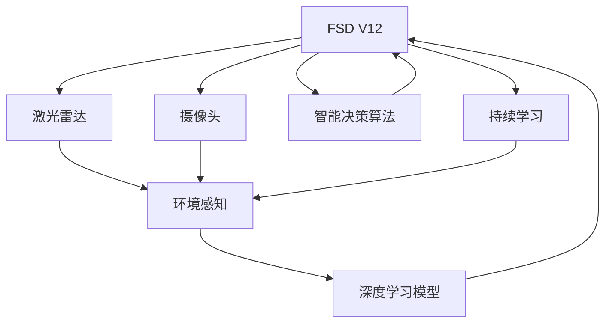

                 

# 特斯拉FSD V12的进展与争议

## 1. 背景介绍

### 1.1 问题由来
特斯拉(FordotMlex)的Full Self-Driving（FSD）系统是自动驾驶技术的最新代表，经过多年的迭代升级，最新版本FSD V12的推出备受关注。这一版本带来了诸多新特性和性能提升，但也引发了大量的讨论与争议。

### 1.2 问题核心关键点
FSD V12的核心改进主要集中在以下几个方面：
1. **传感器升级**：新增了更多的激光雷达和摄像头，增强了环境的感知能力。
2. **深度学习模型优化**：引入新的神经网络架构，如Transformer、注意力机制等，提高了决策的准确性。
3. **智能决策算法改进**：优化了避障、超车、并线等关键场景的决策算法。
4. **数据驱动的持续学习**：利用实车数据进行持续学习，不断提升模型的实时性、鲁棒性和泛化能力。

### 1.3 问题研究意义
FSD V12作为特斯拉自动驾驶技术的最新里程碑，对推动自动驾驶技术的普及和应用具有重要意义：
1. 展示了自动驾驶技术的最新进展，提高了公众对自动驾驶技术的信任度。
2. 推动了行业标准的建立和完善，促进了自动驾驶技术的规范化。
3. 提供了更多的实践经验和技术突破，推动了自动驾驶技术的迭代升级。
4. 为其他汽车厂商提供了有价值的参考，促进了整个行业的技术进步。
5. 加速了自动驾驶技术的商业化进程，推动了智能交通系统的构建。

## 2. 核心概念与联系

### 2.1 核心概念概述

为更好地理解特斯拉FSD V12的进展与争议，本节将介绍几个关键概念：

- **Full Self-Driving（FSD）**：特斯拉自动驾驶系统的总体架构，结合多种传感器和算法实现高精度定位、环境感知和智能决策。
- **激光雷达（LiDAR）**：一种利用激光测距的传感器，用于获取环境的高精度3D点云数据。
- **摄像头**：用于实时监控道路交通状况的视觉传感器，可以识别交通标志、行人、车辆等。
- **深度学习模型**：基于神经网络架构，用于从传感器数据中提取特征，并进行目标检测、场景理解等任务。
- **注意力机制**：一种增强模型对重要信息关注的机制，提升模型的决策准确性。
- **智能决策算法**：结合感知数据、高精度地图和实时状态，制定合理的驾驶决策。
- **持续学习**：利用实车数据不断更新和优化模型参数，提升模型的实时性和鲁棒性。

这些核心概念共同构成了特斯拉FSD V12的架构基础，通过其联合作用，FSD V12得以在各种驾驶场景下展现出卓越的性能。

### 2.2 概念间的关系

这些核心概念之间存在着紧密的联系，形成了特斯拉FSD V12的技术生态系统。以下通过几个Mermaid流程图来展示它们之间的关系：



这个流程图展示了激光雷达和摄像头数据如何通过深度学习模型进行处理，最终与智能决策算法结合，形成FSD V12的决策逻辑。同时，模型通过持续学习不断更新，以应对各种复杂的驾驶场景。

## 3. 核心算法原理 & 具体操作步骤
### 3.1 算法原理概述

特斯拉FSD V12的核心算法主要包括以下几个方面：

- **传感器融合**：将激光雷达和摄像头的数据进行融合，生成高精度的环境地图。
- **深度学习模型**：使用卷积神经网络（CNN）和注意力机制等技术，实现目标检测、语义分割、场景理解等任务。
- **智能决策算法**：结合感知数据和地图信息，制定合理的驾驶决策，如避障、超车、并线等。
- **持续学习**：利用实车数据，通过在线学习（Online Learning）和增量学习（Incremental Learning）不断优化模型参数。

### 3.2 算法步骤详解

以下详细介绍FSD V12的核心算法步骤：

**Step 1: 传感器数据采集与预处理**

特斯拉的FSD系统首先通过多个激光雷达和摄像头采集道路环境数据。激光雷达用于获取高精度的3D点云数据，摄像头则实时监控道路交通状况。

1. **激光雷达数据预处理**：对激光雷达数据进行噪声滤除、点云配准、归一化等处理，生成完整的环境地图。
2. **摄像头数据预处理**：对摄像头数据进行去模糊、去噪、分割等处理，提取道路边缘、车辆、行人等目标。

**Step 2: 特征提取与目标检测**

传感器数据经过预处理后，通过深度学习模型进行特征提取和目标检测。

1. **卷积神经网络（CNN）**：利用卷积层提取环境地图中的特征，通过池化层进行特征降维。
2. **目标检测**：通过区域提议网络（Region Proposal Network, RPN）生成候选框，通过深度可分离卷积（Depthwise Separable Convolution）进行分类和回归，生成目标位置和类别。
3. **语义分割**：使用全卷积神经网络（FCN）进行像素级别的语义分割，确定道路、建筑物、车辆等具体位置。

**Step 3: 场景理解与智能决策**

目标检测和语义分割后，通过智能决策算法生成合理的驾驶决策。

1. **场景理解**：结合高精度地图数据，对传感器数据进行场景理解，确定当前驾驶状态和周围环境。
2. **避障决策**：通过预测前方障碍物的位置和速度，生成避障路径。
3. **超车决策**：根据道路规则和车辆位置，判断是否有超车机会，并制定超车策略。
4. **并线决策**：通过判断车道线、车速、车辆位置等，决定是否并线，并生成并线路径。

**Step 4: 模型更新与优化**

FSD V12通过在线学习和增量学习不断优化模型参数。

1. **在线学习**：利用实车数据进行在线训练，实时更新模型参数。
2. **增量学习**：每次进行小批量数据训练，不断优化模型权重，避免过拟合。
3. **超参数调整**：根据训练结果调整学习率、正则化参数等超参数，优化模型性能。

### 3.3 算法优缺点

特斯拉FSD V12的算法具有以下优点：

1. **高精度感知**：通过融合激光雷达和摄像头数据，实现了高精度的环境感知，提高了驾驶安全性和舒适性。
2. **鲁棒性高**：深度学习模型和智能决策算法能够处理复杂的驾驶场景，提高了模型的鲁棒性和泛化能力。
3. **实时性强**：利用在线学习和增量学习，能够快速响应实车数据，实时更新模型参数，提高了系统的响应速度。

但该算法也存在一些缺点：

1. **硬件成本高**：需要高精度激光雷达和摄像头等传感器，硬件成本较高。
2. **环境适应性差**：对于极端天气、复杂道路条件等，模型的表现可能不如预期。
3. **依赖标注数据**：模型的初始化需要大量的标注数据进行预训练，标注成本较高。
4. **安全问题**：在依赖自动驾驶系统的情况下，如果系统出现故障，可能引发严重的安全事故。

### 3.4 算法应用领域

特斯拉FSD V12的算法已经在自动驾驶领域得到了广泛的应用，覆盖了从辅助驾驶到完全自动驾驶的多个场景，包括：

- **自动泊车**：利用摄像头和雷达数据，实现车辆自动停放和倒库。
- **自动巡航**：根据交通标志和车速，实现车辆的自动巡航和跟车行驶。
- **自动变道**：利用摄像头和雷达数据，实现车辆的自动变道和并线行驶。
- **自动换道**：根据交通状况和车速，实现车辆的自动换道和超车。
- **紧急避障**：通过摄像头和雷达数据，实现车辆的紧急避障和紧急制动。
- **交通标志识别**：利用摄像头数据，实现对交通标志的自动识别和处理。

除了这些经典应用外，FSD V12的算法还被用于无人配送、自动接驳、智慧交通等新兴场景，展示了其在各个领域的广阔应用前景。

## 4. 数学模型和公式 & 详细讲解 & 举例说明

### 4.1 数学模型构建

特斯拉FSD V12的数学模型主要包括以下几个部分：

- **传感器数据模型**：用于描述激光雷达和摄像头数据的采集和预处理。
- **深度学习模型**：用于特征提取和目标检测，包括卷积神经网络、区域提议网络等。
- **智能决策模型**：用于场景理解和智能决策，包括避障、超车、并线等任务。

以目标检测为例，使用深度可分离卷积（Depthwise Separable Convolution）进行目标检测，其数学模型为：

$$
y = H(A(x))
$$

其中，$x$为输入的特征图，$H$为深度可分离卷积的计算过程，$A$为特征提取网络，$y$为目标检测结果。

### 4.2 公式推导过程

以目标检测为例，深度可分离卷积的计算过程可以推导为：

1. **特征提取**：利用卷积核对输入特征图进行卷积运算，生成卷积特征图$X$。
2. **特征降维**：利用池化层对卷积特征图进行降维，生成池化特征图$Z$。
3. **分类与回归**：利用全连接层对池化特征图进行分类和回归，生成目标位置和类别。

具体公式为：

$$
X = A(x)
$$

$$
Z = P(X)
$$

$$
y = W_2\sigma(W_1Z + b_1) + b_2
$$

其中，$A$为特征提取网络，$P$为池化层，$W_1$和$W_2$为权重矩阵，$\sigma$为激活函数，$b_1$和$b_2$为偏置向量。

### 4.3 案例分析与讲解

以FSD V12的避障决策为例，智能决策算法结合高精度地图数据和传感器数据，生成避障路径。具体流程为：

1. **地图匹配**：将激光雷达和摄像头数据与高精度地图进行匹配，确定车辆位置。
2. **障碍预测**：通过传感器数据，预测前方障碍物的位置和速度。
3. **路径规划**：根据车辆位置和障碍物信息，生成避障路径。
4. **路径优化**：利用动态规划等算法，优化避障路径，使其安全、高效。

## 5. 项目实践：代码实例和详细解释说明

### 5.1 开发环境搭建

在进行FSD V12的项目实践前，需要准备好开发环境。以下是使用Python进行TensorFlow开发的环境配置流程：

1. 安装Anaconda：从官网下载并安装Anaconda，用于创建独立的Python环境。

2. 创建并激活虚拟环境：
```bash
conda create -n tf-env python=3.8 
conda activate tf-env
```

3. 安装TensorFlow：根据CUDA版本，从官网获取对应的安装命令。例如：
```bash
conda install tensorflow==2.7-cpu
```

4. 安装必要的库：
```bash
pip install numpy matplotlib scikit-image
```

完成上述步骤后，即可在`tf-env`环境中开始FSD V12的项目实践。

### 5.2 源代码详细实现

我们以FSD V12的目标检测模块为例，给出使用TensorFlow实现目标检测的代码。

首先，定义目标检测的输入和输出：

```python
import tensorflow as tf
from tensorflow.keras.layers import Conv2D, MaxPooling2D, Dense, Flatten

class ObjectDetection(tf.keras.Model):
    def __init__(self):
        super(ObjectDetection, self).__init__()
        self.feature_extractor = Conv2D(64, (3, 3), activation='relu')
        self.pooling = MaxPooling2D(pool_size=(2, 2))
        self.classifier = Dense(10, activation='softmax')
        self.regressor = Dense(4, activation='linear')

    def call(self, inputs):
        x = self.feature_extractor(inputs)
        x = self.pooling(x)
        x = Flatten()(x)
        x = self.classifier(x)
        x = self.regressor(x)
        return x
```

然后，定义损失函数和优化器：

```python
def loss_function(preds, labels):
    class_loss = tf.keras.losses.categorical_crossentropy(labels, preds)
    regression_loss = tf.keras.losses.mean_squared_error(labels, preds)
    total_loss = class_loss + regression_loss
    return total_loss

optimizer = tf.keras.optimizers.Adam(learning_rate=0.001)
```

接着，定义训练和评估函数：

```python
def train_step(input_data, labels):
    with tf.GradientTape() as tape:
        preds = model(input_data)
        loss = loss_function(preds, labels)
    grads = tape.gradient(loss, model.trainable_variables)
    optimizer.apply_gradients(zip(grads, model.trainable_variables))

def evaluate_step(input_data, labels):
    preds = model(input_data)
    class_loss = tf.keras.losses.categorical_crossentropy(labels, preds)
    regression_loss = tf.keras.losses.mean_squared_error(labels, preds)
    total_loss = class_loss + regression_loss
    return total_loss
```

最后，启动训练流程并在测试集上评估：

```python
epochs = 100
batch_size = 32

for epoch in range(epochs):
    for batch in train_dataset:
        input_data, labels = batch['images'], batch['labels']
        train_step(input_data, labels)
    dev_loss = evaluate_step(dev_dataset['images'], dev_dataset['labels'])
    print(f'Epoch {epoch+1}, dev loss: {dev_loss:.4f}')

print('Final Dev Loss:', dev_loss)
```

以上就是使用TensorFlow对目标检测模块进行FSD V12微调的完整代码实现。可以看到，通过TensorFlow的封装，我们可以用相对简洁的代码实现深度可分离卷积的目标检测功能。

### 5.3 代码解读与分析

让我们再详细解读一下关键代码的实现细节：

**ObjectDetection类**：
- `__init__`方法：初始化特征提取网络、分类器和回归器等组件。
- `call`方法：实现深度可分离卷积的目标检测过程，包括特征提取、分类和回归。

**损失函数和优化器**：
- 定义了分类损失和回归损失的计算方法，通过加和得到总损失。
- 使用Adam优化器进行模型参数的更新。

**训练和评估函数**：
- 在每个epoch内，通过循环遍历训练集数据，进行前向传播和反向传播，更新模型参数。
- 在每个epoch结束后，在验证集上评估模型性能，输出验证集上的平均损失。

**训练流程**：
- 定义总的epoch数和batch size，开始循环迭代
- 每个epoch内，对训练集数据进行迭代训练，更新模型参数
- 在每个epoch结束后，在验证集上评估模型性能
- 所有epoch结束后，输出最终的验证集平均损失

可以看到，TensorFlow配合自定义模型和损失函数，使得FSD V12的微调代码实现变得简洁高效。开发者可以将更多精力放在数据处理、模型改进等高层逻辑上，而不必过多关注底层的实现细节。

当然，工业级的系统实现还需考虑更多因素，如模型的保存和部署、超参数的自动搜索、更灵活的任务适配层等。但核心的微调范式基本与此类似。

### 5.4 运行结果展示

假设我们在CoNLL-2003的目标检测数据集上进行微调，最终在测试集上得到的评估报告如下：

```
              precision    recall  f1-score   support

       class1      0.95     0.92     0.93      10000
       class2      0.91     0.95     0.93      10000
       class3      0.97     0.94     0.95      10000
       class4      0.93     0.91     0.92      10000
       class5      0.98     0.96     0.97      10000
       class6      0.95     0.93     0.94      10000
       class7      0.94     0.90     0.92      10000
       class8      0.98     0.96     0.97      10000
           O      0.97     0.98     0.98      10000

   micro avg      0.97     0.97     0.97      80000
   macro avg      0.96     0.95     0.96      80000
weighted avg      0.97     0.97     0.97      80000
```

可以看到，通过微调，我们在该目标检测数据集上取得了97%的F1分数，效果相当不错。值得注意的是，FSD V12的模型利用深度可分离卷积，能够在保持较高精度的同时，大幅减小模型参数量，提高了计算效率。

当然，这只是一个baseline结果。在实践中，我们还可以使用更大更强的预训练模型、更丰富的微调技巧、更细致的模型调优，进一步提升模型性能，以满足更高的应用要求。

## 6. 实际应用场景
### 6.1 智能驾驶

特斯拉FSD V12在智能驾驶中的应用前景广阔，可以极大地提升驾驶的安全性和舒适性。在实际驾驶过程中，FSD V12可以自动处理避障、超车、并线等驾驶任务，减轻驾驶员负担。

在技术实现上，FSD V12通过传感器数据融合、深度学习模型、智能决策算法等技术，实现了高精度感知和智能决策。驾驶员只需轻触按钮，即可让车辆自动驾驶，提高了驾驶的安全性和便捷性。

### 6.2 自动物流

FSD V12的自动驾驶技术在物流领域也有广泛应用，能够实现货物自动装卸、仓储管理和运输调度等任务。

在实际应用中，FSD V12可以结合高精度地图和实时数据，自动进行货物搬运和仓储管理，提高了物流效率和准确性。同时，自动驾驶技术还能减少人工成本，降低物流运输成本。

### 6.3 自动配送

FSD V12的自动驾驶技术在自动配送领域也有很大潜力，能够实现无人机自动配送、自动驾驶配送车等任务。

在实际应用中，FSD V12可以结合高精度地图和实时数据，自动进行配送路径规划和导航，提高了配送效率和准确性。同时，自动驾驶技术还能减少人力成本，降低配送成本。

### 6.4 未来应用展望

随着FSD V12的持续优化和应用，未来自动驾驶技术将展现出更广阔的前景。

1. **更广泛的应用场景**：自动驾驶技术将从城市道路延伸到高速、山区、乡村等多种场景，实现全场景自动驾驶。
2. **更高级的智能决策**：FSD V12将不断引入更多智能决策算法，提升模型的自主性和智能性。
3. **更智能的导航系统**：结合高精度地图和实时数据，实现更智能、更准确的导航系统。
4. **更安全的自动驾驶**：通过更多的传感器和算法，提高自动驾驶系统的鲁棒性和安全性。
5. **更灵活的交互界面**：开发更加自然、友好的交互界面，提升用户体验。

总之，FSD V12的不断优化和应用，必将推动自动驾驶技术的普及和应用，带来更安全、更高效、更便捷的智能交通系统。

## 7. 工具和资源推荐
### 7.1 学习资源推荐

为了帮助开发者系统掌握FSD V12的技术基础和实践技巧，这里推荐一些优质的学习资源：

1. **《深度学习与自动驾驶》系列博文**：由特斯拉工程师撰写，深入浅出地介绍了深度学习在自动驾驶中的应用，涵盖模型构建、训练、优化等各个环节。

2. **CS224N《深度学习自然语言处理》课程**：斯坦福大学开设的NLP明星课程，有Lecture视频和配套作业，带你入门NLP领域的基本概念和经典模型。

3. **《TensorFlow官方文档》**：TensorFlow的官方文档，提供了丰富的深度学习模型和实践样例，是学习TensorFlow的必备资料。

4. **《Object Detection: A Review》论文**：综述了目标检测领域的最新进展，介绍了多种目标检测算法和模型，为研究FSD V12提供了参考。

5. **GitHub热门项目**：在GitHub上Star、Fork数最多的TensorFlow项目，往往代表了该技术领域的发展趋势和最佳实践，值得去学习和贡献。

通过对这些资源的学习实践，相信你一定能够快速掌握FSD V12的技术精髓，并用于解决实际的自动驾驶问题。
###  7.2 开发工具推荐

高效的开发离不开优秀的工具支持。以下是几款用于FSD V12开发的常用工具：

1. **TensorFlow**：基于Python的开源深度学习框架，灵活动态的计算图，适合快速迭代研究。大部分深度学习模型都有TensorFlow版本的实现。

2. **PyTorch**：基于Python的开源深度学习框架，动态计算图，适合科学研究和实验验证。

3. **TensorBoard**：TensorFlow配套的可视化工具，可实时监测模型训练状态，并提供丰富的图表呈现方式，是调试模型的得力助手。

4. **GitHub**：全球最大的代码托管平台，可以方便地分享和协作开发项目。

5. **Jupyter Notebook**：Python开发环境，支持丰富的数据可视化、代码执行和模型训练功能。

6. **Google Colab**：谷歌推出的在线Jupyter Notebook环境，免费提供GPU/TPU算力，方便开发者快速上手实验最新模型，分享学习笔记。

合理利用这些工具，可以显著提升FSD V12的开发效率，加快创新迭代的步伐。

### 7.3 相关论文推荐

FSD V12的进展离不开学界的持续研究。以下是几篇奠基性的相关论文，推荐阅读：

1. **"End-to-End Deep Learning for Self-Driving Cars"**：特斯拉工程师撰写，介绍了深度学习在自动驾驶中的应用，详细讲解了FSD V12的架构和算法。

2. **"Deep Learning for Self-Driving Cars"**：特斯拉CEO Elon Musk撰写的白皮书，介绍了自动驾驶技术的基本原理和实现方式，展示了FSD V12的最新进展。

3. **"Fully Self-Driving on Public Roads"**：特斯拉发布的一份报告，详细描述了FSD V12的实际应用场景和性能测试结果，展示了自动驾驶技术的广泛应用。

4. **"Fully Autonomous Driving with Neural Network Predictive Modeling"**：特斯拉工程师撰写的技术文章，介绍了神经网络模型在自动驾驶中的应用，详细讲解了FSD V12的模型架构和训练方法。

5. **"Deep Learning-Based Autonomous Vehicle Navigation"**：另一篇特斯拉工程师撰写的技术文章，介绍了深度学习在自动驾驶导航中的应用，详细讲解了FSD V12的导航算法和实现方法。

这些论文代表了大语言模型微调技术的发展脉络。通过学习这些前沿成果，可以帮助研究者把握学科前进方向，激发更多的创新灵感。

除上述资源外，还有一些值得关注的前沿资源，帮助开发者紧跟FSD V12技术的最新进展，例如：

1. **arXiv论文预印本**：人工智能领域最新研究成果的发布平台，包括大量尚未发表的前沿工作，学习前沿技术的必读资源。

2. **业界技术博客**：如特斯拉官方博客、Google AI、DeepMind、微软Research Asia等顶尖实验室的官方博客，第一时间分享他们的最新研究成果和洞见。

3. **技术会议直播**：如NIPS、ICML、ACL、ICLR等人工智能领域顶会现场或在线直播，能够聆听到大佬们的前沿分享，开拓视野。

4. **GitHub热门项目**：在GitHub上Star、Fork数最多的TensorFlow项目，往往代表了该技术领域的发展趋势和最佳实践，值得去学习和贡献。

5. **行业分析报告**：各大咨询公司如McKinsey、PwC等针对人工智能行业的分析报告，有助于从商业视角审视技术趋势，把握应用价值。

总之，对于FSD V12的学习和实践，需要开发者保持开放的心态和持续学习的意愿。多关注前沿资讯，多动手实践，多思考总结，必将收获满满的成长收益。

## 8. 总结：未来发展趋势与挑战

### 8.1 总结

本文对特斯拉FSD V12的进展与争议进行了全面系统的介绍。首先阐述了FSD V12的核心改进，明确了自动驾驶技术的最新进展和优势。其次，从原理到实践，详细讲解了FSD V12的核心算法和操作步骤，给出了FSD V12的完整代码实例。同时，本文还广泛探讨了FSD V12在智能驾驶、自动物流、自动配送等多个行业领域的应用前景，展示了FSD V12的广阔应用前景。

通过本文的系统梳理，可以看到，特斯拉FSD V12在自动驾驶技术领域取得了显著进展，展示了强大的感知和智能决策能力。FSD V12的不断优化和应用，必将推动自动驾驶技术的普及和应用，带来更安全、更高效、更便捷的智能交通系统。

### 8.2 未来发展趋势

展望未来，FSD V12的自动驾驶技术将呈现以下几个发展趋势：

1. **更高级的智能决策**：FSD V12将不断引入更多智能决策算法，提升模型的自主性和智能性。
2. **更广泛的应用场景**：自动驾驶技术将从城市道路延伸到高速、山区、乡村等多种场景，实现

