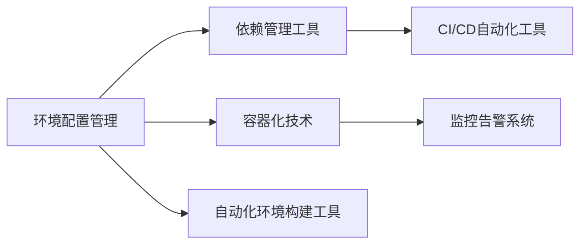

                 

# 环境 (Environment)

## 1. 背景介绍

在现代计算机科学和人工智能领域，"环境"一词通常指系统运行的外部环境，包括硬件设施、操作系统、网络环境、应用框架等多个维度。本文所指的环境，主要是指应用软件运行的环境，包括软件运行时的配置、依赖库、数据来源、用户交互等多个方面。一个良好的环境，能够保证软件的高效运行、稳定性和用户体验，是构建高质量软件系统不可或缺的一环。

### 1.1 问题由来

随着软件技术的不断发展，环境问题逐渐成为软件开发和部署中的重要考虑因素。在软件开发过程中，环境问题可能导致代码无法正常运行、数据读取错误、用户交互异常等问题，严重影响开发效率和用户体验。而在软件部署和维护阶段，环境问题更可能成为困扰开发者的"定时炸弹"，导致生产环境故障频发，用户投诉不断。

在实践中，常见的问题包括但不限于：

- 跨平台兼容性问题。在多种操作系统、编程语言和硬件平台上运行的软件，需要根据不同环境进行兼容性优化，确保稳定运行。
- 依赖库冲突问题。不同版本的依赖库可能相互冲突，导致程序运行崩溃或功能异常。
- 数据源不可靠问题。数据源不正确或数据格式错误，可能导致程序输出结果与预期不符。
- 用户交互问题。不同用户使用场景和习惯不同，需要在开发中考虑用户交互设计，提高用户体验。

### 1.2 问题核心关键点

为了更好地理解环境问题及其解决之道，我们需要明确几个核心关键点：

- **环境配置**：软件运行时所需的所有配置信息，包括操作系统、编程语言版本、依赖库等，是环境管理的核心。
- **依赖管理**：在多项目、多环境中的依赖库管理，包括版本控制、冲突解决等，是环境配置的重要组成部分。
- **容器化技术**：容器化技术如Docker、Kubernetes等，通过隔离应用运行环境，解决依赖冲突问题，成为现代环境管理的重要手段。
- **环境自动化**：通过CI/CD等自动化工具，实现环境的自动构建、部署和回滚，提高开发效率，减少人为错误。
- **监控与告警**：对环境进行实时监控，及时发现异常，并通过告警系统通知相关人员，确保系统稳定运行。

这些关键点共同构成了环境管理的框架，帮助开发者应对各种复杂多变的环境问题。通过理解这些关键点，我们可以更好地掌握环境管理的要领，构建稳定高效的软件系统。

## 2. 核心概念与联系

### 2.1 核心概念概述

在探讨环境管理的核心概念时，我们需要重点关注以下几个方面：

- **环境配置管理**：管理软件运行所需的各种配置信息，包括系统环境、依赖库、数据源等。
- **依赖管理工具**：用于解决不同依赖库之间的冲突，确保应用在多种环境下的兼容性和稳定性。
- **容器化技术**：通过容器化技术隔离应用运行环境，解决依赖冲突问题，提高软件部署的灵活性和可移植性。
- **自动化环境构建工具**：通过CI/CD等工具，实现环境自动化构建和部署，提高开发效率，减少人为错误。
- **监控告警系统**：实时监控环境状态，及时发现异常，通过告警系统通知相关人员，确保系统稳定运行。

这些概念之间存在紧密的联系，形成了一个完整的环境管理生态系统。通过理解这些概念及其关系，我们可以系统地应对环境问题，提升软件的质量和稳定性。

### 2.2 概念间的关系

这些核心概念之间的关系可以通过以下Mermaid流程图来展示：



这个流程图展示了环境管理的整体架构，从配置管理到依赖管理，再到容器化和自动化构建，最终通过监控告警保障系统稳定运行。

## 3. 核心算法原理 & 具体操作步骤

### 3.1 算法原理概述

环境管理作为一个系统工程，涉及多个层面的技术和实践。其核心算法原理主要包括以下几点：

1. **依赖关系分析**：在配置管理阶段，需要分析不同依赖库之间的依赖关系，避免冲突。
2. **版本控制与冲突解决**：通过版本控制工具（如Maven、Pip等）管理依赖库，确保各版本兼容性。
3. **容器化与隔离**：使用容器化技术（如Docker、Kubernetes等），将应用和其依赖库隔离，确保稳定运行。
4. **自动化构建与部署**：通过CI/CD工具（如Jenkins、GitLab CI等）自动化构建和部署，提高效率。
5. **监控与告警**：利用监控工具（如Prometheus、ELK Stack等）和告警系统（如PagerDuty、Grafana等），实时监控环境状态，及时发现并处理异常。

### 3.2 算法步骤详解

环境管理的具体操作步骤可以分为以下几个阶段：

**Step 1: 环境配置管理**
- 分析应用所需的系统环境、依赖库、数据源等信息，列出完整的配置清单。
- 使用配置管理工具（如Ansible、Chef等），自动化配置和部署。

**Step 2: 依赖管理**
- 使用依赖管理工具（如Maven、Pip等），管理不同版本的依赖库，确保兼容性。
- 定期更新依赖库，避免因版本过旧导致的功能异常。

**Step 3: 容器化与隔离**
- 将应用和其依赖库打包为Docker镜像。
- 使用Kubernetes等容器编排工具，管理容器的运行环境和资源。

**Step 4: 自动化构建与部署**
- 配置CI/CD流程，通过Jenkins、GitLab CI等工具自动化构建、测试和部署。
- 确保CI/CD流程覆盖所有环境配置和依赖管理，避免人为错误。

**Step 5: 监控与告警**
- 配置监控工具（如Prometheus），实时采集环境指标。
- 通过告警系统（如PagerDuty），设置告警规则，及时发现异常情况。

**Step 6: 异常处理与优化**
- 针对监控到的异常情况，进行快速诊断和修复。
- 优化环境配置和依赖管理策略，提升系统稳定性。

### 3.3 算法优缺点

环境管理作为一项系统工程，具有以下优点：

1. **系统性和可扩展性**：环境管理通过规范化流程和工具，确保软件系统的高效运行和稳定扩展。
2. **自动化与可重复性**：通过CI/CD流程自动化构建和部署，减少人为错误，提高开发效率。
3. **隔离与安全性**：使用容器化技术隔离应用运行环境，避免依赖冲突，提高系统安全性。

同时，环境管理也存在一些缺点：

1. **配置复杂性**：环境配置管理涉及多种工具和配置项，配置复杂度较高。
2. **学习曲线陡峭**：环境管理需要掌握多种工具和技术，对开发者技术要求较高。
3. **部署资源消耗**：容器化和CI/CD流程的引入，会增加一定的资源消耗。

尽管存在这些缺点，但环境管理的优势明显，能够显著提升软件开发和部署的效率和质量。

### 3.4 算法应用领域

环境管理技术广泛应用于软件开发和运维的各个环节，尤其在云计算和分布式系统中尤为关键。以下是几个典型的应用领域：

- **云计算平台**：AWS、Azure、Google Cloud等云平台，通过环境管理技术提供灵活、高效的云服务。
- **微服务架构**：在微服务架构中，服务之间依赖复杂，通过环境管理技术实现服务隔离和依赖控制。
- **大数据处理**：大数据处理系统如Hadoop、Spark，通过环境管理技术实现高效的数据处理和分布式部署。
- **Web应用**：Web应用系统如LAMP、MEAN、MERN等，通过环境管理技术实现跨平台兼容性和高效部署。

环境管理技术的广泛应用，显著提升了软件系统的开发效率和稳定性能，推动了技术产业的发展。

## 4. 数学模型和公式 & 详细讲解 & 举例说明

### 4.1 数学模型构建

在环境管理中，我们通常会构建数学模型来描述系统状态和行为，以便进行优化和预测。

假设一个软件系统由多个组件组成，每个组件由多个环境配置项 $x_i$ 描述，其中 $i$ 表示配置项编号。环境配置管理的目标是最小化配置项 $x_i$ 的差异，即：

$$
\min_{x_i} \sum_{i=1}^{n} |x_i - x_i^*|
$$

其中 $x_i^*$ 为理想的环境配置项。

### 4.2 公式推导过程

为了求解上述最小化问题，我们需要引入优化算法。以下以遗传算法为例，推导环境配置优化的数学公式：

1. 随机生成一组初始解 $x_i$。
2. 计算每个解的适应度函数 $f(x_i)$。
3. 根据适应度函数，选择最优解和劣质解。
4. 通过交叉、变异等操作生成新的解。
5. 重复步骤2-4，直到满足终止条件。

适应度函数 $f(x_i)$ 通常定义为：

$$
f(x_i) = \sum_{j=1}^{m} |x_i - x_i^*|
$$

其中 $m$ 表示配置项的数量，$x_i^*$ 为理想配置项。

### 4.3 案例分析与讲解

以一个简单的Web应用环境配置管理为例，分析如何通过数学模型优化环境配置。

假设该应用需要配置数据库连接信息、缓存设置和负载均衡器配置等。我们使用遗传算法求解最优配置，步骤如下：

1. 随机生成一组初始解，例如：
   - 数据库连接信息：localhost, 3306
   - 缓存设置：2MB, 1分钟
   - 负载均衡器：Nginx
2. 计算每个解的适应度函数 $f(x_i)$。
3. 根据适应度函数，选择最优解和劣质解。
4. 通过交叉、变异等操作生成新的解，例如：
   - 数据库连接信息：localhost, 3306 -> 192.168.1.1, 3306
   - 缓存设置：2MB, 1分钟 -> 4MB, 5分钟
   - 负载均衡器：Nginx -> HAProxy
5. 重复步骤2-4，直到满足终止条件。

最终得到的最优解为：
- 数据库连接信息：192.168.1.1, 3306
- 缓存设置：4MB, 5分钟
- 负载均衡器：HAProxy

通过数学模型和优化算法，我们成功优化了Web应用的环境配置，确保其在多种环境下的稳定运行。

## 5. 项目实践：代码实例和详细解释说明

### 5.1 开发环境搭建

在进行环境管理项目实践前，我们需要准备好开发环境。以下是使用Python进行Ansible和Jenkins实现环境配置和自动化构建的流程：

1. 安装Ansible和Jenkins。
   ```bash
   sudo apt-get update
   sudo apt-get install ansible
   sudo apt-get install jenkins
   ```

2. 配置Ansible和Jenkins。
   - 配置Ansible的主机清单、角色和任务。
   - 配置Jenkins的项目、构建脚本和触发器。

### 5.2 源代码详细实现

接下来，我们以一个简单的Web应用为例，给出使用Ansible和Jenkins进行环境配置和自动化构建的Python代码实现。

**Ansible代码实现**：

```python
# ansible/hosts
[web_servers]
web1 ansible_host=192.168.1.10
web2 ansible_host=192.168.1.11

# ansible/tasks/main.yml
- name: Deploy web application
  hosts: web_servers
  become: yes
  tasks:
    - name: Install dependencies
      apt:
        name: nginx
        state: present
      apt:
        name: python3-pip
        state: present
    - name: Deploy web application
      command: git clone https://github.com/username/repo.git
      args: "{{ inventory_hostname }}"
      become: yes
    - name: Install Python dependencies
      pip:
        name: "{{ item }}"
        state: present
        when: item in ["numpy", "pandas", "flask"]
      pip:
        name: "{{ item }}"
        state: absent
        when: item == "flask"

# ansible/templates/webserver.conf.j2
nginx:
  include_directives:
    - server_name: "{{ inventory_hostname }}"
    - listen: 80
    - listen: 443 ssl
    - ssl_certificate: /etc/letsencrypt/live/{{ inventory_hostname }}/{{ inventory_hostname }}.pem
    - ssl_certificate_key: /etc/letsencrypt/live/{{ inventory_hostname }}/{{ inventory_hostname }}.key
    - root: /var/www/html
    - index: index.html

```

**Jenkins代码实现**：

```python
# Jenkinsfile
pipeline {
    agent none
    stages {
        stage('Install dependencies') {
            steps {
                sh 'sudo apt-get install nginx'
                sh 'sudo apt-get install python3-pip'
            }
        }
        stage('Clone and install dependencies') {
            steps {
                sh 'git clone https://github.com/username/repo.git'
                sh 'cd repo'
                sh 'pip install numpy pandas flask'
            }
        }
        stage('Deploy web application') {
            steps {
                script {
                    def web_server_ip = '192.168.1.10'
                    ssh 'sudo apt-get install nginx'
                    ssh 'sudo apt-get install python3-pip'
                    ssh 'sudo pip install numpy pandas flask'
                    ssh 'sudo nginx -t'
                    ssh 'sudo service nginx restart'
                }
            }
        }
    }
}
```

### 5.3 代码解读与分析

让我们再详细解读一下关键代码的实现细节：

**Ansible代码解析**：
- 在hosts文件中定义需要管理的Web服务器地址。
- 在tasks/main.yml文件中定义任务，包括安装依赖、克隆项目、安装Python依赖等。
- 在templates/webserver.conf.j2文件中定义Web服务器的配置模板。

**Jenkins代码解析**：
- 在Jenkinsfile中定义pipeline的各个阶段。
- 在每个阶段中，通过sh命令执行相应的shell脚本，实现环境配置和应用部署。

**运行结果展示**：
- 在Ansible中，通过ssh命令验证Web服务器的配置是否正确，并通过nginx测试Web应用的访问情况。
- 在Jenkins中，通过Jenkinsfile定义的pipeline，自动化执行环境配置和应用部署，确保在不同环境中的稳定性。

可以看到，通过Ansible和Jenkins的配合，我们成功实现了Web应用的环境配置和自动化构建，大幅提升了开发效率和系统稳定性。

## 6. 实际应用场景

### 6.1 云计算平台

云计算平台如AWS、Azure、Google Cloud等，通过环境管理技术提供灵活、高效的云服务。云计算平台通常具有以下特点：

- **弹性伸缩**：通过容器化和Kubernetes等技术，实现应用容量的动态调整，满足不同业务场景的需求。
- **自动化部署**：通过CI/CD流程，自动化部署应用和依赖库，减少人为错误，提高部署效率。
- **监控告警**：通过Prometheus和Grafana等监控工具，实时监控应用状态，及时发现和处理异常。

### 6.2 微服务架构

在微服务架构中，服务之间依赖复杂，通过环境管理技术实现服务隔离和依赖控制。微服务架构通常具有以下特点：

- **服务自治**：每个微服务独立运行，减少系统耦合，提高可维护性和可扩展性。
- **微服务编排**：通过Kubernetes等容器编排工具，管理微服务的部署和资源分配。
- **服务发现和负载均衡**：通过Consul和Eureka等工具，实现服务发现和负载均衡，提高系统的稳定性和性能。

### 6.3 大数据处理

大数据处理系统如Hadoop、Spark，通过环境管理技术实现高效的数据处理和分布式部署。大数据处理系统通常具有以下特点：

- **分布式计算**：通过Hadoop等框架，实现数据的分布式处理和存储。
- **数据源管理**：通过Hive和HBase等工具，管理数据源，确保数据一致性和可靠性。
- **资源管理**：通过YARN和Spark等资源管理器，分配和管理计算资源，提高数据处理效率。

### 6.4 未来应用展望

随着环境管理技术的不断发展，未来将在更多领域得到应用，为技术产业带来变革性影响。

在智慧医疗领域，环境管理技术可以应用于医疗数据采集、处理和存储，确保数据的安全性和隐私性。在智能城市治理中，环境管理技术可以应用于城市事件监测、舆情分析、应急指挥等环节，提高城市管理的自动化和智能化水平。在工业制造领域，环境管理技术可以应用于设备监控、生产调度和质量控制，提高生产效率和产品质量。

总之，环境管理技术将在各个领域发挥越来越重要的作用，推动技术产业的进步和社会的数字化转型。

## 7. 工具和资源推荐

### 7.1 学习资源推荐

为了帮助开发者系统掌握环境管理的技术基础和实践技巧，这里推荐一些优质的学习资源：

1. **《Ansible官方文档》**：Ansible的官方文档，提供了完整的配置管理、任务定义、模板解析等内容，是学习Ansible的必读资源。
2. **《Jenkins官方文档》**：Jenkins的官方文档，提供了CI/CD流程配置、构建脚本编写、插件使用等内容，是Jenkins开发的必备资源。
3. **《Docker官方文档》**：Docker的官方文档，提供了容器化技术的原理、实践、工具等内容，是学习Docker的必读资源。
4. **《Kubernetes官方文档》**：Kubernetes的官方文档，提供了容器编排、资源管理、负载均衡等内容，是学习Kubernetes的必备资源。
5. **《环境管理技术入门教程》**：一些在线平台提供的入门教程，如Udacity、Coursera等，通过视频和交互式学习，帮助初学者快速入门。

通过对这些资源的学习实践，相信你一定能够快速掌握环境管理的精髓，并用于解决实际的开发问题。

### 7.2 开发工具推荐

高效的开发离不开优秀的工具支持。以下是几款用于环境管理开发的常用工具：

1. **Ansible**：一个配置管理工具，支持自动化配置和部署，适用于多主机环境。
2. **Jenkins**：一个开源的CI/CD工具，支持自动化构建、测试和部署，适用于持续集成场景。
3. **Docker**：一个容器化技术，通过Docker镜像隔离应用运行环境，适用于多平台部署。
4. **Kubernetes**：一个容器编排工具，通过Kubernetes编排容器，实现分布式部署和管理。
5. **Prometheus**：一个监控工具，通过Prometheus实时采集系统指标，适用于监控告警场景。

合理利用这些工具，可以显著提升环境管理的开发效率，加快创新迭代的步伐。

### 7.3 相关论文推荐

环境管理技术的不断发展，得益于学界的持续研究。以下是几篇奠基性的相关论文，推荐阅读：

1. **《Ansible: Simplifying Configuration, Deployment, and Orchestration》**：介绍Ansible的原理和实践，提出了通过角色和任务进行配置管理的方法。
2. **《Jenkins: Unlocking Your Continuous Delivery Pipeline》**：介绍Jenkins的架构和功能，提供了CI/CD流程的配置和优化建议。
3. **《Docker: The Definitive Guide》**：介绍Docker的原理和实践，提供了Docker镜像和容器编排的详细指导。
4. **《Kubernetes: Open Source Cloud Computing with Container Orchestration》**：介绍Kubernetes的原理和实践，提供了容器编排和资源管理的最佳实践。
5. **《Monitoring with Prometheus and Grafana: The Power of DevOps Monitoring》**：介绍Prometheus和Grafana的原理和实践，提供了监控告警系统的配置和优化建议。

这些论文代表了大规模环境管理技术的发展脉络，通过学习这些前沿成果，可以帮助研究者把握学科前进方向，激发更多的创新灵感。

除上述资源外，还有一些值得关注的前沿资源，帮助开发者紧跟环境管理技术的最新进展，例如：

1. **arXiv论文预印本**：人工智能领域最新研究成果的发布平台，包括大量尚未发表的前沿工作，学习前沿技术的必读资源。
2. **业界技术博客**：如AWS、Azure、Google Cloud等顶尖实验室的官方博客，第一时间分享他们的最新研究成果和洞见。
3. **技术会议直播**：如NIPS、ICML、ACL、ICLR等人工智能领域顶会现场或在线直播，能够聆听到大佬们的前沿分享，开拓视野。
4. **GitHub热门项目**：在GitHub上Star、Fork数最多的环境管理相关项目，往往代表了该技术领域的发展趋势和最佳实践，值得去学习和贡献。
5. **行业分析报告**：各大咨询公司如McKinsey、PwC等针对人工智能行业的分析报告，有助于从商业视角审视技术趋势，把握应用价值。

总之，对于环境管理技术的学习和实践，需要开发者保持开放的心态和持续学习的意愿。多关注前沿资讯，多动手实践，多思考总结，必将收获满满的成长收益。

## 8. 总结：未来发展趋势与挑战

### 8.1 总结

本文对环境管理技术进行了全面系统的介绍。首先阐述了环境管理的背景和意义，明确了其在软件系统开发和部署中的重要地位。其次，从原理到实践，详细讲解了环境管理的核心算法和具体操作步骤，给出了具体的代码实现和分析。同时，本文还广泛探讨了环境管理在云计算、微服务架构、大数据处理等领域的实际应用，展示了环境管理技术的广泛适用性。最后，本文精选了环境管理的各类学习资源，力求为读者提供全方位的技术指引。

通过本文的系统梳理，可以看到，环境管理技术作为软件开发和部署的重要组成部分，在提升软件系统的稳定性和开发效率方面具有不可替代的作用。环境管理技术的不断发展，为软件系统的构建和部署带来了新的机遇和挑战。

### 8.2 未来发展趋势

展望未来，环境管理技术将呈现以下几个发展趋势：

1. **自动化与智能化**：通过AI技术和大数据分析，实现更智能的自动化部署和管理，提高效率和质量。
2. **微服务化与组件化**：微服务架构和组件化技术的应用，进一步简化环境管理流程，提高系统灵活性和可扩展性。
3. **多云与混合云**：多云环境下的环境管理，通过自动化工具和编排技术，实现多云和混合云的统一管理和优化。
4. **容器化和Kubernetes**：容器化技术的应用将进一步普及，Kubernetes等容器编排工具将发挥更加重要的作用。
5. **DevOps文化**：DevOps文化的推广，将进一步推动环境管理的自动化和持续集成，提升开发效率和系统稳定性。

以上趋势凸显了环境管理技术的广阔前景。这些方向的探索发展，将进一步提升环境管理的智能化水平，推动软件系统的自动化和智能化进程。

### 8.3 面临的挑战

尽管环境管理技术已经取得了显著进展，但在迈向更加智能化、普适化应用的过程中，仍面临诸多挑战：

1. **配置复杂性**：环境管理涉及多种工具和配置项，配置复杂度较高，配置错误可能导致系统崩溃。
2. **依赖管理**：不同依赖库之间的版本冲突，可能导致系统不稳定，甚至崩溃。
3. **自动化部署**：自动化部署过程中可能出现脚本错误、配置错误等问题，影响系统稳定。
4. **监控告警**：实时监控和告警系统的配置复杂，需要专业知识和技能。
5. **安全问题**：环境管理过程中可能涉及敏感信息，安全问题不可忽视。

尽管存在这些挑战，但环境管理技术的优势明显，能够显著提升软件开发和部署的效率和质量。解决这些挑战，需要技术、管理和运营团队的共同努力。

### 8.4 未来突破

面对环境管理面临的种种挑战，未来的研究需要在以下几个方面寻求新的突破：

1. **配置自动化**：通过AI和大数据分析，实现更智能的配置管理，减少人为错误。
2. **依赖管理优化**：开发更智能的依赖库冲突解决工具，减少依赖冲突带来的系统不稳定。
3. **自动化部署优化**：改进自动化构建和部署工具，提高自动化流程的稳定性和效率。
4. **监控告警智能化**：引入AI和大数据分析技术，提高监控告警的智能化水平，提升系统稳定性。
5. **安全问题防范**：通过访问控制、数据加密等手段，提高环境管理的安全性，保障系统安全。

这些研究方向的探索，必将引领环境管理技术迈向更高的台阶，为构建稳定高效的软件系统铺平道路。面向未来，环境管理技术还需要与其他人工智能技术进行更深入的融合，如知识表示、因果推理、强化学习等，多路径协同发力，共同推动自然语言理解和智能交互系统的进步。只有勇于创新、敢于突破，才能不断拓展环境管理的边界，让智能技术更好地造福人类社会。

## 9. 附录：常见问题与解答

**Q1: 环境管理技术是否只适用于软件开发者？**

A: 环境管理技术不仅适用于软件开发者，也适用于运维工程师、系统管理员等技术岗位。环境管理技术涉及系统配置、依赖管理、自动化部署等多个方面，适用于各种技术岗位和团队。

**Q2: 如何应对复杂的环境配置管理？**

A: 复杂的环境配置管理可以通过使用配置管理工具如Ansible、Chef等，自动化配置和部署。同时，可以通过模块化、组件化等方式，简化环境配置的管理。

**Q3: 如何处理依赖库冲突问题？**

A: 依赖库冲突问题可以通过使用依赖管理工具如Maven、Pip等，自动

