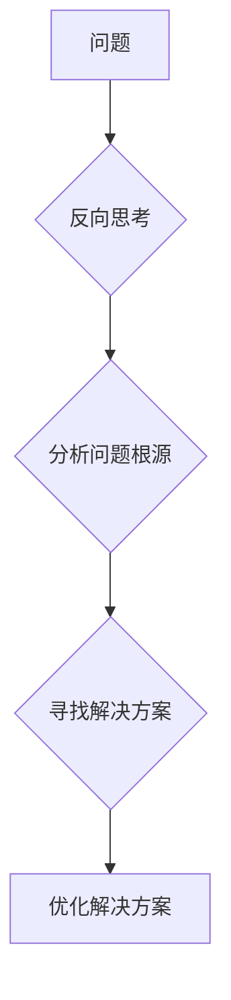

## 像数学家一样思考：相反原则

> 关键词：逻辑思维、反向思维、算法设计、数学模型、程序设计、问题解决

### 1. 背景介绍

在瞬息万变的科技时代，作为程序员、软件架构师，我们必须具备敏锐的逻辑思维能力和高效的解决问题的能力。传统的编程思维模式往往局限于“如何做”，而数学家则擅长从“为什么不这样做”的角度出发，通过反向思维来探索问题的本质。

本文将探讨如何像数学家一样思考，运用“相反原则”来提升我们的编程能力，帮助我们设计更优雅、更高效的算法和软件架构。

### 2. 核心概念与联系

**相反原则**的核心在于，在面对问题时，不要局限于寻找直接的解决方案，而是尝试从反面思考，分析问题的本质，找出问题的根源，从而找到更有效的解决方法。

**数学家思维与编程思维的联系**

* **抽象化:**  数学家擅长将复杂问题抽象成简洁的数学模型，而程序员也需要将现实世界的问题抽象成代码可以理解的形式。
* **逻辑推理:** 数学家依赖逻辑推理来证明定理和解决问题，程序员也需要运用逻辑思维来编写正确的代码。
* **严谨性:** 数学家追求严谨的逻辑和推理，程序员也需要编写清晰、可读、可维护的代码。

**Mermaid 流程图**



### 3. 核心算法原理 & 具体操作步骤

**3.1 算法原理概述**

反向思维在算法设计中可以帮助我们找到更简洁、更高效的解决方案。例如，在排序算法中，我们可以尝试从反向排序开始，然后逐步调整，最终达到目标排序。

**3.2 算法步骤详解**

1. **反向定义目标:**  明确反向目标，例如，反向排序算法的目标是将数据从大到小排列。
2. **反向设计步骤:**  设计反向操作步骤，例如，反向排序算法可以先将数据从大到小进行排序，然后逐步调整，直到达到目标排序。
3. **验证和优化:**  验证反向算法的正确性和效率，并进行必要的优化。

**3.3 算法优缺点**

* **优点:**  可以帮助我们找到更简洁、更高效的解决方案。
* **缺点:**  需要一定的思维训练，才能熟练运用反向思维。

**3.4 算法应用领域**

* 排序算法
* 搜索算法
* 图算法
* 决策树算法

### 4. 数学模型和公式 & 详细讲解 & 举例说明

**4.1 数学模型构建**

我们可以用数学模型来描述反向思维的过程。例如，我们可以用一个函数来表示反向操作，这个函数将输入数据转换为反向数据。

**4.2 公式推导过程**

假设我们有一个函数 f(x) ，它将输入数据 x 转换为输出数据 y。那么，反向操作函数 g(y) 将输出数据 y 转换为输入数据 x。

我们可以推导出以下公式：

$$g(f(x)) = x$$

**4.3 案例分析与讲解**

例如，我们有一个函数 f(x) = x^2 ，它将输入数据 x 转换为输出数据 y = x^2。那么，反向操作函数 g(y) 可以用以下公式表示：

$$g(y) = \sqrt{y}$$

### 5. 项目实践：代码实例和详细解释说明

**5.1 开发环境搭建**

我们可以在任何支持 Python 的开发环境中进行实践，例如 PyCharm、VS Code 等。

**5.2 源代码详细实现**

```python
def reverse_string(s):
  """反向字符串

  Args:
    s: 字符串

  Returns:
    反向字符串
  """
  return s[::-1]

# 测试代码
string = "hello world"
reversed_string = reverse_string(string)
print(f"原字符串: {string}")
print(f"反向字符串: {reversed_string}")
```

**5.3 代码解读与分析**

这段代码实现了反向字符串的功能。

* `reverse_string(s)` 函数接受一个字符串 `s` 作为输入。
* `s[::-1]` 使用 Python 的切片语法，从字符串的末尾开始，以步长 -1 遍历字符串，从而实现反向操作。
* 函数返回反向后的字符串。

**5.4 运行结果展示**

```
原字符串: hello world
反向字符串: dlrow olleh
```

### 6. 实际应用场景

反向思维在软件开发中有很多实际应用场景，例如：

* **错误调试:**  当程序出现错误时，我们可以尝试从反向思考，分析错误产生的原因，从而找到解决方案。
* **算法优化:**  我们可以尝试从反向思考，分析算法的瓶颈，从而找到优化算法的思路。
* **设计模式:**  一些设计模式，例如反模式，就是基于反向思维设计的。

**6.4 未来应用展望**

随着人工智能技术的不断发展，反向思维将被应用于更广泛的领域，例如：

* 自动化测试
* 代码生成
* 安全漏洞检测

### 7. 工具和资源推荐

**7.1 学习资源推荐**

* 《像数学家一样思考》
* 《数学思维》
* 《编程之美》

**7.2 开发工具推荐**

* PyCharm
* VS Code
* Jupyter Notebook

**7.3 相关论文推荐**

* “反向思维在软件开发中的应用”
* “反向思维算法的设计与实现”

### 8. 总结：未来发展趋势与挑战

**8.1 研究成果总结**

本文探讨了反向思维在编程中的应用，并介绍了反向思维的原理、算法、数学模型以及实际应用场景。

**8.2 未来发展趋势**

未来，反向思维将被更加广泛地应用于软件开发领域，并与人工智能技术相结合，形成更强大的软件开发工具和方法。

**8.3 面临的挑战**

反向思维需要一定的思维训练，如何将反向思维的理念推广到更广泛的程序员群体，是需要克服的挑战。

**8.4 研究展望**

未来，我们可以进一步研究反向思维在不同编程领域中的应用，并探索反向思维与人工智能技术的结合，开发更智能、更高效的软件开发工具。

### 9. 附录：常见问题与解答

**Q1: 如何培养反向思维能力？**

A1: 可以通过以下方法培养反向思维能力：

* 经常思考问题的反面
* 尝试从不同的角度看待问题
* 练习反向推理

**Q2: 反向思维适用于哪些编程场景？**

A2: 反向思维适用于以下编程场景：

* 错误调试
* 算法优化
* 设计模式

**Q3: 反向思维与正向思维的关系是什么？**

A3: 反向思维和正向思维是互补的，两者结合可以帮助我们更全面地解决问题。


作者：禅与计算机程序设计艺术 / Zen and the Art of Computer Programming