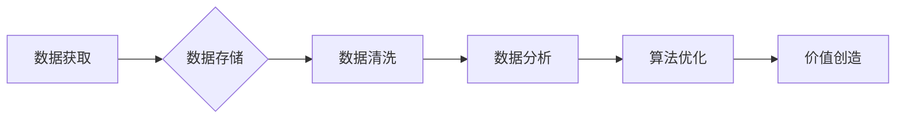

## 全球经济存量争夺的长期现象

> 关键词：存量经济、数据竞争、算法优化、技术垄断、经济结构转型、数字基础设施、人工智能、数据安全

## 1. 背景介绍

全球经济正经历着一场深刻的变革，从传统的生产要素驱动向数据要素驱动转变。随着互联网、移动互联网、大数据、人工智能等技术的快速发展，数据已成为新的生产要素，并逐渐成为经济增长的关键驱动力。然而，数据本身并没有价值，只有经过加工、分析和应用才能创造价值。因此，如何有效获取、利用和管理数据，成为了企业和国家竞争的核心。

当前，全球范围内存在着大量的存量数据，这些数据蕴藏着巨大的价值潜力。然而，由于数据分散、孤岛化、标准化程度低等问题，这些数据难以被有效利用。因此，全球经济正在进入一个新的阶段，即“存量经济”时代。在这个时代，企业和国家将围绕着存量数据的获取、利用和控制展开激烈竞争。

## 2. 核心概念与联系

**2.1 存量经济**

存量经济是指在资源相对稀缺的情况下，通过对现有资源的优化利用和再创造，实现经济增长的模式。在存量经济中，数据作为重要的生产要素，其价值主要体现在以下几个方面：

* **信息价值:** 数据可以提供对市场、用户、竞争对手等方面的洞察，帮助企业做出更明智的决策。
* **预测价值:** 通过对历史数据的分析，可以预测未来的趋势，帮助企业提前做好准备。
* **个性化价值:** 数据可以帮助企业了解用户的需求和偏好，提供更个性化的产品和服务。

**2.2 数据竞争**

数据竞争是指企业和国家为了获取、利用和控制数据资源而展开的竞争。数据竞争的本质是资源竞争，也是技术竞争。

* **获取数据:** 企业和国家可以通过各种方式获取数据，例如购买、合作、采集等。
* **利用数据:** 企业和国家可以通过数据分析、机器学习等技术，挖掘数据中的价值。
* **控制数据:** 企业和国家可以通过数据标准、数据安全等措施，控制数据的流通和使用。

**2.3 算法优化**

算法优化是指通过改进算法的效率和准确性，提高数据处理和分析能力。算法优化是数据竞争的关键环节，也是存量经济发展的重要驱动力。

**Mermaid 流程图**



## 3. 核心算法原理 & 具体操作步骤

**3.1 算法原理概述**

存量经济中常用的算法主要包括：

* **机器学习算法:** 用于从数据中学习模式和规律，进行预测和分类。
* **深度学习算法:** 一种更高级的机器学习算法，能够处理更复杂的数据。
* **自然语言处理算法:** 用于处理和分析文本数据。
* **图像识别算法:** 用于识别和理解图像数据。

这些算法通过对数据进行训练和测试，不断优化模型参数，最终能够实现对数据的有效处理和分析。

**3.2 算法步骤详解**

以机器学习算法为例，其基本步骤包括：

1. **数据收集和预处理:** 收集相关数据，并进行清洗、转换、特征提取等预处理工作。
2. **模型选择:** 根据具体任务选择合适的机器学习模型。
3. **模型训练:** 使用训练数据对模型进行训练，调整模型参数。
4. **模型评估:** 使用测试数据评估模型的性能，例如准确率、召回率等。
5. **模型部署:** 将训练好的模型部署到实际应用场景中。

**3.3 算法优缺点**

* **优点:** 能够自动学习数据中的模式和规律，提高数据处理和分析效率。
* **缺点:** 需要大量的训练数据，训练过程耗时和耗能。模型的解释性较差，难以理解模型的决策过程。

**3.4 算法应用领域**

* **金融领域:** 风险评估、欺诈检测、客户画像等。
* **医疗领域:** 疾病诊断、药物研发、个性化医疗等。
* **零售领域:** 商品推荐、库存管理、客户服务等。
* **交通领域:** 交通预测、智能驾驶、物流优化等。

## 4. 数学模型和公式 & 详细讲解 & 举例说明

**4.1 数学模型构建**

存量经济中的数据竞争可以抽象为一个博弈模型。假设存在两个企业 A 和 B，它们都拥有大量的存量数据，并试图通过算法优化来获取更大的经济利益。

**4.2 公式推导过程**

企业 A 和 B 的利润可以分别表示为：

*  $P_A = f(D_A, A_A, D_B, A_B)$
*  $P_B = f(D_B, A_B, D_A, A_A)$

其中：

* $D_A$ 和 $D_B$ 分别表示企业 A 和 B 的数据规模。
* $A_A$ 和 $A_B$ 分别表示企业 A 和 B 的算法优化水平。

**4.3 案例分析与讲解**

假设企业 A 和 B 都拥有相同的初始数据规模，但企业 A 的算法优化水平高于企业 B。根据公式推导过程，我们可以得出结论：

* 企业 A 的利润将高于企业 B。
* 企业 A 的数据竞争优势将更加明显。

**举例说明:**

在电商领域，拥有大量用户数据的平台可以利用机器学习算法进行精准推荐，提高用户转化率，从而获得更高的利润。

## 5. 项目实践：代码实例和详细解释说明

**5.1 开发环境搭建**

* 操作系统: Ubuntu 20.04
* 编程语言: Python 3.8
* 开发工具: Jupyter Notebook
* 库依赖: pandas, scikit-learn, matplotlib

**5.2 源代码详细实现**

```python
import pandas as pd
from sklearn.model_selection import train_test_split
from sklearn.linear_model import LogisticRegression
from sklearn.metrics import accuracy_score

# 加载数据
data = pd.read_csv('data.csv')

# 分割数据
X = data.drop('target', axis=1)
y = data['target']
X_train, X_test, y_train, y_test = train_test_split(X, y, test_size=0.2, random_state=42)

# 训练模型
model = LogisticRegression()
model.fit(X_train, y_train)

# 预测结果
y_pred = model.predict(X_test)

# 计算准确率
accuracy = accuracy_score(y_test, y_pred)
print(f'准确率: {accuracy}')
```

**5.3 代码解读与分析**

* 代码首先加载数据，并使用 pandas 库进行数据处理。
* 然后使用 scikit-learn 库进行数据分割和模型训练。
* 训练模型后，使用测试数据进行预测，并计算模型的准确率。

**5.4 运行结果展示**

运行代码后，会输出模型的准确率。

## 6. 实际应用场景

**6.1 金融领域**

* **风险评估:** 利用存量数据分析客户的信用风险，为贷款审批提供依据。
* **欺诈检测:** 通过分析交易数据，识别异常交易行为，防止金融欺诈。

**6.2 医疗领域**

* **疾病诊断:** 利用患者的医疗历史数据和症状信息，辅助医生进行疾病诊断。
* **药物研发:** 分析大量生物数据，加速药物研发过程。

**6.3 零售领域**

* **商品推荐:** 根据用户的购买历史和浏览记录，推荐个性化的商品。
* **库存管理:** 利用销售数据预测未来需求，优化库存管理。

**6.4 未来应用展望**

随着人工智能技术的不断发展，存量经济将应用于更多领域，例如教育、能源、交通等。

## 7. 工具和资源推荐

**7.1 学习资源推荐**

* **书籍:**
    * 《深度学习》
    * 《机器学习实战》
    * 《数据挖掘导论》
* **在线课程:**
    * Coursera
    * edX
    * Udacity

**7.2 开发工具推荐**

* **Python:** 
    * Jupyter Notebook
    * PyCharm
* **数据分析工具:**
    * pandas
    * scikit-learn
    * TensorFlow

**7.3 相关论文推荐**

* 《Attention Is All You Need》
* 《BERT: Pre-training of Deep Bidirectional Transformers for Language Understanding》
* 《Generative Adversarial Networks》

## 8. 总结：未来发展趋势与挑战

**8.1 研究成果总结**

存量经济的研究成果表明，数据是新的生产要素，算法优化是数据竞争的关键环节。人工智能技术的发展为存量经济的发展提供了强大的技术支撑。

**8.2 未来发展趋势**

* 数据规模和质量的不断提升
* 算法模型的不断创新
* 数据安全和隐私保护的加强

**8.3 面临的挑战**

* 数据孤岛化和标准化程度低
* 数据安全和隐私保护问题
* 算法解释性和可信度问题

**8.4 研究展望**

未来研究将重点关注以下几个方面：

* 如何有效解决数据孤岛化问题
* 如何开发更安全、更可靠的算法模型
* 如何提高算法的解释性和可信度


## 9. 附录：常见问题与解答

**9.1 如何获取高质量的数据？**

高质量的数据可以从以下几个方面获取：

* **公开数据:** 政府、学术机构等发布的公开数据。
* **商业数据:** 企业内部的数据，例如销售数据、用户数据等。
* **数据采集:** 使用传感器、网络爬虫等技术采集数据。

**9.2 如何保护数据安全和隐私？**

数据安全和隐私保护可以通过以下措施来实现：

* **数据加密:** 对数据进行加密，防止未授权访问。
* **数据脱敏:** 对敏感数据进行脱敏处理，保护用户隐私。
* **访问控制:** 设置严格的访问控制机制，防止数据泄露。


作者：禅与计算机程序设计艺术 / Zen and the Art of Computer Programming 
