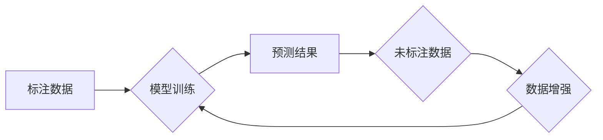

## 关键词：半监督学习、机器学习、监督学习、无监督学习、标签数据、数据标注、算法原理、代码实例、实践应用

## 1. 背景介绍

在机器学习领域，训练模型通常依赖于大量的标注数据。然而，获取高质量标注数据往往成本高昂且耗时费力。半监督学习 (Semi-Supervised Learning) 应运而生，它利用少量标注数据和大量未标注数据来训练模型，从而降低对标注数据的依赖。

半监督学习在图像识别、自然语言处理、语音识别等领域展现出巨大的潜力。例如，在图像分类任务中，我们可以利用少量标注图像和大量未标注图像来训练模型，从而提高模型的准确率。

## 2. 核心概念与联系

半监督学习的核心思想是利用未标注数据的结构信息来辅助标注数据的学习。它结合了监督学习和无监督学习的优势，在数据有限的情况下，能够获得更好的模型性能。

**流程图:**



**核心概念:**

* **监督学习:** 利用标注数据训练模型，模型学习数据的标签与特征之间的关系。
* **无监督学习:** 利用未标注数据学习数据的内在结构和规律，例如聚类、降维等。
* **半监督学习:** 利用少量标注数据和大量未标注数据训练模型，结合监督学习和无监督学习的优势。

## 3. 核心算法原理 & 具体操作步骤

### 3.1  算法原理概述

半监督学习算法的核心是利用未标注数据的结构信息来辅助标注数据的学习。常见的半监督学习算法包括：

* **基于图的算法:** 将数据点表示为图中的节点，利用节点之间的连接关系来学习数据的结构信息。
* **基于概率的算法:** 利用概率模型来学习数据分布，并利用未标注数据的概率信息来辅助标注数据的学习。
* **自训练算法:** 利用初始模型对未标注数据进行预测，并将预测结果作为新的标注数据，然后重新训练模型。

### 3.2  算法步骤详解

以基于图的算法为例，其具体操作步骤如下：

1. **构建图:** 将数据点表示为图中的节点，节点之间的连接关系可以根据数据之间的相似度来确定。
2. **学习图结构:** 利用图结构信息来学习数据的内在结构和规律。
3. **利用图结构辅助标注数据学习:** 将图结构信息融入到监督学习算法中，例如支持向量机 (SVM) 或逻辑回归 (Logistic Regression)，从而提高模型的学习效率。

### 3.3  算法优缺点

**优点:**

* 可以利用大量未标注数据，降低对标注数据的依赖。
* 在数据有限的情况下，能够获得更好的模型性能。

**缺点:**

* 需要设计合适的图结构，才能有效利用未标注数据的结构信息。
* 算法的复杂度较高，训练时间较长。

### 3.4  算法应用领域

* **图像识别:** 利用少量标注图像和大量未标注图像来训练图像分类模型。
* **自然语言处理:** 利用少量标注文本和大量未标注文本来训练文本分类模型。
* **语音识别:** 利用少量标注语音数据和大量未标注语音数据来训练语音识别模型。

## 4. 数学模型和公式 & 详细讲解 & 举例说明

### 4.1  数学模型构建

半监督学习算法通常基于概率模型，例如贝叶斯模型或最大似然估计。

**贝叶斯模型:**

假设数据服从某个概率分布，则可以使用贝叶斯定理来更新模型的参数。

**最大似然估计:**

寻找最能解释观测数据的模型参数。

### 4.2  公式推导过程

具体公式推导过程取决于具体的半监督学习算法。

**举例说明:**

假设我们有一个二分类问题，数据点 $x$ 属于类别 $y$ 的概率为 $P(y|x)$。

根据贝叶斯定理，我们可以得到：

$$P(y|x) = \frac{P(x|y)P(y)}{P(x)}$$

其中：

* $P(x|y)$ 是给定类别 $y$ 下数据点 $x$ 的概率。
* $P(y)$ 是类别 $y$ 的先验概率。
* $P(x)$ 是数据点 $x$ 的边缘概率。

### 4.3  案例分析与讲解

在图像分类任务中，我们可以使用半监督学习算法来训练模型。

假设我们有一个包含少量标注图像和大量未标注图像的数据集。

我们可以使用基于图的算法来构建一个图，其中每个节点代表一个图像，节点之间的连接关系根据图像之间的相似度来确定。

然后，我们可以利用图结构信息来辅助标注数据的学习，例如使用支持向量机 (SVM) 来训练分类模型。

## 5. 项目实践：代码实例和详细解释说明

### 5.1  开发环境搭建

* Python 3.x
* TensorFlow 或 PyTorch
* 其他必要的库，例如 NumPy、Scikit-learn 等

### 5.2  源代码详细实现

```python
import tensorflow as tf

# 定义模型
model = tf.keras.models.Sequential([
    tf.keras.layers.Flatten(input_shape=(28, 28)),
    tf.keras.layers.Dense(128, activation='relu'),
    tf.keras.layers.Dropout(0.5),
    tf.keras.layers.Dense(10, activation='softmax')
])

# 定义损失函数和优化器
loss_fn = tf.keras.losses.SparseCategoricalCrossentropy()
optimizer = tf.keras.optimizers.Adam()

# 定义训练步骤
def train_step(images, labels):
    with tf.GradientTape() as tape:
        predictions = model(images)
        loss = loss_fn(labels, predictions)
    gradients = tape.gradient(loss, model.trainable_variables)
    optimizer.apply_gradients(zip(gradients, model.trainable_variables))

# 训练模型
for epoch in range(10):
    for batch in data_generator:
        images, labels = batch
        train_step(images, labels)
```

### 5.3  代码解读与分析

* 代码首先定义了一个简单的卷积神经网络模型。
* 然后定义了损失函数和优化器。
* 训练步骤函数 `train_step` 计算模型的损失值，并使用梯度下降算法更新模型参数。
* 最后，代码使用数据生成器迭代训练模型。

### 5.4  运行结果展示

训练完成后，我们可以使用测试集评估模型的性能。

```python
test_loss, test_acc = model.evaluate(test_images, test_labels)
print('Test accuracy:', test_acc)
```

## 6. 实际应用场景

半监督学习在许多实际应用场景中发挥着重要作用，例如：

* **图像识别:** 利用少量标注图像和大量未标注图像来训练图像分类模型，例如识别物体、场景、人脸等。
* **自然语言处理:** 利用少量标注文本和大量未标注文本来训练文本分类模型，例如情感分析、主题分类、文本摘要等。
* **语音识别:** 利用少量标注语音数据和大量未标注语音数据来训练语音识别模型，例如语音转文本、语音搜索等。

### 6.4  未来应用展望

随着数据量的不断增长和算法的不断改进，半监督学习将在未来发挥更加重要的作用。

例如，我们可以利用半监督学习来训练更强大的人工智能模型，例如通用人工智能 (AGI)。

## 7. 工具和资源推荐

### 7.1  学习资源推荐

* **书籍:**
    * 半监督学习 (Semi-Supervised Learning) - Christopher M. Bishop
    * Pattern Recognition and Machine Learning - Christopher M. Bishop
* **论文:**
    * Semi-Supervised Learning - Andrew Ng
    * A Survey on Semi-Supervised Learning -  Jian-Tao Sun
* **在线课程:**
    * Coursera - Machine Learning by Andrew Ng
    * Udacity - Deep Learning Nanodegree

### 7.2  开发工具推荐

* **TensorFlow:** 开源深度学习框架，支持半监督学习算法。
* **PyTorch:** 开源深度学习框架，支持半监督学习算法。
* **Scikit-learn:** Python机器学习库，提供一些半监督学习算法。

### 7.3  相关论文推荐

* Semi-Supervised Learning with Graph Convolutional Networks - Kipf & Welling
* Label Propagation for Large Scale Semi-Supervised Learning - Zhu & Goldberg
* Self-Training with an Ensemble of Classifiers -  Nigam & Ghani

## 8. 总结：未来发展趋势与挑战

### 8.1  研究成果总结

半监督学习在过去几十年取得了显著进展，在许多实际应用场景中取得了成功。

### 8.2  未来发展趋势

* **算法创新:** 研究更有效的半监督学习算法，例如基于生成对抗网络 (GAN) 的半监督学习算法。
* **数据增强:** 研究更有效的半监督学习数据增强方法，例如迁移学习、主动学习等。
* **应用扩展:** 将半监督学习应用到更多新的领域，例如医疗诊断、金融风险评估等。

### 8.3  面临的挑战

* **数据质量:** 半监督学习算法对未标注数据的质量要求较高，如何获取高质量未标注数据仍然是一个挑战。
* **算法解释性:** 许多半监督学习算法的内部机制难以解释，如何提高算法的解释性仍然是一个研究方向。
* **计算效率:** 一些半监督学习算法的计算复杂度较高，如何提高算法的计算效率仍然是一个挑战。

### 8.4  研究展望

半监督学习是一个充满挑战和机遇的领域，未来将会有更多的研究成果涌现，推动半监督学习技术的发展和应用。

## 9. 附录：常见问题与解答

* **什么是半监督学习？**

半监督学习是一种机器学习方法，它利用少量标注数据和大量未标注数据来训练模型。

* **半监督学习的优势是什么？**

半监督学习可以利用大量未标注数据，降低对标注数据的依赖，在数据有限的情况下，能够获得更好的模型性能。

* **半监督学习有哪些应用场景？**

半监督学习在图像识别、自然语言处理、语音识别等领域都有广泛的应用。

* **如何选择合适的半监督学习算法？**

选择合适的半监督学习算法取决于具体的应用场景和数据特点。

* **如何评估半监督学习模型的性能？**

可以使用测试集评估半监督学习模型的性能，例如准确率、召回率、F1-score 等。


作者：禅与计算机程序设计艺术 / Zen and the Art of Computer Programming 
