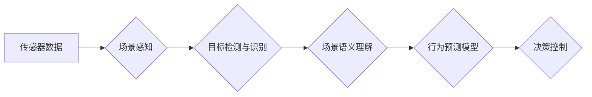

## 场景理解与行为预测技术在自动驾驶中的新发展

> 关键词：自动驾驶、场景理解、行为预测、深度学习、计算机视觉、强化学习、预测模型

## 1. 背景介绍

自动驾驶技术作为未来交通运输的重要发展方向，其核心在于让车辆能够感知周围环境、理解场景含义以及预测其他路人的行为，从而做出安全、高效的决策。场景理解与行为预测技术作为自动驾驶的关键技术之一，旨在帮助车辆构建对周围环境的完整认知，并预测其他道路参与者的行为，从而实现安全、可靠的自动驾驶。

传统的自动驾驶系统主要依赖于传感器数据，如激光雷达、摄像头和雷达等，通过数据处理和分析来感知周围环境。然而，仅仅依靠传感器数据难以完全理解复杂的交通场景，例如识别行人、车辆和障碍物的类别、状态和意图等。随着深度学习技术的快速发展，场景理解与行为预测技术取得了显著进展。深度学习模型能够从海量数据中学习复杂的特征和模式，从而实现更准确、更可靠的场景理解和行为预测。

## 2. 核心概念与联系

**2.1 场景理解**

场景理解是指车辆对周围环境的感知和理解，包括识别和分类道路参与者（如行人、车辆、自行车等）、识别道路设施（如交通信号灯、道路标线等）、理解交通规则和场景上下文等。

**2.2 行为预测**

行为预测是指预测其他道路参与者的未来行为，例如行人的移动轨迹、车辆的转向意图、骑手的加速减速情况等。

**2.3 核心概念架构**



## 3. 核心算法原理 & 具体操作步骤

**3.1 算法原理概述**

场景理解与行为预测技术通常采用深度学习算法，例如卷积神经网络（CNN）、循环神经网络（RNN）和强化学习（RL）等。

* **CNN** 用于提取图像特征，识别和分类道路参与者和道路设施。
* **RNN** 用于处理时间序列数据，例如车辆轨迹和行人运动轨迹，并预测未来行为。
* **RL** 用于训练车辆做出最优决策，例如选择最安全、最有效的行驶路线。

**3.2 算法步骤详解**

1. **数据采集和预处理:** 收集大量真实道路场景数据，包括图像、视频、传感器数据等，并进行预处理，例如图像增强、数据标注等。
2. **模型训练:** 使用深度学习算法训练模型，例如CNN、RNN和RL等，将预处理后的数据作为训练样本，训练模型能够准确识别道路参与者、理解场景语义和预测行为。
3. **模型评估:** 使用测试数据评估模型的性能，例如准确率、召回率、F1-score等，并根据评估结果进行模型调优。
4. **模型部署:** 将训练好的模型部署到自动驾驶系统中，用于实时场景理解和行为预测。

**3.3 算法优缺点**

* **优点:** 深度学习算法能够学习复杂的特征和模式，实现更准确、更可靠的场景理解和行为预测。
* **缺点:** 深度学习算法需要大量数据进行训练，训练时间长，且模型解释性较差。

**3.4 算法应用领域**

场景理解与行为预测技术广泛应用于自动驾驶系统中，例如：

* **自动避障:** 预测障碍物运动轨迹，避免车辆与障碍物发生碰撞。
* **自动跟车:** 预测前车运动轨迹，保持安全车距。
* **自动变道:** 预测其他车辆运动轨迹，判断变道安全。
* **自动泊车:** 预测停车位空间，自动完成泊车操作。

## 4. 数学模型和公式 & 详细讲解 & 举例说明

**4.1 数学模型构建**

场景理解与行为预测模型通常构建为概率模型，例如贝叶斯网络、马尔可夫决策过程（MDP）等。

* **贝叶斯网络:** 用于表示场景中不同变量之间的概率关系，例如车辆位置、速度、方向等。
* **MDP:** 用于描述车辆在不同状态下采取不同动作的概率和奖励，用于训练车辆做出最优决策。

**4.2 公式推导过程**

例如，在预测行人运动轨迹时，可以使用马尔可夫模型，假设行人的未来运动状态只依赖于当前状态。

$$
P(s_{t+1}|s_t) = \alpha \cdot P(s_{t+1}|s_t, a_t) + (1-\alpha) \cdot P(s_{t+1}|s_t)
$$

其中：

* $s_t$ 表示行人当前状态。
* $s_{t+1}$ 表示行人未来状态。
* $a_t$ 表示行人当前动作。
* $\alpha$ 表示动作的影响系数。

**4.3 案例分析与讲解**

例如，假设一个行人在十字路口等待过马路，其当前状态包括位置、速度和方向等。根据其历史轨迹和周围环境信息，我们可以预测其未来运动轨迹，例如是否会向左、向右或继续等待。

## 5. 项目实践：代码实例和详细解释说明

**5.1 开发环境搭建**

使用Python语言和深度学习框架TensorFlow或PyTorch搭建开发环境。

**5.2 源代码详细实现**

```python
# 使用TensorFlow构建CNN模型
import tensorflow as tf

model = tf.keras.models.Sequential([
    tf.keras.layers.Conv2D(32, (3, 3), activation='relu', input_shape=(64, 64, 3)),
    tf.keras.layers.MaxPooling2D((2, 2)),
    tf.keras.layers.Conv2D(64, (3, 3), activation='relu'),
    tf.keras.layers.MaxPooling2D((2, 2)),
    tf.keras.layers.Flatten(),
    tf.keras.layers.Dense(10, activation='softmax')
])

model.compile(optimizer='adam',
              loss='sparse_categorical_crossentropy',
              metrics=['accuracy'])

# 使用训练数据训练模型
model.fit(train_images, train_labels, epochs=10)

# 使用测试数据评估模型性能
loss, accuracy = model.evaluate(test_images, test_labels)
print('Test loss:', loss)
print('Test accuracy:', accuracy)
```

**5.3 代码解读与分析**

这段代码使用TensorFlow构建了一个简单的CNN模型，用于图像分类。模型包含两个卷积层、两个最大池化层、一个全连接层和一个softmax输出层。模型使用Adam优化器、交叉熵损失函数和准确率作为评估指标。

**5.4 运行结果展示**

训练完成后，可以使用测试数据评估模型的性能，例如准确率。

## 6. 实际应用场景

场景理解与行为预测技术在自动驾驶系统中的应用场景非常广泛，例如：

* **自动驾驶汽车:** 帮助自动驾驶汽车感知周围环境、预测其他道路参与者的行为，从而做出安全、高效的决策。
* **自动驾驶无人机:** 帮助无人机避障、规划飞行路径、识别目标等。
* **智能交通系统:** 帮助交通管理系统预测交通流量、优化交通信号灯控制等。

**6.4 未来应用展望**

随着深度学习技术的不断发展，场景理解与行为预测技术将更加智能化、精准化，应用场景也将更加广泛。例如：

* **更复杂的场景理解:** 能够理解更复杂的交通场景，例如拥堵路段、复杂交叉口等。
* **更精准的行为预测:** 能够更精准地预测其他道路参与者的行为，例如行人的突然转向、车辆的紧急刹车等。
* **更安全的自动驾驶:** 帮助自动驾驶系统更加安全可靠，减少交通事故发生。

## 7. 工具和资源推荐

**7.1 学习资源推荐**

* **书籍:**
    * 深度学习
    * 自动驾驶技术
* **在线课程:**
    * Coursera: 深度学习
    * Udacity: 自动驾驶工程师
* **开源项目:**
    * TensorFlow
    * PyTorch
    * OpenAI Gym

**7.2 开发工具推荐**

* **编程语言:** Python
* **深度学习框架:** TensorFlow, PyTorch
* **仿真平台:** CARLA, SUMO

**7.3 相关论文推荐**

* **场景理解:**
    * Deep Learning for Scene Understanding in Autonomous Driving
    * A Survey on Scene Understanding for Autonomous Driving
* **行为预测:**
    * Deep Learning for Pedestrian Trajectory Prediction
    * A Survey on Deep Learning for Traffic Forecasting

## 8. 总结：未来发展趋势与挑战

**8.1 研究成果总结**

场景理解与行为预测技术在自动驾驶领域取得了显著进展，深度学习算法能够实现更准确、更可靠的场景理解和行为预测。

**8.2 未来发展趋势**

* **更强大的模型:** 开发更强大的深度学习模型，能够理解更复杂的场景和预测更精准的行为。
* **多模态融合:** 将不同类型的传感器数据融合，例如图像、激光雷达、雷达等，实现更全面的场景理解。
* **场景模拟与测试:** 利用场景模拟技术进行更广泛、更安全的测试，提高自动驾驶系统的可靠性。

**8.3 面临的挑战**

* **数据获取与标注:** 深度学习算法需要大量数据进行训练，数据获取和标注成本较高。
* **模型解释性:** 深度学习模型的决策过程难以解释，这对于自动驾驶系统的安全性和可信度至关重要。
* **鲁棒性与安全性:** 自动驾驶系统需要能够应对各种复杂和不可预测的场景，提高其鲁棒性和安全性。

**8.4 研究展望**

未来，场景理解与行为预测技术将继续朝着更智能化、更精准化、更安全可靠的方向发展，为自动驾驶技术的普及和应用提供重要的技术支撑。

## 9. 附录：常见问题与解答

* **Q1: 场景理解与行为预测技术有哪些应用场景？**

* **A1:** 场景理解与行为预测技术广泛应用于自动驾驶系统中，例如自动避障、自动跟车、自动变道、自动泊车等。

* **Q2: 深度学习算法有哪些特点？**

* **A2:** 深度学习算法能够学习复杂的特征和模式，实现更准确、更可靠的场景理解和行为预测。

* **Q3: 如何评估场景理解与行为预测模型的性能？**

* **A3:** 使用测试数据评估模型的性能，例如准确率、召回率、F1-score等。


作者：禅与计算机程序设计艺术 / Zen and the Art of Computer Programming 
