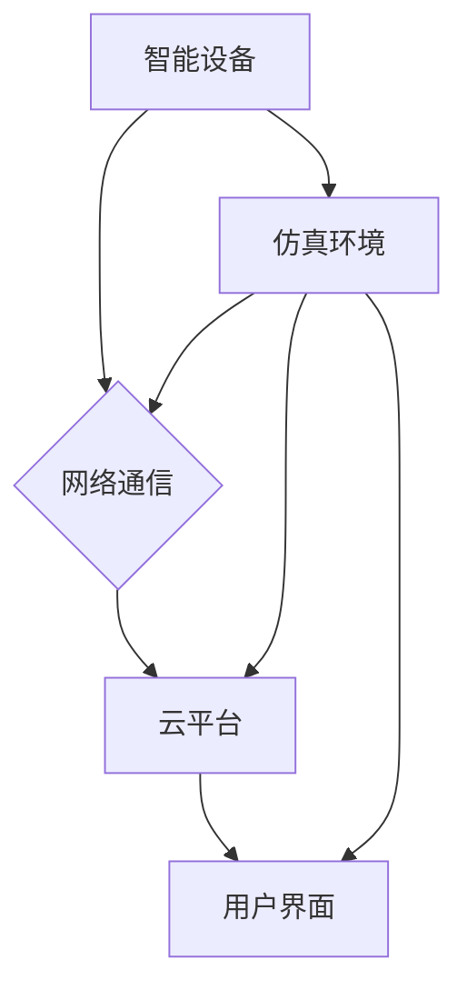

## 基于Java的智能家居设计：基于Java的智能家居仿真环境开发技巧

> 关键词：智能家居、Java、仿真环境、物联网、软件架构、消息队列、RESTful API

## 1. 背景介绍

智能家居已成为现代生活的重要组成部分，它通过将各种智能设备连接到网络，实现对家居环境的自动化控制和智能化管理。随着物联网技术的快速发展，智能家居市场呈现出爆发式增长，对智能家居系统的开发和测试需求也日益增加。

传统的智能家居测试方法主要依赖于实际硬件设备，存在成本高、测试周期长、难以模拟复杂场景等问题。因此，开发基于Java的智能家居仿真环境，能够有效解决上述问题，为智能家居系统开发和测试提供一个安全、灵活、可控的平台。

## 2. 核心概念与联系

### 2.1 智能家居系统架构

智能家居系统通常由以下几个核心组件组成：

* **智能设备:** 包括传感器、执行器、控制中心等，负责感知环境信息、执行控制指令和数据交互。
* **网络通信:** 通过Wi-Fi、蓝牙、ZigBee等协议实现智能设备之间的通信和数据传输。
* **云平台:** 提供数据存储、分析、控制和用户交互等服务，连接智能设备和用户。
* **用户界面:** 用于用户控制和管理智能家居系统，可以是手机APP、平板电脑、智能音箱等。

### 2.2 仿真环境的概念

智能家居仿真环境是指模拟智能家居系统运行环境的软件平台，能够模拟智能设备的行为、网络通信、云平台服务等，为智能家居系统开发和测试提供虚拟化的测试环境。

### 2.3 Java技术在智能家居仿真环境中的应用

Java语言具有以下特点，使其成为构建智能家居仿真环境的理想选择：

* **平台独立性:** Java代码可以在任何支持Java虚拟机的平台上运行，无需进行代码修改。
* **强大的开发工具支持:** Java拥有丰富的开发工具和框架，例如Eclipse、IntelliJ IDEA、Spring等，可以简化开发过程。
* **丰富的第三方库:** Java生态系统拥有大量的第三方库，可以方便地集成各种功能，例如网络通信、数据处理、图形界面等。
* **良好的安全性:** Java语言具有内置的安全机制，可以有效防止恶意代码的攻击。

**Mermaid 流程图**



## 3. 核心算法原理 & 具体操作步骤

### 3.1  算法原理概述

智能家居仿真环境的核心算法主要包括：

* **设备行为模拟算法:** 模拟智能设备的感知、控制和数据交互行为。
* **网络通信模拟算法:** 模拟智能设备之间的网络通信过程，包括数据包发送、接收和处理。
* **云平台服务模拟算法:** 模拟云平台提供的各种服务，例如数据存储、分析、控制等。

### 3.2  算法步骤详解

**设备行为模拟算法:**

1. 定义设备状态和行为模型。
2. 根据设备模型，生成随机或预设的传感器数据和控制指令。
3. 模拟设备对传感器数据的处理和控制指令的执行。
4. 将设备状态和行为信息反馈到仿真环境中。

**网络通信模拟算法:**

1. 定义网络拓扑结构和通信协议。
2. 模拟数据包的发送、接收和转发过程。
3. 模拟网络延迟、丢包和错误等网络现象。
4. 将网络通信信息反馈到仿真环境中。

**云平台服务模拟算法:**

1. 定义云平台提供的服务接口和数据格式。
2. 模拟云平台对设备数据的存储、分析和控制指令的处理。
3. 将云平台服务结果反馈到仿真环境中。

### 3.3  算法优缺点

**优点:**

* 可以模拟各种复杂场景，提高测试覆盖率。
* 可以重复执行测试用例，保证测试结果的可靠性。
* 可以快速迭代测试，缩短开发周期。

**缺点:**

* 仿真环境无法完全模拟实际硬件设备的性能和行为。
* 需要投入时间和精力进行仿真环境的搭建和维护。

### 3.4  算法应用领域

智能家居仿真环境的算法可以应用于以下领域:

* 智能家居系统开发和测试
* 智能家居产品设计和优化
* 智能家居安全性和可靠性测试
* 智能家居应用场景的探索和研究

## 4. 数学模型和公式 & 详细讲解 & 举例说明

### 4.1  数学模型构建

智能家居仿真环境的数学模型可以描述智能设备的行为、网络通信的特性和云平台的服务逻辑。例如，可以建立设备状态转移模型，描述设备状态随时间变化的规律；可以建立网络通信延迟模型，描述数据包在网络中传输的延迟时间；可以建立云平台服务响应时间模型，描述云平台服务对请求的响应时间。

### 4.2  公式推导过程

假设一个智能家居系统中，存在一个温度传感器，其温度测量值服从正态分布，均值为25℃，标准差为1℃。我们可以使用正态分布公式来描述温度传感器的测量值：

$$
f(x) = \frac{1}{\sigma \sqrt{2\pi}} e^{-\frac{(x-\mu)^2}{2\sigma^2}}
$$

其中：

* $f(x)$ 是温度测量值的概率密度函数。
* $x$ 是温度测量值。
* $\mu$ 是正态分布的均值，这里为25℃。
* $\sigma$ 是正态分布的标准差，这里为1℃。

### 4.3  案例分析与讲解

我们可以使用上述正态分布公式来模拟温度传感器的测量值，并根据温度测量值控制空调的开闭状态。例如，如果温度测量值低于22℃，则模拟空调开启；如果温度测量值高于28℃，则模拟空调关闭。

## 5. 项目实践：代码实例和详细解释说明

### 5.1  开发环境搭建

* 操作系统: Windows/Linux/macOS
* JDK: Java Development Kit 1.8 或以上版本
* IDE: Eclipse/IntelliJ IDEA
* Maven: 项目构建工具

### 5.2  源代码详细实现

```java
// 设备状态类
class DeviceState {
    private String deviceId;
    private String state;

    // 构造函数、getter和setter方法
}

// 设备行为模拟类
class DeviceSimulator {
    private DeviceState deviceState;

    public DeviceSimulator(String deviceId) {
        this.deviceState = new DeviceState();
        this.deviceState.setDeviceId(deviceId);
    }

    public void simulateSensorData() {
        // 模拟传感器数据
    }

    public void simulateControlCommand() {
        // 模拟控制指令
    }
}

// 网络通信模拟类
class NetworkSimulator {
    public void sendData(String deviceId, String data) {
        // 模拟数据发送
    }

    public String receiveData(String deviceId) {
        // 模拟数据接收
    }
}

// 云平台服务模拟类
class CloudPlatformSimulator {
    public void storeData(String deviceId, String data) {
        // 模拟数据存储
    }

    public String analyzeData(String deviceId) {
        // 模拟数据分析
    }

    public void sendControlCommand(String deviceId, String command) {
        // 模拟发送控制指令
    }
}
```

### 5.3  代码解读与分析

* `DeviceState` 类用于存储设备的状态信息，例如设备ID和当前状态。
* `DeviceSimulator` 类模拟设备的行为，包括模拟传感器数据和控制指令。
* `NetworkSimulator` 类模拟网络通信，包括数据发送和接收。
* `CloudPlatformSimulator` 类模拟云平台的服务，包括数据存储、分析和控制指令发送。

### 5.4  运行结果展示

通过运行上述代码，可以模拟智能家居系统的运行过程，例如模拟温度传感器测量温度、模拟空调根据温度控制开闭状态、模拟数据上传到云平台等。

## 6. 实际应用场景

### 6.1 智能家居场景模拟

智能家居仿真环境可以用于模拟各种智能家居场景，例如：

* **场景一:**  用户离开家时，自动关闭所有电器，降低能源消耗。
* **场景二:**  用户回家时，自动打开灯光和空调，营造舒适的居家环境。
* **场景三:**  用户通过语音助手控制智能家居设备，实现便捷的智能家居体验。

### 6.2 智能家居安全测试

智能家居仿真环境可以用于测试智能家居系统的安全性和可靠性，例如：

* **测试设备的安全性:** 模拟恶意攻击，验证设备是否能够抵御攻击。
* **测试网络通信的安全性:** 模拟网络攻击，验证网络通信是否安全可靠。
* **测试云平台服务的安全性:** 模拟数据泄露攻击，验证云平台服务是否能够保护用户数据安全。

### 6.3 智能家居产品设计优化

智能家居仿真环境可以用于优化智能家居产品的性能和用户体验，例如：

* **测试不同设备的兼容性:** 验证不同设备是否能够正常通信和协作。
* **测试不同控制方式的便捷性:** 比较语音控制、手机APP控制和遥控器控制的便捷性。
* **测试不同场景下的用户体验:** 优化智能家居系统的功能和交互设计，提升用户体验。

### 6.4  未来应用展望

随着物联网技术的不断发展，智能家居仿真环境的应用场景将会更加广泛，例如：

* **虚拟现实智能家居体验:** 利用虚拟现实技术，为用户提供沉浸式的智能家居体验。
* **人工智能驱动的智能家居仿真:** 利用人工智能技术，模拟更加智能和复杂的智能家居场景。
* **云端智能家居仿真平台:** 建立云端智能家居仿真平台，方便用户远程访问和使用仿真环境。

## 7. 工具和资源推荐

### 7.1  学习资源推荐

* **书籍:**
    * 《Java编程思想》
    * 《Head First Design Patterns》
    * 《Effective Java》
* **在线课程:**
    * Coursera: Java Programming
    * Udemy: Java for Beginners
    * edX: Introduction to Computer Science and Programming Using Python

### 7.2  开发工具推荐

* **IDE:** Eclipse, IntelliJ IDEA
* **消息队列:** RabbitMQ, Kafka
* **RESTful API框架:** Spring Boot, Jersey

### 7.3  相关论文推荐

* **论文一:**  A Survey of Smart Home Simulation Environments
* **论文二:**  Design and Implementation of a Smart Home Simulation Platform
* **论文三:**  Towards a Comprehensive Framework for Smart Home Security Testing

## 8. 总结：未来发展趋势与挑战

### 8.1  研究成果总结

基于Java的智能家居仿真环境能够有效解决智能家居系统开发和测试中的难题，为智能家居系统的创新发展提供重要的技术支撑。

### 8.2  未来发展趋势

* **更加智能化的仿真环境:** 利用人工智能技术，模拟更加智能和复杂的智能家居场景。
* **更加真实的仿真环境:** 结合虚拟现实技术，为用户提供更加真实的智能家居体验。
* **更加开放的仿真平台:** 建立云端智能家居仿真平台，方便用户远程访问和使用仿真环境。

### 8.3  面临的挑战

* **仿真环境的复杂性:** 智能家居系统非常复杂，仿真环境需要模拟各种设备、网络和服务之间的交互关系。
* **仿真环境的真实性:** 仿真环境需要尽可能地模拟实际硬件设备的性能和行为，这需要大量的测试和验证工作。
* **仿真环境的维护成本:** 随着智能家居技术的不断发展，仿真环境需要不断更新和维护，这会带来一定的成本压力。

### 8.4  研究展望

未来，我们将继续致力于开发更加智能、更加真实的智能家居仿真环境，为智能家居系统的创新发展提供更加强大的技术支撑。

## 9. 附录：常见问题与解答

**问题一:** 如何选择合适的仿真环境