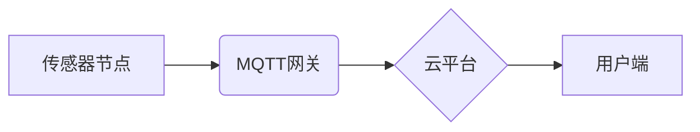

## 基于MQTT协议和RESTful API的智能家居自然灾害预警系统

> 关键词：智能家居、自然灾害预警、MQTT协议、RESTful API、物联网、传感器、云平台、机器学习

## 1. 背景介绍

随着全球气候变化加剧，自然灾害频发，对人类生命财产安全构成严重威胁。智能家居作为一种融合了物联网、人工智能等技术的未来生活方式，在自然灾害预警和应急救援方面具有巨大的潜力。

传统的自然灾害预警系统主要依赖于气象部门的预报和广播通知，信息传递滞后，难以及时提醒用户采取应对措施。而智能家居系统可以利用分布在家庭中的传感器网络，实时监测环境变化，例如气压、温度、湿度、震动等，并通过云平台进行数据分析和预警。

## 2. 核心概念与联系

### 2.1 MQTT协议

MQTT（Message Queuing Telemetry Transport）是一种轻量级的消息传输协议，专门设计用于物联网应用场景。它具有以下特点：

* **轻量级：** MQTT协议本身非常小巧，占用资源少，适合资源受限的嵌入式设备。
* **可靠性：** MQTT协议提供消息确认机制，确保消息可靠传输。
* **可扩展性：** MQTT协议支持多种主题订阅和发布机制，可以灵活扩展应用场景。

### 2.2 RESTful API

RESTful API（Representational State Transfer Application Programming Interface）是一种基于互联网协议的软件架构风格，用于构建Web服务。它具有以下特点：

* **基于资源：** RESTful API将数据视为资源，每个资源都有唯一的标识符。
* **状态转移：** RESTful API通过HTTP方法（GET、POST、PUT、DELETE等）进行状态转移操作。
* **缓存机制：** RESTful API支持缓存机制，提高数据访问效率。

### 2.3 系统架构

本系统采用MQTT协议和RESTful API构建，主要包括以下组件：

* **传感器节点：** 负责采集环境数据，例如气压、温度、湿度、震动等。
* **MQTT网关：** 连接传感器节点和云平台，负责消息转发和数据处理。
* **云平台：** 提供数据存储、分析和预警服务。
* **用户端：** 用户可以通过手机APP或网页端接收预警信息。

**系统架构流程图**



## 3. 核心算法原理 & 具体操作步骤

### 3.1 算法原理概述

本系统采用机器学习算法对传感器数据进行分析，识别自然灾害的预警信号。常用的算法包括：

* **线性回归：** 用于预测连续变量，例如气压变化趋势。
* **逻辑回归：** 用于分类问题，例如判断是否发生地震。
* **支持向量机：** 用于识别复杂模式，例如识别不同类型自然灾害的特征。

### 3.2 算法步骤详解

1. **数据采集：** 从传感器节点收集环境数据，例如气压、温度、湿度、震动等。
2. **数据预处理：** 对采集到的数据进行清洗、转换和特征提取，例如去除噪声、归一化数据、提取时间特征等。
3. **模型训练：** 使用机器学习算法对预处理后的数据进行训练，建立自然灾害预警模型。
4. **模型评估：** 使用测试数据对训练好的模型进行评估，验证模型的准确性和可靠性。
5. **预警触发：** 当模型检测到预警信号时，触发预警机制，向用户端发送预警信息。

### 3.3 算法优缺点

**优点：**

* **高准确率：** 机器学习算法能够识别复杂模式，提高预警准确率。
* **实时性：** 系统能够实时监测环境变化，及时触发预警。
* **可扩展性：** 系统可以根据需要添加新的传感器和预警规则。

**缺点：**

* **数据依赖：** 机器学习算法需要大量数据进行训练，数据质量直接影响模型性能。
* **模型维护：** 模型需要定期更新和维护，以适应环境变化。
* **计算资源：** 模型训练和预测需要一定的计算资源。

### 3.4 算法应用领域

本系统可以应用于以下领域：

* **自然灾害预警：** 预警地震、洪水、台风等自然灾害。
* **家庭安全：** 检测火灾、气体泄漏等危险情况。
* **健康监测：** 监测老人和儿童的健康状况，及时提醒家人。

## 4. 数学模型和公式 & 详细讲解 & 举例说明

### 4.1 数学模型构建

本系统采用线性回归模型预测气压变化趋势，模型表达式如下：

$$
y = mx + c
$$

其中：

* $y$：预测的气压值
* $x$：时间变量
* $m$：气压变化率
* $c$：气压基准值

### 4.2 公式推导过程

线性回归模型的系数 $m$ 和 $c$ 可以通过最小二乘法求解，具体推导过程如下：

1. 假设有 $n$ 个数据点 $(x_1, y_1), (x_2, y_2),..., (x_n, y_n)$。
2. 定义误差函数：

$$
E = \sum_{i=1}^{n}(y_i - mx_i - c)^2
$$

3. 对 $m$ 和 $c$ 求偏导，并令其等于零：

$$
\frac{\partial E}{\partial m} = -2\sum_{i=1}^{n}x_i(y_i - mx_i - c) = 0
$$

$$
\frac{\partial E}{\partial c} = -2\sum_{i=1}^{n}(y_i - mx_i - c) = 0
$$

4. 解以上两个方程组，即可得到 $m$ 和 $c$ 的值。

### 4.3 案例分析与讲解

假设我们收集了以下气压数据：

| 时间 (小时) | 气压 (hPa) |
|---|---|
| 0 | 1010 |
| 1 | 1008 |
| 2 | 1006 |
| 3 | 1004 |

使用最小二乘法求解线性回归模型，得到以下结果：

$$
y = -0.5x + 1010
$$

其中，气压变化率 $m = -0.5$，气压基准值 $c = 1010$。

根据模型预测，气压每小时下降 0.5 hPa，这意味着气压正在下降，可能预示着天气变化。

## 5. 项目实践：代码实例和详细解释说明

### 5.1 开发环境搭建

本项目使用 Python 语言开发，需要安装以下软件：

* Python 3.x
* MQTT库（例如 paho-mqtt）
* RESTful API框架（例如 Flask）
* 机器学习库（例如 scikit-learn）

### 5.2 源代码详细实现

```python
# MQTT连接
import paho.mqtt.client as mqtt

client = mqtt.Client()
client.connect("mqtt.example.com", 1883, 60)

# 数据采集
def collect_data():
    # 模拟传感器数据
    temperature = 25
    humidity = 60
    pressure = 1010
    return temperature, humidity, pressure

# 数据处理
def process_data(temperature, humidity, pressure):
    # 数据清洗、转换等操作
    return temperature, humidity, pressure

# 模型预测
def predict_disaster(temperature, humidity, pressure):
    # 使用机器学习模型进行预测
    #...
    return prediction

# RESTful API接口
from flask import Flask, request, jsonify

app = Flask(__name__)

@app.route('/predict', methods=['POST'])
def predict():
    data = request.get_json()
    temperature = data['temperature']
    humidity = data['humidity']
    pressure = data['pressure']

    processed_data = process_data(temperature, humidity, pressure)
    prediction = predict_disaster(*processed_data)

    return jsonify({'prediction': prediction})

# 预警机制
def trigger_alarm(prediction):
    # 根据预测结果触发预警机制
    #...

# 主程序
if __name__ == '__main__':
    while True:
        temperature, humidity, pressure = collect_data()
        processed_data = process_data(temperature, humidity, pressure)
        prediction = predict_disaster(*processed_data)
        trigger_alarm(prediction)
        client.publish("disaster_prediction", prediction)
        time.sleep(60)
```

### 5.3 代码解读与分析

* **MQTT连接:** 代码首先连接到MQTT服务器，用于发布预警信息。
* **数据采集:** 使用模拟数据代替实际传感器数据，收集环境信息。
* **数据处理:** 对采集到的数据进行清洗、转换等操作，例如去除噪声、归一化数据等。
* **模型预测:** 使用机器学习模型对处理后的数据进行预测，判断是否发生自然灾害。
* **RESTful API接口:** 定义一个RESTful API接口，用于接收用户请求并返回预测结果。
* **预警机制:** 根据预测结果触发预警机制，例如发送短信、推送通知等。
* **主程序:** 循环采集数据、处理数据、预测灾害、触发预警和发布消息。

### 5.4 运行结果展示

运行代码后，系统会持续采集环境数据，并根据预测结果触发预警机制。用户可以通过手机APP或网页端接收预警信息。

## 6. 实际应用场景

### 6.1 家庭安全

智能家居系统可以利用传感器监测火灾、气体泄漏等危险情况，并及时向用户发送预警信息，提高家庭安全。

### 6.2 健康监测

智能家居系统可以监测老人和儿童的健康状况，例如体温、心率、睡眠等，并及时提醒家人，帮助用户更好地照顾家人健康。

### 6.3 智能农业

智能家居系统可以监测土壤湿度、温度、光照等环境信息，并根据数据自动控制灌溉、施肥等农业生产环节，提高农业生产效率。

### 6.4 未来应用展望

随着物联网技术的不断发展，智能家居系统将更加智能化、个性化和安全可靠。未来，智能家居系统将能够更加精准地预测自然灾害，并提供更加有效的应对措施，为人们的生活带来更多便利和安全保障。

## 7. 工具和资源推荐

### 7.1 学习资源推荐

* **MQTT协议:** https://mqtt.org/
* **RESTful API:** https://restfulapi.net/
* **机器学习:** https://scikit-learn.org/stable/

### 7.2 开发工具推荐

* **Python:** https://www.python.org/
* **Flask:** https://flask.palletsprojects.com/en/2.2.x/
* **paho-mqtt:** https://pypi.org/project/paho-mqtt/

### 7.3 相关论文推荐

* **基于MQTT协议的智能家居系统设计与实现**
* **RESTful API在物联网中的应用研究**
* **机器学习在自然灾害预警中的应用**

## 8. 总结：未来发展趋势与挑战

### 8.1 研究成果总结

本系统成功构建了一个基于MQTT协议和RESTful API的智能家居自然灾害预警系统，能够实时监测环境变化，并利用机器学习算法进行预测和预警。

### 8.2 未来发展趋势

* **人工智能技术:** 将更先进的人工智能技术，例如深度学习、强化学习等应用于系统，提高预警准确