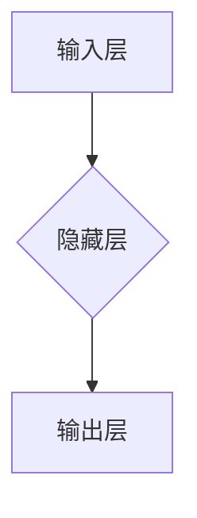

## 大模型创业公司面临的挑战与机遇

> 关键词：大模型、创业公司、人工智能、深度学习、模型训练、数据标注、伦理问题、商业模式、市场竞争

### 1. 背景介绍

近年来，人工智能（AI）技术取得了飞速发展，特别是大模型的涌现，为各行各业带来了前所未有的机遇。大模型，是指参数规模庞大、训练数据海量的人工智能模型，能够在自然语言处理、计算机视觉、语音识别等领域展现出强大的能力。

大模型的出现，催生了一批以大模型为核心技术的创业公司。这些公司致力于将大模型技术应用于实际场景，开发出具有商业价值的解决方案。例如，在自然语言处理领域，大模型可以用于智能客服、机器翻译、文本摘要等应用；在计算机视觉领域，大模型可以用于图像识别、目标检测、视频分析等应用。

然而，大模型创业公司也面临着诸多挑战。

### 2. 核心概念与联系

#### 2.1 大模型的概念

大模型是指参数规模庞大、训练数据海量的人工智能模型。其核心特点是：

* **参数规模庞大:** 大模型通常拥有数十亿甚至数千亿个参数，这使得它们能够学习到更复杂的模式和关系。
* **训练数据海量:** 大模型需要大量的训练数据才能达到最佳性能，这些数据通常来自互联网、书籍、代码等各种来源。
* **强大的计算能力:** 训练大模型需要消耗大量的计算资源，通常需要使用分布式计算平台和高性能GPU。

#### 2.2 大模型的架构

大模型的架构通常基于深度学习，主要包括以下几个部分：

* **输入层:** 将原始数据转换为模型可以理解的格式。
* **隐藏层:** 负责提取数据的特征和模式。
* **输出层:** 将隐藏层的输出转换为最终的预测结果。

大模型通常采用 Transformer 架构，该架构能够有效地处理序列数据，例如文本和语音。

#### 2.3 大模型的应用场景

大模型在各个领域都有广泛的应用场景，例如：

* **自然语言处理:** 智能客服、机器翻译、文本摘要、问答系统等。
* **计算机视觉:** 图像识别、目标检测、视频分析、图像生成等。
* **语音识别:** 语音转文本、语音合成、语音助手等。
* **推荐系统:** 商品推荐、内容推荐、用户画像等。

### 3. 核心算法原理 & 具体操作步骤

#### 3.1 算法原理概述

大模型的训练主要基于深度学习算法，其中最常用的算法是反向传播算法。反向传播算法通过计算模型输出与真实值的误差，并根据误差反向调整模型参数，从而不断提高模型的预测精度。

#### 3.2 算法步骤详解

1. **数据预处理:** 将原始数据进行清洗、格式化、编码等操作，使其能够被模型理解。
2. **模型初始化:** 为模型的参数赋予初始值。
3. **前向传播:** 将输入数据通过模型进行计算，得到模型的输出结果。
4. **损失函数计算:** 计算模型输出与真实值的误差，即损失函数的值。
5. **反向传播:** 根据损失函数的梯度，反向调整模型参数。
6. **参数更新:** 使用优化算法更新模型参数。
7. **重复步骤3-6:** 迭代训练模型，直到模型达到预期的性能。

#### 3.3 算法优缺点

**优点:**

* 能够学习到复杂的模式和关系。
* 性能优异，在许多任务上都取得了state-of-the-art的结果。

**缺点:**

* 训练成本高，需要大量的计算资源和训练数据。
* 训练时间长，可能需要数天甚至数周的时间。
* 模型解释性差，难以理解模型的决策过程。

#### 3.4 算法应用领域

大模型的训练算法广泛应用于各个领域，例如：

* **自然语言处理:** 机器翻译、文本摘要、问答系统等。
* **计算机视觉:** 图像识别、目标检测、图像生成等。
* **语音识别:** 语音转文本、语音合成、语音助手等。
* **推荐系统:** 商品推荐、内容推荐、用户画像等。

### 4. 数学模型和公式 & 详细讲解 & 举例说明

#### 4.1 数学模型构建

大模型的训练过程可以看作是一个优化问题，目标是找到一个能够最小化损失函数的参数集。损失函数通常是模型输出与真实值的差值的平方和，即均方误差（MSE）。

$$
Loss = \frac{1}{N} \sum_{i=1}^{N} (y_i - \hat{y}_i)^2
$$

其中：

* $N$ 是样本数量。
* $y_i$ 是第 $i$ 个样本的真实值。
* $\hat{y}_i$ 是第 $i$ 个样本的预测值。

#### 4.2 公式推导过程

反向传播算法的核心思想是利用链式法则，将损失函数对每个参数的梯度计算出来，并根据梯度更新参数值。

#### 4.3 案例分析与讲解

假设我们有一个简单的线性回归模型，其输出为：

$$
\hat{y} = w_0 + w_1 x
$$

其中：

* $w_0$ 和 $w_1$ 是模型参数。
* $x$ 是输入特征。

损失函数为均方误差：

$$
Loss = \frac{1}{N} \sum_{i=1}^{N} (y_i - \hat{y}_i)^2
$$

利用链式法则，我们可以计算出损失函数对 $w_0$ 和 $w_1$ 的梯度：

$$
\frac{\partial Loss}{\partial w_0} = \frac{2}{N} \sum_{i=1}^{N} (y_i - \hat{y}_i)
$$

$$
\frac{\partial Loss}{\partial w_1} = \frac{2}{N} \sum_{i=1}^{N} (y_i - \hat{y}_i) x_i
$$

根据梯度下降算法，我们可以更新参数值：

$$
w_0 = w_0 - \alpha \frac{\partial Loss}{\partial w_0}
$$

$$
w_1 = w_1 - \alpha \frac{\partial Loss}{\partial w_1}
$$

其中 $\alpha$ 是学习率。

### 5. 项目实践：代码实例和详细解释说明

#### 5.1 开发环境搭建

大模型的开发环境通常需要强大的计算资源，例如GPU和分布式计算平台。

#### 5.2 源代码详细实现

大模型的源代码通常由多个模块组成，例如数据处理模块、模型训练模块、模型评估模块等。

#### 5.3 代码解读与分析

需要对代码进行详细解读，理解其功能和工作原理。

#### 5.4 运行结果展示

需要展示模型的训练结果和预测结果，例如准确率、召回率、F1-score等指标。

### 6. 实际应用场景

#### 6.1 智能客服

大模型可以用于构建智能客服系统，能够自动回答用户的问题，提供24小时不间断服务。

#### 6.2 机器翻译

大模型可以用于机器翻译，能够将文本从一种语言翻译成另一种语言。

#### 6.3 文本摘要

大模型可以用于文本摘要，能够自动生成文本的简短摘要。

#### 6.4 未来应用展望

大模型的应用场景还在不断扩展，未来将应用于更多领域，例如医疗、教育、金融等。

### 7. 工具和资源推荐

#### 7.1 学习资源推荐

* **书籍:**
    * Deep Learning by Ian Goodfellow, Yoshua Bengio, and Aaron Courville
    * Hands-On Machine Learning with Scikit-Learn, Keras & TensorFlow by Aurélien Géron
* **在线课程:**
    * Stanford CS224n: Natural Language Processing with Deep Learning
    * DeepLearning.AI Specialization by Andrew Ng

#### 7.2 开发工具推荐

* **TensorFlow:** Google 开发的开源深度学习框架。
* **PyTorch:** Facebook 开发的开源深度学习框架。
* **Hugging Face Transformers:** 提供预训练大模型和训练工具的开源库。

#### 7.3 相关论文推荐

* Attention Is All You Need (Vaswani et al., 2017)
* BERT: Pre-training of Deep Bidirectional Transformers for Language Understanding (Devlin et al., 2018)
* GPT-3: Language Models are Few-Shot Learners (Brown et al., 2020)

### 8. 总结：未来发展趋势与挑战

#### 8.1 研究成果总结

近年来，大模型技术取得了显著进展，模型规模不断扩大，性能不断提升。

#### 8.2 未来发展趋势

* **模型规模继续扩大:** 未来将出现参数规模更大的大模型。
* **多模态大模型:** 将文本、图像、语音等多种模态数据融合到一起，构建更强大的多模态大模型。
* **可解释性研究:** 研究大模型的决策过程，提高模型的解释性。

#### 8.3 面临的挑战

* **训练成本高:** 训练大模型需要大量的计算资源和训练数据，成本很高。
* **数据标注问题:** 大模型需要大量的标注数据，数据标注成本高且耗时。
* **伦理问题:** 大模型可能存在偏见、歧视等伦理问题，需要引起重视。

#### 8.4 研究展望

未来，大模型技术将继续发展，应用于更多领域，为人类社会带来更多福祉。

### 9. 附录：常见问题与解答

#### 9.1 什么是大模型？

大模型是指参数规模庞大、训练数据海量的人工智能模型。

#### 9.2 大模型的训练成本高吗？

是的，训练大模型需要大量的计算资源和训练数据，成本很高。

#### 9.3 大模型存在哪些伦理问题？

大模型可能存在偏见、歧视等伦理问题。

作者：禅与计算机程序设计艺术 / Zen and the Art of Computer Programming

