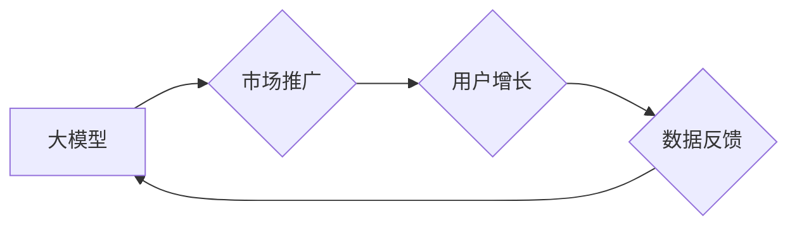

## 大模型的市场推广与用户增长

> 关键词：大模型、市场推广、用户增长、应用场景、商业模式、技术挑战、未来趋势

### 1. 背景介绍

近年来，大模型技术蓬勃发展，其强大的泛化能力和应用潜力引发了广泛关注。从文本生成、机器翻译到图像识别、代码编写，大模型已在多个领域取得突破性进展，并逐渐渗透到人们日常生活。然而，大模型的商业化应用仍处于初期阶段，如何有效推广大模型，并实现用户增长，成为摆在行业面前的关键问题。

### 2. 核心概念与联系

**2.1 大模型概述**

大模型是指参数规模庞大、训练数据海量的人工智能模型。其核心特点在于：

* **规模化：** 大模型拥有数亿甚至数十亿个参数，远超传统机器学习模型。
* **泛化能力强：** 由于训练数据量大，大模型能够学习到更丰富的知识和模式，从而在不同任务上表现出更强的泛化能力。
* **多模态学习：** 一些大模型能够处理多种数据类型，例如文本、图像、音频等，实现跨模态的学习和应用。

**2.2 市场推广与用户增长**

市场推广是指企业通过各种手段，向目标用户宣传产品或服务，以提高品牌知名度和市场份额。用户增长是指企业通过市场推广和产品优化，吸引更多用户使用产品或服务。

**2.3 核心关系**

大模型的市场推广与用户增长密切相关。有效的市场推广可以提高大模型的知名度和用户认知，从而吸引更多用户尝试使用。而用户增长则可以为大模型提供更多数据和反馈，进一步提升模型性能，形成良性循环。

**Mermaid 流程图**



### 3. 核心算法原理 & 具体操作步骤

**3.1 算法原理概述**

大模型的训练主要基于深度学习算法，特别是 Transformer 架构。Transformer 是一种基于注意力机制的神经网络架构，能够有效捕捉文本序列中的长距离依赖关系。

**3.2 算法步骤详解**

1. **数据预处理:** 收集和清洗大规模文本数据，并将其转换为模型可理解的格式。
2. **模型构建:** 根据 Transformer 架构设计模型结构，包括编码器、解码器和注意力机制等模块。
3. **模型训练:** 使用训练数据训练模型，通过反向传播算法不断调整模型参数，使其能够生成准确的输出。
4. **模型评估:** 使用测试数据评估模型性能，并根据评估结果进行模型调优。
5. **模型部署:** 将训练好的模型部署到生产环境中，提供服务给用户。

**3.3 算法优缺点**

**优点:**

* 强大的泛化能力
* 能够处理长距离依赖关系
* 多模态学习能力

**缺点:**

* 训练成本高
* 计算资源需求大
* 容易出现过拟合问题

**3.4 算法应用领域**

* 文本生成：小说、诗歌、剧本等
* 机器翻译：将一种语言翻译成另一种语言
* 问答系统：回答用户提出的问题
* 代码生成：自动生成代码
* 图像识别：识别图像中的物体和场景

### 4. 数学模型和公式 & 详细讲解 & 举例说明

**4.1 数学模型构建**

大模型的训练基于深度学习算法，其核心是优化模型参数，使其能够最小化预测误差。常用的优化算法包括梯度下降法和 Adam 算法。

**4.2 公式推导过程**

梯度下降法的核心公式为：

$$
\theta = \theta - \alpha \nabla L(\theta)
$$

其中：

* $\theta$ 表示模型参数
* $\alpha$ 表示学习率
* $\nabla L(\theta)$ 表示损失函数 $L(\theta)$ 的梯度

**4.3 案例分析与讲解**

假设我们训练一个文本分类模型，目标是将文本分类为正类或负类。损失函数可以定义为交叉熵损失函数：

$$
L(\theta) = - \sum_{i=1}^{N} y_i \log p(y_i | x_i; \theta)
$$

其中：

* $N$ 表示样本数量
* $y_i$ 表示第 $i$ 个样本的真实标签
* $p(y_i | x_i; \theta)$ 表示模型预测第 $i$ 个样本属于正类的概率

通过梯度下降法，我们可以不断更新模型参数 $\theta$，使其能够最小化交叉熵损失函数，从而提高模型的分类准确率。

### 5. 项目实践：代码实例和详细解释说明

**5.1 开发环境搭建**

* Python 3.7+
* TensorFlow 或 PyTorch 深度学习框架
* CUDA 和 cuDNN (可选，用于 GPU 加速)

**5.2 源代码详细实现**

```python
import tensorflow as tf

# 定义模型结构
model = tf.keras.Sequential([
    tf.keras.layers.Embedding(input_dim=vocab_size, output_dim=embedding_dim),
    tf.keras.layers.LSTM(units=hidden_size),
    tf.keras.layers.Dense(units=num_classes, activation='softmax')
])

# 编译模型
model.compile(optimizer='adam',
              loss='sparse_categorical_crossentropy',
              metrics=['accuracy'])

# 训练模型
model.fit(x_train, y_train, epochs=num_epochs, batch_size=batch_size)

# 评估模型
loss, accuracy = model.evaluate(x_test, y_test)
print('Test Loss:', loss)
print('Test Accuracy:', accuracy)
```

**5.3 代码解读与分析**

* 该代码示例展示了如何使用 TensorFlow 框架构建一个简单的文本分类模型。
* 模型结构包括 Embedding 层、LSTM 层和 Dense 层。
* Embedding 层将文本单词映射到低维向量空间。
* LSTM 层能够捕捉文本序列中的长距离依赖关系。
* Dense 层用于分类输出。
* 模型使用 Adam 优化器、交叉熵损失函数和准确率作为评估指标。

**5.4 运行结果展示**

训练完成后，模型可以用于预测新的文本样本的类别。

### 6. 实际应用场景

**6.1 文本生成**

* 自动生成新闻报道、小说、诗歌等文本内容。
* 创建聊天机器人，进行自然语言对话。
* 辅助写作，提供文本建议和修改。

**6.2 机器翻译**

* 将文本从一种语言翻译成另一种语言。
* 支持多语言翻译，打破语言障碍。
* 提高翻译效率和准确性。

**6.3 问答系统**

* 回答用户提出的问题，提供相关信息。
* 用于客户服务、教育和研究等领域。
* 提升用户体验和信息获取效率。

**6.4 代码生成**

* 自动生成代码，提高开发效率。
* 辅助程序员理解和调试代码。
* 降低代码编写门槛。

**6.5 图像识别**

* 识别图像中的物体和场景。
* 用于图像搜索、医疗诊断和自动驾驶等领域。
* 提升图像理解和分析能力。

**6.6 未来应用展望**

大模型的应用场景还在不断扩展，未来将可能应用于：

* 个性化教育
* 医疗诊断和治疗
* 科学研究和创新
* 艺术创作和娱乐

### 7. 工具和资源推荐

**7.1 学习资源推荐**

* **书籍:**
    * 《深度学习》
    * 《自然语言处理》
    * 《机器学习》
* **在线课程:**
    * Coursera
    * edX
    * Udacity
* **博客和论坛:**
    * TensorFlow Blog
    * PyTorch Blog
    * Stack Overflow

**7.2 开发工具推荐**

* **深度学习框架:** TensorFlow, PyTorch
* **编程语言:** Python
* **云计算平台:** AWS, Azure, GCP

**7.3 相关论文推荐**

* 《Attention Is All You Need》
* 《BERT: Pre-training of Deep Bidirectional Transformers for Language Understanding》
* 《GPT-3: Language Models are Few-Shot Learners》

### 8. 总结：未来发展趋势与挑战

**8.1 研究成果总结**

近年来，大模型技术取得了显著进展，在多个领域展现出强大的应用潜力。

**8.2 未来发展趋势**

* 模型规模进一步扩大
* 多模态学习能力增强
* 训练效率和成本降低
* 更加安全、可靠和可解释的模型

**8.3 面临的挑战**

* 计算资源需求大
* 训练数据获取和标注困难
* 模型可解释性和安全性问题
* 伦理和社会影响问题

**8.4 研究展望**

未来研究将重点关注：

* 开发更高效的训练算法
* 探索新的模型架构
* 提升模型的泛化能力和鲁棒性
* 解决模型可解释性和安全性问题
* 探索大模型在更多领域的应用

### 9. 附录：常见问题与解答

**9.1 如何选择合适的模型架构？**

选择合适的模型架构取决于具体的应用场景和数据特点。

**9.2 如何处理大规模训练数据？**

可以使用分布式训练技术，将训练任务分发到多个机器上进行并行训练。

**9.3 如何评估大模型的性能？**

可以使用多种指标评估大模型的性能，例如准确率、召回率、F1-score等。

**9.4 如何解决模型过拟合问题？**

可以使用正则化技术、数据增强和交叉验证等方法来解决模型过拟合问题。


作者：禅与计算机程序设计艺术 / Zen and the Art of Computer Programming 
