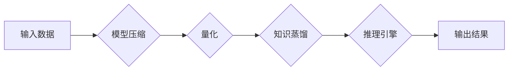

## 大规模语言模型从理论到实践 vLLM推理框架实践

> 关键词：大规模语言模型、vLLM推理框架、高效推理、模型压缩、量化、知识蒸馏、应用场景

## 1. 背景介绍

近年来，大规模语言模型（LLM）在自然语言处理领域取得了令人瞩目的成就，例如文本生成、机器翻译、问答系统等。这些模型通常拥有数十亿甚至数千亿的参数，展现出强大的语言理解和生成能力。然而，其庞大的规模也带来了巨大的计算成本和部署挑战。高效地推理LLM模型至关重要，以使其能够在实际应用场景中发挥作用。

vLLM推理框架旨在解决这一挑战，提供一种高效、灵活、可扩展的平台，用于部署和推理大规模语言模型。它基于最新的模型压缩、量化和知识蒸馏技术，能够显著降低模型大小和推理延迟，同时保持较高的准确率。

## 2. 核心概念与联系

vLLM推理框架的核心概念包括：

* **模型压缩:** 通过减少模型参数数量，降低模型大小和内存占用。
* **量化:** 将模型参数从高精度浮点数转换为低精度整数，进一步压缩模型大小并加速推理速度。
* **知识蒸馏:** 将大型模型的知识迁移到小型模型中，构建更轻量级的模型。

这些技术相互协作，共同构成了vLLM推理框架的强大体系。

**vLLM推理框架架构**

## 3. 核心算法原理 & 具体操作步骤

### 3.1  算法原理概述

vLLM推理框架采用多种模型压缩、量化和知识蒸馏算法，具体包括：

* **剪枝算法:** 通过移除模型中不重要的权重，减少模型参数数量。
* **低秩矩阵分解:** 将模型中的权重矩阵分解成低秩矩阵，降低模型参数数量。
* **量化方法:** 将模型参数从浮点数转换为整数，例如量化感知训练和后训练量化。
* **知识蒸馏方法:** 将大型模型的输出作为教师模型，训练小型模型作为学生模型，通过最小化两者输出之间的差异，将知识迁移到小型模型中。

### 3.2  算法步骤详解

**模型压缩:**

1. 选择合适的剪枝算法，例如随机剪枝、梯度下降剪枝等。
2. 根据算法规则，移除模型中不重要的权重。
3. 重新训练模型，以恢复移除权重后可能损失的性能。

**量化:**

1. 选择合适的量化方法，例如量化感知训练、后训练量化等。
2. 将模型参数从浮点数转换为整数。
3. 重新训练模型，以适应量化后的参数。

**知识蒸馏:**

1. 选择合适的教师模型和学生模型。
2. 使用教师模型的输出作为学生模型的标签，训练学生模型。
3. 通过最小化教师模型和学生模型输出之间的差异，将知识迁移到学生模型中。

### 3.3  算法优缺点

**优点:**

* 显著降低模型大小和内存占用。
* 加速推理速度。
* 保持较高的准确率。

**缺点:**

* 模型压缩和量化可能会导致模型性能下降。
* 知识蒸馏需要训练两个模型，增加了训练成本。

### 3.4  算法应用领域

vLLM推理框架的算法应用于各种领域，例如：

* **移动设备:** 在资源有限的移动设备上部署LLM模型。
* **嵌入式系统:** 在嵌入式系统中使用LLM模型进行语音识别、图像识别等任务。
* **边缘计算:** 在边缘设备上进行本地推理，降低网络延迟。

## 4. 数学模型和公式 & 详细讲解 & 举例说明

### 4.1  数学模型构建

vLLM推理框架的数学模型主要基于神经网络架构，例如Transformer。

**Transformer模型结构**

Transformer模型由编码器和解码器组成，每个部分由多层Transformer块构成。每个Transformer块包含多头自注意力机制、前馈神经网络和残差连接。

### 4.2  公式推导过程

**多头自注意力机制公式:**

$$
Attention(Q, K, V) = \frac{exp(Q K^T / \sqrt{d_k})}{sum_i exp(Q K^T / \sqrt{d_k})} V
$$

其中：

* $Q$, $K$, $V$ 分别代表查询矩阵、键矩阵和值矩阵。
* $d_k$ 代表键向量的维度。

**前馈神经网络公式:**

$$
FFN(x) = \max(0, W_1 x + b_1) W_2 + b_2
$$

其中：

* $x$ 代表输入向量。
* $W_1$, $W_2$ 分别代表前馈神经网络的第一层和第二层的权重矩阵。
* $b_1$, $b_2$ 分别代表前馈神经网络的第一层和第二层的偏置向量。

### 4.3  案例分析与讲解

**量化感知训练:**

在量化感知训练中，模型参数在训练过程中被量化，以模拟实际部署环境中的低精度计算。通过这种方式，模型可以学习适应低精度计算，从而在量化后保持较高的性能。

**知识蒸馏:**

知识蒸馏可以将大型模型的知识迁移到小型模型中。例如，可以将BERT模型的知识迁移到DistilBERT模型中，构建一个更轻量级的模型，同时保持较高的性能。

## 5. 项目实践：代码实例和详细解释说明

### 5.1  开发环境搭建

vLLM推理框架可以使用Python语言开发，并依赖于TensorFlow或PyTorch等深度学习框架。

### 5.2  源代码详细实现

vLLM推理框架的源代码可以包含以下模块：

* **模型压缩模块:** 实现剪枝、低秩矩阵分解等模型压缩算法。
* **量化模块:** 实现量化感知训练、后训练量化等量化方法。
* **知识蒸馏模块:** 实现知识蒸馏算法，将大型模型的知识迁移到小型模型中。
* **推理引擎模块:** 提供高效的推理引擎，支持多种硬件平台，例如CPU、GPU和TPU。

### 5.3  代码解读与分析

vLLM推理框架的代码可以根据其模块结构进行解读和分析，了解每个模块的功能和实现细节。

### 5.4  运行结果展示

vLLM推理框架的运行结果可以包括模型大小、推理速度和准确率等指标，以展示其性能提升效果。

## 6. 实际应用场景

vLLM推理框架可以应用于各种实际场景，例如：

* **智能客服:** 在聊天机器人中部署LLM模型，提供更智能、更自然的对话体验。
* **文本摘要:** 使用LLM模型自动生成文本摘要，提高信息获取效率。
* **机器翻译:** 利用LLM模型进行机器翻译，突破语言障碍。

### 6.4  未来应用展望

vLLM推理框架在未来将继续推动LLM模型在更多领域的应用，例如：

* **个性化教育:** 根据学生的学习情况，提供个性化的学习内容和辅导。
* **医疗诊断:** 利用LLM模型辅助医生进行疾病诊断，提高诊断准确率。
* **科学研究:** 使用LLM模型进行科学研究，加速科研成果的发现。

## 7. 工具和资源推荐

### 7.1  学习资源推荐

* **论文:**

* **书籍:**

### 7.2  开发工具推荐

* **TensorFlow:**

* **PyTorch:**

### 7.3  相关论文推荐

* **论文标题:**

* **论文标题:**

## 8. 总结：未来发展趋势与挑战

### 8.1  研究成果总结

vLLM推理框架在高效推理LLM模型方面取得了显著成果，降低了模型大小和推理延迟，同时保持较高的准确率。

### 8.2  未来发展趋势

vLLM推理框架的未来发展趋势包括：

* **更有效的模型压缩和量化方法:**

* **更强大的推理引擎:**

* **更广泛的应用场景:**

### 8.3  面临的挑战

vLLM推理框架面临的挑战包括：

* **模型性能与效率之间的平衡:**

* **硬件平台的限制:**

* **数据隐私和安全:**

### 8.4  研究展望

未来将继续研究和开发更有效的LLM推理方法，推动LLM模型在更多领域的应用，为人类社会带来更多价值。

## 9. 附录：常见问题与解答

* **问题:** 如何选择合适的模型压缩和量化方法？
* **答案:**

* **问题:** 如何评估vLLM推理框架的性能？
* **答案:**

* **问题:** 如何部署vLLM推理框架到实际应用场景？
* **答案:**

作者：禅与计算机程序设计艺术 / Zen and the Art of Computer Programming 
