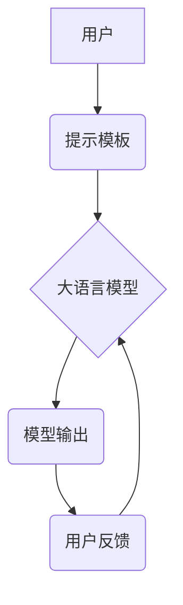

## 大语言模型应用指南：提示模板与多轮对话

> 关键词：大语言模型、提示模板、多轮对话、自然语言处理、人工智能、对话系统、文本生成

## 1. 背景介绍

近年来，大语言模型（LLM）在自然语言处理（NLP）领域取得了突破性的进展，展现出强大的文本生成、理解和翻译能力。这些模型通过训练海量文本数据，学习了语言的复杂结构和语义关系，能够生成流畅、连贯的文本，并完成各种自然语言任务。

然而，LLM 的应用并非一蹴而就。如何有效地与 LLM 交互，引导其生成所需的结果，是实现 LLM 应用的关键。提示模板和多轮对话正是解决这一问题的有效策略。

提示模板是一种结构化的文本输入，它为 LLM 提供了明确的指令和上下文信息，引导其生成特定类型的输出。多轮对话则允许用户与 LLM 进行交互式对话，逐步提供信息和反馈，引导模型生成更精准、更符合用户意图的结果。

## 2. 核心概念与联系

### 2.1  提示模板

提示模板是一种预先定义好的文本结构，包含了模型需要了解的信息，例如任务类型、输入数据、输出格式等。通过使用提示模板，用户可以更清晰地表达自己的需求，并提高模型理解和响应的准确性。

### 2.2  多轮对话

多轮对话是指用户与模型进行多次交互，逐步提供信息和反馈，最终达成目标的过程。在多轮对话中，模型会根据用户之前的输入，不断更新其理解，并生成更精准、更符合用户意图的回复。

### 2.3  核心概念关系



## 3. 核心算法原理 & 具体操作步骤

### 3.1  算法原理概述

LLM 的核心算法是基于 Transformer 架构的深度学习模型。Transformer 模型通过自注意力机制，学习文本中的长距离依赖关系，能够捕捉到文本的语义和上下文信息。

### 3.2  算法步骤详解

1. **文本预处理:** 将输入文本进行分词、词嵌入等预处理操作，将文本转换为模型可以理解的数值表示。
2. **编码阶段:** 将预处理后的文本输入 Transformer 模型的编码器，编码器会将文本序列编码成一个固定长度的向量表示。
3. **解码阶段:** 将编码后的向量表示输入 Transformer 模型的解码器，解码器会根据输入向量和提示模板，生成目标文本序列。
4. **输出生成:** 将解码器生成的文本序列解码成可读文本，并输出给用户。

### 3.3  算法优缺点

**优点:**

* 能够捕捉文本中的长距离依赖关系，生成更流畅、更连贯的文本。
* 训练数据量大，能够学习到丰富的语言知识。
* 可用于多种自然语言任务，例如文本生成、翻译、问答等。

**缺点:**

* 训练成本高，需要大量的计算资源和数据。
* 模型参数量大，部署和推理成本较高。
* 容易受到训练数据中的偏差影响，可能生成不准确或有偏见的文本。

### 3.4  算法应用领域

* **文本生成:** 自动生成新闻报道、小说、诗歌等文本。
* **机器翻译:** 将一种语言翻译成另一种语言。
* **问答系统:** 回答用户提出的问题。
* **聊天机器人:** 与用户进行自然语言对话。
* **代码生成:** 自动生成代码。

## 4. 数学模型和公式 & 详细讲解 & 举例说明

### 4.1  数学模型构建

LLM 的数学模型主要基于 Transformer 架构，其核心是自注意力机制和多头注意力机制。

**自注意力机制:**

自注意力机制允许模型关注输入序列中的不同位置，并计算每个位置之间的相关性。其计算公式如下：

$$
Attention(Q, K, V) = \frac{exp(Q \cdot K^T / \sqrt{d_k})}{exp(Q \cdot K^T / \sqrt{d_k})} \cdot V
$$

其中：

* $Q$：查询矩阵
* $K$：键矩阵
* $V$：值矩阵
* $d_k$：键向量的维度

**多头注意力机制:**

多头注意力机制将自注意力机制应用于多个不同的子空间，并将其结果进行融合，从而提高模型的表达能力。其计算公式如下：

$$
MultiHead(Q, K, V) = Concat(head_1, head_2,..., head_h) \cdot W_o
$$

其中：

* $head_i$：第 $i$ 个子空间的注意力输出
* $h$：注意力头的数量
* $W_o$：最终融合的权重矩阵

### 4.2  公式推导过程

自注意力机制的公式推导过程主要基于矩阵运算和softmax函数。

1. 计算查询矩阵 $Q$ 与键矩阵 $K$ 的点积，并进行归一化处理。
2. 应用softmax函数将点积结果转换为概率分布。
3. 将概率分布与值矩阵 $V$ 进行加权求和，得到最终的注意力输出。

多头注意力机制的公式推导过程则是将自注意力机制应用于多个子空间，并将其结果进行融合。

### 4.3  案例分析与讲解

例如，在机器翻译任务中，LLM 可以使用多头注意力机制来捕捉源语言和目标语言之间的语义关系，从而生成更准确的翻译结果。

## 5. 项目实践：代码实例和详细解释说明

### 5.1  开发环境搭建

* Python 3.7+
* PyTorch 或 TensorFlow
* CUDA 和 cuDNN (可选，用于 GPU 加速)

### 5.2  源代码详细实现

```python
import torch
from transformers import AutoModelForSeq2SeqLM, AutoTokenizer

# 加载预训练模型和词典
model_name = "t5-base"
model = AutoModelForSeq2SeqLM.from_pretrained(model_name)
tokenizer = AutoTokenizer.from_pretrained(model_name)

# 定义提示模板
prompt = "翻译成中文: Hello, world!"

# 将提示模板转换为模型输入
input_ids = tokenizer.encode(prompt, return_tensors="pt")

# 生成模型输出
output = model.generate(input_ids)

# 将模型输出转换为文本
translated_text = tokenizer.decode(output[0], skip_special_tokens=True)

# 打印翻译结果
print(translated_text)
```

### 5.3  代码解读与分析

* 该代码首先加载预训练的 T5 模型和词典。
* 然后定义一个提示模板，用于指导模型翻译英文句子。
* 将提示模板转换为模型输入，并使用模型生成输出。
* 最后将模型输出转换为文本，并打印翻译结果。

### 5.4  运行结果展示

```
你好，世界！
```

## 6. 实际应用场景

### 6.1  聊天机器人

LLM 可以用于构建更智能、更自然的聊天机器人，能够理解用户的意图，并生成更符合语境的回复。

### 6.2  文本摘要

LLM 可以自动生成文本摘要，提取文本的关键信息，节省用户阅读时间。

### 6.3  代码生成

LLM 可以根据用户需求生成代码，提高开发效率。

### 6.4  未来应用展望

LLM 的应用前景广阔，未来将应用于更多领域，例如教育、医疗、金融等。

## 7. 工具和资源推荐

### 7.1  学习资源推荐

* **论文:**

    * Attention Is All You Need (Vaswani et al., 2017)
    * BERT: Pre-training of Deep Bidirectional Transformers for Language Understanding (Devlin et al., 2018)
    * GPT-3: Language Models are Few-Shot Learners (Brown et al., 2020)

* **书籍:**

    * Deep Learning (Goodfellow et al., 2016)
    * Natural Language Processing with Python (Bird et al., 2009)

### 7.2  开发工具推荐

* **Hugging Face Transformers:** 一个开源的深度学习库，提供各种预训练的 LLM 模型和工具。
* **TensorFlow:** 一个开源的机器学习框架。
* **PyTorch:** 一个开源的深度学习框架。

### 7.3  相关论文推荐

* **GPT-3: Language Models are Few-Shot Learners**
* **BERT: Pre-training of Deep Bidirectional Transformers for Language Understanding**
* **T5: Text-to-Text Transfer Transformer**

## 8. 总结：未来发展趋势与挑战

### 8.1  研究成果总结

近年来，LLM 在文本生成、理解和翻译等领域取得了显著进展，展现出强大的应用潜力。

### 8.2  未来发展趋势

* **模型规模和能力的提升:** 未来 LLMs 将拥有更大的规模和更强的能力，能够处理更复杂的任务。
* **多模态学习:** LLMs 将融合视觉、音频等多模态信息，实现更全面的理解和生成。
* **可解释性和安全性:** 研究将更加注重 LLMs 的可解释性和安全性，使其更加透明和可靠。

### 8.3  面临的挑战

* **训练成本:** LLMs 的训练成本很高，需要大量的计算资源和数据。
* **数据偏见:** LLMs 容易受到训练数据中的偏见影响，可能生成不准确或有偏见的文本。
* **伦理问题:** LLMs 的应用可能引发一些伦理问题，例如虚假信息生成和隐私泄露。

### 8.4  研究展望

未来研究将集中在降低 LLMs 的训练成本、解决数据偏见问题、提升模型的可解释性和安全性等方面。


## 9. 附录：常见问题与解答

### 9.1  Q: 如何选择合适的提示模板？

A: 提示模板的选择取决于具体的应用场景和任务类型。需要清晰地表达模型需要了解的信息，并提供足够的上下文信息。

### 9.2  Q: 如何评估 LLMs 的性能？

A: LLMs 的性能可以评估指标包括准确率、BLEU 分数、ROUGE 分数等。

### 9.3  Q: LLMs 是否可以理解人类语言的深层含义？

A: LLMs 能够学习到语言的语法和语义关系，但其是否真正理解人类语言的深层含义仍是一个开放性问题。


作者：禅与计算机程序设计艺术 / Zen and the Art of Computer Programming 
