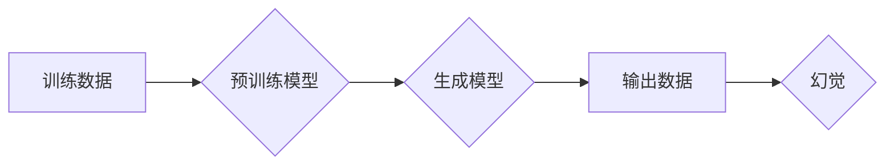

## 幻觉来自训练预训练阶段

> 关键词：预训练模型、生成模型、幻觉、训练数据、偏差、鲁棒性

### 1. 背景介绍

近年来，深度学习在各个领域取得了令人瞩目的成就，其中预训练模型的兴起尤为引人注目。预训练模型通过在海量数据上进行训练，学习到通用的语言表示和知识，从而在后续下游任务中表现出惊人的性能。然而，预训练模型也并非完美无缺，它们有时会生成令人费解、甚至荒谬的输出，这些输出被称为“幻觉”。

幻觉现象的出现，不仅影响了预训练模型的实际应用，也引发了人们对模型训练机制和数据质量的深入思考。本文将深入探讨预训练模型的幻觉现象，分析其成因，并展望未来解决该问题的可能方向。

### 2. 核心概念与联系

**2.1 预训练模型**

预训练模型是一种在大量无标注数据上进行预训练的深度学习模型。预训练的目标是学习到通用的语言表示和知识，这些表示可以用于后续下游任务，例如文本分类、机器翻译、问答系统等。

**2.2 生成模型**

生成模型是一种能够从训练数据中学习分布，并生成新数据的模型。常见的生成模型包括变分自编码器（VAE）、生成对抗网络（GAN）和Transformer变体。预训练模型中，许多生成模型被用于生成文本、图像、音频等多种数据类型。

**2.3 幻觉**

幻觉是指预训练模型在生成数据时产生的不合理、不符合逻辑、甚至荒谬的输出。这些输出可能包含错误的语法、不相关的概念、甚至完全虚构的内容。

**2.4 训练数据偏差**

训练数据是预训练模型学习的基础，数据中的偏差会直接影响模型的输出。例如，如果训练数据中存在性别、种族或地域的偏见，模型可能会生成带有这些偏见的输出。

**2.5 模型鲁棒性**

模型鲁棒性是指模型对输入数据变化的适应能力。如果模型对输入数据变化不敏感，则更容易产生幻觉。

**Mermaid 流程图**

### 3. 核心算法原理 & 具体操作步骤

**3.1 算法原理概述**

预训练模型的训练过程通常分为两个阶段：预训练阶段和微调阶段。

* **预训练阶段:** 在海量无标注数据上进行训练，学习到通用的语言表示和知识。常用的预训练任务包括语言建模、文本分类、问答系统等。
* **微调阶段:** 将预训练模型应用于特定下游任务，在少量标注数据上进行微调，以提高模型在该任务上的性能。

**3.2 算法步骤详解**

1. **数据预处理:** 将原始数据进行清洗、格式化和编码，使其适合模型训练。
2. **模型选择:** 选择合适的预训练模型架构，例如BERT、GPT-3、T5等。
3. **预训练:** 在海量无标注数据上进行训练，使用预训练任务优化模型参数。
4. **微调:** 将预训练模型应用于特定下游任务，在少量标注数据上进行微调，优化模型参数。
5. **评估:** 使用测试数据评估模型性能，并根据需要进行模型调整。

**3.3 算法优缺点**

**优点:**

* **性能提升:** 预训练模型在许多下游任务中表现出优异的性能。
* **数据效率:** 预训练模型可以利用海量无标注数据进行训练，减少对标注数据的依赖。
* **可迁移性:** 预训练模型可以迁移到不同的下游任务，降低开发成本和时间。

**缺点:**

* **计算资源消耗:** 预训练模型的训练需要大量的计算资源。
* **数据偏差:** 训练数据中的偏差会影响模型的输出，导致幻觉现象。
* **黑盒效应:** 预训练模型的内部机制复杂，难以解释其输出结果。

**3.4 算法应用领域**

预训练模型在各个领域都有广泛的应用，例如：

* **自然语言处理:** 文本分类、机器翻译、问答系统、文本生成等。
* **计算机视觉:** 图像分类、目标检测、图像生成等。
* **语音识别:** 语音转文本、语音合成等。
* **推荐系统:** 商品推荐、内容推荐等。

### 4. 数学模型和公式 & 详细讲解 & 举例说明

**4.1 数学模型构建**

预训练模型通常基于神经网络架构，其数学模型可以表示为一个多层感知机（MLP）。每个层包含多个神经元，每个神经元接收来自上一层的输入，并通过激活函数进行处理，输出到下一层。

**4.2 公式推导过程**

预训练模型的训练目标是最大化似然函数，即模型生成训练数据的概率。

$$
\mathcal{L} = -\sum_{i=1}^{N} \log p(x_i | \theta)
$$

其中：

* $\mathcal{L}$ 是损失函数。
* $N$ 是训练数据的数量。
* $x_i$ 是第 $i$ 个训练数据。
* $\theta$ 是模型参数。

**4.3 案例分析与讲解**

例如，在语言建模任务中，预训练模型的目标是预测下一个词。假设训练数据为“今天天气很好”，模型需要预测下一个词是“吗”。模型会根据前面的词语“今天天气很好”计算每个词的概率，并选择概率最高的词作为预测结果。

### 5. 项目实践：代码实例和详细解释说明

**5.1 开发环境搭建**

使用Python语言和深度学习框架TensorFlow或PyTorch搭建开发环境。

**5.2 源代码详细实现**

使用预训练模型库，例如HuggingFace Transformers，加载预训练模型，并进行微调。

**5.3 代码解读与分析**

代码中主要包含以下部分：

* 数据加载和预处理
* 模型加载和配置
* 训练过程
* 模型评估

**5.4 运行结果展示**

使用测试数据评估模型性能，并展示模型生成的输出结果。

### 6. 实际应用场景

预训练模型在各个领域都有广泛的应用场景，例如：

* **聊天机器人:** 使用预训练语言模型生成自然流畅的对话回复。
* **文本摘要:** 使用预训练模型提取文本的关键信息，生成简洁的摘要。
* **机器翻译:** 使用预训练模型将文本从一种语言翻译成另一种语言。

**6.4 未来应用展望**

预训练模型的未来应用前景广阔，例如：

* **个性化推荐:** 根据用户的兴趣和偏好，提供个性化的商品或内容推荐。
* **自动代码生成:** 使用预训练模型自动生成代码，提高开发效率。
* **科学发现:** 使用预训练模型分析海量科学数据，促进科学发现。

### 7. 工具和资源推荐

**7.1 学习资源推荐**

* **书籍:** 《深度学习》
* **课程:** Coursera深度学习课程
* **博客:** TensorFlow博客、PyTorch博客

**7.2 开发工具推荐**

* **TensorFlow:** 开源深度学习框架
* **PyTorch:** 开源深度学习框架
* **HuggingFace Transformers:** 预训练模型库

**7.3 相关论文推荐**

* BERT: Pre-training of Deep Bidirectional Transformers for Language Understanding
* GPT-3: Language Models are Few-Shot Learners
* T5: Text-to-Text Transfer Transformer

### 8. 总结：未来发展趋势与挑战

**8.1 研究成果总结**

预训练模型在自然语言处理、计算机视觉等领域取得了显著成果，展现出强大的学习能力和应用潜力。

**8.2 未来发展趋势**

* **模型规模扩大:** 预训练模型的规模将继续扩大，学习到更丰富的知识和表示。
* **多模态学习:** 预训练模型将融合文本、图像、音频等多种模态数据，实现更全面的理解和生成。
* **可解释性增强:** 研究人员将致力于提高预训练模型的可解释性，使其输出结果更易于理解和信任。

**8.3 面临的挑战**

* **数据安全和隐私:** 预训练模型的训练需要海量数据，如何保证数据安全和隐私是一个重要挑战。
* **模型偏见:** 训练数据中的偏差会影响模型的输出，如何消除模型偏见是一个持续的研究课题。
* **计算资源消耗:** 预训练模型的训练需要大量的计算资源，如何降低计算成本是一个关键问题。

**8.4 研究展望**

未来，预训练模型将继续朝着更强大、更安全、更可解释的方向发展，在各个领域发挥越来越重要的作用。

### 9. 附录：常见问题与解答

**9.1 如何选择合适的预训练模型？**

选择合适的预训练模型需要根据具体的应用场景和任务需求进行考虑。例如，对于文本分类任务，可以选择BERT或RoBERTa等预训练语言模型；对于图像分类任务，可以选择ResNet或EfficientNet等预训练图像模型。

**9.2 如何解决预训练模型的幻觉问题？**

解决预训练模型的幻觉问题是一个复杂的问题，需要从多个方面入手，例如：

* 使用更优质的数据进行训练。
* 增强模型的鲁棒性，使其对输入数据变化不敏感。
* 使用正则化技术，防止模型过拟合。
* 在训练过程中加入对抗训练，提高模型的对抗性能力。

作者：禅与计算机程序设计艺术 / Zen and the Art of Computer Programming 
