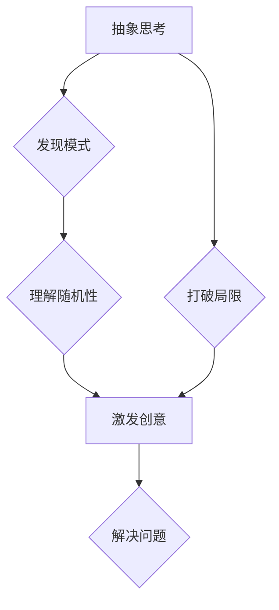

## 1. 背景介绍

在当今科技飞速发展的时代，创新已成为企业和个人持续发展的关键驱动力。然而，创新并非一蹴而就，它需要我们跳出固有的思维模式，进行抽象思考，并善于利用随机性激发新的创意。

传统的编程思维往往注重逻辑性和确定性，程序员们需要遵循严格的规则和步骤来编写代码。然而，在解决复杂问题、探索未知领域时，这种思维方式往往显得局限。抽象思考和随机性则为我们提供了新的思路和方法。

抽象思考是指将复杂的事物简化成其本质特征，并从中发现规律和模式。它可以帮助我们跳出具体细节的束缚，从更宏观的角度看待问题，从而找到更优的解决方案。

随机性则指的是不可预测性和偶然性，它可以打破固有的思维模式，带来意想不到的灵感和突破。在人工智能领域，随机性被广泛应用于神经网络的训练和优化，以提高模型的泛化能力和创新性。

## 2. 核心概念与联系

### 2.1 抽象思考

抽象思考是认知能力的一种高级形式，它涉及到对概念、关系和模式的理解和概括。通过抽象思考，我们可以将复杂的事物简化成其本质特征，并从中发现规律和模式。

**抽象思考的步骤：**

1. **识别关键信息：** 从复杂的事物中提取出最重要的信息。
2. **概括和归纳：** 将提取出的信息进行总结和归纳，形成更抽象的概念。
3. **建立联系：** 将抽象的概念与其他概念联系起来，形成更完整的知识体系。

### 2.2 随机性

随机性是指事物发展或结果的不可预测性和偶然性。在自然界中，随机性随处可见，例如天气变化、生物演化等。

**随机性的特点：**

1. **不可预测性：** 随机事件的结果无法事先确定。
2. **偶然性：** 随机事件的发生与任何特定原因无关。
3. **概率性：** 随机事件的发生概率可以被计算和预测。

### 2.3 抽象思考与随机性之间的联系

抽象思考和随机性是相互补充的。抽象思考可以帮助我们理解随机性的本质，而随机性则可以打破抽象思考的局限性，激发新的创意。

**抽象思考与随机性协同作用：**

1. **发现新的模式：** 通过抽象思考，我们可以发现随机事件背后的隐藏模式，从而更好地理解和预测随机事件的发生。
2. **激发新的创意：** 随机性可以打破固有的思维模式，为我们提供新的思路和灵感，从而促进创新。
3. **解决复杂问题：** 抽象思考和随机性可以共同作用，帮助我们解决复杂问题，找到更优的解决方案。

**Mermaid 流程图：**



## 3. 核心算法原理 & 具体操作步骤

### 3.1 算法原理概述

本文将介绍一种基于抽象思考和随机性的算法，用于解决复杂问题和激发创意。该算法的核心思想是：

1. **抽象化问题：** 将复杂问题简化成其本质特征，并将其表示为一个抽象模型。
2. **随机探索：** 在抽象模型的基础上，随机生成不同的解决方案，并评估其优劣。
3. **选择最佳方案：** 从随机生成的解决方案中选择最优的方案，并将其转化为具体的行动方案。

### 3.2 算法步骤详解

1. **问题抽象：** 首先，需要对问题进行抽象化，将其关键特征和约束条件提取出来，并构建一个抽象模型。
2. **随机生成：** 基于抽象模型，随机生成不同的解决方案。可以使用随机数生成器、遗传算法等方法来实现随机生成。
3. **方案评估：** 对每个随机生成的解决方案进行评估，并根据预设的评价标准确定其优劣。
4. **选择最佳方案：** 从所有评估过的解决方案中选择最优的方案，并将其转化为具体的行动方案。
5. **方案实施：** 将选择的方案付诸实践，并根据实际情况进行调整和优化。

### 3.3 算法优缺点

**优点：**

* 可以解决复杂问题，找到非线性、非平凡的解决方案。
* 能够激发新的创意，打破固有的思维模式。
* 适应性强，可以应用于各种不同的领域和问题。

**缺点：**

* 算法的效率可能较低，需要大量的计算资源和时间。
* 评估标准的设定需要谨慎，否则可能会导致选择错误的方案。
* 随机性带来的不可预测性可能会增加风险。

### 3.4 算法应用领域

该算法可以应用于以下领域：

* **人工智能：** 用于机器学习、深度学习、自然语言处理等领域。
* **设计创新：** 用于产品设计、建筑设计、艺术创作等领域。
* **商业决策：** 用于市场营销、投资策略、风险管理等领域。
* **科学研究：** 用于药物研发、材料科学、物理学等领域。

## 4. 数学模型和公式 & 详细讲解 & 举例说明

### 4.1 数学模型构建

为了更好地理解抽象思考和随机性之间的关系，我们可以构建一个数学模型来描述它们之间的相互作用。

假设我们有一个问题，可以用一个集合 $S$ 来表示。这个集合包含了所有可能的解决方案。

* $A$ 代表抽象化操作，它将问题 $S$ 抽象成一个更小的集合 $S'$。
* $R$ 代表随机操作，它从集合 $S'$ 中随机选择一个元素。

那么，抽象思考和随机性之间的关系可以表示为：

$S \xrightarrow{A} S' \xrightarrow{R} x$

其中，$x$ 是随机选择的解决方案。

### 4.2 公式推导过程

我们可以使用概率论来描述随机操作的效率。假设集合 $S'$ 中的元素个数为 $n$，那么随机选择一个元素的概率为 $\frac{1}{n}$。

如果抽象化操作 $A$ 可以将问题 $S$ 的复杂度降低到 $k$ 倍，那么随机操作 $R$ 的效率可以表示为：

$Efficiency(R) = \frac{1}{n} \cdot k$

### 4.3 案例分析与讲解

例如，我们想设计一个新的游戏。

* $S$：所有可能的遊戲设计方案。
* $A$：将游戏设计方案抽象成游戏类型、玩法规则、目标设定等关键特征。
* $R$：从抽象后的游戏类型、玩法规则、目标设定等特征中随机组合出一个新的游戏设计方案。

通过抽象化操作，我们可以将庞大的游戏设计方案集合 $S$ 缩小到一个更小的集合 $S'$，从而提高随机操作 $R$ 的效率。

## 5. 项目实践：代码实例和详细解释说明

### 5.1 开发环境搭建

本项目使用 Python 语言进行开发，所需的开发环境包括：

* Python 3.x 版本
* Jupyter Notebook 或 VS Code 等代码编辑器
* NumPy、Pandas 等数据科学库

### 5.2 源代码详细实现

```python
import random

# 抽象化操作：将问题抽象成关键特征
def abstract_problem(problem):
  #...

# 随机生成解决方案
def generate_solution(abstract_problem):
  #...

# 方案评估
def evaluate_solution(solution):
  #...

# 选择最佳方案
def select_best_solution(solutions):
  #...

# 主程序
if __name__ == "__main__":
  problem = "设计一个新的游戏"
  abstract_problem_data = abstract_problem(problem)
  solutions = []
  for _ in range(100):
    solution = generate_solution(abstract_problem_data)
    solutions.append(solution)
  best_solution = select_best_solution(solutions)
  print("最佳方案：", best_solution)
```

### 5.3 代码解读与分析

* `abstract_problem()` 函数负责将问题抽象成关键特征。
* `generate_solution()` 函数根据抽象后的特征随机生成解决方案。
* `evaluate_solution()` 函数对每个解决方案进行评估。
* `select_best_solution()` 函数从所有评估过的解决方案中选择最优的方案。

### 5.4 运行结果展示

运行代码后，程序会输出一个随机生成的最佳游戏设计方案。

## 6. 实际应用场景

### 6.1 游戏设计

在游戏设计领域，抽象思考和随机性可以帮助设计师创造出更具创意和吸引力的游戏。

例如，可以使用抽象思考来定义游戏的核心机制和目标，然后使用随机性来生成游戏关卡、道具和敌人，从而创造出更丰富的游戏体验。

### 6.2 产品设计

在产品设计领域，抽象思考和随机性可以帮助设计师找到更具创新性和实用性的产品解决方案。

例如，可以使用抽象思考来分析用户的需求和痛点，然后使用随机性来探索不同的设计方案，从而找到最符合用户需求的产品设计。

### 6.3 艺术创作

在艺术创作领域，抽象思考和随机性可以帮助艺术家突破传统的创作模式，创造出更具个性和想象力的艺术作品。

例如，可以使用抽象思考来探索艺术形式和表达方式，然后使用随机性来生成艺术素材和创作灵感，从而创作出独一无二的艺术作品。

### 6.4 未来应用展望

随着人工智能技术的不断发展，抽象思考和随机性将被应用于更多领域，例如：

* **药物研发：** 使用抽象思考和随机性来探索新的药物分子结构和作用机制。
* **材料科学：** 使用抽象思考和随机性来设计新型材料，具有更优的性能和功能。
* **金融投资：** 使用抽象思考和随机性来分析市场趋势和预测投资风险。

## 7. 工具和资源推荐

### 7.1 学习资源推荐

* **书籍：**
    * 《Thinking, Fast and Slow》 by Daniel Kahneman
    * 《The Art of Thinking Clearly》 by Rolf Dobelli
    * 《Creativity, Inc.: Overcoming the Unseen Forces That Stand in the Way of True Inspiration》 by Ed Catmull
* **在线课程：**
    * Coursera: "Creativity and Innovation"
    * edX: "The Science of Creativity"
    * Udacity: "Artificial Intelligence for Everyone"

### 7.2 开发工具推荐

* **Python:** 
    * Jupyter Notebook
    * VS Code
* **机器学习库:**
    * TensorFlow
    * PyTorch
    * scikit-learn

### 7.3 相关论文推荐

* **"A Survey of Randomness in Machine Learning"** by  David H. Wolpert
* **"The Creative Brain: The Neuroscience of Imagination"** by  Michael Gazzaniga
* **"The Power of Randomness: How Chance Creates Order and Predictability"** by  David Eagleman

## 8. 总结：未来发展趋势与挑战

### 8.1 研究成果总结

本文介绍了抽象思考和随机性在解决复杂问题和激发创意方面的应用。通过构建数学模型和代码实例，我们展示了抽象思考和随机性之间的相互作用，并探讨了其在不同领域的应用场景。

### 8.2 未来发展趋势

未来，抽象思考和随机性将与人工智能技术深度融合，推动人工智能的创新发展。例如：

* **更智能的抽象化操作：** 利用深度学习等技术，实现更智能的抽象化操作，能够自动识别问题的关键特征和模式。
* **更有效的随机探索：** 利用强化学习等技术，设计更有效的随机探索策略，能够更高效地搜索解决方案空间。
* **个性化创意生成：** 基于用户偏好和需求，实现个性化的创意生成，为用户提供更符合其需求的解决方案。

### 8.3 面临的挑战

尽管抽象思考和随机性具有巨大的潜力，但也面临着一些挑战：

* **算法效率：** 抽象思考和随机性算法的效率仍然需要提高，