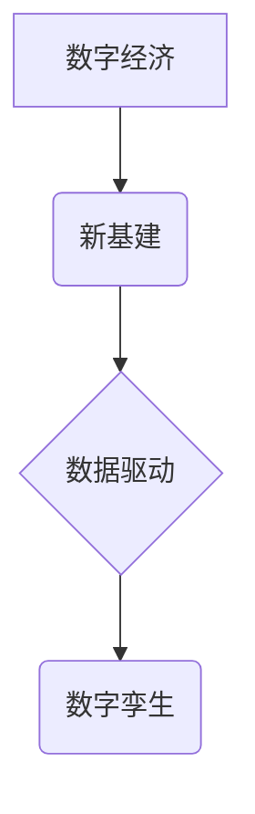

## 数字中国战略布局与新质生产力

> 关键词：数字经济、新基建、数据驱动、人工智能、云计算、区块链、数字孪生

### 1. 背景介绍

近年来，数字技术蓬勃发展，深刻改变着人类社会生产方式和生活方式。中国政府高度重视数字经济发展，于2021年发布了《数字中国建设整体方案》，明确提出要建设数字中国，推动数字经济高质量发展。

数字中国战略的提出，标志着中国迈向数字经济时代的关键一步。其核心目标是通过数字化转型，提升国家治理能力和服务水平，推动经济社会高质量发展。

### 2. 核心概念与联系

**2.1 数字经济**

数字经济是指以数字技术为基础，以数据为核心要素，以网络为主要载体，以智能化和数字化为特征的经济活动。其涵盖范围广泛，包括电子商务、互联网金融、数字内容、云计算、大数据等领域。

**2.2 新基建**

新基建是指以5G、数据中心、人工智能、工业互联网等为重点的国家基础设施建设。其目的是为数字经济发展提供坚实的基础，提升数字经济的生产力和竞争力。

**2.3 数据驱动**

数据驱动是指以数据为基础，通过数据分析和挖掘，为决策提供依据，推动业务发展。数据驱动是数字经济的核心要素之一，也是数字中国建设的重要方向。

**2.4 数字孪生**

数字孪生是指利用数字技术构建与物理世界完全映射的虚拟模型，用于模拟、预测和优化物理世界的运行状态。数字孪生技术在工业互联网、城市管理、医疗健康等领域具有广泛应用前景。

**2.5 核心概念关系图**



### 3. 核心算法原理 & 具体操作步骤

**3.1 算法原理概述**

数字中国战略的实施离不开一系列先进算法的支持。其中，机器学习、深度学习、自然语言处理等算法在数据分析、智能决策、个性化服务等方面发挥着重要作用。

**3.2 算法步骤详解**

以机器学习为例，其基本步骤包括：

1. 数据收集和预处理：收集相关数据，并进行清洗、转换、特征提取等预处理工作。
2. 模型选择：根据具体任务选择合适的机器学习模型，例如线性回归、逻辑回归、决策树、支持向量机等。
3. 模型训练：利用训练数据训练模型，调整模型参数，使其能够准确预测或分类。
4. 模型评估：利用测试数据评估模型的性能，例如准确率、召回率、F1-score等。
5. 模型部署：将训练好的模型部署到实际应用场景中，用于预测或分类新的数据。

**3.3 算法优缺点**

机器学习算法具有强大的数据分析能力和预测能力，但同时也存在一些缺点，例如：

* 对数据质量要求高，数据不完整或噪声会影响模型性能。
* 模型解释性较差，难以理解模型的决策过程。
* 需要大量的计算资源和时间进行训练。

**3.4 算法应用领域**

机器学习算法在各个领域都有广泛应用，例如：

* **金融领域:** 欺诈检测、信用评分、风险管理等。
* **医疗领域:** 疾病诊断、药物研发、个性化医疗等。
* **电商领域:** 商品推荐、用户画像、精准营销等。
* **交通领域:** 交通预测、智能驾驶、物流优化等。

### 4. 数学模型和公式 & 详细讲解 & 举例说明

**4.1 数学模型构建**

机器学习算法通常基于数学模型进行构建。例如，线性回归模型假设目标变量与输入变量之间存在线性关系，可以用以下公式表示：

$$y = w_0 + w_1x_1 + w_2x_2 +... + w_nx_n + \epsilon$$

其中：

* $y$ 是目标变量
* $x_1, x_2,..., x_n$ 是输入变量
* $w_0, w_1, w_2,..., w_n$ 是模型参数
* $\epsilon$ 是误差项

**4.2 公式推导过程**

模型参数的学习过程通常使用梯度下降算法进行优化。梯度下降算法的目标是找到使模型预测误差最小化的参数值。

**4.3 案例分析与讲解**

假设我们想要预测房价，输入变量包括房屋面积、房间数量、地理位置等。我们可以使用线性回归模型进行预测，并通过梯度下降算法训练模型参数。

### 5. 项目实践：代码实例和详细解释说明

**5.1 开发环境搭建**

可以使用Python语言和相关的机器学习库，例如Scikit-learn，TensorFlow等，进行项目开发。

**5.2 源代码详细实现**

```python
from sklearn.linear_model import LinearRegression
from sklearn.model_selection import train_test_split
import pandas as pd

# 加载数据
data = pd.read_csv('house_price.csv')

# 分割数据
X = data[['area', 'rooms', 'location']]
y = data['price']
X_train, X_test, y_train, y_test = train_test_split(X, y, test_size=0.2, random_state=42)

# 创建线性回归模型
model = LinearRegression()

# 训练模型
model.fit(X_train, y_train)

# 预测测试数据
y_pred = model.predict(X_test)

# 评估模型性能
from sklearn.metrics import mean_squared_error
mse = mean_squared_error(y_test, y_pred)
print(f'Mean Squared Error: {mse}')
```

**5.3 代码解读与分析**

这段代码首先加载房价数据，然后将数据分割为训练集和测试集。接着创建线性回归模型，并使用训练集训练模型参数。最后使用测试集预测房价，并计算模型性能指标。

**5.4 运行结果展示**

运行结果会显示测试集的平均平方误差，用于评估模型的预测精度。

### 6. 实际应用场景

**6.1 数字经济发展**

数字中国战略的实施将推动数字经济的快速发展，例如：

* **电子商务:** 数字技术将进一步提升电商平台的效率和用户体验，促进线上线下融合发展。
* **互联网金融:** 数字金融将提供更便捷、更安全、更普惠的金融服务，促进金融科技创新。
* **数字内容:** 数字内容产业将迎来新的发展机遇，例如虚拟现实、增强现实、人工智能内容创作等。

**6.2 政府治理能力提升**

数字技术将助力政府提升治理能力，例如：

* **智慧城市:** 数字孪生技术将帮助城市管理者更好地了解城市运行状态，优化城市规划和管理。
* **精准扶贫:** 数据分析技术将帮助政府精准识别贫困人口，制定精准扶贫政策。
* **公共服务:** 数字平台将提供更加便捷、高效的公共服务，例如医疗、教育、养老等。

**6.3 社会生活方式变革**

数字技术将深刻改变人们的生活方式，例如：

* **远程办公:** 数字技术将促进远程办公模式的普及，提高工作效率和生活质量。
* **在线教育:** 数字技术将推动在线教育的发展，提供更加个性化、更加便捷的学习体验。
* **智能家居:** 数字技术将赋予家居智能化，提高生活便利性和安全性。

**6.4 未来应用展望**

数字中国战略的实施将带来更多新的应用场景，例如：

* **工业互联网:** 数字技术将推动工业生产的智能化和数字化转型，提高生产效率和产品质量。
* **数字农业:** 数字技术将帮助农业生产者提高生产效率、降低成本、提高产品质量。
* **数字文化:** 数字技术将促进文化产业的数字化发展，丰富文化生活。

### 7. 工具和资源推荐

**7.1 学习资源推荐**

* **在线课程:** Coursera、edX、Udacity等平台提供丰富的机器学习、深度学习等课程。
* **书籍:** 《深度学习》、《机器学习实战》等书籍是学习相关知识的经典教材。
* **开源社区:** GitHub、Stack Overflow等开源社区提供丰富的代码示例和技术支持。

**7.2 开发工具推荐**

* **Python:** Python语言是机器学习和数据科学领域最常用的编程语言。
* **Scikit-learn:** Scikit-learn是Python机器学习库，提供丰富的算法和工具。
* **TensorFlow:** TensorFlow是Google开发的深度学习框架，支持多种硬件平台。

**7.3 相关论文推荐**

* **《ImageNet Classification with Deep Convolutional Neural Networks》**
* **《Attention Is All You Need》**
* **《BERT: Pre-training of Deep Bidirectional Transformers for Language Understanding》**

### 8. 总结：未来发展趋势与挑战

**8.1 研究成果总结**

数字中国战略的实施取得了显著成果，例如：

* **新基建建设取得进展:** 5G网络建设加速，数据中心规模不断扩大。
* **数字经济发展迅速:** 电子商务、互联网金融、数字内容等领域取得快速发展。
* **政府治理能力提升:** 智慧城市建设取得突破，公共服务更加便捷高效。

**8.2 未来发展趋势**

未来，数字中国战略将继续深入推进，主要发展趋势包括：

* **人工智能技术发展:** 人工智能技术将更加成熟，应用场景更加广泛。
* **数据安全和隐私保护:** 数据安全和隐私保护将更加重要，需要加强相关法律法规建设。
* **数字鸿沟缩小:** 需要加大对数字基础设施建设和人才培养的投入，缩小数字鸿沟。

**8.3 面临的挑战**

数字中国战略的实施也面临一些挑战，例如：

* **技术创新:** 需要持续加大对基础研究和技术创新的投入，推动数字技术发展。
* **人才培养:** 需要培养更多数字技术人才，满足数字经济发展需求。
* **数据治理:** 需要建立健全数据治理体系，保障数据安全和隐私。

**8.4 研究展望**

未来，我们将继续关注数字中国战略的进展，深入研究数字技术在各个领域的应用，为数字经济发展贡献力量。

### 9. 附录：常见问题与解答

**9.1 如何获取数字技术人才？**

可以通过以下途径获取数字技术人才：

* **高校合作:** 与高校建立合作关系，培养数字技术人才。
* **职业培训:** 开展职业培训，提升现有员工的数字技术技能。
* **引进人才:** 积极引进国内外优秀数字技术人才。

**9.2 如何保障数据安全和隐私？**

可以通过以下措施保障数据安全和隐私：

* **建立数据安全管理体系:** 制定数据安全管理制度，加强数据安全技术防护。
* **加强数据加密:** 对敏感数据进行加密保护，防止数据泄露。
* **规范数据使用:** 制定数据使用规则，规范数据使用行为。


作者：禅与计算机程序设计艺术 / Zen and the Art of Computer Programming 
