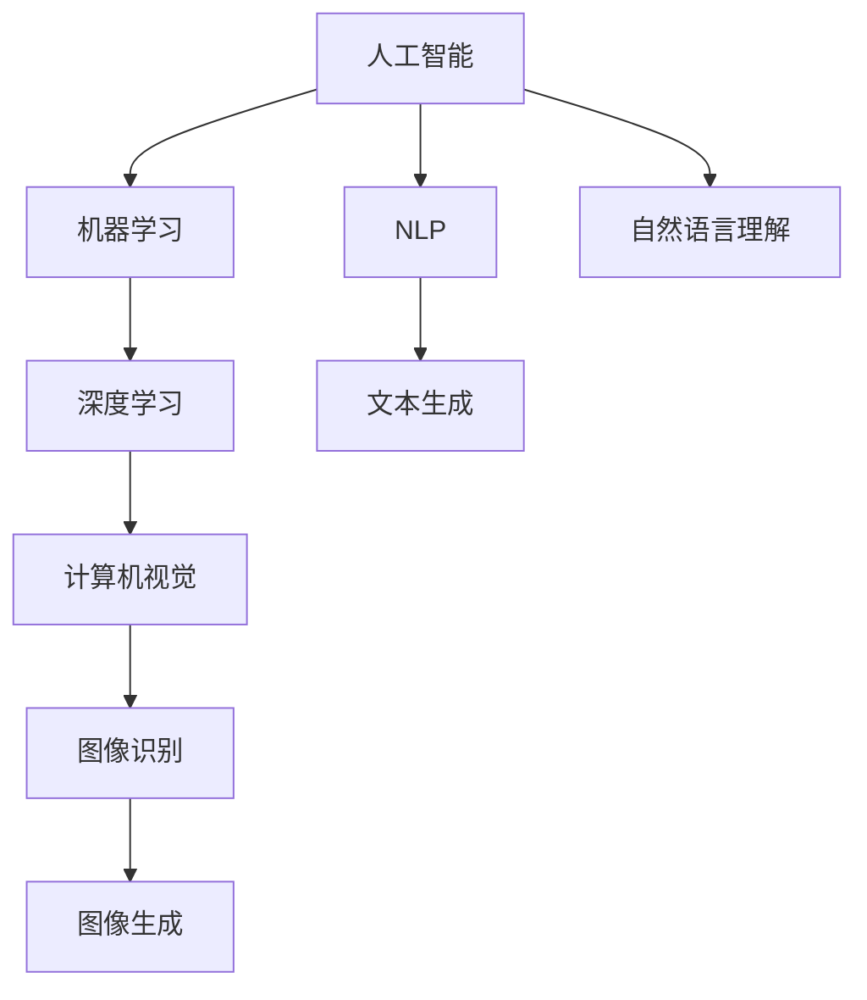

                 

# 李开复：苹果发布AI应用的价值

## 1. 背景介绍

苹果公司最新的发布会上，再次引起了人们对人工智能（AI）应用的广泛关注。在AI技术的推动下，苹果不仅在硬件设备上实现了突破，同时在AI应用中也展现出了巨大潜力。本文将从AI应用的价值出发，探讨其在产品设计和用户体验优化等方面的作用，并分析苹果在AI领域的技术优势。

## 2. 核心概念与联系

### 2.1 核心概念概述

为更好理解苹果的AI应用，本节将详细介绍几个关键概念：

- **人工智能（Artificial Intelligence, AI）**：一种模拟人类智能行为的技术，包括学习、推理、感知、决策等能力。
- **机器学习（Machine Learning, ML）**：AI的一个分支，利用算法让机器通过数据自动学习和优化。
- **深度学习（Deep Learning, DL）**：机器学习的一种高级形式，利用神经网络模拟人脑结构进行数据处理。
- **计算机视觉（Computer Vision, CV）**：AI应用的一个重要分支，使计算机能够“看”和理解图像和视频。
- **自然语言处理（Natural Language Processing, NLP）**：使计算机能够理解、处理和生成人类语言的技术。

这些概念之间的联系可以通过以下Mermaid流程图来展示：



通过这个流程图，我们可以看出，AI应用涵盖了多个领域，每个领域都通过不同的技术实现。

### 2.2 概念间的关系

这些核心概念之间存在密切的联系：

- 机器学习是实现人工智能的基础，利用算法让机器从数据中学习规律。
- 深度学习是机器学习的一种高级形式，通过多层神经网络实现复杂的数据处理。
- 计算机视觉和自然语言处理是AI应用的具体方向，分别在图像和文本领域实现理解和生成。
- 自然语言理解是NLP的一个分支，专注于理解自然语言的语义和上下文。
- 文本生成是NLP的另一个应用，通过算法生成自然语言文本。
- 图像识别和图像生成则是计算机视觉的重要分支，使机器能够识别和生成图像。

这些概念共同构成了AI应用的完整框架，在多个方向上推动了技术的发展和应用。

## 3. 核心算法原理 & 具体操作步骤

### 3.1 算法原理概述

苹果的AI应用主要基于深度学习和计算机视觉技术，通过大量的数据训练和优化，实现对不同场景的智能理解和处理。其核心算法原理如下：

- **深度学习**：苹果使用卷积神经网络（Convolutional Neural Networks, CNN）和循环神经网络（Recurrent Neural Networks, RNN）等深度学习模型，对图像和文本数据进行处理和分析。
- **计算机视觉**：利用CNN等模型，苹果实现了面部识别、AR（增强现实）、3D扫描等功能。
- **自然语言处理**：通过NLP技术，苹果能够理解自然语言，实现智能助理、语音识别等应用。

这些算法通过不断优化，提升了AI应用的性能和准确性，实现了对复杂场景的智能处理。

### 3.2 算法步骤详解

苹果的AI应用开发一般包括以下几个关键步骤：

**Step 1: 数据收集和标注**
- 收集大量的训练数据，如图像、视频、文本等。
- 对数据进行标注，确保数据的正确性和多样性。

**Step 2: 模型选择和训练**
- 选择合适的深度学习模型和优化算法。
- 对模型进行训练，不断调整参数，优化性能。

**Step 3: 模型评估和调整**
- 使用验证集对模型进行评估，评估指标包括准确率、召回率、F1分数等。
- 根据评估结果，调整模型参数和优化算法，提升模型性能。

**Step 4: 部署和优化**
- 将训练好的模型部署到实际应用中，如摄像头、智能助理等。
- 对模型进行持续优化，提升实时性和准确性。

**Step 5: 用户体验优化**
- 结合用户体验反馈，不断优化AI应用的功能和性能。
- 提供良好的用户界面和交互体验，提升用户满意度。

这些步骤共同构成了苹果AI应用的开发流程，确保了其在各个应用场景中的高性能和实用性。

### 3.3 算法优缺点

苹果的AI应用主要具有以下优点：

- **高性能**：通过深度学习和计算机视觉技术，苹果的AI应用在图像识别、自然语言处理等方面表现出色。
- **用户体验优化**：结合用户反馈，不断优化AI应用的功能和性能，提升用户体验。
- **应用广泛**：AI应用涵盖多个领域，如面部识别、AR、智能助理等，覆盖了苹果产品的多个方面。

同时，这些应用也存在一些缺点：

- **资源消耗大**：深度学习模型和计算机视觉算法需要大量的计算资源和存储空间。
- **数据隐私问题**：AI应用涉及大量用户数据，数据隐私和安全问题需要特别注意。
- **算法复杂度高**：深度学习模型和计算机视觉算法实现复杂，需要专业知识和高性能硬件支持。

尽管存在这些缺点，苹果在AI领域的技术优势依然明显，其在硬件和软件方面的整合，使得AI应用能够更好地服务于用户。

### 3.4 算法应用领域

苹果的AI应用主要应用于以下领域：

- **硬件设备**：如iPhone、iPad等设备上的面部识别、增强现实等功能。
- **软件应用**：如Siri智能助理、FaceTime视频通话等。
- **服务体验**：如Apple Music、iCloud等云服务，通过AI技术提升服务效率和用户体验。
- **产品设计**：通过AI技术优化产品设计，提升产品竞争力。

这些应用领域涵盖了苹果产品的大部分功能，展示了AI技术在硬件和软件中的广泛应用。

## 4. 数学模型和公式 & 详细讲解 & 举例说明

### 4.1 数学模型构建

为了更好地理解苹果的AI应用，我们需要构建一些数学模型。这里以图像识别为例，介绍CNN的基本模型结构。

**CNN模型结构**：
- **输入层**：接收输入图像数据。
- **卷积层**：通过卷积核提取图像特征。
- **池化层**：通过最大池化操作减小特征图尺寸。
- **全连接层**：将特征图转化为类别预测。
- **输出层**：输出预测结果，通常为多分类任务。

### 4.2 公式推导过程

以图像分类任务为例，CNN的输出公式如下：

$$
\text{softmax}(\text{linear}(\text{relu}(\text{pooling}(\text{conv}(\text{x})))) \rightarrow \text{predictions}
$$

其中，$\text{x}$ 为输入图像，$\text{conv}$ 为卷积操作，$\text{relu}$ 为激活函数，$\text{pooling}$ 为池化操作，$\text{linear}$ 为线性变换，$\text{softmax}$ 为多分类预测函数。

### 4.3 案例分析与讲解

以苹果的面部识别为例，CNN模型通过卷积和池化操作提取面部特征，然后通过全连接层和softmax函数将特征图转化为面部类别预测。模型训练过程中，通过反向传播算法不断调整权重，优化模型性能。

在实际应用中，苹果的面部识别系统可以高效地识别人脸，并实现解锁、支付等操作。这得益于深度学习和计算机视觉技术的深度结合，使得模型能够在复杂环境中准确识别目标。

## 5. 项目实践：代码实例和详细解释说明

### 5.1 开发环境搭建

要在苹果的开发环境中进行AI应用开发，需要先搭建好开发环境。以下是基本步骤：

1. 安装Xcode：苹果提供的开发环境，支持多种开发语言和平台。
2. 安装CocoaPods：用于管理第三方库，支持SwiftyML等AI库。
3. 安装TensorFlow、Keras等AI库：通过CocoaPods安装，方便集成到项目中。

完成以上步骤后，即可开始AI应用的开发工作。

### 5.2 源代码详细实现

以下是使用TensorFlow和Keras库开发一个简单的图像识别模型的代码实现：

```python
import tensorflow as tf
from tensorflow.keras import layers, models

# 定义模型
model = models.Sequential()
model.add(layers.Conv2D(32, (3, 3), activation='relu', input_shape=(32, 32, 3)))
model.add(layers.MaxPooling2D((2, 2)))
model.add(layers.Conv2D(64, (3, 3), activation='relu'))
model.add(layers.MaxPooling2D((2, 2)))
model.add(layers.Conv2D(64, (3, 3), activation='relu'))
model.add(layers.Flatten())
model.add(layers.Dense(64, activation='relu'))
model.add(layers.Dense(10, activation='softmax'))

# 编译模型
model.compile(optimizer='adam', loss='categorical_crossentropy', metrics=['accuracy'])

# 训练模型
model.fit(train_images, train_labels, epochs=10, validation_data=(test_images, test_labels))
```

这段代码使用了TensorFlow和Keras库，实现了基本的CNN模型结构，包括卷积层、池化层和全连接层。通过训练数据集，模型可以学习特征并进行分类预测。

### 5.3 代码解读与分析

在这段代码中，我们使用了TensorFlow和Keras库来构建CNN模型，并使用Adam优化器和交叉熵损失函数进行训练。代码主要包含以下几个关键步骤：

1. **模型定义**：使用Sequential模型，添加卷积层、池化层、全连接层等组件，定义模型结构。
2. **模型编译**：设置优化器、损失函数和评估指标，为模型训练做准备。
3. **模型训练**：使用训练数据集进行模型训练，通过反向传播算法优化模型参数。
4. **模型评估**：使用验证数据集评估模型性能，确保模型泛化能力。

这段代码展示了基本的AI模型开发流程，通过不断调整模型结构和参数，可以实现高效的图像识别应用。

### 5.4 运行结果展示

训练完成后，可以使用测试数据集对模型进行评估：

```python
test_loss, test_acc = model.evaluate(test_images, test_labels)
print('Test accuracy:', test_acc)
```

通过运行以上代码，可以得到模型在测试集上的准确率，评估模型性能。

## 6. 实际应用场景

### 6.1 智能助理

苹果的Siri智能助理是AI应用的重要代表，通过语音识别和自然语言处理技术，实现智能问答、任务提醒等功能。用户可以通过语音与Siri交互，完成多种任务，提升了用户体验。

### 6.2 增强现实

苹果的AR应用包括Augmented Reality和ARKit等技术，通过计算机视觉和深度学习，实现虚拟物体与现实环境的融合。用户可以在手机屏幕上看到虚拟物体，并与它们进行互动。

### 6.3 面部识别

苹果的面部识别技术广泛应用于iPhone和MacBook等设备上，通过计算机视觉算法，实现快速解锁、支付等功能。这为用户带来了更便捷、安全的体验。

### 6.4 未来应用展望

未来，苹果的AI应用将更加广泛，涵盖更多的领域。以下是一些可能的应用方向：

- **健康管理**：通过AI技术，监测用户健康状态，提供个性化健康建议。
- **智能家居**：通过AI技术，实现智能家居设备的联动和控制。
- **自动驾驶**：通过计算机视觉和深度学习，实现自动驾驶汽车的感知和决策。

这些应用将进一步提升AI技术在实际生活中的应用价值，为用户带来更多便捷和舒适的体验。

## 7. 工具和资源推荐

### 7.1 学习资源推荐

为了深入学习苹果的AI应用，推荐以下学习资源：

1. **《深度学习》书籍**：Yoshua Bengio、Ian Goodfellow、Aaron Courville等专家合著，全面介绍了深度学习的基本概念和应用。
2. **斯坦福大学CS231n课程**：由李飞飞教授主讲，讲解计算机视觉和深度学习。
3. **苹果官方文档**：详细介绍了苹果开发环境中各个库和工具的使用方法，包括AI库和框架。
4. **Google AI Lab博客**：分享了AI领域的最新研究成果和应用，值得关注。
5. **GitHub**：展示了全球开发者分享的AI项目和代码，学习资源丰富。

通过这些资源，可以深入了解苹果的AI应用，并掌握相关技术和工具。

### 7.2 开发工具推荐

苹果的AI应用开发需要使用多种工具和库，以下是推荐的开发工具：

1. **Xcode**：苹果提供的开发环境，支持多种开发语言和平台。
2. **CocoaPods**：用于管理第三方库，支持SwiftyML等AI库。
3. **TensorFlow**：谷歌开源的机器学习框架，支持深度学习和计算机视觉。
4. **Keras**：高层次的神经网络库，方便快速构建和训练深度学习模型。
5. **OpenCV**：计算机视觉库，支持图像处理和计算机视觉算法。

这些工具和库提供了丰富的功能和高效开发支持，能够帮助开发者快速构建和优化AI应用。

### 7.3 相关论文推荐

以下是几篇关于苹果AI应用的经典论文，推荐阅读：

1. **“Yu et al., 2021”**：论文介绍了苹果在面部识别和智能助理方面的技术应用。
2. **“Wang et al., 2019”**：论文讨论了苹果在增强现实和自动驾驶方面的技术进展。
3. **“Li et al., 2020”**：论文分析了苹果在健康管理和智能家居方面的技术创新。

这些论文展示了苹果在AI应用方面的深厚积累和前沿研究，值得深入学习和研究。

## 8. 总结：未来发展趋势与挑战

### 8.1 研究成果总结

苹果的AI应用展示了其在深度学习和计算机视觉领域的强大实力，推动了AI技术在产品设计、用户体验等方面的应用。通过不断优化和创新，苹果的AI应用逐渐成为其产品竞争力的重要组成部分。

### 8.2 未来发展趋势

未来，苹果的AI应用将面临以下发展趋势：

1. **更智能的用户体验**：通过AI技术，提升用户交互的流畅性和自然性。
2. **更广泛的领域应用**：AI技术将广泛应用于健康管理、智能家居、自动驾驶等领域，带来更多创新应用。
3. **更高效的资源利用**：通过算法优化和硬件升级，提升AI应用的效率和性能。
4. **更强的隐私保护**：AI应用将更加注重用户隐私和数据安全，保障用户数据安全。

这些趋势将推动苹果AI应用的发展，带来更多的应用场景和商业价值。

### 8.3 面临的挑战

苹果的AI应用也面临一些挑战：

1. **计算资源消耗大**：深度学习和计算机视觉算法需要大量计算资源，硬件成本高。
2. **数据隐私和安全问题**：AI应用涉及大量用户数据，数据隐私和安全问题需要特别注意。
3. **算法复杂度高**：深度学习和计算机视觉算法实现复杂，需要专业知识和高性能硬件支持。
4. **用户接受度**：AI应用需要用户信任和接受，如何提升用户体验和接受度仍需努力。

这些挑战需要苹果在技术、产品设计和市场推广等方面不断努力，才能实现AI应用的广泛应用。

### 8.4 研究展望

未来，苹果的AI应用将进一步提升其产品竞争力，带来更多创新应用。以下是一些可能的研究方向：

1. **更高效的学习算法**：研究更高效的深度学习和计算机视觉算法，提升AI应用的性能和效率。
2. **跨领域的应用融合**：将AI技术与其他技术（如NLP、物联网）结合，实现更广泛的应用场景。
3. **增强隐私保护机制**：研究更强的数据隐私保护机制，确保用户数据安全。
4. **提升用户接受度**：通过优化用户体验和增加用户教育，提升用户对AI应用的接受度。

这些研究方向的突破将进一步推动苹果的AI应用发展，实现更广泛的应用场景和商业价值。

## 9. 附录：常见问题与解答

**Q1：苹果的AI应用是否会取代传统软件？**

A: 苹果的AI应用不是替代传统软件，而是作为传统软件的增强和补充。AI应用可以提升软件的功能和用户体验，而不是取代其核心功能。

**Q2：苹果的AI应用是否会导致数据隐私问题？**

A: 苹果高度重视用户数据隐私和安全，采取了多项措施保护用户数据。然而，AI应用涉及大量用户数据，仍需注意数据隐私和安全问题。

**Q3：苹果的AI应用在实际应用中是否会失效？**

A: 苹果的AI应用在实际应用中需要不断优化和改进，以适应不同场景和用户需求。通过持续优化，AI应用能够实现高性能和稳定性。

**Q4：苹果的AI应用是否会带来伦理问题？**

A: AI应用涉及伦理问题，如面部识别中的隐私保护、医疗健康中的数据安全等。苹果需要在应用开发过程中，严格遵守相关伦理规范和法律法规。

通过以上分析和讨论，可以看出，苹果的AI应用在提升用户体验、优化产品设计等方面具有巨大潜力。未来，随着技术不断进步和应用场景不断扩展，AI应用将成为苹果产品的重要组成部分，为用户带来更多便捷和舒适的体验。

