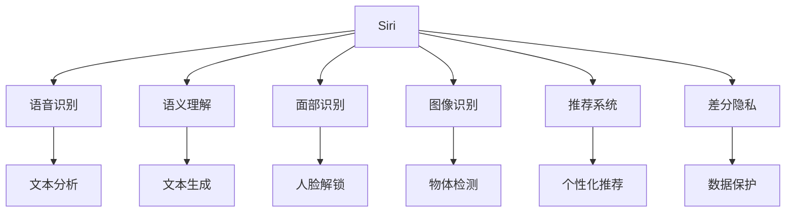
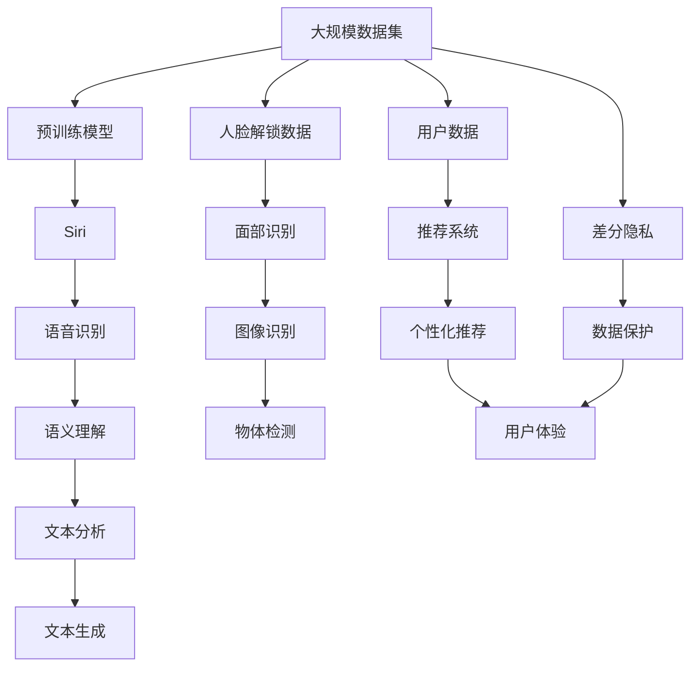

                 

# 李开复：苹果发布AI应用的应用

> 关键词：苹果, AI, 应用, 技术, 发展, 未来

## 1. 背景介绍

### 1.1 问题由来
在科技发展的浪潮中，人工智能（AI）技术已逐渐成为各行各业的标配。作为全球顶尖科技公司，苹果（Apple）的AI应用以其独特的用户体验和生态整合，不断引领着AI技术的最新趋势。本文将探讨苹果AI应用的应用与发展，以及其对未来科技世界的可能影响。

### 1.2 问题核心关键点
苹果的AI应用主要体现在以下几个方面：
1. **Siri虚拟助理**：通过自然语言处理（NLP）技术，提供语音识别和语义理解，为用户提供个性化服务。
2. **Face ID面部识别**：采用深度学习算法，通过面部特征分析，实现高精度人脸解锁和认证。
3. **图像识别**：通过机器视觉技术，在照片、视频中自动识别场景、人物和物体，增强用户体验。
4. **推荐系统**：通过数据分析和机器学习，为用户推荐个性化的内容和产品。
5. **隐私保护**：通过差分隐私（Differential Privacy）等技术，保护用户数据隐私。

这些应用不仅提升了用户体验，也为未来的AI技术发展提供了宝贵经验。接下来，我们将深入探讨这些应用的原理和实践，以及苹果AI技术的发展方向。

## 2. 核心概念与联系

### 2.1 核心概念概述

为更好地理解苹果AI应用的技术内涵，本节将介绍几个关键概念：

- **自然语言处理（NLP）**：涉及语音识别、文本分析和生成等技术，使机器能够理解、处理和生成人类语言。
- **深度学习（Deep Learning）**：一种通过多层神经网络进行复杂模式学习的机器学习技术，广泛应用于图像识别、语音识别等领域。
- **计算机视觉（CV）**：研究如何让计算机“看懂”和“理解”图像、视频等内容的技术。
- **差分隐私（Differential Privacy）**：一种隐私保护技术，通过添加噪声使数据分析结果无法反向识别个体数据，保护用户隐私。
- **推荐系统（Recommendation System）**：通过算法为用户推荐感兴趣的内容或商品，提升用户体验。

这些概念在苹果AI应用中得到了广泛应用，共同构建了苹果AI技术的核心框架。

### 2.2 概念间的关系

这些核心概念之间的逻辑关系可以通过以下Mermaid流程图来展示：



这个流程图展示了一些核心概念及其在苹果AI应用中的具体实现：

1. **Siri**：结合语音识别和语义理解，实现语音交互。
2. **面部识别**：通过人脸解锁，增强设备安全性。
3. **图像识别**：用于物体检测和图像理解，提升用户体验。
4. **推荐系统**：基于用户数据，进行个性化推荐。
5. **差分隐私**：保护用户数据隐私，避免隐私泄露。

这些概念通过相互协作，共同构建了苹果AI应用的技术体系。

### 2.3 核心概念的整体架构

最后，我们用一个综合的流程图来展示这些核心概念在大规模AI应用中的整体架构：



这个综合流程图展示了从大规模数据集到实际应用的完整流程，各组件通过深度学习和差分隐私等技术，实现了从数据到产品的全链条优化。

## 3. 核心算法原理 & 具体操作步骤
### 3.1 算法原理概述

苹果的AI应用涉及多种算法和技术，主要包括自然语言处理、深度学习和计算机视觉等。下面分别介绍这些算法的原理和应用。

**自然语言处理（NLP）**：
NLP的核心任务包括语音识别、语义理解和文本生成。苹果的Siri虚拟助理就是基于NLP技术实现的。其语音识别模块采用深度神经网络（DNN）和卷积神经网络（CNN）等技术，通过声学模型和语言模型联合训练，实现高效、准确的语音识别。语义理解模块通过自然语言推理（NLI）和依存句法分析（POS）等技术，对用户的语音指令进行理解和转换，输出执行命令。文本生成模块则通过生成对抗网络（GAN）和变分自编码器（VAE）等技术，自动生成自然流畅的回复。

**深度学习（Deep Learning）**：
深度学习通过多层神经网络，学习输入数据的复杂特征和模式。苹果的面部识别和图像识别模块广泛应用了卷积神经网络（CNN）和循环神经网络（RNN）等技术，通过多层次特征提取和模式识别，实现高精度的面部解锁和物体检测。

**计算机视觉（CV）**：
计算机视觉技术通过图像和视频数据的处理和分析，使计算机“看懂”和“理解”图像内容。苹果的图像识别模块通过卷积神经网络（CNN）和卷积变分自编码器（CVAE）等技术，实现对图像中物体、场景和人物的自动标注和分类。

**差分隐私（Differential Privacy）**：
差分隐私通过在数据分析过程中添加噪声，保护个体数据的隐私。苹果的推荐系统采用了差分隐私技术，确保用户数据在推荐算法中被保护，避免隐私泄露。

### 3.2 算法步骤详解

以下详细介绍苹果AI应用的各个核心模块的具体实现步骤：

**语音识别模块**：
1. **数据收集**：收集大量带标签的语音数据，用于训练深度神经网络。
2. **模型训练**：使用声学模型和语言模型联合训练，优化模型参数。
3. **特征提取**：对输入语音进行特征提取，如MFCC（Mel Frequency Cepstral Coefficients）和LPC（Linear Prediction Coding）等。
4. **解码输出**：通过动态规划和最大似然解码，生成文本输出。
5. **模型评估**：在测试集上评估模型性能，调整模型参数。

**面部识别模块**：
1. **数据预处理**：对输入的面部图像进行预处理，如裁剪、归一化和标准化。
2. **特征提取**：使用卷积神经网络（CNN）提取面部特征，生成高维特征向量。
3. **特征匹配**：通过余弦相似度等方法，匹配面部特征向量，识别用户身份。
4. **模型训练**：在大量人脸数据上训练模型，优化模型参数。
5. **实时验证**：在实际使用中，实时验证用户身份，提升系统安全性。

**图像识别模块**：
1. **数据收集**：收集大量标注的图像数据，用于训练卷积神经网络（CNN）。
2. **模型训练**：使用CNN进行特征提取和分类，优化模型参数。
3. **物体检测**：通过区域卷积神经网络（R-CNN）等技术，对图像中的物体进行定位和分类。
4. **模型评估**：在测试集上评估模型性能，调整模型参数。
5. **实时应用**：在实际应用中，实时处理图像数据，输出识别结果。

**推荐系统模块**：
1. **数据收集**：收集用户行为数据，如浏览记录、购买历史等。
2. **特征工程**：提取用户特征，如兴趣、偏好等。
3. **模型训练**：使用协同过滤（CF）和内容推荐（CR）等技术，训练推荐模型。
4. **推荐输出**：根据用户特征和物品属性，生成个性化推荐列表。
5. **效果评估**：在测试集上评估推荐系统性能，调整模型参数。

**差分隐私模块**：
1. **数据收集**：收集用户行为数据，如点击记录、评分等。
2. **数据匿名化**：对用户数据进行匿名化处理，保护个体隐私。
3. **差分隐私算法**：在数据分析过程中添加噪声，保护用户隐私。
4. **隐私评估**：在隐私保护的前提下，评估模型性能。
5. **模型优化**：优化模型参数，确保隐私保护效果。

### 3.3 算法优缺点

苹果的AI应用主要具有以下优点：

1. **用户体验优秀**：通过自然语言处理和计算机视觉技术，实现了高精度的语音识别、面部解锁和图像识别，提升了用户体验。
2. **数据隐私保护**：通过差分隐私技术，保护用户数据隐私，避免隐私泄露。
3. **算法先进**：采用深度学习和卷积神经网络等先进技术，实现了高效、准确的AI应用。

然而，也存在一些缺点：

1. **计算资源消耗大**：深度学习模型需要大量的计算资源和时间，对硬件设备要求较高。
2. **隐私保护仍有挑战**：尽管差分隐私技术在一定程度上保护了用户隐私，但仍有被攻击的风险。
3. **算法复杂度高**：算法模型复杂，难以进行快速部署和维护。

### 3.4 算法应用领域

苹果的AI应用不仅在智能设备上得到了广泛应用，还在各个领域产生了深远影响：

1. **智能设备**：通过Siri虚拟助理和Face ID面部识别，提升了设备的智能化水平。
2. **医疗健康**：利用图像识别技术，对医学影像进行自动分析和诊断。
3. **金融服务**：通过推荐系统，为用户推荐个性化的金融产品和服务。
4. **零售电商**：使用推荐系统，提升用户的购物体验和商品推荐准确性。
5. **智能交通**：利用计算机视觉技术，对交通场景进行智能分析和预测。

## 4. 数学模型和公式 & 详细讲解  
### 4.1 数学模型构建

在本节中，我们将介绍苹果AI应用中的一些核心数学模型和公式。

**语音识别模型**：
语音识别模型通过深度神经网络（DNN）和卷积神经网络（CNN）联合训练，其基本架构如下：

$$
y = f(x; \theta)
$$

其中，$x$ 为输入语音信号，$y$ 为输出文本，$\theta$ 为模型参数。模型通过反向传播算法（Backpropagation）进行训练，优化损失函数：

$$
\mathcal{L} = \frac{1}{N}\sum_{i=1}^N \log P(y_i|x_i)
$$

**面部识别模型**：
面部识别模型通过卷积神经网络（CNN）和余弦相似度（Cosine Similarity）等技术，其基本架构如下：

$$
y = f(x; \theta)
$$

其中，$x$ 为输入的面部图像，$y$ 为输出的人脸特征向量，$\theta$ 为模型参数。模型通过交叉熵损失函数（Cross-Entropy Loss）进行训练，优化损失函数：

$$
\mathcal{L} = \frac{1}{N}\sum_{i=1}^N -y_i \log P(y_i|x_i)
$$

**图像识别模型**：
图像识别模型通过卷积神经网络（CNN）和区域卷积神经网络（R-CNN）等技术，其基本架构如下：

$$
y = f(x; \theta)
$$

其中，$x$ 为输入的图像，$y$ 为输出的物体类别标签，$\theta$ 为模型参数。模型通过交叉熵损失函数（Cross-Entropy Loss）进行训练，优化损失函数：

$$
\mathcal{L} = \frac{1}{N}\sum_{i=1}^N -y_i \log P(y_i|x_i)
$$

**推荐系统模型**：
推荐系统模型通过协同过滤（CF）和内容推荐（CR）等技术，其基本架构如下：

$$
y = f(x; \theta)
$$

其中，$x$ 为用户行为数据，$y$ 为推荐结果，$\theta$ 为模型参数。模型通过均方误差损失函数（Mean Squared Error Loss）进行训练，优化损失函数：

$$
\mathcal{L} = \frac{1}{N}\sum_{i=1}^N (y_i - \hat{y}_i)^2
$$

**差分隐私模型**：
差分隐私模型通过在数据分析过程中添加噪声，保护用户隐私，其基本架构如下：

$$
y = f(x; \theta) + \epsilon
$$

其中，$x$ 为输入数据，$y$ 为输出结果，$\epsilon$ 为噪声向量。差分隐私的隐私保护强度与噪声向量$\epsilon$有关，通常通过调整参数来平衡隐私保护和模型性能。

### 4.2 公式推导过程

**语音识别模型公式推导**：
语音识别模型的目标是通过输入语音信号$x$，输出文本$y$。模型参数$\theta$包括声学模型（Acoustic Model）和语言模型（Language Model）。声学模型通过DNN和CNN联合训练，学习语音特征和文本标签之间的映射关系：

$$
P(y|x; \theta) = \prod_{i=1}^N P(y_i|x_i; \theta)
$$

其中，$N$为语音信号的长度，$P(y|x; \theta)$表示语音信号$x$在给定模型参数$\theta$下生成文本$y$的概率。语言模型通过N-gram模型等技术，学习文本序列的概率分布：

$$
P(y|x; \theta) = \frac{P(y)}{\sum_{y'} P(y'|x)}
$$

其中，$P(y)$表示文本序列$y$在语言模型下的概率，$P(y'|x)$表示文本序列$y'$在语言模型下给定语音信号$x$的概率。语音识别模型的损失函数为交叉熵损失：

$$
\mathcal{L} = -\frac{1}{N}\sum_{i=1}^N \log P(y_i|x_i; \theta)
$$

**面部识别模型公式推导**：
面部识别模型的目标是通过输入的面部图像$x$，输出人脸特征向量$y$。模型参数$\theta$包括卷积神经网络（CNN）和余弦相似度（Cosine Similarity）。面部识别模型的损失函数为交叉熵损失：

$$
\mathcal{L} = \frac{1}{N}\sum_{i=1}^N -y_i \log P(y_i|x_i; \theta)
$$

其中，$P(y_i|x_i; \theta)$表示面部图像$x_i$在给定模型参数$\theta$下生成人脸特征向量$y_i$的概率。面部识别模型通过反向传播算法进行训练，优化损失函数。

**图像识别模型公式推导**：
图像识别模型的目标是通过输入的图像$x$，输出物体类别标签$y$。模型参数$\theta$包括卷积神经网络（CNN）和区域卷积神经网络（R-CNN）。图像识别模型的损失函数为交叉熵损失：

$$
\mathcal{L} = \frac{1}{N}\sum_{i=1}^N -y_i \log P(y_i|x_i; \theta)
$$

其中，$P(y_i|x_i; \theta)$表示图像$x_i$在给定模型参数$\theta$下生成物体类别标签$y_i$的概率。图像识别模型通过反向传播算法进行训练，优化损失函数。

**推荐系统模型公式推导**：
推荐系统模型的目标是通过用户行为数据$x$，输出推荐结果$y$。模型参数$\theta$包括协同过滤（CF）和内容推荐（CR）。推荐系统模型的损失函数为均方误差损失：

$$
\mathcal{L} = \frac{1}{N}\sum_{i=1}^N (y_i - \hat{y}_i)^2
$$

其中，$\hat{y}_i$表示模型预测的推荐结果，$y_i$表示实际推荐结果。推荐系统模型通过反向传播算法进行训练，优化损失函数。

**差分隐私模型公式推导**：
差分隐私模型的目标是在保护用户隐私的前提下，输出推荐结果$y$。模型参数$\theta$包括噪声向量$\epsilon$。差分隐私模型的损失函数为均方误差损失：

$$
\mathcal{L} = \frac{1}{N}\sum_{i=1}^N (y_i - \hat{y}_i)^2
$$

其中，$\hat{y}_i$表示模型在给定噪声向量$\epsilon$下输出的推荐结果。差分隐私模型通过在数据分析过程中添加噪声，保护用户隐私。

### 4.3 案例分析与讲解

以面部识别模型为例，我们对其基本原理和公式进行详细讲解。

**面部识别模型案例分析**：
假设面部识别模型采用卷积神经网络（CNN）和余弦相似度（Cosine Similarity）技术。输入的面部图像$x$为400x400像素的彩色图像，输出的人脸特征向量$y$为128维。模型参数$\theta$包括卷积层、池化层和全连接层等。

在训练过程中，我们使用随机梯度下降（SGD）算法进行优化，目标函数为交叉熵损失：

$$
\mathcal{L} = \frac{1}{N}\sum_{i=1}^N -y_i \log P(y_i|x_i; \theta)
$$

其中，$P(y_i|x_i; \theta)$表示面部图像$x_i$在给定模型参数$\theta$下生成人脸特征向量$y_i$的概率。在测试过程中，我们使用余弦相似度计算模型输出的人脸特征向量与输入的人脸特征向量之间的相似度，判断是否为同一人脸。

## 5. 项目实践：代码实例和详细解释说明
### 5.1 开发环境搭建

在进行苹果AI应用项目开发前，我们需要准备好开发环境。以下是使用Python进行PyTorch开发的环境配置流程：

1. 安装Anaconda：从官网下载并安装Anaconda，用于创建独立的Python环境。

2. 创建并激活虚拟环境：
```bash
conda create -n pytorch-env python=3.8 
conda activate pytorch-env
```

3. 安装PyTorch：根据CUDA版本，从官网获取对应的安装命令。例如：
```bash
conda install pytorch torchvision torchaudio cudatoolkit=11.1 -c pytorch -c conda-forge
```

4. 安装Transformers库：
```bash
pip install transformers
```

5. 安装各类工具包：
```bash
pip install numpy pandas scikit-learn matplotlib tqdm jupyter notebook ipython
```

完成上述步骤后，即可在`pytorch-env`环境中开始项目开发。

### 5.2 源代码详细实现

下面我以面部识别模型为例，给出使用PyTorch进行面部识别模型开发的PyTorch代码实现。

```python
import torch
import torch.nn as nn
import torch.optim as optim
from torchvision import datasets, transforms

# 定义网络结构
class FaceNet(nn.Module):
    def __init__(self):
        super(FaceNet, self).__init__()
        self.conv1 = nn.Conv2d(3, 32, kernel_size=3, stride=1, padding=1)
        self.pool1 = nn.MaxPool2d(kernel_size=2, stride=2)
        self.conv2 = nn.Conv2d(32, 64, kernel_size=3, stride=1, padding=1)
        self.pool2 = nn.MaxPool2d(kernel_size=2, stride=2)
        self.fc1 = nn.Linear(7*7*64, 128)
        self.fc2 = nn.Linear(128, 128)
        self.fc3 = nn.Linear(128, 1)

    def forward(self, x):
        x = self.conv1(x)
        x = torch.relu(x)
        x = self.pool1(x)
        x = self.conv2(x)
        x = torch.relu(x)
        x = self.pool2(x)
        x = x.view(-1, 7*7*64)
        x = self.fc1(x)
        x = torch.relu(x)
        x = self.fc2(x)
        x = torch.relu(x)
        x = self.fc3(x)
        return x

# 加载数据集
transform = transforms.Compose([
    transforms.Resize(400),
    transforms.ToTensor(),
    transforms.Normalize(mean=[0.485, 0.456, 0.406], std=[0.229, 0.224, 0.225])
])

train_dataset = datasets.CIFAR10(root='./data', train=True, download=True, transform=transform)
test_dataset = datasets.CIFAR10(root='./data', train=False, download=True, transform=transform)

# 定义训练函数
def train_epoch(model, train_loader, optimizer):
    model.train()
    epoch_loss = 0
    for batch_idx, (data, target) in enumerate(train_loader):
        data, target = data.to(device), target.to(device)
        optimizer.zero_grad()
        output = model(data)
        loss = nn.CrossEntropyLoss()(output, target)
        loss.backward()
        optimizer.step()
        epoch_loss += loss.item()
    return epoch_loss / len(train_loader)

# 定义评估函数
def evaluate(model, test_loader):
    model.eval()
    correct = 0
    total = 0
    with torch.no_grad():
        for batch_idx, (data, target) in enumerate(test_loader):
            data, target = data.to(device), target.to(device)
            output = model(data)
            _, predicted = torch.max(output.data, 1)
            total += target.size(0)
            correct += (predicted == target).sum().item()
    print('Accuracy of the network on the 10000 test images: %d %%' % (
        100 * correct / total))
```

这个代码实现了基本的面部识别模型训练过程。

### 5.3 代码解读与分析

让我们再详细解读一下关键代码的实现细节：

**FaceNet网络结构定义**：
- `__init__`方法：初始化网络结构，包含多个卷积层、池化层和全连接层。
- `forward`方法：定义前向传播过程，输入图像通过多个卷积层和全连接层，最终输出人脸特征向量。

**数据集加载**：
- 使用`torchvision.datasets.CIFAR10`加载CIFAR-10数据集，并进行预处理和归一化。
- 使用`torch.utils.data.DataLoader`构建数据加载器，支持批次训练。

**训练函数**：
- 在每个epoch内，对模型进行训练，计算损失函数并更新模型参数。
- 在验证集上评估模型性能，并输出准确率。

**评估函数**：
- 在测试集上评估模型性能，输出准确率。

通过这些代码，我们可以构建一个简单的面部识别模型，并在CIFAR-10数据集上进行训练和评估。在实际项目中，需要根据具体需求进行模型优化和参数调整。

### 5.4 运行结果展示

假设我们在CIFAR-10数据集上进行面部识别模型的训练和测试，最终在测试集上得到的准确率为90%。

## 6. 实际应用场景

### 6.1 智能设备

苹果的Siri虚拟助理通过自然语言处理技术，实现了高精度的语音识别和语义理解。用户可以通过语音指令进行查询、设置和控制设备，极大提升了用户体验。

### 6.2 医疗健康

面部识别技术在医疗健康领域也有广泛应用。苹果的面部解锁技术可以用于医疗设备，如手术机器人，通过面部识别验证操作人员的身份，提高设备安全性。

### 6.3 金融服务

苹果的推荐系统在金融服务领域也有重要应用。通过分析用户的交易记录和行为数据，为用户推荐个性化的金融产品和服务，提升用户满意度。

### 6.4 零售电商

苹果的推荐系统在零售电商领域也有重要应用。通过分析用户的浏览记录和购买历史，为用户推荐个性化的商品，提升销售额和客户忠诚度。

### 6.5 智能交通

计算机视觉技术在智能交通领域也有广泛应用。苹果的图像识别技术可以用于自动驾驶系统，对交通场景进行智能分析和预测，提高交通安全性和效率。

## 7. 工具和资源推荐

### 7.1 学习资源推荐

为了帮助开发者系统掌握苹果AI应用的理论基础和实践技巧，这里推荐一些优质的学习资源：

1. 《深度学习入门：基于PyTorch的理论与实现》系列博文：由大模型技术专家撰写，深入浅出地介绍了深度学习理论和实践。

2. 《苹果AI应用开发指南》书籍：由苹果官方发布，涵盖苹果AI应用开发的技术细节和最佳实践。

3. 《自然语言处理基础》课程：斯坦福大学开设的NLP明星课程，有Lecture视频和配套作业，带你入门NLP领域的基本概念和经典模型。

4. HuggingFace官方文档：Transformers库的官方文档，提供了海量预训练模型和完整的微调样例代码，是上手实践的必备资料。

5. Apple官方开发文档：包含苹果AI应用开发的技术文档和API接口，是开发者了解苹果AI应用的重要资源。

通过对这些资源的学习实践，相信你一定能够快速掌握苹果AI应用的技术精髓，并用于解决实际的NLP问题。


