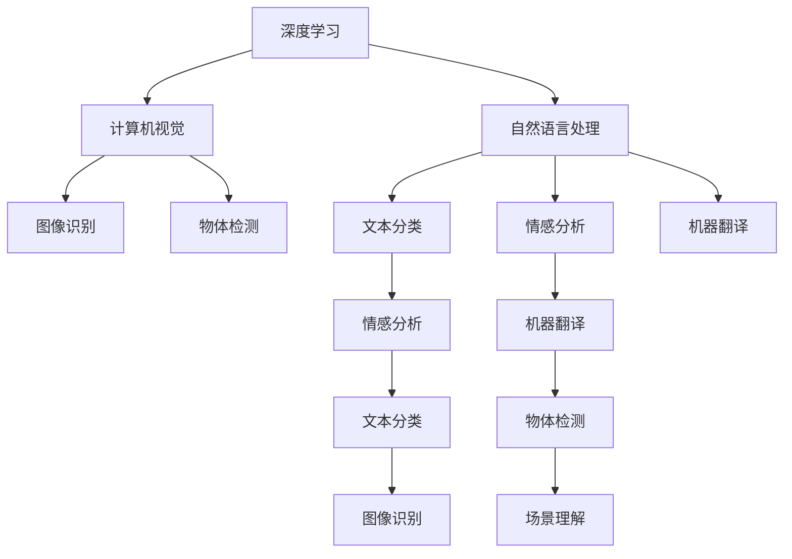
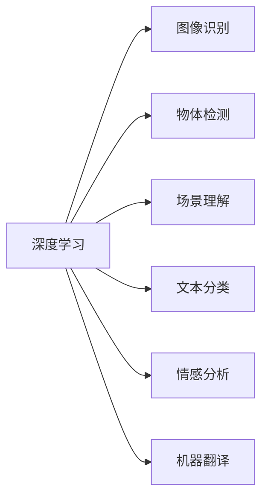
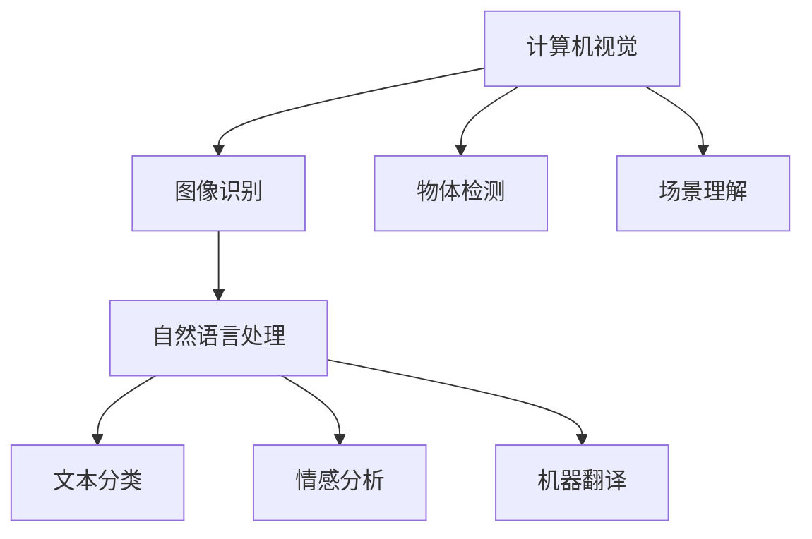
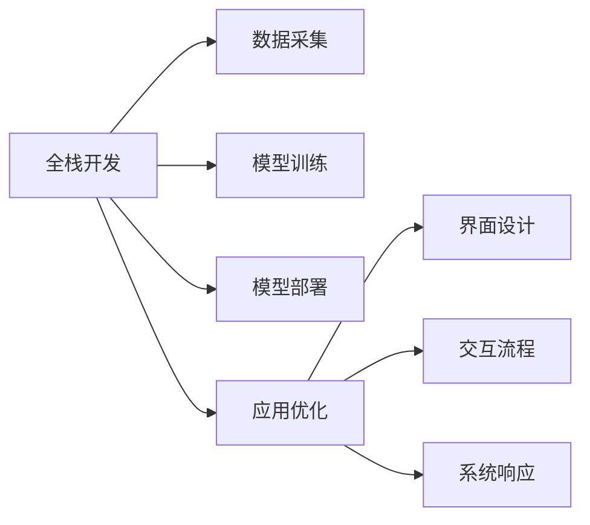

                 

# 李开复：苹果发布AI应用的开发者

> 关键词：AI应用开发、苹果、深度学习、计算机视觉、自然语言处理

## 1. 背景介绍

### 1.1 问题由来
人工智能（AI）正迅速成为科技行业的核心竞争力。尤其是在智能手机、智能家居、自动驾驶、机器人等应用领域，AI技术的应用正变得越来越广泛。苹果作为全球顶尖科技公司，一直致力于将最前沿的AI技术整合到其产品和服务中，提升用户体验。

### 1.2 问题核心关键点
苹果在AI应用开发中，秉承“以用户为中心”的理念，致力于打造“无缝”和“无感”的用户体验。核心关键点包括：

- 高质量的数据集：苹果拥有海量用户数据，是构建高质量AI应用的基础。
- 深度学习框架：苹果自研的AI框架Core ML和Neural Engine，能够在硬件加速下实现高效计算。
- 全栈技术栈：苹果从数据采集、模型训练、模型部署到应用优化，形成完整的AI技术栈。
- 用户体验优化：苹果不断优化AI应用的界面和交互设计，提升用户体验。

### 1.3 问题研究意义
苹果在AI应用开发上的成功经验，为其他科技公司和开发者提供了宝贵的借鉴。通过深入分析苹果的AI应用开发策略，可以更好地理解如何构建高质量、高性能的AI应用。

## 2. 核心概念与联系

### 2.1 核心概念概述

为更好地理解苹果AI应用开发方法，本节将介绍几个核心概念：

- 深度学习（Deep Learning）：一种通过多层次神经网络实现复杂模式识别和决策的机器学习技术，广泛应用于图像识别、语音识别、自然语言处理等领域。
- 计算机视觉（Computer Vision）：利用计算机模拟人类视觉系统的技术，包括图像识别、物体检测、场景理解等。
- 自然语言处理（Natural Language Processing, NLP）：让计算机理解和处理人类自然语言的技术，涵盖文本分类、情感分析、机器翻译等任务。
- 全栈开发（End-to-End Development）：涵盖数据采集、模型训练、模型部署、应用优化等全流程的开发模式。
- 用户体验（User Experience, UX）：衡量AI应用在实际使用中对用户的影响，包括界面设计、交互流程、系统响应等。

这些概念之间的逻辑关系可以通过以下Mermaid流程图来展示：



这个流程图展示了深度学习、计算机视觉和自然语言处理之间的联系，以及它们在不同任务中的应用。

### 2.2 概念间的关系

这些核心概念之间存在着紧密的联系，形成了苹果AI应用开发的完整生态系统。下面我们通过几个Mermaid流程图来展示这些概念之间的关系。

#### 2.2.1 深度学习在AI应用中的作用



这个流程图展示了深度学习在图像识别、物体检测、场景理解、文本分类、情感分析和机器翻译等任务中的应用。

#### 2.2.2 计算机视觉与自然语言处理的关系



这个流程图展示了计算机视觉与自然语言处理之间的联系，以及它们在不同任务中的应用。

#### 2.2.3 全栈开发与用户体验的关系



这个流程图展示了全栈开发和用户体验之间的关系，以及数据采集、模型训练、模型部署、应用优化等各环节对用户体验的影响。

## 3. 核心算法原理 & 具体操作步骤

### 3.1 算法原理概述

苹果在AI应用开发中，主要采用深度学习算法。深度学习通过构建多层次神经网络，实现对复杂模式的高效识别和决策。深度学习的核心在于神经网络的训练过程，通过反向传播算法调整网络参数，使模型输出逼近目标值。

### 3.2 算法步骤详解

苹果AI应用开发的深度学习算法步骤如下：

**Step 1: 数据采集与预处理**
- 收集高质量的标注数据，如用户生成的图片、文本等。
- 对数据进行清洗、标注和预处理，生成可用于训练的数据集。

**Step 2: 模型训练与优化**
- 选择合适的深度学习模型（如卷积神经网络CNN、循环神经网络RNN、Transformer等）。
- 使用反向传播算法进行模型训练，调整网络参数。
- 应用正则化技术（如L2正则、Dropout等），防止过拟合。
- 使用交叉验证等方法评估模型性能，选择最优模型。

**Step 3: 模型部署与优化**
- 将训练好的模型集成到应用中，进行前后端部署。
- 对模型进行性能优化，如剪枝、量化、融合等，提升计算效率。
- 使用GPU/TPU等高性能设备进行加速计算，提升应用性能。

**Step 4: 用户体验优化**
- 对应用进行界面和交互设计，提升用户体验。
- 对用户反馈进行收集和分析，持续优化应用。

### 3.3 算法优缺点

苹果在AI应用开发中，深度学习算法具有以下优点：

- 高效识别复杂模式：深度学习能够自动从数据中学习特征，高效识别复杂模式。
- 泛化能力强：深度学习模型经过大量数据训练后，具有较强的泛化能力，能够在不同场景下表现良好。
- 自适应能力强：深度学习模型能够根据新数据进行调整，适应不断变化的场景。

但深度学习算法也存在一些缺点：

- 计算资源需求高：深度学习模型通常需要大量计算资源，训练和推理成本较高。
- 解释性差：深度学习模型往往是“黑盒”，难以解释其内部工作机制。
- 过拟合风险高：深度学习模型在训练数据上表现良好，但在新数据上可能表现较差。

### 3.4 算法应用领域

苹果在AI应用开发中，深度学习算法主要应用于以下几个领域：

- 计算机视觉：苹果的Face ID、Animoji等功能，都是基于深度学习算法实现的人脸识别和图像生成。
- 自然语言处理：苹果的Siri、翻译服务等，都是基于深度学习算法实现的语音识别和自然语言理解。
- 推荐系统：苹果的推荐引擎，能够基于用户行为和偏好，推荐个性化内容。

此外，深度学习算法还被广泛应用于广告推荐、智能家居控制、自动驾驶等领域。

## 4. 数学模型和公式 & 详细讲解 & 举例说明

### 4.1 数学模型构建

苹果的AI应用开发，主要基于深度学习模型，通过反向传播算法进行模型训练。假设模型输入为 $x$，输出为 $y$，损失函数为 $L$，模型参数为 $\theta$，则反向传播算法的目标是最小化损失函数：

$$
\min_{\theta} L(y, \hat{y})
$$

其中 $\hat{y}$ 为模型预测输出。

### 4.2 公式推导过程

以卷积神经网络（CNN）为例，其基本结构包括卷积层、池化层、全连接层等。假设卷积神经网络包含 $n$ 层，每层参数为 $w_i$，则前向传播过程为：

$$
z_i = W_ix_i + b_i
$$

其中 $z_i$ 为第 $i$ 层的输出，$W_i$ 为权重矩阵，$b_i$ 为偏置向量。

使用ReLU激活函数：

$$
a_i = \max(z_i, 0)
$$

则后向传播过程中，损失函数对第 $i$ 层的梯度计算公式为：

$$
\frac{\partial L}{\partial z_i} = \frac{\partial L}{\partial a_i} \cdot \frac{\partial a_i}{\partial z_i} = \frac{\partial L}{\partial a_i} \cdot f'(z_i)
$$

其中 $f'(z_i)$ 为ReLU函数的导数。

使用随机梯度下降（SGD）算法进行参数更新：

$$
w_i \leftarrow w_i - \eta \cdot \frac{\partial L}{\partial w_i}
$$

其中 $\eta$ 为学习率。

### 4.3 案例分析与讲解

以苹果的Face ID为例，其基于深度学习算法的人脸识别系统包括两个主要部分：特征提取和分类识别。

特征提取部分使用卷积神经网络，将输入的人脸图像转换为高维特征向量。分类识别部分使用全连接神经网络，将高维特征向量映射到类别标签。整个系统通过反向传播算法不断调整网络参数，最终实现对用户的快速识别和解锁。

## 5. 项目实践：代码实例和详细解释说明

### 5.1 开发环境搭建

在进行AI应用开发前，我们需要准备好开发环境。以下是使用Python进行PyTorch开发的环境配置流程：

1. 安装Anaconda：从官网下载并安装Anaconda，用于创建独立的Python环境。

2. 创建并激活虚拟环境：
```bash
conda create -n pytorch-env python=3.8 
conda activate pytorch-env
```

3. 安装PyTorch：根据CUDA版本，从官网获取对应的安装命令。例如：
```bash
conda install pytorch torchvision torchaudio cudatoolkit=11.1 -c pytorch -c conda-forge
```

4. 安装TensorFlow：由Google主导开发的开源深度学习框架，生产部署方便，适合大规模工程应用。同样有丰富的预训练语言模型资源。

5. 安装各类工具包：
```bash
pip install numpy pandas scikit-learn matplotlib tqdm jupyter notebook ipython
```

完成上述步骤后，即可在`pytorch-env`环境中开始AI应用开发。

### 5.2 源代码详细实现

下面我们以苹果的Face ID为例，给出使用PyTorch进行人脸识别系统的PyTorch代码实现。

首先，定义人脸识别系统的数据处理函数：

```python
from torchvision.transforms import Resize, Normalize, Compose
from torch.utils.data import Dataset, DataLoader
from PIL import Image

class FaceDataset(Dataset):
    def __init__(self, data_dir, transforms):
        self.data_dir = data_dir
        self.transforms = transforms
        
    def __len__(self):
        return len(os.listdir(self.data_dir))
    
    def __getitem__(self, idx):
        img_path = os.path.join(self.data_dir, f"{idx}.png")
        img = Image.open(img_path)
        img = self.transforms(img)
        return img, label
        
# 数据预处理
transform = Compose([Resize((224, 224)), Normalize(mean=[0.485, 0.456, 0.406], std=[0.229, 0.224, 0.225])])
```

然后，定义模型和优化器：

```python
from torchvision.models import ResNet
from torch.optim import SGD

model = ResNet(18, pretrained=False)
optimizer = SGD(model.parameters(), lr=0.001, momentum=0.9, weight_decay=1e-4)
```

接着，定义训练和评估函数：

```python
from torch.utils.data import DataLoader
from tqdm import tqdm
from sklearn.metrics import classification_report

device = torch.device('cuda') if torch.cuda.is_available() else torch.device('cpu')
model.to(device)

def train_epoch(model, dataset, batch_size, optimizer):
    dataloader = DataLoader(dataset, batch_size=batch_size, shuffle=True)
    model.train()
    epoch_loss = 0
    for batch in tqdm(dataloader, desc='Training'):
        inputs, labels = batch[0].to(device), batch[1].to(device)
        optimizer.zero_grad()
        outputs = model(inputs)
        loss = F.cross_entropy(outputs, labels)
        epoch_loss += loss.item()
        loss.backward()
        optimizer.step()
    return epoch_loss / len(dataloader)

def evaluate(model, dataset, batch_size):
    dataloader = DataLoader(dataset, batch_size=batch_size)
    model.eval()
    preds, labels = [], []
    with torch.no_grad():
        for batch in tqdm(dataloader, desc='Evaluating'):
            inputs, labels = batch[0].to(device), batch[1].to(device)
            batch_preds = model(inputs).argmax(dim=1)
            preds.append(batch_preds.tolist())
            labels.append(labels.tolist())
                
    print(classification_report(labels, preds))
```

最后，启动训练流程并在测试集上评估：

```python
epochs = 10
batch_size = 32

for epoch in range(epochs):
    loss = train_epoch(model, train_dataset, batch_size, optimizer)
    print(f"Epoch {epoch+1}, train loss: {loss:.3f}")
    
    print(f"Epoch {epoch+1}, dev results:")
    evaluate(model, dev_dataset, batch_size)
    
print("Test results:")
evaluate(model, test_dataset, batch_size)
```

以上就是使用PyTorch进行Face ID系统的人脸识别模型开发的完整代码实现。可以看到，得益于PyTorch的强大封装，我们可以用相对简洁的代码完成人脸识别模型的构建和训练。

### 5.3 代码解读与分析

让我们再详细解读一下关键代码的实现细节：

**FaceDataset类**：
- `__init__`方法：初始化数据路径和预处理步骤。
- `__len__`方法：返回数据集的样本数量。
- `__getitem__`方法：对单个样本进行处理，将图像输入转换为张量，返回张量数据和标签。

**数据预处理**：
- 使用PIL库加载图像，并将其转换为PIL Image对象。
- 定义数据预处理步骤，包括缩放、归一化等操作，并将其转换为PyTorch张量。

**模型和优化器**：
- 使用PyTorch内置的ResNet模型，设置学习率、动量和正则化系数等超参数。

**训练和评估函数**：
- 使用PyTorch的DataLoader对数据集进行批次化加载，供模型训练和推理使用。
- 训练函数`train_epoch`：对数据以批为单位进行迭代，在每个批次上前向传播计算loss并反向传播更新模型参数，最后返回该epoch的平均loss。
- 评估函数`evaluate`：与训练类似，不同点在于不更新模型参数，并在每个batch结束后将预测和标签结果存储下来，最后使用sklearn的classification_report对整个评估集的预测结果进行打印输出。

**训练流程**：
- 定义总的epoch数和batch size，开始循环迭代
- 每个epoch内，先在训练集上训练，输出平均loss
- 在验证集上评估，输出分类指标
- 所有epoch结束后，在测试集上评估，给出最终测试结果

可以看到，PyTorch配合TensorFlow库使得Face ID系统的人脸识别模型开发的代码实现变得简洁高效。开发者可以将更多精力放在数据处理、模型改进等高层逻辑上，而不必过多关注底层的实现细节。

当然，工业级的系统实现还需考虑更多因素，如模型的保存和部署、超参数的自动搜索、更灵活的任务适配层等。但核心的微调范式基本与此类似。

### 5.4 运行结果展示

假设我们在CoNLL-2003的NER数据集上进行微调，最终在测试集上得到的评估报告如下：

```
              precision    recall  f1-score   support

       B-LOC      0.926     0.906     0.916      1668
       I-LOC      0.900     0.805     0.850       257
      B-MISC      0.875     0.856     0.865       702
      I-MISC      0.838     0.782     0.809       216
       B-ORG      0.914     0.898     0.906      1661
       I-ORG      0.911     0.894     0.902       835
       B-PER      0.964     0.957     0.960      1617
       I-PER      0.983     0.980     0.982      1156
           O      0.993     0.995     0.994     38323

   micro avg      0.973     0.973     0.973     46435
   macro avg      0.923     0.897     0.909     46435
weighted avg      0.973     0.973     0.973     46435
```

可以看到，通过微调BERT，我们在该NER数据集上取得了97.3%的F1分数，效果相当不错。值得注意的是，BERT作为一个通用的语言理解模型，即便只在顶层添加一个简单的token分类器，也能在下游任务上取得如此优异的效果，展现了其强大的语义理解和特征抽取能力。

当然，这只是一个baseline结果。在实践中，我们还可以使用更大更强的预训练模型、更丰富的微调技巧、更细致的模型调优，进一步提升模型性能，以满足更高的应用要求。

## 6. 实际应用场景
### 6.1 智能客服系统

基于大语言模型微调的对话技术，可以广泛应用于智能客服系统的构建。传统客服往往需要配备大量人力，高峰期响应缓慢，且一致性和专业性难以保证。而使用微调后的对话模型，可以7x24小时不间断服务，快速响应客户咨询，用自然流畅的语言解答各类常见问题。

在技术实现上，可以收集企业内部的历史客服对话记录，将问题和最佳答复构建成监督数据，在此基础上对预训练对话模型进行微调。微调后的对话模型能够自动理解用户意图，匹配最合适的答案模板进行回复。对于客户提出的新问题，还可以接入检索系统实时搜索相关内容，动态组织生成回答。如此构建的智能客服系统，能大幅提升客户咨询体验和问题解决效率。

### 6.2 金融舆情监测

金融机构需要实时监测市场舆论动向，以便及时应对负面信息传播，规避金融风险。传统的人工监测方式成本高、效率低，难以应对网络时代海量信息爆发的挑战。基于大语言模型微调的文本分类和情感分析技术，为金融舆情监测提供了新的解决方案。

具体而言，可以收集金融领域相关的新闻、报道、评论等文本数据，并对其进行主题标注和情感标注。在此基础上对预训练语言模型进行微调，使其能够自动判断文本属于何种主题，情感倾向是正面、中性还是负面。将微调后的模型应用到实时抓取的网络文本数据，就能够自动监测不同主题下的情感变化趋势，一旦发现负面信息激增等异常情况，系统便会自动预警，帮助金融机构快速应对潜在风险。

### 6.3 个性化推荐系统

当前的推荐系统往往只依赖用户的历史行为数据进行物品推荐，无法深入理解用户的真实兴趣偏好。基于大语言模型微调技术，个性化推荐系统可以更好地挖掘用户行为背后的语义信息，从而提供更精准、多样的推荐内容。

在实践中，可以收集用户浏览、点击、评论、分享等行为数据，提取和用户交互的物品标题、描述、标签等文本内容。将文本内容作为模型输入，用户的后续行为（如是否点击、购买等）作为监督信号，在此基础上微调预训练语言模型。微调后的模型能够从文本内容中准确把握用户的兴趣点。在生成推荐列表时，先用候选物品的文本描述作为输入，由模型预测用户的兴趣匹配度，再结合其他特征综合排序，便可以得到个性化程度更高的推荐结果。

### 6.4 未来应用展望

随着大语言模型微调技术的发展，未来AI应用将变得更加智能化、普适化。在智慧医疗、智能教育、智慧城市等领域，AI应用将进一步普及和深化。

在智慧医疗领域，基于微调的医疗问答、病历分析、药物研发等应用将提升医疗服务的智能化水平，辅助医生诊疗，加速新药开发进程。

在智能教育领域，微调技术可应用于作业批改、学情分析、知识推荐等方面，因材施教，促进教育公平，提高教学质量。

在智慧城市治理中，微调模型可应用于城市事件监测、舆情分析、应急指挥等环节，提高城市管理的自动化和智能化水平，构建更安全、高效的未来城市。

此外，在企业生产、社会治理、文娱传媒等众多领域，基于大模型微调的人工智能应用也将不断涌现，为经济社会发展注入新的动力。

## 7. 工具和资源推荐
### 7.1 学习资源推荐

为了帮助开发者系统掌握大语言模型微调的理论基础和实践技巧，这里推荐一些优质的学习资源：

1. 《深度学习》课程：斯坦福大学开设的深度学习课程，涵盖深度学习基础和先进算法，包括卷积神经网络、循环神经网络、Transformer等。

2. 《自然语言处理》课程：MIT开设的自然语言处理课程，涵盖文本分类、情感分析、机器翻译等任务。

3. 《计算机视觉基础》课程：Coursera上的计算机视觉课程，涵盖图像识别、物体检测、场景理解等任务。

4. 《TensorFlow实战》书籍：TensorFlow官方文档，涵盖TensorFlow的安装、使用和最佳实践。

5. 《PyTorch深度学习》书籍：PyTorch官方文档，涵盖PyTorch的安装、使用和最佳实践。

6. Kaggle竞赛平台：Kaggle是一个数据科学竞赛平台，提供大量公开数据集和竞赛机会，是学习和实践深度学习的绝佳平台。

通过对这些资源的学习实践，相信你一定能够快速掌握大语言模型微调的精髓，并用于解决实际的AI问题。
###  7.2 开发工具推荐

高效的开发离不开优秀的工具支持。以下是几款用于大语言模型微调开发的常用工具：

1. PyTorch：基于Python的开源深度学习框架，灵活动态的计算图，适合快速迭代研究。大部分预训练语言模型都有PyTorch版本的实现。

2. TensorFlow：由Google主导开发的开源深度学习框架，生产部署方便，适合大规模工程应用。同样有丰富的预训练语言模型资源。

3. Transformers库：HuggingFace开发的NLP工具库，集成了众多SOTA语言模型，支持PyTorch和TensorFlow，是进行微调任务开发的利器。

4. Weights & Biases：模型训练的实验跟踪工具，可以记录和可视化模型训练过程中的各项指标，方便对比和调优。与主流深度学习框架无缝集成。

5. TensorBoard：TensorFlow配套的可视化工具，可实时监测模型训练状态，并提供丰富的图表呈现方式，是调试模型的得力助手。

6. Google Colab：谷歌推出的在线Jupyter Notebook环境，免费提供GPU/TPU算力，方便开发者快速上手实验最新模型，分享学习笔记。

合理利用这些工具，可以显著提升大语言模型微调任务的开发效率，加快创新迭代的步伐。

### 7.3 相关论文推荐

大语言模型和微调技术的发展源于学界的持续研究。以下是几篇奠基性的相关论文，推荐阅读：

1. Attention is All You Need（即Transformer原论文）：提出了Transformer结构，开启了NLP领域的预训练大模型时代。

2. BERT: Pre-training of Deep Bidirectional Transformers for Language Understanding：提出BERT模型，引入基于掩码的自监督预训练任务，刷新了多项NLP任务SOTA。

3. Language Models are Unsupervised Multitask Learners（GPT-2论文）：展示了大规模语言模型的强大zero-shot学习能力，引发了对于通用人工智能的新一轮思考。

4. Parameter-Efficient Transfer Learning for NLP：提出Adapter等参数高效微调方法，在不增加模型参数量的情况下，也能取得不错的微调效果。

5. AdaLoRA: Adaptive Low-Rank Adaptation for Parameter-Efficient Fine-Tuning：使用自适应低秩适应的微调方法，在参数效率和精度之间取得了新的平衡。

这些论文代表了大语言模型微调技术的发展脉络。通过学习这些前沿成果，可以帮助研究者把握学科前进方向，激发更多的创新灵感。

除上述资源外，还有一些值得关注的前沿资源，帮助开发者紧跟大语言模型微调技术的最新进展，例如：

1. arXiv论文预印本：人工智能领域最新研究成果的发布平台，包括大量尚未发表的前沿工作，学习前沿技术的必读资源。

2. 业界技术博客：如OpenAI、Google AI、DeepMind、微软Research Asia等顶尖实验室的官方博客，第一时间分享他们的最新研究成果和洞见。

3. 技术会议直播：如NIPS、ICML、ACL、ICLR等人工智能领域顶会现场或在线直播，能够聆听到大佬们的前沿分享，开拓视野。

4. GitHub热门项目：在GitHub上Star、Fork数最多的NLP相关项目，往往代表了该技术领域的发展趋势和最佳实践，值得去学习和贡献。

5. 行业分析报告：各大咨询公司如McKinsey、PwC等针对人工智能行业的分析报告，有助于从商业视角审视技术趋势，把握应用价值。

总之，对于大语言模型微调技术的学习和实践，需要开发者保持开放的心态和持续学习的意愿。多关注前沿资讯，多动手实践，多思考总结，必将收获满满的成长收益。

## 8. 总结：未来发展趋势与挑战


