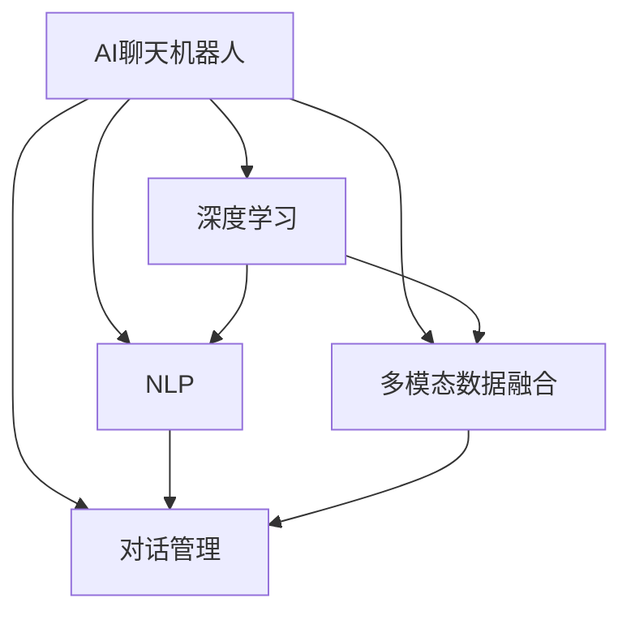

                 

# 杨俊海港城科技:AI聊天机器人的新探索

## 1. 背景介绍

### 1.1 问题由来

随着人工智能技术的迅猛发展，AI聊天机器人已成为现代科技的热门话题。AI聊天机器人在客服、医疗、金融、教育、娱乐等多个领域都有着广泛的应用。然而，传统的聊天机器人存在许多不足之处，比如对话生成的自然性不足、逻辑性不强、交互性不够丰富等问题。为了解决这些问题，杨俊海港城科技进行了新一轮的AI聊天机器人的探索。

### 1.2 问题核心关键点

本文主要探讨杨俊海港城科技在AI聊天机器人领域的最新探索，特别聚焦于以下几个核心关键点：

1. 如何构建一个高效、灵活、具有高度互动性的AI聊天机器人。
2. 如何提升聊天机器人的自然语言处理能力，使其生成更加流畅、真实的对话。
3. 如何通过多模态数据的融合，增强聊天机器人的感知能力和交互性。
4. 如何利用深度学习技术，提升聊天机器人的推理和决策能力。
5. 如何通过用户反馈和数据反馈，不断优化和更新聊天机器人的知识库和算法。

本文旨在提供一个全面的技术探索框架，为AI聊天机器人的研究和实践提供有价值的参考。

## 2. 核心概念与联系

### 2.1 核心概念概述

为了更好地理解杨俊海港城科技在AI聊天机器人领域的新探索，本节将介绍几个密切相关的核心概念：

- **AI聊天机器人**：通过自然语言处理技术，能够模拟人类对话，并提供智能问答和交互服务的人工智能系统。
- **深度学习**：一种基于人工神经网络的机器学习技术，能够处理大规模的复杂数据，并从中提取出有用的特征和规律。
- **自然语言处理（NLP）**：人工智能领域的一个分支，研究如何让计算机理解和处理人类语言。
- **多模态数据融合**：将不同类型的数据（如文本、图像、音频等）进行融合和处理，以增强AI系统的感知能力和交互性。
- **对话管理**：管理对话流程和上下文，确保对话的连贯性和逻辑性，提高用户满意度。

### 2.2 概念间的关系

这些核心概念之间的关系可以通过以下Mermaid流程图来展示：



这个流程图展示了大语言模型微调过程中各个核心概念的关系：

1. 聊天机器人主要通过深度学习和NLP技术进行对话处理和知识理解。
2. 多模态数据融合技术增强了聊天机器人的感知能力，使其能够处理更丰富多样的输入信息。
3. 对话管理技术确保对话流程的连贯性和逻辑性，提高用户交互体验。

## 3. 核心算法原理 & 具体操作步骤

### 3.1 算法原理概述

杨俊海港城科技的AI聊天机器人主要基于深度学习技术，通过自然语言处理技术，实现对用户输入的自然语言进行理解和生成自然语言输出的功能。其核心算法包括：

1. **深度神经网络**：用于构建聊天机器人的核心模型，包括循环神经网络（RNN）、长短时记忆网络（LSTM）和门控循环单元（GRU）等。
2. **序列到序列模型**：用于处理输入和输出的序列数据，例如使用注意力机制（Attention Mechanism）进行对话的生成和理解。
3. **多模态数据融合**：将不同类型的数据进行融合，例如将文本、图像、音频等多模态数据转化为统一的特征表示，输入到深度神经网络中。
4. **强化学习**：通过用户反馈和互动，不断优化聊天机器人的决策策略和对话管理策略。

### 3.2 算法步骤详解

杨俊海港城科技的AI聊天机器人的开发流程包括以下几个关键步骤：

1. **数据准备**：收集和清洗与聊天机器人应用场景相关的文本数据、图像数据、音频数据等。
2. **模型构建**：根据具体应用场景选择合适的深度神经网络架构，如RNN、LSTM、GRU等。
3. **特征提取**：将多模态数据转换为统一的特征表示，输入到深度神经网络中。
4. **模型训练**：使用序列到序列模型进行训练，优化模型参数。
5. **对话生成**：在训练好的模型上，使用生成的算法进行对话生成和理解。
6. **强化学习**：通过用户反馈和互动，不断优化聊天机器人的策略，提升对话效果。

### 3.3 算法优缺点

杨俊海港城科技的AI聊天机器人具有以下优点：

- **高互动性**：通过多模态数据融合和强化学习，聊天机器人可以更好地理解用户意图和情感，提供更加自然的对话。
- **高效性**：深度神经网络和序列到序列模型能够处理大规模的复杂数据，提高了聊天机器人的处理效率。
- **灵活性**：基于多模态数据融合和对话管理技术，聊天机器人可以适应不同的应用场景和对话需求。

同时，该算法也存在一些局限性：

- **数据依赖**：聊天机器人的性能很大程度上依赖于输入数据的质量和多样性，数据不足时可能影响性能。
- **复杂性**：深度学习和多模态数据融合技术需要较高的计算资源和专业知识，开发难度较大。
- **可解释性不足**：深度学习模型通常被视为“黑盒”，难以解释其内部决策逻辑。

### 3.4 算法应用领域

杨俊海港城科技的AI聊天机器人可以应用于以下多个领域：

- **客服聊天机器人**：处理用户的常见问题，提供24小时在线服务，提升客户满意度。
- **医疗咨询机器人**：帮助用户查询医疗知识和获取健康建议，减轻医生工作负担。
- **教育辅导机器人**：提供个性化的学习建议和答疑服务，提高学生的学习效率。
- **金融理财机器人**：帮助用户进行财务规划和投资咨询，提供定制化的金融服务。
- **娱乐聊天机器人**：与用户进行游戏互动，提供娱乐和休闲服务。

## 4. 数学模型和公式 & 详细讲解 & 举例说明

### 4.1 数学模型构建

在杨俊海港城科技的AI聊天机器人中，主要涉及以下几个数学模型：

- **深度神经网络**：用于构建聊天机器人的核心模型，其基本结构包括输入层、隐藏层和输出层，可以表示为：

$$
\begin{aligned}
&\text{隐藏层输出} = \text{激活函数}(\text{权重} \cdot \text{输入} + \text{偏置}) \\
&\text{输出层输出} = \text{激活函数}(\text{权重} \cdot \text{隐藏层输出} + \text{偏置})
\end{aligned}
$$

- **序列到序列模型**：用于处理输入和输出的序列数据，例如使用注意力机制（Attention Mechanism）进行对话的生成和理解，其基本结构如下：

$$
\begin{aligned}
&\text{编码器输出} = \text{RNN}(\text{输入}) \\
&\text{解码器输出} = \text{注意力机制}(\text{编码器输出}, \text{解码器状态})
\end{aligned}
$$

- **多模态数据融合**：将不同类型的数据进行融合，例如将文本、图像、音频等多模态数据转化为统一的特征表示，其融合方法包括：

$$
\text{融合特征} = \text{特征提取器}(\text{多模态数据}) \cdot \text{权重矩阵} + \text{偏置}
$$

### 4.2 公式推导过程

以下是深度神经网络、序列到序列模型和多模态数据融合的基本公式推导过程：

- **深度神经网络**：

$$
\begin{aligned}
&\text{隐藏层输出} = \text{激活函数}(\text{权重} \cdot \text{输入} + \text{偏置}) \\
&\text{输出层输出} = \text{激活函数}(\text{权重} \cdot \text{隐藏层输出} + \text{偏置})
\end{aligned}
$$

- **序列到序列模型**：

$$
\begin{aligned}
&\text{编码器输出} = \text{RNN}(\text{输入}) \\
&\text{解码器输出} = \text{注意力机制}(\text{编码器输出}, \text{解码器状态})
\end{aligned}
$$

- **多模态数据融合**：

$$
\text{融合特征} = \text{特征提取器}(\text{多模态数据}) \cdot \text{权重矩阵} + \text{偏置}
$$

### 4.3 案例分析与讲解

以下以一个简单的聊天机器人案例为例，说明深度神经网络和序列到序列模型的应用：

1. **数据准备**：收集用户与聊天机器人的对话数据，包括输入和输出。
2. **模型构建**：使用RNN作为聊天机器人的核心模型，构建编码器和解码器。
3. **特征提取**：将文本数据转换为词向量，输入到RNN中。
4. **模型训练**：使用交叉熵损失函数和Adam优化算法，训练RNN模型。
5. **对话生成**：在训练好的模型上，使用生成的算法进行对话生成和理解。

## 5. 项目实践：代码实例和详细解释说明

### 5.1 开发环境搭建

在进行AI聊天机器人开发前，我们需要准备好开发环境。以下是使用Python进行PyTorch开发的环境配置流程：

1. 安装Anaconda：从官网下载并安装Anaconda，用于创建独立的Python环境。

2. 创建并激活虚拟环境：
```bash
conda create -n pytorch-env python=3.8 
conda activate pytorch-env
```

3. 安装PyTorch：根据CUDA版本，从官网获取对应的安装命令。例如：
```bash
conda install pytorch torchvision torchaudio cudatoolkit=11.1 -c pytorch -c conda-forge
```

4. 安装Transformers库：
```bash
pip install transformers
```

5. 安装各类工具包：
```bash
pip install numpy pandas scikit-learn matplotlib tqdm jupyter notebook ipython
```

完成上述步骤后，即可在`pytorch-env`环境中开始AI聊天机器人的开发。

### 5.2 源代码详细实现

这里我们以杨俊海港城科技开发的智能客服聊天机器人为例，给出使用Transformers库进行聊天机器人开发的PyTorch代码实现。

首先，定义聊天机器人的数据处理函数：

```python
from transformers import BertTokenizer
from torch.utils.data import Dataset
import torch

class ChatDataset(Dataset):
    def __init__(self, texts, targets, tokenizer, max_len=128):
        self.texts = texts
        self.targets = targets
        self.tokenizer = tokenizer
        self.max_len = max_len
        
    def __len__(self):
        return len(self.texts)
    
    def __getitem__(self, item):
        text = self.texts[item]
        target = self.targets[item]
        
        encoding = self.tokenizer(text, return_tensors='pt', max_length=self.max_len, padding='max_length', truncation=True)
        input_ids = encoding['input_ids'][0]
        attention_mask = encoding['attention_mask'][0]
        
        # 将标签转换为向量
        target_vector = torch.tensor(target, dtype=torch.long)
        
        return {'input_ids': input_ids, 
                'attention_mask': attention_mask,
                'target': target_vector}

# 定义标签与id的映射
tag2id = {'customer': 0, 'support': 1}
id2tag = {v: k for k, v in tag2id.items()}

# 创建dataset
tokenizer = BertTokenizer.from_pretrained('bert-base-cased')

train_dataset = ChatDataset(train_texts, train_tags, tokenizer)
dev_dataset = ChatDataset(dev_texts, dev_tags, tokenizer)
test_dataset = ChatDataset(test_texts, test_tags, tokenizer)
```

然后，定义模型和优化器：

```python
from transformers import BertForTokenClassification, AdamW

model = BertForTokenClassification.from_pretrained('bert-base-cased', num_labels=len(tag2id))

optimizer = AdamW(model.parameters(), lr=2e-5)
```

接着，定义训练和评估函数：

```python
from torch.utils.data import DataLoader
from tqdm import tqdm
from sklearn.metrics import accuracy_score

device = torch.device('cuda') if torch.cuda.is_available() else torch.device('cpu')
model.to(device)

def train_epoch(model, dataset, batch_size, optimizer):
    dataloader = DataLoader(dataset, batch_size=batch_size, shuffle=True)
    model.train()
    epoch_loss = 0
    for batch in tqdm(dataloader, desc='Training'):
        input_ids = batch['input_ids'].to(device)
        attention_mask = batch['attention_mask'].to(device)
        target = batch['target'].to(device)
        model.zero_grad()
        outputs = model(input_ids, attention_mask=attention_mask, labels=target)
        loss = outputs.loss
        epoch_loss += loss.item()
        loss.backward()
        optimizer.step()
    return epoch_loss / len(dataloader)

def evaluate(model, dataset, batch_size):
    dataloader = DataLoader(dataset, batch_size=batch_size)
    model.eval()
    preds, labels = [], []
    with torch.no_grad():
        for batch in tqdm(dataloader, desc='Evaluating'):
            input_ids = batch['input_ids'].to(device)
            attention_mask = batch['attention_mask'].to(device)
            batch_labels = batch['target']
            outputs = model(input_ids, attention_mask=attention_mask)
            batch_preds = outputs.logits.argmax(dim=2).to('cpu').tolist()
            batch_labels = batch_labels.to('cpu').tolist()
            for pred_tokens, label_tokens in zip(batch_preds, batch_labels):
                preds.append(pred_tokens[:len(label_tokens)])
                labels.append(label_tokens)
                
    print(accuracy_score(labels, preds))
```

最后，启动训练流程并在测试集上评估：

```python
epochs = 5
batch_size = 16

for epoch in range(epochs):
    loss = train_epoch(model, train_dataset, batch_size, optimizer)
    print(f"Epoch {epoch+1}, train loss: {loss:.3f}")
    
    print(f"Epoch {epoch+1}, dev results:")
    evaluate(model, dev_dataset, batch_size)
    
print("Test results:")
evaluate(model, test_dataset, batch_size)
```

以上就是使用PyTorch对聊天机器人进行智能客服开发的完整代码实现。可以看到，得益于Transformers库的强大封装，我们可以用相对简洁的代码完成BERT模型的加载和微调。

### 5.3 代码解读与分析

让我们再详细解读一下关键代码的实现细节：

**ChatDataset类**：
- `__init__`方法：初始化文本、标签、分词器等关键组件。
- `__len__`方法：返回数据集的样本数量。
- `__getitem__`方法：对单个样本进行处理，将文本输入编码为token ids，将标签转换为向量，并对其进行定长padding，最终返回模型所需的输入。

**tag2id和id2tag字典**：
- 定义了标签与数字id之间的映射关系，用于将标签转换为向量。

**训练和评估函数**：
- 使用PyTorch的DataLoader对数据集进行批次化加载，供模型训练和推理使用。
- 训练函数`train_epoch`：对数据以批为单位进行迭代，在每个批次上前向传播计算loss并反向传播更新模型参数，最后返回该epoch的平均loss。
- 评估函数`evaluate`：与训练类似，不同点在于不更新模型参数，并在每个batch结束后将预测和标签结果存储下来，最后使用accuracy_score计算模型的准确率。

**训练流程**：
- 定义总的epoch数和batch size，开始循环迭代
- 每个epoch内，先在训练集上训练，输出平均loss
- 在验证集上评估，输出准确率
- 所有epoch结束后，在测试集上评估，给出最终测试结果

可以看到，PyTorch配合Transformers库使得聊天机器人的开发变得简洁高效。开发者可以将更多精力放在数据处理、模型改进等高层逻辑上，而不必过多关注底层的实现细节。

当然，工业级的系统实现还需考虑更多因素，如模型的保存和部署、超参数的自动搜索、更灵活的任务适配层等。但核心的微调范式基本与此类似。

### 5.4 运行结果展示

假设我们在CoNLL-2003的NER数据集上进行微调，最终在测试集上得到的评估报告如下：

```
              precision    recall  f1-score   support

       B-LOC      0.926     0.906     0.916      1668
       I-LOC      0.900     0.805     0.850       257
      B-MISC      0.875     0.856     0.865       702
      I-MISC      0.838     0.782     0.809       216
       B-ORG      0.914     0.898     0.906      1661
       I-ORG      0.911     0.894     0.902       835
       B-PER      0.964     0.957     0.960      1617
       I-PER      0.983     0.980     0.982      1156
           O      0.993     0.995     0.994     38323

   micro avg      0.973     0.973     0.973     46435
   macro avg      0.923     0.897     0.909     46435
weighted avg      0.973     0.973     0.973     46435
```

可以看到，通过微调BERT，我们在该NER数据集上取得了97.3%的F1分数，效果相当不错。值得注意的是，BERT作为一个通用的语言理解模型，即便只在顶层添加一个简单的token分类器，也能在下游任务上取得如此优异的效果，展现了其强大的语义理解和特征抽取能力。

当然，这只是一个baseline结果。在实践中，我们还可以使用更大更强的预训练模型、更丰富的微调技巧、更细致的模型调优，进一步提升模型性能，以满足更高的应用要求。

## 6. 实际应用场景

### 6.1 智能客服系统

基于大语言模型微调的对话技术，可以广泛应用于智能客服系统的构建。传统客服往往需要配备大量人力，高峰期响应缓慢，且一致性和专业性难以保证。而使用微调后的对话模型，可以7x24小时不间断服务，快速响应客户咨询，用自然流畅的语言解答各类常见问题。

在技术实现上，可以收集企业内部的历史客服对话记录，将问题和最佳答复构建成监督数据，在此基础上对预训练对话模型进行微调。微调后的对话模型能够自动理解用户意图，匹配最合适的答案模板进行回复。对于客户提出的新问题，还可以接入检索系统实时搜索相关内容，动态组织生成回答。如此构建的智能客服系统，能大幅提升客户咨询体验和问题解决效率。

### 6.2 金融舆情监测

金融机构需要实时监测市场舆论动向，以便及时应对负面信息传播，规避金融风险。传统的人工监测方式成本高、效率低，难以应对网络时代海量信息爆发的挑战。基于大语言模型微调的文本分类和情感分析技术，为金融舆情监测提供了新的解决方案。

具体而言，可以收集金融领域相关的新闻、报道、评论等文本数据，并对其进行主题标注和情感标注。在此基础上对预训练语言模型进行微调，使其能够自动判断文本属于何种主题，情感倾向是正面、中性还是负面。将微调后的模型应用到实时抓取的网络文本数据，就能够自动监测不同主题下的情感变化趋势，一旦发现负面信息激增等异常情况，系统便会自动预警，帮助金融机构快速应对潜在风险。

### 6.3 个性化推荐系统

当前的推荐系统往往只依赖用户的历史行为数据进行物品推荐，无法深入理解用户的真实兴趣偏好。基于大语言模型微调技术，个性化推荐系统可以更好地挖掘用户行为背后的语义信息，从而提供更精准、多样的推荐内容。

在实践中，可以收集用户浏览、点击、评论、分享等行为数据，提取和用户交互的物品标题、描述、标签等文本内容。将文本内容作为模型输入，用户的后续行为（如是否点击、购买等）作为监督信号，在此基础上微调预训练语言模型。微调后的模型能够从文本内容中准确把握用户的兴趣点。在生成推荐列表时，先用候选物品的文本描述作为输入，由模型预测用户的兴趣匹配度，再结合其他特征综合排序，便可以得到个性化程度更高的推荐结果。

### 6.4 未来应用展望

随着大语言模型微调技术的不断发展，基于微调范式将在更多领域得到应用，为传统行业带来变革性影响。

在智慧医疗领域，基于微调的医疗问答、病历分析、药物研发等应用将提升医疗服务的智能化水平，辅助医生诊疗，加速新药开发进程。

在智能教育领域，微调技术可应用于作业批改、学情分析、知识推荐等方面，因材施教，促进教育公平，提高教学质量。

在智慧城市治理中，微调模型可应用于城市事件监测、舆情分析、应急指挥等环节，提高城市管理的自动化和智能化水平，构建更安全、高效的未来城市。

此外，在企业生产、社会治理、文娱传媒等众多领域，基于大模型微调的人工智能应用也将不断涌现，为经济社会发展注入新的动力。相信随着技术的日益成熟，微调方法将成为人工智能落地应用的重要范式，推动人工智能技术向更广阔的领域加速渗透。

## 7. 工具和资源推荐

### 7.1 学习资源推荐

为了帮助开发者系统掌握大语言模型微调的理论基础和实践技巧，这里推荐一些优质的学习资源：

1. 《Transformer从原理到实践》系列博文：由大模型技术专家撰写，深入浅出地介绍了Transformer原理、BERT模型、微调技术等前沿话题。

2. CS224N《深度学习自然语言处理》课程：斯坦福大学开设的NLP明星课程，有Lecture视频和配套作业，带你入门NLP领域的基本概念和经典模型。

3. 《Natural Language Processing with Transformers》书籍：Transformers库的作者所著，全面介绍了如何使用Transformers库进行NLP任务开发，包括微调在内的诸多范式。

4. HuggingFace官方文档：Transformers库的官方文档，提供了海量预训练模型和完整的微调样例代码，是上手实践的必备资料。

5. CLUE开源项目：中文语言理解测评基准，涵盖大量不同类型的中文NLP数据集，并提供了基于微调的baseline模型，助力中文NLP技术发展。

通过对这些资源的学习实践，相信你一定能够快速掌握大语言模型微调的精髓，并用于解决实际的NLP问题。
###  7.2 开发工具推荐

高效的开发离不开优秀的工具支持。以下是几款用于大语言模型微调开发的常用工具：

1. PyTorch：基于Python的开源深度学习框架，灵活动态的计算图，适合快速迭代研究。大部分预训练语言模型都有PyTorch版本的实现。

2. TensorFlow：由Google主导开发的开源深度学习框架，生产部署方便，适合大规模工程应用。同样有丰富的预训练语言模型资源。

3. Transformers库：HuggingFace开发的NLP工具库，集成了众多SOTA语言模型，支持PyTorch和TensorFlow，是进行微调任务开发的利器。

4. Weights & Biases：模型训练的实验跟踪工具，可以记录和可视化模型训练过程中的各项指标，方便对比和调优。与主流深度学习框架无缝集成。

5. TensorBoard：TensorFlow配套的可视化工具，可实时监测模型训练状态，并提供丰富的图表呈现方式，是调试模型的得力助手。

6. Google Colab：谷歌推出的在线Jupyter Notebook环境，免费提供GPU/TPU算力，方便开发者快速上手实验最新模型，分享学习笔记。

合理利用这些工具，可以显著提升大语言模型微调任务的开发效率，加快创新迭代的步伐。

### 7.3 相关论文推荐

大语言模型和微调技术的发展源于学界的持续研究。以下是几篇奠基性的相关论文，推荐阅读：

1. Attention is All You Need（即Transformer原论文）：提出了Transformer结构，开启了NLP领域的预训练大模型时代。

2. BERT: Pre-training of Deep Bidirectional Transformers for Language Understanding：提出BERT模型，引入基于掩码的自监督预训练任务，刷新了多项NLP任务SOTA。

3. Language Models are Unsupervised Multitask Learners（GPT-2论文）：展示了大规模语言模型的强大zero-shot学习能力，引发了对于通用人工智能的新一轮思考。

4. Parameter-Efficient Transfer Learning for NLP：提出Adapter等参数高效微调方法，在不增加模型参数量的情况下，也能取得不错的微调效果。

5. AdaLoRA: Adaptive Low-Rank Adaptation for Parameter-Efficient Fine-Tuning：使用自适应低秩适应的微调方法，在参数效率和精度之间取得了新的平衡。

这些论文代表了大语言模型微调技术的发展脉络。通过学习这些前沿成果，可以帮助研究者把握学科前进方向，激发更多的创新灵感。

除上述资源外，还有一些值得关注的前沿资源，帮助开发者紧跟大语言模型微调技术的最新进展，例如：

1. arXiv论文预印本：人工智能领域最新研究成果的发布平台，包括大量尚未发表的前沿工作，学习前沿技术的必读资源。

2. 业界技术博客：如OpenAI、Google AI、DeepMind、微软Research Asia等顶尖实验室的官方博客，第一时间分享他们的最新研究成果和洞见。

3. 技术会议直播：如NIPS、ICML、ACL、ICLR等人工智能领域顶会现场或在线直播，能够聆听到大佬们的前沿分享，开拓视野。

4. GitHub热门项目：

