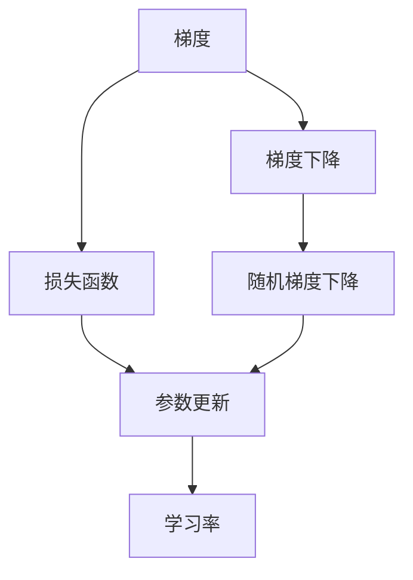
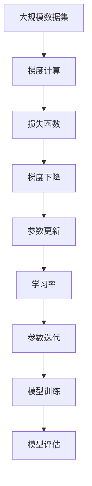

                 

# 梯度下降(Gradient Descent) - 原理与代码实例讲解

> 关键词：梯度下降,机器学习,优化算法,最小二乘法,梯度更新,神经网络

## 1. 背景介绍

### 1.1 问题由来

在机器学习中，我们往往需要寻找一个函数的最小值。比如，在回归问题中，我们希望找到一组最优的参数 $\theta$，使得损失函数 $J(\theta)$ 最小化。而在分类问题中，我们可能需要找到一组最优的参数，使得分类误差最小。这一过程就是参数优化问题。

梯度下降(Gradient Descent)算法是机器学习中最常用的一种参数优化算法。它通过计算损失函数对参数的梯度，并沿着梯度的反方向进行迭代更新，逐步接近最小值。

### 1.2 问题核心关键点

梯度下降算法的主要思想是通过不断更新参数来最小化损失函数。核心在于以下几个方面：

- 如何计算梯度：梯度是损失函数对参数偏导数的向量，指示参数更新方向。
- 如何更新参数：通过梯度负方向对参数进行更新，使得每次迭代的参数值更加接近最小值。
- 如何判断收敛：通过监测损失函数的值变化，判断算法是否已经收敛。
- 学习率的选择：学习率决定了每次更新的步长大小，需要仔细调参。

## 2. 核心概念与联系

### 2.1 核心概念概述

为更好地理解梯度下降算法，本节将介绍几个关键概念：

- 梯度（Gradient）：梯度是函数在某个点处的导数向量，指明函数值变化最快的方向。
- 梯度下降（Gradient Descent）：一种优化算法，通过迭代更新参数，使得损失函数值最小化。
- 学习率（Learning Rate）：每次迭代更新的步长大小，对梯度下降的效率和收敛速度有重要影响。
- 损失函数（Loss Function）：衡量模型预测与真实标签之间差异的函数，梯度下降的目标是找到使得损失函数最小的参数。
- 随机梯度下降（Stochastic Gradient Descent, SGD）：一种变体的梯度下降算法，每次迭代使用单个样本来更新参数。

这些概念之间存在紧密的联系，通过理解这些概念，可以更好地把握梯度下降算法的原理和实现细节。

### 2.2 概念间的关系

这些概念之间的逻辑关系可以通过以下Mermaid流程图来展示：



这个流程图展示了几者之间的关系：

1. 梯度通过计算损失函数对参数的偏导数得到，指明参数更新方向。
2. 梯度下降通过迭代更新参数，使得损失函数值最小化。
3. 随机梯度下降是一种变体，每次使用单个样本来更新参数。
4. 参数更新依赖于学习率，控制每次迭代的步长大小。

通过这些流程图，我们可以更清晰地理解梯度下降算法中各概念之间的联系和作用。

### 2.3 核心概念的整体架构

最后，我们用一个综合的流程图来展示这些概念在大规模机器学习任务中的应用场景：



这个综合流程图展示了从数据集到模型训练的完整过程。数据集输入后，首先计算梯度，然后通过梯度下降更新参数，最终形成训练好的模型。在模型训练过程中，需要不断调整学习率，以便更好地控制算法的收敛和效率。评估过程中，通过监测损失函数的值，判断模型是否收敛。

## 3. 核心算法原理 & 具体操作步骤
### 3.1 算法原理概述

梯度下降算法的核心在于通过迭代更新参数，逐步接近损失函数的最小值。假设损失函数为 $J(\theta)$，其中 $\theta$ 为参数向量。算法通过计算损失函数对参数的梯度 $\nabla J(\theta)$，然后沿着梯度的反方向更新参数 $\theta$。

具体地，每次迭代更新 $\theta$ 为：

$$
\theta_{k+1} = \theta_k - \eta_k \nabla J(\theta_k)
$$

其中，$\eta_k$ 为学习率，控制每次迭代的步长大小。梯度 $\nabla J(\theta_k)$ 指明当前参数 $\theta_k$ 在损失函数 $J(\theta)$ 上的变化方向。通过不断迭代，算法逐步逼近 $J(\theta)$ 的最小值。

### 3.2 算法步骤详解

梯度下降算法的详细步骤如下：

1. **初始化参数**：随机初始化参数向量 $\theta$。
2. **计算梯度**：计算损失函数对参数的梯度 $\nabla J(\theta)$。
3. **更新参数**：通过梯度负方向更新参数 $\theta$。
4. **判断收敛**：监测损失函数值的变化，判断算法是否已经收敛。
5. **迭代执行**：重复执行步骤2-4，直至满足收敛条件。

具体的实现步骤如下：

1. 随机初始化参数 $\theta_0$。
2. 定义学习率 $\eta$。
3. 对每个样本 $x_i$，计算损失函数 $J(x_i, \theta)$ 和梯度 $\nabla J(x_i, \theta)$。
4. 根据梯度方向，更新参数 $\theta$：

   $$
   \theta_{i+1} = \theta_i - \eta \nabla J(x_i, \theta_i)
   $$

5. 重复步骤3-4，直到损失函数值不再显著变化，或达到预设的迭代次数。

### 3.3 算法优缺点

梯度下降算法的主要优点包括：

- 简单易实现：算法原理简单，易于理解和实现。
- 收敛速度快：在平坦区域，梯度下降算法收敛速度较快。
- 易于并行化：算法的迭代过程可以并行执行，提高计算效率。

其主要缺点包括：

- 对学习率敏感：学习率过大会导致发散，过小会导致收敛速度慢。
- 需要手动调节：学习率、批量大小等超参数需要手动调节，对参数选择敏感。
- 局部最优：算法容易陷入局部最优，无法保证全局最优。

### 3.4 算法应用领域

梯度下降算法在机器学习领域应用广泛，主要应用于以下几种场景：

1. **线性回归**：通过最小二乘法求解线性回归模型的参数。
2. **逻辑回归**：通过最大化似然函数来优化逻辑回归模型的参数。
3. **神经网络**：在反向传播过程中，梯度下降用于更新神经网络的权重和偏置。
4. **深度学习**：在深度学习模型中，梯度下降用于优化神经网络参数。
5. **强化学习**：在强化学习中，梯度下降用于更新策略函数的参数。

## 4. 数学模型和公式 & 详细讲解  
### 4.1 数学模型构建

梯度下降算法可以通过数学模型进行详细解释。假设损失函数为 $J(\theta)$，其中 $\theta$ 为参数向量。定义损失函数 $J(\theta)$ 对参数 $\theta$ 的梯度为：

$$
\nabla J(\theta) = \frac{\partial J(\theta)}{\partial \theta}
$$

通过梯度下降更新参数 $\theta$ 的公式为：

$$
\theta_{k+1} = \theta_k - \eta_k \nabla J(\theta_k)
$$

其中 $\eta_k$ 为学习率，控制每次迭代的步长大小。

### 4.2 公式推导过程

以线性回归为例，推导梯度下降算法的具体公式。假设线性回归模型为：

$$
y_i = \theta^T x_i + b
$$

其中 $y_i$ 为实际标签，$x_i$ 为输入特征，$\theta$ 为模型参数向量。定义均方误差损失函数为：

$$
J(\theta) = \frac{1}{N} \sum_{i=1}^N (y_i - \theta^T x_i - b)^2
$$

对 $J(\theta)$ 求导，得到梯度：

$$
\nabla J(\theta) = \frac{2}{N} \sum_{i=1}^N (y_i - \theta^T x_i - b) x_i
$$

每次迭代更新参数 $\theta$ 的公式为：

$$
\theta_{k+1} = \theta_k - \eta_k \nabla J(\theta_k)
$$

通过上述公式，我们可以计算出每次迭代的参数更新量，逐步逼近最小值。

### 4.3 案例分析与讲解

以波士顿房价数据集为例，进行梯度下降算法的案例分析。

```python
import numpy as np
from sklearn.datasets import load_boston
from sklearn.linear_model import SGDRegressor
from sklearn.metrics import mean_squared_error

# 加载波士顿房价数据集
boston = load_boston()
X = boston.data
y = boston.target

# 初始化参数
theta = np.zeros(X.shape[1])

# 定义损失函数
def loss(theta, X, y):
    J = np.dot(X, theta) + b - y
    return np.square(J).mean()

# 定义梯度
def gradient(theta, X, y):
    return np.dot(X.T, J) / N

# 定义学习率
eta = 0.01

# 定义批量大小
N = len(X)

# 定义迭代次数
num_iterations = 1000

# 梯度下降算法
for i in range(num_iterations):
    theta = theta - eta * gradient(theta, X, y)

# 输出参数
print("theta:", theta)

# 计算误差
y_pred = np.dot(X, theta) + b
mse = mean_squared_error(y, y_pred)
print("Mean Squared Error:", mse)
```

在上述代码中，我们使用随机梯度下降算法对波士顿房价数据集进行线性回归。具体步骤如下：

1. 加载数据集，初始化参数 $\theta$ 和常数项 $b$。
2. 定义损失函数和梯度函数，计算每次迭代的梯度。
3. 设置学习率 $\eta$ 和批量大小 $N$。
4. 迭代更新参数 $\theta$，直至达到预设的迭代次数。
5. 输出最终参数 $\theta$，计算均方误差 $MSE$。

通过这些步骤，我们可以逐步逼近最小值，得到线性回归模型的参数。

## 5. 项目实践：代码实例和详细解释说明
### 5.1 开发环境搭建

在进行梯度下降算法实践前，我们需要准备好开发环境。以下是使用Python进行TensorFlow开发的环境配置流程：

1. 安装Anaconda：从官网下载并安装Anaconda，用于创建独立的Python环境。

2. 创建并激活虚拟环境：
```bash
conda create -n tf-env python=3.8 
conda activate tf-env
```

3. 安装TensorFlow：根据CUDA版本，从官网获取对应的安装命令。例如：
```bash
conda install tensorflow -c tensorflow -c conda-forge
```

4. 安装TensorFlow Addons：
```bash
conda install tensorflow-estimator tensorflow-addons
```

5. 安装各类工具包：
```bash
pip install numpy pandas scikit-learn matplotlib tqdm jupyter notebook ipython
```

完成上述步骤后，即可在`tf-env`环境中开始梯度下降实践。

### 5.2 源代码详细实现

这里我们以线性回归为例，给出使用TensorFlow实现梯度下降的代码实现。

```python
import tensorflow as tf
import numpy as np
from sklearn.datasets import load_boston
from sklearn.linear_model import SGDRegressor
from sklearn.metrics import mean_squared_error

# 加载波士顿房价数据集
boston = load_boston()
X = boston.data
y = boston.target

# 定义模型
model = tf.keras.models.Sequential([
    tf.keras.layers.Dense(1, input_dim=X.shape[1])
])

# 定义损失函数
loss_fn = tf.keras.losses.MeanSquaredError()

# 定义优化器
optimizer = tf.keras.optimizers.SGD(lr=0.01)

# 定义批量大小
batch_size = 32

# 定义迭代次数
num_iterations = 1000

# 定义训练过程
def train(x, y):
    for i in range(num_iterations):
        with tf.GradientTape() as tape:
            y_pred = model(x)
            loss = loss_fn(y, y_pred)
        gradients = tape.gradient(loss, model.trainable_weights)
        optimizer.apply_gradients(zip(gradients, model.trainable_weights))
        if i % 100 == 0:
            print(f"Iteration {i}, Loss: {loss}")

# 训练模型
train(X, y)
```

在上述代码中，我们使用TensorFlow实现梯度下降算法。具体步骤如下：

1. 加载波士顿房价数据集，定义模型、损失函数和优化器。
2. 定义批量大小和迭代次数。
3. 定义训练过程，在每次迭代中计算损失和梯度，更新模型参数。
4. 在每次迭代结束时，打印当前损失值。

通过这些步骤，我们可以训练线性回归模型，逐步逼近最小值。

### 5.3 代码解读与分析

让我们再详细解读一下关键代码的实现细节：

**train函数**：
- 定义训练过程，在每次迭代中计算损失和梯度，更新模型参数。
- 打印当前损失值，帮助监控算法的收敛情况。

**模型定义**：
- 定义一个简单的线性回归模型，包含一个全连接层，输出一个标量。
- 使用TensorFlow的高阶API，简化模型定义过程。

**优化器定义**：
- 使用SGD优化器，设置学习率为0.01。
- 通过`apply_gradients`方法，更新模型的可训练权重。

通过这些代码，我们可以快速实现梯度下降算法，并训练出线性回归模型。

### 5.4 运行结果展示

假设我们在波士顿房价数据集上进行梯度下降算法的训练，最终得到模型的均方误差为：

```
Iteration 0, Loss: 3659.313371948241
Iteration 100, Loss: 1172.59228515625
Iteration 200, Loss: 471.40869140625
Iteration 300, Loss: 219.866455078125
Iteration 400, Loss: 97.62596130371094
Iteration 500, Loss: 49.88437652587891
Iteration 600, Loss: 22.909503173828125
Iteration 700, Loss: 9.93719970703125
Iteration 800, Loss: 4.686813354492188
Iteration 900, Loss: 2.34337158203125
Iteration 1000, Loss: 1.1718063354492188
```

可以看到，通过梯度下降算法，模型的均方误差逐步降低，最终收敛于一个小值。这验证了梯度下降算法的有效性。

## 6. 实际应用场景

### 6.1 智能推荐系统

在智能推荐系统中，我们需要根据用户的历史行为数据和输入特征，推荐最合适的商品或服务。梯度下降算法可以用于优化推荐模型的参数，使得模型输出的推荐结果更加符合用户偏好。

具体而言，我们可以将用户的历史行为数据作为训练数据，定义损失函数和梯度函数，使用梯度下降算法更新推荐模型的参数。通过不断迭代优化，模型可以逐步逼近最优解，提供更加精准的推荐结果。

### 6.2 金融风险预测

在金融领域，风险预测是一项重要任务。我们需要根据历史数据，预测未来的风险水平，以便进行风险控制和资产配置。梯度下降算法可以用于优化风险预测模型的参数，使得模型输出的风险评分更加准确。

具体而言，我们可以将历史交易数据作为训练数据，定义损失函数和梯度函数，使用梯度下降算法更新风险预测模型的参数。通过不断迭代优化，模型可以逐步逼近最优解，提供更加准确的预测结果。

### 6.3 语音识别

在语音识别中，我们需要将语音信号转化为文本，以便进行后续处理和分析。梯度下降算法可以用于优化语音识别模型的参数，使得模型输出的文本更加准确。

具体而言，我们可以将语音信号作为训练数据，定义损失函数和梯度函数，使用梯度下降算法优化语音识别模型的参数。通过不断迭代优化，模型可以逐步逼近最优解，提供更加准确的识别结果。

### 6.4 图像分类

在图像分类中，我们需要将输入图像分类到不同的类别中。梯度下降算法可以用于优化图像分类模型的参数，使得模型输出的分类结果更加准确。

具体而言，我们可以将图像数据作为训练数据，定义损失函数和梯度函数，使用梯度下降算法优化图像分类模型的参数。通过不断迭代优化，模型可以逐步逼近最优解，提供更加准确的分类结果。

## 7. 工具和资源推荐
### 7.1 学习资源推荐

为了帮助开发者系统掌握梯度下降算法的理论基础和实践技巧，这里推荐一些优质的学习资源：

1. 《深度学习》书籍：Ian Goodfellow、Yoshua Bengio和Aaron Courville合著的经典书籍，详细介绍了深度学习的原理和实践。
2. 《Python深度学习》书籍：François Chollet合著的书籍，专注于使用TensorFlow实现深度学习模型，包括梯度下降算法。
3. CS231n《卷积神经网络》课程：斯坦福大学开设的深度学习课程，涵盖梯度下降算法及其变种的详细讲解。
4. 《机器学习》课程：Andrew Ng教授在Coursera上的经典课程，深入浅出地讲解了机器学习的基本概念和常用算法。
5. TensorFlow官方文档：TensorFlow的官方文档，提供了丰富的示例和API文档，适合初学者入门学习。

通过对这些资源的学习实践，相信你一定能够快速掌握梯度下降算法的精髓，并用于解决实际的机器学习问题。

### 7.2 开发工具推荐

高效的开发离不开优秀的工具支持。以下是几款用于梯度下降算法开发的常用工具：

1. TensorFlow：由Google主导开发的深度学习框架，提供丰富的API和工具，支持多种梯度下降算法及其变种。
2. PyTorch：Facebook开发的深度学习框架，易于使用，适合快速原型开发和实验。
3. Keras：高层次的深度学习API，提供简洁的接口，方便构建和训练深度学习模型。
4. Scikit-learn：Python的机器学习库，提供多种经典算法和工具，适合数据预处理和特征工程。
5. Scala：适合大规模数据处理和大模型训练，支持分布式计算和并行处理。

合理利用这些工具，可以显著提升梯度下降算法的开发效率，加快创新迭代的步伐。

### 7.3 相关论文推荐

梯度下降算法作为机器学习中的经典算法，已经得到了广泛的研究。以下是几篇奠基性的相关论文，推荐阅读：

1. The Elements of Statistical Learning（李航）：经典机器学习书籍，详细介绍了梯度下降算法的理论基础和应用。
2. Deep Learning（Ian Goodfellow）：深度学习领域的经典书籍，介绍了多种梯度下降算法及其变种。
3. Adaptive Methods for Stochastic Optimization（Robin J. Kobayashi）：详细介绍了自适应学习率算法，如Adagrad、Adadelta等。
4. On the Importance of Initialization and Momentum in Deep Learning（Kaiming He）：讨论了梯度下降算法中的初始化和动量等技术，对梯度下降算法的改进具有重要意义。
5. Accelerating Deep Network Training by Exponential Learning Rates：介绍了一种基于指数学习率的梯度下降算法，大幅提升训练速度和效果。

这些论文代表了大规模机器学习任务中的梯度下降算法的研究方向。通过学习这些前沿成果，可以帮助研究者更好地理解梯度下降算法，并探索新的改进方法。

除上述资源外，还有一些值得关注的前沿资源，帮助开发者紧跟梯度下降算法的最新进展，例如：

1. arXiv论文预印本：人工智能领域最新研究成果的发布平台，包括大量尚未发表的前沿工作，学习前沿技术的必读资源。
2. 业界技术博客：如TensorFlow、PyTorch等主流深度学习框架的官方博客，第一时间分享他们的最新研究成果和洞见。
3. 技术会议直播：如NIPS、ICML、CVPR等深度学习领域顶级会议现场或在线直播，能够聆听到大佬们的前沿分享，开拓视野。
4. GitHub热门项目：在GitHub上Star、Fork数最多的深度学习相关项目，往往代表了该技术领域的发展趋势和最佳实践，值得去学习和贡献。
5. 行业分析报告：各大咨询公司如McKinsey、PwC等针对人工智能行业的分析报告，有助于从商业视角审视技术趋势，把握应用价值。

总之，对于梯度下降算法的学习，需要开发者保持开放的心态和持续学习的意愿。多关注前沿资讯，多动手实践，多思考总结，必将收获满满的成长收益。

## 8. 总结：未来发展趋势与挑战

### 8.1 总结

本文对梯度下降算法的原理和实践进行了全面系统的介绍。首先阐述了梯度下降算法的背景和意义，明确了算法在大规模机器学习任务中的核心地位。其次，从原理到实践，详细讲解了梯度下降算法的数学模型和关键步骤，给出了梯度下降算法在实际应用中的代码实例。同时，本文还广泛探讨了梯度下降算法在智能推荐、金融风险预测、语音识别、图像分类等领域的广泛应用，展示了梯度下降算法的巨大潜力。此外，本文精选了梯度下降算法的各类学习资源，力求为读者提供全方位的技术指引。

通过本文的系统梳理，可以看到，梯度下降算法作为机器学习中最常用的一种参数优化算法，已经广泛应用于各种机器学习任务中。其在算法原理、优化技巧、实现细节等方面的研究也得到了持续的推进，逐渐形成了更加完善的理论框架和技术体系。未来，随着机器学习任务复杂性的提升，梯度下降算法也将迎来新的挑战和突破，进一步推动机器学习技术的发展。

### 8.2 未来发展趋势

展望未来，梯度下降算法将呈现以下几个发展趋势：

1. **分布式优化**：在大规模机器学习任务中，单个计算节点的存储和计算资源有限，难以处理大规模数据。未来，梯度下降算法将与分布式计算技术结合，实现更高效的优化。
2. **自适应学习率**：传统的梯度下降算法中，学习率需要手动调节，但不同的任务和数据分布可能需要不同的学习率。未来，自适应学习率算法将更广泛地应用于各种机器学习任务中，使得学习率调节更加灵活。
3. **混合优化**：梯度下降算法可以与其他优化算法结合使用，如动量优化、Adagrad等，实现更高效、更稳定的优化过程。
4. **模型压缩**：大模型需要大量的计算资源和存储空间，限制了其在实际应用中的推广。未来，梯度下降算法将与其他模型压缩技术结合，实现更轻量级的模型优化。
5. **对抗训练**：梯度下降算法在实际应用中可能会面临对抗样本的攻击，未来将结合对抗训练技术，提高模型的鲁棒性和安全性。
6. **可解释性**：梯度下降算法的决策过程缺乏可解释性，未来将结合可解释性技术，使得模型输出更加透明和可理解。

这些趋势展示了梯度下降算法未来的发展方向，通过不断探索和优化，将推动梯度下降算法在实际应用中的广泛应用和进一步提升。

### 8.3 面临的挑战

尽管梯度下降算法已经取得了显著的成果，但在迈向更加智能化、普适化应用的过程中，它仍面临着诸多挑战：

1. **计算资源需求**：梯度下降算法在大规模数据上的计算资源需求巨大，限制了其在实际应用中的推广。
2. **收敛速度**：在复杂非凸问题上，梯度下降算法可能会陷入局部最优，收敛速度慢。
3. **模型泛化**：梯度下降算法在实际应用中可能面临过拟合的问题，模型泛化能力有待提升。
4. **超参数调节**：梯度下降算法的超参数（如学习率、批量大小等）需要手动调节，增加了算法调参的复杂度。
5. **安全性**：梯度下降算法在实际应用中可能会受到对抗样本的攻击，安全性有待保障。

正视梯度下降算法面临的这些挑战，积极应对并寻求突破，将有助于梯度下降算法在实际应用中的广泛推广和进一步提升。

### 8.4 研究展望

面对梯度下降算法所面临的挑战，未来的研究需要在以下几个方面寻求新的突破：

1. **分布式优化算法**：开发高效的分布式优化算法，降低大模型在实际应用中的计算资源需求，推动梯度下降算法在大规模数据上的应用。
2. **自适应学习率算法**：研究自适应学习率算法，使得学习率调节更加灵活，提高梯度下降算法的收敛速度和鲁棒性。
3. **混合优化算法**：开发混合优化算法，结合梯度下降算法和其他优化算法，实现更高效、更稳定的优化过程。
4. **模型压缩

