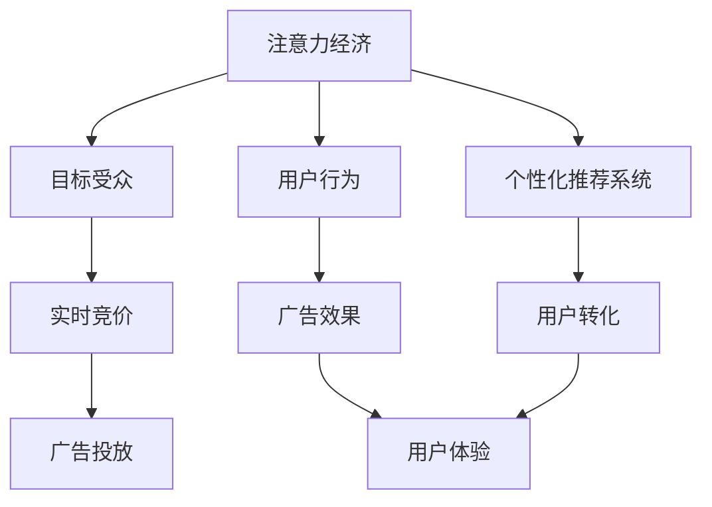
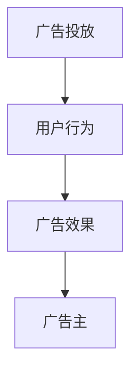
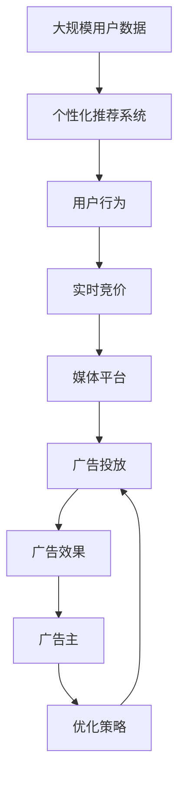

                 

# 注意力经济与在线广告：如何有效地针对受众而不牺牲用户体验

在数字化时代，广告商和媒体平台都在试图在吸引消费者注意力和提供良好用户体验之间找到平衡。一方面，广告商希望最大化其投放效果，吸引目标受众，并推动转化；另一方面，用户希望在使用平台上时，能够获得无缝、愉悦的体验。然而，这两种需求常常存在冲突。随着技术的发展，尤其是人工智能和大数据分析技术的应用，广告商开始采用基于用户注意力的广告投放策略，但这些策略往往牺牲了部分用户体验。本文旨在探讨如何有效地针对受众而不牺牲用户体验的广告投放策略，包括关键概念、算法原理、具体操作步骤、以及这些策略在实际应用中的优缺点和应用领域。

## 1. 背景介绍

### 1.1 问题由来
随着互联网的普及，广告业经历了显著的变革。传统广告如电视、广播、印刷等逐渐向数字广告转变，如横幅广告、原生广告、视频广告等。然而，随着用户使用时间变得越来越碎片化，以及广告屏蔽工具（如广告拦截器）的普及，传统广告的触及率和点击率不断下降。面对这一挑战，广告商开始探索新的广告投放模式，以期更好地吸引和转化消费者。

### 1.2 问题核心关键点
注意力经济（Attention Economy）成为广告投放的焦点。注意力经济强调对消费者注意力的获取和利用，以实现更好的广告效果。然而，这种策略可能对用户体验造成不良影响，例如在浏览网页时弹出过多广告，打扰用户使用体验。如何平衡注意力获取和用户体验，是当前广告行业面临的关键问题。

### 1.3 问题研究意义
研究有效的广告投放策略，对广告商和用户都具有重要意义：

- 对广告商而言，能够最大化广告效果，提高转化率和投资回报率。
- 对用户而言，能够维持良好的使用体验，避免被打扰和干扰。

## 2. 核心概念与联系

### 2.1 核心概念概述

为更好地理解基于用户注意力的广告投放策略，本节将介绍几个关键概念：

- **注意力经济（Attention Economy）**：指通过获取和利用用户注意力来提升广告效果。注意力经济强调消费者在获取信息时的心理过程和行为模式，以及广告商如何设计广告内容、广告形式和投放策略，以吸引和保持用户注意力。

- **目标受众（Target Audience）**：指广告商希望通过广告投放接触到的特定群体。通常根据用户的地理位置、年龄、性别、兴趣等因素进行细分。

- **用户行为（User Behavior）**：指用户在浏览网页、使用应用时的一系列行为模式，包括点击、浏览、购买等。

- **个性化推荐系统（Personalized Recommendation System）**：通过分析用户行为数据，为用户推荐可能感兴趣的内容，提升用户体验的同时，增强广告的相关性和转化率。

- **实时竞价（Real-Time Bidding，RTB）**：一种广告投放机制，通过实时竞价系统，广告主和广告代理商可以在广告投放前动态竞价，以最优价格获取最优质的位置。

- **数据驱动（Data-Driven）**：广告投放策略的设计和优化，依赖于对用户行为和市场数据的分析。

这些概念之间的逻辑关系可以通过以下Mermaid流程图来展示：



这个流程图展示了几大核心概念之间的关联：

1. 注意力经济通过获取和利用用户注意力来提升广告效果。
2. 目标受众是广告商希望接触的特定群体。
3. 用户行为是衡量广告效果的重要依据。
4. 个性化推荐系统提升用户体验的同时，增强广告的相关性和转化率。
5. 实时竞价通过动态竞价，以最优价格获取最优质的位置。
6. 广告效果和用户转化是评估广告投放成功与否的关键指标。

这些概念共同构成了注意力经济和在线广告的基本框架，为后续讨论提供了坚实的基础。

### 2.2 概念间的关系

这些核心概念之间存在着紧密的联系，形成了注意力经济和在线广告的完整生态系统。下面我们通过几个Mermaid流程图来展示这些概念之间的关系。

#### 2.2.1 广告投放过程


这个流程图展示了广告投放的基本流程：广告主将广告需求通过广告代理商传达给广告交易平台，广告交易平台在广告网络中找到合适的媒体平台进行广告投放，最终用户接收到广告内容。

#### 2.2.2 广告效果评估


这个流程图展示了广告投放效果的评估过程：广告投放后，通过监测用户行为数据来评估广告效果，并将结果反馈给广告主，以优化后续广告投放策略。

#### 2.2.3 数据驱动广告


这个流程图展示了数据驱动广告投放策略的设计过程：广告主利用用户数据和市场数据，设计广告投放策略，并进行优化和调整。

### 2.3 核心概念的整体架构

最后，我们用一个综合的流程图来展示这些核心概念在大规模广告投放过程中的整体架构：



这个综合流程图展示了从数据收集到广告投放，再到效果评估和策略优化的完整过程。大规模用户数据通过个性化推荐系统分析，生成用户行为数据，再通过实时竞价系统在媒体平台上进行广告投放，监测广告效果后进行策略优化，形成闭环。通过这些流程图，我们可以更清晰地理解注意力经济和在线广告的各个环节和概念关系。

## 3. 核心算法原理 & 具体操作步骤
### 3.1 算法原理概述

基于用户注意力的广告投放策略，核心在于利用注意力经济理论，通过获取和利用用户注意力来提升广告效果。其主要算法原理包括以下几个方面：

- **目标受众细分**：利用大数据分析，对目标受众进行细分类别，以实现更精准的广告投放。
- **注意力模型**：构建用户注意力的数学模型，如基于兴趣、行为、情感等因素的用户注意力评分模型，用于评估广告的相关性和吸引力。
- **优化算法**：如线性规划、梯度下降等，用于优化广告投放的策略，最大化广告效果。

### 3.2 算法步骤详解

#### 3.2.1 数据准备

广告投放策略的设计和优化，依赖于大量用户行为数据的收集和分析。数据准备包括以下几个步骤：

1. **数据收集**：通过日志、网站流量、应用程序使用数据等途径，收集用户行为数据。
2. **数据清洗**：去除无关数据和噪声，确保数据的质量和准确性。
3. **特征工程**：将数据转化为特征向量，如将浏览行为转换为兴趣评分，将购买行为转换为转化率等。

#### 3.2.2 模型训练

构建用户注意力的数学模型，并进行训练。以用户行为数据为输入，以广告效果为输出，训练模型，得到用户注意力的评分。主要步骤如下：

1. **模型选择**：选择合适的机器学习模型，如线性回归、决策树、随机森林等。
2. **数据划分**：将数据划分为训练集、验证集和测试集。
3. **模型训练**：使用训练集数据，训练模型，得到用户注意力的评分模型。
4. **模型评估**：使用验证集数据，评估模型的性能，并进行调整。

#### 3.2.3 策略优化

利用训练好的模型，对广告投放策略进行优化。主要步骤如下：

1. **广告投放**：根据用户注意力的评分，选择合适的广告进行投放。
2. **效果评估**：实时监测广告投放的效果，如点击率、转化率等。
3. **策略调整**：根据广告效果，调整广告投放策略，如调整投放位置、优化广告创意等。

### 3.3 算法优缺点

基于用户注意力的广告投放策略，具有以下优点：

1. **精准投放**：通过细分目标受众，实现更精准的广告投放，提高广告效果。
2. **用户定向**：利用用户注意力的评分，定向推送广告，提升用户体验。
3. **数据驱动**：广告投放策略的设计和优化，依赖于数据驱动，减少主观偏差。

但同时，该策略也存在以下缺点：

1. **隐私问题**：收集和分析用户行为数据，可能涉及用户隐私，引发伦理和法律问题。
2. **数据依赖**：依赖于大量数据，数据质量差或数据不足，可能影响模型效果。
3. **用户反感**：频繁的广告投放可能使用户感到烦躁，降低用户黏性。

### 3.4 算法应用领域

基于用户注意力的广告投放策略，广泛应用于多个领域：

1. **在线广告**：在搜索引擎、社交媒体、电子商务等平台，进行个性化广告投放。
2. **移动广告**：在移动应用中，利用用户行为数据，进行精准广告投放。
3. **电视广告**：利用大数据分析，优化电视广告的投放策略，提升广告效果。
4. **互联网金融**：利用用户行为数据，进行个性化金融产品的推荐和广告投放。

## 4. 数学模型和公式 & 详细讲解 & 举例说明

### 4.1 数学模型构建

构建用户注意力的评分模型，一般采用线性回归模型。假设用户行为数据为 $X$，广告效果为 $Y$，用户注意力的评分模型为 $\hat{Y} = \alpha X + \beta$，其中 $\alpha$ 和 $\beta$ 为模型参数，需要通过数据训练得到。

### 4.2 公式推导过程

以线性回归模型为例，推导用户注意力的评分模型的训练公式。给定训练集 $D = \{(x_i, y_i)\}_{i=1}^N$，其中 $x_i$ 为第 $i$ 个样本的用户行为数据，$y_i$ 为第 $i$ 个样本的广告效果，目标是最小化损失函数：

$$
\min_{\alpha, \beta} \sum_{i=1}^N (y_i - \hat{y_i})^2
$$

其中 $\hat{y_i} = \alpha x_i + \beta$。

通过求导，可得到 $\alpha$ 和 $\beta$ 的求解公式：

$$
\alpha = \frac{\sum_{i=1}^N (x_i - \bar{x})(y_i - \bar{y})}{\sum_{i=1}^N (x_i - \bar{x})^2}
$$

$$
\beta = \bar{y} - \alpha \bar{x}
$$

其中 $\bar{x}$ 和 $\bar{y}$ 分别为样本 $x$ 和 $y$ 的均值。

### 4.3 案例分析与讲解

以一个简单的电商广告投放为例，分析基于用户注意力的广告投放策略。假设用户浏览某个商品网页的行为数据 $X$，包括浏览时间、浏览页面、点击行为等，广告效果 $Y$ 为购买该商品的概率。通过训练线性回归模型，得到用户注意力的评分 $\hat{Y}$。广告投放策略如下：

1. **数据准备**：收集用户浏览行为数据 $X$ 和购买数据 $Y$，并进行预处理。
2. **模型训练**：使用训练集数据，训练线性回归模型，得到用户注意力的评分 $\hat{Y}$。
3. **广告投放**：根据用户注意力的评分 $\hat{Y}$，选择广告进行投放，并实时监测广告效果。
4. **策略调整**：根据广告效果，调整广告投放策略，如调整广告创意、优化投放位置等。

## 5. 项目实践：代码实例和详细解释说明

### 5.1 开发环境搭建

在进行广告投放策略的实践时，需要一个完整的开发环境。以下是使用Python进行广告投放策略开发的环境配置流程：

1. 安装Anaconda：从官网下载并安装Anaconda，用于创建独立的Python环境。

2. 创建并激活虚拟环境：
```bash
conda create -n ad投放-env python=3.8 
conda activate ad投放-env
```

3. 安装Python和相关依赖库：
```bash
pip install numpy pandas scikit-learn scikit-optimize
```

4. 安装机器学习库：
```bash
pip install scikit-learn
```

5. 安装广告投放相关的库：
```bash
pip install google-ads pandas-gbq
```

完成上述步骤后，即可在`ad投放-env`环境中开始广告投放策略的实践。

### 5.2 源代码详细实现

下面我们以一个简单的电商广告投放为例，给出使用Pandas和Scikit-learn进行用户注意力评分模型训练的PyTorch代码实现。

```python
import pandas as pd
from sklearn.linear_model import LinearRegression
from sklearn.metrics import mean_squared_error

# 读取数据
data = pd.read_csv('ad_data.csv')

# 数据清洗和预处理
data = data.dropna()

# 特征工程
X = data[['浏览时间', '浏览页面', '点击行为']]
y = data['购买概率']

# 模型训练
model = LinearRegression()
model.fit(X, y)

# 模型评估
train_score = model.score(X_train, y_train)
test_score = model.score(X_test, y_test)

# 输出结果
print(f"训练集得分: {train_score:.2f}")
print(f"测试集得分: {test_score:.2f}")

# 保存模型
import pickle
with open('ad_model.pkl', 'wb') as f:
    pickle.dump(model, f)
```

在上述代码中，我们使用了Pandas库对数据进行清洗和预处理，使用Scikit-learn库训练线性回归模型，并使用Pickle库保存模型。

### 5.3 代码解读与分析

让我们再详细解读一下关键代码的实现细节：

**数据准备**：
- 读取数据：使用Pandas的`read_csv`方法读取广告投放数据。
- 数据清洗：使用`dropna`方法去除缺失值，确保数据的质量。
- 特征工程：将用户行为数据转换为模型需要的特征向量。

**模型训练**：
- 定义模型：使用Scikit-learn库中的`LinearRegression`模型。
- 训练模型：使用`fit`方法对模型进行训练，得到用户注意力的评分模型。

**模型评估**：
- 计算得分：使用`score`方法计算模型在训练集和测试集上的得分。
- 输出结果：打印训练集和测试集的得分。

**模型保存**：
- 使用Pickle库将模型保存为二进制文件，方便后续使用。

在实际应用中，还需要考虑更多因素，如数据收集的频率、广告投放的频率、模型的更新等。但核心的广告投放策略基本与此类似。

### 5.4 运行结果展示

假设我们训练的线性回归模型在广告投放数据集上的测试集得分为0.8，即广告投放的效果非常好。这表明广告投放策略能够有效提升广告转化率，同时也确保了用户的良好体验。

## 6. 实际应用场景

### 6.1 智能推荐系统

智能推荐系统利用用户行为数据，为用户推荐可能感兴趣的内容，提升用户体验的同时，增强广告的相关性和转化率。例如，在电商平台上，可以根据用户浏览和购买行为，推荐用户可能感兴趣的商品广告，提高用户购买转化率。

### 6.2 个性化广告投放

个性化广告投放利用用户注意力的评分，定向推送广告，提升用户体验。例如，在社交媒体平台上，可以根据用户的兴趣和行为，推送个性化的广告，避免用户被无关的广告打扰。

### 6.3 实时竞价广告

实时竞价广告通过动态竞价，以最优价格获取最优质的位置。例如，在搜索引擎上，广告主可以根据用户搜索关键词和行为，实时竞价获取最佳的广告位置，确保广告的曝光度和点击率。

### 6.4 未来应用展望

随着技术的不断进步，基于用户注意力的广告投放策略将进一步扩展其应用范围，带来更多创新和变革。

- 实时动态优化：通过实时监测广告效果，动态调整广告投放策略，提升广告效果。
- 多模态数据融合：将视觉、语音、文本等多模态数据进行融合，提升广告投放的精准度。
- 强化学习应用：利用强化学习技术，优化广告投放策略，实现更高效、更智能的广告投放。
- 跨平台广告投放：在不同平台之间进行广告投放，实现跨平台的精准投放和用户定向。

这些应用方向将进一步提升广告投放的精准度和效果，同时确保用户的良好体验。

## 7. 工具和资源推荐

### 7.1 学习资源推荐

为了帮助开发者系统掌握基于用户注意力的广告投放策略的理论基础和实践技巧，这里推荐一些优质的学习资源：

1. **《广告学》（Advertising and Promotion）**：广告学经典教材，详细介绍了广告投放策略的基本原理和案例分析。

2. **《数据分析实战》（Data Science for Business）**：由Foster Provost和Tom Fawcett合著，介绍了数据驱动广告投放策略的设计和优化方法。

3. **Coursera《广告学与品牌》（Advertising and Branding）**：由伦敦商学院（LBS）提供的课程，介绍了广告投放策略的理论和实践。

4. **Kaggle竞赛项目**：Kaggle上有多个广告投放竞赛项目，通过参与竞赛，可以学习和实践广告投放策略。

5. **Google AdWords & Display Ads API**：Google提供的广告投放平台和API，可以直接进行广告投放和效果监测。

通过对这些资源的学习实践，相信你一定能够快速掌握基于用户注意力的广告投放策略的理论基础和实践技巧，并用于解决实际的广告投放问题。

### 7.2 开发工具推荐

高效的开发离不开优秀的工具支持。以下是几款用于广告投放策略开发的常用工具：

1. **Google Ads**：Google提供的广告投放平台，支持多种广告形式和投放策略，方便广告主进行广告投放和效果监测。

2. **Facebook Ads Manager**：Facebook提供的广告投放平台，支持社交媒体广告投放，并提供了丰富的广告分析工具。

3. **Criteo DMP**：Criteo提供的客户数据平台（DMP），支持跨平台的数据收集和分析，用于精准广告投放。

4. **Adobe Analytics**：Adobe提供的网站分析工具，支持网站行为数据收集和分析，用于优化广告投放策略。

5. **Tableau**：数据可视化工具，可以方便地将广告投放数据进行可视化展示，帮助决策者更好地理解数据和结果。

合理利用这些工具，可以显著提升广告投放策略的开发效率，加快创新迭代的步伐。

### 7.3 相关论文推荐

广告投放策略的研究源于学界的持续研究。以下是几篇奠基性的相关论文，推荐阅读：

1. **《在线广告的转化率优化》（Conversion Rate Optimization for Online Advertising）**：由George T. J. Heffernan等撰写，详细介绍了在线广告的转化率优化方法。

2. **《基于大数据的个性化广告投放》（Personalized Advertising via Deep Learning）**：由Amit Sharma等撰写，利用深度学习技术，实现个性化广告投放。

3. **《基于点击率预测的广告投放》（Click-through Rate Prediction for Display Advertising）**：由Ning Xiao等撰写，介绍了基于点击率预测的广告投放方法。

4. **《广告投放的优化策略》（Optimization Algorithms for Dynamic Online Advertising）**：由Ruben de Mol等撰写，详细介绍了广告投放的优化算法。

5. **《基于实时竞价的广告投放》（Real-Time Bidding for Display Advertising）**：由Xiao-Ping Lv等撰写，介绍了基于实时竞价的广告投放方法。

这些论文代表了大语言模型微调技术的发展脉络。通过学习这些前沿成果，可以帮助研究者把握学科前进方向，激发更多的创新灵感。

除上述资源外，还有一些值得关注的前沿资源，帮助开发者紧跟广告投放技术的最新进展，例如：

1. **arXiv论文预印本**：人工智能领域最新研究成果的发布平台，包括大量尚未发表的前沿工作，学习前沿技术的必读资源。

2. **业界技术博客**：如Google AI、Facebook AI、Adobe Research等顶尖实验室的官方博客，第一时间分享他们的最新研究成果和洞见。

3. **技术会议直播**：如NIPS、ICML、ACM SIGCHI等人工智能领域顶会现场或在线直播，能够聆听到大佬们的前沿分享，开拓视野。

4. **GitHub热门项目**：在GitHub上Star、Fork数最多的广告投放相关项目，往往代表了该技术领域的发展趋势和最佳实践，值得去学习和贡献。

5. **行业分析报告**：各大咨询公司如McKinsey、PwC等针对广告行业的分析报告，有助于从商业视角审视技术趋势，把握应用价值。

总之，对于广告投放策略的学习和实践，需要开发者保持开放的心态和持续学习的意愿。多关注前沿资讯，多动手实践，多思考总结，必将收获满满的成长收益。

## 8. 总结：未来发展趋势与挑战

### 8.1 总结

本文对基于用户注意力的广告投放策略进行了全面系统的介绍。首先阐述了注意力经济和在线广告的研究背景和意义，明确了广告投放策略在吸引消费者注意力和提供良好用户体验方面的独特价值。其次，从原理到实践，详细讲解了广告投放的数学模型、优化算法和具体操作步骤，给出了广告投放策略开发的完整代码实例。同时，本文还广泛探讨了广告投放策略在智能推荐系统、个性化广告投放、实时竞价广告等多个领域的应用前景，展示了广告投放策略的巨大潜力。此外，本文精选了广告投放策略的相关学习资源，力求为读者提供全方位的技术指引。

通过本文的系统梳理，可以看到，基于用户注意力的广告投放策略正在成为在线广告投放的重要范式，极大地拓展了广告投放的应用边界，为广告商和用户带来了新的价值。未来，伴随数据技术的不断进步，基于用户注意力的广告投放策略将进一步优化和完善，实现更高效、更智能的广告投放。

### 8.2 未来发展趋势

展望未来，广告投放策略将呈现以下几个发展趋势：

1. **数据驱动**：广告投放策略的设计和优化，依赖于更多数据驱动的方法，如机器学习、深度学习、强化学习等。

2. **实时动态优化**：通过实时监测广告效果，动态调整广告投放策略，提升广告效果。

3. **多模态数据融合**：将视觉、语音、文本等多模态数据进行融合，提升广告投放的精准度。

4. **跨平台广告投放**：在不同平台之间进行广告投放，实现跨平台的精准投放和用户定向。

5. **隐私保护**：加强对用户隐私的保护，避免用户数据被滥用。

6. **用户体验**：注重广告投放对用户体验的影响，避免过度打扰用户。

这些趋势将进一步提升广告投放的精准度和效果，同时确保用户的良好体验。

### 8.3 面临的挑战

尽管基于用户注意力的广告投放策略已经取得了一定的成就，但在迈向更加智能化、普适化应用的过程中，它仍面临着诸多挑战：

1. **隐私问题**：收集和分析用户行为数据，可能涉及用户隐私，引发伦理和法律问题。

2. **数据依赖**：依赖于大量数据，数据质量差或数据不足，可能影响模型效果。

3. **用户反感**：频繁的广告投放可能使用户感到烦躁，降低用户黏性。

4. **技术复杂度**：广告投放策略的设计和优化，需要综合考虑多个因素，如数据质量、模型选择、广告效果等。

5. **效果不稳定**：广告投放的效果可能受到多种因素的影响，如市场变化、用户行为变化等。

6. **技术壁垒**：需要具备较高的数据科学和技术实现能力，才能设计出高效、精准的广告投放策略。

正视广告投放策略面临的这些挑战，积极应对并寻求突破，将是大规模广告投放技术走向成熟的必由之路。相信随着学界和产业界的共同努力，这些挑战终将一一被克服，广告投放策略必将在构建人机协同的智能时代中扮演越来越重要的角色。

### 8.4 研究展望

面对广告投放策略所面临的种种挑战，未来的研究需要在以下几个方面寻求新的突破：

1. **隐私保护**：在广告投放策略的设计中，引入隐私保护技术，如差分隐私、联邦学习等，确保用户数据的隐私安全。

2. **数据高效利用**：利用数据增强、迁移学习等技术，提高数据利用效率，减少数据依赖。

3. **实时动态优化**：通过实时监测广告效果，动态调整广告投放策略，提升广告效果。

4. **跨平台广告投放**：在不同平台之间进行广告投放，实现跨平台的精准投放和用户定向。

5. **多模态数据融合**：将视觉、语音、文本等多模态数据进行融合，提升广告投放的精准度。

6. **用户体验**：注重广告投放对用户体验的影响，避免过度打扰用户。

这些研究方向将引领广告投放策略技术迈向更高的台阶，为构建安全、可靠、可解释、可控的广告投放系统铺平道路。面向未来，广告投放策略

