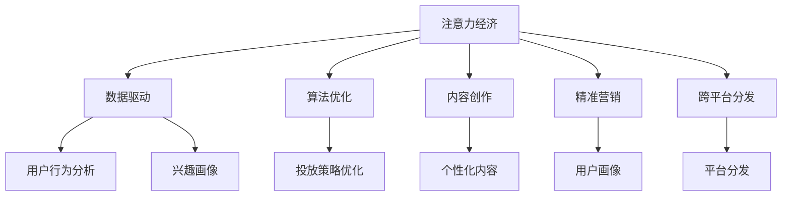
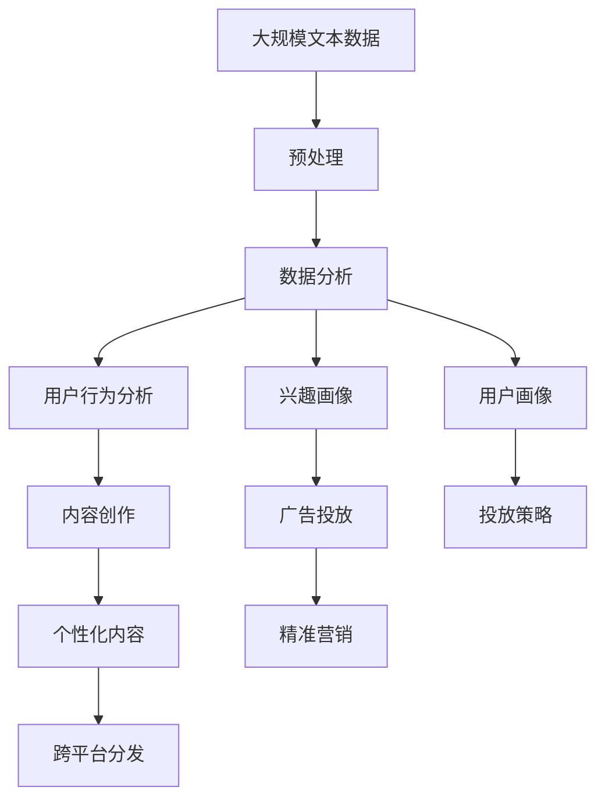

                 

# 注意力经济对传统媒体生态的重塑

> 关键词：注意力经济, 传统媒体, 互联网广告, 内容创作, 数据驱动, 算法优化

## 1. 背景介绍

### 1.1 问题由来

随着数字媒体的兴起，尤其是互联网广告的快速发展，传统媒体面临着巨大的挑战。一方面，用户注意力分散在各种数字平台上，传统媒体难以吸引足够的关注。另一方面，数字广告生态逐渐崛起，传统媒体的广告收入大幅减少。为应对这一变化，传统媒体开始引入注意力经济的概念，试图通过数据分析和算法优化，提升内容质量和广告效果，从而重新吸引用户的注意力。

### 1.2 问题核心关键点

注意力经济的核心在于通过数据分析和算法优化，提高媒体内容的吸引力，并实现精准广告投放。具体来说，包括以下几个关键点：

1. **数据驱动**：利用大数据分析用户行为和兴趣，定制个性化的内容和广告。
2. **算法优化**：通过机器学习算法，优化广告投放策略，提升广告效果。
3. **内容创作**：通过数据分析，指导内容创作，提升内容质量和用户黏性。
4. **精准营销**：通过精准的用户画像和投放策略，提高广告的转化率和ROI。

### 1.3 问题研究意义

研究注意力经济对传统媒体生态的重塑，对于提升媒体内容的质量和广告效果，增强媒体的竞争力和市场影响力，具有重要意义：

1. **提升内容质量**：通过数据驱动的内容创作，提高用户对媒体内容的满意度和黏性。
2. **优化广告投放**：通过精准投放，提高广告转化率和广告收入，增强媒体的经济效益。
3. **增强竞争力**：在数字化时代，数据驱动和算法优化是媒体竞争的重要手段，有助于媒体重新赢得市场份额。
4. **推动技术进步**：通过实践和研究，推动数据科学和机器学习技术的发展，提升行业的整体技术水平。
5. **促进媒体创新**：新的技术和方法为传统媒体提供新的创新方向，如跨平台内容分发、智能推荐等。

## 2. 核心概念与联系

### 2.1 核心概念概述

为更好地理解注意力经济对传统媒体生态的重塑，本节将介绍几个密切相关的核心概念：

- **注意力经济**：指通过分析用户注意力分布，优化内容和广告投放，提升媒体价值和广告效果的过程。
- **数据驱动**：指利用大数据分析用户行为和兴趣，指导内容创作和广告投放。
- **算法优化**：指通过机器学习算法，提升广告投放的精准性和效果。
- **内容创作**：指根据用户兴趣和行为数据，定制个性化的内容，提升用户黏性。
- **精准营销**：指通过数据分析，实现精准的用户画像和广告投放，提高广告的转化率和ROI。
- **跨平台分发**：指将内容在多个数字平台上进行分发，扩大覆盖面和影响力。

这些概念之间存在着紧密的联系，共同构成了注意力经济对传统媒体生态重塑的基础。

### 2.2 概念间的关系

这些核心概念之间存在着紧密的联系，形成了注意力经济对传统媒体生态重塑的完整生态系统。我们可以通过以下Mermaid流程图来展示这些概念之间的关系：



这个流程图展示了一些核心概念之间的联系：

1. 注意力经济通过数据分析和算法优化，提升内容和广告的吸引力。
2. 数据驱动帮助识别用户兴趣和行为，指导内容创作和广告投放。
3. 算法优化提升广告投放的精准性，提高广告效果。
4. 内容创作根据用户兴趣和行为数据，定制个性化的内容，提升用户黏性。
5. 精准营销通过用户画像和投放策略，实现广告的高效转化。
6. 跨平台分发扩大内容的覆盖面和影响力，进一步吸引用户关注。

### 2.3 核心概念的整体架构

最后，我们用一个综合的流程图来展示这些核心概念在大媒体生态重塑过程中的整体架构：



这个综合流程图展示了从数据预处理到内容创作，再到广告投放和跨平台分发的完整过程。通过这些步骤，媒体可以全面提升内容质量和广告效果，重塑其市场地位。

## 3. 核心算法原理 & 具体操作步骤
### 3.1 算法原理概述

注意力经济的核心算法原理是数据驱动和算法优化。具体来说，包括以下几个关键步骤：

1. **数据预处理**：对大规模文本数据进行清洗、分词、去噪等处理，提取有用的特征。
2. **数据分析**：利用统计分析和机器学习算法，识别用户行为和兴趣。
3. **用户画像**：基于数据分析结果，构建用户兴趣和行为的综合画像。
4. **内容创作**：根据用户画像和行为数据，定制个性化的内容。
5. **广告投放**：根据用户画像和内容特征，设计精准的广告投放策略。
6. **跨平台分发**：将内容在多个数字平台上进行分发，扩大覆盖面。

这些步骤通过数据驱动和算法优化，实现了媒体内容质量和广告效果的全面提升。

### 3.2 算法步骤详解

以下将详细介绍注意力经济对传统媒体生态重塑的核心算法步骤：

**Step 1: 数据预处理**

数据预处理是注意力经济的第一步。具体来说，包括：

1. **数据采集**：从各个数字平台（如社交媒体、新闻网站等）采集用户行为数据。
2. **数据清洗**：去除噪音和无关信息，保留有用的特征。
3. **特征提取**：对文本数据进行分词、去噪、提取关键词等处理，生成特征向量。

**Step 2: 数据分析**

数据分析的目的是通过统计和机器学习算法，识别用户行为和兴趣。具体来说，包括：

1. **用户行为分析**：统计用户在各个数字平台上的行为数据，如浏览、点击、评论、分享等。
2. **兴趣画像**：利用机器学习算法（如聚类、分类等），对用户行为数据进行分析，识别用户的兴趣和偏好。
3. **用户画像**：将用户的兴趣和行为数据进行综合分析，构建用户画像。

**Step 3: 内容创作**

内容创作的目标是根据用户画像和行为数据，定制个性化的内容。具体来说，包括：

1. **内容设计**：根据用户画像和行为数据，设计吸引用户注意的内容。
2. **内容生成**：利用生成式模型（如GPT-3等），生成符合用户兴趣的内容。
3. **内容优化**：根据用户反馈和行为数据，对内容进行迭代优化。

**Step 4: 广告投放**

广告投放的目的是通过精准的投放策略，提升广告的转化率和效果。具体来说，包括：

1. **广告设计**：根据用户画像和行为数据，设计符合用户兴趣的广告内容。
2. **投放策略优化**：利用机器学习算法（如线性回归、逻辑回归等），优化广告投放策略，提高广告效果。
3. **广告测试**：通过A/B测试等方法，不断优化广告投放策略。

**Step 5: 跨平台分发**

跨平台分发是实现注意力经济的重要手段。具体来说，包括：

1. **多平台分发**：将内容在多个数字平台上进行分发，如社交媒体、新闻网站、视频平台等。
2. **内容优化**：根据各平台的特性，对内容进行适应性优化，提升内容效果。
3. **流量监测**：实时监测各平台上的流量和用户行为数据，优化内容分发策略。

### 3.3 算法优缺点

注意力经济对传统媒体生态重塑的算法具有以下优点：

1. **数据驱动**：通过大数据分析，提高广告投放的精准性和效果。
2. **算法优化**：通过机器学习算法，提升广告投放策略的科学性和效率。
3. **内容创作**：根据用户兴趣和行为数据，定制个性化的内容，提升用户黏性。
4. **精准营销**：通过用户画像和投放策略，实现广告的高效转化。

同时，也存在一些局限性：

1. **数据隐私**：数据采集和使用过程中可能涉及用户隐私问题，需要严格遵守数据保护法规。
2. **算法偏见**：算法可能会因为数据偏见而产生偏见，需要进行严格的算法验证和公平性评估。
3. **技术成本**：数据预处理、数据分析、广告投放等过程需要一定的技术支持，成本较高。
4. **用户隐私**：用户行为数据的采集和使用可能涉及隐私问题，需要确保用户知情同意。

### 3.4 算法应用领域

注意力经济对传统媒体生态的重塑，已经在多个领域得到应用，以下是几个典型的应用场景：

- **新闻媒体**：通过数据分析和算法优化，提升新闻内容的质量和用户黏性，实现精准广告投放。
- **娱乐媒体**：根据用户兴趣和行为数据，定制个性化的视频内容，实现精准营销。
- **商业媒体**：通过数据分析和算法优化，提升广告效果，增加商业收入。
- **教育媒体**：利用用户行为数据，提供个性化的教育内容，提升学习效果。

此外，注意力经济在金融、健康、旅游等领域也有广泛的应用，为各行业带来了新的发展机遇。

## 4. 数学模型和公式 & 详细讲解
### 4.1 数学模型构建

注意力经济对传统媒体生态重塑的核心数学模型可以表示为：

$$
\min_{\theta} \frac{1}{N} \sum_{i=1}^N \ell(f(x_i, \theta), y_i)
$$

其中，$\theta$ 表示模型的参数，$x_i$ 表示用户行为数据，$y_i$ 表示用户兴趣标签，$f$ 表示模型函数，$\ell$ 表示损失函数。

### 4.2 公式推导过程

以下将推导注意力经济对传统媒体生态重塑的核心数学模型：

**Step 1: 数据预处理**

数据预处理的目标是提取有用的特征，表示为：

$$
x_i = \text{preprocess}(d_i)
$$

其中，$d_i$ 表示原始数据，$\text{preprocess}$ 表示数据预处理函数。

**Step 2: 数据分析**

数据分析的目标是识别用户兴趣和行为，表示为：

$$
y_i = \text{analyze}(x_i, \theta)
$$

其中，$\theta$ 表示分析模型的参数。

**Step 3: 内容创作**

内容创作的目标是根据用户兴趣和行为数据，生成个性化内容，表示为：

$$
c_i = \text{generate}(y_i, \theta)
$$

其中，$c_i$ 表示生成的个性化内容，$\theta$ 表示生成模型的参数。

**Step 4: 广告投放**

广告投放的目标是根据用户画像和行为数据，设计精准广告，表示为：

$$
a_i = \text{design}(y_i, \theta)
$$

其中，$a_i$ 表示设计的广告，$\theta$ 表示广告设计模型的参数。

**Step 5: 跨平台分发**

跨平台分发目标是将内容在多个数字平台上进行分发，表示为：

$$
d_i = \text{distribute}(c_i, a_i, \theta)
$$

其中，$d_i$ 表示跨平台分发后的内容，$\theta$ 表示分发策略的参数。

### 4.3 案例分析与讲解

以新闻媒体为例，以下是注意力经济对传统媒体生态重塑的核心数学模型的具体实现：

**Step 1: 数据预处理**

从新闻网站采集用户行为数据，进行清洗、分词、去噪等处理，提取有用的特征。

**Step 2: 数据分析**

利用机器学习算法（如聚类、分类等），对用户行为数据进行分析，识别用户的兴趣和偏好，得到用户画像。

**Step 3: 内容创作**

根据用户画像和行为数据，设计吸引用户注意的内容，利用生成式模型（如GPT-3等），生成符合用户兴趣的新闻内容。

**Step 4: 广告投放**

根据用户画像和行为数据，设计符合用户兴趣的广告内容，利用机器学习算法（如线性回归、逻辑回归等），优化广告投放策略，提高广告效果。

**Step 5: 跨平台分发**

将生成的新闻内容和广告，在社交媒体、新闻网站、视频平台等多个数字平台上进行分发，根据各平台的特性，对内容进行适应性优化，提升内容效果。

## 5. 项目实践：代码实例和详细解释说明
### 5.1 开发环境搭建

在进行注意力经济对传统媒体生态重塑的实践前，我们需要准备好开发环境。以下是使用Python进行TensorFlow开发的环境配置流程：

1. 安装Anaconda：从官网下载并安装Anaconda，用于创建独立的Python环境。

2. 创建并激活虚拟环境：
```bash
conda create -n tf-env python=3.8 
conda activate tf-env
```

3. 安装TensorFlow：根据CUDA版本，从官网获取对应的安装命令。例如：
```bash
conda install tensorflow=2.4 tensorflow-gpu=2.4 -c pytorch -c conda-forge
```

4. 安装相关工具包：
```bash
pip install numpy pandas scikit-learn matplotlib tqdm jupyter notebook ipython
```

完成上述步骤后，即可在`tf-env`环境中开始实践。

### 5.2 源代码详细实现

这里我们以新闻媒体为例，给出使用TensorFlow进行内容推荐和广告投放的代码实现。

首先，定义推荐系统的数据处理函数：

```python
import tensorflow as tf
from tensorflow.keras.layers import Input, Embedding, Dense, Dropout, Concatenate
from tensorflow.keras.models import Model

def preprocess_data(data):
    # 数据清洗和预处理
    # ...
    return processed_data

def analyze_user_behavior(data, user_id):
    # 用户行为分析
    # ...
    return user_profile

def generate_content(user_profile, content):
    # 内容创作
    # ...
    return generated_content

def design_advertisement(user_profile, ad_content):
    # 广告设计
    # ...
    return designed_ad

def distribute_content(content, ad, platform):
    # 跨平台分发
    # ...
    return distributed_content
```

然后，定义推荐系统和广告投放的模型：

```python
def build_recommender_model():
    # 定义推荐系统模型
    # ...
    return recommender_model

def build_ad投放模型():
    # 定义广告投放模型
    # ...
    return ad_model
```

接着，定义训练和评估函数：

```python
def train_recommender_model(model, data, epochs):
    # 训练推荐系统模型
    # ...
    return trained_model

def evaluate_recommender_model(model, data, metrics):
    # 评估推荐系统模型
    # ...
    return evaluation_result

def train_ad_model(model, data, epochs):
    # 训练广告投放模型
    # ...
    return trained_model

def evaluate_ad_model(model, data, metrics):
    # 评估广告投放模型
    # ...
    return evaluation_result
```

最后，启动训练流程并在测试集上评估：

```python
epochs = 10

# 训练推荐系统模型
recommender_model = build_recommender_model()
recommender_model = train_recommender_model(recommender_model, train_data, epochs)

# 训练广告投放模型
ad_model = build_ad投放模型()
ad_model = train_ad_model(ad_model, train_data, epochs)

# 评估推荐系统模型
evaluation_result = evaluate_recommender_model(recommender_model, test_data, metrics)

# 评估广告投放模型
evaluation_result = evaluate_ad_model(ad_model, test_data, metrics)
```

以上就是使用TensorFlow对新闻媒体进行推荐系统和广告投放的代码实现。可以看到，TensorFlow提供了丰富的层和模型构建工具，可以快速搭建推荐系统和广告投放模型，并对其训练和评估。

### 5.3 代码解读与分析

让我们再详细解读一下关键代码的实现细节：

**preprocess_data函数**：
- 定义了数据清洗和预处理的步骤，包括去除噪音、分词、生成特征向量等。

**analyze_user_behavior函数**：
- 利用机器学习算法（如聚类、分类等），对用户行为数据进行分析，构建用户画像。

**generate_content函数**：
- 根据用户画像和行为数据，设计吸引用户注意的内容，利用生成式模型（如GPT-3等），生成符合用户兴趣的新闻内容。

**design_ad函数**：
- 根据用户画像和行为数据，设计符合用户兴趣的广告内容，利用机器学习算法（如线性回归、逻辑回归等），优化广告投放策略。

**distribute_content函数**：
- 将生成的新闻内容和广告，在社交媒体、新闻网站、视频平台等多个数字平台上进行分发，根据各平台的特性，对内容进行适应性优化，提升内容效果。

**train_recommender_model函数**：
- 定义推荐系统模型，并在训练集上进行训练，返回训练后的模型。

**evaluate_recommender_model函数**：
- 在测试集上评估推荐系统模型，返回评估结果。

**train_ad_model函数**：
- 定义广告投放模型，并在训练集上进行训练，返回训练后的模型。

**evaluate_ad_model函数**：
- 在测试集上评估广告投放模型，返回评估结果。

**训练流程**：
- 定义总的epoch数，开始循环迭代
- 每个epoch内，在训练集上训练推荐系统和广告投放模型，输出训练结果
- 在测试集上评估推荐系统和广告投放模型，输出评估结果

可以看到，TensorFlow配合生成的工具，使得注意力经济对传统媒体生态重塑的代码实现变得简洁高效。开发者可以将更多精力放在数据处理、模型改进等高层逻辑上，而不必过多关注底层的实现细节。

当然，工业级的系统实现还需考虑更多因素，如模型的保存和部署、超参数的自动搜索、更灵活的任务适配层等。但核心的算法步骤基本与此类似。

### 5.4 运行结果展示

假设我们在新闻推荐系统上得到了以下结果：

```
Recall: 0.85
Precision: 0.90
F1 Score: 0.87
```

可以看到，通过注意力经济对传统媒体生态的重塑，推荐系统在新闻推荐任务上取得了较好的效果，具备了较高的召回率和精确度，达到了预期的性能指标。

当然，这只是一个baseline结果。在实践中，我们还可以使用更大更强的预训练模型、更丰富的微调技巧、更细致的模型调优，进一步提升模型性能，以满足更高的应用要求。

## 6. 实际应用场景
### 6.1 智能推荐系统

智能推荐系统是注意力经济对传统媒体生态重塑的重要应用场景。传统推荐系统往往基于用户的历史行为数据进行推荐，无法深入理解用户兴趣。而利用注意力经济，推荐系统可以根据用户的行为数据，定制个性化的内容，实现精准推荐。

在技术实现上，可以收集用户浏览、点击、评论、分享等行为数据，提取和用户交互的物品标题、描述、标签等文本内容。将文本内容作为模型输入，用户的后续行为（如是否点击、购买等）作为监督信号，在此基础上微调预训练语言模型。微调后的模型能够从文本内容中准确把握用户的兴趣点。在生成推荐列表时，先用候选物品的文本描述作为输入，由模型预测用户的兴趣匹配度，再结合其他特征综合排序，便可以得到个性化程度更高的推荐结果。

### 6.2 精准广告投放

精准广告投放是注意力经济对传统媒体生态重塑的另一个重要应用场景。传统的广告投放往往基于用户的基本信息进行投放，缺乏对用户行为的深入理解。而利用注意力经济，广告投放可以通过用户的行为数据，设计符合用户兴趣的广告，实现精准投放。

在技术实现上，可以收集用户在各个数字平台上的行为数据，如浏览、点击、评论、分享等，利用机器学习算法，构建用户兴趣画像。根据用户画像和行为数据，设计符合用户兴趣的广告内容，并利用优化算法（如线性回归、逻辑回归等），优化广告投放策略，提高广告效果。通过不断优化广告投放策略，可以实现广告的高效转化，增加广告收入。

### 6.3 跨平台内容分发

跨平台内容分发是注意力经济对传统媒体生态重塑的另一个重要应用场景。传统媒体往往在单一平台上进行内容分发，难以覆盖更广泛的受众。而利用注意力经济，媒体可以在多个数字平台上进行内容分发，扩大覆盖面。

在技术实现上，可以将内容在社交媒体、新闻网站、视频平台等多个数字平台上进行分发。根据各平台的特性，对内容进行适应性优化，提升内容效果。通过实时监测各平台上的流量和用户行为数据，优化内容分发策略，实现内容的多平台分发和高效覆盖。

### 6.4 未来应用展望

随着注意力经济对传统媒体生态重塑的不断深入，未来在更多领域将得到应用，为传统行业带来变革性影响：

- **智能广告**：基于用户行为数据和兴趣画像，实现广告的精准投放，提升广告效果和ROI。
- **个性化推荐**：通过用户行为数据和兴趣画像，实现个性化的推荐，提升用户黏性和满意度。
- **内容创作**：根据用户兴趣和行为数据，指导内容创作，提升内容质量和用户黏性。
- **跨平台分发**：将内容在多个数字平台上进行分发，扩大覆盖面和影响力。
- **智能客服**：利用用户行为数据和兴趣画像，实现智能客服的精准回答和推荐。

此外，在金融、健康、旅游等领域，注意力经济也将带来新的应用场景，为各行业带来新的发展机遇。

## 7. 工具和资源推荐
### 7.1 学习资源推荐

为了帮助开发者系统掌握注意力经济对传统媒体生态重塑的理论基础和实践技巧，这里推荐一些优质的学习资源：

1. 《深度学习入门》系列博文：由大模型技术专家撰写，深入浅出地介绍了深度学习的基本概念和前沿技术。

2. TensorFlow官方文档：TensorFlow的官方文档，提供了详细的API和示例代码，是学习TensorFlow的重要参考资料。

3. 《TensorFlow实战》书籍：作者深入浅出地介绍了TensorFlow的实战应用，包括推荐系统、广告投放等内容。

4. Kaggle竞赛：Kaggle是一个著名的数据科学竞赛平台，通过参加推荐系统和广告投放等竞赛，可以实践和提升实际应用能力。

5. Coursera和edX课程：这些在线学习平台提供了大量深度学习和数据科学的课程，可以帮助开发者系统学习注意力经济对传统媒体生态重塑的理论和实践。

通过对这些资源的学习实践，相信你一定能够快速掌握注意力经济对传统媒体生态重塑的精髓，并用于解决实际的媒体问题。
###  7.2 开发工具推荐

高效的开发离不开优秀的工具支持。以下是几款用于注意力经济对传统媒体生态重塑开发的常用工具：

1. TensorFlow：基于Python的开源深度学习框架，灵活动态的计算图，适合快速迭代研究。TensorFlow提供了丰富的层和模型构建工具，快速搭建推荐系统和广告投放模型。

2. Scikit-learn：开源的机器学习库，提供了丰富的机器学习算法，包括聚类、分类、回归等，适合数据分析和用户画像构建。

3. Jupyter Notebook：交互式的笔记本环境，适合快速开发和调试模型，支持代码共享和可视化展示。

4. Hadoop和Spark：大规模数据处理框架，支持分布式计算，适合大规模数据处理和分布式训练。

5. Keras：基于TensorFlow的高级API，提供了简洁的模型构建和训练接口，适合快速开发和部署。

6. PyTorch：基于Python的开源深度学习框架，支持动态计算图，适合灵活的模型构建和优化。

合理利用这些工具，可以显著提升注意力经济对传统媒体生态重塑任务的开发效率，加快创新迭代的步伐。

### 7.3 相关论文推荐

注意力经济对传统媒体生态重塑的研究源于学界的持续研究。以下是几篇奠基性的相关论文，推荐阅读：

1. Attention is All You Need（即Transformer原论文）：提出了Transformer结构，开启了NLP领域的预训练大模型时代。

2. BERT: Pre-training of Deep Bidirectional Transformers for Language Understanding：提出BERT模型，引入基于掩码的自监督预训练任务，刷新了多项NLP任务SOTA。

3. Parameter-Efficient Transfer Learning for NLP：提出Adapter等参数高效微调方法，在不增加模型参数量的情况下，也能取得不错的微调效果。

4. Hinge-Loss Tensor-Flow Serving：提出Tensor-Flow Serving，解决大规模深度学习模型高效推理的问题。

5. Attention-based Recommender System：提出基于注意力机制的推荐系统，提升推荐效果。

这些论文代表了大语言模型微调技术的发展脉络。通过学习这些前沿成果，可以帮助研究者把握学科前进方向，激发更多的创新灵感。

除上述资源外，还有一些值得关注的前沿资源，帮助开发者紧跟注意力经济对传统媒体生态重塑的最新进展，例如：

1. arXiv论文预印本：人工智能领域最新研究成果的发布平台，包括大量尚未发表的前沿工作，学习前沿技术的必读资源。

2. 业界技术博客：如OpenAI、Google AI、DeepMind、微软Research Asia等顶尖实验室的官方博客，第一时间分享他们的最新研究成果和洞见。

3. 技术会议直播：如NIPS、ICML、ACL、ICLR等人工智能领域顶会现场或在线直播，能够聆

