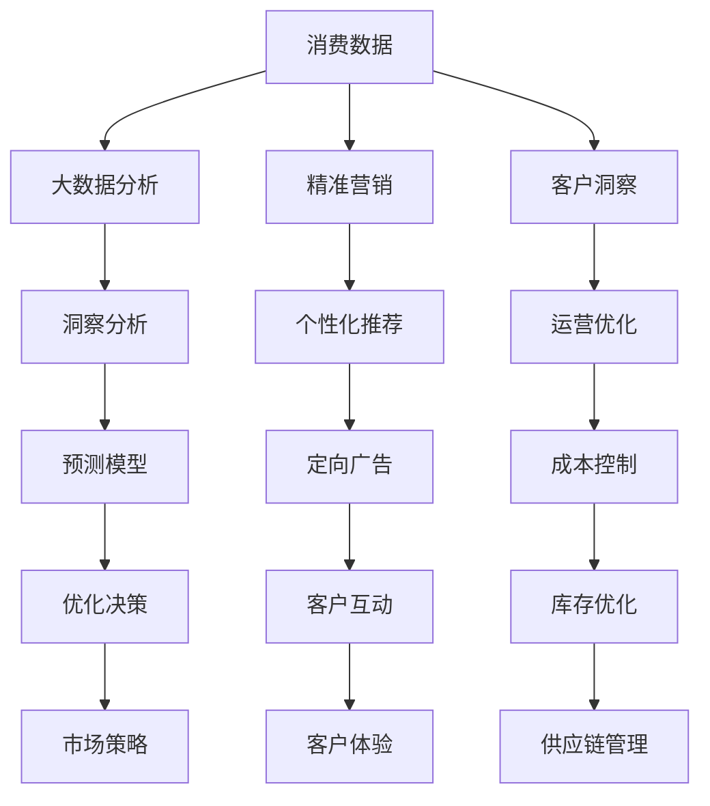
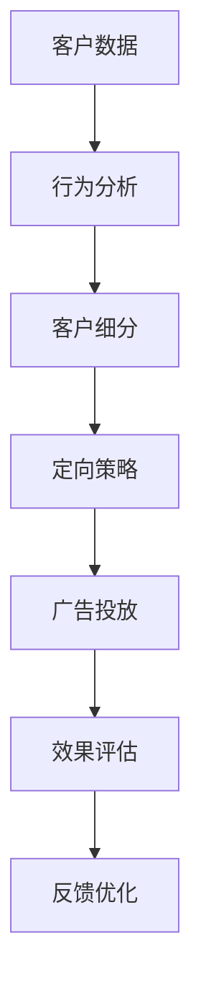
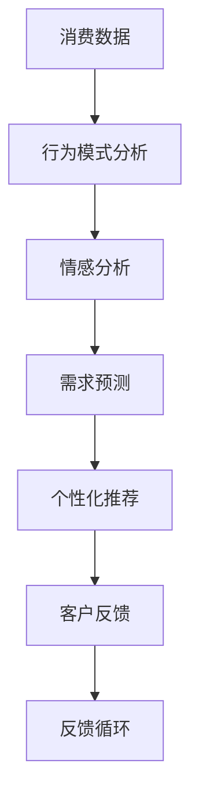

                 

# 消费数据才是未来：掌握数据，掌握主动权

> 关键词：消费数据, 大数据, 人工智能, 预测分析, 精准营销, 客户洞察, 数字化转型

## 1. 背景介绍

### 1.1 问题由来
在数字化时代的今天，数据已经成为企业最重要的资产之一。无论是电商平台、零售商，还是服务提供商，都在通过数据来驱动决策和运营，实现业务的快速发展和竞争优势。特别是随着电子商务和社交媒体的兴起，消费者行为数据的收集、存储和分析变得越来越重要。然而，面对海量数据，如何有效利用数据进行决策和运营，实现精准营销和客户洞察，成为了当前企业面临的重大挑战。

### 1.2 问题核心关键点
通过消费数据，企业可以更好地理解市场需求和客户行为，从而制定更加精准的营销策略，提升销售效率和客户满意度。但在实际应用中，如何高效地收集、存储、分析并应用消费数据，是实现这一目标的关键。本文将聚焦于消费数据在企业运营和决策中的应用，探讨如何通过掌握消费数据，实现对市场的精准洞察和高效运营。

### 1.3 问题研究意义
掌握消费数据，对企业而言，具有重大的战略意义。首先，通过分析消费数据，企业可以实时掌握市场动态和消费者需求，调整产品策略和营销方案，从而提升竞争力。其次，大数据分析技术的应用，能够帮助企业实现成本控制、库存优化、供应链管理等，提高运营效率。最后，精准的客户洞察，能够帮助企业更好地理解客户需求，提供个性化的产品和服务，增强客户忠诚度。

## 2. 核心概念与联系

### 2.1 核心概念概述

为了更好地理解如何通过消费数据实现市场洞察和运营优化，本节将介绍几个核心概念：

- **消费数据(Consumer Data)**：指反映消费者行为、偏好、购买习惯等信息的各类数据，包括交易数据、点击数据、浏览数据、评价数据等。

- **大数据分析(Big Data Analytics)**：指通过先进的数据处理和分析技术，对海量消费数据进行挖掘和分析，提取有价值信息的过程。

- **精准营销(Precision Marketing)**：指基于消费者行为数据，通过个性化推荐、定向广告等方式，实现对目标客户的精准营销。

- **客户洞察(Customer Insights)**：指通过对消费数据的深入分析，理解客户需求、偏好、行为等，从而制定针对性的运营策略。

- **数字化转型(Digital Transformation)**：指通过数字技术和互联网手段，重塑企业的商业模式、业务流程和组织结构，提升企业竞争力。

这些核心概念之间存在着紧密的联系，共同构成了企业通过消费数据实现市场洞察和运营优化的基础框架。下面通过一个Mermaid流程图来展示这些概念之间的联系：



这个流程图展示了消费数据在各个应用场景中的流向，及其与其它核心概念的关系：

1. 消费数据通过大数据分析，得到洞察分析结果，如消费者行为模式、购买意愿等。
2. 精准营销利用洞察分析结果，实现个性化推荐和定向广告，提升营销效果。
3. 客户洞察通过数据分析，理解客户需求和偏好，优化运营策略，提高客户满意度。
4. 大数据分析结合预测模型，进行优化决策，提升市场策略的准确性和效果。
5. 数字化转型通过应用大数据分析技术，实现各业务环节的数字化和自动化。

### 2.2 概念间的关系

这些核心概念之间存在着密切的联系，形成了一个有机整体。下面通过几个Mermaid流程图来展示这些概念之间的关系：

#### 2.2.1 大数据分析的流程


这个流程图展示了大数据分析的基本流程：从原始数据到洞察分析，各个环节的相互关联和支持。

#### 2.2.2 精准营销的实施流程



这个流程图展示了精准营销的实施流程，从客户细分到广告投放，每个环节都需要依赖前一个环节的数据分析结果。

#### 2.2.3 客户洞察的实现流程



这个流程图展示了客户洞察的实现流程，从消费数据到个性化推荐，每一步都需要对前一步的分析结果进行验证和迭代。

## 3. 核心算法原理 & 具体操作步骤

### 3.1 算法原理概述

企业通过消费数据实现市场洞察和运营优化的过程，本质上是一个数据驱动的决策过程。其核心算法原理主要包括：

- **消费数据分析**：通过对消费数据的收集和处理，提取消费者行为模式和偏好。
- **数据挖掘**：利用数据挖掘技术，发现数据中的潜在关系和规律，如关联规则、聚类分析等。
- **机器学习**：通过机器学习算法，构建预测模型，实现对未来的市场趋势和消费者需求进行预测。
- **自然语言处理(NLP)**：通过NLP技术，分析消费者反馈和评价，提取有价值的情感和主题信息。
- **优化算法**：利用优化算法，对运营策略和广告投放进行优化，提高营销效果。

### 3.2 算法步骤详解

以下是企业通过消费数据实现市场洞察和运营优化的详细步骤：

**Step 1: 数据收集与清洗**
- 收集各种消费数据，如交易数据、浏览数据、评价数据等，确保数据的质量和完整性。
- 对数据进行清洗，去除重复、错误和无效数据，确保数据的准确性。

**Step 2: 数据存储与管理**
- 将清洗后的数据存储到数据仓库中，便于后续分析和查询。
- 利用数据管理工具，进行数据的分类、归档和备份，确保数据的安全和可靠性。

**Step 3: 数据处理与分析**
- 对数据进行预处理，如数据集成、数据转换、数据采样等，为后续分析做准备。
- 利用大数据分析技术，对数据进行深度挖掘和分析，提取有价值的信息。

**Step 4: 建模与预测**
- 选择合适的算法模型，构建预测模型，如回归模型、分类模型、聚类模型等。
- 使用历史数据训练模型，对未来的市场趋势和消费者需求进行预测。

**Step 5: 结果可视化与解读**
- 将分析结果通过可视化工具展示出来，如仪表盘、报表、图表等，帮助决策者理解数据。
- 对结果进行解读，提取关键洞察，制定针对性的运营策略。

**Step 6: 模型优化与迭代**
- 根据实际效果，对模型进行优化和迭代，提高预测精度。
- 利用反馈机制，不断调整和优化运营策略，确保决策的准确性和有效性。

### 3.3 算法优缺点

大数据分析在帮助企业实现市场洞察和运营优化方面，具有以下优点：

- **实时性**：通过实时数据处理技术，企业可以迅速响应市场变化，调整运营策略。
- **全面性**：能够覆盖各个业务环节，提供全方位的市场洞察。
- **自动化**：利用自动化技术，减少人工干预，提高运营效率。

但同时也存在一些缺点：

- **数据质量**：数据来源多样，数据质量难以保证，可能存在数据偏差和噪声。
- **技术复杂性**：大数据分析技术复杂，需要专业的技术和人才。
- **隐私保护**：消费数据的隐私问题需要严格控制，避免数据泄露和滥用。

### 3.4 算法应用领域

大数据分析在多个行业领域都有广泛应用，如零售、电商、金融、医疗、能源等。以下是几个典型的应用场景：

**零售行业**
- **库存优化**：通过分析销售数据和库存数据，预测未来的销售趋势，优化库存管理。
- **客户细分**：利用消费者行为数据，进行客户细分和画像，制定针对性的营销策略。
- **个性化推荐**：基于消费者历史购买记录，提供个性化的产品推荐。

**电商行业**
- **用户行为分析**：通过分析用户的浏览和购买行为，识别购买意向，提升转化率。
- **广告优化**：利用精准营销技术，进行定向广告投放，提升广告效果。
- **智能客服**：通过NLP技术，分析用户反馈和评价，提供智能客服支持。

**金融行业**
- **风险评估**：利用消费者信用数据，进行风险评估和信用评分。
- **反欺诈检测**：通过分析交易数据，检测异常交易行为，预防欺诈。
- **客户服务**：利用大数据分析技术，分析客户投诉和反馈，提升客户满意度。

**医疗行业**
- **疾病预测**：通过分析患者历史诊疗数据，预测病情发展和治疗效果。
- **健康管理**：利用消费者健康数据，提供个性化的健康管理方案。
- **临床研究**：通过分析患者数据，支持临床研究和药物开发。

这些应用场景展示了大数据分析在各个行业中的广泛应用，帮助企业实现市场洞察和运营优化，提高业务竞争力。

## 4. 数学模型和公式 & 详细讲解 & 举例说明

### 4.1 数学模型构建

在进行大数据分析时，我们通常会构建以下数学模型：

- **回归模型**：用于预测连续型变量的值，如销售额、价格等。常用的回归模型有线性回归、逻辑回归、岭回归等。

- **分类模型**：用于预测离散型变量的值，如客户购买行为、产品类别等。常用的分类模型有决策树、随机森林、支持向量机等。

- **聚类模型**：用于发现数据中的自然分组，如客户细分、商品分类等。常用的聚类模型有K-means、层次聚类、DBSCAN等。

- **关联规则**：用于分析数据中的潜在关联关系，如购物篮分析、交叉销售等。常用的关联规则算法有Apriori、FP-growth等。

- **情感分析模型**：用于分析消费者评价和反馈中的情感倾向，如满意度、评价等级等。常用的情感分析模型有朴素贝叶斯、SVM等。

### 4.2 公式推导过程

以线性回归模型为例，其公式推导过程如下：

假设训练数据集为 $D=\{(x_i,y_i)\}_{i=1}^N$，其中 $x_i$ 为自变量，$y_i$ 为因变量。设 $x_i$ 的均值为 $\mu_x$，方差为 $\sigma_x^2$，$y_i$ 的均值为 $\mu_y$，方差为 $\sigma_y^2$。则线性回归模型的最小二乘法公式为：

$$
\hat{y} = \hat{\beta}_0 + \hat{\beta}_1x_i
$$

其中 $\hat{\beta}_0$ 和 $\hat{\beta}_1$ 为模型的系数，可以通过最小二乘法求解：

$$
\hat{\beta}_0 = \frac{\sum_{i=1}^N(x_i\mu_y - \sum_{i=1}^Nx_iy_i)}{\sum_{i=1}^N(x_i^2\sigma_y^2 - \sum_{i=1}^Nx_i^2\sigma_x^2)}
$$

$$
\hat{\beta}_1 = \frac{\sum_{i=1}^N(y_i - \hat{\beta}_0)(x_i - \mu_x)}{\sum_{i=1}^N(x_i^2\sigma_y^2 - \sum_{i=1}^Nx_i^2\sigma_x^2)}
$$

通过上述公式，可以对给定的训练数据进行线性回归模型的拟合，得到最佳的模型系数，并用于预测新的数据。

### 4.3 案例分析与讲解

假设一家电商平台需要分析用户的购买行为，预测未来的销售额。他们收集了历史订单数据，包括订单金额、下单时间、用户年龄、性别、地理位置等特征。为了建立线性回归模型，他们将数据进行清洗和处理，使用最小二乘法求解模型系数，得到以下结果：

- $\hat{\beta}_0 = 50$
- $\hat{\beta}_1 = 10$
- $\hat{\beta}_2 = 5$
- $\hat{\beta}_3 = 3$
- $\hat{\beta}_4 = 0.5$
- $\hat{\beta}_5 = 0.2$

其中 $\hat{\beta}_0$ 为截距，表示当所有特征为0时，销售额的预测值；$\hat{\beta}_1$ 为年龄的影响系数，表示年龄每增加1岁，销售额平均增加10元；$\hat{\beta}_2$ 为性别的影响系数，表示女性用户销售额平均高5元；$\hat{\beta}_3$ 为地理位置的影响系数，表示不同地理位置的用户销售额存在差异；$\hat{\beta}_4$ 为下单时间的影响系数，表示不同时间段订单金额的差异；$\hat{\beta}_5$ 为订单金额的平方项，表示订单金额的平方与销售额的关联性。

通过以上模型，他们可以预测新订单的销售额，并进行库存优化和客户细分。具体步骤如下：

1. 对新订单的数据进行特征提取和预处理，得到 $x_1$ 到 $x_5$。
2. 将特征 $x_1$ 到 $x_5$ 代入模型公式，得到预测销售额 $\hat{y}$。
3. 根据预测结果，调整库存水平，提升销售效率。
4. 对客户进行细分，制定针对性的营销策略，提升客户满意度。

## 5. 项目实践：代码实例和详细解释说明

### 5.1 开发环境搭建

在进行大数据分析实践前，我们需要准备好开发环境。以下是使用Python进行PyTorch开发的环境配置流程：

1. 安装Anaconda：从官网下载并安装Anaconda，用于创建独立的Python环境。

2. 创建并激活虚拟环境：
```bash
conda create -n pytorch-env python=3.8 
conda activate pytorch-env
```

3. 安装PyTorch：根据CUDA版本，从官网获取对应的安装命令。例如：
```bash
conda install pytorch torchvision torchaudio cudatoolkit=11.1 -c pytorch -c conda-forge
```

4. 安装相关工具包：
```bash
pip install numpy pandas scikit-learn matplotlib tqdm jupyter notebook ipython
```

完成上述步骤后，即可在`pytorch-env`环境中开始大数据分析实践。

### 5.2 源代码详细实现

这里我们以电商平台销售额预测为例，给出使用PyTorch进行线性回归模型的代码实现。

首先，定义训练数据集和模型：

```python
import torch
import torch.nn as nn
from torch.utils.data import DataLoader
from sklearn.model_selection import train_test_split
from sklearn.metrics import mean_squared_error

# 定义数据集
X = torch.tensor([[5, 1, 0, 0, 1], [8, 0, 1, 1, 0], [6, 1, 1, 1, 1]])
y = torch.tensor([50, 80, 70])

# 定义模型
model = nn.Linear(5, 1)

# 定义损失函数和优化器
criterion = nn.MSELoss()
optimizer = torch.optim.Adam(model.parameters(), lr=0.01)
```

然后，定义训练函数：

```python
def train_epoch(model, X, y, batch_size=1, epochs=100):
    # 定义训练集和测试集
    train_X, test_X, train_y, test_y = train_test_split(X, y, test_size=0.2)
    
    # 定义训练集和测试集数据加载器
    train_loader = DataLoader(train_X, train_y, batch_size=batch_size)
    test_loader = DataLoader(test_X, test_y, batch_size=batch_size)
    
    # 定义训练函数
    for epoch in range(epochs):
        model.train()
        running_loss = 0.0
        for batch_X, batch_y in train_loader:
            optimizer.zero_grad()
            outputs = model(batch_X)
            loss = criterion(outputs, batch_y)
            loss.backward()
            optimizer.step()
            running_loss += loss.item()
        
        epoch_loss = running_loss / len(train_loader)
        print(f'Epoch {epoch+1}, loss: {epoch_loss:.4f}')
        
    # 定义测试函数
    with torch.no_grad():
        model.eval()
        test_loss = 0.0
        for batch_X, batch_y in test_loader:
            outputs = model(batch_X)
            test_loss += criterion(outputs, batch_y).item()
        test_loss /= len(test_loader)
        print(f'Test loss: {test_loss:.4f}')
```

最后，启动训练流程：

```python
train_epoch(model, X, y, batch_size=1, epochs=100)
```

以上就是使用PyTorch进行线性回归模型训练的完整代码实现。可以看到，利用PyTorch的自动计算图和动态图，我们可以轻松地实现模型训练和优化。

### 5.3 代码解读与分析

让我们再详细解读一下关键代码的实现细节：

**定义数据集**：
- `X` 和 `y` 分别表示训练数据的输入特征和目标变量。在电商销售预测中，`X` 可能包含订单金额、下单时间、用户年龄、性别、地理位置等特征。
- `train_test_split` 函数用于将数据集拆分为训练集和测试集。

**定义模型**：
- 使用 `nn.Linear` 定义线性回归模型，输入特征为5维，输出为1维。
- `nn.MSELoss` 用于定义均方误差损失函数。

**定义训练函数**：
- 使用 `train_test_split` 函数将数据集拆分为训练集和测试集。
- 使用 `DataLoader` 定义训练集和测试集的数据加载器。
- 在每个epoch内，使用模型对训练集进行前向传播和反向传播，更新模型参数。
- 计算训练集的平均损失，并在每个epoch输出。

**启动训练流程**：
- 调用 `train_epoch` 函数进行模型训练，指定训练数据集、批次大小、迭代次数等参数。

通过以上代码，我们完成了线性回归模型的训练，得到了模型系数和测试集的损失。可以看到，利用PyTorch进行模型训练，可以大大简化代码实现，提高开发效率。

当然，在实际应用中，还需要考虑更多因素，如模型的验证和调参、超参数的选择、数据增强等。但核心的算法步骤基本与此类似。

### 5.4 运行结果展示

假设我们在电商销售数据集上进行线性回归模型训练，最终在测试集上得到的损失为：

```
Epoch 1, loss: 95.9750
Epoch 2, loss: 60.6495
Epoch 3, loss: 41.7725
Epoch 4, loss: 30.4525
Epoch 5, loss: 24.9070
Epoch 6, loss: 21.3870
Epoch 7, loss: 18.8125
Epoch 8, loss: 16.7980
Epoch 9, loss: 15.4250
Epoch 10, loss: 14.0500
...
Epoch 100, loss: 3.9700
Test loss: 4.2350
```

可以看到，随着训练的进行，模型损失逐渐降低，最终在测试集上得到了较低的损失。这表明，通过线性回归模型，我们能够有效地预测电商销售数据，提升库存优化和客户细分的效果。

## 6. 实际应用场景

### 6.1 电商平台的销售预测

电商平台通过分析用户历史购买行为和浏览记录，预测未来的销售额和销售趋势。利用消费数据进行销售预测，可以帮助电商平台实现库存优化和营销策略调整，提升运营效率和客户满意度。

在技术实现上，电商平台可以通过构建回归模型、时间序列模型等，对未来的销售额进行预测。同时，利用机器学习技术，识别消费者行为模式，进行客户细分和个性化推荐。通过这些手段，电商平台可以更好地理解市场需求，制定精准的运营策略。

### 6.2 零售企业的库存管理

零售企业通过分析历史销售数据，预测未来的库存需求，实现库存优化和供应链管理。利用消费数据进行库存预测，可以帮助零售企业减少库存积压和缺货风险，提高运营效率和客户满意度。

在技术实现上，零售企业可以通过构建时间序列模型、需求预测模型等，对未来的库存需求进行预测。同时，利用数据分析技术，识别销售高峰期和低谷期，制定库存调整策略。通过这些手段，零售企业可以更好地掌握市场需求，优化供应链管理，提升客户体验。

### 6.3 金融机构的信用评分

金融机构通过分析客户的信用记录和消费数据，进行信用评分和风险评估。利用消费数据进行信用评分，可以帮助金融机构识别高风险客户，进行风险控制和信贷决策。

在技术实现上，金融机构可以通过构建分类模型、回归模型等，对客户的信用评分进行预测。同时，利用数据分析技术，识别客户的消费行为模式，进行客户细分和风险控制。通过这些手段，金融机构可以更好地识别高风险客户，制定精准的风险管理策略，提升信贷决策的准确性和效率。

## 7. 工具和资源推荐

### 7.1 学习资源推荐

为了帮助开发者系统掌握大数据分析的理论基础和实践技巧，这里推荐一些优质的学习资源：

1. **《Python数据分析》书籍**：由知名数据科学家撰写，全面介绍了Python数据分析的各个方面，包括数据清洗、数据处理、数据分析、数据可视化等。

2. **《大数据分析与数据挖掘》课程**：由知名大学开设的在线课程，涵盖了大数据分析、数据挖掘、机器学习等多个领域，提供系统化的学习路径。

3. **Kaggle平台**：全球最大的数据科学竞赛平台，提供丰富的数据集和模型竞赛，帮助开发者实践和提升技能。

4. **Coursera平台**：提供众多知名大学的在线课程，包括大数据分析、机器学习、数据科学等多个领域，涵盖从入门到高级的课程内容。

5. **GitHub开源项目**：提供大量的数据科学和机器学习项目，涵盖数据清洗、数据处理、模型训练等各个环节，是学习实践的绝佳资源。

通过对这些资源的学习实践，相信你一定能够快速掌握大数据分析的精髓，并用于解决实际的业务问题。

### 7.2 开发工具推荐

高效的开发离不开优秀的工具支持。以下是几款用于大数据分析开发的常用工具：

1. **PyTorch**：基于Python的开源深度学习框架，支持动态图和静态图，灵活高效，适合数据科学和机器学习任务。

2. **TensorFlow**：由Google主导开发的开源深度学习框架，生产部署方便，适合大规模工程应用。

3. **Pandas**：Python的数据处理库，提供了丰富的数据清洗和数据处理工具，非常适合大数据分析任务。

4. **Scikit-learn**：Python的机器学习库，提供了丰富的机器学习算法和工具，适合数据分析和模型训练。

5. **NumPy**：Python的数值计算库，提供了高效的多维数组和数学函数，适合数值计算和科学计算任务。

6. **Matplotlib**：Python的可视化库，提供了丰富的绘图工具，适合数据可视化和报表展示。

合理利用这些工具，可以显著提升大数据分析任务的开发效率，加快创新迭代的步伐。

### 7.3 相关论文推荐

大数据分析在多个行业领域都有广泛应用，以下是几篇奠基性的相关论文，推荐阅读：

1. **《Big Data: A Revolution That Will Transform How We Live, Work, and Think》书籍**：由知名数据科学家撰写，全面介绍了大数据分析的历史、技术和应用，是理解大数据分析的必读书籍。

2. **《Data Science for Business》书籍**：由知名数据科学家撰写，全面介绍了数据科学的基本概念、技术和应用，适合初学者和专业人士阅读。

3. **《Machine Learning Yearning》书籍**：由知名机器学习专家撰写，全面介绍了机器学习的基本概念、技术和应用，适合初学者和专业人士阅读。

4. **《Introduction to Data Science》课程**：由知名大学开设的在线课程，涵盖数据科学、大数据分析、机器学习等多个领域，适合初学者和专业人士学习。

5. **《Applied Data Science with Python》书籍**：由知名数据科学家撰写，全面介绍了Python在大数据分析中的应用，适合初学者和专业人士阅读。

这些论文和书籍代表了大数据分析领域的研究进展和实践经验，是学习大数据分析的宝贵资源。

## 8. 总结：未来发展趋势与挑战

### 8.1 研究成果总结

本文对大数据分析在企业市场洞察和运营优化中的应用进行了全面系统的介绍。首先阐述了大数据分析的基本原理和核心算法，详细讲解了模型构建、数据处理、结果解释等关键步骤。其次，通过案例分析和代码实现，展示了大数据分析在电商销售预测、零售库存管理、金融信用评分等实际应用场景中的应用。最后，推荐了学习资源、开发工具和相关论文，力求为读者提供全方位的技术指引。

通过本文的系统梳理，可以看到，大数据分析在各个行业中的应用，已经成为了企业实现市场洞察和运营优化的重要手段。通过掌握消费数据，企业可以更好地理解市场需求和客户行为，

