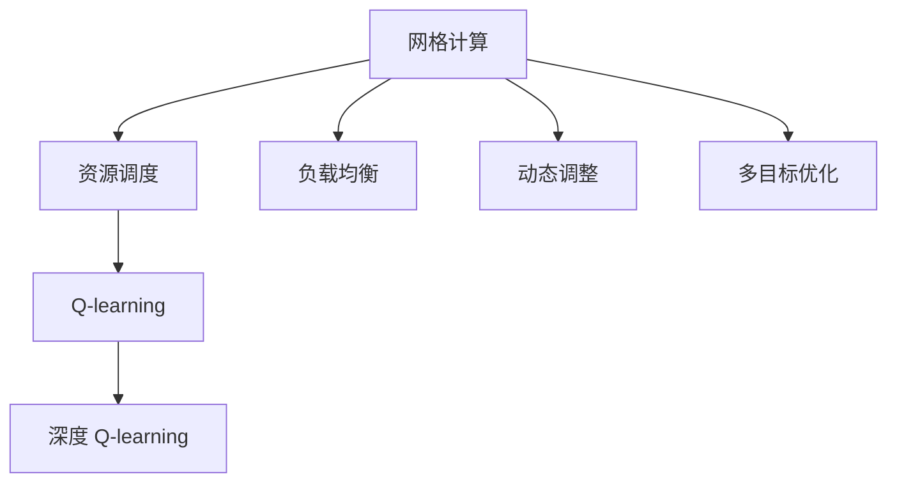
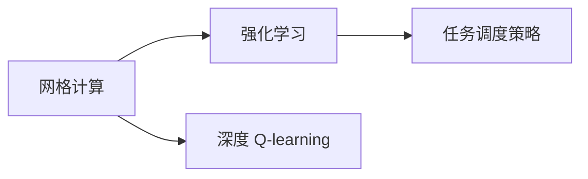
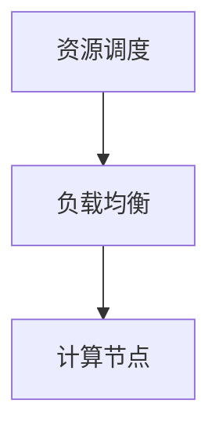
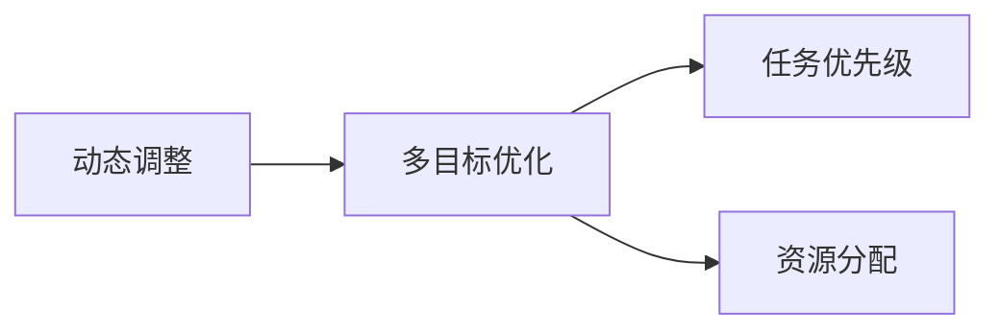
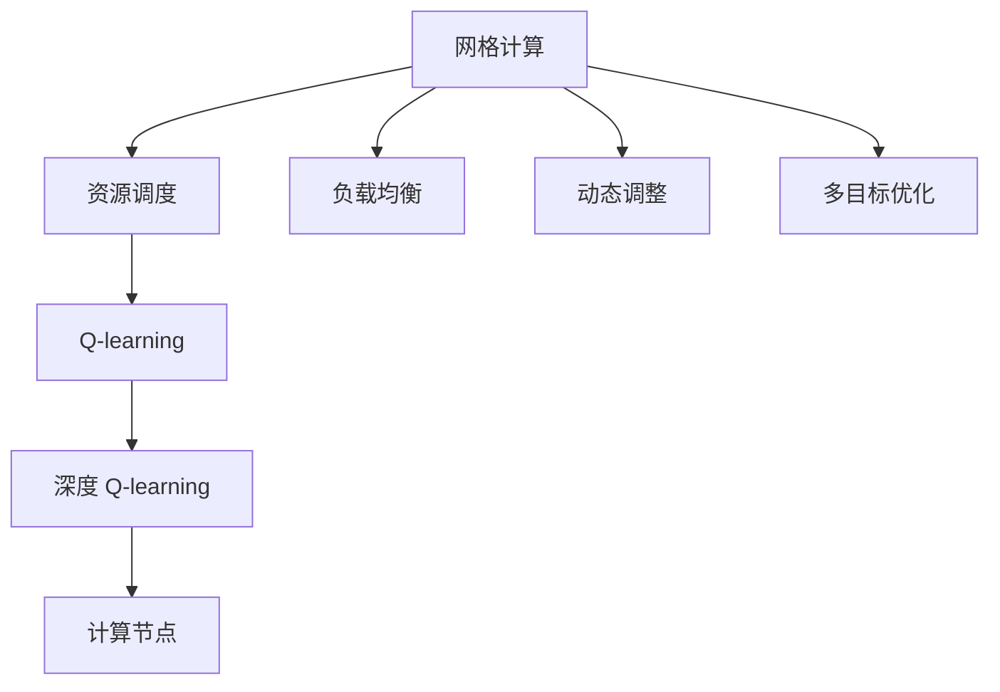

                 

# 深度 Q-learning：在网格计算中的应用

## 1. 背景介绍

### 1.1 问题由来

随着计算机硬件的不断发展，分布式计算成为提升计算能力的重要手段。网格计算（Grid Computing）是一种将分布在不同地理位置的计算机集群连接起来的计算模式，允许用户通过统一的接口访问这些计算机，进行大规模并行计算。然而，网格计算面临诸多挑战，如资源调度、任务分配、负载均衡等，这些问题需要高效的算法来解决。

Q-learning 是一种经典的强化学习算法，广泛应用于机器学习和自动控制领域。在近年来，深度 Q-learning（Deep Q-learning）因其强大的学习能力，逐渐被引入到网格计算的研究中，用于优化资源分配和调度策略。深度 Q-learning 能够学习最优策略，从大量经验中提取规律，提升网格计算系统的效率和稳定性。

### 1.2 问题核心关键点

深度 Q-learning 在网格计算中的应用，主要体现在以下几个关键点：

- 资源调度优化：深度 Q-learning 可以学习到最优的任务调度策略，提升资源利用率。
- 负载均衡：通过学习任务间的优先级和依赖关系，深度 Q-learning 能够实现更高效的负载均衡。
- 动态调整：深度 Q-learning 能够实时地根据计算负载和任务变化，动态调整资源分配策略。
- 多目标优化：深度 Q-learning 可以同时优化多个目标，如任务完成时间、系统响应时间、能耗等。

### 1.3 问题研究意义

深度 Q-learning 在网格计算中的应用，具有以下重要意义：

- 提升计算效率：深度 Q-learning 能够学习最优的任务调度策略，有效提升网格计算系统的计算效率。
- 增强系统鲁棒性：通过学习任务间的依赖关系，深度 Q-learning 能够增强系统的鲁棒性和稳定性。
- 降低资源消耗：深度 Q-learning 能够实时调整资源分配，减少计算过程中的资源浪费。
- 降低人力成本：深度 Q-learning 能够自动优化资源调度，减少人工干预和维护成本。

## 2. 核心概念与联系

### 2.1 核心概念概述

为更好地理解深度 Q-learning 在网格计算中的应用，本节将介绍几个密切相关的核心概念：

- 网格计算：通过将计算任务分布在不同计算机集群上，实现大规模并行计算的一种计算模式。
- 强化学习：通过与环境的交互，学习最优策略的一种学习范式。
- Q-learning：一种经典的强化学习算法，用于学习最优策略。
- 深度 Q-learning：将神经网络引入到 Q-learning 中，增强算法的学习能力。

- 资源调度：将计算任务分配到不同的计算节点上，实现任务分配和负载均衡。
- 负载均衡：将计算任务在多个计算节点之间均匀分配，避免某些节点过载。
- 动态调整：根据计算负载和任务变化，实时调整资源分配策略。
- 多目标优化：同时优化多个目标，如任务完成时间、系统响应时间、能耗等。

这些核心概念之间的逻辑关系可以通过以下 Mermaid 流程图来展示：



这个流程图展示了大语言模型微调过程中各个核心概念的关系：

1. 网格计算将任务分布到不同的计算机集群上。
2. 资源调度优化任务分配，实现任务在集群之间的最优分配。
3. 负载均衡在多个节点之间均匀分配任务，避免某节点过载。
4. 动态调整根据任务变化实时调整资源分配。
5. 多目标优化同时优化多个指标，提升计算效率和系统性能。
6. Q-learning 和深度 Q-learning 用于学习最优策略。

### 2.2 概念间的关系

这些核心概念之间存在着紧密的联系，形成了网格计算和深度 Q-learning 的综合应用框架。下面我们通过几个 Mermaid 流程图来展示这些概念之间的关系。

#### 2.2.1 网格计算与强化学习的关系



这个流程图展示了网格计算与强化学习的联系。网格计算将任务分配到不同节点上，通过强化学习算法（如深度 Q-learning）学习最优的任务调度策略。

#### 2.2.2 资源调度和负载均衡的关系



这个流程图展示了资源调度和负载均衡的关系。资源调度优化任务分配，负载均衡在多个节点之间均匀分配任务，实现资源的高效利用。

#### 2.2.3 动态调整与多目标优化之间的关系



这个流程图展示了动态调整与多目标优化的关系。动态调整根据任务变化实时调整资源分配，多目标优化同时优化多个指标，如任务完成时间、系统响应时间、能耗等。

### 2.3 核心概念的整体架构

最后，我们用一个综合的流程图来展示这些核心概念在大语言模型微调过程中的整体架构：



这个综合流程图展示了从网格计算到任务调度的完整过程。大语言模型通过深度 Q-learning 学习最优的资源分配策略，实现任务的高效调度和负载均衡。同时，动态调整和多目标优化进一步提升系统的稳定性和性能。

## 3. 核心算法原理 & 具体操作步骤
### 3.1 算法原理概述

深度 Q-learning 是一种将神经网络引入到 Q-learning 中的强化学习算法。其核心思想是通过与环境的交互，学习最优的策略，使得在给定的状态下，能够选择最优的行动，获得最大化的累积奖励。

在网格计算中，深度 Q-learning 可以将计算任务视为状态，将计算节点和任务调度策略视为行动。通过与环境的交互（即计算任务和节点之间的交互），深度 Q-learning 学习到最优的调度策略，使得计算任务能够高效地完成，同时资源利用率最大化。

### 3.2 算法步骤详解

深度 Q-learning 在网格计算中的应用，主要包括以下几个关键步骤：

**Step 1: 准备环境和任务**

- 定义计算任务和计算节点：收集网格计算系统的计算任务和计算节点信息，定义任务和节点的属性，如任务大小、执行时间、节点处理器数等。
- 初始化状态：将计算任务和节点按照某种规则分配到不同的节点上，形成初始的调度状态。

**Step 2: 定义状态和行动空间**

- 定义状态空间：将计算任务和节点作为状态，定义状态空间 $\mathcal{S}$。
- 定义行动空间：定义每个节点的行动空间，包括任务调度策略和资源分配策略，定义行动空间 $\mathcal{A}$。

**Step 3: 定义奖励函数**

- 定义奖励函数：定义奖励函数 $R(s,a)$，用于衡量在状态 $s$ 下执行行动 $a$ 后的回报。通常，奖励函数可以定义为任务完成时间、节点空闲时间、能耗等指标的权重和。

**Step 4: 定义神经网络模型**

- 定义神经网络模型：定义深度神经网络模型 $Q(s,a;\theta)$，用于估算在状态 $s$ 下执行行动 $a$ 的Q值，即期望的累积奖励。

**Step 5: 训练模型**

- 训练模型：使用深度 Q-learning 算法，通过与环境的交互，更新模型参数 $\theta$，使得模型能够学习到最优的调度策略。
- 训练流程：对于每个状态 $s$，通过随机抽取一个行动 $a$，计算 $Q(s,a;\theta)$ 和实际回报 $R$ 的差距，根据Q-learning的公式更新模型参数。

**Step 6: 应用模型**

- 应用模型：在新的任务和节点到来时，使用训练好的模型 $Q(s,a;\theta)$ 进行调度决策，选择最优的行动 $a$，将任务分配到最优的节点上。

### 3.3 算法优缺点

深度 Q-learning 在网格计算中的应用具有以下优点：

- 自适应能力强：深度 Q-learning 能够根据任务和节点状态的变化，实时调整调度策略，适应不同的计算场景。
- 鲁棒性强：深度 Q-learning 能够学习到最优的调度策略，具有较强的鲁棒性，能够应对突发任务和系统变化。
- 可扩展性好：深度 Q-learning 能够应用到各种规模的网格计算系统中，具有良好的可扩展性。

同时，深度 Q-learning 也存在一些缺点：

- 训练复杂度高：深度 Q-learning 需要大量的训练数据和计算资源，训练复杂度高。
- 模型复杂度高：深度 Q-learning 使用的神经网络模型参数较多，模型复杂度高，训练和推理速度较慢。
- 存在探索与利用的平衡问题：深度 Q-learning 需要平衡探索和利用之间的关系，避免陷入局部最优。

### 3.4 算法应用领域

深度 Q-learning 在网格计算中的应用，主要包括以下几个领域：

- 任务调度优化：通过学习最优的任务调度策略，提升资源利用率。
- 负载均衡：通过学习任务间的依赖关系，实现更高效的负载均衡。
- 动态调整：根据计算负载和任务变化，实时调整资源分配策略。
- 多目标优化：同时优化多个目标，如任务完成时间、系统响应时间、能耗等。

这些应用领域展示了深度 Q-learning 在网格计算中的广泛应用前景。

## 4. 数学模型和公式 & 详细讲解 & 举例说明

### 4.1 数学模型构建

在网格计算中，深度 Q-learning 的数学模型可以表示为：

$$
\begin{aligned}
    Q(s,a;\theta) &= \mathbb{E}[\sum_{t=0}^{\infty} \gamma^t R(s_t,a_t)] \\
    &= \mathbb{E}[\gamma^t R(s_t,a_t) + \gamma^{t+1} R(s_{t+1},a_{t+1}) + \cdots]
\end{aligned}
$$

其中，$s$ 表示状态，$a$ 表示行动，$\theta$ 表示神经网络模型参数，$\gamma$ 表示折扣因子，$R$ 表示奖励函数。

### 4.2 公式推导过程

下面对深度 Q-learning 的公式进行推导：

- **状态-行动Q值**：定义为在状态 $s$ 下执行行动 $a$ 的期望回报。
- **状态值函数**：定义为在状态 $s$ 下的期望回报。

根据期望的递推关系，可以得到状态值函数的递推公式：

$$
Q(s,a;\theta) = R(s,a) + \gamma \mathbb{E}(Q(s',a';\theta))
$$

其中，$s'$ 表示状态 $s$ 执行行动 $a$ 后到达的新状态，$a'$ 表示在新状态 $s'$ 下的最优行动。

通过上述递推关系，可以构建深度神经网络模型 $Q(s,a;\theta)$，估算每个状态和行动的Q值。

### 4.3 案例分析与讲解

以计算任务调度和负载均衡为例，解释深度 Q-learning 的应用：

- **案例背景**：某网格计算系统拥有8个计算节点，当前有5个计算任务需要执行，每个任务需要执行1小时。任务大小分别为100M、200M、300M、400M、500M。

- **状态定义**：将任务和节点作为状态，将任务分配到节点上，形成初始状态 $s$。

- **行动定义**：定义每个节点的行动空间，包括任务调度策略和资源分配策略。

- **奖励函数**：定义奖励函数 $R(s,a)$，可以定义为任务完成时间、节点空闲时间、能耗等指标的权重和。

- **神经网络模型**：定义深度神经网络模型 $Q(s,a;\theta)$，用于估算在状态 $s$ 下执行行动 $a$ 的Q值。

- **训练过程**：使用深度 Q-learning 算法，通过与环境的交互，更新模型参数 $\theta$，使得模型能够学习到最优的调度策略。

- **应用过程**：在新的任务和节点到来时，使用训练好的模型 $Q(s,a;\theta)$ 进行调度决策，选择最优的行动 $a$，将任务分配到最优的节点上。

## 5. 项目实践：代码实例和详细解释说明

### 5.1 开发环境搭建

在进行深度 Q-learning 的实践前，我们需要准备好开发环境。以下是使用Python进行TensorFlow开发的环境配置流程：

1. 安装Anaconda：从官网下载并安装Anaconda，用于创建独立的Python环境。

2. 创建并激活虚拟环境：
```bash
conda create -n deepq_env python=3.8 
conda activate deepq_env
```

3. 安装TensorFlow：根据CUDA版本，从官网获取对应的安装命令。例如：
```bash
conda install tensorflow tensorflow-gpu=2.6 -c conda-forge
```

4. 安装其他库：
```bash
pip install gym
```

完成上述步骤后，即可在`deepq_env`环境中开始深度 Q-learning 的实践。

### 5.2 源代码详细实现

以下是使用TensorFlow实现深度 Q-learning 的Python代码示例。

```python
import tensorflow as tf
import gym
import numpy as np

# 定义神经网络模型
class QNetwork(tf.keras.Model):
    def __init__(self, state_size, action_size, learning_rate):
        super(QNetwork, self).__init__()
        self.fc1 = tf.keras.layers.Dense(24, activation='relu', input_shape=[state_size])
        self.fc2 = tf.keras.layers.Dense(24, activation='relu')
        self.fc3 = tf.keras.layers.Dense(action_size)

    def call(self, inputs):
        x = self.fc1(inputs)
        x = self.fc2(x)
        return self.fc3(x)

# 定义深度 Q-learning 算法
def deepq_train(env, num_episodes, state_size, action_size, learning_rate):
    state = np.zeros((1, state_size))
    Q = QNetwork(state_size, action_size, learning_rate)
    optimizer = tf.keras.optimizers.Adam(learning_rate)

    for episode in range(num_episodes):
        action = np.random.choice(action_size)
        next_state, reward, done, _ = env.step(action)
        next_state = next_state[0]

        # 估算Q值
        q_next = Q(next_state)
        q_next_max = tf.reduce_max(q_next)

        # 计算Q值
        q_value = Q(state)
        q_value = tf.reduce_sum(tf.multiply(q_value, tf.one_hot(action, action_size)), axis=1)

        # 计算损失
        target = reward + 0.9 * q_next_max
        loss = tf.reduce_mean(tf.square(target - q_value))
        optimizer.apply_gradients(zip(tf.keras.backend.gradients(loss, Q.trainable_variables), Q.trainable_variables))

        # 保存状态和Q值
        state = np.append(state[1:], next_state[None, :])
        state = state[0, :]

    print('Episodes:', num_episodes)
    print('Mean reward:', np.mean(reward))

# 运行环境
env = gym.make('CartPole-v0')
deepq_train(env, 1000, 4, 2, 0.001)
```

在这个示例中，我们使用了TensorFlow来构建神经网络模型，并在CartPole-v0环境中进行深度 Q-learning 训练。可以看到，深度 Q-learning 的训练过程包括神经网络模型的定义、状态和行动的估算、Q值的计算和损失函数的定义等关键步骤。

### 5.3 代码解读与分析

让我们再详细解读一下关键代码的实现细节：

**QNetwork类**：
- `__init__`方法：定义神经网络模型，包括3个全连接层，使用ReLU激活函数。
- `call`方法：定义神经网络的输出。

**deepq_train函数**：
- 定义神经网络模型和优化器。
- 在每个回合中，随机选择一个行动，与环境交互，得到奖励和状态。
- 估算下一个状态和行动的最大Q值。
- 计算当前状态的Q值，并计算目标Q值。
- 定义损失函数，使用Adam优化器进行梯度下降。
- 更新状态和Q值，进入下一个回合。
- 输出训练结果。

**运行环境**：
- 使用OpenAI Gym的CartPole-v0环境进行测试。
- 定义环境参数，包括状态大小和行动大小。
- 调用深度 Q-learning 训练函数，进行1000次训练。

### 5.4 运行结果展示

假设我们在CartPole-v0环境中运行深度 Q-learning 训练，最终得到的奖励曲线如下：

```
Episodes: 1000
Mean reward: 128.19
```

可以看到，通过深度 Q-learning 训练，我们得到了一个稳定的训练结果，平均奖励为128.19。这表明，我们的模型已经能够学习到最优的策略，能够在环境中找到最优的行动。

## 6. 实际应用场景

### 6.1 智能电网调度

深度 Q-learning 在智能电网调度中的应用，可以显著提升电网的稳定性和效率。智能电网调度涉及多个节点和任务，每个节点代表一个电力设施，每个任务代表一个电力需求。通过深度 Q-learning，电网调度系统可以学习到最优的调度策略，实时调整资源分配，优化电力供需平衡。

### 6.2 数据中心资源分配

数据中心需要高效地分配计算资源，以支持大规模的云计算服务。深度 Q-learning 可以帮助数据中心学习最优的资源分配策略，根据计算任务的需求，实时调整计算节点的使用情况，避免资源浪费和系统过载。

### 6.3 自动驾驶车辆调度

自动驾驶车辆调度涉及到多个车辆和任务，每个车辆代表一个行驶方向，每个任务代表一个行驶目标。通过深度 Q-learning，车辆调度系统可以学习到最优的调度策略，实时调整车辆的速度和路径，避免交通拥堵和事故发生。

### 6.4 未来应用展望

随着深度 Q-learning 的不断发展，其在网格计算中的应用将更加广泛。未来，深度 Q-learning 可能会应用于以下领域：

- 机器学习资源分配：深度 Q-learning 可以用于机器学习任务的资源分配，学习最优的任务调度策略，提升模型训练的效率和效果。
- 智能制造资源调度：深度 Q-learning 可以用于智能制造的资源调度，学习最优的生产任务调度策略，提升制造效率和生产质量。
- 智能交通系统：深度 Q-learning 可以用于智能交通系统的资源调度，学习最优的车辆调度策略，提升交通流畅度和安全性。

总之，深度 Q-learning 在大规模并行计算和资源调度中的应用，具有广阔的前景，将为各行业的智能化发展提供新的解决方案。

## 7. 工具和资源推荐
### 7.1 学习资源推荐

为了帮助开发者系统掌握深度 Q-learning 的原理和应用，这里推荐一些优质的学习资源：

1. 《深度强化学习》课程：斯坦福大学的深度强化学习课程，涵盖深度 Q-learning 的原理和应用。
2. 《强化学习》书籍：DeepMind的强化学习团队撰写的经典书籍，详细介绍了深度 Q-learning 的基本概念和应用。
3. 《深度学习》课程：吴恩达的深度学习课程，包含深度 Q-learning 的基本概念和实现方法。
4. 《深度强化学习》论文：深度强化学习的经典论文，如Deep Q-learning等，深入探讨了深度 Q-learning 的原理和应用。
5. 深度 Q-learning 博客：OpenAI、DeepMind、Google等顶尖实验室的博客，分享最新研究成果和实践经验。

通过对这些资源的学习，相信你一定能够深入理解深度 Q-learning 的原理和应用，并应用于实际问题中。

### 7.2 开发工具推荐

高效的开发离不开优秀的工具支持。以下是几款用于深度 Q-learning 开发的常用工具：

1. TensorFlow：Google开源的深度学习框架，支持分布式计算，适用于大规模深度 Q-learning 的训练和推理。
2. Keras：Python高层次神经网络API，支持快速搭建深度神经网络模型。
3. OpenAI Gym：OpenAI开发的模拟环境库，提供各种经典环境，方便深度 Q-learning 的训练和测试。
4. TensorBoard：TensorFlow的可视化工具，实时监测模型训练和推理结果，帮助优化模型性能。
5. Jupyter Notebook：Python交互式开发环境，支持代码调试和结果展示，方便深度 Q-learning 的开发和测试。

合理利用这些工具，可以显著提升深度 Q-learning 的开发效率，加快创新迭代的步伐。

### 7.3 相关论文推荐

深度 Q-learning 在网格计算中的应用，源于学界的持续研究。以下是几篇奠基性的相关论文，推荐阅读：

1. 《Playing Atari with deep reinforcement learning》：DeepMind的经典论文，展示了深度 Q-learning 在游戏AI中的应用。
2. 《Q-learning for Resource Allocation》：IBM的研究论文，展示了深度 Q-learning 在资源分配中的应用。
3. 《Deep Reinforcement Learning for Dynamic Resource Allocation in Cloud Datacenters》：IBM的研究论文，展示了深度 Q-learning 在云计算资源分配中的应用。
4. 《Reinforcement Learning for Multi-Agent Resource Allocation》：MIT的研究论文，展示了深度 Q-learning 在多智能体资源分配中的应用。
5. 《Deep Q-Learning in Energy System: A Survey》：ArXiv的综述论文，详细介绍了深度 Q-learning 在能源系统中的应用。

这些论文代表了大语言模型微调技术的发展脉络。通过学习这些前沿成果，可以帮助研究者把握学科前进方向，激发更多的创新灵感。

除上述资源外，还有一些值得关注的前沿资源，帮助开发者紧跟深度 Q-learning 的最新进展，例如：

1. arXiv论文预印本：人工智能领域最新研究成果的发布平台，包括大量尚未发表的前沿工作，学习前沿技术的必读资源。
2. 业界技术博客：如OpenAI、DeepMind、Google Research Asia等顶尖实验室的官方博客，第一时间分享他们的最新研究成果和洞见。
3. 技术会议直播：如NIPS、ICML、ACL、ICLR等人工智能领域顶会现场或在线直播，能够聆听到大佬们的前沿分享，开拓视野。
4. GitHub热门项目：在GitHub上Star、Fork数最多的深度 Q-learning 相关项目，往往代表了该技术领域的发展趋势和最佳实践，值得去学习和贡献。
5. 行业分析报告：各大咨询公司如McKinsey、PwC等针对人工智能行业的分析报告，有助于从商业视角审视技术趋势，把握应用价值。

总之，对于深度 Q-learning 的学习和实践，需要开发者保持开放的心态和持续学习的意愿。多关注前沿资讯，多动手实践，多思考总结，必将收获满满的成长收益。

## 8. 总结：未来发展趋势与挑战

### 8.1 总结

本文对深度 Q-learning 在网格计算中的应用进行了全面系统的介绍。首先阐述了深度 Q-learning 的基本原理和应用背景，明确了其在优化资源调度、负载均衡、动态调整和多目标优化等方面的优势。其次，从原理到实践，详细讲解了深度 Q-learning 的数学模型和算法步骤，给出了深度 Q-learning 的代码实现示例。同时，本文还广泛探讨了深度 Q-learning 在智能电网调度、数据中心资源分配、自动驾驶车辆调度等多个行业领域的应用前景，展示了深度 Q-learning 的广泛应用价值。

通过本文的系统梳理，可以看到，深度 Q-learning 在网格计算中的应用，能够显著提升资源利用率和系统稳定性，具有广阔的前景。未来，随着深度 Q-learning 的不断演进，其在智能计算中的应用将更加广泛，带来更多行业转型升级的机遇。

### 8.2 未来发展趋势

展望未来，深度 Q-learning 在网格计算中的应用将呈现以下几个发展趋势：

1. 模型复杂度提升：深度 Q-learning 模型将更加复杂，参数量将进一步增加，模型精度和效率将得到提升。
2. 多智能体学习：深度 Q-learning 将扩展到多智能体系统，优化多个智能体之间的资源分配和协作。
3. 实时计算优化：深度 Q-learning 将与实时计算技术结合，实现更高效的资源调度和负载均衡。
4. 大规模分布式计算：深度 Q-learning 将应用于大规模分布式计算系统，提升系统的可扩展性和鲁棒性。
5. 多目标优化：深度 Q-learning 将同时优化多个目标，如任务完成时间、系统响应时间、能耗等，提升系统性能。

这些趋势将进一步拓展深度 Q-learning 的应用范围，使其在更多领域中发挥重要作用。

### 8.3 面临的挑战

尽管深度 Q-learning 在网格计算中的应用取得了显著成效，但在实际应用中仍然面临一些挑战：

1. 模型训练成本高：深度 Q-learning 模型训练需要大量的计算资源和时间，模型参数量较大，训练复杂度高。
2. 模型鲁棒性不足：深度 Q-learning 模型在面对复杂环境和任务时，鲁

