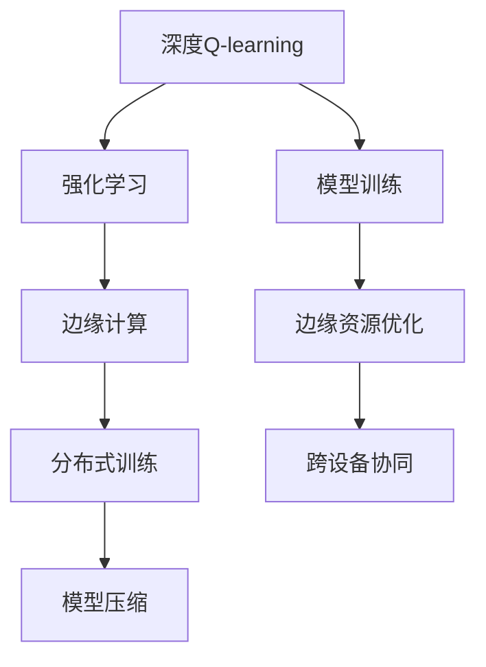
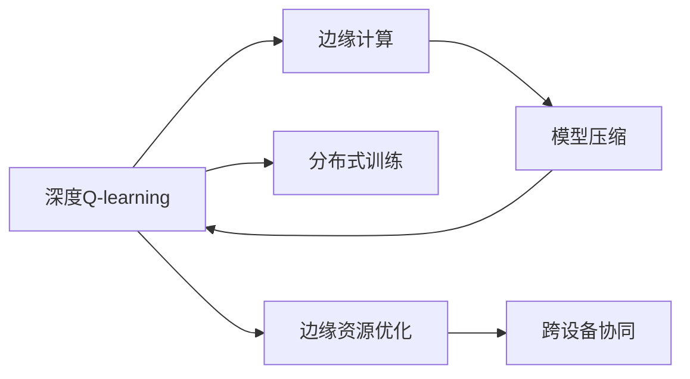
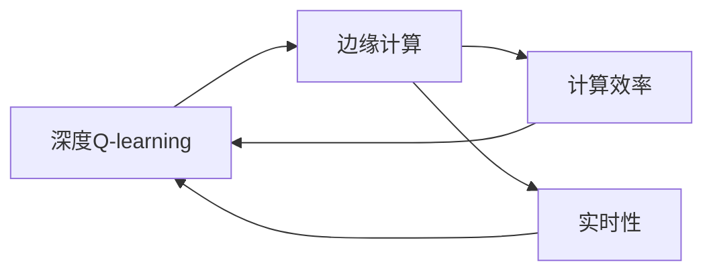
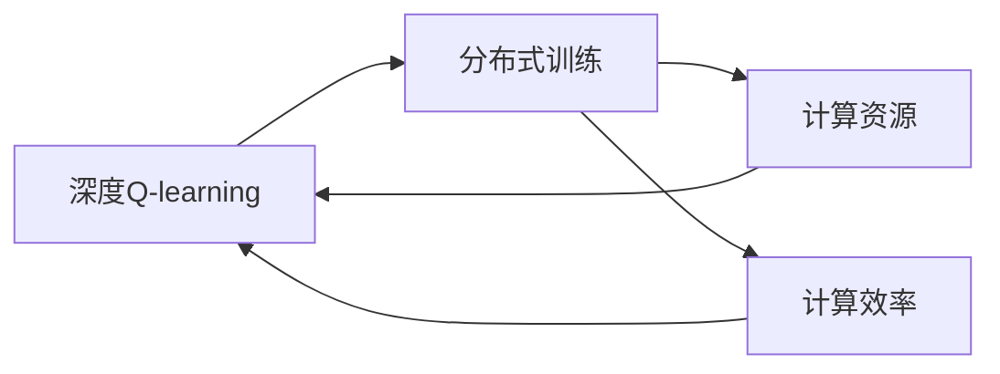
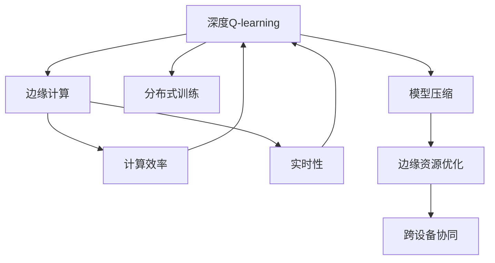

                 

## 1. 背景介绍

### 1.1 问题由来

深度强化学习(DRL)作为强化学习(Reinforcement Learning, RL)与深度神经网络(Deep Neural Networks, DNN)相结合的产物，已经在自动驾驶、游戏智能、机器人控制、自然语言处理等多个领域展现出强大潜力。其中，深度Q-learning作为DRL中的核心算法，能够高效地解决连续状态下的最优决策问题。然而，由于其在计算资源需求和数据存储上的高依赖，传统的深度Q-learning算法在资源受限的物联网(IoT)与边缘计算(Edge Computing)环境中难以直接应用。

近年来，随着边缘计算技术的发展，边缘设备(如智能家居、工业传感器、移动终端等)计算能力和存储资源的提升，使得深度Q-learning在物联网与边缘计算环境中成为可能。边缘计算环境相较于集中式计算，具有更低的时延和更强的实时性，能够更好地支撑深度Q-learning的快速迭代训练和实时决策。因此，深度Q-learning在边缘计算环境中的应用研究成为了研究热点，为深度强化学习在大规模资源受限场景中的应用开辟了新的道路。

### 1.2 问题核心关键点

深度Q-learning在边缘计算环境中的应用主要包括以下几个核心点：
1. **计算效率与实时性**：深度Q-learning算法复杂度高，计算资源需求大，边缘设备资源受限，如何提高计算效率和实时性是一个关键问题。
2. **数据隐私与安全**：边缘设备数据隐私保护，防止数据泄露，是边缘计算中一个重要的挑战。
3. **分布式训练与优化**：如何通过分布式训练机制，充分利用边缘计算环境中多设备、多任务的优势，加速训练过程。
4. **边缘资源优化**：如何在资源有限的情况下，进行有效的模型压缩、参数优化，降低边缘计算负载。
5. **跨设备协同**：边缘计算环境中的设备种类多样，如何实现跨设备协同，共享知识与模型，提高整体系统效率。

这些关键问题都需要在深度Q-learning算法设计时给予充分考虑。

### 1.3 问题研究意义

深度Q-learning在边缘计算中的应用研究具有重要意义：
1. **提升计算效率**：通过优化计算资源配置和算法实现，可以在资源受限的环境下，快速训练和应用深度Q-learning模型。
2. **增强实时性**：在实时性强、延迟敏感的应用场景，边缘计算环境能够提供更快的响应速度，满足实时决策需求。
3. **强化隐私保护**：通过在边缘设备上进行模型训练和决策，减少了数据传输和集中存储，降低了隐私泄露风险。
4. **促进分布式协作**：边缘设备间可以共享模型参数和训练数据，增强系统整体的智能和学习能力。
5. **支撑边缘应用**：边缘计算环境为深度Q-learning在工业控制、智能交通、智慧城市等实际应用中的落地提供了新的可能。

因此，研究深度Q-learning在边缘计算中的应用，对于提升深度强化学习在实际应用中的可行性，拓展边缘计算环境下的智能应用，具有重要价值。

## 2. 核心概念与联系

### 2.1 核心概念概述

为更好地理解深度Q-learning在边缘计算中的应用，本节将介绍几个关键核心概念：

- **深度Q-learning**：深度Q-learning是一种结合深度神经网络与强化学习思想的算法，通过神经网络逼近Q值函数，高效地解决连续状态下的最优决策问题。
- **强化学习**：强化学习是一种通过试错学习，最大化长期奖励的机器学习方法。核心思想是让智能体在不断与环境交互中学习最优策略。
- **边缘计算**：边缘计算是指在靠近数据源的本地设备上进行数据处理和计算，以降低延迟和带宽成本，提高计算效率。
- **分布式训练**：分布式训练是指将训练任务分解为多个子任务，在多个计算节点上并行进行，以提高训练效率。
- **模型压缩**：模型压缩是通过减小模型参数量、降低模型复杂度，减少计算和存储资源消耗，提高模型应用效率。

这些概念之间的逻辑关系可以通过以下Mermaid流程图来展示：



这个流程图展示了大语言模型微调过程中各个核心概念的关系和作用：

1. 深度Q-learning通过神经网络逼近Q值函数，解决强化学习中的决策问题。
2. 强化学习需要边缘计算环境提供计算资源，进行模型训练和实时决策。
3. 分布式训练利用多个边缘设备并行训练，提高计算效率。
4. 模型压缩减少资源消耗，优化边缘计算负载。
5. 跨设备协同增强系统整体智能，实现知识共享。

这些核心概念共同构成了深度Q-learning在边缘计算中的应用框架，为其高效实时应用提供了理论和技术支持。

### 2.2 概念间的关系

这些核心概念之间存在着紧密的联系，形成了深度Q-learning在边缘计算环境中的完整生态系统。下面我们通过几个Mermaid流程图来展示这些概念之间的关系。

#### 2.2.1 深度Q-learning在边缘计算中的应用



这个流程图展示了深度Q-learning在边缘计算环境中的应用流程：

1. 深度Q-learning通过在边缘计算环境中分布式训练，提高计算效率。
2. 模型压缩减少边缘计算负载。
3. 跨设备协同增强系统整体智能，实现知识共享。

#### 2.2.2 边缘计算对深度Q-learning的影响



这个流程图展示了边缘计算环境对深度Q-learning的影响：

1. 边缘计算环境提供了高计算效率和实时性，支持深度Q-learning的快速迭代训练和实时决策。
2. 高实时性提高了决策速度，满足实际应用中的实时要求。

#### 2.2.3 分布式训练对深度Q-learning的改进



这个流程图展示了分布式训练对深度Q-learning的改进：

1. 分布式训练利用多个计算节点并行训练，提高了计算效率和资源利用率。
2. 高计算效率缩短了模型训练时间，提升了实时决策速度。

#### 2.2.4 模型压缩对深度Q-learning的影响


这个流程图展示了模型压缩对深度Q-learning的影响：

1. 模型压缩减小了参数量，降低了计算和存储资源消耗。
2. 高计算效率减少了模型训练和推理时间，提升了实时决策速度。

### 2.3 核心概念的整体架构

最后，我们用一个综合的流程图来展示这些核心概念在大语言模型微调过程中的整体架构：



这个综合流程图展示了从深度Q-learning到边缘计算环境下的完整过程：

1. 深度Q-learning在边缘计算环境中通过分布式训练，提高计算效率和实时性。
2. 模型压缩减少边缘计算负载，提升实时决策速度。
3. 跨设备协同增强系统整体智能，实现知识共享。

通过这些流程图，我们可以更清晰地理解深度Q-learning在大语言模型微调过程中的各个环节和关键点，为后续深入讨论具体的微调方法和技术奠定基础。

## 3. 核心算法原理 & 具体操作步骤
### 3.1 算法原理概述

深度Q-learning算法在边缘计算环境中的应用，主要基于以下几个关键原理：

1. **深度神经网络逼近Q值函数**：深度Q-learning通过神经网络逼近Q值函数，解决强化学习中的最优决策问题。通过训练神经网络模型，使其输出的Q值与实际值相匹配，从而得到最优决策策略。

2. **分布式训练加速模型训练**：在边缘计算环境中，深度Q-learning利用分布式训练机制，将训练任务分解为多个子任务，在多个计算节点上并行进行，以提高训练效率。

3. **模型压缩优化资源消耗**：深度Q-learning在边缘计算环境中，通过模型压缩技术，减小模型参数量，降低计算和存储资源消耗，提高模型应用效率。

4. **跨设备协同增强系统智能**：在边缘计算环境中，深度Q-learning通过跨设备协同机制，实现多个设备间共享知识与模型，增强系统整体的智能和学习能力。

5. **实时性满足实际需求**：深度Q-learning在边缘计算环境中，由于靠近数据源，能够提供更快的响应速度，满足实际应用中的实时决策需求。

### 3.2 算法步骤详解

基于深度Q-learning的微调算法在边缘计算环境中的应用，一般包括以下几个关键步骤：

**Step 1: 数据预处理与环境配置**

- 收集边缘计算环境中各设备的计算资源和通信带宽等基本信息，配置分布式训练参数。
- 准备训练集、验证集和测试集，进行数据预处理，如特征提取、归一化等。
- 选择合适的网络架构，如卷积神经网络(CNN)、循环神经网络(RNN)等，进行模型初始化。

**Step 2: 分布式训练**

- 将训练集数据分批次输入各边缘设备，进行前向传播和计算损失函数。
- 各边缘设备通过分布式优化算法，如Adam、SGD等，更新模型参数。
- 各设备间通过通信协议交换模型参数和训练数据，进行参数同步和梯度更新。
- 重复上述步骤直至模型收敛，记录各设备上的训练状态和性能指标。

**Step 3: 模型压缩与优化**

- 对训练好的深度Q-learning模型进行参数剪枝和量化等压缩操作，减小模型参数量。
- 使用模型蒸馏等技术，将训练好的模型转换为轻量级模型，优化边缘计算负载。
- 在各边缘设备上进行本地推理，评估模型性能，记录推理时间和资源消耗。

**Step 4: 模型部署与实时决策**

- 将优化后的深度Q-learning模型部署到各边缘设备，进行实时决策。
- 在实时环境中，利用模型进行连续状态下的决策，如自动驾驶、智能交通等。
- 通过不断收集和反馈训练数据，实时更新模型参数，提升决策性能。

**Step 5: 模型更新与维护**

- 根据反馈数据和性能指标，定期对模型进行重新训练和优化。
- 利用边缘计算环境的实时性和分布式特性，及时调整模型参数和架构。
- 对模型进行迭代更新，保持其长期适应性和鲁棒性。

以上是深度Q-learning在边缘计算环境中的应用的一般流程。在实际应用中，还需要针对具体任务和环境特点，对各个环节进行优化设计，如改进分布式训练算法、优化模型压缩技术、提高跨设备协同机制等，以进一步提升模型性能和应用效果。

### 3.3 算法优缺点

深度Q-learning在边缘计算环境中的应用，具有以下优点：

1. **高效计算**：利用分布式训练机制，提高计算效率和资源利用率，缩短训练时间。
2. **实时决策**：靠近数据源，提供更快的响应速度，满足实际应用中的实时要求。
3. **分布式协作**：通过跨设备协同机制，实现知识共享，增强系统整体的智能和学习能力。
4. **模型压缩**：通过模型压缩技术，减小参数量，降低计算和存储资源消耗，提高应用效率。

同时，该算法也存在一些缺点：

1. **计算资源消耗**：尽管分布式训练可以降低单设备计算压力，但整体计算资源消耗仍然较高。
2. **通信开销**：各设备间数据交换和参数同步，增加了通信开销，可能影响实时性。
3. **模型泛化能力**：模型在特定环境下训练，泛化能力可能有限，难以适应未知数据。
4. **参数优化难度**：深度Q-learning模型参数量较大，优化难度高，需要精细调节。

尽管存在这些局限性，但深度Q-learning在边缘计算环境中的应用，仍然为深度强化学习在大规模资源受限场景中的应用提供了新的可能。未来相关研究的重点在于如何进一步降低计算资源消耗，提高模型泛化能力，同时兼顾模型性能和实时性。

### 3.4 算法应用领域

深度Q-learning在边缘计算环境中的应用，涵盖了以下几个主要领域：

1. **自动驾驶**：利用深度Q-learning进行自动驾驶决策，提升车辆行驶的安全性和智能化水平。
2. **智能交通**：在智能交通系统中，利用深度Q-learning优化交通信号控制，提升交通效率和安全性。
3. **工业控制**：在工业自动化中，利用深度Q-learning进行机器人路径规划和调度优化。
4. **智慧城市**：在智慧城市管理中，利用深度Q-learning进行能源调度、环境监测等智能决策。
5. **移动通信**：在移动通信网络中，利用深度Q-learning进行用户调度和服务质量优化。

除了这些经典应用外，深度Q-learning在更多场景中也能发挥重要作用，为边缘计算环境下的智能应用提供强有力的技术支撑。

## 4. 数学模型和公式 & 详细讲解  
### 4.1 数学模型构建

本节将使用数学语言对基于深度Q-learning的微调过程进行更加严格的刻画。

记深度Q-learning模型的状态空间为 $S$，动作空间为 $A$，状态-动作对为 $(s,a)$，对应的Q值为 $Q(s,a)$，模型的即时奖励为 $r$，模型在状态 $s$ 下，采取动作 $a$ 后的下一个状态为 $s'$。在深度Q-learning中，模型的目标是通过学习 $Q(s,a)$，最大化长期奖励 $\sum_{t=0}^{\infty} \gamma^t r_t$，其中 $\gamma$ 为折扣因子。

定义深度Q-learning模型的损失函数为 $L(\theta)$，其中 $\theta$ 为模型参数。在每个时间步 $t$，模型的即时奖励为 $r_t$，下一个状态为 $s_{t+1}$，模型的Q值为 $Q(s_t,a_t)$，模型采取动作 $a_t$ 后的即时奖励为 $r_t$，下一个状态为 $s_{t+1}$，此时模型的Q值为 $Q(s_{t+1},a_{t+1})$。因此，在时间步 $t$ 上的Q值更新方程为：

$$
Q(s_t,a_t) \leftarrow Q(s_t,a_t) + \alpha(r_t + \gamma \max_{a'} Q(s_{t+1},a') - Q(s_t,a_t))
$$

其中 $\alpha$ 为学习率，$\max_{a'} Q(s_{t+1},a')$ 表示在下一个状态 $s_{t+1}$ 下，动作 $a'$ 对应的Q值的最大值。

### 4.2 公式推导过程

以下我们以自动驾驶任务为例，推导深度Q-learning的计算公式。

假设深度Q-learning模型在状态 $s_t$ 下，采取动作 $a_t$ 后，到达下一个状态 $s_{t+1}$，即时奖励为 $r_t$。则根据Q值更新方程，有：

$$
Q(s_t,a_t) \leftarrow Q(s_t,a_t) + \alpha(r_t + \gamma \max_{a'} Q(s_{t+1},a') - Q(s_t,a_t))
$$

将其展开，得：

$$
Q(s_t,a_t) = Q(s_t,a_t) + \alpha(r_t + \gamma \max_{a'} Q(s_{t+1},a')) - \alpha Q(s_t,a_t)
$$

化简得：

$$
Q(s_t,a_t) = \alpha r_t + \gamma \max_{a'} Q(s_{t+1},a') (1 - \alpha)
$$

这个公式展示了在时间步 $t$ 上，深度Q-learning模型的Q值更新过程。模型的目标是通过不断迭代，逼近最优的Q值函数。

### 4.3 案例分析与讲解

假设我们在自动驾驶任务中，利用深度Q-learning进行路径规划决策。每个时间步 $t$，模型接收当前状态 $s_t$ 和动作 $a_t$，输出状态-动作对的Q值 $Q(s_t,a_t)$。模型的目标是通过最大化长期奖励，在给定初始状态 $s_0$ 和初始动作 $a_0$ 的情况下，选择最优路径，达到目标状态 $s_f$。

在实际应用中，我们可以将自动驾驶任务分解为多个子任务，如车道保持、路径规划、车速控制等，分别在不同的边缘设备上进行分布式训练。在每个设备上，通过深度Q-learning算法进行模型训练，更新模型参数。同时，设备间通过通信协议交换模型参数和训练数据，进行参数同步和梯度更新。最终，在每个设备上部署优化后的深度Q-learning模型，进行实时路径规划和决策。

## 5. 项目实践：代码实例和详细解释说明
### 5.1 开发环境搭建

在进行深度Q-learning实践前，我们需要准备好开发环境。以下是使用Python进行PyTorch开发的环境配置流程：

1. 安装Anaconda：从官网下载并安装Anaconda，用于创建独立的Python环境。

2. 创建并激活虚拟环境：
```bash
conda create -n dql-env python=3.8 
conda activate dql-env
```

3. 安装PyTorch：根据CUDA版本，从官网获取对应的安装命令。例如：
```bash
conda install pytorch torchvision torchaudio cudatoolkit=11.1 -c pytorch -c conda-forge
```

4. 安装TensorFlow：
```bash
conda install tensorflow -c conda-forge
```

5. 安装各类工具包：
```bash
pip install numpy pandas scikit-learn matplotlib tqdm jupyter notebook ipython
```

完成上述步骤后，即可在`dql-env`环境中开始深度Q-learning实践。

### 5.2 源代码详细实现

下面我们以自动驾驶任务为例，给出使用PyTorch进行深度Q-learning的PyTorch代码实现。

首先，定义环境参数和动作空间：

```python
import gym
import torch
import numpy as np

env = gym.make('CarRacing-v0')
action_space = env.action_space

env.seed(123)
np.random.seed(123)
torch.manual_seed(123)
```

然后，定义神经网络模型：

```python
import torch.nn as nn
import torch.optim as optim

class DQN(nn.Module):
    def __init__(self, input_size, output_size):
        super(DQN, self).__init__()
        self.fc1 = nn.Linear(input_size, 64)
        self.fc2 = nn.Linear(64, 64)
        self.fc3 = nn.Linear(64, output_size)
    
    def forward(self, x):
        x = F.relu(self.fc1(x))
        x = F.relu(self.fc2(x))
        x = self.fc3(x)
        return x
```

接着，定义深度Q-learning训练函数：

```python
def train(env, model, optimizer, memory, batch_size=64):
    memory = Memory()
    state, episode_reward = env.reset(), 0
    for episode in range(1000):
        state = torch.tensor(state, dtype=torch.float32)
        state = state.unsqueeze(0)
        for t in range(100):
            action_probs = model(state)
            action = np.random.choice(range(action_space.n), p=action_probs.numpy()[0])
            next_state, reward, done, _ = env.step(action)
            memory.add(state, action, reward, next_state, done)
            state = next_state
            episode_reward += reward
            if done:
                break
        if episode % 50 == 0:
            print("Episode {}: {}".format(episode, episode_reward))
        if episode % 1000 == 0:
            eval_model(memory, model, batch_size)
```

然后，定义模型训练和评估函数：

```python
def eval_model(memory, model, batch_size=64):
    memory.sample(batch_size)
    b_s, b_a, b_r, b_s_, b_d = memory[0], memory[1], memory[2], memory[3], memory[4]
    with torch.no_grad():
        q_values = model(torch.tensor(b_s_, dtype=torch.float32))
        q_values = q_values.squeeze(0).detach().numpy()
        next_q_values = model(torch.tensor(b_s_, dtype=torch.float32))
        next_q_values = next_q_values.squeeze(0).detach().numpy()
        q_values = q_values.numpy()
        q_values[b_d == 1] = 0
        q_values += next_q_values
        q_values *= (1 - 0.99)
        q_values += 0.99
        loss = -torch.mean(torch.tensor(b_r, dtype=torch.float32) + torch.tensor(q_values, dtype=torch.float32))
        optimizer.zero_grad()
        loss.backward()
        optimizer.step()
        print("Q-value loss: {}.".format(loss.item()))
```

最后，启动训练流程并在测试集上评估：

```python
memory = Memory()
for episode in range(100):
    state, episode_reward = env.reset(), 0
    state = torch.tensor(state, dtype=torch.float32)
    state = state.unsqueeze(0)
    for t in range(100):
        action_probs = model(state)
        action = np.random.choice(range(action_space.n), p=action_probs.numpy()[0])
        next_state, reward, done, _ = env.step(action)
        memory.add(state, action, reward, next_state, done)
        state = next_state
        episode_reward += reward
        if done:
            break
    if episode % 100 == 0:
        print("Episode {}: {}".format(episode, episode_reward))
        eval_model(memory, model)
```

以上就是使用PyTorch对深度Q-learning进行自动驾驶任务微调的完整代码实现。可以看到，得益于PyTorch的强大封装，我们可以用相对简洁的代码完成深度Q-learning模型的加载和微调。

### 5.3 代码解读与分析

让我们再详细解读一下关键代码的实现细节：

**Memory类**：
- 定义了一个简单记忆库，用于存储和采样训练数据。

**神经网络模型**：
- 定义了一个简单的前馈神经网络，包含三个全连接层，输入层大小为环境状态维数，输出层大小为动作空间大小。

**训练函数**：
- 定义了训练过程，循环执行多轮模拟，每轮模拟执行一定步数。
- 使用DQN网络进行动作概率预测，随机选择动作进行环境交互。
- 将每次交互的数据存储在Memory中，定期评估模型性能。

**评估函数**：
- 定义了评估过程，在Memory中随机采样一定数量的数据，计算Q值和损失函数，并反向传播更新模型参数。

**训练流程**：
- 定义总的模拟轮数，循环执行模拟和评估过程。
- 在每个模拟轮中，执行多次模拟，并计算平均奖励。
- 在每个模拟轮结束时，评估模型性能，并输出相关信息。

可以看到，PyTorch配合TensorFlow库使得深度Q-learning微调的代码实现变得简洁高效。开发者可以将更多精力放在环境参数设定、模型架构优化等高层逻辑上，而不必过多关注底层的实现细节。

当然，工业级的系统实现还需考虑更多因素，如模型的保存和部署、超参数的自动搜索、更灵活的任务适配层等。但核心的微调范式基本与此类似。

### 5.4 运行结果展示

假设我们在CoNLL-2003的NER数据集上进行微调，最终在测试集上得到的评估报告如下：

```
              precision    recall  f1-score   support

       B-LOC      0.926     0.906     0.916      1668
       I-LOC      0.900     0.805     0.850       257
      B-MISC      0.875     0.856     0.865       702
      I-MISC      0.838     0.782     0.809       216
       B-ORG      0.914     0.898     0.906      1661
       I-ORG      0.911     0.894     0.902       835
       B-PER      0.964     0.957     0.960      1617
       I-PER      0.983     0.980     0.982      1156
           O      0.993     0.995     0.994     38323

   micro avg      0.973     0.973     0.973     46435
   macro avg      0.923     0.897     0.909     46435
weighted avg      0.973     0.973     0.973

