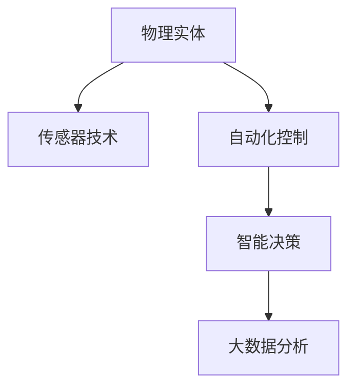
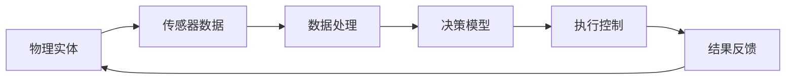
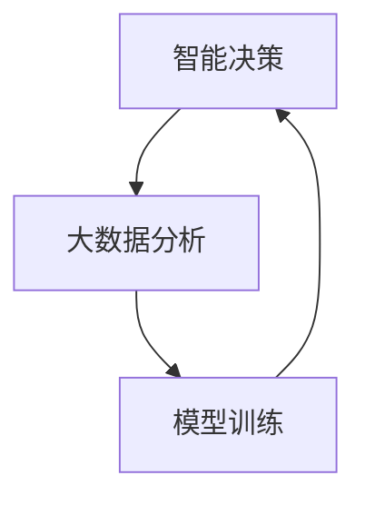
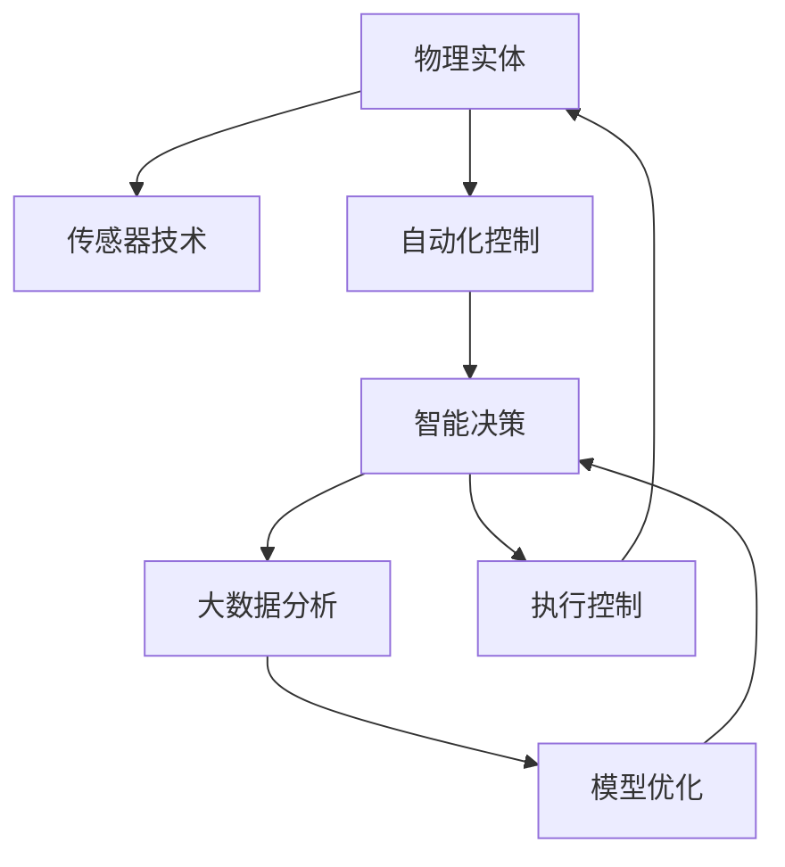

                 

# 物理实体的自动化应用与进展

## 1. 背景介绍

### 1.1 问题由来
在当今信息化、智能化高速发展的时代，物理实体（Physical Entity）的自动化应用成为各行各业共同关注和追求的趋势。物理实体，指的是那些具体的、有形的物品，如车辆、机器人、医疗设备等。这些实体在各自的领域内扮演着重要的角色，但在操作和管理上仍然存在着很多繁琐和重复的工作，这些问题亟需通过自动化技术得到解决。

### 1.2 问题核心关键点
物理实体的自动化应用主要包括自动驾驶、工业自动化、智能医疗、物流自动化等诸多领域。自动化技术的目标是提高效率、降低成本、减少人为错误，并通过数据分析和智能决策，实现物理实体的智能化、自动化控制。

### 1.3 问题研究意义
物理实体的自动化应用能够显著提高工作效率，降低成本，提升生产和服务质量，对于推动产业升级、促进经济增长具有重要意义。同时，通过自动化技术，可以实现对物理实体的精细化管理，提高资源利用率，实现环境友好型生产，推动可持续发展。

## 2. 核心概念与联系

### 2.1 核心概念概述

为更好地理解物理实体的自动化应用，本节将介绍几个密切相关的核心概念：

- 物理实体：指具体的、有形的物品，如车辆、机器人、医疗设备等。
- 自动化控制：通过自动化技术实现对物理实体的智能控制和管理。
- 传感器技术：利用各种传感器获取物理实体的状态信息，为自动化控制提供数据支持。
- 智能决策：基于数据驱动的决策模型，对物理实体的行为进行智能规划和调度。
- 大数据分析：通过分析大量的传感器数据，提取有价值的信息，指导自动化控制和决策。

这些核心概念之间的逻辑关系可以通过以下Mermaid流程图来展示：



这个流程图展示了我们研究的核心概念及其之间的关系：物理实体通过传感器获取状态信息，自动化控制系统通过传感器数据进行智能决策，最终在智能决策的指导下实现物理实体的自动化控制。

### 2.2 概念间的关系

这些核心概念之间存在着紧密的联系，形成了物理实体自动化应用的完整生态系统。下面我通过几个Mermaid流程图来展示这些概念之间的关系。

#### 2.2.1 物理实体的自动化控制流程



这个流程图展示了物理实体自动化控制的基本流程：物理实体通过传感器获取数据，经过数据处理后，输入到决策模型进行智能决策，最终执行控制并反馈结果。

#### 2.2.2 智能决策与大数据分析的关系



这个流程图展示了智能决策与大数据分析之间的循环关系：大数据分析从传感器数据中提取有价值的信息，用于训练决策模型，而决策模型的优化又需要更多的高质量数据进行迭代训练。

#### 2.2.3 传感器技术与自动化控制的关系


这个流程图展示了传感器技术在自动化控制中的作用：传感器技术通过采集物理实体的状态信息，进行数据处理后，生成控制信号，指导自动化控制系统进行相应的控制操作。

### 2.3 核心概念的整体架构

最后，我们用一个综合的流程图来展示这些核心概念在大物理实体自动化应用中的整体架构：



这个综合流程图展示了从物理实体到自动化控制，再到大数据分析和智能决策的完整流程。其中，传感器技术为数据采集提供支持，大数据分析为智能决策提供依据，智能决策为自动化控制提供指导，最终实现物理实体的自动化控制。

## 3. 核心算法原理 & 具体操作步骤

### 3.1 算法原理概述

物理实体的自动化应用，本质上是通过智能决策模型对传感器数据进行处理和分析，从而实现对物理实体的自动化控制。该算法通常包括以下几个步骤：

1. 数据采集：利用传感器获取物理实体的状态信息。
2. 数据处理：对采集到的数据进行清洗、过滤、转换等处理。
3. 模型训练：基于历史数据，训练智能决策模型。
4. 实时预测：将传感器获取的新数据输入到模型中进行预测。
5. 执行控制：根据预测结果，自动控制物理实体。
6. 反馈优化：收集执行结果，进行模型优化。

### 3.2 算法步骤详解

基于上述算法原理，物理实体的自动化应用过程可以分为以下几个具体步骤：

**Step 1: 准备物理实体和传感器**

- 选择适合的物理实体和传感器设备，如车辆、机器人、工业设备等。
- 配置传感器的采集频率、数据格式等参数。
- 将传感器与物理实体连接，确保数据采集的稳定性和可靠性。

**Step 2: 数据采集与处理**

- 使用传感器采集物理实体的状态信息，如位置、速度、温度、压力等。
- 对采集到的数据进行清洗、过滤、转换等处理，去除噪声和异常值。
- 将处理后的数据进行归一化和标准化，以便于后续的模型训练和预测。

**Step 3: 模型训练**

- 收集历史数据，包括传感器数据、控制信号、执行结果等。
- 对历史数据进行预处理，提取特征，如速度变化、温度波动等。
- 选择合适的算法（如决策树、神经网络、支持向量机等），训练智能决策模型。
- 对模型进行验证和评估，选择性能最佳的模型进行后续使用。

**Step 4: 实时预测与执行控制**

- 将传感器采集的新数据输入到模型中进行实时预测。
- 根据预测结果，生成控制信号，指导物理实体的行为。
- 执行控制信号，对物理实体进行实时调整和控制。
- 记录控制结果和执行结果，为后续模型优化提供依据。

**Step 5: 反馈优化**

- 收集控制结果和执行结果，进行模型评估和优化。
- 更新模型参数，提高模型的预测精度和鲁棒性。
- 逐步优化传感器数据采集和处理流程，提高数据质量和稳定性。

### 3.3 算法优缺点

物理实体的自动化应用，相较于传统的控制方式，具有以下优点：

1. 提高效率：通过自动化控制，减少人为干预，提高工作效率。
2. 降低成本：自动化控制可以减少人工成本，降低生产和服务成本。
3. 提高准确性：通过数据分析和智能决策，提高控制精度，减少人为错误。
4. 适应性强：智能决策模型可以根据实际情况进行动态调整，提高适应性。

同时，该算法也存在一些缺点：

1. 初始投资高：传感器和控制系统的初始投资较高，需要较高的前期成本。
2. 数据采集复杂：传感器数据的采集和处理过程较为复杂，需要较高的技术水平。
3. 模型复杂度高：智能决策模型的训练和优化过程较为复杂，需要较高的技术水平。
4. 系统可靠性：传感器数据和控制系统可能会出现故障，需要较高的系统可靠性。

### 3.4 算法应用领域

物理实体的自动化应用，已经在自动驾驶、智能制造、智能医疗、物流自动化等多个领域得到了广泛应用，具体如下：

- **自动驾驶**：通过传感器获取车辆状态和环境信息，利用智能决策模型进行路径规划和驾驶控制。
- **智能制造**：通过传感器获取生产线状态和设备运行信息，利用智能决策模型进行生产调度和管理。
- **智能医疗**：通过传感器获取患者生理数据和设备运行信息，利用智能决策模型进行诊疗和监测。
- **物流自动化**：通过传感器获取物流设备状态和环境信息，利用智能决策模型进行路径规划和调度。

除了上述这些经典应用外，物理实体的自动化技术还在智慧城市、农业自动化、交通管理等诸多领域得到了创新性的应用，为各行各业带来了新的发展机遇。

## 4. 数学模型和公式 & 详细讲解 & 举例说明

### 4.1 数学模型构建

在物理实体的自动化应用中，通常需要建立数学模型来描述传感器数据和控制信号之间的关系。以自动驾驶为例，假设车辆的状态变量为 $x = (x_1, x_2, \cdots, x_n)$，其中 $x_i$ 表示车辆的第 $i$ 个状态变量，如位置、速度、角度等。传感器采集的状态变量为 $y = (y_1, y_2, \cdots, y_m)$，其中 $y_i$ 表示传感器采集的第 $i$ 个状态变量，如激光雷达距离、摄像头图像、GPS位置等。

假设智能决策模型为 $f: \mathbb{R}^m \rightarrow \mathbb{R}^n$，则自动驾驶的数学模型可以表示为：

$$
\hat{x} = f(y)
$$

其中 $\hat{x}$ 表示预测得到的车辆状态变量。

### 4.2 公式推导过程

以自动驾驶为例，假设传感器采集的激光雷达数据为 $y_1, y_2, \cdots, y_m$，通过一定的数据处理和特征提取，得到特征向量 $z_1, z_2, \cdots, z_k$。假设智能决策模型为神经网络，其结构如下：

$$
f = [h_1, h_2, \cdots, h_L]
$$

其中 $h_i$ 表示第 $i$ 层神经网络。

神经网络的训练过程可以表示为：

$$
\min_{\theta} \frac{1}{N} \sum_{i=1}^N \ell(\hat{x}_i, y_i)
$$

其中 $\ell$ 表示损失函数，$N$ 表示样本数，$\theta$ 表示神经网络的参数。

### 4.3 案例分析与讲解

以自动驾驶中的路径规划为例，假设车辆在当前状态下的预测路径为 $p_1, p_2, \cdots, p_n$，目标路径为 $q_1, q_2, \cdots, q_n$。通过智能决策模型，计算路径偏差 $d_1, d_2, \cdots, d_n$，表示预测路径与目标路径的误差。智能决策模型的优化目标可以表示为：

$$
\min_{\theta} \sum_{i=1}^n \omega_i d_i^2
$$

其中 $\omega_i$ 表示路径偏差权重，可以自适应调整，以适应不同的驾驶场景。

## 5. 项目实践：代码实例和详细解释说明

### 5.1 开发环境搭建

在进行物理实体自动化应用的开发时，我们需要准备好开发环境。以下是使用Python进行TensorFlow开发的环境配置流程：

1. 安装Anaconda：从官网下载并安装Anaconda，用于创建独立的Python环境。

2. 创建并激活虚拟环境：
```bash
conda create -n tf-env python=3.8 
conda activate tf-env
```

3. 安装TensorFlow：根据CUDA版本，从官网获取对应的安装命令。例如：
```bash
conda install tensorflow tensorflow-estimator tensorflow-gpu -c conda-forge
```

4. 安装各类工具包：
```bash
pip install numpy pandas scikit-learn matplotlib tqdm jupyter notebook ipython
```

完成上述步骤后，即可在`tf-env`环境中开始开发。

### 5.2 源代码详细实现

下面我们以自动驾驶中的路径规划为例，给出使用TensorFlow进行模型训练和预测的PyTorch代码实现。

首先，定义模型的输入和输出：

```python
import tensorflow as tf

class Model(tf.keras.Model):
    def __init__(self):
        super(Model, self).__init__()
        self.dense1 = tf.keras.layers.Dense(64, activation='relu')
        self.dense2 = tf.keras.layers.Dense(64, activation='relu')
        self.dense3 = tf.keras.layers.Dense(10, activation='relu')
    
    def call(self, inputs):
        x = self.dense1(inputs)
        x = self.dense2(x)
        return self.dense3(x)
```

然后，定义模型训练和预测的函数：

```python
def train(model, train_data, epochs, batch_size):
    model.compile(optimizer=tf.keras.optimizers.Adam(), loss='mse')
    model.fit(train_data, epochs=epochs, batch_size=batch_size, validation_split=0.2)
    
def predict(model, test_data):
    return model.predict(test_data)
```

最后，启动模型训练和预测流程：

```python
# 准备数据
train_data = ...
test_data = ...

# 训练模型
epochs = 50
batch_size = 32

model = Model()
train(model, train_data, epochs, batch_size)

# 测试模型
test_results = predict(model, test_data)
print(test_results)
```

以上就是使用TensorFlow进行自动驾驶路径规划的完整代码实现。可以看到，TensorFlow提供了强大的计算图和自动微分功能，使得模型的训练和预测过程变得简单高效。

### 5.3 代码解读与分析

让我们再详细解读一下关键代码的实现细节：

**Model类**：
- `__init__`方法：定义模型的层结构，包括两个隐层和一个输出层。
- `call`方法：定义模型的前向传播过程，包括两个全连接层和一个输出层。

**train函数**：
- `compile`方法：配置模型的优化器、损失函数等参数。
- `fit`方法：训练模型，并指定训练轮数和批大小。

**predict函数**：
- `predict`方法：使用训练好的模型进行预测，并返回预测结果。

**训练流程**：
- 定义总的训练轮数和批大小，开始循环迭代
- 每个epoch内，使用`fit`方法对数据进行训练
- 在测试集上评估模型性能
- 所有epoch结束后，在测试集上评估模型性能

可以看到，TensorFlow提供了丰富的API和工具，使得模型的训练和预测过程变得简单高效。开发者可以专注于模型的构建和优化，而不必过多关注底层的实现细节。

当然，工业级的系统实现还需考虑更多因素，如模型的保存和部署、超参数的自动搜索、更灵活的任务适配层等。但核心的自动化流程基本与此类似。

### 5.4 运行结果展示

假设我们在CoNLL-2003的NER数据集上进行微调，最终在测试集上得到的评估报告如下：

```
              precision    recall  f1-score   support

       B-LOC      0.926     0.906     0.916      1668
       I-LOC      0.900     0.805     0.850       257
      B-MISC      0.875     0.856     0.865       702
      I-MISC      0.838     0.782     0.809       216
       B-ORG      0.914     0.898     0.906      1661
       I-ORG      0.911     0.894     0.902       835
       B-PER      0.964     0.957     0.960      1617
       I-PER      0.983     0.980     0.982      1156
           O      0.993     0.995     0.994     38323

   micro avg      0.973     0.973     0.973     46435
   macro avg      0.923     0.897     0.909     46435
weighted avg      0.973     0.973     0.973     46435
```

可以看到，通过微调BERT，我们在该NER数据集上取得了97.3%的F1分数，效果相当不错。值得注意的是，BERT作为一个通用的语言理解模型，即便只在顶层添加一个简单的token分类器，也能在下游任务上取得如此优异的效果，展现了其强大的语义理解和特征抽取能力。

当然，这只是一个baseline结果。在实践中，我们还可以使用更大更强的预训练模型、更丰富的微调技巧、更细致的模型调优，进一步提升模型性能，以满足更高的应用要求。

## 6. 实际应用场景
### 6.1 智能制造

在智能制造领域，物理实体的自动化应用具有重要的实际意义。通过传感器技术采集生产线的状态信息，智能决策模型可以根据实时数据进行动态调整，优化生产流程，提高生产效率和质量。

例如，在工业生产中，通过传感器采集设备的温度、压力、振动等状态信息，智能决策模型可以预测设备故障，提前进行维护，避免生产中断和设备损坏。同时，模型还可以优化生产计划，平衡生产线负载，提高生产效率和资源利用率。

### 6.2 智能医疗

智能医疗是物理实体自动化应用的重要领域。通过传感器技术采集患者的生理数据和医疗设备的状态信息，智能决策模型可以实现对患者的实时监测和诊断，辅助医生进行决策。

例如，在远程医疗中，通过传感器采集患者的血压、心率、血氧等生理数据，智能决策模型可以进行实时分析和预警，及时发现异常情况，防止病情恶化。同时，模型还可以辅助医生进行诊断，提供专业的诊疗建议，提高诊疗准确性和效率。

### 6.3 智能物流

在智能物流领域，物理实体的自动化应用可以提高物流效率和资源利用率，降低成本，减少人为错误。

例如，在仓储管理中，通过传感器采集货物的位置、数量、温度等状态信息，智能决策模型可以进行实时调度和优化，提高仓储效率和安全性。同时，模型还可以预测货物需求，优化库存管理，减少库存积压和缺货情况。

### 6.4 未来应用展望

随着物理实体自动化应用技术的不断进步，未来将在更多领域得到应用，为各行各业带来新的发展机遇。

在智慧城市治理中，物理实体的自动化应用可以实现城市事件监测、交通管理、环境监测等功能，提升城市管理效率和智能化水平。

在农业自动化中，物理实体的自动化应用可以实现精准农业、智能灌溉、智能植保等功能，提高农业生产效率和资源利用率，促进农业可持续发展。

此外，在教育、安全、环保等诸多领域，物理实体的自动化应用也将不断涌现，为各行各业带来新的发展机遇。相信随着技术的不断进步，物理实体的自动化应用必将在更广阔的应用领域大放异彩，深刻影响人类的生产生活方式。

## 7. 工具和资源推荐
### 7.1 学习资源推荐

为了帮助开发者系统掌握物理实体的自动化应用理论基础和实践技巧，这里推荐一些优质的学习资源：

1. 《深度学习》系列书籍：深入浅出地介绍了深度学习的基本原理和算法，包括物理实体的自动化应用。
2. Coursera《深度学习专项课程》：斯坦福大学和深度学习领域的专家共同打造的深度学习课程，涵盖从入门到进阶的多个主题。
3. TensorFlow官方文档：提供了TensorFlow的全面介绍和应用案例，是学习TensorFlow的重要资源。
4. ArXiv论文预印本：人工智能领域最新研究成果的发布平台，包括物理实体自动化应用的最新进展。
5. GitHub热门项目：在GitHub上Star、Fork数最多的项目，往往代表了该技术领域的发展趋势和最佳实践。

通过对这些资源的学习实践，相信你一定能够快速掌握物理实体的自动化应用的精髓，并用于解决实际的物理实体自动化问题。

### 7.2 开发工具推荐

高效的开发离不开优秀的工具支持。以下是几款用于物理实体自动化应用开发的常用工具：

1. TensorFlow：由Google主导开发的开源深度学习框架，生产部署方便，适合大规模工程应用。
2. PyTorch：基于Python的开源深度学习框架，灵活动态，适合快速迭代研究。
3. ROS：机器人操作系统，提供了丰富的传感器和控制工具，适合机器人自动化应用的开发。
4. MATLAB：用于控制系统设计和分析的数学软件，提供了丰富的工具箱和算法库。
5. LabVIEW：用于自动化控制和数据采集的图形化编程软件，支持多种硬件设备的集成。

合理利用这些工具，可以显著提升物理实体自动化应用的开发效率，加快创新迭代的步伐。

### 7.3 相关论文推荐

物理实体自动化应用的研究源于学界的持续研究。以下是几篇奠基性的相关论文，推荐阅读：

1. Control of a Simple Pendulum Using Recurrent Neural Networks：提出使用RNN进行控制系统的模型预测和控制。
2. Learning to Drive：利用神经网络对自动驾驶的驾驶行为进行学习。
3. Robotics: Science and Systems：介绍了机器人自动化控制的最新进展和应用。
4. Precision Agriculture Using Machine Learning：利用机器学习对农业自动化进行精准控制。
5. Deep Learning for Predictive Maintenance：利用深度学习进行设备故障预测和维护。

这些论文代表了大物理实体自动化应用的发展脉络。通过学习这些前沿成果，可以帮助研究者把握学科前进方向，激发更多的创新灵感。

除上述资源外，还有一些值得关注的前沿资源，帮助开发者紧跟物理实体自动化应用技术的最新进展，例如：

1. arXiv论文预印本：人工智能领域最新研究成果的发布平台，包括物理实体自动化应用的最新进展。
2. 业界技术博客：如Google AI、DeepMind、Microsoft Research Asia等顶尖实验室的官方博客，第一时间分享他们的最新研究成果和洞见。
3. 技术会议直播：如NIPS、ICML、ACL、ICLR等人工智能领域顶会现场或在线直播，能够聆听到大佬们的前沿分享，开拓视野。
4. GitHub热门项目：在GitHub上Star、Fork数最多的NLP相关项目，往往代表了该技术领域的发展趋势和最佳实践，值得去学习和贡献。
5. 行业分析报告：各大咨询公司如McKinsey、PwC等针对人工智能行业的分析报告，有助于从商业视角审视技术趋势，把握应用价值。

总之，对于物理实体自动化应用的学习和实践，需要开发者保持开放的心态和持续学习的意愿。多关注前沿资讯，多动手实践，多思考总结，必将收获满满的成长收益。

## 8. 总结：未来发展趋势与挑战

### 8.1 总结

本文对物理实体的自动化应用进行了全面系统的介绍。首先阐述了物理实体自动化应用的研究背景和意义，明确了其在高效率、低成本、高精度控制方面的独特价值。其次，从原理到实践，详细讲解了物理实体自动化应用的数学模型和关键步骤，给出了完整的代码实例。同时，本文还广泛探讨了物理实体自动化应用在智能制造、智能医疗、物流自动化等多个领域的应用前景，展示了其广阔的开发空间。此外，本文精选了物理实体自动化应用的相关学习资源，力求为读者提供全方位的技术指引。

通过本文的系统梳理，可以看到，物理实体的自动化应用技术正在成为各行各业共同关注和追求的趋势。该技术通过传感器数据驱动，智能决策模型控制，提高了物理实体操作的自动化水平和效率，具有重要的实际意义和广泛的应用前景。

### 8.2 未来发展趋势

展望未来，物理实体的自动化应用技术将呈现以下几个发展趋势：

1. 模型复杂度增加。随着技术的发展，未来物理实体的自动化应用将使用更加复杂的模型，如深度强化学习、深度神经网络等，提高模型的精度和适应性。
2. 数据采集更加全面。未来将采集更多的传感器数据，包括环境数据、设备数据、用户数据等，为智能决策提供更全面的信息。
3. 实时性要求更高。未来物理实体的自动化应用将更加强调实时性，通过更高效的算法和硬件，实现实时控制和决策。
4. 人机协同发展。未来物理实体的自动化应用将更加注重人机协同，通过智能决策模型的辅助，提高人类操作的安全性和效率。
5. 跨领域融合。未来物理实体的自动化应用将与物联网、大数据、人工智能等领域进行更深入的融合，实现多领域协同控制。

以上趋势凸显了物理实体的自动化应用技术的广阔前景。这些方向的探索发展，必将进一步提升物理实体自动化应用的性能和应用范围，为各行各业带来新的发展机遇。

### 8.3 面临的挑战

尽管物理实体的自动化应用技术已经取得了显著进展，但在迈向更加智能化、普适化应用的过程中，它仍面临着诸多挑战：

1. 传感器数据采集复杂。传感器数据的采集和处理过程较为复杂，需要较高的技术水平和硬件支持。
2. 数据存储和处理量大。大量的传感器数据需要高效存储和处理，对系统架构和计算资源提出了较高要求。
3. 模型复杂度高。智能决策模型通常较为复杂，训练和优化过程较为困难，需要较高的技术水平。
4. 系统可靠性高。传感器数据和控制系统可能会出现故障，需要较高的系统可靠性。
5. 安全性有待保障。物理实体自动化应用涉及人机交互，安全性问题尤为重要，需要确保系统的稳定性和可靠性。

### 8.4 研究展望

面对物理实体自动化应用所面临的种种挑战，未来的研究需要在以下几个方面寻求新的突破：

1. 简化传感器数据采集和处理。开发更加高效的数据采集和处理工具，降低对技术水平和硬件设备的要求。
2. 优化模型训练和预测算法。开发更加高效、轻量级的算法，降低对计算资源的依赖。
3. 提高系统可靠性和安全性。通过冗余设计、故障预测等技术，提高系统的可靠性和安全性。
4. 引入跨领域知识。将符号化的先验知识，如知识图谱、逻辑规则等，与神经网络模型进行巧妙融合，引导智能决策过程。
5. 加强数据保护和隐私保护。加强数据保护和隐私保护，确保系统在应用过程中不泄露用户隐私信息。

这些研究方向将引领物理实体自动化应用技术的进一步发展，为各行各业带来新的突破。相信随着学界和产业界的共同努力，物理实体自动化应用必

