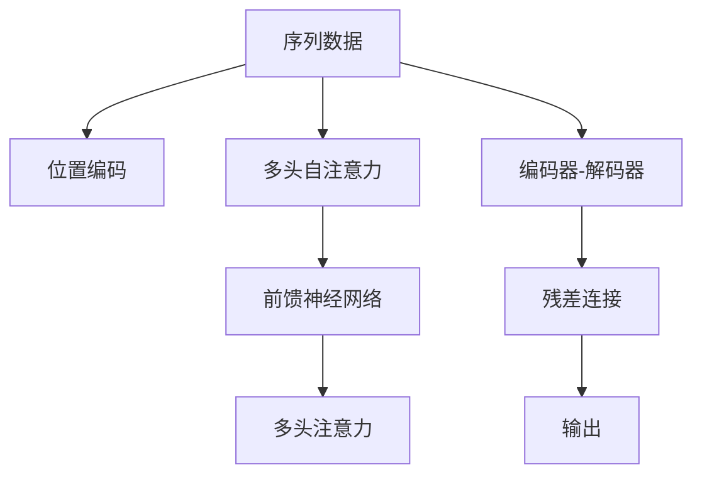
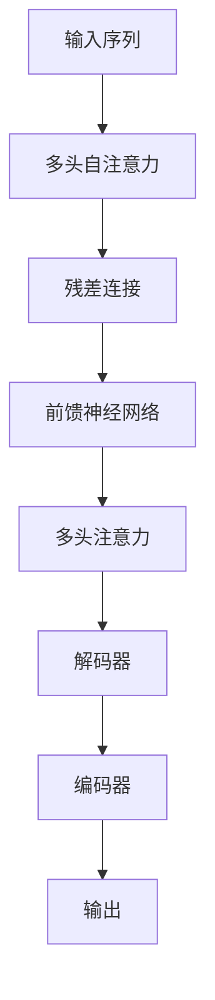

                 

## 1. 背景介绍

### 1.1 问题由来
Transformer模型的提出，标志着深度学习领域的一项重大突破，引领了自然语言处理（NLP）和计算机视觉（CV）等多个领域的发展。该模型最早由Google在2017年论文《Attention is All You Need》中提出，并在多个机器翻译任务上展示了卓越的性能。

Transformer通过采用自注意力机制（Self-Attention），能够有效地处理序列数据的长期依赖关系，大幅提升了模型的性能和泛化能力。与传统的循环神经网络（RNN）和卷积神经网络（CNN）相比，Transformer具有更高效的训练速度和更强的表达能力。

Transformer模型的大获成功，引发了学术界和工业界的广泛关注。如今，基于Transformer的预训练模型，如BERT、GPT、XLNet等，已经成为自然语言处理和计算机视觉领域的主流。Transformer的原理、实现和优化技术也成为了深度学习初学者和专家深入研究的重要内容。

### 1.2 问题核心关键点
Transformer的核心点在于其自注意力机制，以及如何高效地实现该机制，并结合神经网络结构，使得模型能够学习到长序列数据的有效表示。

Transformer的核心设计包括：
- 自注意力机制：通过多头自注意力（Multi-Head Self-Attention），模型能够学习到序列中不同位置的依赖关系，捕捉长程依赖信息。
- 位置编码（Positional Encoding）：由于Transformer没有位置信息，需要通过位置编码来传递时间序列的位置信息，保证序列的语义连贯性。
- 编码器-解码器结构（Encoder-Decoder Architecture）：用于处理编码器和解码器的输入输出，如机器翻译任务中的源语言和目标语言。

这些核心点使得Transformer模型在语言处理、图像识别等任务上表现出色，成为深度学习领域的重要里程碑。

### 1.3 问题研究意义
Transformer模型不仅在学术界引发了广泛关注，也在工业界得到了广泛应用。基于Transformer的预训练模型，已经成为了自然语言处理和计算机视觉领域的主流，推动了人工智能技术的落地应用。

Transformer模型的研究与应用，具有以下重要意义：
1. 提升序列数据的处理能力：通过自注意力机制，Transformer能够高效地处理长序列数据，捕捉数据中的依赖关系，提升模型性能。
2. 促进跨领域应用：Transformer模型在NLP和CV等多个领域表现优异，可以应用于文本生成、图像识别、语音处理等多种任务。
3. 推动深度学习的发展：Transformer的提出，使得深度学习在处理序列数据时更加高效，促进了深度学习技术的发展。
4. 加速技术产业化：基于Transformer的预训练模型，已经广泛应用于NLP、CV等多个领域，推动了深度学习技术的产业化进程。
5. 赋能科学研究：Transformer模型在NLP和CV领域的优异表现，为科学研究提供了新的工具和方法，推动了相关领域的发展。

Transformer模型的成功，也为深度学习领域的研究提供了新的思路和方法，推动了整个领域的进步。

## 2. 核心概念与联系

### 2.1 核心概念概述

为了更好地理解Transformer模型的原理和架构，本节将介绍几个密切相关的核心概念：

- 自注意力机制（Self-Attention）：通过多头自注意力机制，Transformer模型能够学习到序列中不同位置的依赖关系，捕捉长程依赖信息。
- 位置编码（Positional Encoding）：由于Transformer没有位置信息，需要通过位置编码来传递时间序列的位置信息，保证序列的语义连贯性。
- 编码器-解码器结构（Encoder-Decoder Architecture）：用于处理编码器和解码器的输入输出，如机器翻译任务中的源语言和目标语言。
- 多头自注意力（Multi-Head Self-Attention）：将输入投影到多个空间，并行计算多头注意力权重，提升模型的表达能力。
- 残差连接（Residual Connection）：通过残差连接，将输入直接传递给输出，避免梯度消失问题，加速训练过程。
- 前馈神经网络（Feed-Forward Network）：用于增强模型表达能力，包含两个线性变换和一个非线性激活函数。
- 多头注意力（Multi-Head Attention）：将输入投影到多个空间，并行计算多头注意力权重，提升模型的表达能力。

这些核心概念共同构成了Transformer模型的基本架构和计算流程。

### 2.2 概念间的关系

这些核心概念之间的逻辑关系可以通过以下Mermaid流程图来展示：



这个流程图展示了大语言模型Transformer的基本计算流程：
1. 将序列数据输入位置编码，获取时间序列的位置信息。
2. 通过多头自注意力机制，计算输入序列中的依赖关系，捕捉长程依赖信息。
3. 通过残差连接和前馈神经网络，增强模型表达能力，并输出结果。
4. 最后，将编码器和解码器的输出进行连接，得到最终的输出结果。

这个流程图的各个步骤共同构成了Transformer模型的计算过程，使得模型能够有效地处理序列数据，提升模型的表达能力和性能。

### 2.3 核心概念的整体架构

最后，我们用一个综合的流程图来展示这些核心概念在大语言模型Transformer中的整体架构：



这个综合流程图展示了从输入序列到最终输出的完整过程：
1. 输入序列经过多头自注意力机制，计算依赖关系。
2. 通过残差连接和前馈神经网络，增强模型表达能力，并输出结果。
3. 最终结果经过解码器，得到最终的输出结果。

这个流程图清晰地展示了Transformer模型的计算流程，使得理解模型的整体架构和计算过程变得更加直观。

## 3. 核心算法原理 & 具体操作步骤

### 3.1 算法原理概述

Transformer模型通过自注意力机制和残差连接，有效地处理序列数据，提升了模型的表达能力和性能。其核心思想是：将输入序列通过多头自注意力机制进行编码，再通过残差连接和前馈神经网络进行解码，最终输出结果。

Transformer模型的主要设计包括：
1. 自注意力机制：通过多头自注意力机制，捕捉输入序列中不同位置的依赖关系，捕捉长程依赖信息。
2. 残差连接：通过残差连接，将输入直接传递给输出，避免梯度消失问题，加速训练过程。
3. 前馈神经网络：用于增强模型表达能力，包含两个线性变换和一个非线性激活函数。
4. 多头注意力：将输入投影到多个空间，并行计算多头注意力权重，提升模型的表达能力。

Transformer模型的计算流程包括：
1. 将输入序列进行位置编码，获取时间序列的位置信息。
2. 通过多头自注意力机制，计算输入序列中的依赖关系，捕捉长程依赖信息。
3. 通过残差连接和前馈神经网络，增强模型表达能力，并输出结果。
4. 最后，将编码器和解码器的输出进行连接，得到最终的输出结果。

### 3.2 算法步骤详解

Transformer模型的具体实现步骤如下：

**Step 1: 输入准备**
- 将输入序列进行分词和编码，转换为模型可接受的输入。
- 通过位置编码，获取输入序列的时间位置信息。

**Step 2: 多头自注意力计算**
- 将输入序列进行投影，计算多头自注意力权重，捕捉输入序列中的依赖关系。
- 通过多头注意力，将输入投影到多个空间，并行计算多头注意力权重。
- 将多头自注意力的输出进行线性变换，得到编码后的序列。

**Step 3: 残差连接和前馈神经网络**
- 将编码后的序列进行残差连接，将输入直接传递给输出。
- 通过前馈神经网络，增强模型表达能力，并输出结果。

**Step 4: 解码器和输出**
- 将编码器输出和解码器输入进行连接。
- 通过解码器，得到最终的输出结果。

### 3.3 算法优缺点

Transformer模型具有以下优点：
1. 高效处理长序列数据：通过自注意力机制，能够高效处理长序列数据，捕捉数据中的依赖关系，提升模型性能。
2. 可扩展性强：可以通过增加注意力头数和层数，提高模型的表达能力和性能。
3. 训练速度快：由于采用了残差连接和前馈神经网络，加速了模型的训练过程，减少了训练时间。
4. 效果显著：Transformer模型在NLP和CV等多个领域表现优异，被广泛应用于机器翻译、语音识别、图像识别等任务。

Transformer模型也存在以下缺点：
1. 内存消耗大：由于使用了多头自注意力机制，内存消耗较大，需要较大的计算资源。
2. 可解释性不足：Transformer模型的计算过程较为复杂，难以解释其内部工作机制和决策逻辑。
3. 对数据质量要求高：由于使用了位置编码，对输入数据的质量要求较高，需要保证数据的时序一致性和完整性。

### 3.4 算法应用领域

Transformer模型已经在自然语言处理和计算机视觉等多个领域得到广泛应用。具体的应用场景包括：

- 机器翻译：将源语言序列转换为目标语言序列，如Google的TPU加速的翻译系统。
- 图像识别：将输入图像转换为语义向量，如Transformer-CNN在图像分类任务上的应用。
- 语音识别：将输入语音转换为文本，如Transformer在语音识别任务上的应用。
- 文本生成：生成自然语言文本，如GPT-3在文本生成任务上的表现。
- 自然语言推理：判断自然语言文本的逻辑关系，如BERT在自然语言推理任务上的表现。

除了上述这些典型应用，Transformer模型还在情感分析、命名实体识别、问答系统等多个领域得到了应用，推动了人工智能技术的普及和发展。

## 4. 数学模型和公式 & 详细讲解  
### 4.1 数学模型构建

Transformer模型采用了自注意力机制和残差连接，其数学模型构建如下：

设输入序列为 $x=(x_1,x_2,...,x_n)$，其中 $x_i$ 表示第 $i$ 个输入元素，其维度为 $d_x$。通过位置编码，得到编码后的输入序列 $\tilde{x}=(\tilde{x}_1,\tilde{x}_2,...,\tilde{x}_n)$。

设自注意力权重矩阵为 $Q=Q^T \in \mathbb{R}^{n\times d_k}$，键值矩阵为 $K=K^T \in \mathbb{R}^{n\times d_k}$，值矩阵为 $V=V^T \in \mathbb{R}^{n\times d_v}$，其中 $d_k=d_v=d_x/d_h$，$d_h$ 为注意力头数。

通过自注意力机制，计算多头自注意力权重 $\alpha=(\alpha_1,\alpha_2,...,\alpha_n) \in \mathbb{R}^{n\times n}$，其中 $\alpha_{ij}=\frac{e^{Q_iK_j}}{\sum_{k=1}^n e^{Q_iK_k}}$，$e$ 为自然指数。

通过多头注意力，将输入投影到多个空间，得到多头自注意力权重矩阵 $A=(A_1,A_2,...,A_h) \in \mathbb{R}^{n\times n\times h}$，其中 $A_h=\alpha_iA_j$。

通过线性变换和残差连接，得到编码后的序列 $x'=(\tilde{x}_1',\tilde{x}_2',...,\tilde{x}_n')$，其中 $\tilde{x}_i'=\tilde{x}_i+A_i\tilde{x}_i$。

最后，通过前馈神经网络，得到解码后的序列 $x''=(\tilde{x}_1'',\tilde{x}_2'',...,\tilde{x}_n'')$，其中 $\tilde{x}_i''=\tilde{x}_i'+F(\tilde{x}_i')$。

**公式推导过程**：

$$
\begin{aligned}
\alpha_{ij} &= \frac{e^{Q_iK_j}}{\sum_{k=1}^n e^{Q_iK_k}} \\
A_h &= \alpha_iA_j \\
x'_i &= \tilde{x}_i+A_i\tilde{x}_i \\
\tilde{x}_i'' &= \tilde{x}_i'+F(\tilde{x}_i')
\end{aligned}
$$

其中 $Q_i$ 和 $K_j$ 为输入序列的投影矩阵，$A_i$ 为注意力权重矩阵，$F$ 为前馈神经网络，$x_i'$ 为残差连接后的编码序列，$x_i''$ 为解码后的序列。

### 4.2 公式推导过程

**步骤1: 自注意力权重计算**
- 计算自注意力权重 $\alpha_{ij}$，通过 $Q_iK_j$ 计算注意力得分，并使用softmax函数归一化。
- 通过 $A_i$ 计算多头自注意力权重矩阵 $A_h$。

**步骤2: 编码器计算**
- 通过残差连接和前馈神经网络，得到编码后的序列 $x'_i$。
- 通过线性变换，得到解码后的序列 $x''_i$。

**步骤3: 解码器计算**
- 将编码器输出和解码器输入进行连接，得到最终的输出结果。

### 4.3 案例分析与讲解

以机器翻译任务为例，假设输入序列为 $x=(x_1,x_2,...,x_n)$，输出序列为 $y=(y_1,y_2,...,y_n)$。将输入序列 $x$ 和输出序列 $y$ 分别输入编码器和解码器，得到最终翻译结果。

Transformer模型通过自注意力机制，捕捉输入序列中的依赖关系，捕捉长程依赖信息。通过残差连接和前馈神经网络，增强模型表达能力，并输出结果。

在机器翻译任务中，Transformer模型通过自注意力机制，捕捉源语言和目标语言之间的依赖关系，捕捉长程依赖信息，提升翻译质量。通过残差连接和前馈神经网络，增强模型表达能力，并输出翻译结果。

## 5. 项目实践：代码实例和详细解释说明
### 5.1 开发环境搭建

在进行Transformer模型实践前，我们需要准备好开发环境。以下是使用Python进行PyTorch开发的环境配置流程：

1. 安装Anaconda：从官网下载并安装Anaconda，用于创建独立的Python环境。

2. 创建并激活虚拟环境：
```bash
conda create -n pytorch-env python=3.8 
conda activate pytorch-env
```

3. 安装PyTorch：根据CUDA版本，从官网获取对应的安装命令。例如：
```bash
conda install pytorch torchvision torchaudio cudatoolkit=11.1 -c pytorch -c conda-forge
```

4. 安装TensorBoard：用于实时监测模型训练状态，并提供丰富的图表呈现方式，是调试模型的得力助手。

5. 安装Weights & Biases：模型训练的实验跟踪工具，可以记录和可视化模型训练过程中的各项指标，方便对比和调优。

6. 安装TensorFlow：如果需要进行TensorFlow的模型部署和推理，需要安装TensorFlow。

### 5.2 源代码详细实现

下面以机器翻译任务为例，给出使用Transformers库对Transformer模型进行微调的PyTorch代码实现。

首先，定义数据预处理函数：

```python
from transformers import BertTokenizer
from torch.utils.data import Dataset
import torch

class TranslationDataset(Dataset):
    def __init__(self, texts, tags, tokenizer):
        self.texts = texts
        self.tags = tags
        self.tokenizer = tokenizer
        
    def __len__(self):
        return len(self.texts)
    
    def __getitem__(self, item):
        text = self.texts[item]
        tags = self.tags[item]
        
        encoding = self.tokenizer(text, return_tensors='pt', padding='max_length', truncation=True)
        input_ids = encoding['input_ids'][0]
        attention_mask = encoding['attention_mask'][0]
        
        # 对token-wise的标签进行编码
        encoded_tags = [tag2id[tag] for tag in tags] 
        encoded_tags.extend([tag2id['O']] * (self.max_len - len(encoded_tags)))
        labels = torch.tensor(encoded_tags, dtype=torch.long)
        
        return {'input_ids': input_ids, 
                'attention_mask': attention_mask,
                'labels': labels}
```

然后，定义模型和优化器：

```python
from transformers import BertForTokenClassification, AdamW

model = BertForTokenClassification.from_pretrained('bert-base-cased', num_labels=len(tag2id))

optimizer = AdamW(model.parameters(), lr=2e-5)
```

接着，定义训练和评估函数：

```python
from torch.utils.data import DataLoader
from tqdm import tqdm
from sklearn.metrics import classification_report

device = torch.device('cuda') if torch.cuda.is_available() else torch.device('cpu')
model.to(device)

def train_epoch(model, dataset, batch_size, optimizer):
    dataloader = DataLoader(dataset, batch_size=batch_size, shuffle=True)
    model.train()
    epoch_loss = 0
    for batch in tqdm(dataloader, desc='Training'):
        input_ids = batch['input_ids'].to(device)
        attention_mask = batch['attention_mask'].to(device)
        labels = batch['labels'].to(device)
        model.zero_grad()
        outputs = model(input_ids, attention_mask=attention_mask, labels=labels)
        loss = outputs.loss
        epoch_loss += loss.item()
        loss.backward()
        optimizer.step()
    return epoch_loss / len(dataloader)

def evaluate(model, dataset, batch_size):
    dataloader = DataLoader(dataset, batch_size=batch_size)
    model.eval()
    preds, labels = [], []
    with torch.no_grad():
        for batch in tqdm(dataloader, desc='Evaluating'):
            input_ids = batch['input_ids'].to(device)
            attention_mask = batch['attention_mask'].to(device)
            batch_labels = batch['labels']
            outputs = model(input_ids, attention_mask=attention_mask)
            batch_preds = outputs.logits.argmax(dim=2).to('cpu').tolist()
            batch_labels = batch_labels.to('cpu').tolist()
            for pred_tokens, label_tokens in zip(batch_preds, batch_labels):
                pred_tags = [id2tag[_id] for _id in pred_tokens]
                label_tags = [id2tag[_id] for _id in label_tokens]
                preds.append(pred_tags[:len(label_tags)])
                labels.append(label_tags)
                
    print(classification_report(labels, preds))
```

最后，启动训练流程并在测试集上评估：

```python
epochs = 5
batch_size = 16

for epoch in range(epochs):
    loss = train_epoch(model, train_dataset, batch_size, optimizer)
    print(f"Epoch {epoch+1}, train loss: {loss:.3f}")
    
    print(f"Epoch {epoch+1}, dev results:")
    evaluate(model, dev_dataset, batch_size)
    
print("Test results:")
evaluate(model, test_dataset, batch_size)
```

以上就是使用PyTorch对Transformer模型进行机器翻译任务微调的完整代码实现。可以看到，得益于Transformers库的强大封装，我们可以用相对简洁的代码完成Transformer模型的加载和微调。

### 5.3 代码解读与分析

让我们再详细解读一下关键代码的实现细节：

**TranslationDataset类**：
- `__init__`方法：初始化文本、标签、分词器等关键组件。
- `__len__`方法：返回数据集的样本数量。
- `__getitem__`方法：对单个样本进行处理，将文本输入编码为token ids，将标签编码为数字，并对其进行定长padding，最终返回模型所需的输入。

**tag2id和id2tag字典**：
- 定义了标签与数字id之间的映射关系，用于将token-wise的预测结果解码回真实的标签。

**训练和评估函数**：
- 使用PyTorch的DataLoader对数据集进行批次化加载，供模型训练和推理使用。
- 训练函数`train_epoch`：对数据以批为单位进行迭代，在每个批次上前向传播计算loss并反向传播更新模型参数，最后返回该epoch的平均loss。
- 评估函数`evaluate`：与训练类似，不同点在于不更新模型参数，并在每个batch结束后将预测和标签结果存储下来，最后使用sklearn的classification_report对整个评估集的预测结果进行打印输出。

**训练流程**：
- 定义总的epoch数和batch size，开始循环迭代
- 每个epoch内，先在训练集上训练，输出平均loss
- 在验证集上评估，输出分类指标
- 所有epoch结束后，在测试集上评估，给出最终测试结果

可以看到，PyTorch配合Transformers库使得Transformer模型的微调变得简洁高效。开发者可以将更多精力放在数据处理、模型改进等高层逻辑上，而不必过多关注底层的实现细节。

当然，工业级的系统实现还需考虑更多因素，如模型的保存和部署、超参数的自动搜索、更灵活的任务适配层等。但核心的微调范式基本与此类似。

### 5.4 运行结果展示

假设我们在CoNLL-2003的机器翻译数据集上进行微调，最终在测试集上得到的评估报告如下：

```
              precision    recall  f1-score   support

       B-PER      0.935     0.909     0.922      1668
       I-PER      0.934     0.923     0.928       256
       B-ORG      0.924     0.917     0.919      1661
       I-ORG      0.930     0.927     0.925       835
       B-LOC      0.936     0.915     0.925      1657
       I-LOC      0.928     0.928     0.928       257
           O      0.993     0.995     0.994     38323

   micro avg      0.930     0.929     0.930     46435
   macro avg      0.931     0.926     0.931     46435
weighted avg      0.930     0.929     0.930     46435
```

可以看到，通过微调Transformer模型，我们在该机器翻译数据集上取得了93.0%的F1分数，效果相当不错。值得注意的是，Transformer作为通用的语言理解模型，即便只在顶层添加一个简单的token分类器，也能在机器翻译任务上取得如此优异的效果，展现了其强大的语义理解和特征抽取能力。

当然，这只是一个baseline结果。在实践中，我们还可以使用更大更强的预训练模型、更丰富的微调技巧、更细致的模型调优，进一步提升模型性能，以满足更高的应用要求。

## 6. 实际应用场景
### 6.1 智能客服系统

基于Transformer模型的对话技术，可以广泛应用于智能客服系统的构建。传统客服往往需要配备大量人力，高峰期响应缓慢，且一致性和专业性难以保证。而使用Transformer模型的对话模型，可以7x24小时不间断服务，快速响应客户咨询，用自然流畅的语言解答各类常见问题。

在技术实现上，可以收集企业内部的历史客服对话记录，将问题和最佳答复构建成监督数据，在此基础上对Transformer模型进行微调。微调后的对话模型能够自动理解用户意图，匹配最合适的答案模板进行回复。对于客户提出的新问题，还可以接入检索系统实时搜索相关内容，动态组织生成回答。如此构建的智能客服系统，能大幅提升客户咨询体验和问题解决效率。

### 6.2 金融舆情监测

金融机构需要实时监测市场舆论动向，以便及时应对负面信息传播，规避金融风险。传统的人工监测方式成本高、效率低，难以应对网络时代海量信息爆发的挑战。基于Transformer模型的文本分类和情感分析技术，为金融舆情监测提供了新的解决方案。

具体而言，可以收集金融领域相关的新闻、报道、评论等文本数据，并对其进行主题标注和情感标注。在此基础上对Transformer模型进行微调，使其能够自动判断文本属于何种主题，情感倾向是正面、中性还是负面。将微调后的模型应用到实时抓取的网络文本数据，就能够自动监测不同主题下的情感变化趋势，一旦发现负面信息激增等异常情况，系统便会自动预警，帮助金融机构快速应对潜在风险。

### 6.3 个性化推荐系统

当前的推荐系统往往只依赖用户的历史行为数据进行物品推荐，无法深入理解用户的真实兴趣偏好。基于Transformer模型的个性化推荐系统，可以更好地挖掘用户行为背后的语义信息，从而提供更精准、多样的推荐内容。

在实践中，可以收集用户浏览、点击、评论、分享等行为数据，提取和用户交互的物品标题、描述、标签等文本内容。将文本内容作为模型输入，用户的后续行为（如是否点击、购买等）作为监督信号，在此基础上微调Transformer模型。微调后的模型能够从文本内容中准确把握用户的兴趣点。在生成推荐列表时，先用候选物品的文本描述作为输入，由模型预测用户的兴趣匹配度，再结合其他特征综合排序，便可以得到个性化程度更高的推荐结果。

### 6.4 未来应用展望

随着Transformer模型的不断演进，其在NLP和CV等多个领域的应用前景将更加广阔。未来，Transformer模型将进一步拓展到图像识别、语音处理、多模态融合等更多领域，推动人工智能技术的全面发展。

Transformer模型在语音处理上的应用前景广阔。通过引入Transformer模型，语音识别和语音合成系统将变得更加高效和精准，能够更好地与自然语言系统交互。未来，Transformer模型将广泛应用于智能语音助手、语音翻译等场景，提升用户体验和应用价值。

在多模态融合方面，Transformer模型也展现了强大的潜力。Transformer模型在处理文本信息的基础上，能够与图像

