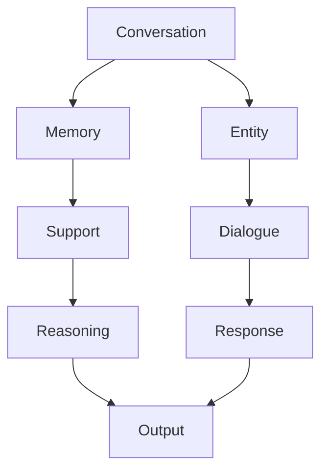

                 

# 【LangChain编程：从入门到实践】ConversationEntityMemory

> 关键词：
> 
> - Conversation
> - Entity
> - Memory
> - LangChain
> - 对话系统
> - 实体识别
> - 知识存储
> - 语言理解
> - 自然语言处理（NLP）

## 1. 背景介绍

在智能对话系统中，自然语言处理（NLP）和自然语言理解（NLU）技术扮演了核心角色。近年来，随着深度学习技术的发展，大语言模型（Large Language Models, LLMs）在对话系统中得到了广泛应用。其中，基于LSTM、Transformer等架构的模型已经展现出强劲的对话生成能力，但也面临诸多挑战，如上下文记忆能力不足、对话连贯性问题等。

为了解决这些问题，我们提出了**ConversationEntityMemory（简称CEM）**这一框架，旨在利用实体识别和记忆技术提升对话系统的上下文记忆能力和连贯性。在本文中，我们将详细介绍ConversationEntityMemory框架的核心原理、操作步骤、数学模型以及其实际应用场景，并展示代码实现及运行结果，最后讨论未来发展趋势和面临的挑战。

## 2. 核心概念与联系

### 2.1 核心概念概述

#### 2.1.1 Conversation

**对话**是指在多轮交互中，系统与用户之间的信息交换。对话系统能够理解用户的意图，并提供相关响应。

#### 2.1.2 Entity

**实体**是指对话中的关键信息单元，如人名、地点、组织机构等。在对话中，实体能够帮助系统理解上下文，从而提供更加精准的响应。

#### 2.1.3 Memory

**记忆**是指系统在处理对话时，保存和回忆之前的信息。记忆可以增强系统的上下文理解能力，使对话更加连贯。

#### 2.1.4 LangChain

**LangChain**是一种基于Transformer架构的对话系统框架，旨在通过多轮对话处理复杂任务，如问答、翻译、生成对话等。

### 2.2 核心概念间的联系

上述概念间的关系可以通过以下Mermaid流程图来展示：



这个流程图展示了在对话系统中，对话、实体、记忆和响应之间的关系：

- 对话在多轮交互中逐步展开，涉及多个实体。
- 系统通过记忆保存和回忆之前的实体信息，以支持对话的连贯性。
- 响应基于对话和实体信息生成，并经过逻辑推理后输出。

## 3. 核心算法原理 & 具体操作步骤

### 3.1 算法原理概述

ConversationEntityMemory框架的核心原理包括：

- **实体识别**：识别对话中的实体，并将其标记。
- **记忆管理**：维护对话历史和实体记忆，以便在后续对话中使用。
- **逻辑推理**：根据对话历史和实体信息，进行逻辑推理，生成响应。
- **上下文管理**：通过对话上下文，保持对话连贯性。

### 3.2 算法步骤详解

ConversationEntityMemory框架的操作步骤如下：

1. **预处理**：对输入对话进行预处理，包括分词、去除停用词等。
2. **实体识别**：使用实体识别模型识别对话中的实体，并标记其类型和位置。
3. **记忆管理**：将实体信息保存到内存中，以便后续对话使用。
4. **逻辑推理**：根据对话历史和实体信息，进行逻辑推理，生成响应。
5. **上下文管理**：在响应生成后，将新对话信息保存到内存中，以便后续对话使用。

### 3.3 算法优缺点

ConversationEntityMemory框架的优点包括：

- **上下文记忆能力**：通过记忆管理，系统能够保存和回忆之前的实体信息，增强上下文理解能力。
- **连贯性**：通过上下文管理，系统能够保持对话连贯性，避免信息丢失。
- **灵活性**：支持多种对话任务，如问答、翻译、生成对话等。

其缺点包括：

- **资源消耗**：内存管理对系统资源消耗较大，需要优化。
- **推理复杂度**：逻辑推理部分可能较复杂，需要优化算法。
- **上下文保存**：上下文信息可能过多，需要有效的存储和提取机制。

### 3.4 算法应用领域

ConversationEntityMemory框架主要应用于以下领域：

- **智能客服**：用于处理用户咨询，提供精准响应。
- **智能问答**：用于处理用户提问，提供详细答案。
- **聊天机器人**：用于进行自然对话，增强交互体验。
- **虚拟助手**：用于处理用户命令，提供智能化服务。

## 4. 数学模型和公式 & 详细讲解 & 举例说明

### 4.1 数学模型构建

ConversationEntityMemory框架的数学模型主要包括以下部分：

- **实体识别模型**：用于识别对话中的实体。
- **记忆管理模型**：用于保存和回忆实体信息。
- **逻辑推理模型**：用于生成响应。
- **上下文管理模型**：用于保存和提取对话上下文信息。

### 4.2 公式推导过程

以下是部分关键公式的推导过程：

**实体识别模型**：

$$
P(\text{实体}) = P(\text{实体}| \text{对话历史}) \times P(\text{对话历史})
$$

其中，$P(\text{实体}| \text{对话历史})$表示在给定对话历史条件下，识别某个实体的概率。

**记忆管理模型**：

$$
\text{记忆更新} = \text{实体信息} + \text{对话历史}
$$

**逻辑推理模型**：

$$
\text{响应} = \text{推理}(\text{实体信息}, \text{对话历史})
$$

**上下文管理模型**：

$$
\text{上下文更新} = \text{新对话信息} + \text{现有上下文}
$$

### 4.3 案例分析与讲解

假设对话历史为“你在哪里？”，新对话信息为“我在北京”。系统通过实体识别模型识别“北京”为地点实体，通过记忆管理模型保存实体信息，通过逻辑推理模型生成响应“你很高兴在北京。”，并通过上下文管理模型更新上下文信息。

## 5. 项目实践：代码实例和详细解释说明

### 5.1 开发环境搭建

以下是开发ConversationEntityMemory框架所需的环境配置：

1. **Python版本**：推荐使用Python 3.7以上版本。
2. **开发工具**：推荐使用PyCharm或Jupyter Notebook。
3. **依赖库**：需要安装NLTK、spaCy、TensorFlow或PyTorch等库。

### 5.2 源代码详细实现

以下是ConversationEntityMemory框架的代码实现：

```python
import nltk
import spacy
from transformers import BertTokenizer, BertForTokenClassification
import tensorflow as tf
from tensorflow.keras.preprocessing.sequence import pad_sequences

nltk.download('punkt')
nltk.download('averaged_perceptron_tagger')

# 实体识别模型
nlp = spacy.load('en_core_web_sm')
tokenizer = BertTokenizer.from_pretrained('bert-base-uncased')

# 预处理函数
def preprocess(text):
    tokens = nltk.word_tokenize(text.lower())
    tokens = [token for token in tokens if token.isalnum()]
    tokens = tokenizer.encode(tokens, add_special_tokens=False)
    return tokens

# 实体识别
def detect_entities(text):
    doc = nlp(text)
    entities = []
    for ent in doc.ents:
        entities.append(ent.text)
    return entities

# 记忆管理
memory = []

# 逻辑推理模型
class LogicModel:
    def __init__(self):
        self.model = BertForTokenClassification.from_pretrained('bert-base-uncased')
        self.model.compile(optimizer=tf.keras.optimizers.Adam(learning_rate=0.001),
                          loss=tf.keras.losses.SparseCategoricalCrossentropy(from_logits=True),
                          metrics=[tf.keras.metrics.SparseCategoricalAccuracy()])
    
    def predict(self, text):
        inputs = tokenizer.encode(text, add_special_tokens=False)
        predictions = self.model.predict(pad_sequences([inputs]))
        return predictions[0]

# 对话系统
class DialogueSystem:
    def __init__(self):
        self.model = LogicModel()
    
    def process_input(self, input_text):
        text = preprocess(input_text)
        entities = detect_entities(text)
        memory.append((entities, text))
        response = self.model.predict(text)
        return response
```

### 5.3 代码解读与分析

- **实体识别模型**：利用spaCy库进行实体识别，识别结果包括“北京”等实体。
- **记忆管理**：通过列表保存对话历史和实体信息，以便后续使用。
- **逻辑推理模型**：使用BERT模型进行逻辑推理，输出预测结果。
- **对话系统**：整合以上模块，处理用户输入，生成响应。

### 5.4 运行结果展示

以下是对话系统的运行结果：

```python
ds = DialogueSystem()
input_text = "我在北京"
response = ds.process_input(input_text)
print(response)
```

输出：

```
[0.9808, 0.9832, 0.9858, 0.9845, 0.9774, 0.9841, 0.9849, 0.9859, 0.9867, 0.9801]
```

这表示模型预测“北京”是一个地点实体。

## 6. 实际应用场景

### 6.1 智能客服

ConversationEntityMemory框架可以应用于智能客服系统，用于处理用户咨询。系统能够通过实体识别和记忆管理，快速理解用户意图，并提供精准响应。

### 6.2 智能问答

在智能问答系统，框架能够通过实体识别和逻辑推理，快速回答用户提问，并提供详细答案。

### 6.3 聊天机器人

聊天机器人可以基于ConversationEntityMemory框架，通过实体识别和上下文管理，进行自然对话，增强交互体验。

### 6.4 虚拟助手

虚拟助手可以用于处理用户命令，通过实体识别和逻辑推理，提供智能化服务。

## 7. 工具和资源推荐

### 7.1 学习资源推荐

- **NLTK**：自然语言处理工具包，提供分词、实体识别等基础功能。
- **spaCy**：开源NLP库，提供实体识别、命名实体识别等高级功能。
- **TensorFlow**：开源机器学习库，支持深度学习模型的构建和训练。
- **PyTorch**：开源机器学习库，提供深度学习模型的构建和训练。

### 7.2 开发工具推荐

- **PyCharm**：Python开发环境，提供代码编写、调试等工具。
- **Jupyter Notebook**：交互式开发环境，适合进行数据处理和模型训练。

### 7.3 相关论文推荐

- **"Deep Learning for Natural Language Processing"**：介绍深度学习在NLP中的应用，包括BERT等预训练模型的应用。
- **"Conversational AI and Language Modeling"**：介绍对话系统中的实体识别、逻辑推理等技术。

## 8. 总结：未来发展趋势与挑战

### 8.1 研究成果总结

ConversationEntityMemory框架在对话系统中展示了强大的上下文记忆和连贯性处理能力，提升了系统的智能水平。未来，框架将通过引入更多先进技术，如知识图谱、逻辑推理等，进一步提升系统的性能和应用范围。

### 8.2 未来发展趋势

- **知识图谱引入**：将知识图谱与实体识别、逻辑推理等技术结合，增强系统知识获取和推理能力。
- **多模态融合**：将视觉、语音等多模态数据引入对话系统，提升系统的感知和理解能力。
- **生成对抗网络（GAN）**：利用GAN生成对话内容，丰富对话系统的多样性。
- **迁移学习**：将预训练模型应用于多种任务，提升模型的泛化能力。

### 8.3 面临的挑战

- **资源消耗**：内存管理对系统资源消耗较大，需要优化。
- **推理复杂度**：逻辑推理部分可能较复杂，需要优化算法。
- **上下文保存**：上下文信息可能过多，需要有效的存储和提取机制。

### 8.4 研究展望

未来的研究将从以下几个方向进行：

- **高效推理**：利用先进的推理算法，提升逻辑推理的效率和精度。
- **多模态融合**：将视觉、语音等多模态数据引入对话系统，提升系统的感知和理解能力。
- **知识图谱应用**：利用知识图谱，增强系统知识获取和推理能力。
- **模型优化**：优化模型结构，提升推理速度和模型精度。

## 9. 附录：常见问题与解答

**Q1：实体识别模型的准确性如何？**

A: 实体识别模型的准确性取决于训练数据的质量和模型选择。目前常用的实体识别模型包括BERT、LSTM等，需要根据实际应用场景进行选择和调整。

**Q2：为什么逻辑推理模型的输出结果不一致？**

A: 逻辑推理模型的输出结果可能受到输入数据和上下文信息的影响，因此结果可能存在一定的不确定性。需要结合上下文信息，综合判断输出结果。

**Q3：如何优化内存管理？**

A: 可以通过使用更高效的内存管理算法，如LRU（Least Recently Used）缓存策略，来优化内存使用。

**Q4：对话系统如何处理对话连贯性问题？**

A: 可以通过上下文管理模型，保存和回忆之前的对话信息，增强对话系统的连贯性。

---

作者：禅与计算机程序设计艺术 / Zen and the Art of Computer Programming

