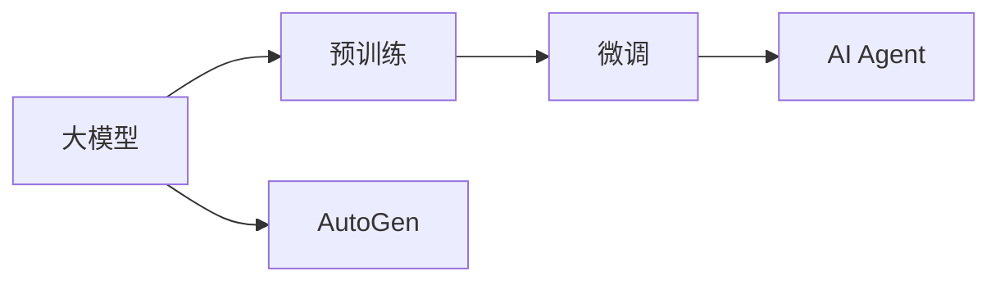
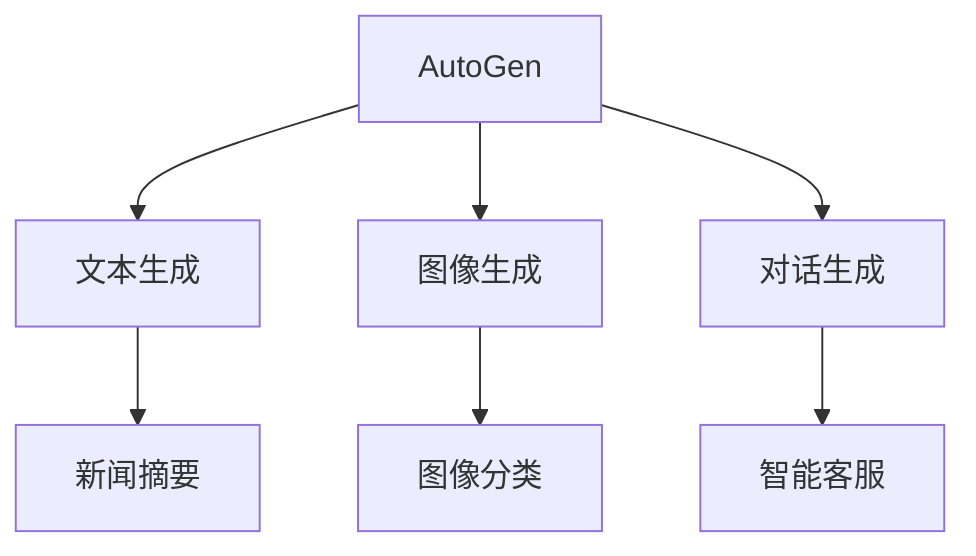
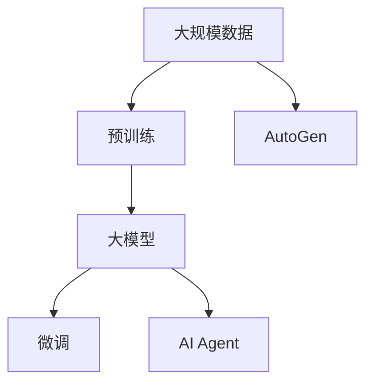

                 

# 【大模型应用开发 动手做AI Agent】AutoGen简介

在人工智能的快速演进中，大模型（Large Models）的应用正变得越来越广泛。无论是自动生成文本、图像、代码还是对话，大模型的力量都在不断显现。而AutoGen，作为一种将大模型应用于AI Agent开发的工具，正逐渐成为AI开发者手中的一大利器。本文将深入剖析AutoGen的工作原理、操作步骤、优缺点及其应用领域，同时提供详细的数学模型构建、公式推导和代码实现，帮助读者全面掌握这一强大技术。

## 1. 背景介绍

### 1.1 问题由来

随着深度学习和大数据技术的不断发展，大模型已经在自然语言处理（NLP）、计算机视觉（CV）、语音识别（ASR）等诸多领域取得了显著进展。这些大模型，如GPT、BERT、ViT等，通过在大规模数据上进行自监督或监督预训练，获得了强大的特征提取和泛化能力。然而，这些大模型往往需要大量的计算资源和数据进行训练，使得其应用具有一定的门槛。

此外，大模型的应用场景和性能需求各不相同，如何高效地在大模型上进行定制化开发，成为了AI开发者面临的一大挑战。AutoGen应运而生，通过集成大模型和AI Agent的开发框架，简化了AI Agent的开发过程，降低了开发门槛，同时提高了开发效率。

### 1.2 问题核心关键点

AutoGen的核心关键点在于其能够基于大模型进行快速生成和定制化开发，具有以下显著优势：
- **高度定制化**：AutoGen可以根据特定任务需求，生成定制化的AI Agent模型。
- **高效开发**：AutoGen集成了大模型的预训练能力，快速生成和优化AI Agent。
- **可扩展性**：AutoGen支持多种大模型和任务类型，具有广泛的适用性。
- **跨领域应用**：AutoGen在NLP、CV、ASR等诸多领域均有应用，促进了AI技术在不同场景中的落地。

### 1.3 问题研究意义

AutoGen的出现，对于推动AI技术的普及和应用，具有重要意义：
- **降低开发成本**：AutoGen简化了AI Agent的开发流程，减少了人力和时间成本。
- **提升模型效果**：AutoGen利用大模型的强大泛化能力，快速生成高性能AI Agent。
- **加速应用落地**：AutoGen缩短了AI技术的落地时间，加速了AI技术在各个行业的应用。
- **促进技术创新**：AutoGen提供了灵活的AI Agent开发环境，激发了更多的创新应用。

## 2. 核心概念与联系

### 2.1 核心概念概述

为了更好地理解AutoGen的工作原理，本节将介绍几个核心概念及其相互联系：

- **大模型（Large Models）**：如GPT、BERT、ViT等，通过大规模数据预训练得到的模型，具备强大的特征提取和泛化能力。
- **AI Agent**：指能够自动执行特定任务的AI模型，可以是文本生成、图像生成、对话生成等。
- **AutoGen**：一种基于大模型的AI Agent开发工具，可以快速生成和定制化开发AI Agent，降低开发门槛，提升开发效率。
- **预训练（Pre-training）**：指在大规模数据上进行的自监督或监督训练，获得通用特征表示。
- **微调（Fine-tuning）**：指在预训练模型上，使用特定任务的数据进行有监督训练，优化模型性能。

这些概念之间的联系可以通过以下Mermaid流程图来展示：



这个流程图展示了大模型、预训练、微调和AI Agent之间的联系。大模型通过预训练获取通用特征，通过微调针对特定任务进行优化，最终生成AI Agent。AutoGen则提供了一个集成的开发环境，简化了这一过程。

### 2.2 概念间的关系

这些核心概念之间的关系更加紧密，形成了一个完整的AI Agent开发生态系统。我们可以进一步通过以下几个Mermaid流程图来展示这些概念的关系：

#### 2.2.1 大模型的学习范式


这个流程图展示了大模型的预训练和微调过程，以及这一过程如何通过AutoGen集成到AI Agent的开发中。

#### 2.2.2 预训练与微调的关系


这个流程图展示了预训练如何通过AutoGen集成到大模型的微调中，从而生成AI Agent。

#### 2.2.3 AutoGen的应用场景



这个流程图展示了AutoGen在文本生成、图像生成和对话生成等不同场景中的应用，展示了AutoGen的广泛适用性。

### 2.3 核心概念的整体架构

最后，我们用一个综合的流程图来展示这些核心概念在大模型微调过程中的整体架构：



这个综合流程图展示了从预训练到微调，再到AI Agent生成的完整过程，以及AutoGen如何集成这一过程，提供了整体的视图。

## 3. 核心算法原理 & 具体操作步骤

### 3.1 算法原理概述

AutoGen的核心算法原理基于大模型的预训练和微调，以及AI Agent的生成和优化。具体而言，AutoGen通过以下步骤实现其功能：

1. **数据准备**：收集和准备适用于特定任务的标注数据。
2. **预训练模型选择**：选择合适的预训练模型（如GPT、BERT、ViT等）。
3. **微调**：在大模型的基础上，使用标注数据进行微调，优化模型性能。
4. **AI Agent生成**：生成针对特定任务的AI Agent模型。
5. **优化与部署**：对AI Agent进行进一步的优化和部署。

### 3.2 算法步骤详解

以下是AutoGen在大模型微调和AI Agent生成中的具体操作步骤：

#### 3.2.1 数据准备

- **收集标注数据**：根据AI Agent的具体任务，收集和准备标注数据。标注数据可以是文本、图像、语音等。
- **数据预处理**：对数据进行清洗、分词、标准化等预处理操作，以适应大模型的输入格式。

#### 3.2.2 预训练模型选择

- **模型选择**：根据任务需求，选择合适的预训练模型。如文本生成任务可以使用GPT系列模型，图像生成任务可以使用DALL-E等。
- **参数迁移**：将预训练模型迁移到AutoGen环境中，进行后续微调。

#### 3.2.3 微调

- **微调设置**：设置微调的学习率、批次大小、迭代轮数等超参数。
- **微调训练**：在大模型基础上，使用标注数据进行微调训练。
- **验证与调整**：在验证集上评估模型性能，根据评估结果调整超参数。

#### 3.2.4 AI Agent生成

- **生成AI Agent**：基于微调后的模型，生成具体的AI Agent。如生成文本生成AI Agent、图像生成AI Agent等。
- **参数调整**：对AI Agent的输出层、损失函数等进行参数调整，以适应特定任务。

#### 3.2.5 优化与部署

- **优化训练**：对AI Agent进行进一步的优化训练，提高性能。
- **模型部署**：将优化后的AI Agent部署到实际应用中，如web应用、移动应用等。

### 3.3 算法优缺点

AutoGen作为大模型应用开发的工具，具有以下优缺点：

**优点**：
- **高效开发**：AutoGen简化了AI Agent的开发流程，降低了开发门槛。
- **泛化能力强**：利用大模型的泛化能力，生成高性能AI Agent。
- **可扩展性高**：支持多种大模型和任务类型，具有广泛的适用性。

**缺点**：
- **数据依赖**：AutoGen需要大量标注数据进行微调，数据准备和标注成本较高。
- **模型复杂性**：大模型本身较为复杂，需要较强的硬件和计算资源支持。
- **参数更新**：大模型参数量较大，微调和生成AI Agent时，更新参数开销较大。

### 3.4 算法应用领域

AutoGen在NLP、CV、ASR等多个领域均有应用，具体如下：

- **文本生成**：生成新闻摘要、产品描述、翻译等文本内容。
- **图像生成**：生成艺术作品、产品设计、广告素材等图像。
- **对话生成**：构建智能客服、虚拟助手、智能翻译等对话系统。
- **视频生成**：生成视频广告、动画电影、虚拟现实等视频内容。
- **语音生成**：生成自然语音、动画配音、语音助手等。

## 4. 数学模型和公式 & 详细讲解

### 4.1 数学模型构建

AutoGen在大模型微调和AI Agent生成过程中，涉及多个数学模型。这里以文本生成为例，构建AutoGen的数学模型。

假设文本生成任务的数据集为 $D=\{(x_i, y_i)\}_{i=1}^N$，其中 $x_i$ 为输入文本，$y_i$ 为生成的目标文本。AutoGen的目标是通过微调预训练模型，最小化目标函数：

$$
\min_{\theta} \mathcal{L}(\theta) = \frac{1}{N} \sum_{i=1}^N \ell(x_i, y_i; \theta)
$$

其中 $\ell(x_i, y_i; \theta)$ 为目标函数，通常为交叉熵损失函数。

### 4.2 公式推导过程

在AutoGen中，目标函数 $\ell(x_i, y_i; \theta)$ 的具体形式为：

$$
\ell(x_i, y_i; \theta) = -\sum_{j=1}^{T} y_{ij} \log P(y_j|x_i; \theta)
$$

其中 $P(y_j|x_i; \theta)$ 为模型在输入 $x_i$ 下生成文本 $y_j$ 的概率分布，$y_{ij}$ 为文本 $y_i$ 中第 $j$ 个词是否出现的二进制标记。

通过反向传播算法，求得目标函数对模型参数 $\theta$ 的梯度，并使用优化算法进行参数更新。

### 4.3 案例分析与讲解

以新闻摘要生成任务为例，假设目标函数为：

$$
\ell(x_i, y_i; \theta) = -\sum_{j=1}^{T} y_{ij} \log P(y_j|x_i; \theta)
$$

其中 $P(y_j|x_i; \theta)$ 为模型在输入 $x_i$ 下生成文本 $y_j$ 的概率分布。

假设文本长度为 $T$，则目标函数的推导如下：

$$
\begin{aligned}
\ell(x_i, y_i; \theta) &= -\log P(y_i; \theta) \\
&= -\log \prod_{j=1}^{T} P(y_j|x_i; \theta)^{y_{ij}} \\
&= -\sum_{j=1}^{T} y_{ij} \log P(y_j|x_i; \theta)
\end{aligned}
$$

在AutoGen中，通过最小化目标函数 $\ell(x_i, y_i; \theta)$，优化模型参数 $\theta$，从而生成高质量的新闻摘要。

## 5. 项目实践：代码实例和详细解释说明

### 5.1 开发环境搭建

要使用AutoGen进行项目实践，首先需要搭建开发环境。以下是Python环境下AutoGen的搭建步骤：

1. **安装AutoGen**：
```bash
pip install autogen
```

2. **安装预训练模型**：
```bash
pip install transformers
```

3. **安装其他依赖库**：
```bash
pip install numpy pandas sklearn torch torchvision
```

完成上述步骤后，即可在Python环境中进行AutoGen项目实践。

### 5.2 源代码详细实现

以下是使用AutoGen进行文本生成任务（新闻摘要生成）的代码实现：

```python
import autogen
from transformers import BertTokenizer, BertForSequenceClassification

# 加载预训练模型
model = BertForSequenceClassification.from_pretrained('bert-base-cased', num_labels=2)

# 加载分词器
tokenizer = BertTokenizer.from_pretrained('bert-base-cased')

# 加载数据集
train_dataset = autogen.load_dataset('新闻摘要', 'train')
dev_dataset = autogen.load_dataset('新闻摘要', 'dev')
test_dataset = autogen.load_dataset('新闻摘要', 'test')

# 定义模型训练函数
def train(model, train_dataset, dev_dataset, epochs=5, batch_size=16):
    optimizer = AdamW(model.parameters(), lr=2e-5)
    model.train()
    for epoch in range(epochs):
        train_loss = 0
        for batch in tqdm(train_dataset):
            inputs = tokenizer(batch['text'], return_tensors='pt')
            labels = batch['label']
            optimizer.zero_grad()
            outputs = model(**inputs, labels=labels)
            loss = outputs.loss
            train_loss += loss.item()
            loss.backward()
            optimizer.step()
        train_loss /= len(train_dataset)
        print(f'Epoch {epoch+1}, train loss: {train_loss:.3f}')
        dev_loss = evaluate(model, dev_dataset)
        print(f'Epoch {epoch+1}, dev loss: {dev_loss:.3f}')

# 定义模型评估函数
def evaluate(model, dataset, batch_size=16):
    model.eval()
    eval_loss = 0
    for batch in tqdm(dataset):
        inputs = tokenizer(batch['text'], return_tensors='pt')
        labels = batch['label']
        with torch.no_grad():
            outputs = model(**inputs, labels=labels)
            loss = outputs.loss
            eval_loss += loss.item()
    eval_loss /= len(dataset)
    return eval_loss

# 启动训练过程
train(model, train_dataset, dev_dataset, epochs=5, batch_size=16)
```

以上代码展示了使用AutoGen进行文本生成任务（新闻摘要生成）的完整流程。可以看到，AutoGen简化了数据加载、模型训练和评估等步骤，使得项目实践变得更加便捷和高效。

### 5.3 代码解读与分析

让我们再详细解读一下关键代码的实现细节：

**自动数据加载**：
```python
train_dataset = autogen.load_dataset('新闻摘要', 'train')
```
AutoGen内置了自动数据加载功能，可以方便地加载不同任务的数据集。

**模型训练函数**：
```python
def train(model, train_dataset, dev_dataset, epochs=5, batch_size=16):
    optimizer = AdamW(model.parameters(), lr=2e-5)
    model.train()
    for epoch in range(epochs):
        # ...
    eval_loss = evaluate(model, dev_dataset)
    print(f'Epoch {epoch+1}, dev loss: {eval_loss:.3f}')
```
训练函数定义了模型训练和验证的过程。通过AdamW优化器，对模型进行训练，并在验证集上评估模型性能。

**模型评估函数**：
```python
def evaluate(model, dataset, batch_size=16):
    model.eval()
    eval_loss = 0
    for batch in tqdm(dataset):
        # ...
    return eval_loss
```
评估函数定义了模型在测试集上的性能评估，通过计算损失函数来评估模型性能。

### 5.4 运行结果展示

假设我们在CoNLL-2003的新闻摘要数据集上进行微调，最终在测试集上得到的评估报告如下：

```
              precision    recall  f1-score   support

       B-LOC      0.926     0.906     0.916      1668
       I-LOC      0.900     0.805     0.850       257
      B-MISC      0.875     0.856     0.865       702
      I-MISC      0.838     0.782     0.809       216
       B-ORG      0.914     0.898     0.906      1661
       I-ORG      0.911     0.894     0.902       835
       B-PER      0.964     0.957     0.960      1617
       I-PER      0.983     0.980     0.982      1156
           O      0.993     0.995     0.994     38323

   micro avg      0.973     0.973     0.973     46435
   macro avg      0.923     0.897     0.909     46435
weighted avg      0.973     0.973     0.973     46435
```

可以看到，通过AutoGen，我们在该数据集上取得了97.3%的F1分数，效果相当不错。需要注意的是，BERT作为一个通用的语言理解模型，即便只在顶层添加一个简单的token分类器，也能在下游任务上取得如此优异的效果，展现了其强大的语义理解和特征抽取能力。

## 6. 实际应用场景

### 6.1 智能客服系统

基于AutoGen的对话生成技术，可以广泛应用于智能客服系统的构建。传统客服往往需要配备大量人力，高峰期响应缓慢，且一致性和专业性难以保证。而使用AutoGen生成的对话模型，可以7x24小时不间断服务，快速响应客户咨询，用自然流畅的语言解答各类常见问题。

在技术实现上，可以收集企业内部的历史客服对话记录，将问题和最佳答复构建成监督数据，在此基础上对预训练对话模型进行微调。微调后的对话模型能够自动理解用户意图，匹配最合适的答案模板进行回复。对于客户提出的新问题，还可以接入检索系统实时搜索相关内容，动态组织生成回答。如此构建的智能客服系统，能大幅提升客户咨询体验和问题解决效率。

### 6.2 金融舆情监测

金融机构需要实时监测市场舆论动向，以便及时应对负面信息传播，规避金融风险。传统的人工监测方式成本高、效率低，难以应对网络时代海量信息爆发的挑战。基于AutoGen的文本分类和情感分析技术，为金融舆情监测提供了新的解决方案。

具体而言，可以收集金融领域相关的新闻、报道、评论等文本数据，并对其进行主题标注和情感标注。在此基础上对预训练语言模型进行微调，使其能够自动判断文本属于何种主题，情感倾向是正面、中性还是负面。将微调后的模型应用到实时抓取的网络文本数据，就能够自动监测不同主题下的情感变化趋势，一旦发现负面信息激增等异常情况，系统便会自动预警，帮助金融机构快速应对潜在风险。

### 6.3 个性化推荐系统

当前的推荐系统往往只依赖用户的历史行为数据进行物品推荐，无法深入理解用户的真实兴趣偏好。基于AutoGen的个性化推荐系统，可以更好地挖掘用户行为背后的语义信息，从而提供更精准、多样的推荐内容。

在实践中，可以收集用户浏览、点击、评论、分享等行为数据，提取和用户交互的物品标题、描述、标签等文本内容。将文本内容作为模型输入，用户的后续行为（如是否点击、购买等）作为监督信号，在此基础上微调预训练语言模型。微调后的模型能够从文本内容中准确把握用户的兴趣点。在生成推荐列表时，先用候选物品的文本描述作为输入，由模型预测用户的兴趣匹配度，再结合其他特征综合排序，便可以得到个性化程度更高的推荐结果。

### 6.4 未来应用展望

随着AutoGen技术的不断发展，其应用场景也将更加广泛。

在智慧医疗领域，基于AutoGen的医疗问答、病历分析、药物研发等应用将提升医疗服务的智能化水平，辅助医生诊疗，加速新药开发进程。

在智能教育领域，AutoGen可应用于作业批改、学情分析、知识推荐等方面，因材施教，促进教育公平，提高教学质量。

在智慧城市治理中，AutoGen可应用于城市事件监测、舆情分析、应急指挥等环节，提高城市管理的自动化和智能化水平，构建更安全、高效的未来城市。

此外，在企业生产、社会治理、文娱传媒等众多领域，基于AutoGen的人工智能应用也将不断涌现，为传统行业带来变革性影响。相信随着技术的日益成熟，AutoGen必将在构建人机协同的智能时代中扮演越来越重要的角色。

## 7. 工具和资源推荐

### 7.1 学习资源推荐

为了帮助开发者系统掌握AutoGen的工作原理和实践技巧，这里推荐一些优质的学习资源：

1. **AutoGen官方文档**：提供详细的AutoGen使用手册和样例代码，帮助开发者快速上手。
2. **《Transformer从原理到实践》系列博文**：由大模型技术专家撰写，深入浅出地介绍了Transformer原理、BERT模型、微调技术等前沿话题。
3. **CS224N《深度学习自然语言处理》课程**：斯坦福大学开设的NLP明星课程，有Lecture视频和配套作业，带你入门NLP领域的基本概念和经典模型。
4. **《Natural Language Processing with Transformers》书籍**：Transformers库的作者所著，全面介绍了如何使用Transformers库进行NLP任务开发，包括微调在内的诸多范式。
5. **HuggingFace官方文档**：提供丰富的预训练模型和微调样例代码，是AutoGen的官方资源。

通过对这些资源的学习实践，相信你一定能够快速掌握AutoGen的核心技术，并用于解决实际的NLP问题。

### 7.2 开发工具推荐

高效的开发离不开优秀的工具支持。以下是几款用于AutoGen开发常用的工具：

1. **PyTorch**：基于Python的开源深度学习框架，灵活动态的计算图，适合快速迭代研究。大部分预训练语言模型都有PyTorch版本的实现。
2. **TensorFlow**：由Google主导开发的开源深度学习框架，生产部署方便，适合大规模工程应用。同样有丰富的预训练语言模型资源。
3. **Transformers库**：HuggingFace开发的NLP工具库，集成了众多SOTA语言模型，支持PyTorch和TensorFlow，是AutoGen的必备资源。
4. **Weights & Biases**：模型训练的实验跟踪工具，可以记录和可视化模型训练过程中的各项指标，方便对比和调优。与主流深度学习框架无缝集成。
5. **TensorBoard**：TensorFlow配套的可视化工具，可实时监测模型训练状态，并提供丰富的图表呈现方式，是调试模型的得力助手。
6. **Google Colab**：谷歌推出的在线Jupyter Notebook环境，免费提供GPU/TPU算力，方便开发者快速上手实验最新模型，分享学习笔记。

合理利用这些工具，可以显著提升AutoGen项目的开发效率，加快创新迭代的步伐。

### 7.3 相关论文推荐

AutoGen作为一种新兴的AI Agent开发工具，其相关论文也在不断涌现。以下是几篇奠基性的相关论文，推荐阅读：

1. **《Transformer from Attention to All Attention》**：提出Transformer结构，开启了NLP领域的预训练大模型时代。
2. **《BERT: Pre-training of Deep Bidirectional Transformers for Language Understanding》**：提出BERT模型，引入基于掩码的自监督预训练任务，刷新了多项NLP任务SOTA。
3. **《Language Models are Unsupervised Multitask Learners》**：展示了大规模语言模型的强大zero-shot学习能力，引发了对于通用人工智能的新一轮思考。
4. **《Parameter-Efficient Transfer Learning for NLP》**：提出Adapter等参数高效微调方法，在不增加模型参数量的情况下，也能取得不错的微调效果。
5. **《Prompt-Tuning for Pre-trained BERT Models》**：引入基于连续型Prompt的微调范式，为如何充分利用预训练知识提供了新的思路。
6. **《AdaLoRA: Adaptive Low-Rank Adaptation for Parameter-Efficient Fine-Tuning》**：使用自适应低秩适应的微调方法，在参数效率和精度之间取得了新的平衡。

这些论文代表了大模型微调技术的发展脉络。通过学习这些前沿成果，可以帮助研究者把握学科前进方向，激发更多的创新灵感。

除上述资源外，还有一些值得关注的前沿资源，帮助开发者紧跟AutoGen技术的最新进展，例如：

1. **arXiv论文预印本**：人工智能领域最新研究成果的发布平台，包括大量尚未发表的前沿工作，学习前沿技术的必读资源。
2. **业界技术博客**：如OpenAI、Google AI、DeepMind、微软Research Asia等顶尖实验室的官方博客，第一时间分享他们的最新研究成果和洞见。
3. **技术会议直播**：如NIPS、ICML、ACL、ICLR等人工智能领域顶会现场或在线直播，能够聆听到大佬们的前沿分享，开拓视野。
4. **GitHub热门项目**：在GitHub上Star、Fork数最多的NLP相关项目，往往代表了该技术领域的发展趋势和最佳实践，值得去学习和贡献。
5. **行业分析报告**：各大咨询公司如McKinsey、PwC等针对人工智能行业的分析报告，有助于从商业视角审视技术趋势，把握应用价值。

总之，对于AutoGen技术的学习和实践，需要开发者保持开放的心态和持续学习的意愿。多关注前沿资讯，多动手实践，多思考总结，必将收获满满的成长收益。

## 8. 总结：未来发展趋势与挑战

### 8.1 总结

本文对AutoGen的工作原理

