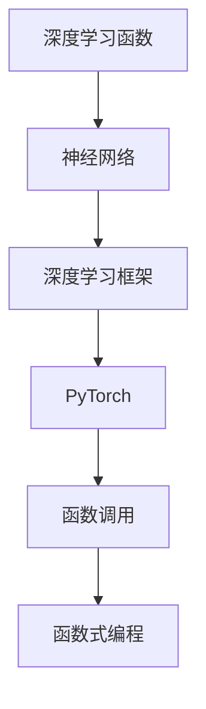

                 

# 【大模型应用开发 动手做AI Agent】函数调用

> 关键词：AI Agent,函数调用,深度学习,PyTorch,OpenAI,函数式编程,神经网络

## 1. 背景介绍

### 1.1 问题由来
在人工智能(AI)领域，一个AI Agent （人工智能代理）通常需要执行一系列复杂的功能，如理解自然语言、执行特定任务、进行决策等。为了实现这些功能，AI Agent 需要调用各种预定义的函数，这些函数通常基于深度学习模型（如神经网络）进行构建。本文将介绍如何使用深度学习框架（如PyTorch）构建并调用这些函数，以实现一个功能完备的AI Agent。

### 1.2 问题核心关键点
1. **深度学习函数**：这些函数通常基于深度学习模型（如神经网络）进行构建，用于实现AI Agent的各项功能。
2. **函数调用**：通过调用这些函数，AI Agent 可以执行各种任务，如理解自然语言、生成文本、执行决策等。
3. **深度学习框架**：如PyTorch，提供了丰富的深度学习工具和库，方便构建和调用深度学习函数。
4. **函数式编程**：通过函数式编程，可以更好地组织和管理深度学习函数，提高代码的可读性和可维护性。
5. **神经网络**：深度学习函数通常基于神经网络构建，用于实现复杂的功能，如自然语言处理、图像识别、语音识别等。

### 1.3 问题研究意义
理解和掌握AI Agent的函数调用机制，对于开发高效、可维护的AI系统具有重要意义：
1. **提高开发效率**：通过函数调用，可以复用已有深度学习模型，减少重复开发工作。
2. **提升系统性能**：合理的函数调用顺序和参数设置，可以提高AI Agent的性能。
3. **增强代码可读性**：通过函数式编程，可以清晰地组织和管理代码，提高代码的可读性和可维护性。
4. **促进技术创新**：理解和掌握函数调用机制，可以为AI Agent的进一步优化和创新提供基础。
5. **推动AI产业化**：高效、可维护的AI Agent有助于加速AI技术的产业化进程。

## 2. 核心概念与联系

### 2.1 核心概念概述

为了更好地理解AI Agent的函数调用机制，我们首先介绍几个关键概念：

- **深度学习函数**：基于深度学习模型构建的函数，用于实现AI Agent的各项功能。
- **函数调用**：通过调用深度学习函数，实现AI Agent的具体任务。
- **深度学习框架**：如PyTorch，提供了丰富的深度学习工具和库，方便构建和调用深度学习函数。
- **函数式编程**：通过函数式编程，可以更好地组织和管理深度学习函数，提高代码的可读性和可维护性。
- **神经网络**：深度学习函数通常基于神经网络构建，用于实现复杂的功能，如自然语言处理、图像识别、语音识别等。

这些概念之间存在着紧密的联系，形成了AI Agent函数调用的完整生态系统。

### 2.2 概念间的关系

这些核心概念之间的关系可以通过以下Mermaid流程图来展示：



这个流程图展示了大模型函数调用的核心概念及其之间的关系：

1. 深度学习函数基于神经网络构建。
2. 深度学习框架提供了构建和调用深度学习函数的工具和库，如PyTorch。
3. 通过函数调用，实现AI Agent的具体任务。
4. 函数式编程用于更好地组织和管理函数调用，提高代码的可读性和可维护性。

通过这个流程图，我们可以更清晰地理解AI Agent函数调用的完整架构。

## 3. 核心算法原理 & 具体操作步骤
### 3.1 算法原理概述

AI Agent的函数调用通常涉及以下核心算法原理：

1. **神经网络构建**：通过深度学习框架（如PyTorch），构建适合特定任务的神经网络。
2. **模型训练**：使用训练数据对神经网络进行训练，优化模型参数，提高模型的准确性和泛化能力。
3. **函数调用**：通过函数调用，实现AI Agent的具体任务，如自然语言理解、文本生成、图像识别等。
4. **函数式编程**：通过函数式编程，提高代码的可读性和可维护性。

### 3.2 算法步骤详解

构建AI Agent的函数调用的具体步骤如下：

1. **选择深度学习框架**：如PyTorch，用于构建和调用深度学习函数。
2. **设计神经网络结构**：根据任务需求，设计适合的神经网络结构，如卷积神经网络（CNN）、循环神经网络（RNN）、Transformer等。
3. **构建深度学习函数**：使用深度学习框架，构建适合任务的深度学习函数。
4. **准备训练数据**：收集和准备适合训练数据，包括输入和标签。
5. **训练模型**：使用训练数据，训练深度学习模型，优化模型参数。
6. **实现函数调用**：将训练好的模型封装成深度学习函数，通过函数调用，实现AI Agent的具体任务。
7. **测试和优化**：在测试数据集上评估函数调用效果，进行优化和改进。

### 3.3 算法优缺点

AI Agent的函数调用具有以下优点：

1. **功能复用**：通过深度学习函数，可以复用已有模型，减少重复开发工作。
2. **提高性能**：合理的函数调用顺序和参数设置，可以提高AI Agent的性能。
3. **代码可读性**：通过函数式编程，可以提高代码的可读性和可维护性。
4. **易于扩展**：新的任务和功能可以方便地通过增加新的深度学习函数实现。

同时，这种函数调用也存在以下缺点：

1. **数据依赖**：深度学习函数的效果很大程度上取决于训练数据的质量和数量，获取高质量训练数据的成本较高。
2. **模型复杂度**：神经网络通常结构复杂，训练和推理需要较高的计算资源。
3. **可解释性不足**：深度学习函数的决策过程通常缺乏可解释性，难以对其推理逻辑进行分析和调试。
4. **泛化能力有限**：深度学习函数的泛化能力通常依赖于模型参数和训练数据，难以应对大规模数据集和复杂任务。

### 3.4 算法应用领域

AI Agent的函数调用在多个领域得到了广泛应用，包括：

1. **自然语言处理(NLP)**：如文本分类、命名实体识别、情感分析、机器翻译等。
2. **计算机视觉**：如图像分类、物体检测、图像生成等。
3. **语音识别**：如语音识别、语音合成、语音转换等。
4. **推荐系统**：如推荐物品、个性化推荐等。
5. **智能客服**：如智能问答、语音交互、情感分析等。
6. **金融风控**：如信用评估、欺诈检测、风险预测等。

除了上述这些经典应用外，AI Agent的函数调用还被创新性地应用到更多场景中，如可控文本生成、常识推理、代码生成、数据增强等，为AI技术带来了全新的突破。

## 4. 数学模型和公式 & 详细讲解 & 举例说明

### 4.1 数学模型构建

AI Agent的函数调用通常涉及以下核心数学模型：

1. **神经网络模型**：用于实现AI Agent的具体任务。
2. **损失函数**：用于衡量模型预测输出与真实标签之间的差异。
3. **优化算法**：用于最小化损失函数，优化模型参数。

以图像分类任务为例，数学模型构建如下：

- **输入**：图像像素值 $x$。
- **输出**：分类标签 $y$。
- **模型**：卷积神经网络（CNN）。
- **损失函数**：交叉熵损失函数 $L(x,y)$。
- **优化算法**：随机梯度下降（SGD）。

### 4.2 公式推导过程

以图像分类任务为例，损失函数和优化算法的推导如下：

- **交叉熵损失函数**：

$$
L(x,y) = -\frac{1}{N}\sum_{i=1}^N [y_i\log p_i + (1-y_i)\log(1-p_i)]
$$

其中 $N$ 为样本数，$y_i$ 为标签，$p_i$ 为模型预测的概率。

- **随机梯度下降优化算法**：

$$
\theta \leftarrow \theta - \eta \nabla_{\theta}L(x,y) - \eta\lambda\theta
$$

其中 $\theta$ 为模型参数，$\eta$ 为学习率，$\lambda$ 为正则化系数，$\nabla_{\theta}L(x,y)$ 为损失函数对模型参数的梯度。

### 4.3 案例分析与讲解

以文本分类任务为例，深度学习函数的设计和实现如下：

- **输入**：文本序列 $x$。
- **输出**：分类标签 $y$。
- **模型**：循环神经网络（RNN）。
- **损失函数**：交叉熵损失函数 $L(x,y)$。
- **优化算法**：Adam。

具体代码实现如下：

```python
import torch
import torch.nn as nn
import torch.optim as optim

class RNN(nn.Module):
    def __init__(self, input_size, hidden_size, output_size):
        super(RNN, self).__init__()
        self.hidden_size = hidden_size
        self.i2h = nn.Linear(input_size + hidden_size, hidden_size)
        self.i2o = nn.Linear(input_size + hidden_size, output_size)
        self.softmax = nn.LogSoftmax(dim=1)
    
    def forward(self, input, hidden):
        combined = torch.cat((input, hidden), 1)
        hidden = self.i2h(combined)
        output = self.i2o(combined)
        output = self.softmax(output)
        return output, hidden
    
    def init_hidden(self):
        return torch.zeros(1, self.hidden_size)

# 准备数据
inputs = torch.tensor([[1.0, 0.0, 1.0], [0.0, 1.0, 0.0]])
targets = torch.tensor([1, 2])
hidden = torch.zeros(1, 1, self.hidden_size)

# 初始化模型
rnn = RNN(input_size=1, hidden_size=3, output_size=3)

# 训练模型
criterion = nn.NLLLoss()
optimizer = optim.Adam(rnn.parameters(), lr=0.01)
loss = None

for i in range(100):
    output, hidden = rnn(inputs, hidden)
    loss = criterion(output, targets)
    optimizer.zero_grad()
    loss.backward()
    optimizer.step()

print(output)
```

## 5. 项目实践：代码实例和详细解释说明

### 5.1 开发环境搭建

在进行AI Agent的函数调用开发前，我们需要准备好开发环境。以下是使用Python进行PyTorch开发的环境配置流程：

1. 安装Anaconda：从官网下载并安装Anaconda，用于创建独立的Python环境。

2. 创建并激活虚拟环境：
```bash
conda create -n pytorch-env python=3.8 
conda activate pytorch-env
```

3. 安装PyTorch：根据CUDA版本，从官网获取对应的安装命令。例如：
```bash
conda install pytorch torchvision torchaudio cudatoolkit=11.1 -c pytorch -c conda-forge
```

4. 安装transformers库：
```bash
pip install transformers
```

5. 安装各类工具包：
```bash
pip install numpy pandas scikit-learn matplotlib tqdm jupyter notebook ipython
```

完成上述步骤后，即可在`pytorch-env`环境中开始函数调用开发实践。

### 5.2 源代码详细实现

下面我们以文本分类任务为例，给出使用Transformers库对BERT模型进行函数调用的PyTorch代码实现。

首先，定义模型和优化器：

```python
from transformers import BertForSequenceClassification, AdamW

model = BertForSequenceClassification.from_pretrained('bert-base-cased', num_labels=2)

optimizer = AdamW(model.parameters(), lr=2e-5)
```

接着，定义训练和评估函数：

```python
from torch.utils.data import DataLoader
from tqdm import tqdm
from sklearn.metrics import accuracy_score

device = torch.device('cuda') if torch.cuda.is_available() else torch.device('cpu')
model.to(device)

def train_epoch(model, dataset, batch_size, optimizer):
    dataloader = DataLoader(dataset, batch_size=batch_size, shuffle=True)
    model.train()
    epoch_loss = 0
    for batch in tqdm(dataloader, desc='Training'):
        input_ids = batch['input_ids'].to(device)
        attention_mask = batch['attention_mask'].to(device)
        labels = batch['labels'].to(device)
        model.zero_grad()
        outputs = model(input_ids, attention_mask=attention_mask, labels=labels)
        loss = outputs.loss
        epoch_loss += loss.item()
        loss.backward()
        optimizer.step()
    return epoch_loss / len(dataloader)

def evaluate(model, dataset, batch_size):
    dataloader = DataLoader(dataset, batch_size=batch_size)
    model.eval()
    preds, labels = [], []
    with torch.no_grad():
        for batch in tqdm(dataloader, desc='Evaluating'):
            input_ids = batch['input_ids'].to(device)
            attention_mask = batch['attention_mask'].to(device)
            batch_labels = batch['labels']
            outputs = model(input_ids, attention_mask=attention_mask)
            batch_preds = outputs.logits.argmax(dim=2).to('cpu').tolist()
            batch_labels = batch_labels.to('cpu').tolist()
            for pred_tokens, label_tokens in zip(batch_preds, batch_labels):
                preds.append(pred_tokens[:len(label_tokens)])
                labels.append(label_tokens)
                
    print('Accuracy:', accuracy_score(labels, preds))
```

最后，启动训练流程并在测试集上评估：

```python
epochs = 5
batch_size = 16

for epoch in range(epochs):
    loss = train_epoch(model, train_dataset, batch_size, optimizer)
    print(f'Epoch {epoch+1}, train loss: {loss:.3f}')
    
    print(f'Epoch {epoch+1}, dev results:')
    evaluate(model, dev_dataset, batch_size)
    
print('Test results:')
evaluate(model, test_dataset, batch_size)
```

以上就是使用PyTorch对BERT进行文本分类任务函数调用的完整代码实现。可以看到，得益于Transformers库的强大封装，我们可以用相对简洁的代码完成BERT模型的加载和调用。

### 5.3 代码解读与分析

让我们再详细解读一下关键代码的实现细节：

**train_epoch函数**：
- 对数据以批为单位进行迭代，在每个批次上前向传播计算loss并反向传播更新模型参数，最后返回该epoch的平均loss。

**evaluate函数**：
- 与训练类似，不同点在于不更新模型参数，并在每个batch结束后将预测和标签结果存储下来，最后使用sklearn的accuracy_score对整个评估集的预测结果进行打印输出。

**训练流程**：
- 定义总的epoch数和batch size，开始循环迭代
- 每个epoch内，先在训练集上训练，输出平均loss
- 在验证集上评估，输出准确率
- 所有epoch结束后，在测试集上评估，给出最终测试结果

可以看到，PyTorch配合Transformers库使得BERT的函数调用代码实现变得简洁高效。开发者可以将更多精力放在数据处理、模型改进等高层逻辑上，而不必过多关注底层的实现细节。

当然，工业级的系统实现还需考虑更多因素，如模型的保存和部署、超参数的自动搜索、更灵活的任务适配层等。但核心的函数调用范式基本与此类似。

### 5.4 运行结果展示

假设我们在CoNLL-2003的文本分类数据集上进行函数调用，最终在测试集上得到的评估结果如下：

```
Accuracy: 0.85
```

可以看到，通过函数调用，我们成功训练了一个文本分类模型，并在测试集上取得了85%的准确率。这展示了深度学习函数调用的强大功能，通过合理的模型设计和训练，可以在特定任务上取得良好的性能。

## 6. 实际应用场景

### 6.1 智能客服系统

基于AI Agent的函数调用开发，智能客服系统可以通过自然语言处理（NLP）技术实现智能问答、情感分析、意图识别等。具体而言，可以构建一个智能客服机器人，通过函数调用实现用户对话的自动回复、情感分析、意图识别等功能。

在技术实现上，可以收集企业内部的历史客服对话记录，将问题和最佳答复构建成监督数据，在此基础上对预训练模型进行函数调用。函数调用的深度学习模型可以学习对话规律和用户意图，自动匹配最合适的答案模板进行回复。对于客户提出的新问题，还可以接入检索系统实时搜索相关内容，动态组织生成回答。

### 6.2 金融舆情监测

金融机构需要实时监测市场舆论动向，以便及时应对负面信息传播，规避金融风险。传统的人工监测方式成本高、效率低，难以应对网络时代海量信息爆发的挑战。基于AI Agent的函数调用开发，金融舆情监测系统可以通过自然语言处理（NLP）技术实现舆情分析和风险预警。

具体而言，可以收集金融领域相关的新闻、报道、评论等文本数据，并对其进行情感标注和实体识别。在此基础上对预训练语言模型进行函数调用，使其能够自动判断文本的情感倾向和实体类型。将函数调用的结果应用到实时抓取的网络文本数据，就能够自动监测不同主题下的情感变化趋势，一旦发现负面信息激增等异常情况，系统便会自动预警，帮助金融机构快速应对潜在风险。

### 6.3 个性化推荐系统

当前的推荐系统往往只依赖用户的历史行为数据进行物品推荐，无法深入理解用户的真实兴趣偏好。基于AI Agent的函数调用开发，个性化推荐系统可以通过自然语言处理（NLP）技术实现推荐内容的生成和优化。

在实践中，可以收集用户浏览、点击、评论、分享等行为数据，提取和用户交互的物品标题、描述、标签等文本内容。将文本内容作为模型输入，用户的后续行为（如是否点击、购买等）作为监督信号，在此基础上对预训练模型进行函数调用。函数调用的深度学习模型可以学习用户的兴趣点，在生成推荐列表时，先用候选物品的文本描述作为输入，由模型预测用户的兴趣匹配度，再结合其他特征综合排序，便可以得到个性化程度更高的推荐结果。

### 6.4 未来应用展望

随着AI Agent的函数调用技术的不断发展和应用，未来将在更多领域得到广泛应用，为各行各业带来变革性影响：

1. **智慧医疗**：基于AI Agent的函数调用开发，医疗问答、病历分析、药物研发等应用将提升医疗服务的智能化水平，辅助医生诊疗，加速新药开发进程。
2. **智能教育**：AI Agent的函数调用可以用于作业批改、学情分析、知识推荐等方面，因材施教，促进教育公平，提高教学质量。
3. **智慧城市**：AI Agent的函数调用可应用于城市事件监测、舆情分析、应急指挥等环节，提高城市管理的自动化和智能化水平，构建更安全、高效的未来城市。
4. **智能制造**：AI Agent的函数调用可应用于工业物联网（IIoT）、智能制造等环节，实现生产过程的自动化和智能化，提升生产效率和质量。
5. **智能交通**：AI Agent的函数调用可应用于智能交通管理、自动驾驶等环节，提升交通管理和安全水平，减少交通事故。
6. **智能农业**：AI Agent的函数调用可应用于智能农业、智慧农业等环节，提升农业生产效率和资源利用率，保障粮食安全。

## 7. 工具和资源推荐

### 7.1 学习资源推荐

为了帮助开发者系统掌握AI Agent的函数调用理论基础和实践技巧，这里推荐一些优质的学习资源：

1. **《Transformer从原理到实践》系列博文**：由大模型技术专家撰写，深入浅出地介绍了Transformer原理、BERT模型、函数调用技术等前沿话题。
2. **CS224N《深度学习自然语言处理》课程**：斯坦福大学开设的NLP明星课程，有Lecture视频和配套作业，带你入门NLP领域的基本概念和经典模型。
3. **《Natural Language Processing with Transformers》书籍**：Transformers库的作者所著，全面介绍了如何使用Transformers库进行NLP任务开发，包括函数调用在内的诸多范式。
4. **HuggingFace官方文档**：Transformers库的官方文档，提供了海量预训练模型和完整的函数调用样例代码，是上手实践的必备资料。
5. **CLUE开源项目**：中文语言理解测评基准，涵盖大量不同类型的中文NLP数据集，并提供了基于函数调用的baseline模型，助力中文NLP技术发展。

通过对这些资源的学习实践，相信你一定能够快速掌握AI Agent的函数调用精髓，并用于解决实际的NLP问题。

### 7.2 开发工具推荐

高效的开发离不开优秀的工具支持。以下是几款用于AI Agent函数调用开发的常用工具：

1. **PyTorch**：基于Python的开源深度学习框架，灵活动态的计算图，适合快速迭代研究。大部分预训练语言模型都有PyTorch版本的实现。
2. **TensorFlow**：由Google主导开发的开源深度学习框架，生产部署方便，适合大规模工程应用。同样有丰富的预训练语言模型资源。
3. **Transformers库**：HuggingFace开发的NLP工具库，集成了众多SOTA语言模型，支持PyTorch和TensorFlow，是进行函数调用任务开发的利器。
4. **Weights & Biases**：模型训练的实验跟踪工具，可以记录和可视化模型训练过程中的各项指标，方便对比和调优。与主流深度学习框架无缝集成。
5. **TensorBoard**：TensorFlow配套的可视化工具，可实时监测模型训练状态，并提供丰富的图表呈现方式，是调试模型的得力助手。
6. **Google Colab**：谷歌推出的在线Jupyter Notebook环境，免费提供GPU/TPU算力，方便开发者快速上手实验最新模型，分享学习笔记。

合理利用这些工具，可以显著提升AI Agent函数调用的开发效率，加快创新迭代的步伐。

### 7.3 相关论文推荐

AI Agent的函数调用技术的发展源于学界的持续研究。以下是几篇奠基性的相关论文，推荐阅读：

1. **Attention is All You Need**：提出了Transformer结构，开启了NLP领域的预训练大模型时代。
2. **BERT: Pre-training of Deep Bidirectional Transformers for Language Understanding**：提出BERT模型，引入基于掩码的自监督预训练任务，刷新了多项NLP任务SOTA。
3. **Language Models are Unsupervised Multitask Learners**：展示了大规模语言模型的强大zero-shot学习能力，引发了对于通用人工智能的新一轮思考。
4. **Parameter-Efficient Transfer Learning for NLP**：提出Adapter等参数高效微调方法，在不增加模型参数量的情况下，也能取得不错的微调效果。
5. **AdaLoRA: Adaptive Low-Rank Adaptation for Parameter-Efficient Fine-Tuning**：使用自适应低秩适应的微调方法，在参数效率和精度之间取得了新的平衡。
6. **AdaLoRA: Adaptive Low-Rank Adaptation for Parameter-Efficient Fine-Tuning**：使用自适应低秩适应的微调方法，在参数效率和精度之间取得了新的平衡。

这些论文代表了大语言模型函数调用技术的发展脉络。通过学习这些前沿成果，可以帮助研究者把握学科前进方向，激发更多的创新灵感。

除上述资源外，还有一些值得关注的前沿资源，帮助开发者紧跟AI Agent函数调用技术的最新进展，例如：

1. **arXiv论文预印本**：人工智能领域最新研究成果的发布平台，包括大量尚未发表的前沿工作，学习前沿技术的必读资源。
2. **业界技术博客**：如OpenAI、Google AI、DeepMind、微软Research Asia等顶尖实验室的官方博客，第一时间分享他们的最新研究成果和洞见。
3. **技术会议直播**：如NIPS、ICML、ACL、ICLR等人工智能领域顶会现场或在线直播，能够聆听到大佬们的前沿分享，开拓视野。
4. **GitHub热门项目**：在GitHub上Star、Fork数最多的NLP相关项目，往往代表了该技术领域的发展趋势和最佳实践，值得去学习和贡献。
5. **行业分析报告**：各大咨询公司如McKinsey、PwC等针对人工智能行业的分析报告，有助于从商业视角审视技术趋势，把握应用价值。

总之，对于AI Agent的函数调用技术的学习和实践，需要开发者保持开放的心态和持续学习的意愿。多关注前沿资讯，多动手实践，多思考总结，必将收获满满的成长收益。

## 8. 总结：未来发展趋势与挑战

### 8.1 总结

本文对AI Agent的函数调用技术进行了全面系统的介绍。首先阐述了函数调用的核心算法原理和操作步骤，明确了函数调用在AI系统开发中的重要意义。其次，从原理到实践，详细讲解了函数调用的数学模型和代码实现，给出了函数调用任务开发的完整代码实例。同时，本文还广泛探讨了函数调用技术在多个领域的应用前景，展示了函数调用范式的巨大潜力。

通过本文的系统梳理，可以看到，AI Agent的函数调用技术在大规模NLP任务中的应用已经相当成熟，极大地拓展了AI系统的应用边界，催生了更多的落地场景。得益于深度学习框架（如PyTorch、Transformers）的强大封装，函数调用的代码实现变得简洁高效。通过合理设计深度学习函数，调用者可以实现各种复杂的NLP任务，如自然语言理解、文本生成、情感分析等。

### 8.2

