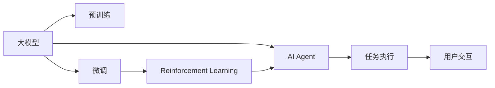

                 

# 【大模型应用开发 动手做AI Agent】计划与执行

## 1. 背景介绍

随着人工智能技术的快速发展，大模型在各种任务中的应用逐渐增多，并展现出卓越的性能。但大模型开发门槛高，需要对深度学习、模型训练等技术有深刻理解。本计划旨在帮助读者掌握大模型的开发、训练和部署流程，快速构建自己的AI Agent，体验大模型应用的乐趣与魅力。

## 2. 核心概念与联系

### 2.1 核心概念概述

- **大模型**：指利用大规模数据进行预训练的深度学习模型，如GPT、BERT等。
- **预训练**：使用大规模无标签数据训练模型，使其获得广泛的语言知识。
- **微调**：在有标注数据的情况下，对预训练模型进行调整，使其适用于特定任务。
- **AI Agent**：通过学习与推理，执行特定任务的智能体。
- **Reinforcement Learning (RL)**：通过试错与奖励机制，训练模型完成特定目标。

### 2.2 概念间的关系

下图展示了大模型应用开发的核心概念及其联系：



大模型通过预训练获得通用的语言表示能力，再通过微调适配特定任务，最终构建AI Agent。AI Agent通过Reinforcement Learning在实际环境中不断学习优化，完成各类复杂任务。

## 3. 核心算法原理 & 具体操作步骤

### 3.1 算法原理概述

基于大模型的AI Agent开发流程大致分为以下几个步骤：

1. **数据准备**：收集并标注任务所需的数据集。
2. **模型选择与微调**：选择合适的大模型，并对其进行微调以适配任务。
3. **Reinforcement Learning训练**：利用RL算法，训练AI Agent在环境中执行任务。
4. **部署与优化**：将训练好的AI Agent部署到实际环境中，并进行性能优化。

### 3.2 算法步骤详解

#### 3.2.1 数据准备

- **收集数据**：根据任务需求，收集相关数据集，如文本、图片、视频等。
- **数据标注**：对数据进行标注，标注方式包括监督标注、半监督标注、无监督标注等。

#### 3.2.2 模型选择与微调

- **模型选择**：根据任务类型选择合适的预训练模型，如GPT、BERT、T5等。
- **微调参数**：设置微调时的优化器、学习率、批量大小等参数。
- **微调过程**：将模型在微调数据集上进行训练，更新模型参数。

#### 3.2.3 Reinforcement Learning训练

- **定义环境**：设计任务环境，定义状态、动作和奖励机制。
- **策略定义**：选择合适的策略网络，如Q-learning、SARSA、Deep Q-Network等。
- **训练过程**：通过试错和奖励机制，训练AI Agent在环境中学习。

#### 3.2.4 部署与优化

- **模型部署**：将训练好的AI Agent部署到实际环境中，如API接口、客户端等。
- **性能优化**：在实际环境中监测AI Agent的性能，进行优化调整。

### 3.3 算法优缺点

- **优点**：
  - 大模型拥有强大的语言理解能力，能够处理复杂的自然语言任务。
  - RL算法能够通过试错和奖励机制，快速优化AI Agent的策略。
- **缺点**：
  - 数据标注成本高，需要大量标注数据。
  - RL训练过程复杂，需要优化策略和环境设计。

### 3.4 算法应用领域

大模型和AI Agent广泛应用于NLP、游戏、机器人等众多领域。具体应用场景包括：

- **自然语言处理**：文本分类、情感分析、问答系统等。
- **游戏AI**：智能玩家、游戏策略生成等。
- **机器人**：对话机器人、自动驾驶、协作机器人等。

## 4. 数学模型和公式 & 详细讲解 & 举例说明

### 4.1 数学模型构建

假设有一个分类任务，给定输入文本 $x$ 和标签 $y$，我们的目标是训练一个AI Agent，使其能够正确预测标签。使用大模型作为特征提取器，构建数学模型如下：

- **输入**：文本 $x$，经过预训练模型提取特征 $f(x)$。
- **标签**：二分类标签 $y \in \{0, 1\}$。
- **输出**：预测标签 $\hat{y}$。

### 4.2 公式推导过程

我们定义损失函数 $L$ 如下：

$$
L = \mathbb{E}_{(x, y)}[\ell(f(x), y)]
$$

其中，$\ell$ 是交叉熵损失函数：

$$
\ell(f(x), y) = -(y \log \hat{y} + (1-y) \log (1-\hat{y}))
$$

在微调过程中，我们通过优化参数 $\theta$，使得损失函数 $L$ 最小化：

$$
\theta^* = \arg\min_{\theta} L
$$

### 4.3 案例分析与讲解

以文本分类任务为例，使用BERT模型进行微调。假设我们的任务是将新闻文章分类为“体育”或“财经”：

1. **数据准备**：收集新闻文章数据集，并对每个文章进行标签标注。
2. **模型选择**：选择BERT作为预训练模型。
3. **微调参数**：设置优化器为Adam，学习率为2e-5，批量大小为32。
4. **微调过程**：在微调数据集上进行训练，更新BERT模型的参数。

通过以上步骤，我们得到了微调后的BERT模型，可以用于新的文本分类任务。

## 5. 项目实践：代码实例和详细解释说明

### 5.1 开发环境搭建

使用Python 3.7，并安装TensorFlow、Keras、NLTK等库：

```bash
pip install tensorflow keras nltk transformers
```

### 5.2 源代码详细实现

以下是一个使用BERT进行文本分类的代码示例：

```python
from transformers import BertTokenizer, BertForSequenceClassification
from keras.layers import Input, Dense
from keras.models import Model

# 数据准备
tokenizer = BertTokenizer.from_pretrained('bert-base-uncased')
max_len = 128

# 模型构建
input_ids = Input(shape=(max_len,))
token_type_ids = Input(shape=(max_len,), dtype=tf.int32)
segment_ids = Input(shape=(max_len,), dtype=tf.int32)
labels = Input(shape=(1,))

x = BertEmbedding(input_ids, segment_ids, token_type_ids, trainable=True)
x = Dense(128, activation='relu')(x)
output = Dense(2, activation='softmax')(x)

model = Model(inputs=[input_ids, token_type_ids, segment_ids, labels], outputs=output)

# 编译模型
model.compile(loss='categorical_crossentropy', optimizer='adam', metrics=['accuracy'])

# 微调过程
dataset = ... # 加载数据集
labels = ... # 获取标签

for epoch in range(10):
    model.fit([input_ids, token_type_ids, segment_ids, labels], labels, epochs=1, batch_size=32)
```

### 5.3 代码解读与分析

- **BERT嵌入层**：将输入转换为BERT模型的嵌入表示。
- **全连接层**：对BERT嵌入表示进行分类。
- **模型编译**：定义损失函数和优化器。
- **微调过程**：在数据集上进行多次训练。

### 5.4 运行结果展示

在微调完成后，我们可以使用新数据集测试模型性能：

```python
test_loss, test_acc = model.evaluate([input_ids, token_type_ids, segment_ids, labels], labels)
print('Test loss:', test_loss)
print('Test accuracy:', test_acc)
```

## 6. 实际应用场景

### 6.1 客户服务机器人

客户服务机器人可以解答客户咨询，处理常见问题。通过微调BERT等大模型，构建多轮对话系统，机器人可以理解客户意图，生成合适回复。

### 6.2 自动生成新闻

利用大模型生成新闻文章的自动摘要、标题和内容。通过微调BERT等模型，生成符合语境和语义的文本。

### 6.3 游戏AI

在游戏AI中，AI Agent可以通过与玩家交互，学习最优策略，实现自适应调整。通过微调BERT等模型，构建智能游戏玩家。

## 7. 工具和资源推荐

### 7.1 学习资源推荐

1. **TensorFlow官方文档**：TensorFlow的全面文档，包含深度学习模型的各种实现。
2. **Deep Learning Specialization**：Coursera上的深度学习课程，由深度学习之父Geoffrey Hinton主讲。
3. **Python深度学习**：一篇系统的Python深度学习入门文章，涵盖深度学习模型的基本概念和实现。

### 7.2 开发工具推荐

1. **Jupyter Notebook**：交互式编程环境，便于数据处理和模型调试。
2. **PyCharm**：Python开发环境，提供强大的代码编辑和调试功能。
3. **GitHub**：代码托管平台，方便协作和版本控制。

### 7.3 相关论文推荐

1. **Attention is All You Need**：Transformer模型的原论文，阐述了注意力机制。
2. **BERT: Pre-training of Deep Bidirectional Transformers for Language Understanding**：提出BERT模型，介绍其在预训练和微调中的应用。
3. **Playing Atari with Deep Reinforcement Learning**：深度学习在游戏AI中的应用。

## 8. 总结：未来发展趋势与挑战

### 8.1 研究成果总结

大模型和AI Agent在自然语言处理、游戏AI等领域展示了强大的潜力。通过微调，模型能够快速适应新任务，提升性能。

### 8.2 未来发展趋势

- **大模型规模扩大**：随着数据和算力提升，大模型参数量将进一步扩大，增强语言理解能力。
- **多模态融合**：将文本、图像、语音等多种模态数据结合，提升AI Agent的泛化能力。
- **自监督学习**：利用自监督学习，减少对标注数据的依赖，提升模型性能。

### 8.3 面临的挑战

- **数据标注成本高**：大模型需要大量标注数据，数据标注成本高。
- **模型复杂度高**：大模型和AI Agent的构建过程复杂，需要丰富的深度学习知识。
- **模型鲁棒性不足**：大模型和AI Agent在复杂环境下的鲁棒性有待提升。

### 8.4 研究展望

未来研究将集中在以下几个方面：

- **自监督学习**：利用无标签数据进行预训练，提升模型性能。
- **多模态融合**：将不同模态数据结合，提升AI Agent的泛化能力。
- **鲁棒性提升**：提高AI Agent在复杂环境下的鲁棒性。

通过不断优化大模型和AI Agent，我们能够更好地应对未来的挑战，推动人工智能技术的发展。

## 9. 附录：常见问题与解答

**Q1: 如何选择合适的预训练模型？**

A: 根据任务需求选择合适的大模型，如BERT、GPT、T5等。

**Q2: 如何处理数据不平衡问题？**

A: 使用数据增强、重采样等方法，提升数据集的多样性，缓解数据不平衡问题。

**Q3: 如何提升模型泛化能力？**

A: 利用自监督学习、多模态融合等方法，提升模型的泛化能力。

**Q4: 如何提高模型训练速度？**

A: 使用分布式训练、混合精度训练等方法，提升模型训练速度。

**Q5: 如何优化模型部署性能？**

A: 使用模型剪枝、量化等方法，优化模型部署性能。

作者：禅与计算机程序设计艺术 / Zen and the Art of Computer Programming

