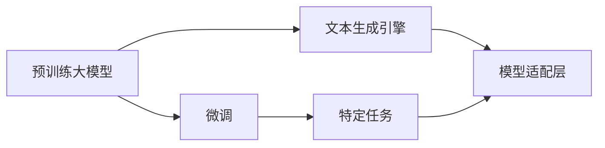

                 

# 【大模型应用开发 动手做AI Agent】配置文本生成引擎大模型

> 关键词：大模型应用, 文本生成引擎, 预训练, 微调, 机器学习, 深度学习, 自然语言处理(NLP), 人工智能(AI), 代码实现

## 1. 背景介绍

### 1.1 问题由来

随着人工智能(AI)技术的飞速发展，特别是在自然语言处理(NLP)领域，预训练大语言模型(如GPT、BERT等)逐渐成为了一种非常强大且高效的工具。这些模型通过在大规模无标签文本数据上进行预训练，可以学习到丰富的语言知识，并在下游任务上表现出色。然而，这些模型通常需要大量的计算资源和数据，对于许多中小企业和个人开发者来说，可能难以直接使用这些预训练模型。

### 1.2 问题核心关键点

为了解决这一问题，我们需要探索如何将预训练大模型配置为适合特定应用场景的文本生成引擎。以下是这一过程中需要考虑的几个核心关键点：

- **预训练模型选择**：选择合适的预训练大语言模型，如GPT、BERT等。
- **微调与适配**：在下游任务数据集上对预训练模型进行微调，以适应特定应用场景。
- **代码实现**：使用深度学习框架，如TensorFlow、PyTorch等，实现模型配置与训练。
- **性能优化**：在模型训练与推理过程中，进行必要的性能优化，以确保模型的运行效率和效果。

## 2. 核心概念与联系

### 2.1 核心概念概述

为了更好地理解配置文本生成引擎大模型的过程，需要明确几个核心概念及其相互关系：

- **预训练大模型**：如GPT、BERT等，在大规模无标签数据上进行自监督学习，学习到通用的语言表示。
- **微调(Fine-Tuning)**：在预训练模型的基础上，使用下游任务数据集，通过有监督学习优化模型在特定任务上的性能。
- **文本生成引擎**：基于预训练模型，结合特定应用场景的需求，进行微调与适配，以实现文本生成功能。
- **机器学习与深度学习**：微调与适配过程中使用的核心技术。
- **自然语言处理(NLP)**：大模型的应用领域，涵盖文本分类、情感分析、机器翻译等任务。

这些核心概念通过以下Mermaid流程图展示了它们之间的联系：



该图展示了预训练大模型通过微调适配特定任务，进而成为文本生成引擎的过程。微调过程中，模型通过学习特定任务的数据，能够生成符合任务要求的文本。

### 2.2 概念间的关系

- **预训练与微调的关系**：预训练模型是微调的基础，微调则是在预训练模型的基础上，对特定任务进行适配和优化。
- **文本生成引擎的应用**：文本生成引擎可以应用于多种NLP任务，如对话系统、智能客服、文本摘要等，通过微调过程，使其能够适应特定的应用场景。
- **机器学习与深度学习的关系**：机器学习和深度学习是微调过程中使用的核心技术，深度学习特别是神经网络模型，为文本生成引擎提供了强大的预测能力。
- **自然语言处理(NLP)的应用领域**：NLP是大模型应用的主要领域，涵盖文本分类、情感分析、机器翻译等任务，通过微调过程，可以使大模型在这些任务上取得更好的效果。

这些核心概念构成了大模型应用开发的基础，通过理解这些概念，可以更好地掌握配置文本生成引擎大模型的过程。

## 3. 核心算法原理 & 具体操作步骤

### 3.1 算法原理概述

文本生成引擎大模型的配置过程基于监督学习原理，主要包括以下几个步骤：

1. **预训练模型的选择**：选择合适的预训练大语言模型，如GPT-3、BERT等。
2. **微调过程**：在特定任务的数据集上对预训练模型进行微调，以适应特定任务的要求。
3. **模型适配层设计**：设计适合特定任务的输出层，如分类层、生成层等。
4. **模型评估与优化**：在训练过程中，使用验证集对模型进行评估，并根据评估结果进行模型优化。

### 3.2 算法步骤详解

以下是配置文本生成引擎大模型的详细步骤：

1. **数据准备**：收集下游任务的数据集，并对其进行预处理，包括分词、标准化等。

2. **模型选择**：选择合适的预训练大语言模型，如GPT-3、BERT等，并下载其预训练参数。

3. **模型微调**：在特定任务的数据集上对预训练模型进行微调，以适应特定任务的要求。

4. **模型适配层设计**：设计适合特定任务的输出层，如分类层、生成层等。

5. **模型评估与优化**：在训练过程中，使用验证集对模型进行评估，并根据评估结果进行模型优化。

6. **模型部署**：将微调后的模型部署到生产环境，并进行必要的性能优化，以确保模型的运行效率和效果。

### 3.3 算法优缺点

#### 3.3.1 优点

- **高效适配**：通过微调过程，可以快速适配特定任务，取得较好的性能。
- **灵活性高**：模型可以在不同任务间进行迁移，应用灵活。
- **资源利用率高**：使用预训练模型，可以减少从头训练所需的计算资源和时间。

#### 3.3.2 缺点

- **依赖标注数据**：微调过程需要大量标注数据，标注成本较高。
- **泛化能力有限**：微调模型可能过度拟合训练数据，泛化能力有限。
- **性能瓶颈**：在处理大规模数据时，性能可能受限。

### 3.4 算法应用领域

文本生成引擎大模型可以广泛应用于以下领域：

- **智能客服**：用于自动化对话系统，提高客户满意度。
- **内容生成**：用于文章生成、摘要生成、翻译等。
- **聊天机器人**：用于智能聊天机器人，提供个性化的对话服务。
- **创意写作**：用于辅助创意写作、小说生成等。

## 4. 数学模型和公式 & 详细讲解 & 举例说明

### 4.1 数学模型构建

配置文本生成引擎大模型的数学模型构建主要基于监督学习，假设输入为 $x$，输出为 $y$，则模型目标函数为：

$$
\mathcal{L}(\theta) = \frac{1}{N}\sum_{i=1}^N \ell(y_i, M_{\theta}(x_i))
$$

其中 $M_{\theta}$ 表示预训练大模型的参数化表示，$\ell$ 表示损失函数。

### 4.2 公式推导过程

以分类任务为例，假设模型输出为 $z$，则损失函数为交叉熵损失：

$$
\ell(y_i, z_i) = -y_i \log(z_i) - (1-y_i)\log(1-z_i)
$$

在微调过程中，模型的更新公式为：

$$
\theta \leftarrow \theta - \eta \nabla_{\theta}\mathcal{L}(\theta)
$$

其中 $\eta$ 为学习率。

### 4.3 案例分析与讲解

以情感分析任务为例，假设数据集为 $\{(x_i, y_i)\}_{i=1}^N$，其中 $x_i$ 为输入文本，$y_i$ 为情感标签。在微调过程中，模型通过学习这些数据，可以输出每个输入文本的情感预测结果。

## 5. 项目实践：代码实例和详细解释说明

### 5.1 开发环境搭建

配置文本生成引擎大模型的开发环境搭建主要包括以下几个步骤：

1. **环境准备**：安装深度学习框架，如TensorFlow、PyTorch等，以及相关的库，如NLTK、spaCy等。

2. **数据准备**：收集下游任务的数据集，并进行预处理，包括分词、标准化等。

3. **模型下载**：选择合适的预训练大语言模型，如GPT-3、BERT等，并下载其预训练参数。

### 5.2 源代码详细实现

以下是使用PyTorch进行情感分析任务微调的示例代码：

```python
import torch
import torch.nn as nn
import torch.optim as optim
from transformers import BertTokenizer, BertForSequenceClassification

# 加载预训练模型和分词器
tokenizer = BertTokenizer.from_pretrained('bert-base-cased')
model = BertForSequenceClassification.from_pretrained('bert-base-cased', num_labels=2)

# 定义训练函数
def train(model, train_loader, optimizer, device):
    model.to(device)
    for epoch in range(num_epochs):
        model.train()
        for batch in train_loader:
            input_ids, attention_mask, labels = batch.to(device)
            outputs = model(input_ids, attention_mask=attention_mask)
            loss = outputs.loss
            loss.backward()
            optimizer.step()
            optimizer.zero_grad()

# 定义评估函数
def evaluate(model, test_loader, device):
    model.eval()
    correct = 0
    total = 0
    for batch in test_loader:
        input_ids, attention_mask, labels = batch.to(device)
        outputs = model(input_ids, attention_mask=attention_mask)
        _, preds = torch.max(outputs, dim=1)
        total += labels.size(0)
        correct += (preds == labels).sum().item()
    return correct / total

# 加载数据集
train_dataset = ...
dev_dataset = ...
test_dataset = ...

# 训练模型
model.train()
optimizer = optim.Adam(model.parameters(), lr=1e-5)
train_loader = DataLoader(train_dataset, batch_size=32)
num_epochs = 10
train(model, train_loader, optimizer, device)

# 评估模型
test_loader = DataLoader(test_dataset, batch_size=32)
test_acc = evaluate(model, test_loader, device)
print(f'Test Accuracy: {test_acc:.2f}')
```

### 5.3 代码解读与分析

该代码段展示了情感分析任务微调的基本流程：

1. **模型加载**：使用预训练的BERT模型和分词器。
2. **训练函数**：定义训练过程，包括前向传播、损失计算、反向传播和模型参数更新。
3. **评估函数**：定义评估过程，包括前向传播和精度计算。
4. **数据加载**：使用PyTorch的DataLoader加载数据集。

### 5.4 运行结果展示

运行上述代码，可以得到模型在测试集上的精度结果。

## 6. 实际应用场景

### 6.1 智能客服系统

智能客服系统是文本生成引擎大模型的典型应用场景。通过微调预训练模型，可以构建自动化对话系统，提供7x24小时不间断服务，快速响应客户咨询，用自然流畅的语言解答各类常见问题。

### 6.2 金融舆情监测

金融舆情监测是大模型在金融领域的应用之一。通过微调预训练模型，可以实时监测市场舆论动向，及时应对负面信息传播，规避金融风险。

### 6.3 个性化推荐系统

个性化推荐系统是文本生成引擎大模型的另一个重要应用场景。通过微调预训练模型，可以挖掘用户行为背后的语义信息，提供更精准、多样的推荐内容。

## 7. 工具和资源推荐

### 7.1 学习资源推荐

- **Coursera**：提供深度学习相关的课程，如《深度学习专项课程》。
- **Kaggle**：提供大量的NLP数据集和竞赛，适合实践学习。
- **HuggingFace官方文档**：提供预训练模型和微调样例代码，是学习的必备资源。

### 7.2 开发工具推荐

- **PyTorch**：深度学习框架，支持动态图和静态图，灵活性高。
- **TensorFlow**：深度学习框架，生产部署方便，适合大规模工程应用。
- **NLTK**：自然语言处理工具库，提供文本预处理功能。

### 7.3 相关论文推荐

- **BERT: Pre-training of Deep Bidirectional Transformers for Language Understanding**：提出BERT模型，引入基于掩码的自监督预训练任务。
- **Attention is All You Need**：提出Transformer结构，开启了NLP领域的预训练大模型时代。
- **Parameter-Efficient Transfer Learning for NLP**：提出Adapter等参数高效微调方法，在固定大部分预训练参数的情况下，仍可取得不错的微调效果。

## 8. 总结：未来发展趋势与挑战

### 8.1 研究成果总结

文本生成引擎大模型的配置与微调技术在NLP领域取得了显著成果，广泛应用于智能客服、金融舆情监测、个性化推荐等多个领域。然而，微调过程中依然存在标注数据依赖、泛化能力有限、性能瓶颈等问题，需要进一步研究解决。

### 8.2 未来发展趋势

未来文本生成引擎大模型将呈现以下发展趋势：

- **预训练模型规模不断增大**：随着算力成本的下降和数据规模的扩张，预训练语言模型的参数量还将持续增长，模型规模不断增大。
- **微调方法更加多样化**：未来将涌现更多参数高效的微调方法，如Adapter、LoRA等，在节省计算资源的同时也能保证微调精度。
- **多模态微调崛起**：将符号化的先验知识，如知识图谱、逻辑规则等，与神经网络模型进行巧妙融合，引导微调过程学习更准确、合理的语言模型。

### 8.3 面临的挑战

文本生成引擎大模型的配置与微调技术仍面临诸多挑战：

- **标注成本瓶颈**：微调过程中需要大量标注数据，标注成本较高。
- **泛化能力有限**：微调模型可能过度拟合训练数据，泛化能力有限。
- **性能瓶颈**：在处理大规模数据时，性能可能受限。

### 8.4 研究展望

未来研究需要在以下几个方面寻求新的突破：

- **探索无监督和半监督微调方法**：摆脱对大规模标注数据的依赖，利用自监督学习、主动学习等无监督和半监督范式。
- **融合因果和对比学习范式**：增强微调模型建立稳定因果关系的能力，学习更加普适、鲁棒的语言表征。

## 9. 附录：常见问题与解答

### Q1: 什么是预训练大模型？

A: 预训练大模型是通过在大规模无标签数据上进行自监督学习，学习到通用的语言表示的模型。如GPT、BERT等。

### Q2: 如何选择合适的预训练模型？

A: 根据任务需求选择合适的预训练模型，如情感分析任务可以选择BERT模型，对话系统可以选择GPT模型。

### Q3: 微调过程需要哪些步骤？

A: 微调过程包括数据准备、模型选择、模型微调、模型适配层设计、模型评估与优化、模型部署等步骤。

### Q4: 如何提高微调的泛化能力？

A: 使用正则化技术、对抗训练、数据增强等方法提高微调的泛化能力。

### Q5: 如何使用预训练模型进行文本生成？

A: 使用预训练模型进行文本生成的主要步骤包括数据准备、模型选择、微调、适配层设计、评估与优化等。

