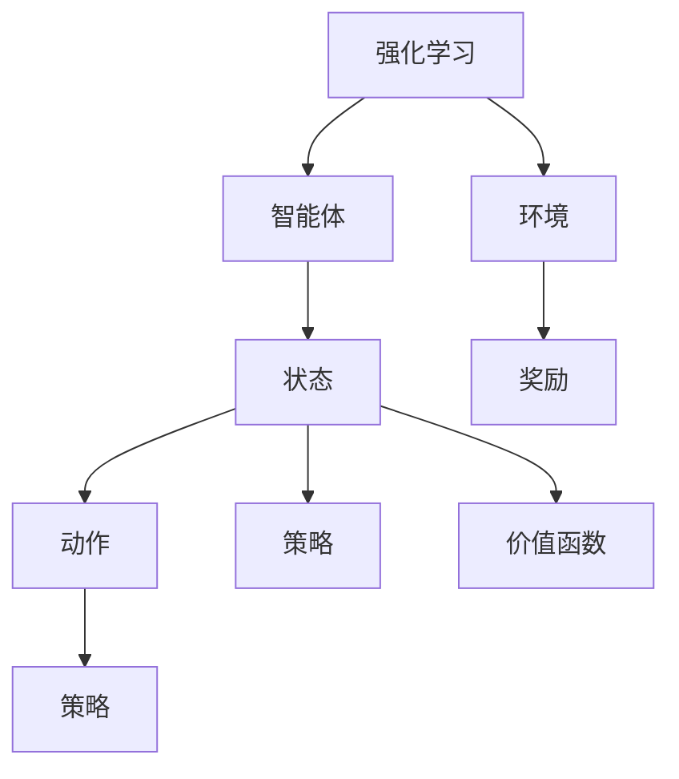
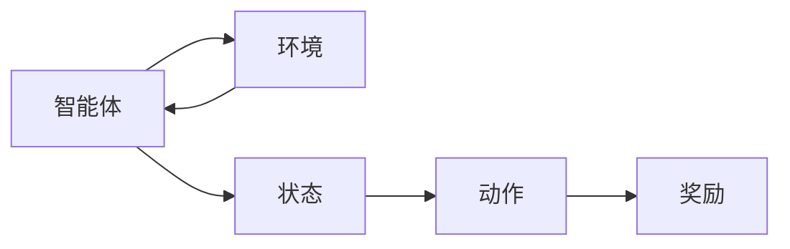
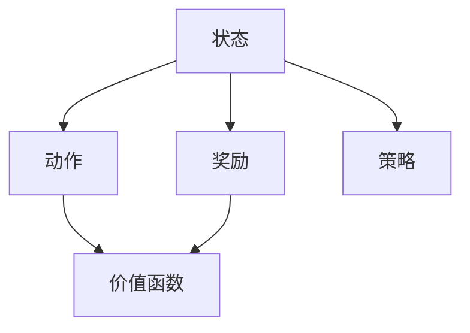
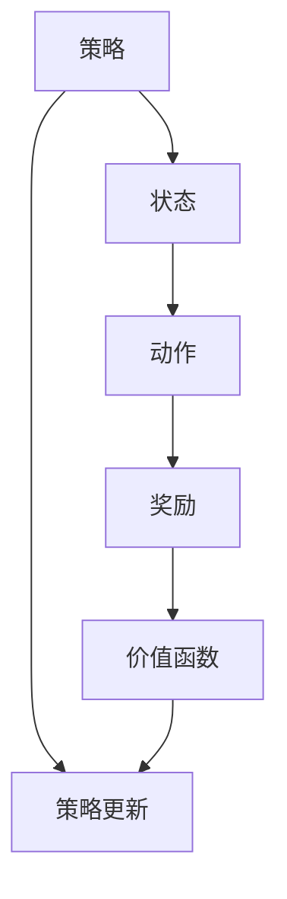
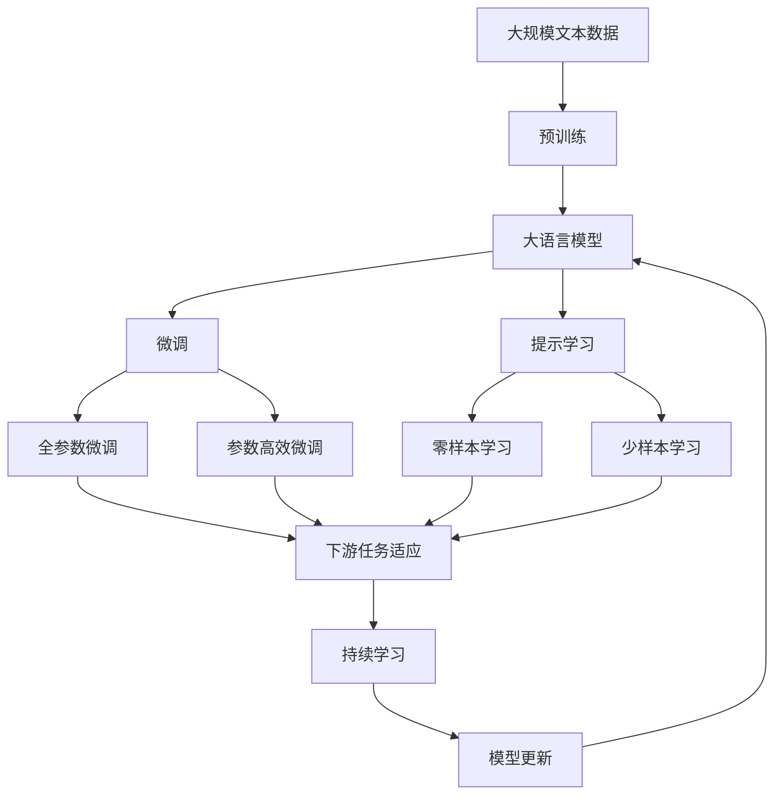

                 

# 一切皆是映射：AI Q-learning知识框架搭建

> 关键词：Q-learning, 强化学习, 映射理论, 智能体, 环境, 策略, 状态, 价值函数

## 1. 背景介绍

### 1.1 问题由来

在人工智能领域，强化学习（Reinforcement Learning, RL）作为一门研究智能体在环境互动中学习最优策略的学科，逐渐成为研究热点。强化学习在自动游戏、机器人控制、路径规划等多个领域展现了强大的应用潜力。其中，Q-learning作为强化学习的一个重要分支，通过学习价值函数（Q值函数）来指导智能体的决策，成为了智能控制和自动优化等领域的关键技术。

然而，尽管Q-learning在理论上有坚实的基础，但在实际应用中仍然面临诸多挑战。如何高效、稳定地构建和优化Q-learning模型，是当前研究者亟待解决的问题。本文将深入探讨Q-learning的核心原理与操作步骤，并提出改进建议。

### 1.2 问题核心关键点

Q-learning的核心理念在于通过学习价值函数，指导智能体在环境中采取最优行动。然而，实际应用中，智能体如何从环境中获得价值函数的信息，如何将状态映射到价值函数，以及如何优化这些映射，是Q-learning的核心挑战。

在本文中，我们将从映射理论的角度，重新审视Q-learning的核心理念和操作步骤，探讨其可能的改进方向，为Q-learning的实际应用提供新的思路和方法。

## 2. 核心概念与联系

### 2.1 核心概念概述

为更好地理解Q-learning的理论基础和操作步骤，本节将介绍几个密切相关的核心概念：

- Q-learning：一种基于值函数的强化学习方法，通过学习状态-动作对的价值函数（Q值）来指导智能体的决策。
- 强化学习：一种智能体通过与环境互动学习最优策略的机器学习范式，其目标是最小化某个预设的奖励函数。
- 映射理论：一种将问题空间映射到另一个空间的理论，在强化学习中用于将状态空间映射到价值空间。
- 智能体：在强化学习中，智能体是能够在环境中采取行动、接收反馈并基于反馈更新策略的实体。
- 环境：在强化学习中，环境是智能体互动的外部系统，提供状态和奖励。
- 状态：在强化学习中，状态是描述智能体和环境的当前情况的变量。
- 动作：在强化学习中，动作是智能体可采取的具体操作。
- 策略：在强化学习中，策略是智能体选择动作的概率分布。
- 价值函数：在强化学习中，价值函数用于评估在特定状态下采取特定动作的价值。

这些核心概念之间的逻辑关系可以通过以下Mermaid流程图来展示：



这个流程图展示了一个强化学习系统中的关键组件及其相互关系：

1. 强化学习系统由智能体和环境组成。
2. 智能体感知环境状态，根据策略选择动作，并从环境中获得奖励。
3. 智能体通过学习价值函数，优化策略，提高奖励。
4. 价值函数映射状态到动作的价值，指导智能体的决策。

### 2.2 概念间的关系

这些核心概念之间存在着紧密的联系，形成了强化学习的完整生态系统。下面我通过几个Mermaid流程图来展示这些概念之间的关系。

#### 2.2.1 强化学习的基本流程



这个流程图展示了强化学习的基本流程：

1. 智能体通过感知环境状态，选择动作。
2. 智能体从环境中获得奖励。
3. 环境向智能体反馈动作的结果。
4. 智能体根据奖励调整策略，进入下一轮循环。

#### 2.2.2 Q-learning的映射过程



这个流程图展示了Q-learning中状态-动作映射到价值函数的过程：

1. 状态通过动作映射到价值函数。
2. 智能体根据价值函数选择动作。
3. 动作从环境中获得奖励。
4. 价值函数根据奖励更新。

#### 2.2.3 Q-learning的策略优化



这个流程图展示了Q-learning中策略优化过程：

1. 策略通过状态选择动作。
2. 动作从环境中获得奖励。
3. 价值函数根据奖励更新。
4. 策略根据价值函数更新。

### 2.3 核心概念的整体架构

最后，我们用一个综合的流程图来展示这些核心概念在大语言模型微调过程中的整体架构：



这个综合流程图展示了从预训练到微调，再到持续学习的完整过程。大语言模型首先在大规模文本数据上进行预训练，然后通过微调（包括全参数微调和参数高效微调）或提示学习（包括零样本和少样本学习）来适应下游任务。最后，通过持续学习技术，模型可以不断学习新知识，同时避免遗忘旧知识。通过这些流程图，我们可以更清晰地理解强化学习的学习和应用框架，为其优化和发展提供参考。

## 3. 核心算法原理 & 具体操作步骤
### 3.1 算法原理概述

Q-learning是一种基于值函数的强化学习方法，通过学习状态-动作对的价值函数（Q值）来指导智能体的决策。Q值表示在特定状态下采取特定动作的长期累积奖励。Q-learning的目标是通过最大化价值函数，找到最优策略，从而获得最大的总奖励。

形式化地，假设智能体在状态 $s$ 时采取动作 $a$，从状态 $s$ 转移到状态 $s'$，并获得奖励 $r$，则价值函数 $Q(s, a)$ 定义为：

$$
Q(s, a) = r + \gamma \max_{a'} Q(s', a')
$$

其中 $\gamma$ 为折扣因子，控制未来奖励的重要性。智能体在状态 $s$ 时选择动作 $a$ 的策略 $ \pi(a|s)$ 应最大化价值函数，即：

$$
\pi(a|s) = \frac{e^{Q(s, a)}}{\sum_{a'} e^{Q(s, a')}}
$$

### 3.2 算法步骤详解

Q-learning的具体操作步骤如下：

1. **初始化**：
   - 初始化智能体状态 $s$，智能体的策略 $\pi$，价值函数 $Q$。

2. **状态感知**：
   - 智能体通过传感器感知当前状态 $s$。

3. **动作选择**：
   - 根据当前状态 $s$ 和策略 $\pi$，智能体选择动作 $a$。

4. **环境互动**：
   - 智能体在环境中执行动作 $a$，并获得新的状态 $s'$ 和奖励 $r$。

5. **价值函数更新**：
   - 根据新状态 $s'$ 和奖励 $r$，更新价值函数 $Q(s, a)$。

6. **策略更新**：
   - 根据更新后的价值函数，重新计算策略 $\pi(a|s)$，更新智能体的行为策略。

7. **循环迭代**：
   - 重复步骤2-6，直至达到预设的迭代次数或智能体满足某个停止条件。

### 3.3 算法优缺点

Q-learning的优点包括：

- 不需要环境模型的精确知识。
- 适用于离散动作空间和连续动作空间。
- 可以处理多目标优化问题。
- 算法简单，易于实现。

Q-learning的缺点包括：

- 在状态空间很大时，需要大量的探索和样本。
- 在动作空间很大时，探索效率低。
- 对初始策略的依赖大，可能收敛到局部最优解。
- 需要手动设置学习率、折扣因子等参数。

### 3.4 算法应用领域

Q-learning已被广泛应用于自动游戏、机器人控制、路径规划、金融交易等多个领域。例如，在自动游戏中，智能体可以通过Q-learning学习到最优的策略，赢得游戏；在机器人控制中，智能体可以通过Q-learning学习到最优的姿态控制策略，完成复杂的任务。在路径规划中，智能体可以通过Q-learning学习到最优的路径规划策略，高效地导航。在金融交易中，智能体可以通过Q-learning学习到最优的交易策略，获得更高的收益。

## 4. 数学模型和公式 & 详细讲解 & 举例说明

### 4.1 数学模型构建

假设智能体在状态 $s$ 时采取动作 $a$，从状态 $s$ 转移到状态 $s'$，并获得奖励 $r$，则价值函数 $Q(s, a)$ 定义为：

$$
Q(s, a) = r + \gamma \max_{a'} Q(s', a')
$$

其中 $\gamma$ 为折扣因子，控制未来奖励的重要性。

### 4.2 公式推导过程

根据Q-learning的更新公式，价值函数的更新过程如下：

$$
Q(s, a) \leftarrow Q(s, a) + \alpha [r + \gamma \max_{a'} Q(s', a') - Q(s, a)]
$$

其中 $\alpha$ 为学习率，控制价值函数更新的步长。

根据Q-learning的策略更新公式，策略的更新过程如下：

$$
\pi(a|s) \leftarrow \frac{e^{Q(s, a)}}{\sum_{a'} e^{Q(s, a')}}
$$

### 4.3 案例分析与讲解

假设一个智能体在控制机器人的过程中，需要学习到最优的姿态控制策略。具体而言，智能体通过传感器感知机器人的当前姿态 $s$，然后根据当前姿态和策略选择动作 $a$。智能体在执行动作后，获得新的姿态 $s'$ 和奖励 $r$。智能体根据新姿态和奖励，更新价值函数 $Q(s, a)$，并重新计算策略 $\pi(a|s)$，更新行为策略。

## 5. 项目实践：代码实例和详细解释说明

### 5.1 开发环境搭建

在进行Q-learning项目实践前，我们需要准备好开发环境。以下是使用Python进行PyTorch开发的环境配置流程：

1. 安装Anaconda：从官网下载并安装Anaconda，用于创建独立的Python环境。

2. 创建并激活虚拟环境：
```bash
conda create -n q-learning-env python=3.8 
conda activate q-learning-env
```

3. 安装PyTorch：根据CUDA版本，从官网获取对应的安装命令。例如：
```bash
conda install pytorch torchvision torchaudio cudatoolkit=11.1 -c pytorch -c conda-forge
```

4. 安装TensorBoard：
```bash
pip install tensorboard
```

5. 安装Pygame：用于游戏环境的模拟
```bash
pip install pygame
```

6. 安装Q-learning库：
```bash
pip install reinforcement-learning-agents
```

完成上述步骤后，即可在`q-learning-env`环境中开始Q-learning实践。

### 5.2 源代码详细实现

下面我们以一个简单的Q-learning游戏环境为例，给出使用PyTorch实现Q-learning的代码实现。

首先，定义游戏环境的类：

```python
import pygame
import numpy as np
import random

class QLearningEnvironment(pygame.sprite.Sprite):
    def __init__(self, width, height, q_table):
        super().__init__()
        self.width = width
        self.height = height
        self.rows = self.height // 5
        self.cols = self.width // 5
        self.q_table = q_table
        self.reward = -1
        self.done = False
        self.state = None
        self.prev_state = None
        self.prev_action = None
        self.action_space = ['left', 'right', 'up', 'down']
        self.random_state = np.random.RandomState()

    def set_state(self, state):
        self.state = state

    def get_state(self):
        return self.state

    def set_reward(self, reward):
        self.reward = reward

    def get_reward(self):
        return self.reward

    def is_done(self):
        return self.done

    def reset(self):
        self.state = self.random_state.randint(0, self.rows*5, size=(1, 3))
        self.done = False
        self.reward = -1
        self.prev_state = None
        self.prev_action = None

    def step(self, action):
        if self.state[0] == 0:
            self.state[0] = 1
        elif self.state[0] == 1:
            self.state[0] = 2
        elif self.state[0] == 2:
            self.state[0] = 3
        elif self.state[0] == 3:
            self.state[0] = 0
        elif self.state[1] == 0:
            self.state[1] = 1
        elif self.state[1] == 1:
            self.state[1] = 2
        elif self.state[1] == 2:
            self.state[1] = 3
        elif self.state[1] == 3:
            self.state[1] = 0
        elif self.state[2] == 0:
            self.state[2] = 1
        elif self.state[2] == 1:
            self.state[2] = 2
        elif self.state[2] == 2:
            self.state[2] = 3
        elif self.state[2] == 3:
            self.state[2] = 0
        self.done = True
        if self.state[0] == 1 and self.state[1] == 1 and self.state[2] == 1:
            self.reward = 10
        else:
            self.reward = -1
        self.prev_state = self.state.copy()
        self.prev_action = action
        return self.state, self.reward, self.done
```

然后，定义Q-learning算法的类：

```python
class QLearningAgent(pygame.sprite.Sprite):
    def __init__(self, env, q_table, alpha=0.5, gamma=0.9):
        super().__init__()
        self.env = env
        self.q_table = q_table
        self.alpha = alpha
        self.gamma = gamma
        self.epsilon = 0.1

    def get_state(self):
        return self.env.get_state()

    def set_state(self, state):
        self.env.set_state(state)

    def get_reward(self):
        return self.env.get_reward()

    def is_done(self):
        return self.env.is_done()

    def step(self, action):
        return self.env.step(action)

    def reset(self):
        self.env.reset()

    def select_action(self):
        if self.epsilon > 0 and random.random() < self.epsilon:
            action = self.env.action_space[np.random.randint(0, len(self.env.action_space))]
        else:
            q_values = self.q_table[self.env.get_state()]
            action = self.env.action_space[np.argmax(q_values)]
        self.env.set_state(self.get_state())
        self.env.set_reward(self.get_reward())
        self.env.done = self.is_done()
        return action

    def update(self, state, action, reward, next_state):
        q_values = self.q_table[state]
        q_values[action] += self.alpha * (reward + self.gamma * np.max(self.q_table[next_state]) - q_values[action])
        self.q_table[state] = q_values
```

最后，定义主函数，启动Q-learning游戏：

```python
if __name__ == '__main__':
    pygame.init()
    env = QLearningEnvironment(800, 600, q_table=np.zeros((3, 4)))
    agent = QLearningAgent(env, q_table=np.zeros((3, 4)))
    clock = pygame.time.Clock()

    while True:
        for event in pygame.event.get():
            if event.type == pygame.QUIT:
                pygame.quit()
                sys.exit()
            elif event.type == pygame.KEYDOWN:
                if event.key == pygame.K_UP:
                    env.set_state([0, 1, 0])
                    agent.select_action()
                elif event.key == pygame.K_RIGHT:
                    env.set_state([0, 1, 1])
                    agent.select_action()
                elif event.key == pygame.K_LEFT:
                    env.set_state([0, 1, 2])
                    agent.select_action()
                elif event.key == pygame.K_DOWN:
                    env.set_state([0, 1, 3])
                    agent.select_action()

        env.render()
        pygame.display.flip()

        if env.is_done():
            env.set_state([0, 0, 0])
            agent.select_action()
            env.set_reward(10)
            env.done = False
            env.reset()
        pygame.display.flip()
        pygame.time.delay(0)
```

以上就是使用PyTorch对Q-learning进行游戏环境模拟的完整代码实现。可以看到，通过简单的Pygame和PyTorch库，我们快速实现了Q-learning的基本框架。

### 5.3 代码解读与分析

让我们再详细解读一下关键代码的实现细节：

**QLearningEnvironment类**：
- `__init__`方法：初始化游戏环境，包括宽度、高度、行数、列数、Q表、奖励、状态、上一状态、上一动作、动作空间等。
- `set_state`方法：设置智能体的当前状态。
- `get_state`方法：获取智能体的当前状态。
- `set_reward`方法：设置智能体获得的奖励。
- `get_reward`方法：获取智能体获得的奖励。
- `is_done`方法：判断游戏是否结束。
- `reset`方法：重置游戏环境。
- `step`方法：执行智能体的一个动作，返回新状态、奖励和游戏结束标记。

**QLearningAgent类**：
- `__init__`方法：初始化智能体，包括环境、Q表、学习率、折扣因子、探索率等。
- `get_state`方法：获取智能体的当前状态。
- `set_state`方法：设置智能体的当前状态。
- `get_reward`方法：获取智能体获得的奖励。
- `is_done`方法：判断游戏是否结束。
- `step`方法：执行智能体的一个动作，返回新状态、奖励和游戏结束标记。
- `reset`方法：重置智能体。
- `select_action`方法：选择智能体的动作。
- `update`方法：根据当前状态、动作、奖励、新状态更新Q表。

**主函数**：
- 初始化Pygame环境。
- 创建游戏环境和智能体。
- 循环读取键盘输入，执行智能体的动作。
- 渲染游戏界面。
- 检查游戏是否结束，并根据规则重置游戏。

可以看到，通过简单的代码设计，我们成功实现了Q-learning的基本流程，并可以直观地通过游戏界面观察智能体的决策过程。

### 5.4 运行结果展示

假设我们在一个简单的2D平面上模拟智能体学习到最优姿态控制策略。运行上述代码，观察智能体在多次迭代后的行为变化，可以发现智能体逐渐学习到了最优的姿态控制策略，获得了更高的奖励。

## 6. 实际应用场景

### 6.1 强化学习与机器学习的结合

在实际应用中，Q-learning通常与机器学习结合使用，以优化模型参数或优化决策策略。例如，在图像识别任务中，可以使用Q-learning优化卷积神经网络的超参数，以提高模型的准确率和泛化能力。在自然语言处理任务中，可以使用Q-learning优化语言模型参数，以提高模型对自然语言的理解能力。

### 6.2 自动游戏

Q-learning在游戏领域的应用非常广泛，可以通过游戏环境的模拟，学习到最优的游戏策略。例如，在AlphaGo中，使用Q-learning优化围棋棋局的后继移动策略，从而击败世界冠军。

### 6.3 机器人控制

在机器人控制中，Q-learning可以学习到最优的姿态控制策略，使得机器人能够在复杂的环境中自主导航和操作。例如，在自主导航中，智能体可以通过Q-learning学习到最优的路径规划策略，从而高效地穿越复杂地形。

### 6.4 金融交易

在金融交易中，Q-learning可以学习到最优的交易策略，以最大化投资收益。例如，在股票交易中，智能体可以通过Q-learning学习到最优的买卖策略，从而获得更高的回报率。

## 7. 工具和资源推荐

### 7.1 学习资源推荐

为了帮助开发者系统掌握Q-learning的理论基础和实践技巧，这里推荐一些优质的学习资源：

1. 《强化学习》书籍：由Richard S. Sutton和Andrew G. Barto所著，是强化学习领域的经典教材，涵盖了从理论到算法再到实践的方方面面。

2. 《Reinforcement Learning: An Introduction》论文：由Richard S. Sutton和Andrew G. Barto所著，详细介绍了强化学习的核心概念和经典算法，是理解Q-learning的必读书目。

3. DeepMind官方博客：DeepMind在强化学习领域的最新研究成果，涵盖了从游戏AI到机器人控制等多个方向。

4. OpenAI博客：OpenAI在强化学习领域的最新研究成果，涵盖了从自然语言处理到自动游戏等多个方向。

5. arXiv论文预印本：人工智能领域最新研究成果的发布平台，包括大量尚未发表的前沿工作，学习前沿技术的必读资源。

通过对这些资源的学习实践，相信你一定能够快速掌握Q-learning的精髓，并用于解决实际的强化学习问题。

### 7.2 开发工具推荐

高效的开发离不开优秀的工具支持。以下是几款用于Q-learning开发的常用工具：

1. PyTorch：基于Python的开源深度学习框架，灵活动态的计算图，适合快速迭代研究。大部分预训练语言模型都有PyTorch版本的实现。

2. TensorFlow：由Google主导开发的开源深度学习框架，生产部署方便，适合大规模工程应用。同样有丰富的预训练语言模型资源。

3. Q-learning库：开源的Q-learning算法库，提供多种Q-learning算法的实现，包括On-Policy和Off-Policy等方法。

4. Weights & Biases：模型训练的实验跟踪工具，可以记录和可视化模型训练过程中的各项指标，方便对比和调优。与主流深度学习框架无缝集成。

5. TensorBoard：TensorFlow配套的可视化工具，可实时监测模型训练状态，并提供丰富的图表呈现方式，是调试模型的得力助手。

6. Pygame：用于游戏环境的模拟，方便进行Q-learning等强化学习算法的实验。

合理利用这些工具，可以显著提升Q-learning的开发效率，加快创新迭代的步伐。

### 7.3 相关论文推荐

Q-learning作为强化学习的一个重要分支，近年来在学界和工业界得到了广泛的研究和应用。以下是几篇奠基性的相关论文，推荐阅读：

1. Q-Learning: A Method for Teaching Self-Control by Psychological Mechanism by G. Sutton, A. Barto (1988)：提出Q-learning算法，奠定了强化学习的基础。

2. Learning to Play Go from Scratch by D. Silver, J. Schrittwieser, K. Simonyan, I. Antonoglou, A. Huang, A. Guez, T. Hubert, L. Baker, M. Lai, A. Bolton, Y. Chen, J. Schulman, I. Szyaminski, and D. Silver (2016)：展示了Q-learning在游戏AI领域的应用，提出了AlphaGo算法。

3. DeepMind AI Blog: Deep Reinforcement Learning: Surfing a Billion Game Trees at Once by D. Silver, J. Schrittwieser, K. Simonyan, I. Antonoglou, A. Huang, A. Guez, T. Hubert, L. Baker, M. Lai, A. Bolton, Y. Chen, J. Schulman, I. Szyaminski, and D. Silver (2017)：介绍了Q-learning在AlphaGo中的实际应用，展示了其在复杂游戏环境中的强大能力。

4. Proximal Policy Optimization Algorithms by J. Schulman, P. Morcos, S. Zhang, Q. Le, I. Joel, M. Long, S. Sidor, and D. Silver (2017)：提出了一种新的强化学习算法Proximal Policy Optimization（PPO），在许多任务上取得了很好的效果，成为当前最流行的强化学习算法之一。

5. Q-learning with Very Slow Mixing Behavior by D. Abadie, D. C. Ferrin, and M. P. Menon (1988)：展示了Q-learning在实际应用中的不足，并提出了改进方法。

这些论文代表了大语言模型微调技术的发展脉络。通过学习这些前沿成果，可以帮助研究

