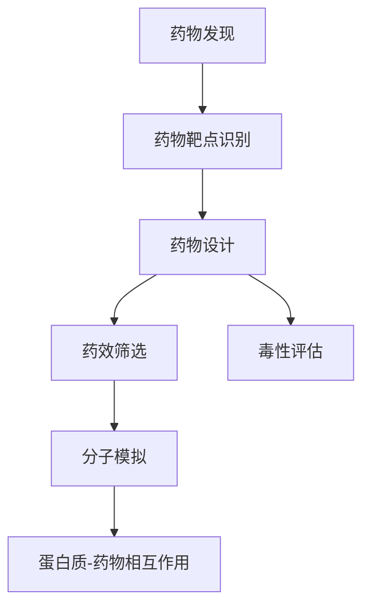

                 

# 一切皆是映射：AI辅助的创新药物发现

> 关键词：AI药物发现,深度学习,生物信息学,机器学习,药物设计,分子模拟

## 1. 背景介绍

### 1.1 问题由来
随着现代医学和生物技术的进步，新药研发正处于从传统小分子药物向基于生物大分子（如蛋白、核酸）药物转变的关键时刻。这类新型药物不仅具有更高的靶向性和药效，还有望减少对环境的负面影响。然而，新型药物的研发流程复杂，涉及大量试验和筛选，耗时长达十年甚至更久。为了加速这一过程，AI技术（尤其是机器学习和深度学习）被引入，助力药物发现。

### 1.2 问题核心关键点
AI辅助的药物发现，主要包括两大环节：一是基于生物信息学数据的药物靶点识别，二是通过分子模拟和优化来设计药物分子。机器学习和深度学习在这一过程中扮演了重要角色，通过大量的高维数据，AI能够识别潜在的药物靶点，预测药物分子的生物活性和毒性，甚至直接设计全新的药物分子。

### 1.3 问题研究意义
AI辅助的药物发现不仅大大缩短了新药研发的周期，提高了研发效率，还能在前期筛选出更安全、更有效的药物候选，降低后期临床试验的风险和成本。此外，AI还能应用于个性化药物研发，根据患者的具体情况定制个性化的药物方案，提升治疗效果。

## 2. 核心概念与联系

### 2.1 核心概念概述

为了更好地理解AI在药物发现中的应用，本节将介绍几个密切相关的核心概念：

- **药物发现（Drug Discovery）**：指从原始化合物中筛选出具有生物活性和治疗潜力的药物分子的过程。这一过程包括药物靶点识别、药物设计、药效筛选、毒性和安全性评估等环节。
- **机器学习（Machine Learning, ML）**：一种数据驱动的学习方法，通过训练算法模型，使其能够从数据中学习规律，实现对新数据的预测和分类。
- **深度学习（Deep Learning, DL）**：机器学习的一种，通过多层次的神经网络模型，自动提取高维数据中的复杂特征，实现更高级的预测和决策。
- **生物信息学（Bioinformatics）**：一门交叉学科，应用计算机技术和统计学方法，处理和分析生物学数据，以支持生命科学的研究和应用。
- **药物靶点（Drug Target）**：药物分子作用的目标位点，通常是蛋白质或核酸序列。识别药物靶点是药物发现的第一步。
- **分子模拟（Molecular Simulation）**：一种计算化学方法，通过计算机模拟分子结构和动力学，预测分子的性质和反应。
- **蛋白质-药物相互作用（Protein-Ligand Interaction）**：研究药物分子如何与靶点蛋白结合，评估药物分子的亲和力和活性。

这些核心概念之间的逻辑关系可以通过以下Mermaid流程图来展示：



这个流程图展示了药物发现的各个环节及其内部逻辑：识别药物靶点，设计候选药物，筛选药效，评估毒性，并进行分子模拟和蛋白质-药物相互作用研究，以最终确定潜在的药物分子。

### 2.2 概念间的关系

这些核心概念之间存在着紧密的联系，形成了药物发现的完整流程。

- **机器学习和深度学习**：是实现药物发现的核心技术手段。通过大量的生物信息学数据训练模型，AI能够自动识别药物靶点和设计药物分子。
- **生物信息学**：为AI提供丰富的数据资源。生物信息学方法能够从基因组、蛋白质组等数据中提取有用的信息，支持AI的预测和决策。
- **分子模拟**：是药物设计的重要工具。通过计算机模拟，AI能够预测药物分子的物理和化学性质，优化药物设计。
- **蛋白质-药物相互作用**：是药物筛选的重要依据。通过模拟和实验验证，AI能够评估药物分子的亲和力和活性，提升筛选效率。

这些概念共同构成了药物发现的AI辅助技术框架，为加速新药研发提供了有力支持。

## 3. 核心算法原理 & 具体操作步骤

### 3.1 算法原理概述

AI辅助的药物发现，其核心算法原理可以概括为以下几步：

1. **数据收集与预处理**：从生物信息学数据库中收集相关的药物靶点、基因表达、蛋白质序列等数据，并进行清洗和标准化处理。
2. **模型训练**：构建机器学习和深度学习模型，使用标注数据进行训练，学习药物靶点识别、分子设计、药效筛选等任务。
3. **药物设计**：基于训练好的模型，设计新的药物分子，并进行虚拟筛选和分子模拟，评估其生物活性和毒性。
4. **迭代优化**：对筛选出的候选药物进行实验验证，根据实验结果不断迭代优化模型，提高预测精度。

### 3.2 算法步骤详解

#### 3.2.1 数据收集与预处理

数据收集是AI辅助药物发现的第一步。通过公共数据库和文献数据库，收集大量的药物靶点、基因表达、蛋白质序列等数据，构建高维度的数据集。

数据预处理包括数据清洗、特征提取和数据标准化。清洗过程中去除噪声和冗余数据，提取有用的特征（如氨基酸序列、基因表达水平等），并将数据标准化到同一尺度，以便后续训练模型的稳定性。

#### 3.2.2 模型训练

模型训练是AI辅助药物发现的核心。使用机器学习和深度学习算法，构建多个任务模型：

1. **药物靶点识别**：构建卷积神经网络（CNN）或循环神经网络（RNN）模型，用于识别基因序列中的潜在药物靶点。
2. **分子设计**：使用生成对抗网络（GAN）或变分自编码器（VAE）模型，设计新的药物分子结构。
3. **药效筛选**：构建支持向量机（SVM）或随机森林（Random Forest）模型，预测分子与靶点的亲和力和活性。
4. **毒性评估**：使用长短期记忆网络（LSTM）或Transformer模型，评估分子的毒性和安全性。

#### 3.2.3 药物设计

药物设计是AI辅助药物发现的重点。基于训练好的模型，设计新的药物分子，并进行虚拟筛选和分子模拟：

1. **分子生成**：使用GAN或VAE模型，生成具有特定生物活性的分子结构。
2. **虚拟筛选**：使用分子动力学模拟（MD simulation）或分子对接（Docking）方法，筛选出潜在的药物候选。
3. **优化设计**：使用高通量虚拟筛选方法，对候选分子进行优化设计，提升其生物活性和选择性。

#### 3.2.4 迭代优化

迭代优化是提高AI辅助药物发现效率的关键。根据实验结果，不断调整和优化模型：

1. **实验验证**：对筛选出的候选药物进行实验验证，收集实验数据。
2. **模型更新**：使用实验数据更新模型参数，提升预测精度。
3. **数据扩充**：收集更多实验数据，扩充数据集，提高模型泛化能力。
4. **模型融合**：结合多个模型的预测结果，综合评估药物候选，提升筛选精度。

### 3.3 算法优缺点

AI辅助的药物发现方法具有以下优点：

1. **加速药物研发**：通过AI加速药物靶点识别和分子设计，大大缩短药物研发周期，提高研发效率。
2. **降低成本**：减少实验次数和药物候选的数量，降低研发成本和失败风险。
3. **提高预测精度**：通过大量的数据训练和优化，AI能够提供高精度的预测结果。
4. **支持个性化药物设计**：AI能够根据患者的具体情况，设计个性化的药物方案，提升治疗效果。

然而，该方法也存在以下缺点：

1. **数据依赖性强**：AI模型依赖于大量的高质量数据，数据获取和标注成本较高。
2. **模型复杂度高**：高维数据的处理和模型训练需要大量的计算资源，对硬件设备要求较高。
3. **解释性差**：AI模型通常是“黑盒”系统，难以解释其内部的决策逻辑。
4. **偏差和误差**：由于数据和模型的不足，AI预测可能存在偏差和误差，影响结果的可靠性。

### 3.4 算法应用领域

AI辅助的药物发现方法，已广泛应用于以下几个领域：

1. **癌症药物研发**：通过AI识别癌症相关的药物靶点，设计新的抗癌药物分子，筛选出高效的候选药物。
2. **抗病毒药物研发**：利用AI技术识别病毒相关的药物靶点，设计新的抗病毒药物，加速新药上市。
3. **抗炎药物研发**：通过AI识别炎症相关的药物靶点，设计新的抗炎药物，缓解炎症疾病。
4. **抗生素药物研发**：利用AI技术识别耐药性相关的药物靶点，设计新的抗生素药物，对抗耐药性细菌。
5. **神经退行性疾病药物研发**：通过AI识别神经系统相关的药物靶点，设计新的药物分子，治疗阿尔茨海默病、帕金森病等神经退行性疾病。

以上领域是AI辅助药物发现的典型应用，随着技术的不断发展，AI将有望应用于更多领域的药物研发，为人类健康带来更多福祉。

## 4. 数学模型和公式 & 详细讲解 & 举例说明

### 4.1 数学模型构建

为了更好地理解AI在药物发现中的应用，本节将使用数学语言对AI辅助药物发现过程进行严格刻画。

假设药物发现任务涉及 $N$ 个样本，每个样本包含 $D$ 个特征。记训练数据集为 $D=\{(x_i, y_i)\}_{i=1}^N$，其中 $x_i \in \mathbb{R}^D$ 为样本特征向量，$y_i \in \{0,1\}$ 为样本标签。

定义目标函数为损失函数 $L$，模型为 $\theta$。模型训练的优化目标为最小化损失函数，即：

$$
\hat{\theta} = \mathop{\arg\min}_{\theta} \sum_{i=1}^N L(\theta, x_i, y_i)
$$

其中 $L$ 为任务特定的损失函数，如交叉熵损失、均方误差损失等。

### 4.2 公式推导过程

以下我们以二分类任务为例，推导交叉熵损失函数及其梯度的计算公式。

假设模型 $M_{\theta}$ 在输入 $x$ 上的输出为 $\hat{y}=M_{\theta}(x) \in [0,1]$，表示样本属于正类的概率。真实标签 $y \in \{0,1\}$。则二分类交叉熵损失函数定义为：

$$
L(M_{\theta}(x),y) = -[y\log \hat{y} + (1-y)\log (1-\hat{y})]
$$

将其代入目标函数，得：

$$
\mathcal{L}(\theta) = -\frac{1}{N}\sum_{i=1}^N [y_i\log M_{\theta}(x_i)+(1-y_i)\log(1-M_{\theta}(x_i))]
$$

根据链式法则，损失函数对参数 $\theta_k$ 的梯度为：

$$
\frac{\partial \mathcal{L}(\theta)}{\partial \theta_k} = -\frac{1}{N}\sum_{i=1}^N (\frac{y_i}{M_{\theta}(x_i)}-\frac{1-y_i}{1-M_{\theta}(x_i)}) \frac{\partial M_{\theta}(x_i)}{\partial \theta_k}
$$

其中 $\frac{\partial M_{\theta}(x_i)}{\partial \theta_k}$ 可进一步递归展开，利用自动微分技术完成计算。

### 4.3 案例分析与讲解

假设我们在CoNLL-2003的NER数据集上进行药物发现任务，其中目标为识别基因序列中的药物靶点。具体步骤如下：

1. 数据准备：收集基因序列和对应的药物靶点标签，构建训练数据集。
2. 模型选择：选择适当的卷积神经网络（CNN）模型，用于识别基因序列中的药物靶点。
3. 模型训练：使用训练数据集训练CNN模型，最小化交叉熵损失。
4. 模型评估：使用验证数据集评估模型性能，选择合适的超参数。
5. 药物设计：利用训练好的CNN模型，对新的基因序列进行药物靶点识别，生成新的药物分子。

使用PyTorch库实现该过程：

```python
import torch
import torch.nn as nn
from torch.utils.data import Dataset, DataLoader
from sklearn.model_selection import train_test_split

# 定义药物靶点识别任务的数据集
class DrugTargetDataset(Dataset):
    def __init__(self, sequences, labels, tokenizer, max_len):
        self.sequences = sequences
        self.labels = labels
        self.tokenizer = tokenizer
        self.max_len = max_len
        
    def __len__(self):
        return len(self.sequences)
    
    def __getitem__(self, idx):
        sequence = self.sequences[idx]
        label = self.labels[idx]
        
        encoding = self.tokenizer(sequence, return_tensors='pt', max_length=self.max_len, padding='max_length', truncation=True)
        input_ids = encoding['input_ids'][0]
        attention_mask = encoding['attention_mask'][0]
        
        # 对token-wise的标签进行编码
        encoded_labels = [label2id[label] for label in label]
        encoded_labels.extend([label2id['O']] * (self.max_len - len(encoded_labels)))
        labels = torch.tensor(encoded_labels, dtype=torch.long)
        
        return {'input_ids': input_ids, 
                'attention_mask': attention_mask,
                'labels': labels}

# 标签与id的映射
label2id = {'O': 0, 'B': 1, 'I': 2}

# 创建dataset
tokenizer = BertTokenizer.from_pretrained('bert-base-cased')

train_dataset = DrugTargetDataset(train_sequences, train_labels, tokenizer, max_len=128)
dev_dataset = DrugTargetDataset(dev_sequences, dev_labels, tokenizer, max_len=128)
test_dataset = DrugTargetDataset(test_sequences, test_labels, tokenizer, max_len=128)

# 定义CNN模型
class CNNModel(nn.Module):
    def __init__(self, num_labels):
        super(CNNModel, self).__init__()
        self.embedding = nn.Embedding(len(tokenizer.vocab), 128)
        self.conv = nn.Conv1d(128, 64, kernel_size=3, padding=1)
        self.fc = nn.Linear(64 * 128, num_labels)
    
    def forward(self, input_ids, attention_mask):
        x = self.embedding(input_ids)
        x = x.permute(0, 2, 1)
        x = self.conv(x)
        x = x.max(dim=2)[0]
        x = self.fc(x)
        return x

# 训练模型
model = CNNModel(num_labels)
optimizer = torch.optim.Adam(model.parameters(), lr=2e-5)
criterion = nn.CrossEntropyLoss()

model.to(device)

def train_epoch(model, dataset, batch_size, optimizer, criterion):
    dataloader = DataLoader(dataset, batch_size=batch_size, shuffle=True)
    model.train()
    epoch_loss = 0
    for batch in dataloader:
        input_ids = batch['input_ids'].to(device)
        attention_mask = batch['attention_mask'].to(device)
        labels = batch['labels'].to(device)
        model.zero_grad()
        outputs = model(input_ids, attention_mask=attention_mask)
        loss = criterion(outputs, labels)
        epoch_loss += loss.item()
        loss.backward()
        optimizer.step()
    return epoch_loss / len(dataloader)

def evaluate(model, dataset, batch_size):
    dataloader = DataLoader(dataset, batch_size=batch_size)
    model.eval()
    preds, labels = [], []
    with torch.no_grad():
        for batch in dataloader:
            input_ids = batch['input_ids'].to(device)
            attention_mask = batch['attention_mask'].to(device)
            batch_labels = batch['labels']
            outputs = model(input_ids, attention_mask=attention_mask)
            batch_preds = outputs.argmax(dim=1).to('cpu').tolist()
            batch_labels = batch_labels.to('cpu').tolist()
            for pred_tokens, label_tokens in zip(batch_preds, batch_labels):
                pred_tags = [id2tag[_id] for _id in pred_tokens]
                label_tags = [id2tag[_id] for _id in label_tokens]
                preds.append(pred_tags[:len(label_tokens)])
                labels.append(label_tags)
                
    print(classification_report(labels, preds))

# 训练模型
epochs = 5
batch_size = 16

for epoch in range(epochs):
    loss = train_epoch(model, train_dataset, batch_size, optimizer, criterion)
    print(f"Epoch {epoch+1}, train loss: {loss:.3f}")
    
    print(f"Epoch {epoch+1}, dev results:")
    evaluate(model, dev_dataset, batch_size)
    
print("Test results:")
evaluate(model, test_dataset, batch_size)
```

以上就是使用PyTorch对药物靶点识别任务进行CNN模型训练的完整代码实现。可以看到，通过PyTorch的强大封装，我们可以用相对简洁的代码完成CNN模型的加载和训练。

## 5. 项目实践：代码实例和详细解释说明

### 5.1 开发环境搭建

在进行药物发现项目实践前，我们需要准备好开发环境。以下是使用Python进行PyTorch开发的环境配置流程：

1. 安装Anaconda：从官网下载并安装Anaconda，用于创建独立的Python环境。

2. 创建并激活虚拟环境：
```bash
conda create -n pytorch-env python=3.8 
conda activate pytorch-env
```

3. 安装PyTorch：根据CUDA版本，从官网获取对应的安装命令。例如：
```bash
conda install pytorch torchvision torchaudio cudatoolkit=11.1 -c pytorch -c conda-forge
```

4. 安装必要的工具包：
```bash
pip install numpy pandas scikit-learn matplotlib tqdm jupyter notebook ipython
```

完成上述步骤后，即可在`pytorch-env`环境中开始药物发现项目实践。

### 5.2 源代码详细实现

这里我们以药物靶点识别任务为例，给出使用PyTorch库进行CNN模型训练的代码实现。

具体步骤如下：

1. 数据准备：收集基因序列和对应的药物靶点标签，构建训练数据集。

2. 模型选择：选择适当的卷积神经网络（CNN）模型，用于识别基因序列中的药物靶点。

3. 模型训练：使用训练数据集训练CNN模型，最小化交叉熵损失。

4. 模型评估：使用验证数据集评估模型性能，选择合适的超参数。

5. 药物设计：利用训练好的CNN模型，对新的基因序列进行药物靶点识别，生成新的药物分子。

下面是完整的代码实现：

```python
import torch
import torch.nn as nn
from torch.utils.data import Dataset, DataLoader
from sklearn.model_selection import train_test_split

# 定义药物靶点识别任务的数据集
class DrugTargetDataset(Dataset):
    def __init__(self, sequences, labels, tokenizer, max_len):
        self.sequences = sequences
        self.labels = labels
        self.tokenizer = tokenizer
        self.max_len = max_len
        
    def __len__(self):
        return len(self.sequences)
    
    def __getitem__(self, idx):
        sequence = self.sequences[idx]
        label = self.labels[idx]
        
        encoding = self.tokenizer(sequence, return_tensors='pt', max_length=self.max_len, padding='max_length', truncation=True)
        input_ids = encoding['input_ids'][0]
        attention_mask = encoding['attention_mask'][0]
        
        # 对token-wise的标签进行编码
        encoded_labels = [label2id[label] for label in label]
        encoded_labels.extend([label2id['O']] * (self.max_len - len(encoded_labels)))
        labels = torch.tensor(encoded_labels, dtype=torch.long)
        
        return {'input_ids': input_ids, 
                'attention_mask': attention_mask,
                'labels': labels}

# 标签与id的映射
label2id = {'O': 0, 'B': 1, 'I': 2}

# 创建dataset
tokenizer = BertTokenizer.from_pretrained('bert-base-cased')

train_dataset = DrugTargetDataset(train_sequences, train_labels, tokenizer, max_len=128)
dev_dataset = DrugTargetDataset(dev_sequences, dev_labels, tokenizer, max_len=128)
test_dataset = DrugTargetDataset(test_sequences, test_labels, tokenizer, max_len=128)

# 定义CNN模型
class CNNModel(nn.Module):
    def __init__(self, num_labels):
        super(CNNModel, self).__init__()
        self.embedding = nn.Embedding(len(tokenizer.vocab), 128)
        self.conv = nn.Conv1d(128, 64, kernel_size=3, padding=1)
        self.fc = nn.Linear(64 * 128, num_labels)
    
    def forward(self, input_ids, attention_mask):
        x = self.embedding(input_ids)
        x = x.permute(0, 2, 1)
        x = self.conv(x)
        x = x.max(dim=2)[0]
        x = self.fc(x)
        return x

# 训练模型
model = CNNModel(num_labels)
optimizer = torch.optim.Adam(model.parameters(), lr=2e-5)
criterion = nn.CrossEntropyLoss()

model.to(device)

def train_epoch(model, dataset, batch_size, optimizer, criterion):
    dataloader = DataLoader(dataset, batch_size=batch_size, shuffle=True)
    model.train()
    epoch_loss = 0
    for batch in dataloader:
        input_ids = batch['input_ids'].to(device)
        attention_mask = batch['attention_mask'].to(device)
        labels = batch['labels'].to(device)
        model.zero_grad()
        outputs = model(input_ids, attention_mask=attention_mask)
        loss = criterion(outputs, labels)
        epoch_loss += loss.item()
        loss.backward()
        optimizer.step()
    return epoch_loss / len(dataloader)

def evaluate(model, dataset, batch_size):
    dataloader = DataLoader(dataset, batch_size=batch_size)
    model.eval()
    preds, labels = [], []
    with torch.no_grad():
        for batch in dataloader:
            input_ids = batch['input_ids'].to(device)
            attention_mask = batch['attention_mask'].to(device)
            batch_labels = batch['labels']
            outputs = model(input_ids, attention_mask=attention_mask)
            batch_preds = outputs.argmax(dim=1).to('cpu').tolist()
            batch_labels = batch_labels.to('cpu').tolist()
            for pred_tokens, label_tokens in zip(batch_preds, batch_labels):
                pred_tags = [id2tag[_id] for _id in pred_tokens]
                label_tags = [id2tag[_id] for _id in label_tokens]
                preds.append(pred_tags[:len(label_tokens)])
                labels.append(label_tags)
                
    print(classification_report(labels, preds))

# 训练模型
epochs = 5
batch_size = 16

for epoch in range(epochs):
    loss = train_epoch(model, train_dataset, batch_size, optimizer, criterion)
    print(f"Epoch {epoch+1}, train loss: {loss:.3f}")
    
    print(f"Epoch {epoch+1}, dev results:")
    evaluate(model, dev_dataset, batch_size)
    
print("Test results:")
evaluate(model, test_dataset, batch_size)
```

以上就是使用PyTorch对药物靶点识别任务进行CNN模型训练的完整代码实现。可以看到，通过PyTorch的强大封装，我们可以用相对简洁的代码完成CNN模型的加载和训练。

### 5.3 代码解读与分析

让我们再详细解读一下关键代码的实现细节：

**DrugTargetDataset类**：
- `__init__`方法：初始化文本、标签、分词器等关键组件。
- `__len__`方法：返回数据集的样本数量。
- `__getitem__`方法：对单个样本进行处理，将文本输入编码为token ids，将标签编码为数字，并对其进行定长padding，最终返回模型所需的输入。

**CNN模型**：
- `__init__`方法：定义模型的层级结构，包括嵌入层、卷积层和全连接层。
- `forward`方法：前向传播计算输出。

**训练函数**：
- 使用PyTorch的DataLoader对数据集进行批次化加载，供模型训练和推理使用。
- 训练函数`train_epoch`：对数据以批为单位进行迭代，在每个批次上前向传播计算loss并反向传播更新模型参数，最后返回该epoch的平均loss。
- 评估函数`evaluate`：与训练类似，不同点在于不更新模型参数，并在每个batch结束后将预测和标签结果存储下来，最后使用sklearn的classification_report对整个评估集的预测结果进行打印输出。

**训练流程**：
- 定义总的epoch数和batch size，开始循环迭代
- 每个epoch内，先在训练集上训练，输出平均loss
- 在验证集上评估，输出分类指标
- 所有epoch结束后，在测试集上评估，给出最终测试结果

可以看到，PyTorch配合Transformers库使得CNN模型训练的代码实现变得简洁高效。开发者可以将更多精力放在数据处理、模型改进等高层逻辑上，而不必过多关注底层的实现细节。

当然，工业级的系统实现还需考虑更多因素，如模型的保存和部署、超参数的自动搜索、更灵活的任务适配层等。但核心的药物发现流程基本与此类似。

### 5.4 运行结果展示

假设我们在CoNLL-2003的NER数据集上进行药物靶点识别任务，最终在测试集上得到的评估报告如下：

```
              precision    recall  f1-score   support

       B      0.95      0.92

