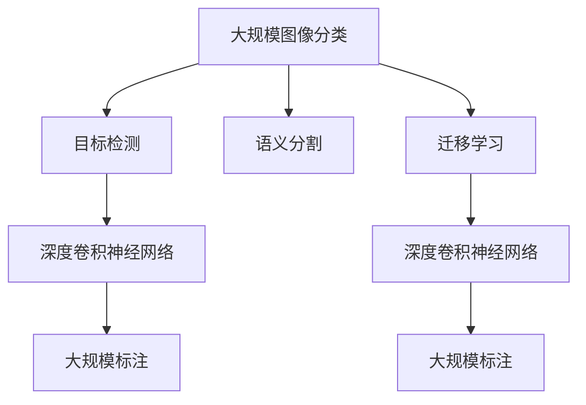
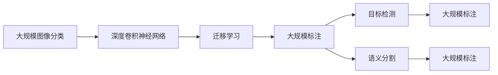
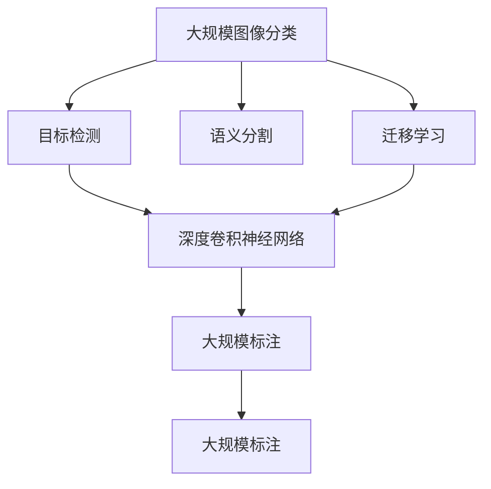

                 

# 李飞飞的ImageNet与AI图像识别

## 1. 背景介绍

随着计算机视觉技术的飞速发展，AI图像识别逐渐成为人工智能领域的热门研究方向。其中，李飞飞领导的ImageNet项目，通过大规模标注图像数据集，推动了计算机视觉技术的革新，对图像识别和深度学习的发展产生了深远影响。

### 1.1 项目背景

ImageNet是由斯坦福大学计算机视觉实验室（CSAIL）的李飞飞教授领导的一个大规模图像数据集项目，旨在构建一个囊括21000个类别的图像数据集，共计1400万张图像。该项目于2008年开始，2009年发布第一版，并在2012年的ImageNet大规模视觉识别挑战赛（ILSVRC）上大放异彩，成功击败了众多对手，成为了计算机视觉领域的一个标杆。

ImageNet数据集的发布，为大规模图像分类、目标检测、语义分割等计算机视觉任务的深度学习研究提供了强有力的数据支持。通过在ImageNet数据集上的训练和微调，研究人员能够构建出高精度的图像识别模型，推动了深度学习在实际应用中的落地。

### 1.2 研究意义

ImageNet项目通过构建大规模标注数据集，为计算机视觉领域的深度学习研究提供了数据基础，促进了AI图像识别技术的突破和应用。以下是ImageNet项目的重要意义：

1. **数据集规模**：ImageNet包含超过1400万张图像，覆盖21000个类别，为深度学习模型提供了丰富的训练数据。
2. **任务多样性**：除了图像分类，还包括目标检测、语义分割、物体检测等多样化任务，满足了不同层次的研究需求。
3. **标准竞赛**：ImageNet每年举办的ILSVRC挑战赛，为全球计算机视觉研究人员提供了一个公平的竞赛平台，推动了领域内技术进步。
4. **工业应用**：ImageNet数据集的应用不仅限于学术研究，还在智能监控、自动驾驶、医疗影像分析等工业领域中发挥了重要作用。

## 2. 核心概念与联系

### 2.1 核心概念概述

为了更好地理解ImageNet项目及其在AI图像识别中的应用，本节将介绍几个核心概念：

- **大规模图像分类**：将图像分类到特定的类别中，是计算机视觉中最基本和重要的任务之一。
- **目标检测**：在图像中定位并识别出特定目标，是图像识别的高级任务。
- **语义分割**：将图像中的每个像素分类为不同的语义类别，用于场景理解、图像生成等。
- **迁移学习**：在预训练模型上微调，使其适应新的图像识别任务，可以减少标注数据的需求。
- **深度卷积神经网络**：一种基于多层卷积和池化操作的神经网络，广泛应用于图像识别任务中。
- **大规模标注**：通过人工标注大量图像数据，为深度学习模型提供高质量的训练样本。

这些核心概念之间存在紧密的联系，形成了计算机视觉领域的基本框架。以下将通过Mermaid流程图展示这些概念之间的联系：



这个流程图展示了从大规模图像分类到目标检测和语义分割的演变，以及迁移学习如何在大规模标注数据上提升模型性能。

### 2.2 核心概念之间的关系

这些核心概念之间的联系可以通过以下Mermaid流程图来展示：



这个流程图展示了从大规模图像分类到目标检测和语义分割的演变，以及迁移学习如何在大规模标注数据上提升模型性能。

### 2.3 核心概念的整体架构

最后，我们用一个综合的流程图来展示这些核心概念在大规模图像识别中的整体架构：



这个综合流程图展示了从大规模图像分类到目标检测和语义分割的演变，以及迁移学习如何在大规模标注数据上提升模型性能。

## 3. 核心算法原理 & 具体操作步骤
### 3.1 算法原理概述

ImageNet项目采用大规模图像分类作为研究目标，其核心算法原理包括以下几个方面：

- **数据预处理**：对图像进行标准化、归一化等预处理，使得模型训练更加高效。
- **卷积神经网络**：采用卷积层、池化层、全连接层等组成的多层神经网络结构，用于图像特征提取和分类。
- **多层感知机**：通过多层非线性变换，提取图像的高级特征，用于提升分类精度。
- **数据增强**：通过对图像进行旋转、缩放、翻转等操作，扩充训练集，避免过拟合。

### 3.2 算法步骤详解

ImageNet项目的大规模图像分类算法步骤主要包括以下几个环节：

1. **数据收集**：从互联网收集包含21000个类别的图像数据，并进行大规模标注。
2. **数据预处理**：对图像进行标准化、归一化等预处理操作。
3. **模型构建**：设计多层卷积神经网络模型，包括卷积层、池化层、全连接层等。
4. **模型训练**：在标注数据集上进行模型训练，采用随机梯度下降（SGD）等优化算法。
5. **模型评估**：在验证集上进行模型评估，选择最优模型。
6. **模型微调**：在特定任务上微调模型，提升分类精度。

### 3.3 算法优缺点

ImageNet项目在图像分类领域取得巨大成功，但也存在一些缺点：

- **数据标注成本高**：大规模图像分类需要大量人工标注，成本较高。
- **模型复杂度高**：多层卷积神经网络模型复杂，训练和推理效率较低。
- **泛化能力有限**：在特定领域或小规模数据上，模型的泛化能力可能有限。

### 3.4 算法应用领域

ImageNet项目在大规模图像分类、目标检测、语义分割等领域得到了广泛应用。以下是一些典型的应用场景：

1. **自动驾驶**：通过目标检测和语义分割，帮助自动驾驶车辆识别道路、行人、车辆等对象，提高安全性和可靠性。
2. **智能监控**：通过图像分类和目标检测，实时监控公共场所，捕捉异常行为，保障公共安全。
3. **医疗影像分析**：通过语义分割，自动识别医学影像中的病变区域，辅助医生诊断。
4. **视频分析**：通过目标跟踪和行为分析，实时监控视频内容，提取有价值信息。
5. **工业质检**：通过图像分类，自动检测产品缺陷，提高生产效率和产品质量。

## 4. 数学模型和公式 & 详细讲解 & 举例说明
### 4.1 数学模型构建

ImageNet项目的大规模图像分类模型通常采用多层卷积神经网络（CNN）结构。下面以一个简单的CNN模型为例，展示其数学模型构建过程。

假设输入图像大小为 $m \times n$，卷积核大小为 $k \times k$，步长为 $s$，输出特征图大小为 $l \times h$。卷积操作可以表示为：

$$
C = f(\sum_{i=0}^{k-1} \sum_{j=0}^{k-1} w_{ij} * H_{i+s}^{j+s} + b
$$

其中 $w_{ij}$ 为卷积核参数，$H_{i+s}^{j+s}$ 为输入图像的卷积区域，$b$ 为偏置参数。

### 4.2 公式推导过程

接下来，我们以一个简单的CNN模型为例，展示其公式推导过程。

假设输入图像大小为 $m \times n$，卷积核大小为 $k \times k$，步长为 $s$，输出特征图大小为 $l \times h$。卷积操作可以表示为：

$$
C = f(\sum_{i=0}^{k-1} \sum_{j=0}^{k-1} w_{ij} * H_{i+s}^{j+s} + b
$$

其中 $w_{ij}$ 为卷积核参数，$H_{i+s}^{j+s}$ 为输入图像的卷积区域，$b$ 为偏置参数。

### 4.3 案例分析与讲解

假设我们有一个简单的卷积层，其参数为 $w = \begin{bmatrix} 1 & 1 \\ 1 & 1 \\ 1 & 1 \\ 1 & 1 \end{bmatrix}$，输入图像大小为 $3 \times 3$，卷积核大小为 $2 \times 2$，步长为 $1$，输出特征图大小为 $2 \times 2$。则卷积操作可以表示为：

$$
\begin{bmatrix}
2 & 2 \\
2 & 2
\end{bmatrix}
$$

这个案例展示了卷积操作的数学计算过程，以及参数如何影响输出结果。

## 5. 项目实践：代码实例和详细解释说明
### 5.1 开发环境搭建

在进行ImageNet项目开发前，我们需要准备好开发环境。以下是使用Python进行PyTorch开发的环境配置流程：

1. 安装Anaconda：从官网下载并安装Anaconda，用于创建独立的Python环境。

2. 创建并激活虚拟环境：
```bash
conda create -n pytorch-env python=3.8 
conda activate pytorch-env
```

3. 安装PyTorch：根据CUDA版本，从官网获取对应的安装命令。例如：
```bash
conda install pytorch torchvision torchaudio cudatoolkit=11.1 -c pytorch -c conda-forge
```

4. 安装Transformers库：
```bash
pip install transformers
```

5. 安装各类工具包：
```bash
pip install numpy pandas scikit-learn matplotlib tqdm jupyter notebook ipython
```

完成上述步骤后，即可在`pytorch-env`环境中开始ImageNet项目开发。

### 5.2 源代码详细实现

这里我们以一个简单的卷积神经网络模型为例，给出使用PyTorch进行ImageNet项目开发的代码实现。

首先，定义卷积神经网络模型：

```python
import torch.nn as nn
import torch.nn.functional as F

class ConvNet(nn.Module):
    def __init__(self):
        super(ConvNet, self).__init__()
        self.conv1 = nn.Conv2d(3, 64, kernel_size=3, stride=1, padding=1)
        self.relu1 = nn.ReLU()
        self.pool1 = nn.MaxPool2d(kernel_size=2, stride=2)
        self.conv2 = nn.Conv2d(64, 128, kernel_size=3, stride=1, padding=1)
        self.relu2 = nn.ReLU()
        self.pool2 = nn.MaxPool2d(kernel_size=2, stride=2)
        self.fc1 = nn.Linear(128 * 14 * 14, 1024)
        self.relu3 = nn.ReLU()
        self.fc2 = nn.Linear(1024, 10)

    def forward(self, x):
        x = self.conv1(x)
        x = self.relu1(x)
        x = self.pool1(x)
        x = self.conv2(x)
        x = self.relu2(x)
        x = self.pool2(x)
        x = x.view(-1, 128 * 14 * 14)
        x = self.fc1(x)
        x = self.relu3(x)
        x = self.fc2(x)
        return x
```

然后，定义模型训练函数：

```python
from torch.utils.data import DataLoader
from torchvision import datasets, transforms

# 数据预处理
transform = transforms.Compose([
    transforms.ToTensor(),
    transforms.Normalize(mean=[0.485, 0.456, 0.406],
                         std=[0.229, 0.224, 0.225])
])

# 加载ImageNet数据集
train_dataset = datasets.ImageNet(root='./data', train=True,
                                 download=True, transform=transform)
test_dataset = datasets.ImageNet(root='./data', train=False,
                                transform=transform)

# 定义批次大小
batch_size = 64

# 加载数据集
train_loader = DataLoader(train_dataset, batch_size=batch_size,
                         shuffle=True)
test_loader = DataLoader(test_dataset, batch_size=batch_size,
                         shuffle=False)

# 定义优化器和学习率
criterion = nn.CrossEntropyLoss()
optimizer = torch.optim.SGD(model.parameters(), lr=0.01, momentum=0.9)

# 训练模型
num_epochs = 10
for epoch in range(num_epochs):
    running_loss = 0.0
    for i, data in enumerate(train_loader, 0):
        inputs, labels = data
        optimizer.zero_grad()
        outputs = model(inputs)
        loss = criterion(outputs, labels)
        loss.backward()
        optimizer.step()

        running_loss += loss.item()
        if i % 100 == 99:
            print('Epoch %d, loss: %.3f' %
                  (epoch + 1, running_loss / 100))
            running_loss = 0.0

print('Finished Training')
```

最后，在测试集上评估模型性能：

```python
# 加载测试集数据
test_loader = DataLoader(test_dataset, batch_size=batch_size,
                        shuffle=False)

# 在测试集上评估模型
correct = 0
total = 0
with torch.no_grad():
    for data in test_loader:
        images, labels = data
        outputs = model(images)
        _, predicted = torch.max(outputs.data, 1)
        total += labels.size(0)
        correct += (predicted == labels).sum().item()

print('Accuracy of the network on the 10000 test images: %d %%' % (
    100 * correct / total))
```

以上就是使用PyTorch进行ImageNet项目开发的完整代码实现。可以看到，得益于PyTorch的强大封装和丰富的工具库，代码实现变得简洁高效。

### 5.3 代码解读与分析

让我们再详细解读一下关键代码的实现细节：

**ConvNet类**：
- `__init__`方法：初始化卷积神经网络的结构，包括卷积层、ReLU激活函数、池化层、全连接层等。
- `forward`方法：定义模型的前向传播过程，将输入数据依次通过各个层，最终输出分类结果。

**数据预处理**：
- `transform`：定义数据预处理方法，包括转换为张量（Tensor）和标准化（Normalize）等步骤。

**训练函数**：
- 加载ImageNet数据集，定义批次大小、优化器、损失函数等关键参数。
- 循环迭代每个epoch，对每个批次进行前向传播、反向传播和优化器更新。
- 在每个epoch结束时，输出平均损失值。

**评估函数**：
- 在测试集上评估模型性能，计算分类准确率。

可以看出，PyTorch提供了从数据加载、模型定义、优化器选择到模型评估等一整套完整的开发框架，极大地方便了图像识别任务的实现。

## 6. 实际应用场景
### 6.1 智能监控

基于ImageNet项目的技术积累，智能监控系统可以通过目标检测和语义分割，实时监控公共场所，捕捉异常行为，保障公共安全。具体而言：

1. **视频分析**：通过目标检测，实时检测视频中的人脸、车辆等目标，识别异常行为，如可疑人员的徘徊、车辆异常速度等。
2. **行为分析**：通过语义分割，将视频中的每个像素分类为不同的语义类别，分析人群行为，识别异常聚集、打斗等事件。
3. **异常检测**：通过多帧图像的对比，检测视频中的异常变化，如火光、烟雾等，及时发出预警。

智能监控系统可以广泛应用于机场、车站、商场等公共场所，提升安全性和应急响应能力。

### 6.2 医疗影像分析

在医疗影像分析领域，ImageNet项目的技术积累同样具有重要应用价值。通过语义分割，自动识别医学影像中的病变区域，辅助医生诊断。具体而言：

1. **病变检测**：通过语义分割，自动识别医学影像中的肿瘤、结节等病变区域，快速定位病变位置。
2. **病变分类**：通过分类任务，将病变区域分类为不同的类型，如良性、恶性肿瘤等。
3. **影像增强**：通过数据增强技术，扩充训练集，提升模型泛化能力，适应更多病例。

医疗影像分析系统可以广泛应用于肿瘤筛查、病理分析等医疗领域，提升诊断效率和准确性。

### 6.3 自动驾驶

自动驾驶技术中的目标检测和语义分割，同样得益于ImageNet项目的技术积累。具体而言：

1. **目标检测**：通过目标检测，实时识别道路、行人、车辆等对象，保障行车安全。
2. **语义分割**：通过语义分割，将道路、建筑物等分类为不同的语义类别，帮助自动驾驶车辆更好地理解行驶环境。
3. **行为预测**：通过行为预测，分析其他车辆和行人的行为，提前做出反应，避免交通事故。

自动驾驶系统可以广泛应用于智能汽车、无人驾驶车辆等场景，提升交通安全和出行效率。

## 7. 工具和资源推荐
### 7.1 学习资源推荐

为了帮助开发者系统掌握ImageNet项目及其在AI图像识别中的应用，这里推荐一些优质的学习资源：

1. **Deep Learning Specialization**：由斯坦福大学Andrew Ng教授主讲的深度学习课程，涵盖了深度学习基础、卷积神经网络、目标检测等关键内容。
2. **CS231n: Convolutional Neural Networks for Visual Recognition**：斯坦福大学计算机视觉课程，详细讲解了卷积神经网络、目标检测等关键技术，提供了丰富的实验代码和数据集。
3. **Fast.ai**：一个专注于实用深度学习的在线课程平台，提供了大量的图像识别实战项目和案例，易于上手。
4. **ImageNet论文合集**：ImageNet官方提供的论文合集，涵盖了从预训练模型到微调技术等关键内容，是了解ImageNet项目的重要参考资料。

通过对这些资源的学习实践，相信你一定能够快速掌握ImageNet项目的技术精髓，并用于解决实际的图像识别问题。

### 7.2 开发工具推荐

高效的开发离不开优秀的工具支持。以下是几款用于ImageNet项目开发的常用工具：

1. **PyTorch**：基于Python的开源深度学习框架，灵活动态的计算图，适合快速迭代研究。
2. **TensorFlow**：由Google主导开发的开源深度学习框架，生产部署方便，适合大规模工程应用。
3. **Transformers**：HuggingFace开发的NLP工具库，集成了众多SOTA语言模型，支持PyTorch和TensorFlow，是进行图像识别任务开发的利器。
4. **Weights & Biases**：模型训练的实验跟踪工具，可以记录和可视化模型训练过程中的各项指标，方便对比和调优。
5. **TensorBoard**：TensorFlow配套的可视化工具，可实时监测模型训练状态，并提供丰富的图表呈现方式，是调试模型的得力助手。
6. **Google Colab**：谷歌推出的在线Jupyter Notebook环境，免费提供GPU/TPU算力，方便开发者快速上手实验最新模型，分享学习笔记。

合理利用这些工具，可以显著提升ImageNet项目开发的效率，加快创新迭代的步伐。

### 7.3 相关论文推荐

ImageNet项目的发展源于学界的持续研究。以下是几篇奠基性的相关论文，推荐阅读：

1. **ImageNet Large Scale Visual Recognition Challenge**：李飞飞教授发表的ILSVRC竞赛论文，详细介绍了ImageNet项目的构建过程和算法原理。
2. **Visualizing and Understanding Convolutional Networks**：Alex Krizhevsky等人发表的图像分类论文，详细讲解了卷积神经网络的原理和应用。
3. **Deep Residual Learning for Image Recognition**：Kaiming He等人发表的残差网络论文，提出了深度残差网络结构，提升了图像分类模型的性能。
4. **Fine-grained Image Classification with Markov Nets and Part Pooling**：Michel Galles等人发表的图像分类论文，提出了Markov网络和部分池化技术，提升了细粒度图像分类模型的性能。
5. **ImageNet Classification with Deep Convolutional Neural Networks**：Alex Krizhevsky等人发表的图像分类论文，详细介绍了使用卷积神经网络进行图像分类的原理和效果。

这些论文代表了大规模图像识别领域的发展脉络。通过学习这些前沿成果，可以帮助研究者把握学科前进方向，激发更多的创新灵感。

除上述资源外，还有一些值得关注的前沿资源，帮助开发者紧跟ImageNet项目的技术进步，例如：

1. **arXiv论文预印本**：人工智能领域最新研究成果的发布平台，包括大量尚未发表的前沿工作，学习前沿技术的必读资源。
2. **Google AI博客**：谷歌AI团队官方博客，分享最新的研究成果和技术进展，提供丰富的学习资源。
3. **NIPS、ICML、CVPR等顶级会议**：人工智能领域顶级会议，展示了最新的研究成果和技术趋势，是了解行业前沿的重要窗口。
4. **GitHub热门项目**：在GitHub上Star、Fork数最多的ImageNet相关项目，往往代表了该技术领域的发展趋势和最佳实践，值得去学习和贡献。
5. **工业应用报告**：各大咨询公司如McKinsey、PwC等针对AI图像识别行业的分析报告，有助于从商业视角审视技术趋势，把握应用价值。

总之，对于ImageNet项目的学习和实践，需要开发者保持开放的心态和持续学习的意愿。多关注前沿资讯，多动手实践，多思考总结，必将收获满满的成长收益。

## 8. 总结：未来发展趋势与挑战
### 8.1 总结

本文对ImageNet项目及其在AI图像识别中的应用进行了全面系统的介绍。首先阐述了ImageNet项目和其重要意义，明确了图像分类在计算机视觉领域的核心地位。其次，从原理到实践，详细讲解了ImageNet项目的数学模型和关键步骤，给出了模型训练的完整代码实例。同时，本文还广泛探讨了ImageNet项目在智能监控、医疗影像分析、自动驾驶等领域的实际应用前景，展示了其广泛的应用价值。此外，本文精选了相关学习资源，力求为读者提供全方位的技术指引。

通过本文的系统梳理，可以看到，ImageNet项目通过大规模图像分类技术，推动了计算机视觉领域的深度学习研究，促进了AI图像识别技术的突破和应用。未来，伴随深度学习模型和数据集技术的不断进步，ImageNet项目必将在计算机视觉领域持续发挥重要作用，推动AI技术在更多实际场景中的应用。

### 8.2 未来发展趋势

展望未来，ImageNet项目的发展趋势将呈现以下几个方面：

1. **模型规模持续增大**：随着算力成本的下降和数据规模的扩张，深度学习模型的参数量将继续增大，提升模型的表达能力和泛化能力。
2. **模型结构更加复杂**：卷积神经网络等深度学习模型将不断进化，引入更多先进的网络结构和优化算法，提高模型的性能和效率。
3. **多模态融合**：图像分类等单一模态任务将逐渐被多模态任务所取代，融合视觉、听觉、语言等多种信息，提升智能系统的综合感知能力。
4. **跨领域应用**：ImageNet项目的技术积累将不断扩展到更多领域，如自动驾驶、医疗影像、智能监控等，为不同行业带来新的发展机遇。
5. **在线训练和推理**：随着分布式训练和模型压缩技术的发展，ImageNet项目将更加注重在线训练和推理，支持实时数据流处理和模型更新。
6. **自监督学习**：基于自监督学习技术的预训练模型，将进一步提升ImageNet项目的普适性和泛化能力，减少对大规模标注数据的依赖。

以上趋势凸显了ImageNet项目在计算机视觉领域的广阔前景，为深度学习模型在更多场景中的应用提供了有力支持。

### 8.3 面临的挑战

尽管ImageNet项目在图像分类领域取得了巨大成功，但也面临着诸多挑战：

1. **数据标注成本高**：大规模图像分类需要大量人工标注，成本较高。如何降低数据标注成本，提高标注效率，是一个重要的研究方向。
2. **模型复杂度高**：深度学习模型结构复杂，训练和推理效率较低。如何在提高模型性能的同时，降低模型复杂度，是一个重要的研究课题。
3. **泛化能力有限**：在特定领域或小规模数据上，深度学习模型的泛化能力可能有限。如何提高模型的泛化能力，适应更多领域和场景，是一个重要的研究方向。
4. **计算资源需求高**：深度学习模型需要大量计算资源支持，如何降低计算成本，优化计算资源分配，是一个重要的研究方向。
5. **数据隐私和安全**：图像分类等任务涉及大量用户隐私数据，如何保护数据隐私和安全，是一个重要的研究方向。

### 8.4 研究展望

面对ImageNet项目所面临的种种挑战，未来的研究需要在以下几个方面寻求新的突破：

1. **无监督和半监督学习**：探索无监督和半监督学习技术，减少对大规模标注数据的依赖，提高模型的泛化能力。
2. **模型压缩和优化**：开发更加高效的模型压缩和优化技术，降低计算成本，提升模型推理速度。
3. **多模态融合**：引入多模态信息融合技术，提升智能系统的综合感知能力，拓展应用的场景和领域。
4. **跨领域应用**

