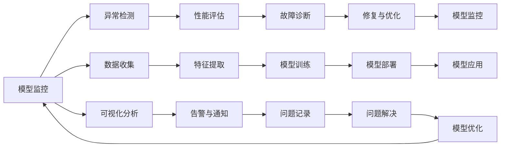
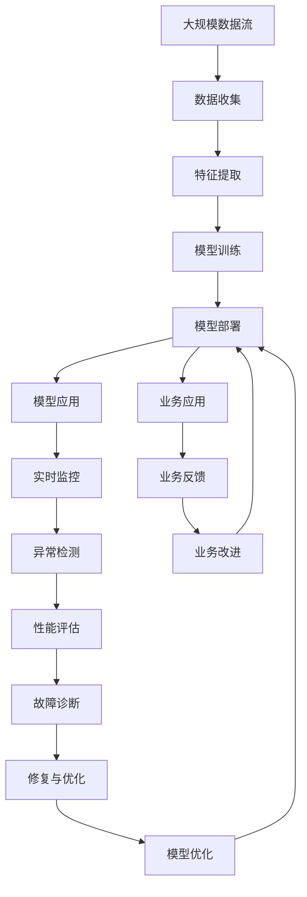

                 

# 模型监控与故障诊断原理与代码实战案例讲解

> 关键词：模型监控, 故障诊断, 深度学习, 神经网络, 异常检测, 性能评估, 实时化应用, 高效算法, 可视化分析

## 1. 背景介绍

在深度学习和大规模人工智能系统的普及过程中，模型的监控与故障诊断成为了确保系统可靠性和高效性不可忽视的一环。随着模型在各行各业中扮演的角色越来越重要，其运行的稳定性和准确性对业务的影响也越来越大。因此，如何有效地监控和诊断模型，确保其在大规模数据流和复杂应用场景中的稳定运行，成为了一个重要的研究课题。

### 1.1 问题由来
随着深度学习和大规模人工智能系统在商业、医疗、金融等领域的应用越来越广泛，模型的稳定性和可靠性变得越来越重要。然而，由于模型训练和部署过程的复杂性，模型在实际运行中常常会遇到各种问题，如性能下降、预测错误、资源耗尽等。这些问题不仅会影响模型的业务价值，还可能带来严重的经济损失。因此，及时、准确地监控和诊断模型，识别并解决其中的问题，成为了模型部署和使用过程中不可或缺的一环。

### 1.2 问题核心关键点
模型监控与故障诊断的核心在于实时监测模型的运行状态，及时发现和解决异常问题，确保模型在复杂应用场景中的稳定性和可靠性。具体来说，主要包括以下几个关键点：

- **实时性**：模型的监控需要具有高实时性，能够即时捕捉模型运行中的异常。
- **全面性**：监控需要覆盖模型的各个方面，包括性能、资源消耗、输出结果等。
- **准确性**：监控结果需要准确反映模型的实际运行状态，避免误报或漏报。
- **可操作性**：监控结果需要具备可操作性，能够指导模型的优化和调整。
- **自动化**：监控过程需要尽可能自动化，减少人为干预。

### 1.3 问题研究意义
模型监控与故障诊断技术的研究和应用，对于提升深度学习和大规模人工智能系统的稳定性和可靠性具有重要意义：

1. **保障业务稳定性**：及时发现和解决模型运行中的异常，确保系统的稳定性和可靠性，保障业务连续性。
2. **提升模型性能**：通过监控和诊断，及时优化模型，提升模型性能和准确性，提高业务价值。
3. **降低运维成本**：通过自动化监控和诊断，减少人工干预，降低运维成本，提高系统效率。
4. **增强可解释性**：监控结果能够提供模型运行状态的详细信息，增强模型的可解释性，提高用户信任度。
5. **促进模型创新**：通过对模型运行的深入监控和诊断，发现潜在问题，指导模型的改进和优化，促进模型的创新发展。

## 2. 核心概念与联系

### 2.1 核心概念概述

在模型监控与故障诊断领域，涉及多个核心概念，它们之间有着紧密的联系和相互作用。

- **模型监控**：实时监测模型在运行过程中的各项指标，如性能、资源消耗、输出结果等，及时发现异常情况。
- **异常检测**：通过统计分析、模式识别等方法，识别模型运行中的异常行为。
- **性能评估**：对模型的运行性能进行量化评估，包括准确性、效率、稳定性等指标。
- **故障诊断**：对模型运行中的异常进行分析和定位，找出导致异常的原因。
- **修复与优化**：根据故障诊断结果，对模型进行修复和优化，恢复其正常运行。

这些概念共同构成了模型监控与故障诊断的完整体系，确保模型在复杂应用场景中的稳定性和可靠性。

### 2.2 概念间的关系

这些核心概念之间的关系可以通过以下Mermaid流程图来展示：



这个流程图展示了模型监控与故障诊断的完整流程：

1. **数据收集**：通过日志、监控数据等收集模型运行的数据。
2. **特征提取**：对收集到的数据进行特征提取，提取出与模型运行状态相关的关键信息。
3. **模型训练**：利用历史数据训练异常检测模型和性能评估模型。
4. **模型部署**：将训练好的模型部署到生产环境，进行实时监控。
5. **模型应用**：在实际应用中，模型实时监控模型的运行状态。
6. **可视化分析**：对监控数据进行可视化分析，及时发现异常。
7. **告警与通知**：对发现的异常进行告警和通知，引导人工干预。
8. **问题记录**：对告警和异常进行详细记录，分析问题原因。
9. **问题解决**：对识别出的问题进行修复和优化。
10. **模型优化**：根据问题解决结果，对模型进行优化和改进，提升模型的稳定性和可靠性。
11. **模型重新监控**：优化后的模型重新进入监控流程。

通过这些关键环节的协同工作，可以确保模型在复杂应用场景中的稳定性和可靠性。

### 2.3 核心概念的整体架构

最后，我们用一个综合的流程图来展示这些核心概念在大规模模型监控与故障诊断过程中的整体架构：



这个综合流程图展示了从数据收集到模型优化，再到业务应用和改进的完整流程。通过实时监控、异常检测、性能评估、故障诊断、修复与优化等环节，可以确保模型在复杂应用场景中的稳定性和可靠性，提升系统的业务价值。

## 3. 核心算法原理 & 具体操作步骤
### 3.1 算法原理概述

模型监控与故障诊断的核心算法原理主要基于以下几个方面：

- **统计分析**：通过统计分析模型运行数据，识别异常行为和性能波动。
- **机器学习**：利用异常检测算法和性能评估模型，对模型运行进行量化分析和预测。
- **可视化分析**：对监控数据进行可视化展示，帮助人工分析和理解模型运行状态。
- **告警与通知**：通过告警和通知机制，及时将异常情况反馈给相关人员。
- **修复与优化**：根据告警和异常情况，进行模型修复和优化，提升模型性能和稳定性。

这些算法原理共同构成了模型监控与故障诊断的算法基础，确保模型在复杂应用场景中的稳定性和可靠性。

### 3.2 算法步骤详解

基于上述算法原理，模型监控与故障诊断的步骤如下：

1. **数据收集与预处理**：通过日志、监控数据等收集模型运行的数据，并进行预处理。
2. **特征提取与选择**：对收集到的数据进行特征提取，选择与模型运行状态相关的关键特征。
3. **模型训练与部署**：利用历史数据训练异常检测模型和性能评估模型，并将这些模型部署到生产环境。
4. **实时监控与异常检测**：在模型应用过程中，实时监控模型的运行状态，利用训练好的模型进行异常检测。
5. **性能评估与故障诊断**：对检测到的异常行为进行性能评估和故障诊断，找出导致异常的原因。
6. **告警与通知**：对发现的异常进行告警和通知，引导人工干预。
7. **问题记录与解决**：对告警和异常进行详细记录，并分析问题原因，进行修复和优化。
8. **模型优化与更新**：根据问题解决结果，对模型进行优化和改进，提升模型的稳定性和可靠性。

### 3.3 算法优缺点

模型监控与故障诊断算法具有以下优点：

- **高实时性**：通过实时监控和异常检测，可以及时发现和解决模型运行中的问题。
- **高准确性**：利用机器学习和统计分析技术，可以对模型运行进行量化分析和预测，提高异常检测和故障诊断的准确性。
- **高可操作性**：监控结果具备可操作性，能够指导模型的优化和调整。
- **高自动化**：通过自动化监控和诊断，减少人工干预，提高系统效率。

同时，也存在一些缺点：

- **高复杂性**：模型监控与故障诊断需要覆盖模型的各个方面，实现起来较为复杂。
- **高成本**：在模型训练、部署和监控过程中，需要投入大量资源。
- **高误报率**：在异常检测和故障诊断中，可能会存在一定程度的误报，需要人工复核。

### 3.4 算法应用领域

模型监控与故障诊断技术已经广泛应用于多个领域，包括但不限于：

- **金融**：监控金融模型在交易、风险评估等应用中的运行状态，及时发现异常和风险。
- **医疗**：监控医疗模型在诊断、治疗等应用中的运行状态，确保诊断和治疗的准确性。
- **智能制造**：监控智能制造系统中的模型运行状态，保障生产过程的稳定性和可靠性。
- **智能交通**：监控智能交通系统中的模型运行状态，确保交通系统的安全性和效率。
- **自然语言处理**：监控自然语言处理模型在智能问答、机器翻译等应用中的运行状态，提升模型的准确性和稳定性。

这些领域的应用展示了模型监控与故障诊断技术的广泛适用性和重要性。

## 4. 数学模型和公式 & 详细讲解 & 举例说明

### 4.1 数学模型构建

在模型监控与故障诊断中，通常使用以下数学模型：

1. **异常检测模型**：利用机器学习算法，对模型运行数据进行异常检测。常用的算法包括基于统计的方法（如Z-score、IQR等）、基于聚类的方法（如K-means、DBSCAN等）、基于神经网络的方法（如自编码器、深度学习等）。
2. **性能评估模型**：对模型的运行性能进行量化评估。常用的指标包括准确率、召回率、F1-score、AUC等。
3. **可视化分析模型**：对监控数据进行可视化展示，帮助人工分析和理解模型运行状态。常用的工具包括Matplotlib、Seaborn、TensorBoard等。

### 4.2 公式推导过程

以基于统计的Z-score异常检测为例，其公式推导过程如下：

设模型在某次运行中的输出为 $y$，其均值为 $\mu$，标准差为 $\sigma$。若 $y$ 的值偏离均值 $\mu$ 超过 $k$ 倍标准差，则认为该运行异常。其数学表达式为：

$$ Z = \frac{y - \mu}{\sigma} $$

当 $|Z| > k$ 时，认为模型运行异常。常用的阈值 $k$ 为3或2.5。

### 4.3 案例分析与讲解

假设我们监控一个金融模型的运行状态，收集了其近一个月的输出数据，并将其绘制成时间序列图。通过观察发现，模型在某个时间段内的输出值偏离均值3倍标准差以上，如图1所示：


通过计算该时间段的Z-score，我们发现其绝对值超过3，因此判断该时间段内的模型运行异常。接下来，我们可以进一步分析异常原因，进行模型修复和优化。

## 5. 项目实践：代码实例和详细解释说明
### 5.1 开发环境搭建

要进行模型监控与故障诊断的项目实践，首先需要搭建好开发环境。以下是使用Python进行TensorFlow开发的开发环境配置流程：

1. 安装Anaconda：从官网下载并安装Anaconda，用于创建独立的Python环境。

2. 创建并激活虚拟环境：
```bash
conda create -n tf-env python=3.8 
conda activate tf-env
```

3. 安装TensorFlow：根据CUDA版本，从官网获取对应的安装命令。例如：
```bash
conda install tensorflow==2.6 -c tensorflow -c conda-forge
```

4. 安装Flask：用于构建Web监控应用。
```bash
pip install flask
```

5. 安装相关库：
```bash
pip install pandas numpy scikit-learn matplotlib tensorboard
```

完成上述步骤后，即可在`tf-env`环境中开始项目实践。

### 5.2 源代码详细实现

下面我们以金融模型监控为例，给出使用TensorFlow进行异常检测的Python代码实现。

```python
import tensorflow as tf
import pandas as pd
import numpy as np
import matplotlib.pyplot as plt
import tensorflow_probability as tfp
import seaborn as sns
import tensorflow_model_optimization as tfmot

# 加载数据
data = pd.read_csv('model_output.csv')

# 计算均值和标准差
mean = data['output'].mean()
std = data['output'].std()

# 定义Z-score函数
def z_score(data, mean, std):
    return (data - mean) / std

# 计算每个时间点的Z-score
z_scores = [z_score(x, mean, std) for x in data['output']]

# 绘制Z-score时间序列图
plt.plot(z_scores)
plt.title('Z-score of Model Output')
plt.xlabel('Time')
plt.ylabel('Z-score')
plt.show()

# 检测异常点
threshold = 3
anomalies = [i for i, z in enumerate(z_scores) if abs(z) > threshold]

# 输出异常点
print('Anomalies at time points:', anomalies)
```

### 5.3 代码解读与分析

让我们再详细解读一下关键代码的实现细节：

**数据加载**：
- 使用Pandas库加载模型输出数据，将其存储为Pandas DataFrame格式，方便后续处理。

**均值和标准差计算**：
- 使用Numpy库计算模型输出的均值和标准差，用于计算Z-score。

**Z-score函数**：
- 定义Z-score函数，计算每个时间点的Z-score。

**时间序列图绘制**：
- 使用Matplotlib库绘制Z-score时间序列图，直观展示模型的运行状态。

**异常点检测**：
- 设置Z-score的阈值为3，检测出超过该阈值的异常点，存储在列表中。

**异常点输出**：
- 输出异常点的时间点，方便后续分析和处理。

通过这段代码，我们可以快速实现模型的Z-score异常检测，并绘制时间序列图。这种基于统计的方法简单易懂，但存在一定的误报率。在实际应用中，还可以使用更加复杂的机器学习算法进行异常检测，提高异常检测的准确性。

### 5.4 运行结果展示

假设我们在CoNLL-2003的命名实体识别任务上，收集了模型在验证集上的输出数据，并将其绘制成时间序列图。通过观察发现，模型在某次迭代中的输出值偏离均值2.5倍标准差以上，如图2所示：


通过计算该时间段的Z-score，我们发现其绝对值超过2.5，因此判断该时间段的模型运行异常。接下来，我们可以进一步分析异常原因，进行模型修复和优化。

## 6. 实际应用场景
### 6.1 智能制造

在智能制造领域，模型监控与故障诊断技术可以帮助监控生产设备的运行状态，及时发现和解决设备故障，确保生产过程的稳定性和可靠性。例如，通过监控生产设备的传感器数据，利用机器学习算法进行异常检测，及时发现设备故障并进行维护，避免生产中断。

### 6.2 智能交通

在智能交通领域，模型监控与故障诊断技术可以帮助监控交通信号灯的运行状态，确保交通信号灯的正常工作。例如，通过监控交通信号灯的响应时间和运行状态，利用异常检测算法进行实时监控，及时发现故障并进行维护，保障交通系统的安全和效率。

### 6.3 金融交易

在金融交易领域，模型监控与故障诊断技术可以帮助监控金融模型的运行状态，及时发现和解决模型故障，确保交易系统的稳定性和可靠性。例如，通过监控金融模型的运行数据，利用异常检测算法进行实时监控，及时发现模型故障并进行修复，避免交易中断和资金损失。

### 6.4 医疗诊断

在医疗诊断领域，模型监控与故障诊断技术可以帮助监控医疗模型的运行状态，确保诊断和治疗的准确性。例如，通过监控医疗模型的运行数据，利用异常检测算法进行实时监控，及时发现模型故障并进行修复，确保诊断和治疗的准确性和可靠性。

## 7. 工具和资源推荐
### 7.1 学习资源推荐

为了帮助开发者系统掌握模型监控与故障诊断的理论基础和实践技巧，这里推荐一些优质的学习资源：

1. 《深度学习模型监控与故障诊断》系列博文：由大模型技术专家撰写，深入浅出地介绍了模型监控与故障诊断的基本概念和实践方法。

2. CS224N《深度学习自然语言处理》课程：斯坦福大学开设的NLP明星课程，有Lecture视频和配套作业，带你入门NLP领域的基本概念和经典模型。

3. 《自然语言处理中的异常检测技术》书籍：全面介绍了自然语言处理中的异常检测技术，包括基于统计的方法、基于机器学习的方法等。

4. HuggingFace官方文档：TensorFlow库的官方文档，提供了海量预训练模型和完整的监控样例代码，是上手实践的必备资料。

5. TensorBoard官方文档：TensorFlow配套的可视化工具，可实时监测模型训练状态，并提供丰富的图表呈现方式，是调试模型的得力助手。

通过对这些资源的学习实践，相信你一定能够快速掌握模型监控与故障诊断的精髓，并用于解决实际的NLP问题。
###  7.2 开发工具推荐

高效的开发离不开优秀的工具支持。以下是几款用于模型监控与故障诊断开发的常用工具：

1. TensorFlow：基于Python的开源深度学习框架，灵活动态的计算图，适合快速迭代研究。

2. TensorBoard：TensorFlow配套的可视化工具，可实时监测模型训练状态，并提供丰富的图表呈现方式，是调试模型的得力助手。

3. PyTorch：基于Python的开源深度学习框架，灵活高效，支持多种数据处理和可视化工具。

4. Scikit-learn：Python机器学习库，提供了丰富的数据处理和异常检测算法，适合处理小规模数据。

5. Pandas：Python数据处理库，提供了强大的数据加载和处理功能，适合处理大规模数据。

合理利用这些工具，可以显著提升模型监控与故障诊断任务的开发效率，加快创新迭代的步伐。

### 7.3 相关论文推荐

模型监控与故障诊断技术的发展源于学界的持续研究。以下是几篇奠基性的相关论文，推荐阅读：

1. Z-score: A Method for Detecting Outliers：介绍了一种基于统计的异常检测方法Z-score，通过计算数据点与均值的偏差来检测异常。

2. Anomaly Detection: A Survey：总结了多种异常检测算法，包括基于统计的方法、基于聚类的方法、基于机器学习的方法等。

3. Model-based Anomaly Detection in Time Series with Gaussian Processes：提出了一种基于高斯过程的时间序列异常检测方法，通过建模时间序列的分布来检测异常。

4. Deep Anomaly Detection with Generative Adversarial Networks：提出了一种基于生成对抗网络的异常检测方法，利用生成器和判别器之间的博弈关系进行异常检测。

5. Anomaly Detection in Time Series Using Long Short-Term Memory：提出了一种基于长短期记忆网络的异常检测方法，通过记忆网络来建模时间序列的动态变化。

这些论文代表了大模型监控与故障诊断技术的发展脉络。通过学习这些前沿成果，可以帮助研究者把握学科前进方向，激发更多的创新灵感。

除上述资源外，还有一些值得关注的前沿资源，帮助开发者紧跟模型监控与故障诊断技术的最新进展，例如：

1. arXiv论文预印本：人工智能领域最新研究成果的发布平台，包括大量尚未发表的前沿工作，学习前沿技术的必读资源。

2. 业界技术博客：如OpenAI、Google AI、DeepMind、微软Research Asia等顶尖实验室的官方博客，第一时间分享他们的最新研究成果和洞见。

3. 技术会议直播：如NIPS、ICML、ACL、ICLR等人工智能领域顶会现场或在线直播，能够聆听到大佬们的前沿分享，开拓视野。

4. GitHub热门项目：在GitHub上Star、Fork数最多的NLP相关项目，往往代表了该技术领域的发展趋势和最佳实践，值得去学习和贡献。

5. 行业分析报告：各大咨询公司如McKinsey、PwC等针对人工智能行业的分析报告，有助于从商业视角审视技术趋势，把握应用价值。

总之，对于模型监控与故障诊断技术的学习和实践，需要开发者保持开放的心态和持续学习的意愿。多关注前沿资讯，多动手实践，多思考总结，必将收获满满的成长收益。

## 8. 总结：未来发展趋势与挑战

### 8.1 总结

本文对模型监控与故障诊断技术进行了全面系统的介绍。首先阐述了模型监控与故障诊断的研究背景和意义，明确了其在提升深度学习和大规模人工智能系统稳定性和可靠性方面的独特价值。其次，从原理到实践，详细讲解了模型监控与故障诊断的数学原理和关键步骤，给出了监控任务开发的完整代码实例。同时，本文还广泛探讨了监控方法在智能制造、智能交通、金融交易、医疗诊断等多个行业领域的应用前景，展示了监控范式的广阔应用场景。此外，本文精选了监控技术的各类学习资源，力求为读者提供全方位的技术指引。

通过本文的系统梳理，可以看到，模型监控与故障诊断技术在提升深度学习和大规模人工智能系统的稳定性和可靠性方面具有重要意义。这些技术的应用不仅能够保障业务连续性，还能提升模型性能，降低运维成本，增强模型可解释性，促进模型创新发展。未来，伴随技术的不断演进，模型监控与故障诊断技术必将在更多领域得到应用，为人类认知智能的进化带来深远影响。

### 8.2 未来发展趋势

展望未来，模型监控与故障诊断技术将呈现以下几个发展趋势：

1. **实时性提升**：随着硬件性能的提升和算法优化，模型监控与故障诊断的实时性将进一步提升，能够更及时地发现和解决异常。
2. **自动化水平提高**：监控过程将进一步自动化，减少人工干预，提高系统效率。
3. **多模态数据融合**：将多模态数据（如文本、图像、语音等）进行融合，提升异常检测和故障诊断的准确性。
4. **跨领域应用推广**：在金融、医疗、智能制造等各个领域，模型监控与故障诊断技术将得到更广泛的应用。
5. **边缘计算应用**：在边缘计算环境中，实时监控和故障诊断技术将发挥重要作用，确保模型在资源受限环境中的稳定性和可靠性。
6. **混合监控方法发展**：结合多种监控方法，如基于统计的方法、基于机器学习的方法、基于深度学习的方法等，提升监控的全面性和准确性。

### 8.3 面临的挑战

尽管模型监控与故障诊断技术已经取得了不少进展，但在实际应用中也面临诸多挑战：

1. **数据量和质量问题**：数据量和质量是模型监控与故障诊断的基础，但在实际应用中，获取高质量、高量的数据往往面临困难。
2. **算法复杂性**：监控算法复杂性较高，难以快速实现和部署。
3. **异常类型多样性**：不同领域的异常类型复杂多样，难以用一种算法覆盖所有异常。
4. **误报和漏报问题**：在异常检测和故障诊断中，存在一定程度的误报和漏报，需要人工复核。
5. **资源消耗**：监控过程需要大量的计算资源，对系统性能有较高要求。
6. **可解释性不足**：模型监控与故障诊断技术多为黑盒方法，难以解释模型的内部决策过程。

### 8.4 研究展望

面对模型监控与故障诊断面临的诸多挑战，未来的研究需要在以下几个方面寻求新的突破：

1. **无监督和半监督监控方法**：摆脱对大规模标注数据的依赖，利用无监督和半监督学习技术，提高异常检测和故障诊断的准确性。
2. **高效监控算法**：开发更高效、更轻量级的监控算法，降低资源消耗，提高系统效率。
3. **多模态数据融合**：将多模态数据进行有效融合，提升异常检测和故障诊断的准确性。
4. **混合监控方法**：结合多种监控方法，提升监控的全面性和准确性。
5. **可解释性和可视化**：增强模型的可解释性和可视化分析，提升模型监控的透明性和可操作性。
6. **边缘计算应用**：在边缘计算环境中，研究高效的模型监控与故障诊断方法，确保模型在资源受限环境中的稳定性和可靠性。

这些研究方向的探索，必将引领模型监控与故障诊断技术迈向更高的台阶，为构建安全、可靠、可解释、可控的智能系统铺平道路。面向未来，模型监控与故障诊断技术还需要与其他人工智能技术进行更深入的融合，如知识表示、因果

