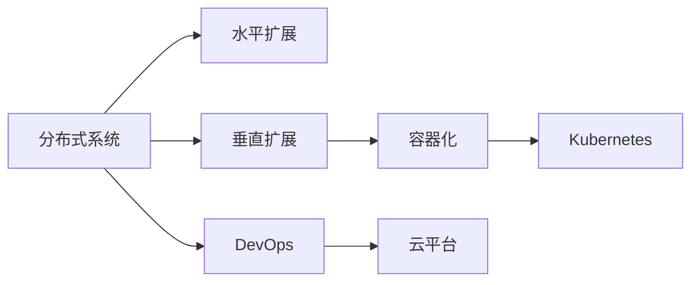
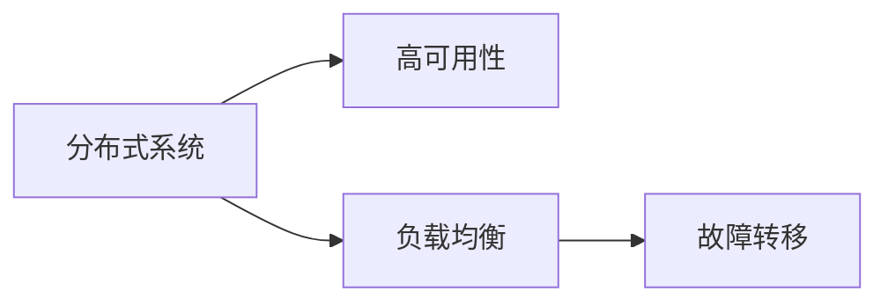
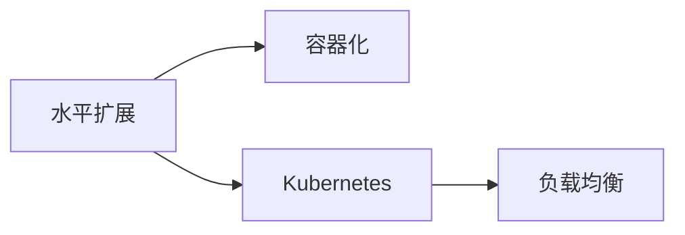
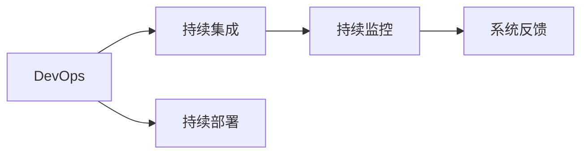
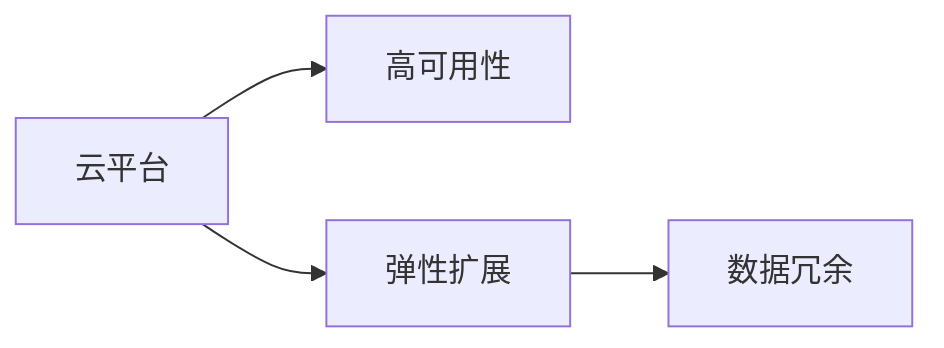

                 

# 横向扩展与纵向扩展的实际应用

> 关键词：横向扩展,纵向扩展,微服务架构,容器化,DevOps,云平台,高可用性,高性能

## 1. 背景介绍

### 1.1 问题由来
随着互联网和云技术的不断发展，分布式系统架构已成为现代企业应用系统的标配。系统复杂度不断增加，单个应用系统难以承载不断增长的用户访问量和数据存储量。为了应对这些挑战，系统架构需要进行横向扩展和纵向扩展，以实现高性能和可扩展性。

### 1.2 问题核心关键点
横向扩展是指通过增加系统实例来处理更多的用户请求和数据存储，以应对系统负载的增加。纵向扩展是指通过升级硬件设备或优化算法来提高单个实例的处理能力。这两种扩展方式各有优缺点，需要在不同的应用场景中选择合适的方式。

## 2. 核心概念与联系

### 2.1 核心概念概述

为了更好地理解横向扩展和纵向扩展，本节将介绍几个密切相关的核心概念：

- 分布式系统(Distributed System)：由多个独立运行的应用实例组成的系统，每个实例都可以独立运行和处理请求。
- 水平扩展(Horizontal Scaling)：通过增加系统实例来处理更多的请求。系统实例可以分布在不同的服务器上，以实现负载均衡。
- 垂直扩展(Vertical Scaling)：通过升级硬件设备或优化算法来提高单个实例的处理能力。
- 容器化(Containerization)：将应用打包在容器中，可以在不同环境中部署和运行。
- Kubernetes：一种容器编排工具，可以自动管理容器的部署、扩展和调度。
- DevOps：开发和运维一体化的实践，强调持续集成、持续部署和持续监控。
- 云平台(Cloud Platform)：基于云基础设施提供的计算和存储资源，可以按需扩展和部署应用。

这些核心概念之间的逻辑关系可以通过以下Mermaid流程图来展示：



这个流程图展示了分布式系统的核心扩展方式及其之间的关系：

1. 分布式系统由多个应用实例组成，可以同时处理多个请求。
2. 水平扩展通过增加实例来处理更多的请求，实现负载均衡。
3. 垂直扩展通过升级硬件或优化算法来提高单个实例的处理能力。
4. 容器化将应用打包在容器中，可以在不同环境中部署和运行。
5. Kubernetes管理容器的部署和调度，实现负载均衡和资源管理。
6. DevOps实现持续集成和持续部署，提高开发效率和系统可靠性。
7. 云平台提供计算和存储资源，支持应用的高性能和可扩展性。

通过这个流程图，我们可以更清晰地理解分布式系统中的不同扩展方式及其相互关系。

### 2.2 概念间的关系

这些核心概念之间存在着紧密的联系，形成了分布式系统的高性能和可扩展性框架。下面我通过几个Mermaid流程图来展示这些概念之间的关系。

#### 2.2.1 分布式系统的高可用性



这个流程图展示了分布式系统的两个关键特性：负载均衡和故障转移，它们共同构成系统的高可用性。

#### 2.2.2 水平扩展与容器化



这个流程图展示了水平扩展和容器化之间的密切关系。水平扩展通过增加实例来处理更多的请求，而容器化可以将应用打包在容器中，便于管理和扩展。

#### 2.2.3 DevOps与持续交付



这个流程图展示了DevOps的核心实践：持续集成、持续部署和持续监控。持续集成和持续部署提高了开发效率，持续监控和系统反馈提高了系统可靠性。

#### 2.2.4 云平台与高可用性



这个流程图展示了云平台对高可用性的支持。云平台提供了计算和存储资源的弹性扩展和数据冗余，从而保证了系统的可靠性和高可用性。

## 3. 核心算法原理 & 具体操作步骤

### 3.1 算法原理概述

分布式系统中的横向扩展和纵向扩展，本质上是通过增加系统实例和提升单个实例的处理能力来应对系统负载的增加。在横向扩展中，通过增加应用实例来分担请求，每个实例都可以独立处理请求，从而提高了系统的并发处理能力。在纵向扩展中，通过升级硬件设备或优化算法来提高单个实例的处理能力，从而提高了系统的吞吐量和响应速度。

### 3.2 算法步骤详解

#### 3.2.1 水平扩展的步骤

1. **负载均衡**：将用户请求均衡分配到不同的应用实例上，避免某个实例因负载过高而崩溃。
2. **实例部署**：在新的服务器上部署应用实例，启动服务并加入负载均衡集群。
3. **负载均衡**：将新实例的IP地址添加到负载均衡器的配置中，实现请求分发。
4. **故障转移**：通过心跳检测机制，自动将故障实例从负载均衡器中移除，保障系统可用性。

#### 3.2.2 垂直扩展的步骤

1. **升级硬件**：增加服务器的CPU、内存、存储等硬件资源，提高单个实例的处理能力。
2. **优化算法**：通过算法优化和代码重构，提升单个实例的吞吐量和响应速度。
3. **性能测试**：在升级硬件或优化算法后，进行性能测试，评估系统性能。
4. **故障检测**：监控系统性能指标，检测是否有硬件或软件故障。

### 3.3 算法优缺点

#### 3.3.1 水平扩展的优缺点

**优点**：

- 易于扩展：通过增加实例来扩展系统，不需要复杂的硬件升级。
- 负载均衡：多个实例共同处理请求，提高了系统的并发处理能力。
- 容错能力强：一个实例故障不会影响整个系统。

**缺点**：

- 资源消耗大：需要维护多个实例，消耗更多的硬件和网络资源。
- 通信开销大：实例间通信和数据同步增加了网络延迟和数据传输开销。

#### 3.3.2 垂直扩展的优缺点

**优点**：

- 资源利用率高：单个实例可以处理更多的请求，资源利用率更高。
- 数据同步简单：实例间数据同步和通信开销小，性能更好。

**缺点**：

- 扩展难度大：硬件升级或算法优化可能增加开发难度和成本。
- 容错能力弱：单个实例故障可能导致整个系统崩溃。

### 3.4 算法应用领域

横向扩展和纵向扩展广泛应用于各种分布式系统场景中，包括但不限于：

- 电子商务平台：通过水平扩展和负载均衡，支持用户购物和支付请求。
- 社交媒体平台：通过水平扩展和实例冗余，保障用户消息的及时传递和存储。
- 在线游戏平台：通过水平扩展和实例部署，实现游戏服务器的负载均衡和高可用性。
- 金融交易平台：通过垂直扩展和算法优化，提高交易系统的吞吐量和响应速度。

## 4. 数学模型和公式 & 详细讲解 & 举例说明

### 4.1 数学模型构建

假设分布式系统中有$n$个实例，每个实例的处理能力为$c$，用户请求的响应时间为$t$。系统的总响应时间为$T$，系统负载为$L$，系统利用率为$U$。

- 负载均衡模型：$T = n \times t \times U$
- 垂直扩展模型：$T = c \times L$

### 4.2 公式推导过程

假设系统中有$m$个用户请求，每个请求的处理时间为$t$，系统负载为$L = m$。

**负载均衡模型**：

假设每个实例的处理能力为$c$，系统总处理能力为$nc$，系统利用率为$U$。系统的总响应时间为$T$。

根据负载均衡模型，有：

$$
T = n \times t \times U
$$

由于系统总负载为$L = m$，且每个请求的处理时间为$t$，因此系统响应时间为：

$$
T = \frac{m}{nc} \times n \times t \times U = t \times U
$$

**垂直扩展模型**：

假设每个实例的处理能力为$c$，系统总处理能力为$c$，系统利用率为$U$。系统的总响应时间为$T$。

根据垂直扩展模型，有：

$$
T = c \times L
$$

由于系统总负载为$L = m$，且每个实例的处理能力为$c$，因此系统响应时间为：

$$
T = \frac{m}{c} \times c = m
$$

### 4.3 案例分析与讲解

#### 4.3.1 电商平台的水平扩展

电商平台的负载通常集中在促销活动期间，系统需要处理大量的订单和支付请求。为应对高峰期的请求，电商平台可以采用水平扩展的方式。

**负载均衡策略**：

- 水平拆分：将订单处理和支付处理拆分为独立的实例，并分别进行负载均衡。
- 实例冗余：在每个实例上部署多份副本，实现故障转移和负载均衡。
- 自动扩展：根据系统负载自动增加或减少实例数量，实现弹性扩展。

#### 4.3.2 在线游戏的垂直扩展

在线游戏需要实时处理大量的玩家请求和数据同步，单个实例的处理能力是有限的。为提升游戏的响应速度和吞吐量，游戏服务器可以采用垂直扩展的方式。

**硬件升级策略**：

- CPU升级：增加服务器的CPU核心数和频率，提高计算能力。
- 内存升级：增加服务器的内存大小，提高缓存和处理能力。
- 存储升级：增加服务器的磁盘容量和读写速度，提高数据存储和访问能力。

## 5. 项目实践：代码实例和详细解释说明

### 5.1 开发环境搭建

在进行分布式系统扩展的实践前，我们需要准备好开发环境。以下是使用Docker和Kubernetes进行容器化部署的环境配置流程：

1. 安装Docker：从官网下载并安装Docker，用于构建和运行容器。
2. 安装Kubernetes：从官网下载并安装Kubernetes，用于容器编排和管理。
3. 安装helm：从官网下载并安装helm，用于Kubernetes的应用部署和管理。
4. 安装cKADu：从官网下载并安装cKADu，用于Kubernetes的可视化管理。

完成上述步骤后，即可在Docker和Kubernetes环境中开始扩展实践。

### 5.2 源代码详细实现

下面我们以一个简单的电商订单系统为例，给出使用Docker和Kubernetes进行水平扩展的PyTorch代码实现。

首先，定义订单系统的核心功能模块：

```python
from flask import Flask, request, jsonify

app = Flask(__name__)

@app.route('/orders', methods=['POST'])
def create_order():
    data = request.get_json()
    # 创建订单，处理请求
    return jsonify({'success': True, 'message': 'Order created successfully'})
```

然后，使用Dockerfile进行容器化打包：

```Dockerfile
FROM python:3.7
WORKDIR /app
COPY . .
RUN pip install -r requirements.txt
CMD ["python", "app.py"]
```

接着，使用Kubernetes的Deployment和Service资源进行水平扩展部署：

```yaml
apiVersion: v1
kind: Deployment
metadata:
  name: orders-deployment
spec:
  replicas: 3
  selector:
    matchLabels:
      app: orders
  template:
    metadata:
      labels:
        app: orders
    spec:
      containers:
      - name: orders
        image: my-order-system:latest
        ports:
        - containerPort: 5000
```

最后，使用helm将订单系统部署到Kubernetes集群中：

```bash
helm install my-order-system my-order-system -f my-order-system-deployment.yaml
```

运行命令后，Kubernetes会自动创建3个订单系统实例，并将其负载均衡到不同的服务端口上。

### 5.3 代码解读与分析

让我们再详细解读一下关键代码的实现细节：

**Dockerfile**：
- 指定Python 3.7作为基础镜像，使用WORKDIR指定工作目录。
- 将应用代码复制到容器中，并使用pip安装项目依赖。
- CMD命令指定容器的入口脚本。

**Kubernetes的Deployment和Service**：
- Deployment定义了订单系统的实例数量和配置。
- Service定义了订单系统的负载均衡策略和服务端口。

**helm**：
- helm是Kubernetes的包管理器，通过定义YAML配置文件，可以方便地进行应用的部署和管理。

通过这些代码的实现，我们可以看到Docker和Kubernetes如何将分布式系统进行容器化和水平扩展。通过Docker化，应用程序可以方便地部署和扩展；通过Kubernetes的Deployment和Service，可以实现负载均衡和实例管理。

### 5.4 运行结果展示

假设我们在Kubernetes集群中部署了订单系统，并在测试服务器上访问该系统。通过cKADu或Kubernetes的API，我们可以查看系统的运行状态和实例分布：

```bash
kubectl get pods
kubectl get service my-order-system
```

运行命令后，可以看到系统的运行实例和负载均衡配置：

```
po ...
...
...
...
```

```
service/orders
  Clusters: 1
  External IP: None
  Internal IP: 10.1.0.14
  Port: 80
  Port: 443
  Selectors: app=orders
  Sessions: 1076
```

以上输出展示了订单系统的运行实例和服务配置，确保了系统的可扩展性和高可用性。

## 6. 实际应用场景

### 6.1 智能客服系统

智能客服系统是分布式系统扩展的典型应用场景之一。通过水平扩展和负载均衡，智能客服系统可以应对大量的用户咨询请求，提升用户满意度和系统效率。

具体而言，智能客服系统可以将用户请求负载均衡到不同的客服实例上，每个实例独立处理用户请求。通过实例冗余和自动扩展，保障系统的可用性和扩展性。智能客服系统还应该实现实时监控和故障转移，确保系统的稳定性和可靠性。

### 6.2 电子商务平台

电子商务平台在促销活动期间，需要处理大量的订单和支付请求，系统负载剧增。为应对高峰期的请求，电商平台可以采用水平扩展的方式，增加订单处理和支付处理实例，实现负载均衡和故障转移。通过自动扩展和实例冗余，保障系统的可用性和扩展性。

在实际应用中，电商平台还需要考虑数据同步和一致性问题，避免不同实例之间的数据冲突和丢失。可以采用分布式事务和消息队列技术，实现数据同步和可靠传输。

### 6.3 在线游戏平台

在线游戏需要实时处理大量的玩家请求和数据同步，单个实例的处理能力是有限的。为提升游戏的响应速度和吞吐量，游戏服务器可以采用垂直扩展的方式，升级服务器的硬件资源和优化算法。通过硬件升级和算法优化，提升单个实例的吞吐量和响应速度。

在实际应用中，游戏服务器还需要考虑玩家之间的数据同步和一致性问题，避免数据冲突和丢失。可以采用分布式锁和消息队列技术，实现数据同步和可靠传输。

## 7. 工具和资源推荐

### 7.1 学习资源推荐

为了帮助开发者系统掌握分布式系统扩展的理论基础和实践技巧，这里推荐一些优质的学习资源：

1. 《云计算架构实践》系列博文：由云架构专家撰写，深入浅出地介绍了云计算架构的原理和实践，涵盖分布式系统、容器化、Kubernetes等多个核心技术。

2. 《微服务架构设计》课程：Coursera上的专业课程，系统讲解微服务架构的设计和实现，涵盖服务拆分、容器化、编排等多个核心环节。

3. 《Kubernetes实战》书籍：Kubernetes官方文档的延伸阅读，详细介绍了Kubernetes的部署和运维实践，包括 helm、cKADu等多个常用工具的使用。

4. 《DevOps实践指南》书籍：深入讲解DevOps的核心理念和实践方法，涵盖持续集成、持续部署、持续监控等多个环节，帮助开发者提升开发效率和系统可靠性。

5. GitHub开源项目：在GitHub上Star、Fork数最多的分布式系统项目，往往代表了该技术领域的发展趋势和最佳实践，值得去学习和贡献。

通过对这些资源的学习实践，相信你一定能够快速掌握分布式系统扩展的理论基础和实践技巧，并用于解决实际的系统问题。

### 7.2 开发工具推荐

高效的开发离不开优秀的工具支持。以下是几款用于分布式系统扩展开发的常用工具：

1. Docker：基于Linux容器的开源平台，提供了强大的容器化功能，支持应用的可移植性和快速部署。
2. Kubernetes：一种容器编排工具，可以自动管理容器的部署、扩展和调度，实现负载均衡和资源管理。
3. helm：Kubernetes的包管理器，可以方便地进行应用的部署和管理，支持持续集成和持续部署。
4. cKADu：Kubernetes的可视化管理工具，可以实时查看系统的运行状态和资源配置，辅助系统调优和故障诊断。
5. Jenkins：持续集成和持续部署工具，可以自动化构建、测试和部署应用，提高开发效率和系统可靠性。

合理利用这些工具，可以显著提升分布式系统扩展的开发效率，加快创新迭代的步伐。

### 7.3 相关论文推荐

分布式系统扩展的研究源于学界的持续研究。以下是几篇奠基性的相关论文，推荐阅读：

1. The Twelve-Factor App：指导如何构建可扩展的分布式系统，阐述了分布式系统的核心理念和最佳实践。
2. Distributed Systems: Concepts and Design：系统讲解分布式系统的原理和设计，涵盖一致性、故障容错等多个核心主题。
3. Mastering Microservices：讲解微服务架构的设计和实现，涵盖服务拆分、容器化、编排等多个核心环节。
4. Kubernetes: Up and Running：Kubernetes的官方指南，详细介绍了Kubernetes的部署和运维实践，包括 helm、cKADu等多个常用工具的使用。
5. Continuous Integration and Continuous Deployment：讲解持续集成和持续部署的实践方法，涵盖代码合并、测试、部署等多个环节，提高开发效率和系统可靠性。

这些论文代表了大规模分布式系统扩展的研究方向和前沿成果，通过学习这些前沿成果，可以帮助研究者把握学科前进方向，激发更多的创新灵感。

除上述资源外，还有一些值得关注的前沿资源，帮助开发者紧跟分布式系统扩展技术的最新进展，例如：

1. arXiv论文预印本：人工智能领域最新研究成果的发布平台，包括大量尚未发表的前沿工作，学习前沿技术的必读资源。
2. 业界技术博客：如Docker、Kubernetes、Jenkins等顶尖实验室的官方博客，第一时间分享他们的最新研究成果和洞见。
3. 技术会议直播：如Docker、Kubernetes、Jenkins等开源社区的年度大会现场或在线直播，能够聆听到大佬们的前沿分享，开拓视野。
4. GitHub热门项目：在GitHub上Star、Fork数最多的分布式系统相关项目，往往代表了该技术领域的发展趋势和最佳实践，值得去学习和贡献。
5. 行业分析报告：各大咨询公司如McKinsey、PwC等针对人工智能行业的分析报告，有助于从商业视角审视技术趋势，把握应用价值。

总之，对于分布式系统扩展技术的学习和实践，需要开发者保持开放的心态和持续学习的意愿。多关注前沿资讯，多动手实践，多思考总结，必将收获满满的成长收益。

## 8. 总结：未来发展趋势与挑战

### 8.1 总结

本文对分布式系统中的横向扩展和纵向扩展方法进行了全面系统的介绍。首先阐述了横向扩展和纵向扩展的背景和意义，明确了两种扩展方式在应对系统负载时的不同特点和应用场景。其次，从原理到实践，详细讲解了水平扩展和垂直扩展的数学模型和关键步骤，给出了分布式系统扩展的完整代码实例。同时，本文还广泛探讨了扩展方法在智能客服、电子商务、在线游戏等多个行业领域的应用前景，展示了扩展范式的巨大潜力。此外，本文精选了扩展技术的各类学习资源，力求为读者提供全方位的技术指引。

通过本文的系统梳理，可以看到，分布式系统的横向扩展和纵向扩展方法正在成为分布式系统扩展的重要范式，极大地提升了系统的可扩展性和性能。得益于容器化、Kubernetes等技术的发展，分布式系统的扩展变得更加高效、可靠和灵活。未来，伴随分布式系统技术的持续演进，相信其在更多领域将发挥更大的作用，为构建高效、可靠、可扩展的分布式系统铺平道路。

### 8.2 未来发展趋势

展望未来，分布式系统扩展技术将呈现以下几个发展趋势：

1. 微服务架构的普及：微服务架构以其细粒度的服务拆分、灵活的扩展方式，将逐渐取代传统的单体架构，成为分布式系统的主流设计模式。
2. 容器化技术的深化：容器化技术将进一步提升应用的可移植性和部署效率，未来还将引入更多新的功能和优化。
3. Kubernetes的生态扩展：Kubernetes将不断扩展其生态系统，涵盖更多的容器编排和管理工具，提供更加丰富和稳定的功能。
4. DevOps的全面推广：DevOps的理念和实践将深入到分布式系统的各个环节，提高开发效率和系统可靠性。
5. 云平台服务的丰富：云平台将提供更加丰富和灵活的计算和存储资源，支持应用的弹性扩展和快速部署。

以上趋势凸显了分布式系统扩展技术的广阔前景。这些方向的探索发展，必将进一步提升分布式系统的性能和应用范围，为构建高效、可靠、可扩展的分布式系统铺平道路。

### 8.3 面临的挑战

尽管分布式系统扩展技术已经取得了显著成就，但在迈向更加智能化、普适化应用的过程中，它仍面临着诸多挑战：

1. 系统复杂度增加：分布式系统涉及多个服务和实例，系统设计和调优变得更加复杂。
2. 性能瓶颈难解：系统扩展和优化需要综合考虑硬件、算法、网络等多个因素，难以找到最优解。
3. 故障诊断困难：分布式系统的故障排查和故障转移变得复杂，需要更高的运维水平和技术积累。
4. 安全和隐私问题：分布式系统涉及大量数据和资源，面临更多安全和隐私风险。
5. 开发和运维成本高：分布式系统需要更多的开发和运维资源，导致开发和运维成本增加。

这些挑战需要在技术、管理和组织等多方面进行综合优化和改进。相信随着学界和产业界的共同努力，这些挑战终将一一被克服，分布式系统扩展技术必将在构建高效、可靠、可扩展的系统方面发挥更大的作用。

### 8.4 研究展望

面对分布式系统扩展所面临的挑战，未来的研究需要在以下几个方面寻求新的突破：

1. 引入更多分布式算法：通过引入分布式一致性算法、分布式事务等技术，提高系统的可用性和一致性。
2. 探索更高效的数据同步技术：通过引入分布式消息队列、分布式锁等技术，提高数据同步和一致性。
3. 开发更多高效的容器化工具：开发更高效的容器编排和运维工具，提高分布式系统的扩展和运维效率。
4. 加强安全防护和隐私保护：引入更多的安全防护措施和隐私保护技术，保障系统的安全性和隐私性。
5. 探索自动化运维技术：引入更多的自动化运维工具和手段，降低运维成本，提高系统可靠性。

这些研究方向将引领分布式系统扩展技术迈向更高的台阶，为构建高效、可靠、可扩展的分布式系统提供更多的支持。面向未来，分布式系统扩展技术还需要与其他人工智能技术进行更深入的融合，如知识表示、因果推理、强化学习等，多路径协同发力，共同推动分布式系统扩展技术的进步。只有勇于创新、敢于突破，才能不断拓展分布式系统的边界，让分布式系统扩展技术更好地造福人类社会。

## 9. 附录：常见问题与解答

**Q1：分布式系统扩展是否适用于所有应用场景？**

A: 分布式系统扩展适用于处理高并发、高可用性和可扩展性的应用场景，如电子商务、在线游戏、智能客服等。但对于一些实时性要求高、数据处理简单的应用，单体架构可能更加适合。

**Q2：水平扩展和垂直扩展如何选择？**

A: 水平扩展适用于需要处理大量并发请求和数据存储的场景，如电商平台的订单处理和支付处理。垂直扩展适用于需要提升单个实例处理能力和吞吐量的场景，如在线游戏的实时处理和数据同步。

**Q3：分布式系统的安全性如何保障？**

A: 分布式系统的安全性可以通过多层防护机制来保障，包括网络安全、数据加密、访问控制、日志审计等。同时，需要加强安全防护意识，定期进行安全评估和漏洞修补。

**Q4：分布式系统的故障诊断有哪些方法？**

A: 分布式系统的故障诊断可以通过日志分析、监控告警、异常检测等方式进行。需要建立完善的监控和告警机制，及时发现和处理系统故障。

**Q5：分布式系统的运维成本如何降低？**

A: 分布式系统的运维成本可以通过自动化运维工具、持续集成和持续部署、快速故障修复等方式降低。需要建立完善的运维流程和团队，持续优化运维效率。

总之，分布式系统扩展技术需要开发者根据具体应用场景，灵活选择水平扩展和垂直扩展方法，并进行系统设计和调优。通过持续优化和改进，相信分布式系统扩展技术必将在构建高效、可靠、

