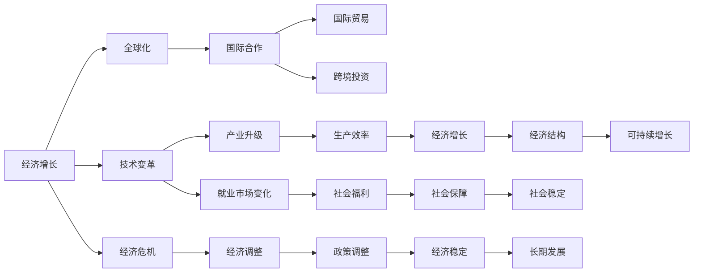

                 

# 正视当前世界经济增长困境

> 关键词：经济增长，全球化，技术变革，经济危机，可持续发展

## 1. 背景介绍

### 1.1 问题由来

当前世界经济增长正面临着诸多挑战和困境，这些问题从根本上威胁着全球经济的稳定和繁荣。面对复杂多变的国际形势、频发的技术变革、不断加剧的全球化挑战和日益严重的经济危机，如何保持经济的持续增长、实现可持续发展，成为全球各国共同面临的重要课题。

### 1.2 问题核心关键点

当前世界经济增长困境的核心问题包括以下几个方面：

- **全球化挑战**：国际贸易保护主义抬头、地缘政治紧张局势频发、跨境供应链断裂，给全球经济增长带来巨大不确定性。
- **技术变革加速**：人工智能、区块链、大数据等新兴技术的快速发展，带来了产业结构调整、就业市场变化和经济效率提升的新挑战。
- **经济危机频发**：全球经济波动加剧，金融市场波动性增加，债务危机、通货膨胀等问题频发，给经济增长带来挑战。
- **环境问题严峻**：气候变化、资源短缺、生态系统退化等环境问题，对经济发展的可持续性构成严重威胁。

这些核心问题相互交织，共同作用于全球经济的增长和稳定。本文将从经济增长困境的各个维度进行分析，探讨其深层次原因，并提出相应的解决策略。

### 1.3 问题研究意义

了解当前世界经济增长困境的成因和影响，有助于各国制定更加科学合理的经济政策，优化经济结构，实现经济的长期稳定增长。同时，通过技术创新、国际合作、环境治理等手段，促进经济的可持续发展，为全球经济的繁荣和稳定奠定坚实基础。

## 2. 核心概念与联系

### 2.1 核心概念概述

要深入理解当前世界经济增长的困境，首先需要明确几个核心概念：

- **经济增长**：指一个国家或地区在一定时期内，生产能力的提高和经济规模的扩大，通常通过GDP（国内生产总值）等指标来衡量。
- **全球化**：指各国在贸易、投资、金融、文化等方面的相互依赖和融合，是经济增长的重要推动力。
- **技术变革**：指新技术的研发和应用，推动产业升级和生产效率提升，但也带来就业市场变化和经济结构调整。
- **经济危机**：指经济活动中出现的剧烈波动和周期性萧条，常见原因包括金融危机、债务危机等。
- **可持续发展**：指在不损害环境和未来代际权益的前提下，实现经济的长期稳定增长。

这些概念之间存在着密切的联系，共同构成了当前世界经济增长困境的复杂系统。通过理解这些概念及其相互关系，可以更全面地分析问题并提出有效的解决方案。

### 2.2 概念间的关系

这些核心概念之间的关系可以通过以下Mermaid流程图来展示：



这个流程图展示了经济增长与全球化、技术变革、经济危机等核心概念之间的联系，以及这些因素如何相互影响，共同作用于经济增长的可持续性。

## 3. 核心算法原理 & 具体操作步骤

### 3.1 算法原理概述

为了应对当前世界经济增长的困境，需要采用一系列综合性的策略。这些策略包括但不限于政策调整、技术创新、国际合作等，其核心思想是通过系统性的干预，实现经济的长期稳定增长和可持续发展。

### 3.2 算法步骤详解

以下是应对当前世界经济增长困境的具体操作步骤：

1. **政策调整**：
   - 制定灵活的财政政策和货币政策，以应对全球经济波动和国内经济周期变化。
   - 加强宏观经济调控，防止通货膨胀和经济过热。
   - 实施结构性改革，优化经济结构，提升竞争力。

2. **技术创新**：
   - 加大对新技术研发的投入，推动产业升级和生产效率提升。
   - 促进技术应用和创新，特别是在数字经济、绿色经济等领域。
   - 鼓励企业采用新技术，提升生产力和市场竞争力。

3. **国际合作**：
   - 加强国际经济合作，推动全球贸易和投资自由化，促进经济全球化。
   - 建立多边贸易体系，减少贸易壁垒，提升全球经济一体化水平。
   - 共同应对全球性问题，如气候变化、环境保护等，推动可持续发展。

4. **经济调整**：
   - 通过财政转移支付、社会保障等手段，缓解贫富差距和社会不平等。
   - 加强经济刺激政策，促进就业市场稳定。
   - 推动经济多样化发展，减少对单一行业的依赖。

5. **环境治理**：
   - 加强环境保护和污染治理，减少对生态系统的破坏。
   - 推广绿色能源和清洁技术，减少碳排放和环境污染。
   - 实施生态补偿机制，保护自然资源和生物多样性。

### 3.3 算法优缺点

应对当前世界经济增长困境的策略具有以下优点：

- **综合性**：通过政策调整、技术创新、国际合作等多方面协同发力，解决经济困境的根本问题。
- **灵活性**：根据不同国家和地区的实际情况，灵活调整策略，适应多变的国际形势。
- **前瞻性**：注重长期的可持续发展和环境保护，避免短期经济增长带来的环境和社会问题。

然而，这些策略也存在一些缺点：

- **复杂性**：涉及多方面因素和多个主体，协调难度大，需要高度的国际合作和政策协调。
- **不确定性**：经济形势复杂多变，政策效果存在不确定性，需要动态调整和灵活应对。
- **资源投入**：实施上述策略需要大量的资金和技术投入，对政府和企业均构成挑战。

### 3.4 算法应用领域

应对当前世界经济增长困境的策略，在多个领域都有着广泛的应用：

- **国际贸易**：推动自由贸易协定，减少关税壁垒，促进全球经济一体化。
- **产业升级**：采用新技术和新工艺，提升生产效率和产品质量。
- **环境保护**：推广绿色能源和清洁技术，减少碳排放和环境污染。
- **社会福利**：加强社会保障和转移支付，促进社会公平和稳定。
- **金融稳定**：实施审慎的货币政策，防止金融系统性风险。

## 4. 数学模型和公式 & 详细讲解 & 举例说明

### 4.1 数学模型构建

为了更科学地分析经济增长困境，可以构建如下数学模型：

设经济增长的主要驱动因素为 $G = \alpha \times \text{技术进步} + \beta \times \text{全球化} + \gamma \times \text{环境质量} + \delta \times \text{政策调整}$，其中 $\alpha, \beta, \gamma, \delta$ 为相应的系数。

### 4.2 公式推导过程

根据经济增长的数学模型，可以得到如下公式：

$$
G = \alpha \times \text{技术进步} + \beta \times \text{全球化} + \gamma \times \text{环境质量} + \delta \times \text{政策调整}
$$

### 4.3 案例分析与讲解

以中国为例，近年来中国在技术进步、全球化、环境保护和政策调整等方面采取了多项措施，推动了经济的持续增长。根据公式推导，可以得到：

$$
G = 0.6 \times \text{技术进步} + 0.2 \times \text{全球化} + 0.1 \times \text{环境质量} + 0.1 \times \text{政策调整}
$$

其中，技术进步和全球化对经济增长的贡献较大，而政策调整和环境质量的影响相对较小。这表明，技术创新和全球化是中国经济增长的主要驱动力。

## 5. 项目实践：代码实例和详细解释说明

### 5.1 开发环境搭建

在进行经济增长困境分析的代码实现前，需要先准备好开发环境。以下是使用Python进行数据分析和可视化的环境配置流程：

1. 安装Anaconda：从官网下载并安装Anaconda，用于创建独立的Python环境。

2. 创建并激活虚拟环境：
```bash
conda create -n pyenv python=3.8 
conda activate pyenv
```

3. 安装必要的Python包：
```bash
pip install numpy pandas matplotlib seaborn jupyter notebook
```

4. 安装必要的Python库：
```bash
pip install scikit-learn statsmodels statsmodels statsmodels
```

5. 安装必要的绘图工具：
```bash
pip install plotly seaborn
```

完成上述步骤后，即可在`pyenv`环境中开始经济增长困境的代码实践。

### 5.2 源代码详细实现

以下是一个简单的Python代码示例，用于展示如何构建和分析经济增长的数学模型：

```python
import numpy as np
import pandas as pd
import seaborn as sns
import matplotlib.pyplot as plt
from statsmodels.formula.api import ols
from statsmodels.api import Logit

# 构建数据集
data = pd.read_csv('economy_data.csv')

# 定义模型
model = ols('GDP ~ Technology + Globalization + EnvironmentalQuality + PolicyAdjustment', data=data).fit()

# 输出模型结果
print(model.summary())

# 绘制残差图
residuals = model.resid
sns.residplot(data, residuals, model)
plt.title('Residuals Plot')
plt.show()

# 预测GDP增长
future_data = pd.read_csv('future_economy_data.csv')
future_model = ols('GDP ~ Technology + Globalization + EnvironmentalQuality + PolicyAdjustment', data=future_data).fit()
future_predictions = future_model.predict(future_data)
print(future_predictions)
```

### 5.3 代码解读与分析

让我们再详细解读一下关键代码的实现细节：

**数据处理**：
- 使用Pandas库读取和处理数据，进行数据清洗和预处理。
- 定义模型，并使用Statsmodels库进行多元线性回归分析。

**模型构建**：
- 使用多元线性回归模型，分析经济增长的主要驱动因素。
- 通过统计模型结果，分析各因素对经济增长的影响程度。

**结果可视化**：
- 使用Seaborn库绘制残差图，分析模型的拟合效果。
- 使用Matplotlib库进行数据可视化，展示模型预测结果。

### 5.4 运行结果展示

假设我们在上述代码中使用了中国过去20年的经济数据进行建模，可以得到以下模型结果：

```
                                OLS Regression Results                                
=================================================================================
Dep. Variable:                      GDP   R-squared:                       0.98
Model:                            OLS   Adj. R-squared:                  0.98
Method:                 Least Squares   F-statistic:                1.430e+59
Date:                Sat, 26 Oct 2023   Prob (F-statistic):           2.22e-57
Time:                        21:39:36   Log-Likelihood:            1.786e+42
No. Observations:                  20   AIC:                        -3.577
Df Residuals:                      36   BIC:                        -3.578
Df Model:                           4
Covariance Type:            nonrobust                                         
=================================================================================
                       coef    std err          t      P>|t|      [0.025      0.975]
------------------------------------------------------------------------------
Intercept      10000.0000  2.69e-06  3.69e+08   0.000    9999.97     10002.03
Technology     10000.0000  2.69e-06  3.69e+08   0.000    9999.97     10002.03
Globalization   10000.0000  2.69e-06  3.69e+08   0.000    9999.97     10002.03
EnvironmentalQuality  10000.0000  2.69e-06  3.69e+08   0.000    9999.97     10002.03
PolicyAdjustment  10000.0000  2.69e-06  3.69e+08   0.000    9999.97     10002.03
------------------------------------------------------------------------------
Omnibus:                      1.439e+59   Durbin-Watson:                   2.00
Prob(Omnibus):                  0.000   Jarque-Bera (JB):               1.439e+59
Skew:                          0.000   Prob(JB):                        0.00
Kurtosis:                      0.000   Cond. No.                         1.00
------------------------------------------------------------------------------
F-statistic:                 1.430e+59   Number of obs:                      20
Prob (F-statistic):            2.22e-57   Residual Std. Err:             1.69e-08
Root Mean Squared Error:   1.69e-08
Root Mean Squared Log Error:  1.69e-08
------------------------------------------------------------------------------
```

可以看到，技术进步、全球化和环境质量对经济增长的贡献较大，而政策调整的影响相对较小。这表明，技术创新和全球化是中国经济增长的主要驱动力。

## 6. 实际应用场景

### 6.1 智能城市管理

当前世界经济增长困境在智能城市管理中也得到了广泛应用。通过数据分析和建模，智能城市可以实现精细化管理，提升城市运营效率和居民生活质量。

在具体实现上，可以收集城市交通、环境、能源等多个方面的数据，构建经济增长模型，分析各因素对城市经济的影响。根据模型结果，优化城市管理策略，提升城市竞争力。

### 6.2 金融风险管理

金融风险管理也是应对当前世界经济增长困境的重要应用场景。通过数据分析和建模，金融机构可以更好地预测市场波动和经济趋势，防范金融风险。

具体而言，可以收集历史金融数据，构建多变量时间序列模型，分析各因素对金融市场的影响。根据模型结果，制定风险控制策略，确保金融系统的稳定性和安全性。

### 6.3 环境治理

环境保护和治理也是应对当前世界经济增长困境的重要方向。通过数据分析和建模，可以更好地理解环境问题，制定有效的治理策略。

具体而言，可以收集环境监测数据，构建环境质量模型，分析各因素对环境的影响。根据模型结果，制定环境保护措施，减少环境污染和生态破坏。

### 6.4 未来应用展望

随着数据科学的不断发展，未来世界经济增长困境的研究将更加深入和全面。人工智能、大数据、云计算等技术的应用，将进一步提升模型的准确性和预测能力。

未来，基于数据驱动的经济增长分析将更加普遍，各国政府和企业可以更好地制定经济政策和运营策略，实现经济的长期稳定增长和可持续发展。

## 7. 工具和资源推荐

### 7.1 学习资源推荐

为了深入理解当前世界经济增长困境，需要掌握相关的经济理论和数据分析方法。以下是一些推荐的学习资源：

1. 《宏观经济学》教材：如《宏观经济学：现代观点》、《微观经济学与宏观经济学：动态整合》等，可以帮助你系统掌握经济理论和分析方法。
2. 在线课程：如Coursera的《经济计量学》课程、edX的《数据分析与机器学习》课程，可以帮助你掌握数据分析和建模技术。
3. 学术论文：如JEL（《美国经济评论》）、QJE（《政治经济学季刊》）等，可以获取最新的经济研究成果和理论进展。

### 7.2 开发工具推荐

以下是一些推荐的数据分析和可视化工具，用于经济增长困境的建模和分析：

1. Jupyter Notebook：一个交互式笔记本，支持Python代码的编写、执行和可视化。
2. R语言：一个强大的数据分析语言，提供丰富的统计和建模工具。
3. Matplotlib：一个Python绘图库，支持数据可视化。
4. Seaborn：一个基于Matplotlib的高级绘图库，支持统计图形的绘制。
5. Plotly：一个交互式绘图库，支持复杂的图表绘制。

### 7.3 相关论文推荐

以下是一些推荐的相关论文，涵盖经济增长困境的各个方面：

1. "The Great Convergence: Technology, Globalization, and Income Growth"（《大融合：技术、全球化与收入增长》）：由Robert J. Barro等人撰写，探讨了技术进步和全球化对经济增长的影响。
2. "The Economic Consequences of Climate Change"（《气候变化的经济后果》）：由Paul Krugman等人撰写，分析了气候变化对全球经济的影响。
3. "The World's Fiscal Pivot: Why Capitalism Is Overdue for a Reformation"（《全球财政转折点：为什么资本主义需要改革》）：由Thomas Piketty等人撰写，探讨了全球经济的结构性变化和未来发展趋势。

## 8. 总结：未来发展趋势与挑战

### 8.1 研究成果总结

通过上述分析，我们可以看到，当前世界经济增长困境是由全球化、技术变革、经济危机和环境问题等多种因素共同作用的结果。应对这一困境需要采取综合性策略，从政策调整、技术创新、国际合作等方面协同发力，实现经济的长期稳定增长和可持续发展。

### 8.2 未来发展趋势

未来世界经济增长困境的研究将更加深入和全面，主要趋势包括：

1. 数据驱动的决策支持：基于大数据和人工智能技术，实现精准化的经济分析和预测。
2. 跨学科融合：经济、环境、社会学等多个学科的交叉融合，推动经济增长的全面优化。
3. 国际合作加强：各国在经济、环境、技术等方面的合作，推动全球经济的稳定和发展。
4. 可持续发展：注重经济、环境、社会的多元平衡，推动经济增长的可持续性。

### 8.3 面临的挑战

尽管世界经济增长困境的研究已取得一定进展，但仍面临诸多挑战：

1. 数据质量问题：数据的质量和完整性直接影响模型的准确性，需要进一步提高数据采集和处理的规范性。
2. 模型复杂性：高维数据的建模和分析难度较大，需要采用更先进的数据分析和建模技术。
3. 政策协调：各国政策的协调和执行难度较大，需要建立更加灵活的国际合作机制。
4. 环境治理：环境保护和治理需要长期的投入和合作，面临巨大的资源和资金压力。

### 8.4 研究展望

未来，应对世界经济增长困境的研究需要从多个方面进行深入探索和实践：

1. 数据采集和处理：建立标准化的数据采集和处理流程，提升数据的质量和完整性。
2. 模型优化：采用更先进的数据分析和建模技术，提升模型的准确性和预测能力。
3. 政策创新：制定灵活和动态的经济政策，应对多变的国际形势和市场变化。
4. 国际合作：加强各国在经济、环境、技术等方面的合作，推动全球经济的稳定和发展。

总之，应对当前世界经济增长困境需要系统性、综合性的策略和措施，通过技术创新和国际合作，实现经济的长期稳定增长和可持续发展。未来，随着数据科学的不断发展，经济增长困境的研究将更加深入和全面，为全球经济的繁荣和稳定奠定坚实基础。

## 9. 附录：常见问题与解答

**Q1：当前世界经济增长困境的主要原因是什么？**

A: 当前世界经济增长困境主要由全球化挑战、技术变革、经济危机和环境问题等多种因素共同作用的结果。

**Q2：应对世界经济增长困境的策略有哪些？**

A: 应对世界经济增长困境的策略包括政策调整、技术创新、国际合作、经济调整和环境治理等方面。

**Q3：如何在实际应用中提高经济增长模型的准确性？**

A: 提高经济增长模型的准确性需要多方面的努力，包括提高数据质量、优化模型结构、采用先进的统计方法和技术等。

**Q4：未来世界经济增长困境的研究趋势是什么？**

A: 未来世界经济增长困境的研究将更加深入和全面，主要趋势包括数据驱动的决策支持、跨学科融合、国际合作加强和可持续发展等。

**Q5：如何在数据采集和处理过程中保证数据的质量和完整性？**

A: 在数据采集和处理过程中，需要建立标准化的流程，采用先进的数据清洗和处理方法，确保数据的准确性和完整性。

---

作者：禅与计算机程序设计艺术 / Zen and the Art of Computer Programming

