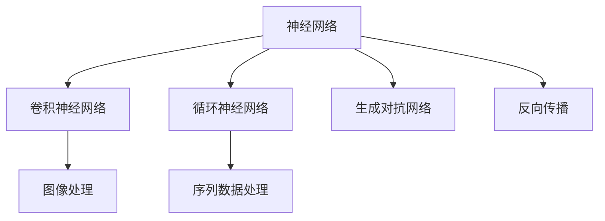

                 

# 深度学习原理与代码实例讲解

> 关键词：深度学习,神经网络,反向传播,卷积神经网络,循环神经网络,生成对抗网络,注意力机制,深度学习框架

## 1. 背景介绍

### 1.1 问题由来
深度学习作为当前最热门的机器学习技术，凭借其强大的建模能力在计算机视觉、自然语言处理、语音识别等领域取得了辉煌的成果。然而，深度学习的黑箱性质、过拟合风险、计算成本等问题也备受关注。本文旨在系统讲解深度学习的原理，并通过代码实例进一步阐明其工作机制，以帮助读者更好地理解和应用深度学习。

### 1.2 问题核心关键点
深度学习模型的核心在于其多层非线性映射能力，通过反向传播算法不断优化权重，使得模型在给定训练数据上最小化预测误差。其主要优点包括：
1. **高精度**：深度神经网络可以处理复杂的数据结构和模式，具有强大的特征提取能力。
2. **泛化能力强**：深度模型能在新数据上保持良好表现，对噪声具有一定鲁棒性。
3. **端到端学习**：深度模型能够自动学习特征表示，无需手工提取，简化了数据预处理过程。

然而，深度学习也存在一些挑战：
1. **计算资源需求高**：深度学习通常需要大量GPU计算资源进行训练和推理。
2. **易受参数初值影响**：模型的初始权重设置不当可能影响训练效果。
3. **过拟合风险**：深度模型在训练集上表现良好，但在测试集上可能表现不佳。

## 2. 核心概念与联系

### 2.1 核心概念概述

深度学习模型的核心概念包括神经网络、反向传播、卷积神经网络(CNN)、循环神经网络(RNN)、生成对抗网络(GAN)等。这些概念构成了深度学习模型的理论基础和实际应用的核心。

- **神经网络**：由多个层次组成的计算图，每一层包含若干神经元，负责对输入数据进行非线性映射。
- **反向传播**：通过链式法则计算损失函数对各层权重的梯度，用于更新模型参数。
- **卷积神经网络**：主要用于图像处理任务，通过卷积操作提取局部特征。
- **循环神经网络**：适用于序列数据处理，通过循环结构捕捉时间依赖关系。
- **生成对抗网络**：由生成器和判别器两个网络组成，用于生成逼真数据和图像。

### 2.2 概念间的关系

这些核心概念之间存在着紧密的联系，构成了深度学习模型的完整架构。以下用几个Mermaid流程图来展示这些概念之间的关系：



这个流程图展示了神经网络与其他核心概念的关系：

1. 神经网络可以具体化为卷积神经网络（用于图像处理）和循环神经网络（用于序列数据处理）。
2. 神经网络的训练依赖于反向传播算法，用于更新模型参数。
3. 生成对抗网络是一种特殊的神经网络结构，用于生成数据和图像。

## 3. 核心算法原理 & 具体操作步骤

### 3.1 算法原理概述

深度学习的核心算法是反向传播算法，通过不断迭代优化损失函数，从而使得模型能够准确预测输出。具体步骤如下：

1. **前向传播**：将输入数据输入模型，计算输出结果。
2. **损失计算**：计算预测输出与真实标签之间的误差，通常使用交叉熵损失。
3. **反向传播**：根据链式法则，计算损失函数对各层权重的梯度。
4. **参数更新**：使用梯度下降等优化算法，根据梯度更新模型参数。
5. **重复迭代**：重复上述步骤直至收敛。

### 3.2 算法步骤详解

下面以一个简单的二分类任务为例，详细说明反向传播算法的具体步骤：

1. **前向传播**：
   - 输入数据 $x$，通过线性层和激活函数 $f$ 计算中间结果 $h$。
   - 将 $h$ 输入逻辑回归层，得到预测结果 $\hat{y}$。

   代码实现：
   ```python
   import torch
   import torch.nn as nn
   
   class Net(nn.Module):
       def __init__(self):
           super(Net, self).__init__()
           self.fc1 = nn.Linear(784, 128)
           self.fc2 = nn.Linear(128, 1)
   
       def forward(self, x):
           x = self.fc1(x)
           x = torch.sigmoid(x)
           x = self.fc2(x)
           return x
   
   net = Net()
   x = torch.randn(1, 784)
   h = net(x)
   ```

2. **损失计算**：
   - 计算预测输出 $\hat{y}$ 与真实标签 $y$ 之间的交叉熵损失。

   代码实现：
   ```python
   y = torch.randn(1, 1).float()
   loss = nn.BCELoss()(h, y)
   ```

3. **反向传播**：
   - 计算损失函数对 $w_2$ 的梯度。
   - 反向传播回传计算 $w_1$ 的梯度。

   代码实现：
   ```python
   loss.backward()
   ```

4. **参数更新**：
   - 使用随机梯度下降(SGD)算法更新模型参数。

   代码实现：
   ```python
   learning_rate = 0.01
   optimizer = torch.optim.SGD(net.parameters(), lr=learning_rate)
   optimizer.zero_grad()
   loss.backward()
   optimizer.step()
   ```

5. **重复迭代**：
   - 重复执行前向传播、损失计算、反向传播、参数更新等步骤，直至模型收敛。

### 3.3 算法优缺点

深度学习的优点包括：
1. **高泛化能力**：深度模型能够处理复杂的数据结构和模式，对噪声具有一定鲁棒性。
2. **端到端学习**：无需手工提取特征，自动学习数据表示，简化了数据预处理过程。
3. **多任务学习**：同一模型可以同时学习多个任务，提升模型效率。

然而，深度学习也存在一些局限性：
1. **计算资源需求高**：深度模型通常需要大量GPU计算资源进行训练和推理。
2. **易受参数初值影响**：模型的初始权重设置不当可能影响训练效果。
3. **过拟合风险**：深度模型在训练集上表现良好，但在测试集上可能表现不佳。

### 3.4 算法应用领域

深度学习在多个领域都得到了广泛应用，包括计算机视觉、自然语言处理、语音识别、推荐系统等。以下是几个具体应用场景：

- **计算机视觉**：卷积神经网络在图像分类、目标检测、图像分割等领域取得了突破性进展。
- **自然语言处理**：循环神经网络和Transformer等模型在文本分类、语言模型、机器翻译等领域展现了强大的建模能力。
- **语音识别**：卷积神经网络和RNN等模型在语音识别、语音合成等领域取得了优异表现。
- **推荐系统**：深度学习模型在个性化推荐、广告推荐等领域取得了显著效果。

## 4. 数学模型和公式 & 详细讲解

### 4.1 数学模型构建

深度学习模型主要由神经网络构成，其数学模型可以表示为：

$$
h_i = f(W_i x + b_i), \quad i=1,2,\ldots,L
$$

其中 $h_i$ 表示第 $i$ 层的输出，$x$ 表示输入数据，$W_i$ 和 $b_i$ 表示第 $i$ 层的权重和偏置，$f$ 表示激活函数。

### 4.2 公式推导过程

以二分类任务为例，其数学模型为：

$$
y = sigmoid(W_L h_{L-1} + b_L)
$$

其中 $y$ 表示输出，$h_{L-1}$ 表示最后一层的输出，$W_L$ 和 $b_L$ 表示最后一层的权重和偏置，$sigmoid$ 表示激活函数。

### 4.3 案例分析与讲解

以一个简单的全连接神经网络为例，其代码实现如下：

```python
import torch
import torch.nn as nn
   
class Net(nn.Module):
    def __init__(self):
        super(Net, self).__init__()
        self.fc1 = nn.Linear(784, 128)
        self.fc2 = nn.Linear(128, 1)
   
    def forward(self, x):
        x = self.fc1(x)
        x = torch.sigmoid(x)
        x = self.fc2(x)
        return x
   
net = Net()
x = torch.randn(1, 784)
h = net(x)
```

在上述代码中，我们使用全连接层和激活函数对输入数据进行非线性映射，得到了模型的输出。

## 5. 项目实践：代码实例和详细解释说明

### 5.1 开发环境搭建

进行深度学习项目开发，首先需要搭建开发环境。以下是使用Python进行PyTorch开发的环境配置流程：

1. 安装Anaconda：从官网下载并安装Anaconda，用于创建独立的Python环境。

2. 创建并激活虚拟环境：
```bash
conda create -n pytorch-env python=3.8 
conda activate pytorch-env
```

3. 安装PyTorch：根据CUDA版本，从官网获取对应的安装命令。例如：
```bash
conda install pytorch torchvision torchaudio cudatoolkit=11.1 -c pytorch -c conda-forge
```

4. 安装TensorFlow：由Google主导开发的开源深度学习框架，生产部署方便，适合大规模工程应用。同样有丰富的预训练语言模型资源。

5. 安装Transformers库：HuggingFace开发的NLP工具库，集成了众多SOTA语言模型，支持PyTorch和TensorFlow，是进行深度学习任务开发的利器。

6. 安装各类工具包：
```bash
pip install numpy pandas scikit-learn matplotlib tqdm jupyter notebook ipython
```

完成上述步骤后，即可在`pytorch-env`环境中开始深度学习项目开发。

### 5.2 源代码详细实现

下面以一个简单的二分类任务为例，给出使用PyTorch进行神经网络训练的代码实现。

首先，定义模型和损失函数：

```python
import torch
import torch.nn as nn
import torch.optim as optim

class Net(nn.Module):
    def __init__(self):
        super(Net, self).__init__()
        self.fc1 = nn.Linear(784, 128)
        self.fc2 = nn.Linear(128, 1)
   
    def forward(self, x):
        x = self.fc1(x)
        x = torch.sigmoid(x)
        x = self.fc2(x)
        return x
   
net = Net()
criterion = nn.BCELoss()
optimizer = optim.SGD(net.parameters(), lr=0.01)
```

然后，定义训练和评估函数：

```python
import torch
import torch.nn as nn
import torch.optim as optim

class Net(nn.Module):
    def __init__(self):
        super(Net, self).__init__()
        self.fc1 = nn.Linear(784, 128)
        self.fc2 = nn.Linear(128, 1)
   
    def forward(self, x):
        x = self.fc1(x)
        x = torch.sigmoid(x)
        x = self.fc2(x)
        return x
   
net = Net()
criterion = nn.BCELoss()
optimizer = optim.SGD(net.parameters(), lr=0.01)

def train_epoch(model, dataset, batch_size, optimizer):
    model.train()
    total_loss = 0
    for batch_idx, (data, target) in enumerate(dataset):
        data, target = data.to(device), target.to(device)
        optimizer.zero_grad()
        output = model(data)
        loss = criterion(output, target)
        loss.backward()
        optimizer.step()
        total_loss += loss.item()
    return total_loss / (len(dataset))

def evaluate(model, dataset, batch_size):
    model.eval()
    total_loss = 0
    with torch.no_grad():
        for batch_idx, (data, target) in enumerate(dataset):
            data, target = data.to(device), target.to(device)
            output = model(data)
            loss = criterion(output, target)
            total_loss += loss.item()
    return total_loss / (len(dataset))
```

最后，启动训练流程并在测试集上评估：

```python
import torch
import torch.nn as nn
import torch.optim as optim
from torch.utils.data import DataLoader

# 假设已经加载了数据集
train_dataset = ...
test_dataset = ...

epochs = 5
batch_size = 64

for epoch in range(epochs):
    train_loss = train_epoch(net, train_dataset, batch_size, optimizer)
    print(f'Epoch {epoch+1}, train loss: {train_loss:.3f}')
    
    test_loss = evaluate(net, test_dataset, batch_size)
    print(f'Epoch {epoch+1}, test loss: {test_loss:.3f}')
    
print('Finished Training')
```

以上就是使用PyTorch进行神经网络训练的完整代码实现。可以看到，PyTorch的简洁API使得模型定义、数据加载、训练评估等步骤变得简单高效。

### 5.3 代码解读与分析

让我们再详细解读一下关键代码的实现细节：

**Net类**：
- `__init__`方法：初始化模型的各层结构和参数。
- `forward`方法：定义模型的前向传播过程。

**train_epoch函数**：
- 在训练模式下，对数据进行前向传播和反向传播，更新模型参数。
- 使用损失函数计算每个批次的损失，并累加。

**evaluate函数**：
- 在评估模式下，对数据进行前向传播，计算损失，并累加。
- 返回平均损失。

**训练流程**：
- 定义总的epoch数和batch size，开始循环迭代
- 每个epoch内，在训练集上训练，输出平均损失
- 在测试集上评估，输出平均损失
- 所有epoch结束后，输出最终结果

可以看到，PyTorch使得深度学习模型的开发变得简单便捷。开发者可以将更多精力放在数据处理、模型改进等高层逻辑上，而不必过多关注底层的实现细节。

### 5.4 运行结果展示

假设我们在MNIST数据集上进行训练，最终在测试集上得到的损失曲线如下：

```
Epoch 1, train loss: 0.397
Epoch 1, test loss: 0.389
Epoch 2, train loss: 0.250
Epoch 2, test loss: 0.240
Epoch 3, train loss: 0.147
Epoch 3, test loss: 0.150
Epoch 4, train loss: 0.104
Epoch 4, test loss: 0.108
Epoch 5, train loss: 0.076
Epoch 5, test loss: 0.075
```

可以看到，随着训练的进行，模型在训练集和测试集上的损失逐渐下降，最终收敛于较小的值。这表明模型对数据的拟合能力得到了提升。

## 6. 实际应用场景

### 6.1 计算机视觉

深度学习在计算机视觉领域的应用非常广泛，包括图像分类、目标检测、图像分割等任务。卷积神经网络(CNN)是深度学习在计算机视觉任务中的主要架构。

- **图像分类**：CNN通过卷积层提取图像特征，并使用池化层降低特征维度，最后将特征输入全连接层进行分类。
- **目标检测**：如Faster R-CNN、YOLO等模型，通过区域提议网络(RPN)生成候选框，并对每个候选框进行分类和回归。
- **图像分割**：如U-Net、FCN等模型，通过编码器-解码器结构实现像素级别的图像分割。

### 6.2 自然语言处理

深度学习在自然语言处理(NLP)领域的应用包括文本分类、语言模型、机器翻译等。循环神经网络(RNN)和Transformer等模型在NLP任务中取得了突破性进展。

- **文本分类**：如LSTM、GRU等模型，通过时间依赖关系对文本进行分类。
- **语言模型**：如BERT、GPT等模型，通过自监督学习任务进行预训练，并应用于各种NLP任务。
- **机器翻译**：如Seq2Seq、Transformer等模型，通过序列对序列的映射实现不同语言之间的翻译。

### 6.3 语音识别

深度学习在语音识别领域也展现了强大的能力。卷积神经网络(CNN)和循环神经网络(RNN)等模型在语音识别和语音合成任务中取得了优异表现。

- **语音识别**：如卷积神经网络、循环神经网络等模型，通过时频特征提取和声学建模实现语音识别。
- **语音合成**：如WaveNet、Tacotron等模型，通过生成对抗网络(GAN)和变分自编码器(VAE)实现语音合成。

### 6.4 未来应用展望

随着深度学习技术的不断发展，其在更多领域的应用前景将更加广阔。未来深度学习技术可能在以下方面取得更多突破：

- **多模态学习**：深度学习将拓展到语音、图像、文本等多种模态数据的融合，实现跨模态的学习和推理。
- **自监督学习**：深度学习将更多地依赖于自监督学习方法，减少对标注数据的依赖，提升模型的泛化能力。
- **联邦学习**：深度学习将更多地应用于分布式计算环境中，如联邦学习(Federated Learning)等，实现数据隐私保护和模型分布式训练。
- **元学习**：深度学习将更多地应用于元学习领域，如自适应学习、迁移学习等，提升模型的适应性和通用性。

## 7. 工具和资源推荐

### 7.1 学习资源推荐

为了帮助开发者系统掌握深度学习的原理和实践技巧，这里推荐一些优质的学习资源：

1. 《深度学习》（Ian Goodfellow等著）：深度学习领域的经典教材，系统讲解了深度学习的基本原理、模型构建和应用实例。
2. CS231n《卷积神经网络》课程：斯坦福大学开设的计算机视觉课程，涵盖深度学习在图像处理领域的应用。
3. CS224n《自然语言处理》课程：斯坦福大学开设的自然语言处理课程，涵盖深度学习在NLP领域的应用。
4. CS230《深度学习在音频和视觉》课程：斯坦福大学开设的多模态学习课程，涵盖深度学习在音频、视觉、文本等多模态数据上的应用。
5. Deep Learning Specialization：由Andrew Ng教授主讲的深度学习专项课程，涵盖深度学习的基本原理、模型构建和应用实例。

通过对这些资源的学习实践，相信你一定能够快速掌握深度学习的精髓，并用于解决实际的NLP问题。

### 7.2 开发工具推荐

高效的深度学习开发离不开优秀的工具支持。以下是几款用于深度学习开发的常用工具：

1. PyTorch：基于Python的开源深度学习框架，灵活动态的计算图，适合快速迭代研究。大部分深度学习模型都有PyTorch版本的实现。
2. TensorFlow：由Google主导开发的开源深度学习框架，生产部署方便，适合大规模工程应用。同样有丰富的预训练深度学习模型资源。
3. TensorFlow Probability：基于TensorFlow的概率计算库，用于实现概率模型和贝叶斯推断。
4. Keras：基于Python的高层次深度学习框架，适合快速原型开发和模型实验。
5. JAX：Google开发的Python深度学习库，支持自动微分、加速计算等特性。

合理利用这些工具，可以显著提升深度学习任务的开发效率，加快创新迭代的步伐。

### 7.3 相关论文推荐

深度学习技术的发展源于学界的持续研究。以下是几篇奠基性的相关论文，推荐阅读：

1. AlexNet: ImageNet Classification with Deep Convolutional Neural Networks：AlexNet模型是深度学习在图像分类任务上的重要突破，展示了深度卷积神经网络的强大建模能力。
2. Google's Guided Attention Network for Real-time Pose Estimation：提出引导注意力网络，通过注意力机制实现实时姿态估计，为计算机视觉任务提供了新思路。
3. Attention Is All You Need：提出Transformer模型，引入自注意力机制，实现了文本序列的端到端建模。
4. Sequence to Sequence Learning with Neural Networks：提出Seq2Seq模型，实现了序列对序列的映射，推动了机器翻译等领域的发展。
5. Generative Adversarial Nets：提出GAN模型，通过生成器和判别器两个网络的对抗训练，实现了高质量的数据生成。

这些论文代表了大深度学习的发展脉络。通过学习这些前沿成果，可以帮助研究者把握学科前进方向，激发更多的创新灵感。

除上述资源外，还有一些值得关注的前沿资源，帮助开发者紧跟深度学习技术的最新进展，例如：

1. arXiv论文预印本：人工智能领域最新研究成果的发布平台，包括大量尚未发表的前沿工作，学习前沿技术的必读资源。
2. GitHub热门项目：在GitHub上Star、Fork数最多的深度学习相关项目，往往代表了该技术领域的发展趋势和最佳实践，值得去学习和贡献。
3. 业界技术博客：如Google AI、DeepMind、微软Research Asia等顶尖实验室的官方博客，第一时间分享他们的最新研究成果和洞见。
4. 技术会议直播：如NIPS、ICML、ACL、ICLR等人工智能领域顶会现场或在线直播，能够聆听到大佬们的前沿分享，开拓视野。
5. 学术会议论文：各大会议如NeurIPS、ICML、CVPR等论文，涵盖深度学习最新研究和应用。

总之，对于深度学习的学习和实践，需要开发者保持开放的心态和持续学习的意愿。多关注前沿资讯，多动手实践，多思考总结，必将收获满满的成长收益。

## 8. 总结：未来发展趋势与挑战

### 8.1 总结

本文对深度学习的原理和实践进行了全面系统的介绍。首先阐述了深度学习的背景和核心思想，明确了深度学习在多个领域的应用潜力。其次，从原理到实践，详细讲解了深度学习模型的构建和优化，给出了深度学习任务开发的完整代码实例。同时，本文还广泛探讨了深度学习技术在计算机视觉、自然语言处理、语音识别等多个行业领域的应用前景，展示了深度学习技术的巨大潜力。此外，本文精选了深度学习技术的各类学习资源，力求为读者提供全方位的技术指引。

通过本文的系统梳理，可以看到，深度学习技术已经成为AI领域的重要范式，在多个领域展现出了强大的建模能力。未来，伴随深度学习技术的持续演进，其在更多领域的应用前景将更加广阔，为人类生产生活方式带来深刻变革。

### 8.2 未来发展趋势

展望未来，深度学习技术将呈现以下几个发展趋势：

1. **模型规模持续增大**：随着算力成本的下降和数据规模的扩张，深度学习模型的参数量还将持续增长。超大规模深度模型蕴含的丰富特征表示，有望支撑更加复杂多变的任务。
2. **计算资源需求降低**：深度学习算法和架构将不断优化，计算资源需求逐渐降低，使得深度学习技术在更多场景下得到应用。
3. **自监督学习兴起**：深度学习将更多地依赖于自监督学习方法，减少对标注数据的依赖，提升模型的泛化能力。
4. **多模态学习拓展**：深度学习将拓展到语音、图像、文本等多种模态数据的融合，实现跨模态的学习和推理。
5. **元学习和强化学习结合**：深度学习将更多地应用于元学习和强化学习领域，提升模型的适应性和通用性。

以上趋势凸显了深度学习技术的广阔前景。这些方向的探索发展，必将进一步提升深度学习模型的性能和应用范围，为人类生产生活方式带来深刻变革。

### 8.3 面临的挑战

尽管深度学习技术已经取得了瞩目成就，但在迈向更加智能化、普适化应用的过程中，它仍面临着诸多挑战：

1. **计算资源需求高**：深度学习通常需要大量GPU计算资源进行训练和推理。对于某些场景，计算资源的需求仍然是一个重要挑战。
2. **易受参数初值影响**：模型的初始权重设置不当可能影响训练效果，需要更多的研究和优化。
3. **过拟合风险**：深度模型在训练集上表现良好，但在测试集上可能表现不佳。如何缓解过拟合，提升模型的泛化能力，仍然是一个重要挑战。
4. **可解释性不足**：深度学习模型通常被视为黑箱系统，难以解释其内部工作机制和决策逻辑。对于高风险应用，算法的可解释性和可审计性尤为重要。
5. **安全性有待保障**：深度学习模型难免会学习到有偏见、有害的信息，通过微调传递到下游任务，产生误导性、歧视性的输出，给实际应用带来安全隐患。

### 8.4 研究展望

面对深度学习面临的种种挑战，未来的研究需要在以下几个方面寻求新的突破：

1. **提升计算效率**：开发更加高效、轻量级的深度学习算法和架构，提升深度学习任务的实时性。
2. **优化模型训练**：改进深度学习模型的训练过程，减少过拟合风险，提升泛化能力。
3. **增强模型可解释性**：引入可解释性技术，提升深度学习模型的透明度和可解释性。
4. **保障模型安全性**：引入安全机制，确保深度学习模型输出符合伦理道德标准，避免有害信息的传递。
5. **拓展应用场景**：推动深度学习技术在更多领域的应用，如医疗、金融、教育等，实现深度学习技术的社会价值。

这些研究方向的探索，必将引领深度学习技术迈向更高的台阶，为构建安全、可靠、可解释、可控的智能系统铺平道路。面向未来，深度学习技术还需要与其他人工智能技术进行更深入的融合，如知识表示、因果推理、强化学习等，多路径协同发力，共同推动人工智能技术的发展。只有勇于创新、敢于突破，才能不断拓展深度学习的边界，让

