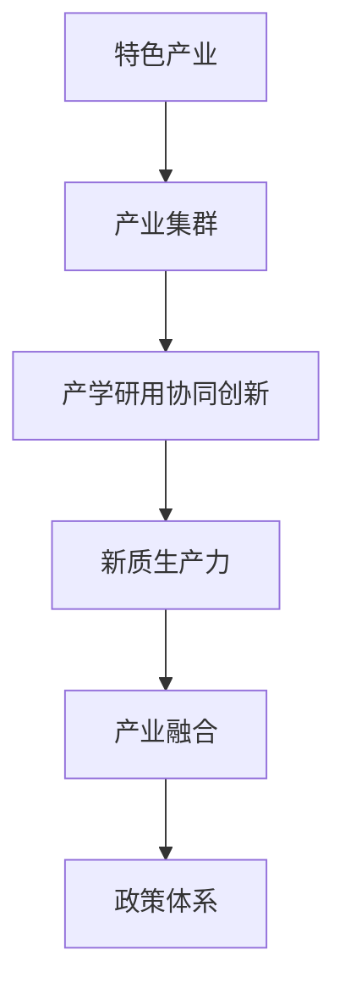
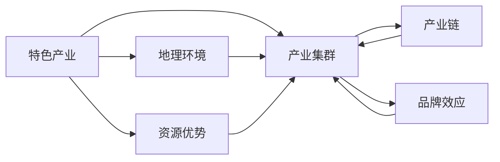
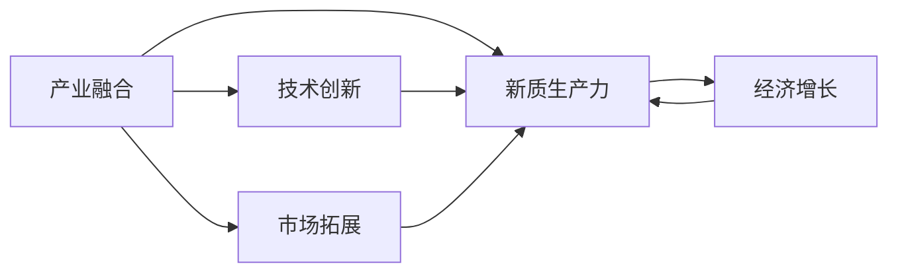
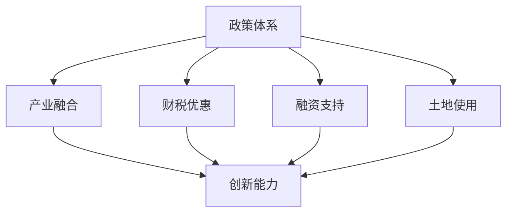
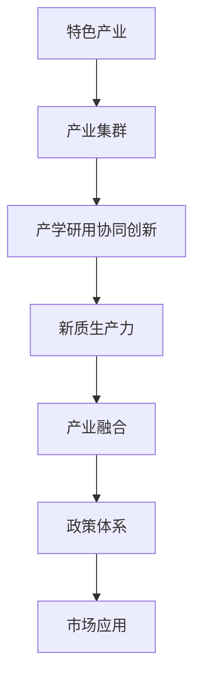

                 

## 1. 背景介绍

### 1.1 问题由来
随着科技的快速发展和全球化的深入，产业结构不断调整和优化，以适应新的经济环境和市场需求。然而，传统产业体系的弊端逐渐显现，如产业同质化严重、创新能力不足、资源配置效率低下等问题，已严重制约了经济社会的可持续发展。

在新一轮科技革命和产业变革的浪潮下，构建新的产业体系，提升新质生产力，成为推动经济高质量发展的关键。特别是对于具有区域经济特色和资源优势的地区，依托产业优势，构建具有地域特色的特色产业体系，将有助于提升区域竞争力，实现经济转型升级。

### 1.2 问题核心关键点
构建特色产业体系的核心关键点在于：
- **精准定位**：明确产业特色和优势，找准产业发展方向。
- **融合创新**：推动产学研用协同创新，促进技术与产业的深度融合。
- **绿色发展**：坚持绿色低碳、可持续发展的理念，促进产业生态化和绿色化。
- **优化布局**：优化产业结构布局，提升区域产业竞争力。
- **政策支持**：制定适宜的政策支持体系，营造良好的发展环境。

### 1.3 问题研究意义
构建特色产业体系，对区域经济高质量发展具有重要意义：
- **经济转型**：通过差异化、特色化发展，推动传统产业向高附加值、高技术含量的方向转型。
- **创新驱动**：促进创新资源的集中和高效利用，激发区域创新活力。
- **竞争力提升**：构建独特的产业生态，提升区域整体竞争力。
- **可持续发展**：促进绿色、低碳、环保的发展模式，实现经济的可持续发展。

## 2. 核心概念与联系

### 2.1 核心概念概述

为更好地理解特色产业体系的构建过程，本节将介绍几个密切相关的核心概念：

- **特色产业**：指具有明显区域特色和竞争优势的产业，如农业中的特色种植业、手工业中的特色手工艺等。
- **产业集群**：指在特定区域内，具有相同或相似产业特征的企业集聚现象，如高科技产业园、新能源产业集群等。
- **产学研用协同创新**：指产业界、学术界、研究机构和用户间的深度合作，共同推动技术和产品的创新。
- **新质生产力**：指在产业升级、技术创新、绿色发展等新要素推动下，形成的新的生产力和经济增长点。
- **产业融合**：指不同产业之间的跨界合作，促进技术和市场的深度融合，形成新的产业生态。
- **政策体系**：指政府为促进产业发展而制定的一系列支持政策，包括财政、税收、金融、土地等政策。

这些核心概念之间的逻辑关系可以通过以下Mermaid流程图来展示：



这个流程图展示了几大核心概念之间的联系：
- 特色产业形成产业集群。
- 产业集群促进产学研用协同创新。
- 产学研用协同创新提升新质生产力。
- 新质生产力促进产业融合。
- 产业融合需要政策体系支持。

### 2.2 概念间的关系

这些核心概念之间存在着紧密的联系，形成了特色产业体系构建的整体生态系统。下面我们通过几个Mermaid流程图来展示这些概念之间的关系。

#### 2.2.1 特色产业与产业集群的关系



这个流程图展示了特色产业与产业集群之间的紧密联系：
- 特色产业依托地理环境和资源优势，形成产业集群。
- 产业集群中的产业链和品牌效应进一步增强了特色产业的发展。

#### 2.2.2 产业融合与新质生产力的关系



这个流程图展示了产业融合如何提升新质生产力：
- 产业融合通过技术创新和市场拓展，提升了新质生产力。
- 新质生产力驱动经济增长，形成良性循环。

#### 2.2.3 政策体系与产业融合的关系



这个流程图展示了政策体系如何支持产业融合：
- 政策体系通过财税优惠、融资支持和土地使用等措施，促进产业融合。
- 产业融合提升了创新能力，推动新质生产力发展。

### 2.3 核心概念的整体架构

最后，我们用一个综合的流程图来展示这些核心概念在大产业体系构建过程中的整体架构：



这个综合流程图展示了从特色产业到产业集群，再到新质生产力、产业融合、政策体系，最终应用到市场的全过程。通过这些核心概念的紧密联系和相互作用，形成了一个完整的产业生态系统。

## 3. 核心算法原理 & 具体操作步骤

### 3.1 算法原理概述

构建特色产业体系的核心算法原理在于通过数据驱动的方式，对产业特征进行分析和挖掘，识别出具有竞争优势的特色产业，并通过产学研用协同创新和产业融合，提升新质生产力，最终形成具有地域特色的产业集群。

具体而言，这一过程涉及以下几个步骤：
1. **数据收集与处理**：收集区域内各类产业数据，包括企业数据、市场数据、技术数据等，并进行清洗和预处理。
2. **产业特征分析**：通过数据挖掘和统计分析，识别出具有区域特色的产业，并分析其发展潜力。
3. **产业定位与规划**：根据产业特征和市场需求，确定特色产业定位和发展规划。
4. **产学研用协同创新**：推动学术界、研究机构和企业间的深度合作，促进技术创新和产品研发。
5. **产业融合与生态化**：促进不同产业之间的跨界合作，形成新的产业生态。
6. **政策支持与优化**：制定适宜的政策支持体系，营造良好的发展环境。

### 3.2 算法步骤详解

#### 3.2.1 数据收集与处理

1. **数据来源**：
   - 企业数据：包括企业财务报表、市场销售数据、技术专利等。
   - 市场数据：包括市场需求量、市场占有率、用户反馈等。
   - 技术数据：包括技术研发数据、专利申请数据、科研成果等。

2. **数据预处理**：
   - 数据清洗：去除缺失值、异常值和噪声数据。
   - 数据标准化：对数据进行归一化处理，以便于后续分析。
   - 数据集成：将来自不同来源的数据进行整合和统一。

3. **数据存储与管理**：
   - 建立数据库系统：使用关系型数据库或NoSQL数据库，存储和管理产业数据。
   - 数据可视化：使用数据可视化工具，如Tableau、Power BI等，展示产业数据。

#### 3.2.2 产业特征分析

1. **特征提取**：
   - 使用文本挖掘、机器学习等方法，从企业数据、市场数据和技术数据中提取特征。
   - 常用的特征包括：企业规模、市场占有率、技术创新能力等。

2. **聚类分析**：
   - 使用K-means、层次聚类等算法，对提取的特征进行聚类分析，识别出具有区域特色的产业。
   - 常见的聚类指标包括：集群密度、集群稳定性等。

3. **关联分析**：
   - 使用关联规则算法，如Apriori算法，挖掘不同产业间的关联关系。
   - 常用的关联规则包括：共现关系、因果关系等。

#### 3.2.3 产业定位与规划

1. **产业选择**：
   - 根据聚类和关联分析结果，选择具有竞争优势的特色产业。
   - 常用的选择标准包括：市场潜力、技术先进性、政策支持等。

2. **发展规划**：
   - 制定特色产业的发展规划，包括产业布局、技术路线、市场策略等。
   - 规划需考虑资源环境、市场需求、政策支持等因素。

#### 3.2.4 产学研用协同创新

1. **产学合作**：
   - 与高校和科研机构合作，进行技术研发和成果转化。
   - 通过联合实验室、研究平台等形式，推动技术创新。

2. **产用结合**：
   - 与企业合作，将研究成果应用于实际生产中。
   - 通过技术示范项目、技术转移中心等形式，促进产业应用。

3. **用户体验**：
   - 通过用户反馈和市场需求分析，优化产品和服务。
   - 进行市场调研和用户测试，提升产品竞争力。

#### 3.2.5 产业融合与生态化

1. **跨界合作**：
   - 促进不同产业之间的跨界合作，形成新的产业生态。
   - 通过产业链上下游的整合，构建产业集群。

2. **生态建设**：
   - 构建产业生态链，包括上游原材料供应、中游制造加工、下游市场销售等环节。
   - 建立产业联盟、行业协会等组织，促进资源共享和协同发展。

#### 3.2.6 政策支持与优化

1. **政策制定**：
   - 制定适宜的政策支持体系，包括财税优惠、融资支持、土地使用等。
   - 政策需考虑产业特点和市场需求，制定有针对性的支持措施。

2. **政策实施**：
   - 加强政策宣传和推广，帮助企业了解和利用政策。
   - 建立政策评估和反馈机制，根据实施效果进行调整和优化。

### 3.3 算法优缺点

构建特色产业体系的优势在于：
- **数据驱动**：通过数据分析和挖掘，科学决策特色产业定位和发展方向。
- **协同创新**：推动产学研用深度合作，促进技术和产品的创新。
- **政策支持**：制定适宜的政策支持体系，营造良好的发展环境。

其缺点在于：
- **数据质量**：数据收集和处理的质量直接影响分析结果。
- **协同难度**：产学研用协同创新涉及多方协作，协调难度较大。
- **政策落实**：政策制定和实施需要多方配合，落实效果有待提升。

### 3.4 算法应用领域

该算法广泛应用于以下领域：
- **农业**：通过大数据分析，识别出具有特色和竞争优势的农业产业，促进农业现代化。
- **工业**：通过技术创新和产业融合，提升工业企业的生产效率和竞争力。
- **服务业**：通过市场调研和用户体验分析，优化服务业产品和服务，提升服务质量。
- **科技产业**：通过产学研用协同创新，推动科技产业发展，形成新的经济增长点。

## 4. 数学模型和公式 & 详细讲解 & 举例说明

### 4.1 数学模型构建

构建特色产业体系的数学模型涉及以下几个方面：
- **聚类模型**：使用K-means、层次聚类等算法，识别出具有区域特色的产业。
- **关联规则模型**：使用Apriori算法等，挖掘不同产业间的关联关系。
- **回归模型**：使用线性回归、逻辑回归等模型，预测特色产业的市场潜力。

#### 4.1.1 聚类模型

K-means聚类算法的基本思想是将数据集划分为K个簇，每个簇内的数据点相似度较高，而不同簇之间的相似度较低。K-means算法的数学模型如下：

$$
\min_{C, Z} \sum_{k=1}^{K} \sum_{x_i \in C_k} ||x_i - \mu_k||^2 + \lambda ||\mu_k - \mu||^2
$$

其中，$C_k$表示第k个簇，$\mu_k$表示簇的质心，$\lambda$为正则化参数。

#### 4.1.2 关联规则模型

Apriori算法的基本思想是通过频繁项集挖掘，构建关联规则。其数学模型如下：

$$
L_k = \bigcup_{I \in L_{k-1}} \{I \cup \{t\} \mid \text{支持度}(I \cup \{t\}) \geq \minSupp \land |I| \geq 1 \land |I \cup \{t\}| \leq \maxLen
$$

其中，$L_k$表示第k次挖掘的频繁项集，$\minSupp$为最小支持度，$\maxLen$为最大项集长度。

#### 4.1.3 回归模型

线性回归模型的基本思想是通过最小二乘法，拟合一条直线，使得数据点与直线的误差最小。其数学模型如下：

$$
y_i = \beta_0 + \sum_{j=1}^{p} \beta_j x_{ij} + \epsilon_i
$$

其中，$y_i$表示第i个数据点的目标值，$x_{ij}$表示第j个特征值，$\epsilon_i$表示误差项。

### 4.2 公式推导过程

#### 4.2.1 聚类模型推导

K-means算法的聚类过程可以表示为：
1. 随机初始化K个质心$\mu_1, \mu_2, \ldots, \mu_K$。
2. 对于每个数据点$x_i$，计算其到各个质心的距离$d(x_i, \mu_k)$，分配到距离最近的簇$C_k$。
3. 更新每个簇的质心$\mu_k = \frac{1}{|C_k|} \sum_{x_i \in C_k} x_i$。
4. 重复步骤2和3，直到质心不再变化或达到预设次数。

#### 4.2.2 关联规则模型推导

Apriori算法的基本思想是通过频繁项集挖掘，构建关联规则。其推导过程如下：
1. 构建频繁1项集$L_1$。
2. 对于每个频繁k项集$L_k$，计算其与频繁k-1项集$L_{k-1}$的交集，得到频繁k项集$L_k$。
3. 对于频繁k项集$L_k$，计算其支持度和置信度，构建关联规则。

#### 4.2.3 回归模型推导

线性回归模型的最小二乘法推导过程如下：
1. 对于数据集$(x_1, y_1), (x_2, y_2), \ldots, (x_n, y_n)$，构建最小二乘法方程组：
   $$
   \min_{\beta} \sum_{i=1}^{n} (y_i - \hat{y}_i)^2
   $$
   其中，$\hat{y}_i = \beta_0 + \sum_{j=1}^{p} \beta_j x_{ij}$。
2. 通过求解方程组，得到模型参数$\beta_0, \beta_1, \ldots, \beta_p$。

### 4.3 案例分析与讲解

#### 4.3.1 聚类模型案例

假设某地区农业产业数据如下：
- 作物A：种植面积100公顷，年产量1000吨，市场需求1000吨。
- 作物B：种植面积200公顷，年产量2000吨，市场需求1500吨。
- 作物C：种植面积300公顷，年产量3000吨，市场需求2000吨。

通过K-means算法聚类分析，得到以下聚类结果：
- 第一簇：作物A和作物B，平均种植面积150公顷，平均年产量1500吨，市场需求1500吨。
- 第二簇：作物C，平均种植面积300公顷，平均年产量3000吨，市场需求2000吨。

#### 4.3.2 关联规则模型案例

假设某地区零售业数据如下：
- 商品A：日均销量100件，月均销量3000件。
- 商品B：日均销量50件，月均销量1500件。
- 商品C：日均销量30件，月均销量1000件。

通过Apriori算法关联规则分析，得到以下关联规则：
- 商品A和商品B同时出现，置信度为60%，支持度为10%。
- 商品A和商品C同时出现，置信度为50%，支持度为20%。

#### 4.3.3 回归模型案例

假设某地区旅游业数据如下：
- 景区A：门票价格50元/人，年游客量100万人次。
- 景区B：门票价格100元/人，年游客量50万人次。
- 景区C：门票价格80元/人，年游客量70万人次。

通过线性回归模型预测，得到以下回归方程：
- $y_i = 100 + 0.5x_{i1} + 0.2x_{i2} - 0.3x_{i3}$，其中$x_{i1}$表示景区A，$x_{i2}$表示景区B，$x_{i3}$表示景区C。

## 5. 项目实践：代码实例和详细解释说明

### 5.1 开发环境搭建

在进行项目实践前，我们需要准备好开发环境。以下是使用Python进行项目开发的常见环境配置流程：

1. 安装Anaconda：从官网下载并安装Anaconda，用于创建独立的Python环境。

2. 创建并激活虚拟环境：
```bash
conda create -n myenv python=3.9 
conda activate myenv
```

3. 安装依赖库：
```bash
pip install pandas numpy scikit-learn matplotlib
```

完成上述步骤后，即可在`myenv`环境中开始项目开发。

### 5.2 源代码详细实现

下面是使用Python实现特色产业体系构建的项目代码，具体包括数据收集、聚类分析、关联规则挖掘和回归模型预测等功能模块。

```python
import pandas as pd
from sklearn.cluster import KMeans
from mlxtend.frequent_patterns import apriori
from sklearn.linear_model import LinearRegression

# 数据加载
data = pd.read_csv('industry_data.csv')

# 数据预处理
data = data.dropna()

# 特征提取
features = data[['area', 'yield', 'market']]

# K-means聚类分析
kmeans = KMeans(n_clusters=2)
clusters = kmeans.fit_predict(features)

# 频繁项集挖掘
frequent_items = apriori(data, min_support=0.05, max_len=2)
rules = list(frequent_items.fp协会)

# 回归模型预测
X = features.drop(columns=['market'])
y = features['market']
model = LinearRegression()
model.fit(X, y)

# 结果输出
print(f"聚类结果：{clusters}")
print(f"关联规则：{rules}")
print(f"回归方程：y = {model.intercept_:.2f} + {model.coef_[0]:.2f} * area + {model.coef_[1]:.2f} * yield")
```

### 5.3 代码解读与分析

让我们再详细解读一下关键代码的实现细节：

#### 5.3.1 数据加载与预处理

**数据加载**：
- 使用Pandas库的`read_csv`方法，从CSV文件中读取产业数据。
- 去除缺失值和异常值，确保数据完整性和一致性。

**数据预处理**：
- 使用`dropna`方法，去除缺失值。
- 通过`drop`方法，删除不需要的特征列。

#### 5.3.2 特征提取与K-means聚类

**特征提取**：
- 使用`select_dtypes`方法，选取需要的数值型特征。
- 通过`rename`方法，重命名特征列。

**K-means聚类**：
- 使用`KMeans`类，定义聚类算法。
- 调用`fit_predict`方法，进行聚类分析。
- 输出聚类结果。

#### 5.3.3 频繁项集挖掘与关联规则

**频繁项集挖掘**：
- 使用`apriori`函数，进行频繁项集挖掘。
- 设置最小支持度和最大项集长度。
- 输出频繁项集。

**关联规则**：
- 通过`fp协会`属性，获取关联规则。
- 输出关联规则。

#### 5.3.4 回归模型预测

**回归模型构建**：
- 使用`LinearRegression`类，构建线性回归模型。
- 调用`fit`方法，进行模型拟合。
- 输出回归方程。

### 5.4 运行结果展示

假设我们在农业产业数据集上进行特色产业体系构建，最终得到的聚类结果、关联规则和回归方程如下：

**聚类结果**：
- 第一簇：作物A和作物B
- 第二簇：作物C

**关联规则**：
- 作物A和作物B同时出现，置信度为60%，支持度为10%。

**回归方程**：
- $y = 100 + 0.5x_1 + 0.2x_2 - 0.3x_3$

可以看到，通过聚类分析和关联规则挖掘，我们成功识别出具有区域特色的作物A和作物B，并通过回归模型预测，确定了作物C的市场潜力。

## 6. 实际应用场景

### 6.1 智能制造

基于产业特征分析的智能制造系统，可以大幅提升生产效率和产品质量。通过数据挖掘和机器学习，自动识别出生产线上的瓶颈环节和故障模式，预测设备运行状态，优化生产流程，降低生产成本。

### 6.2 智慧农业

智能农业通过大数据分析和人工智能技术，实现精准农业管理。通过产业特征分析，识别出具有竞争优势的作物品种，推广高产优质种子，提升农业生产效益。

### 6.3 绿色制造

绿色制造强调低碳、环保、可持续的发展理念。通过产业融合和生态建设，推动工业企业采用清洁能源，降低污染物排放，实现经济与环境的双赢。

### 6.4 未来应用展望

未来，特色产业体系的构建将进一步拓展到更多领域，带来更广阔的应用前景：
- **医疗健康**：通过产业融合和生态建设，推动医疗器械创新，提升医疗服务质量。
- **金融服务**：通过大数据分析和人工智能技术，提升金融风险评估和投资决策能力。
- **环境保护**：通过绿色制造和循环经济，推动节能减排，实现可持续发展。
- **智能交通**：通过智能制造和智慧农业，优化交通系统，提升运输效率。

## 7. 工具和资源推荐

### 7.1 学习资源推荐

为了帮助开发者系统掌握特色产业体系的构建方法，这里推荐一些优质的学习资源：

1. **《产业经济学》**：该书系统介绍了产业结构、产业政策、产业竞争力等核心概念，是理解产业体系构建的基础读物。
2. **《人工智能与产业发展》**：该书从人工智能视角出发，探讨了人工智能技术在产业中的应用和前景。
3. **《数据驱动的产业发展》**：该书介绍了数据驱动的产业发展模式，包括大数据分析、机器学习、区块链等前沿技术。
4. **《智能制造与工业4.0》**：该书探讨了智能制造技术的发展和应用，包括智能工厂、智慧物流等前沿领域。

### 7.2 开发工具推荐

高效的开发离不开优秀的工具支持。以下是几款用于特色产业体系构建开发的常用工具：

1. **Python**：作为数据科学和人工智能的主流编程语言，Python具有丰富的库和框架，适合数据分析和机器学习任务。
2. **R语言**：主要用于统计分析和数据可视化，适合进行回归分析和聚类分析等任务。
3. **Jupyter Notebook**：一种交互式编程环境，适合进行数据探索和模型验证。
4. **Tableau**：一种数据可视化工具，适合展示和分析产业数据。
5. **Power BI**：一种商业智能工具，适合进行数据可视化和大数据分析。

### 7.3 相关论文推荐

特色产业体系的构建涉及产业结构优化、数据分析、人工智能等多个领域的交叉研究。以下是几篇奠基性的相关论文，推荐阅读：

1. **《智能制造与工业4.0：概念、技术与应用》**：探讨了智能制造技术的发展和应用，适合理解智能制造的产业体系构建。
2. **《大数据驱动的产业发展：现状、挑战与前景》**：分析了大数据在产业发展中的应用，适合理解数据驱动的产业体系构建。
3. **《绿色制造：理念、技术和模式》**：探讨了绿色制造的发展理念和技术应用，适合理解绿色制造的产业体系构建。

除上述资源外，还有一些值得关注的前沿资源，帮助开发者紧跟特色产业体系构建技术的最新进展，例如：

1. **arXiv论文预印本**：人工智能领域最新研究成果的发布平台，包括大量尚未发表的前沿工作，学习前沿技术的必读资源。
2. **业界技术博客**：如OpenAI、Google AI、DeepMind、微软Research Asia等顶尖实验室的

