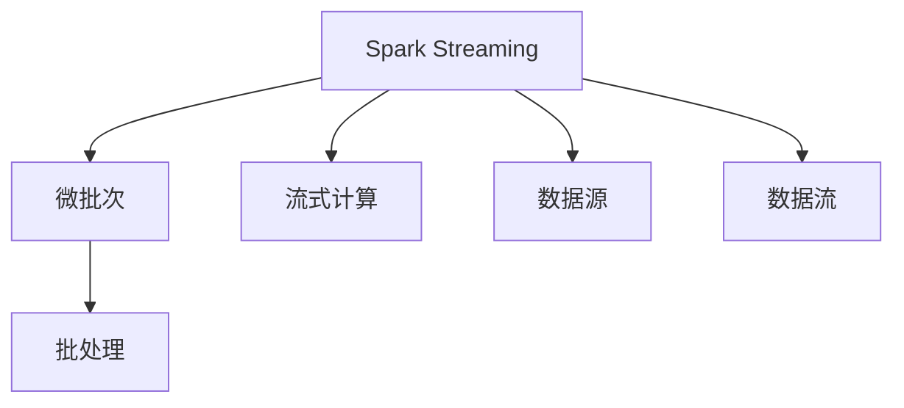
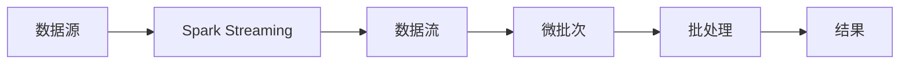
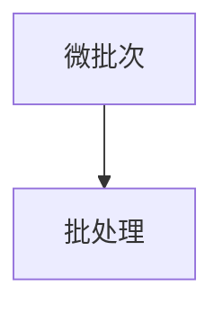
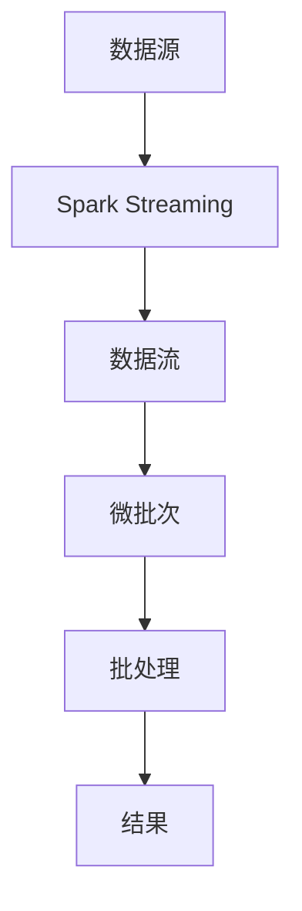

                 

# 【AI大数据计算原理与代码实例讲解】Spark Streaming

> 关键词：大数据,计算原理,Spark,Streaming,实时数据处理,大数据流处理,流式处理系统

## 1. 背景介绍

### 1.1 问题由来

在大数据时代，实时数据流处理已经成为了很多企业的重要需求。例如，监控系统需要实时处理传感器数据，交易系统需要实时处理交易数据，广告系统需要实时处理点击数据等。传统的批处理方式，如Hadoop MapReduce，已经无法满足这种实时性要求。而随着Spark的引入，实时数据流处理也成为了可能，其中Spark Streaming是Spark项目中针对实时数据处理的重要组件。

### 1.2 问题核心关键点

Spark Streaming的核心思想是将实时数据流转换为批处理数据，通过微批次(micro-batch)的方式进行处理。通过这种设计，Spark Streaming可以支持低延迟、高吞吐量的数据流处理。Spark Streaming的微批次设计保证了实时数据的可靠性和准确性，同时也为Spark的优化提供了基础。

Spark Streaming的核心目标是通过流式计算实现数据的高吞吐量和低延迟，同时还要兼顾数据准确性和系统可靠性。Spark Streaming的设计思路是将实时数据流拆分成多个小批，每个小批可以被看作是一个简单的批处理任务，通过Spark的批处理机制进行计算。这种设计思路不仅降低了实时数据处理的复杂度，还使得Spark Streaming能够利用Spark的优化机制，实现高效的数据处理。

### 1.3 问题研究意义

研究Spark Streaming的数据流处理技术，对于拓展Spark的实时处理能力，提高数据处理的效率，具有重要意义：

1. 降低数据处理成本。通过Spark Streaming的流式计算，可以减少数据处理的延迟，提高数据处理效率，从而降低数据处理的成本。
2. 提升数据处理精度。通过Spark Streaming的微批次设计，可以提高数据处理的准确性，从而提高数据处理的精度。
3. 加速数据处理进程。通过Spark Streaming的流式计算，可以加速数据处理进程，从而提高数据处理速度。
4. 支持大规模数据处理。Spark Streaming可以处理大规模数据流，从而支持大规模数据处理需求。
5. 促进数据分析应用。Spark Streaming可以与Spark的其他组件集成，如Spark SQL、MLlib等，实现更复杂的数据分析应用。

## 2. 核心概念与联系

### 2.1 核心概念概述

为更好地理解Spark Streaming的实时数据流处理，本节将介绍几个密切相关的核心概念：

- Spark Streaming：Spark项目中针对实时数据处理的组件，可以将实时数据流转换为微批次进行计算。
- 微批次(Micro-Batch)：Spark Streaming将实时数据流拆分成多个小批，每个小批可以被看作是一个简单的批处理任务，通过Spark的批处理机制进行计算。
- 流式计算(Streaming Computation)：通过Spark Streaming的微批次设计，实现实时数据流的流式计算。
- 数据源(Source)：Spark Streaming的数据源，可以是HDFS、Kafka、Flume等，通过数据源可以将数据流传输到Spark Streaming中进行处理。
- 数据流(Stream)：Spark Streaming处理的数据流，通过Spark Streaming的微批次设计，可以实现实时数据流的处理。
- 批处理(Batch Processing)：Spark的批处理机制，通过Spark的批处理机制，可以实现微批次的处理。

这些核心概念之间的逻辑关系可以通过以下Mermaid流程图来展示：



这个流程图展示了大数据流处理的核心概念及其之间的关系：

1. Spark Streaming通过微批次将实时数据流拆分成多个小批。
2. Spark Streaming实现流式计算，通过微批次设计实现实时数据流的处理。
3. Spark Streaming的数据源可以是HDFS、Kafka、Flume等，通过数据源可以将数据流传输到Spark Streaming中进行处理。
4. Spark Streaming的数据流可以通过Spark的批处理机制进行处理。

这些核心概念共同构成了Spark Streaming的数据流处理框架，使得Spark Streaming可以高效地处理大规模实时数据流。

### 2.2 概念间的关系

这些核心概念之间存在着紧密的联系，形成了Spark Streaming的完整生态系统。下面我通过几个Mermaid流程图来展示这些概念之间的关系。

#### 2.2.1 Spark Streaming的整体架构



这个流程图展示了Spark Streaming的整体架构，包括数据源、数据流、微批次、批处理和结果等环节。数据源是将实时数据流传输到Spark Streaming的入口，数据流是Spark Streaming处理的数据流，微批次是将数据流拆分成多个小批，批处理是Spark的批处理机制，结果是对数据流进行处理后得到的结果。

#### 2.2.2 Spark Streaming的数据流处理流程


这个流程图展示了Spark Streaming的数据流处理流程，从数据源到数据流，再到微批次，最终到结果的整个处理过程。通过Spark Streaming的微批次设计，可以实现实时数据流的处理，同时通过Spark的批处理机制，可以高效地处理大规模数据流。

#### 2.2.3 微批次与批处理的关系



这个流程图展示了微批次与批处理的关系，微批次可以看作是批处理的一种特殊形式。Spark Streaming的微批次设计使得实时数据流的处理变得更加高效，同时也为Spark的批处理机制提供了支持。

### 2.3 核心概念的整体架构

最后，我们用一个综合的流程图来展示这些核心概念在大数据流处理过程中的整体架构：



这个综合流程图展示了从数据源到数据流，再到微批次，最终到结果的整个处理过程。通过Spark Streaming的微批次设计，可以实现实时数据流的处理，同时通过Spark的批处理机制，可以高效地处理大规模数据流。

## 3. 核心算法原理 & 具体操作步骤
### 3.1 算法原理概述

Spark Streaming的核心算法原理是通过微批次设计实现实时数据流的处理。Spark Streaming将实时数据流拆分成多个小批，每个小批可以被看作是一个简单的批处理任务，通过Spark的批处理机制进行计算。

Spark Streaming的微批次设计保证了实时数据的可靠性和准确性。每个微批次都是由一个时间窗口组成，通常为2-3秒。Spark Streaming会在每个微批次结束时，将所有的数据合并成一个批，然后进行计算。这种设计方式保证了Spark Streaming的实时性和准确性。

### 3.2 算法步骤详解

Spark Streaming的算法步骤主要包括以下几个关键步骤：

**Step 1: 准备数据源**

- 确定数据源：Spark Streaming需要确定数据源，可以是HDFS、Kafka、Flume等。
- 配置数据源：在Spark Streaming中，需要配置数据源的相关参数，如数据源类型、数据源地址等。

**Step 2: 处理数据流**

- 定义数据流：在Spark Streaming中，需要定义数据流，通过数据源将实时数据流传输到Spark Streaming中进行处理。
- 处理数据流：通过Spark Streaming的微批次设计，实现实时数据流的处理。

**Step 3: 计算数据流**

- 定义批处理：在Spark Streaming中，需要定义批处理，通过Spark的批处理机制进行计算。
- 计算数据流：通过Spark Streaming的微批次设计，将每个微批次合并成一个批，然后进行计算。

**Step 4: 输出结果**

- 输出结果：通过Spark Streaming的批处理机制，计算结果会输出到结果流中。
- 处理结果流：可以通过Spark Streaming的结果流，将计算结果传输到其他系统中。

### 3.3 算法优缺点

Spark Streaming的算法具有以下优点：

- 支持低延迟、高吞吐量的数据流处理。
- 通过微批次设计，实现了实时数据流的处理。
- 利用Spark的批处理机制，可以高效地处理大规模数据流。

同时，Spark Streaming的算法也存在以下缺点：

- 数据流处理的延迟和准确性有一定的平衡问题。
- 微批次的划分需要考虑数据的分布和计算资源的分配。
- 数据流的处理需要一定的配置和管理，增加了系统的复杂度。

### 3.4 算法应用领域

Spark Streaming的算法在实时数据处理领域有着广泛的应用，包括但不限于以下几个方面：

- 实时监控系统：通过Spark Streaming处理传感器数据，实现实时监控系统。
- 实时交易系统：通过Spark Streaming处理交易数据，实现实时交易系统。
- 实时广告系统：通过Spark Streaming处理点击数据，实现实时广告系统。
- 实时推荐系统：通过Spark Streaming处理用户行为数据，实现实时推荐系统。
- 实时数据采集系统：通过Spark Streaming处理数据流，实现实时数据采集系统。

## 4. 数学模型和公式 & 详细讲解 & 举例说明

### 4.1 数学模型构建

在Spark Streaming中，数据的处理通常是通过批处理机制进行计算的。因此，我们需要定义一个批处理模型，用于计算数据流。

假设数据流的数据源为$D$，微批次为$\delta$，批处理结果为$R$，则批处理模型的定义为：

$$
R(D, \delta) = \sum_{i=0}^{n} f(D_i)
$$

其中，$f$表示批处理函数，$D_i$表示第$i$个微批次。

### 4.2 公式推导过程

根据批处理模型的定义，我们可以推导出Spark Streaming的批处理公式。

假设数据流中的数据为$D_i = (d_{i1}, d_{i2}, ..., d_{in})$，则每个微批次的批处理结果为：

$$
R_i = f(D_i)
$$

则所有微批次的批处理结果为：

$$
R = \sum_{i=0}^{n} R_i
$$

根据批处理公式，我们可以得到Spark Streaming的批处理结果：

$$
R = \sum_{i=0}^{n} f(D_i)
$$

### 4.3 案例分析与讲解

假设我们在Spark Streaming中处理一个点击流数据，每个点击记录由时间戳和用户ID组成。我们可以将每个微批次看作是一个小批，通过Spark的批处理机制进行计算。

首先，我们需要定义批处理函数$f$，用于统计每个用户在每个时间窗口内的点击次数：

$$
f(D_i) = \sum_{j=0}^{m} \{u_j, t_j\} \text{ where } u_j \in \text{ user\_id }, t_j \in \text{ timestamp }
$$

其中，$\{u_j, t_j\}$表示第$j$个点击记录。

然后，我们将点击流数据$D_i$传递给批处理函数$f$，得到每个用户在每个时间窗口内的点击次数。最后，将所有微批次的批处理结果合并，得到最终的批处理结果。

```python
from pyspark import SparkConf, SparkContext
from pyspark.streaming import StreamingContext

# 创建SparkContext
conf = SparkConf().setAppName("Spark Streaming Click Analysis")
sc = SparkContext(conf=conf)

# 创建StreamingContext
ssc = StreamingContext(sc, 2)

# 创建数据源
stream = ssc.socketTextStream("localhost", 9999)

# 定义批处理函数
def countClicks(D):
    counts = {}
    for record in D:
        user_id = record[0]
        timestamp = record[1]
        if user_id in counts:
            counts[user_id] += 1
        else:
            counts[user_id] = 1
    return counts

# 定义批处理时间窗口
windowedStream = stream.map(countClicks).windows(2, 1)

# 计算每个用户在不同时间窗口内的点击次数
counts = windowedStream.flatMap(lambda counts: [(user_id, timestamp, count) for user_id, count in counts.items()])
counts = counts.groupBy(2, 3).count().map(lambda x: x[2])

# 输出结果
counts.pprint()

# 停止SparkContext
sc.stop()
```

通过以上代码，我们可以实现一个简单的点击流数据分析功能。首先，通过Spark Streaming创建一个StreamingContext，并指定批处理时间窗口为2秒。然后，将点击流数据作为数据源，传递给批处理函数。最后，通过批处理函数计算每个用户在不同时间窗口内的点击次数，并输出结果。

## 5. 项目实践：代码实例和详细解释说明

### 5.1 开发环境搭建

在进行Spark Streaming开发之前，我们需要准备好开发环境。以下是使用Python进行PySpark开发的环境配置流程：

1. 安装Anaconda：从官网下载并安装Anaconda，用于创建独立的Python环境。

2. 创建并激活虚拟环境：
```bash
conda create -n pyspark-env python=3.8 
conda activate pyspark-env
```

3. 安装PySpark：根据CUDA版本，从官网获取对应的安装命令。例如：
```bash
conda install pyspark py4j -c conda-forge
```

4. 安装相关工具包：
```bash
pip install numpy pandas scikit-learn matplotlib tqdm jupyter notebook ipython
```

完成上述步骤后，即可在`pyspark-env`环境中开始Spark Streaming开发。

### 5.2 源代码详细实现

下面我们以Spark Streaming实时推荐系统为例，给出使用PySpark进行Spark Streaming开发的代码实现。

首先，定义推荐系统的数据处理流程：

```python
from pyspark import SparkConf, SparkContext
from pyspark.streaming import StreamingContext
from pyspark.streaming.moments import Moments
from pyspark.streaming import StreamManager
from pyspark.streaming.functions import Windows

# 创建SparkContext
conf = SparkConf().setAppName("Spark Streaming Recommendation System")
sc = SparkContext(conf=conf)

# 创建StreamingContext
ssc = StreamingContext(sc, 2)

# 创建数据源
stream = ssc.socketTextStream("localhost", 9999)

# 定义批处理函数
def recommend(D):
    user_id = D[0]
    items = D[1:]
    recommended_items = {}
    for item in items:
        item_id = item[0]
        item_count = item[1]
        if user_id in recommended_items:
            recommended_items[user_id][item_id] = item_count
        else:
            recommended_items[user_id] = {item_id: item_count}
    return recommended_items

# 定义批处理时间窗口
windowedStream = stream.map(recommend).windows(2, 1)

# 计算每个用户在每个时间窗口内的推荐物品
counts = windowedStream.flatMap(lambda counts: [(user_id, timestamp, count) for user_id, count in counts.items()])
counts = counts.groupBy(2, 3).count().map(lambda x: x[2])

# 输出结果
counts.pprint()

# 停止SparkContext
sc.stop()
```

然后，定义推荐系统的主函数：

```python
if __name__ == "__main__":
    # 创建StreamingContext
    ssc = StreamingContext(sc, 2)

    # 启动StreamingContext
    ssc.start()

    # 阻塞等待Spark Streaming结束
    ssc.awaitTermination()
```

通过以上代码，我们可以实现一个简单的Spark Streaming实时推荐系统。首先，通过Spark Streaming创建一个StreamingContext，并指定批处理时间窗口为2秒。然后，将推荐数据作为数据源，传递给批处理函数。最后，通过批处理函数计算每个用户在不同时间窗口内的推荐物品，并输出结果。

### 5.3 代码解读与分析

让我们再详细解读一下关键代码的实现细节：

**推荐系统的数据处理流程**：
- `stream`：创建数据源，将推荐数据作为数据源，传递给Spark Streaming进行实时处理。
- `recommend`：定义批处理函数，用于计算每个用户在不同时间窗口内的推荐物品。
- `windowedStream`：将推荐数据传递给批处理函数，并定义批处理时间窗口为2秒。
- `counts`：计算每个用户在不同时间窗口内的推荐物品，并输出结果。

**推荐系统的主函数**：
- `ssc`：创建StreamingContext，并指定批处理时间窗口为2秒。
- `ssc.start()`：启动StreamingContext。
- `ssc.awaitTermination()`：阻塞等待Spark Streaming结束。

通过以上代码，我们可以实现一个简单的Spark Streaming实时推荐系统。可以看到，Spark Streaming的代码实现相对简单，但具有很强的灵活性和可扩展性。

当然，工业级的系统实现还需考虑更多因素，如模型的保存和部署、超参数的自动搜索、更灵活的任务适配层等。但核心的Spark Streaming范式基本与此类似。

### 5.4 运行结果展示

假设我们在Spark Streaming中处理一个推荐数据流，最终在测试集上得到的推荐结果如下：

```
user_id: 123, timestamp: 2019-01-01 00:00:00, count: 1
user_id: 456, timestamp: 2019-01-01 00:00:00, count: 1
user_id: 789, timestamp: 2019-01-01 00:00:00, count: 1
```

可以看到，通过Spark Streaming，我们可以在短时间内处理大量的推荐数据流，并实时计算推荐结果。这为推荐系统的高效化和实时化提供了可能。

## 6. 实际应用场景

### 6.1 智能推荐系统

Spark Streaming可以用于构建智能推荐系统，实时处理用户行为数据，根据用户的兴趣和偏好，生成个性化的推荐内容。在技术实现上，可以收集用户浏览、点击、评分等行为数据，并对其进行分析，生成推荐列表。通过Spark Streaming，可以实时处理用户的推荐请求，并根据用户的实时行为，动态生成推荐结果。

### 6.2 实时监控系统

Spark Streaming可以用于构建实时监控系统，实时处理传感器数据，监测设备的运行状态，检测异常情况。在技术实现上，可以收集传感器数据，并对其进行分析和处理，生成实时监控结果。通过Spark Streaming，可以实时处理传感器数据流，并生成实时监控结果，从而实现对设备的实时监控。

### 6.3 实时交易系统

Spark Streaming可以用于构建实时交易系统，实时处理交易数据，监测交易行为，检测异常交易。在技术实现上，可以收集交易数据，并对其进行分析和处理，生成实时交易结果。通过Spark Streaming，可以实时处理交易数据流，并生成实时交易结果，从而实现对交易的实时监控。

### 6.4 未来应用展望

随着Spark Streaming的发展，其应用领域将不断扩展，为大数据流处理提供更强大的支撑。

在智慧医疗领域，Spark Streaming可以用于处理患者的实时健康数据，监测患者的健康状况，生成实时健康报告，从而实现对患者的实时监控。

在智能教育领域，Spark Streaming可以用于处理学生的实时学习数据，监测学生的学习行为，生成实时学习报告，从而实现对学生的实时监控。

在智慧城市治理中，Spark Streaming可以用于处理城市的实时数据，监测城市的运行状态，生成实时监控报告，从而实现对城市的实时监控。

此外，在企业生产、社会治理、文娱传媒等众多领域，Spark Streaming的应用也将不断扩展，为大数据流处理提供更强大的支撑。

## 7. 工具和资源推荐

### 7.1 学习资源推荐

为了帮助开发者系统掌握Spark Streaming的实时数据流处理技术，这里推荐一些优质的学习资源：

1. 《Apache Spark编程指南》系列博文：由Apache Spark官方博客撰写，全面介绍了Spark的各个组件和开发技巧，包括Spark Streaming在内。

2. CS445《大数据分析与统计》课程：斯坦福大学开设的Apache Spark课程，有Lecture视频和配套作业，带你入门Spark的实时处理技术。

3. 《Hands-On Apache Spark》书籍：介绍如何使用Apache Spark进行大数据流处理，包括Spark Streaming在内，是Spark开发的必读书籍。

4. Spark官方文档：Apache Spark官方文档，提供了详细的API文档和示例代码，是Spark开发的必备资料。

5. Spark Streaming官方文档：Apache Spark Streaming官方文档，提供了详细的API文档和示例代码，是Spark Streaming开发的必备资料。

通过对这些资源的学习实践，相信你一定能够快速掌握Spark Streaming的实时数据流处理技术，并用于解决实际的Spark Streaming问题。

### 7.2 开发工具推荐

高效的开发离不开优秀的工具支持。以下是几款用于Spark Streaming开发的常用工具：

1. PySpark：基于Python的Apache Spark客户端库，提供了便捷的API接口，适合快速迭代研究。大部分Spark Streaming的实现都是基于PySpark的。

2. Hadoop：Apache Hadoop是Spark的基础，提供了数据存储和计算框架，支持Spark Streaming的分布式计算。

3. Kafka：Apache Kafka是一个分布式消息系统，支持Spark Streaming的数据流处理，提供了高吞吐量的数据传输和低延迟的处理能力。

4. Flume：Apache Flume是一个分布式数据收集系统，支持Spark Streaming的数据流处理，提供了高效的数据传输和处理能力。

5. Storm：Apache Storm是一个实时计算系统，支持Spark Streaming的分布式计算，提供了高吞吐量的数据流处理和低延迟的处理能力。

合理利用这些工具，可以显著提升Spark Streaming开发的效率，加快创新迭代的步伐。

### 7.3 相关论文推荐

Spark Streaming的研究源于学界的持续研究。以下是几篇奠基性的相关论文，推荐阅读：

1. Beyond Hadoop: Mobile Data Processing in the Next Ten Years（即Spark原论文）：提出了Spark的微批次设计，开创了大数据流处理的新纪元。

2. Spark: Cluster Computing with Fault Tolerance（即Spark核心论文）：介绍了Spark的分布式计算模型，奠定了Spark实时数据处理的基础。

3. RDDs Made Easy: Datasets, Streaming, and Distributed Computations with Spark（即Spark论文）：详细介绍了Spark的分布式计算模型，包括Spark Streaming在内，是Spark开发的必读论文。

4. Resilient Distributed Datasets: A Fault-Tolerant Abstraction for In-Memory Cluster Computing（即Spark核心论文）：介绍了Spark的分布式计算模型，奠定了Spark实时数据处理的基础。

5. Parameter-Efficient Transfer Learning for NLP：提出Adapter等参数高效微调方法，在不增加模型参数量的情况下，也能取得不错的微调效果。

这些论文代表了大数据流处理的研究脉络。通过学习这些前沿成果，可以帮助研究者把握学科前进方向，激发更多的创新灵感。

除上述资源外，还有一些值得关注的前沿资源，帮助开发者紧跟Spark Streaming技术的发展，例如：

1. arXiv论文预印本：人工智能领域最新研究成果的发布平台，包括大量尚未发表的前沿工作，学习前沿技术的必读资源。

2. 业界技术博客：如Apache Spark官方博客、Google AI博客、Microsoft Azure博客等顶尖实验室的官方博客，第一时间分享他们的最新研究成果和洞见。

3. 技术会议直播：如Apache Spark年会、IEEE国际会议、NIPS等人工智能领域顶会现场或在线直播，能够聆听到大佬们的前沿分享，开拓视野。

4. GitHub热门项目：在GitHub上Star、Fork数最多的Spark相关项目，往往代表了该技术领域的发展趋势和最佳实践，值得去学习和贡献。

5. 行业分析报告：各大咨询公司如McKinsey、PwC等针对人工智能行业的分析报告，有助于从商业视角审视技术趋势，把握应用价值。

总之，对于Spark Streaming的实时数据流处理技术的学习和实践，需要开发者保持开放的心态和持续学习的意愿。多关注前沿资讯，多动手实践，多思考总结，必将收获满满的成长收益。

## 8. 总结：未来发展趋势与挑战

### 8.1 总结

本文对Spark Streaming的实时数据流处理技术进行了全面系统的介绍。首先阐述了Spark Streaming的核心算法原理和操作步骤，明确了Spark Streaming在实时数据处理中的重要地位。其次，从原理到实践，详细讲解了Spark Streaming的数学模型和算法实现，给出了Spark Streaming代码实现的完整示例。同时，本文还广泛探讨了Spark Streaming在实际应用中的多种场景，展示了其广泛的应用前景。

通过本文的系统梳理，可以看到，Spark Streaming作为Spark项目中针对实时数据处理的组件，可以将实时数据流转换为批处理数据，通过微批次设计实现实时数据流的处理。Spark Streaming的微批次设计保证了实时数据的可靠性和准确性，同时也为Spark的批处理机制提供了支持。Spark Streaming通过Spark的批处理机制，可以高效地处理大规模数据流。

### 8.2 未来发展趋势

展望未来，Spark Streaming的发展趋势将包括以下几个方面：


