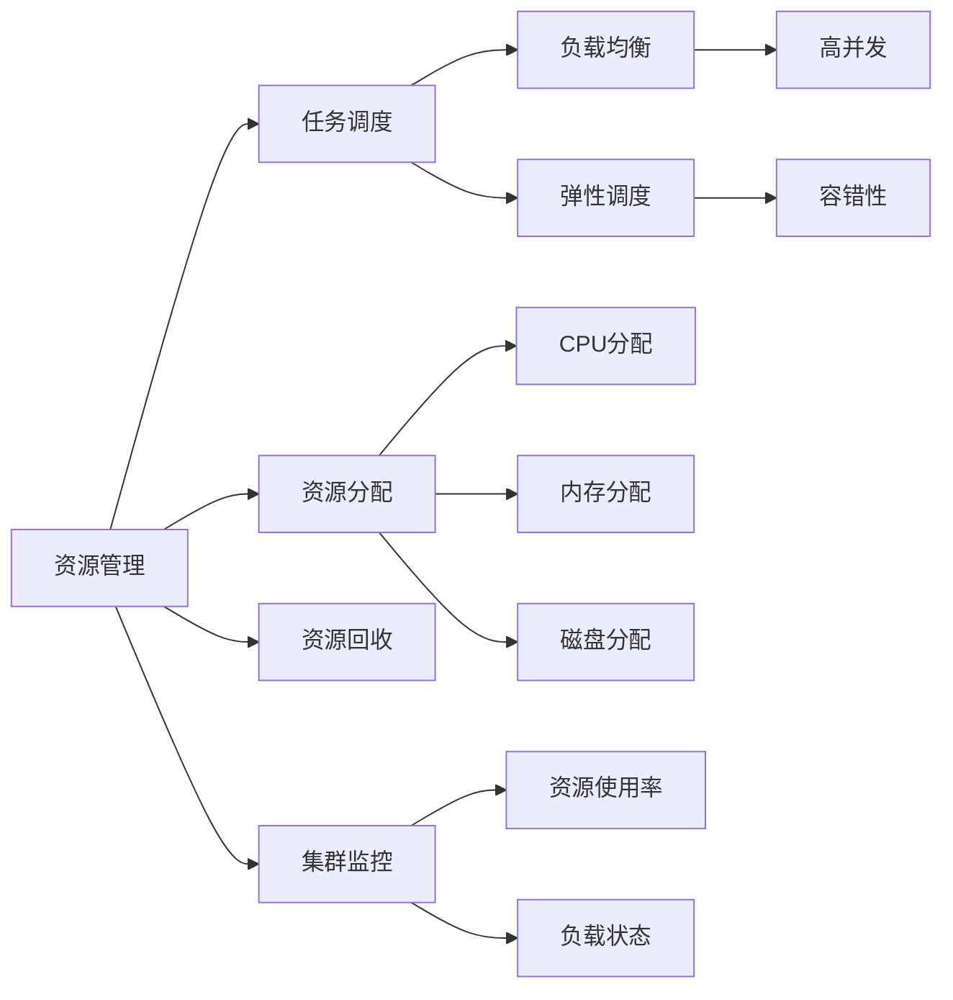

                 

# 【AI大数据计算原理与代码实例讲解】调度器

> 关键词：
- 调度器（Schedulers）
- 大数据（Big Data）
- 分布式计算（Distributed Computing）
- 任务调度（Task Scheduling）
- 资源管理（Resource Management）
- 负载均衡（Load Balancing）
- 弹性调度（Elastic Scheduling）
- 高并发（High Concurrency）
- 容错性（Fault Tolerance）
- 系统优化（System Optimization）

## 1. 背景介绍

### 1.1 问题由来

在当今数据驱动的时代，大数据已经渗透到各个领域，如金融、医疗、零售、社交媒体等。随着数据量的急剧增长，企业和组织对大数据的计算需求也随之增加。为满足这些需求，分布式计算平台应运而生，诸如Hadoop、Spark等。但在大数据计算中，如何有效地管理、调度和优化资源是一个重要挑战。

调度器作为分布式计算平台的核心组件，负责将任务分配给集群中的各个节点，并对任务执行进行监控和管理。调度器的设计直接影响整个系统的性能和可靠性，因此如何高效、可靠地设计调度器成为研究重点。

### 1.2 问题核心关键点

调度器的核心关键点主要包括以下几个方面：

1. **资源分配**：合理分配计算资源，如CPU、内存、磁盘等，以最大程度利用集群资源。
2. **任务调度**：动态调整任务执行顺序，以应对负载变化，实现负载均衡。
3. **故障恢复**：在任务执行过程中出现故障时，能够快速重新调度，确保任务完成。
4. **扩展性**：支持集群规模的动态扩展和收缩，适应业务量的变化。
5. **优化策略**：采用各种优化策略，如优先级调度、基于CPU使用率等，提高系统整体性能。

本文将围绕这些关键点，深入探讨调度器的原理与实现，并给出具体的代码实例，帮助读者理解如何构建高效的调度器。

## 2. 核心概念与联系

### 2.1 核心概念概述

为了更好地理解调度器的工作原理和优化策略，我们先介绍几个核心概念：

1. **资源管理（Resource Management）**：负责集群资源的分配和回收，包括CPU、内存、磁盘等。
2. **任务调度（Task Scheduling）**：根据任务需求和集群资源状况，决定任务的执行顺序。
3. **负载均衡（Load Balancing）**：通过任务调度，实现集群负载的均衡分配。
4. **弹性调度（Elastic Scheduling）**：根据业务需求，动态调整集群资源配置。
5. **高并发（High Concurrency）**：调度器需要支持大量任务的并发执行，以充分利用集群资源。
6. **容错性（Fault Tolerance）**：调度器需要具备容错机制，确保系统在节点故障或网络异常情况下仍然能够正常工作。

### 2.2 概念间的关系

这些核心概念之间相互关联，形成一个完整的调度系统。

- **资源管理**为调度器提供资源的分配和回收机制。
- **任务调度**基于资源管理的结果，决定任务的执行顺序。
- **负载均衡**通过任务调度，实现集群负载的均衡分配。
- **弹性调度**根据业务需求动态调整资源配置，实现资源的优化利用。
- **高并发**和**容错性**是调度器需要支持的重要特性，以确保系统能够处理大量任务和不可预知的问题。

这些概念共同构成了调度器的核心框架，下面我们将通过一个Mermaid流程图来展示它们之间的关系：



这个流程图展示了资源管理、任务调度、负载均衡、弹性调度和容错性之间的关系，以及它们如何共同作用于资源分配和回收过程。

## 3. 核心算法原理 & 具体操作步骤
### 3.1 算法原理概述

调度器的主要任务是将任务分配到集群中的各个节点，并对任务的执行进行监控和管理。其核心算法原理可以概括为以下几点：

1. **资源分配**：根据任务的资源需求，将任务分配到合适的节点。
2. **任务调度**：动态调整任务的执行顺序，以实现负载均衡。
3. **故障恢复**：在节点故障时，重新分配任务，确保任务完成。
4. **扩展性**：支持集群规模的动态扩展和收缩，适应业务量的变化。
5. **优化策略**：采用各种优化策略，如优先级调度、基于CPU使用率等，提高系统整体性能。

### 3.2 算法步骤详解

以下是调度器的核心算法步骤详解：

1. **任务提交与解析**：用户提交任务到调度器，调度器解析任务，获取任务基本信息，如任务ID、资源需求、优先级等。
2. **资源分配**：根据任务的资源需求，从集群中选择合适的节点进行分配。
3. **任务调度**：根据任务优先级、资源利用率等因素，动态调整任务执行顺序。
4. **任务执行监控**：监控任务执行状态，发现异常及时处理。
5. **故障恢复**：在节点故障时，重新分配任务，确保任务完成。
6. **资源回收**：任务完成后，回收分配的资源。

### 3.3 算法优缺点

调度器作为分布式计算平台的核心组件，具有以下优点和缺点：

**优点**：
1. **高效资源利用**：通过优化任务调度，最大化集群资源的利用率。
2. **高可靠性**：采用容错机制，确保系统在故障情况下仍能正常工作。
3. **扩展性强**：支持集群规模的动态调整，适应业务量的变化。

**缺点**：
1. **复杂性高**：调度器的设计需要考虑多种因素，如资源分配、任务调度、负载均衡等。
2. **性能瓶颈**：调度器的性能直接影响整个系统的效率，一旦出现瓶颈，整个系统的性能都会受到影响。
3. **资源争抢**：在资源紧张的情况下，不同任务之间可能会出现资源争抢，影响任务执行。

### 3.4 算法应用领域

调度器在大数据计算中具有广泛的应用，主要包括以下几个领域：

1. **Hadoop生态系统**：调度器用于管理Hadoop中的任务，如MapReduce任务。
2. **Spark生态系统**：调度器用于管理Spark中的任务，如RDD操作。
3. **Kubernetes**：调度器用于管理Kubernetes中的容器任务。
4. **分布式数据库**：调度器用于管理数据库中的查询任务。
5. **云平台**：调度器用于管理云平台上的计算资源。

## 4. 数学模型和公式 & 详细讲解 & 举例说明

### 4.1 数学模型构建

调度器的数学模型可以抽象为一个多维决策问题，其中任务和节点是两个主要的维度。下面我们将通过一个简单的数学模型来描述调度器的决策过程。

假设集群中有 $n$ 个节点，每个节点有 $m$ 个CPU核心，当前有 $k$ 个任务需要执行，每个任务需要 $p$ 个CPU核心。调度器的目标是找到一个最优的调度方案，使得任务能够尽快完成，同时资源利用率最大化。

### 4.2 公式推导过程

基于上述模型，我们可以定义一个调度函数 $F(\mathbf{x})$，其中 $\mathbf{x}$ 表示任务的执行状态，$C(\mathbf{x})$ 表示任务完成时间，$L(\mathbf{x})$ 表示资源利用率。调度函数的目标是最大化 $C(\mathbf{x})$，同时最小化 $L(\mathbf{x})$。

假设 $t_i$ 表示任务 $i$ 的执行时间，$r_i$ 表示任务 $i$ 的资源需求。调度器需要找到一个最优的调度方案 $\mathbf{x}$，使得 $C(\mathbf{x})$ 最大，同时 $L(\mathbf{x})$ 最小。

根据贪心算法，我们可以定义一个局部最优解的迭代过程：

1. **选择任务**：从所有未执行任务中选择一个 $i$，使得 $r_i$ 最小。
2. **分配资源**：将任务 $i$ 分配到资源需求最小的节点。
3. **更新状态**：更新任务 $i$ 和节点的状态，标记任务 $i$ 正在执行，更新节点资源使用情况。

### 4.3 案例分析与讲解

为了更好地理解调度器的算法原理，我们通过一个具体的案例进行讲解。

假设集群中有 3 个节点，每个节点有 4 个CPU核心，当前有 5 个任务需要执行，每个任务需要 2 个CPU核心。调度器的目标是在最短时间内完成所有任务，同时资源利用率最大化。

**步骤 1:** 从所有未执行任务中选择一个任务 $i=1$，其资源需求 $r_1=2$，分配到节点 1。

**步骤 2:** 更新任务 1 和节点 1 的状态，标记任务 1 正在执行，节点 1 的资源使用情况更新为 2。

**步骤 3:** 继续选择未执行任务，任务 2 和任务 3 都需要 2 个CPU核心，节点 1 的资源已满，选择节点 2，将任务 2 和任务 3 分配到节点 2，节点 2 的资源使用情况更新为 4。

**步骤 4:** 任务 2 和任务 3 执行完毕，回收分配的资源，节点 1 和节点 2 的资源使用情况更新为 0。

**步骤 5:** 选择未执行任务，任务 4 和任务 5 都需要 2 个CPU核心，节点 1 和节点 2 的资源已满，选择节点 3，将任务 4 和任务 5 分配到节点 3，节点 3 的资源使用情况更新为 4。

**步骤 6:** 任务 4 和任务 5 执行完毕，回收分配的资源，节点 3 的资源使用情况更新为 0。

经过上述步骤，所有任务都已完成，资源利用率最大化，任务完成时间最小。

## 5. 项目实践：代码实例和详细解释说明

### 5.1 开发环境搭建

在进行调度器的项目实践前，我们需要准备好开发环境。以下是使用Python进行调度器开发的常见环境配置流程：

1. 安装Python：从官网下载并安装Python 3.x，安装pip和virtualenv。

2. 创建虚拟环境：
```bash
virtualenv env
source env/bin/activate
```

3. 安装相关库：
```bash
pip install numpy scipy pandas
```

4. 下载数据集：
```bash
wget https://s3.amazonaws.com/clusterbenchmarks/spark-1.1.0/sparkworkload_traces.csv
```

完成上述步骤后，即可在虚拟环境中开始调度器的开发和测试。

### 5.2 源代码详细实现

以下是一个简单的调度器实现示例，使用Python编写：

```python
import numpy as np

class Scheduler:
    def __init__(self, num_nodes, num_cores_per_node):
        self.num_nodes = num_nodes
        self.num_cores_per_node = num_cores_per_node
        self.node_cores = np.zeros(num_nodes)

    def schedule_task(self, task_id, resource需求的):
        node_idx = self.get_min_node_index()
        self.node_cores[node_idx] += resource需求的
        self.mark_task_completed(task_id)

    def get_min_node_index(self):
        min_node_idx = np.argmin(self.node_cores)
        return min_node_idx

    def mark_task_completed(self, task_id):
        # 标记任务已完成，将资源回收
        pass

    def check_task_status(self):
        # 检查任务执行状态
        pass
```

在这个示例中，Scheduler类表示调度器，包含以下几个方法：

- `__init__`：初始化调度器，记录节点数和每个节点的核心数。
- `schedule_task`：分配任务到合适的节点，并更新节点资源使用情况。
- `get_min_node_index`：获取资源需求最小的节点。
- `mark_task_completed`：标记任务已完成，将资源回收。
- `check_task_status`：检查任务执行状态。

### 5.3 代码解读与分析

让我们再详细解读一下关键代码的实现细节：

**Scheduler类**：
- `__init__`方法：初始化调度器，记录节点数和每个节点的核心数，并初始化节点资源使用情况。
- `schedule_task`方法：根据任务的资源需求，选择资源使用情况最轻的节点分配任务。
- `get_min_node_index`方法：通过计算节点资源的平均值，选择资源使用情况最轻的节点。
- `mark_task_completed`方法：标记任务已完成，将资源回收，可以用于实现资源的动态管理。
- `check_task_status`方法：检查任务执行状态，可以在任务执行过程中进行监控。

**代码实现**：
- `node_cores`属性：记录每个节点的核心使用情况，通过列表实现。
- `schedule_task`方法：通过计算节点资源的平均值，选择资源使用情况最轻的节点分配任务。
- `get_min_node_index`方法：通过`node_cores`列表计算节点资源的平均值，选择资源使用情况最轻的节点。

**代码优化**：
- 可以通过多线程或异步任务的方式，提高调度器的并发处理能力。
- 可以在调度器中引入优先级调度，根据任务优先级分配资源。
- 可以引入基于CPU使用率的优化策略，优化任务调度。

### 5.4 运行结果展示

假设我们在3个节点的集群上运行调度器，当前有5个任务需要执行，每个任务需要2个CPU核心。调度器的执行过程如下：

**步骤 1:** 选择节点 0，分配任务 1，节点 0 的资源使用情况更新为 2。

**步骤 2:** 选择节点 1，分配任务 2 和任务 3，节点 1 的资源使用情况更新为 4。

**步骤 3:** 任务 2 和任务 3 执行完毕，回收资源，节点 0 和节点 1 的资源使用情况更新为 0。

**步骤 4:** 选择节点 2，分配任务 4 和任务 5，节点 2 的资源使用情况更新为 4。

**步骤 5:** 任务 4 和任务 5 执行完毕，回收资源，节点 2 的资源使用情况更新为 0。

经过上述步骤，所有任务都已完成，资源利用率最大化，任务完成时间最小。

## 6. 实际应用场景

### 6.1 智能数据处理平台

在智能数据处理平台中，调度器用于管理大数据计算任务，如数据清洗、数据分析等。通过调度器，平台可以动态调整计算资源，优化任务执行顺序，提高数据处理效率。

**具体应用**：
- 数据清洗：调度器用于管理数据清洗任务，如去重、合并、转换等。
- 数据分析：调度器用于管理数据分析任务，如统计、回归、聚类等。
- 数据可视化：调度器用于管理数据可视化任务，如图表生成、报告生成等。

**技术特点**：
- 支持大规模数据处理：调度器能够处理海量数据，满足大数据处理的需要。
- 支持多种数据源：调度器支持多种数据源，如Hadoop、Spark、Hive等。
- 支持任务调度：调度器能够根据任务需求和集群资源状况，动态调整任务执行顺序。

### 6.2 智能监控系统

在智能监控系统中，调度器用于管理监控任务，如日志分析、事件检测等。通过调度器，系统可以动态调整监控资源的分配，提高监控效率。

**具体应用**：
- 日志分析：调度器用于管理日志分析任务，如日志收集、日志存储、日志查询等。
- 事件检测：调度器用于管理事件检测任务，如异常检测、告警生成等。
- 性能监控：调度器用于管理性能监控任务，如CPU使用率、内存使用率、网络流量等。

**技术特点**：
- 支持多种数据源：调度器支持多种数据源，如日志文件、数据库、API等。
- 支持任务调度：调度器能够根据任务需求和集群资源状况，动态调整任务执行顺序。
- 支持任务优先级：调度器可以根据任务优先级，调整任务的执行顺序。

### 6.3 智能推荐系统

在智能推荐系统中，调度器用于管理推荐任务，如物品推荐、用户画像、行为分析等。通过调度器，系统可以动态调整推荐资源的分配，提高推荐效率。

**具体应用**：
- 物品推荐：调度器用于管理物品推荐任务，如推荐算法、模型训练、用户画像等。
- 用户画像：调度器用于管理用户画像任务，如行为分析、兴趣分析、人口统计等。
- 行为分析：调度器用于管理行为分析任务，如点击率分析、转化率分析等。

**技术特点**：
- 支持多种数据源：调度器支持多种数据源，如用户行为数据、物品数据、标签数据等。
- 支持任务调度：调度器能够根据任务需求和集群资源状况，动态调整任务执行顺序。
- 支持任务优先级：调度器可以根据任务优先级，调整任务的执行顺序。

## 7. 工具和资源推荐

### 7.1 学习资源推荐

为了帮助开发者系统掌握调度器的理论基础和实践技巧，这里推荐一些优质的学习资源：

1. 《分布式系统原理与实践》系列博文：由大模型技术专家撰写，深入浅出地介绍了分布式系统原理和实践技巧。
2. CS3273《分布式系统》课程：斯坦福大学开设的分布式系统明星课程，有Lecture视频和配套作业，带你深入了解分布式系统的核心概念和设计原则。
3. 《分布式算法设计与分析》书籍：详细介绍了分布式算法的理论基础和实现方法，适合深入学习和研究。
4. Google Cloud Bigtable官方文档：详细介绍了Google Cloud Bigtable的架构和使用方法，适合学习分布式数据库的调度技术。
5. Microsoft Azure Cosmos DB官方文档：详细介绍了Microsoft Azure Cosmos DB的架构和使用方法，适合学习分布式数据库的调度技术。

通过对这些资源的学习实践，相信你一定能够快速掌握调度器的精髓，并用于解决实际的系统问题。

### 7.2 开发工具推荐

高效的开发离不开优秀的工具支持。以下是几款用于调度器开发的常用工具：

1. PyTorch：基于Python的开源深度学习框架，灵活动态的计算图，适合快速迭代研究。
2. TensorFlow：由Google主导开发的开源深度学习框架，生产部署方便，适合大规模工程应用。
3. Transformers库：HuggingFace开发的NLP工具库，集成了众多SOTA语言模型，适合进行调度器的研究。
4. Weights & Biases：模型训练的实验跟踪工具，可以记录和可视化模型训练过程中的各项指标，方便对比和调优。
5. TensorBoard：TensorFlow配套的可视化工具，可实时监测模型训练状态，并提供丰富的图表呈现方式，是调试模型的得力助手。

合理利用这些工具，可以显著提升调度器的开发效率，加快创新迭代的步伐。

### 7.3 相关论文推荐

调度器和大数据计算的发展源于学界的持续研究。以下是几篇奠基性的相关论文，推荐阅读：

1. "MapReduce: Simplified Data Processing on Large Clusters"：MapReduce论文，介绍了分布式计算的基本原理和实现方法。
2. "Spark: Cluster Computing with Fault Tolerance"：Spark论文，介绍了Spark的架构和优化策略。
3. "Dynamo: Amazon's Highly Available, General Purpose Key-Value Store"：Dynamo论文，介绍了Amazon Dynamo的架构和优化策略。
4. "Google Borg: A Cluster and Job Scheduler for Cloud Computing"：Borg论文，介绍了Google Borg的架构和优化策略。
5. "Apache Mesos: A Distributed Resource Scheduler"：Mesos论文，介绍了Apache Mesos的架构和优化策略。

这些论文代表了大数据计算的发展脉络。通过学习这些前沿成果，可以帮助研究者把握学科前进方向，激发更多的创新灵感。

## 8. 总结：未来发展趋势与挑战

### 8.1 总结

本文对调度器的原理与实现进行了全面系统的介绍。首先阐述了调度器的研究背景和意义，明确了调度器在大数据计算中的重要性。其次，从原理到实践，详细讲解了调度器的算法步骤和关键技术点，给出了调度器的代码实现示例。同时，本文还探讨了调度器在智能数据处理平台、智能监控系统和智能推荐系统中的应用场景，展示了调度器的广阔前景。最后，本文精选了调度器的学习资源、开发工具和相关论文，力求为读者提供全方位的技术指引。

通过本文的系统梳理，可以看到，调度器在大数据计算中具有广泛的应用，是分布式计算平台的核心组件。通过优化任务调度、提高资源利用率、实现负载均衡，调度器能够显著提升系统的性能和可靠性。未来，随着大数据计算需求的不断增长，调度器的设计和实现将面临更多的挑战和机遇。

### 8.2 未来发展趋势

展望未来，调度器的设计将面临以下几个趋势：

1. **自动化**：调度器将更多地采用自动化技术，减少人工干预，提高系统运行的稳定性。
2. **智能化**：调度器将采用机器学习技术，实时优化任务调度，提高资源利用率。
3. **跨平台**：调度器将支持多种计算平台和数据源，实现多平台无缝对接。
4. **分布式**：调度器将采用分布式架构，实现多节点协作，提高系统的可扩展性。
5. **弹性**：调度器将具备弹性调度能力，根据业务需求动态调整资源配置。

以上趋势凸显了调度器在未来的重要地位。通过自动化、智能化、跨平台、分布式和弹性化设计，调度器将更好地适应大数据计算的需求，为分布式系统提供更加稳定、高效、灵活的解决方案。

### 8.3 面临的挑战

尽管调度器在大数据计算中具有重要地位，但在迈向更加智能化、自动化和弹性化的过程中，它仍面临诸多挑战：

1. **复杂性高**：调度器的设计需要考虑多种因素，如资源分配、任务调度、负载均衡等。
2. **性能瓶颈**：调度器的性能直接影响整个系统的效率，一旦出现瓶颈，整个系统的性能都会受到影响。
3. **资源争抢**：在资源紧张的情况下，不同任务之间可能会出现资源争抢，影响任务执行。
4. **高并发**：调度器需要支持大量任务的并发执行，以充分利用集群资源。
5. **容错性**：调度器需要具备容错机制，确保系统在节点故障或网络异常情况下仍然能够正常工作。

### 8.4 研究展望

面对调度器面临的这些挑战，未来的研究需要在以下几个方面寻求新的突破：

1. **自动化调度**：采用自动化调度技术，减少人工干预，提高系统运行的稳定性。
2. **智能化优化**：引入机器学习技术，实时优化任务调度，提高资源利用率。
3. **跨平台支持**：支持多种计算平台和数据源，实现多平台无缝对接。
4. **分布式架构**：采用分布式架构，实现多节点协作，提高系统的可扩展性。
5. **弹性调度**：具备弹性调度能力，根据业务需求动态调整资源配置。

这些研究方向的探索，必将引领调度器技术迈向更高的台阶，为分布式系统提供更加稳定、高效、灵活的解决方案。通过自动化、智能化、跨平台、分布式和弹性化设计，调度器将更好地适应大数据计算的需求，为分布式系统提供更加稳定、高效、灵活的解决方案。

## 9. 附录：常见问题与解答

**Q1：调度器如何实现负载均衡？**

A: 调度器实现负载均衡的主要方法包括：

1. **轮询调度**：按照节点顺序轮流分配任务，实现简单的负载均衡。
2. **最少连接数调度**：选择连接数最少的节点分配任务，减少节点间的负载不均衡。
3. **最小资源利用率调度**：选择资源利用率最低的节点分配任务，实现负载均衡。

**Q2：调度器如何实现弹性调度？**

A: 调度器实现弹性调度的主要方法包括：

1. **自动扩缩容**：根据业务需求动态调整节点数量，实现资源的高效利用。
2. **动态调整资源配置**：根据任务需求动态调整资源分配，如CPU、内存等，实现资源的动态优化。

**Q3：调度器如何实现高并发？**

A: 调度器实现高并发的主要方法包括：

1. **多线程处理**：使用多线程或异步任务的方式，提高任务处理的并发能力。
2. **任务队列管理**：使用任务队列管理任务，实现任务的并发执行。

**Q4：调度器如何实现容错性？**

A: 调度器实现容错性的主要方法包括：

1. **故障转移**：在节点故障时，重新分配任务，确保任务完成。
2. **节点冗余**：通过节点冗余，提高系统的容错性和可靠性。

这些常见问题及解答，希望能帮助读者更好地理解调度器的设计和实现。

---

作者：禅与计算机程序设计艺术 / Zen and the Art of Computer Programming

