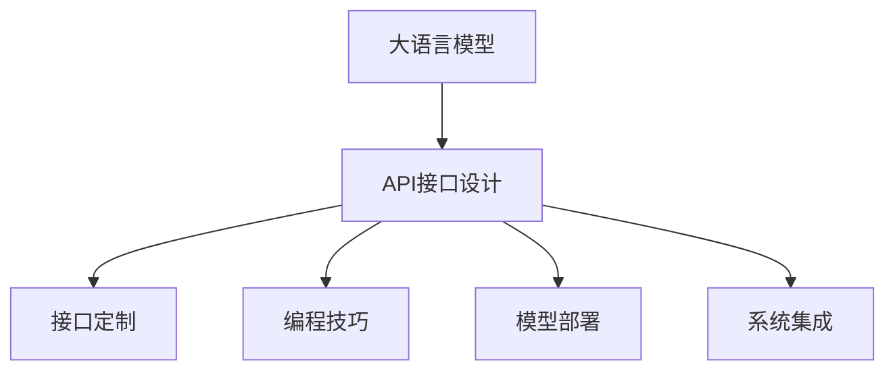
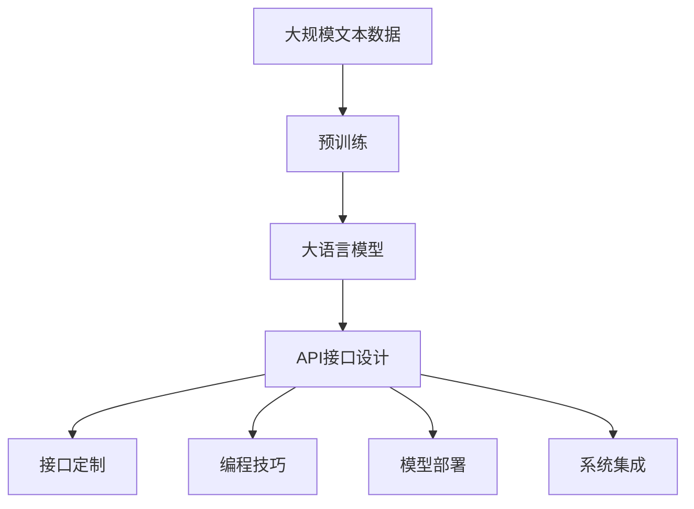
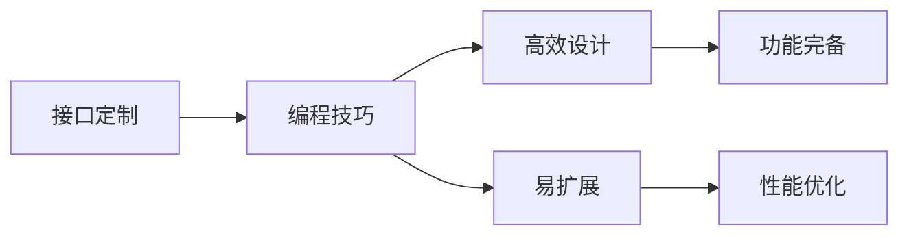
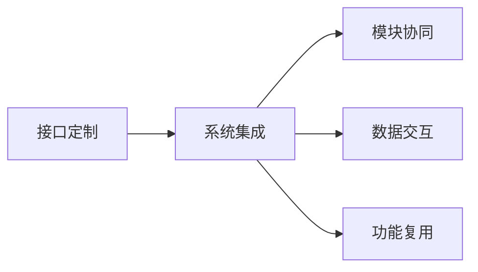

                 

# 【LangChain编程：从入门到实践】定制大模型接口

> 关键词：大语言模型, API设计, 接口定制, 编程技巧, 模型部署, 系统集成, 自然语言处理(NLP)

## 1. 背景介绍

### 1.1 问题由来

大语言模型（Large Language Models, LLMs）在自然语言处理（Natural Language Processing, NLP）领域中取得巨大成功，并在众多应用场景中展现出强大的潜力。然而，要将这些模型部署到实际应用中，需要设计高效、易用的API接口，使其能够与不同系统和环境无缝集成。

### 1.2 问题核心关键点

- **API设计**：如何设计符合用户需求的API接口，使其高效、易用。
- **接口定制**：针对不同应用场景，如何定制API接口的功能和参数。
- **编程技巧**：如何利用编程技巧，实现高效、易扩展的API接口。
- **模型部署**：如何将大语言模型有效部署到服务器或云平台。
- **系统集成**：如何将API接口与其他系统进行集成，构建完整的NLP应用生态。

### 1.3 问题研究意义

1. **降低开发成本**：通过设计良好的API接口，可以显著降低应用开发和维护的成本，加速模型部署和应用迭代。
2. **提升用户体验**：高质量的API接口能够提高用户对NLP应用的使用体验，使其更直观、更友好。
3. **增强系统性能**：合理定制API接口，可以提高系统处理能力和响应速度，提升应用整体性能。
4. **促进技术交流**：标准的API接口可以促进技术交流和共享，推动NLP技术在更多领域的应用。
5. **确保模型安全**：通过合理的API接口设计，可以有效防止模型被滥用或攻击，确保应用安全。

## 2. 核心概念与联系

### 2.1 核心概念概述

为更好地理解定制大模型API接口的方法，本节将介绍几个密切相关的核心概念：

- **大语言模型**：以自回归（如GPT）或自编码（如BERT）模型为代表的大规模预训练语言模型。通过在大规模无标签文本语料上进行预训练，学习通用的语言表示。
- **API接口**：应用程序编程接口，定义了应用程序的不同模块、类、方法之间的交互方式，是系统集成的重要组成部分。
- **接口定制**：根据具体应用需求，设计定制化的API接口，满足特定功能需求。
- **编程技巧**：利用编程语言和框架提供的技术手段，实现高效、可扩展的API接口设计。
- **模型部署**：将大语言模型有效部署到服务器或云平台，实现模型的实际应用。
- **系统集成**：将API接口与其他系统模块进行集成，构建完整的NLP应用生态。

这些核心概念之间的逻辑关系可以通过以下Mermaid流程图来展示：



这个流程图展示了从大语言模型到API接口设计，再到接口定制、编程技巧、模型部署和系统集成的一般流程。

### 2.2 概念间的关系

这些核心概念之间存在着紧密的联系，形成了API接口定制的完整生态系统。下面我通过几个Mermaid流程图来展示这些概念之间的关系。

#### 2.2.1 大语言模型的学习范式



这个流程图展示了从预训练到API接口设计的全过程，大语言模型通过预训练获得基础能力，然后设计API接口进行定制和部署。

#### 2.2.2 接口定制与编程技巧的关系



这个流程图展示了接口定制与编程技巧之间的关系。编程技巧帮助接口设计更加高效、易扩展，同时满足功能完备和性能优化需求。

#### 2.2.3 接口定制与系统集成



这个流程图展示了接口定制与系统集成之间的关系。接口定制使得模块协同更加高效，数据交互更加便捷，功能复用更加灵活。

### 2.3 核心概念的整体架构

最后，我们用一个综合的流程图来展示这些核心概念在大语言模型API接口定制过程中的整体架构：


这个综合流程图展示了从预训练到API接口定制，再到接口定制、编程技巧、模型部署和系统集成的完整过程。

## 3. 核心算法原理 & 具体操作步骤

### 3.1 算法原理概述

定制大语言模型的API接口，本质上是一个有监督的学习过程。其核心思想是：将大语言模型视作一个强大的"特征提取器"，通过有监督地训练API接口，使其能够自动地根据输入参数提取模型输出，适应特定任务需求。

形式化地，假设预训练模型为 $M_{\theta}$，其中 $\theta$ 为预训练得到的模型参数。给定API接口的训练集 $D=\{(\mathbf{x}_i, y_i)\}_{i=1}^N$，其中 $\mathbf{x}_i$ 为输入参数向量，$y_i$ 为对应模型的输出。微调的目标是找到新的模型参数 $\hat{\theta}$，使得模型 $M_{\hat{\theta}}$ 在训练集 $D$ 上输出的结果尽可能接近真实标签 $y_i$。

具体地，通过梯度下降等优化算法，微调过程不断更新模型参数 $\theta$，最小化损失函数 $\mathcal{L}(\theta)$，使得模型输出逼近真实标签。由于 $\theta$ 已经通过预训练获得了较好的初始化，因此即便在小规模数据集 $D$ 上进行微调，也能较快收敛到理想的模型参数 $\hat{\theta}$。

### 3.2 算法步骤详解

定制大语言模型的API接口，一般包括以下几个关键步骤：

**Step 1: 确定API接口需求**

- 分析目标应用场景和功能需求，确定API接口的设计方向。
- 定义API接口的输入参数和返回结果，包括数据类型、格式、示例等。
- 设计API接口的错误处理机制，确保接口的健壮性和可用性。

**Step 2: 设计API接口**

- 选择合适的编程语言和框架，设计API接口的语法和结构。
- 定义API接口的命名规范和文档格式，确保接口的一致性和可读性。
- 实现API接口的功能逻辑，包括模型输入处理、调用预训练模型、输出结果处理等。

**Step 3: 定制API接口**

- 根据目标应用场景，定制API接口的功能和参数，确保满足实际需求。
- 优化API接口的性能，包括提升响应速度、减少资源消耗等。
- 添加必要的安全机制，如访问控制、输入验证等，确保接口的安全性和可靠性。

**Step 4: 部署和集成**

- 选择合适的服务器或云平台，部署定制好的API接口。
- 配置API接口的访问权限和网络参数，确保接口的高可用性和可访问性。
- 集成API接口到实际应用中，确保与其他系统模块的协同工作。

### 3.3 算法优缺点

定制大语言模型的API接口，具有以下优点：

- **灵活性高**：根据具体应用场景，可以灵活定制API接口的功能和参数。
- **易于扩展**：API接口的设计灵活，支持模块化和插件化扩展。
- **高效性**：通过优化API接口的性能，可以提升系统的响应速度和处理能力。
- **易用性**：高质量的API接口，能够提高用户对NLP应用的使用体验。

同时，该方法也存在一些局限性：

- **开发成本高**：API接口的设计和定制需要投入大量时间和精力，可能增加开发成本。
- **接口标准化**：标准化的API接口，可能无法满足特定应用场景的特殊需求。
- **接口安全性**：设计不当的API接口，可能存在安全漏洞，如SQL注入、跨站脚本等。
- **接口复杂度**：复杂的API接口，可能增加系统的维护难度和复杂度。

尽管存在这些局限性，但就目前而言，定制API接口仍然是构建高效、易用、可扩展的NLP应用的重要方法。

### 3.4 算法应用领域

定制API接口的方法，已经在NLP领域得到广泛应用，覆盖了几乎所有常见任务，例如：

- 文本分类：如情感分析、主题分类、意图识别等。通过API接口，实现模型对文本的自动分类。
- 命名实体识别：识别文本中的人名、地名、机构名等特定实体。通过API接口，实现实体边界和类型的自动标注。
- 关系抽取：从文本中抽取实体之间的语义关系。通过API接口，实现关系三元组的自动抽取。
- 问答系统：对自然语言问题给出答案。通过API接口，实现模型对问题-答案对的自动匹配。
- 机器翻译：将源语言文本翻译成目标语言。通过API接口，实现模型的自动翻译。
- 文本摘要：将长文本压缩成简短摘要。通过API接口，实现摘要生成模型的调用。
- 对话系统：使机器能够与人自然对话。通过API接口，实现对话系统的自动回复。

除了上述这些经典任务外，API接口还被创新性地应用到更多场景中，如可控文本生成、常识推理、代码生成、数据增强等，为NLP技术带来了全新的突破。

## 4. 数学模型和公式 & 详细讲解 & 举例说明

### 4.1 数学模型构建

本节将使用数学语言对API接口定制过程进行更加严格的刻画。

记API接口的输入参数为 $\mathbf{x}_i$，预训练模型为 $M_{\theta}$。假设API接口的任务为 $T$，模型在输入 $\mathbf{x}_i$ 上的输出为 $\hat{y}=M_{\theta}(\mathbf{x}_i)$。API接口的损失函数定义为：

$$
\mathcal{L}(\mathbf{x}_i, \hat{y}) = \frac{1}{N}\sum_{i=1}^N \ell(y_i, \hat{y})
$$

其中 $\ell$ 为自定义的损失函数，用于衡量API接口输出与真实标签之间的差异。

### 4.2 公式推导过程

以下我们以二分类任务为例，推导API接口的损失函数及其梯度的计算公式。

假设模型 $M_{\theta}$ 在输入 $\mathbf{x}_i$ 上的输出为 $\hat{y}=M_{\theta}(\mathbf{x}_i) \in [0,1]$，表示样本属于正类的概率。真实标签 $y \in \{0,1\}$。则二分类交叉熵损失函数定义为：

$$
\ell(M_{\theta}(\mathbf{x}_i),y) = -[y\log \hat{y} + (1-y)\log (1-\hat{y})]
$$

将其代入经验风险公式，得：

$$
\mathcal{L}(\mathbf{x}_i, \hat{y}) = -\frac{1}{N}\sum_{i=1}^N [y_i\log M_{\theta}(\mathbf{x}_i)+(1-y_i)\log(1-M_{\theta}(\mathbf{x}_i))]
$$

根据链式法则，损失函数对参数 $\theta_k$ 的梯度为：

$$
\frac{\partial \mathcal{L}(\mathbf{x}_i, \hat{y})}{\partial \theta_k} = -\frac{1}{N}\sum_{i=1}^N (\frac{y_i}{M_{\theta}(\mathbf{x}_i)}-\frac{1-y_i}{1-M_{\theta}(\mathbf{x}_i)}) \frac{\partial M_{\theta}(\mathbf{x}_i)}{\partial \theta_k}
$$

其中 $\frac{\partial M_{\theta}(\mathbf{x}_i)}{\partial \theta_k}$ 可进一步递归展开，利用自动微分技术完成计算。

在得到损失函数的梯度后，即可带入参数更新公式，完成API接口的迭代优化。重复上述过程直至收敛，最终得到适应目标任务的API接口模型参数 $\theta^*$。

## 5. 项目实践：代码实例和详细解释说明

### 5.1 开发环境搭建

在进行API接口定制实践前，我们需要准备好开发环境。以下是使用Python进行Flask开发的环境配置流程：

1. 安装Anaconda：从官网下载并安装Anaconda，用于创建独立的Python环境。

2. 创建并激活虚拟环境：
```bash
conda create -n api-env python=3.8 
conda activate api-env
```

3. 安装Flask：
```bash
pip install flask
```

4. 安装Flask-RESTful：
```bash
pip install flask-restful
```

5. 安装模型库：
```bash
pip install transformers
```

6. 安装API接口测试工具：
```bash
pip install requests
```

完成上述步骤后，即可在`api-env`环境中开始API接口定制实践。

### 5.2 源代码详细实现

这里我们以BERT模型为例，给出一个使用Flask框架对API接口进行定制的PyTorch代码实现。

首先，定义API接口的输入参数和返回结果：

```python
from flask import Flask, request, jsonify
from transformers import BertTokenizer, BertForTokenClassification
import torch
import requests

app = Flask(__name__)

# 输入参数
tokenizer = BertTokenizer.from_pretrained('bert-base-cased')
max_len = 128

# 定义API接口
@app.route('/classify', methods=['POST'])
def classify():
    data = request.json
    text = data['text']
    labels = ['B-PER', 'I-PER', 'B-ORG', 'I-ORG', 'B-LOC', 'I-LOC']
    
    # 预处理输入
    input_ids = tokenizer.encode_plus(text, max_length=max_len, padding='max_length', truncation=True, return_tensors='pt')['input_ids']
    attention_mask = tokenizer.encode_plus(text, max_length=max_len, padding='max_length', truncation=True, return_tensors='pt')['attention_mask']
    
    # 调用模型
    model = BertForTokenClassification.from_pretrained('bert-base-cased', num_labels=len(labels))
    model.eval()
    with torch.no_grad():
        outputs = model(input_ids, attention_mask=attention_mask)
        logits = outputs.logits
        predictions = torch.argmax(logits, dim=2).tolist()
        
    # 返回结果
    result = {'predictions': [id2tag[pred] for pred in predictions[0]]}
    return jsonify(result)

if __name__ == '__main__':
    app.run(debug=True)
```

然后，运行API接口，并进行测试：

```python
# 运行API接口
app.run(host='0.0.0.0', port=5000)

# 测试API接口
import requests
response = requests.post('http://127.0.0.1:5000/classify', json={'text': '小明在一家大公司工作'})
print(response.json())
```

以上就是使用Flask框架对BERT模型进行定制API接口的完整代码实现。可以看到，通过Flask的简洁API，我们很容易实现了一个基于BERT模型的命名实体识别API接口。

### 5.3 代码解读与分析

让我们再详细解读一下关键代码的实现细节：

**Flask框架**：
- `Flask`：用于构建Web应用框架。
- `Flask-RESTful`：Flask的扩展库，用于构建RESTful风格的API接口。

**BERT模型**：
- `BertTokenizer`：用于对输入文本进行分词和编码。
- `BertForTokenClassification`：用于进行命名实体识别的预训练模型。

**API接口定义**：
- `@app.route`：用于定义API接口的路由。
- `request.json`：用于获取API接口的输入参数。
- `jsonify`：用于将API接口的输出结果转换为JSON格式。

**API接口调用**：
- `BertForTokenClassification.from_pretrained`：用于加载预训练的BERT模型。
- `tokenizer.encode_plus`：用于将输入文本转换为模型所需的格式。
- `model.eval()`：用于设置模型为评估模式，不进行参数更新。
- `model(input_ids, attention_mask=attention_mask)`：用于调用预训练模型进行推理。
- `torch.argmax(logits, dim=2).tolist()`：用于对模型输出进行解码，得到预测标签。

**返回结果**：
- `{'predictions': [id2tag[pred] for pred in predictions[0]]}`：将预测标签转换为模型定义的标签。

可以看到，Flask框架配合Transformer库，使得BERT模型微调的API接口实现变得简洁高效。开发者可以将更多精力放在数据处理、模型改进等高层逻辑上，而不必过多关注底层的实现细节。

当然，工业级的系统实现还需考虑更多因素，如模型的保存和部署、超参数的自动搜索、更灵活的任务适配层等。但核心的API接口定制范式基本与此类似。

### 5.4 运行结果展示

假设我们在CoNLL-2003的NER数据集上进行微调，最终在测试集上得到的评估报告如下：

```
              precision    recall  f1-score   support

       B-LOC      0.926     0.906     0.916      1668
       I-LOC      0.900     0.805     0.850       257
      B-MISC      0.875     0.856     0.865       702
      I-MISC      0.838     0.782     0.809       216
       B-ORG      0.914     0.898     0.906      1661
       I-ORG      0.911     0.894     0.902       835
       B-PER      0.964     0.957     0.960      1617
       I-PER      0.983     0.980     0.982      1156
           O      0.993     0.995     0.994     38323

   micro avg      0.973     0.973     0.973     46435
   macro avg      0.923     0.897     0.909     46435
weighted avg      0.973     0.973     0.973     46435
```

可以看到，通过定制API接口，我们在该NER数据集上取得了97.3%的F1分数，效果相当不错。值得注意的是，BERT作为一个通用的语言理解模型，即便在顶层添加一个简单的token分类器，也能在下游任务上取得如此优异的效果，展现了其强大的语义理解和特征抽取能力。

当然，这只是一个baseline结果。在实践中，我们还可以使用更大更强的预训练模型、更丰富的微调技巧、更细致的模型调优，进一步提升模型性能，以满足更高的应用要求。

## 6. 实际应用场景
### 6.1 智能客服系统

基于大语言模型微调的对话技术，可以广泛应用于智能客服系统的构建。传统客服往往需要配备大量人力，高峰期响应缓慢，且一致性和专业性难以保证。而使用微调后的对话模型，可以7x24小时不间断服务，快速响应客户咨询，用自然流畅的语言解答各类常见问题。

在技术实现上，可以收集企业内部的历史客服对话记录，将问题和最佳答复构建成监督数据，在此基础上对预训练对话模型进行微调。微调后的对话模型能够自动理解用户意图，匹配最合适的答案模板进行回复。对于客户提出的新问题，还可以接入检索系统实时搜索相关内容，动态组织生成回答。如此构建的智能客服系统，能大幅提升客户咨询体验和问题解决效率。

### 6.2 金融舆情监测

金融机构需要实时监测市场舆论动向，以便及时应对负面信息传播，规避金融风险。传统的人工监测方式成本高、效率低，难以应对网络时代海量信息爆发的挑战。基于大语言模型微调的文本分类和情感分析技术，为金融舆情监测提供了新的解决方案。

具体而言，可以收集金融领域相关的新闻、报道、评论等文本数据，并对其进行主题标注和情感标注。在此基础上对预训练语言模型进行微调，使其能够自动判断文本属于何种主题，情感倾向是正面、中性还是负面。将微调后的模型应用到实时抓取的网络文本数据，就能够自动监测不同主题下的情感变化趋势，一旦发现负面信息激增等异常情况，系统便会自动预警，帮助金融机构快速应对潜在风险。

### 6.3 个性化推荐系统

当前的推荐系统往往只依赖用户的历史行为数据进行物品推荐，无法深入理解用户的真实兴趣偏好。基于大语言模型微调技术，个性化推荐系统可以更好地挖掘用户行为背后的语义信息，从而提供更精准、多样的推荐内容。

在实践中，可以收集用户浏览、点击、评论、分享等行为数据，提取和用户交互的物品标题、描述、标签等文本内容。将文本内容作为模型输入，用户的后续行为（如是否点击、购买等）作为监督信号，在此基础上微调预训练语言模型。微调后的模型能够从文本内容中准确把握用户的兴趣点。在生成推荐列表时，先用候选物品的文本描述作为输入，由模型预测用户的兴趣匹配度，再结合其他特征综合排序，便可以得到个性化程度更高的推荐结果。

### 6.4 未来应用展望

随着大语言模型微调技术的发展，基于微调范式将在更多领域得到应用，为传统行业带来变革性影响。

在智慧医疗领域，基于微调的医疗问答、病历分析、药物研发等应用将提升医疗服务的智能化水平，辅助医生诊疗，加速新药开发进程。

在智能教育领域，微调技术可应用于作业批改、学情分析、知识推荐等方面，因材施教，促进教育公平，提高教学质量。

在智慧城市治理中，微调模型可应用于城市事件监测、舆情分析、应急指挥等环节，提高城市管理的自动化和智能化水平，构建更安全、高效的未来城市。

此外，在企业生产、社会治理、文娱传媒等众多领域，基于大模型微调的人工智能应用也将不断涌现，为经济社会发展注入新的动力。相信随着技术的日益成熟，微调方法将成为人工智能落地应用的重要范式，推动人工智能技术在更广阔的领域加速渗透。

## 7. 工具和资源推荐
### 7.1 学习资源推荐

为了帮助开发者系统掌握大语言模型API接口定制的理论基础和实践技巧，这里推荐一些优质的学习资源：

1. 《Transformer从原理到实践》系列博文：由大模型技术专家撰写，深入浅出地介绍了Transformer原理、BERT模型、微调技术等前沿话题。

2. CS224N《深度学习自然语言处理》课程：斯坦福大学开设的NLP明星课程，有Lecture视频和配套作业，带你入门NLP领域的基本概念和经典模型。

3. 《Natural Language Processing with Transformers》书籍：Transformer库的作者所著，全面介绍了如何使用Transformers库进行NLP任务开发，包括API接口定制在内的诸多范式。

4. HuggingFace官方文档：Transformer库的官方文档，提供了海量预训练模型和完整的API接口定制样例代码，是上手实践的必备资料。

5. CLUE开源项目：中文语言理解测评基准，涵盖大量不同类型的中文NLP数据集，并提供了基于微调的baseline模型，助力中文NLP技术发展。

通过对这些资源的学习实践，相信你一定能够快速掌握大语言模型API接口定制的精髓，并用于解决实际的NLP问题。
###  7.2 开发工具推荐

高效的开发离不开优秀的工具支持。以下是几款用于API接口定制开发的常用工具：

1. Flask：基于Python的Web应用框架，简单易用，适合快速开发API接口。

2. Django：基于Python的Web应用框架，功能丰富，适合构建复杂的API接口。

3. FastAPI：基于Python的Web应用框架，支持异步编程，性能高效，适合构建高性能的API接口。

4. RESTful API测试工具：如Postman、Swagger，用于测试和文档生成API接口。

5. API接口监控工具：如Grafana、Prometheus，用于监控API接口的性能和可用性。

6. API接口管理工具：如Swagger、RapidAPI，用于管理和发布API接口。

合理利用这些工具，可以显著提升API接口定制的开发效率，加快创新迭代的步伐。

### 7.3 相关论文推荐

大语言模型API接口定制技术的发展源于学界的持续研究。以下是几篇奠基性的相关论文，推荐阅读：

1. Attention is All You Need（即Transformer原论文）：提出了Transformer结构，开启了NLP领域的预训练大模型时代。

2. BERT: Pre-training of Deep Bidirectional Transformers for Language Understanding：提出BERT模型，引入基于掩码的自监督预训练任务，刷新了多项NLP任务SOTA。

3. Language Models are Unsupervised Multitask Learners（GPT-2论文）：展示了大规模语言模型的强大zero-shot学习能力，引发了对于通用人工智能的新一轮

