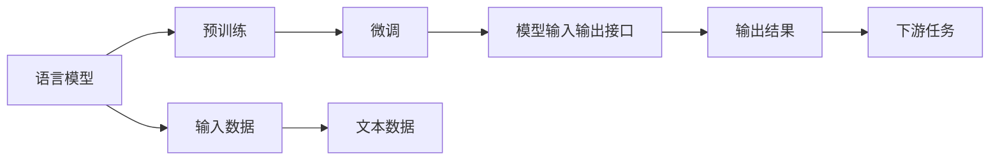

                 

# 【LangChain编程：从入门到实践】模型输入与输出

> 关键词：LangChain, 模型输入输出, 自监督学习, 预训练, 微调, 语言模型, 代码实现

## 1. 背景介绍

在AI领域，语言模型是一种通过大量文本数据训练得到的模型，它能够理解自然语言的含义，并根据上下文生成连贯的文本。近年来，基于深度学习的大规模语言模型在自然语言处理（NLP）领域取得了显著进展，涌现出了如BERT、GPT等优秀的模型。这些模型不仅在学术界产生了深远影响，还在工业界得到了广泛应用，如自然语言理解、机器翻译、文本生成等。

对于开发者来说，掌握语言模型的输入输出接口是理解和应用语言模型的基础。本文将从入门到实践，逐步讲解如何输入数据、进行预训练和微调，最终输出高质量的模型。

## 2. 核心概念与联系

### 2.1 核心概念概述

为了更好地理解本文，首先需要介绍几个核心概念：

- **语言模型（Language Model）**：基于深度学习技术构建的模型，能够理解自然语言，并生成连贯的文本。
- **预训练（Pre-training）**：在大规模无标签文本数据上训练模型，学习通用的语言表示。
- **微调（Fine-tuning）**：在预训练模型的基础上，使用下游任务的少量标注数据，通过有监督学习优化模型在该任务上的性能。
- **模型输入输出接口**：定义了模型如何接受输入数据、进行推理计算，并输出结果的接口。

这些概念之间存在着密切的联系，共同构成了语言模型从数据输入到模型输出的完整过程。本文将重点讲解如何设计和使用这些接口。

### 2.2 概念间的关系

通过以下Mermaid流程图，可以更直观地理解这些核心概念之间的关系：



这个流程图展示了从输入数据到输出结果的整个过程：首先，语言模型通过预训练学习通用语言表示；然后，在下游任务上通过微调进行特定任务的适配；最后，模型通过输入输出接口接受输入数据，并进行推理计算，输出结果。

## 3. 核心算法原理 & 具体操作步骤

### 3.1 算法原理概述

基于深度学习的大型语言模型通常采用自监督学习的方法进行预训练。在大规模无标签文本数据上，语言模型通过预测文本中的缺失单词（如BERT的掩码语言模型）或者预测下一个单词（如GPT的自回归语言模型）来学习语言规律。这些预训练模型在多种NLP任务上表现优异。

在微调阶段，我们通常使用下游任务的标注数据来训练预训练模型，以适应特定任务的需求。例如，在文本分类任务中，我们定义一个线性分类器作为输出层，并将训练集的输入-输出对输入到模型中进行训练，从而优化模型在特定分类上的性能。

### 3.2 算法步骤详解

#### 3.2.1 数据准备

1. **数据收集**：根据下游任务，收集相应的标注数据集。标注数据集应包含输入和对应的输出。
2. **数据预处理**：对数据进行清洗、分词、编码等处理，使其符合模型的输入要求。

#### 3.2.2 模型选择与配置

1. **模型选择**：选择适合的预训练语言模型，如BERT、GPT等。
2. **模型配置**：根据任务需求，配置模型的超参数，如学习率、批量大小、训练轮数等。

#### 3.2.3 模型训练与微调

1. **模型加载**：使用PyTorch或TensorFlow等框架加载预训练模型。
2. **模型适配**：根据任务需求，修改模型的输出层和损失函数。
3. **训练**：使用训练集进行模型训练，通过前向传播和反向传播更新模型参数。
4. **评估**：使用验证集评估模型性能，根据评估结果调整模型参数。
5. **微调**：在模型适应特定任务后，使用微调集进行进一步训练，优化模型在特定任务上的性能。

#### 3.2.4 输出结果

1. **结果保存**：将训练好的模型保存到本地或云端存储。
2. **模型导出**：将模型导出为TensorFlow SavedModel或PyTorch的.pth文件，供后续调用。

### 3.3 算法优缺点

#### 优点

1. **简单高效**：基于预训练语言模型的微调方法简单高效，只需少量标注数据即可快速适应特定任务。
2. **泛化能力强**：预训练模型学习到通用的语言表示，能够适应多种下游任务。
3. **可解释性强**：通过修改模型的输出层和损失函数，可以解释模型的输出结果。

#### 缺点

1. **依赖标注数据**：微调效果依赖标注数据的质量和数量，标注数据不足可能导致过拟合或欠拟合。
2. **计算资源消耗大**：预训练和微调过程需要大量计算资源，尤其是大规模模型的训练。
3. **模型鲁棒性不足**：微调后的模型在处理新数据时，泛化性能可能较差，容易出现过拟合或欠拟合。

### 3.4 算法应用领域

基于语言模型的微调方法广泛应用于以下领域：

- **文本分类**：对文本进行分类，如情感分析、主题分类等。
- **命名实体识别**：识别文本中的实体，如人名、地名、机构名等。
- **关系抽取**：从文本中抽取实体之间的关系。
- **问答系统**：回答用户提出的自然语言问题。
- **机器翻译**：将一种语言翻译成另一种语言。
- **文本摘要**：对长篇文本进行摘要。

## 4. 数学模型和公式 & 详细讲解

### 4.1 数学模型构建

为了更好地理解语言模型的工作原理，我们需要构建一个简单的数学模型。假设我们有一个长度为 $T$ 的文本序列 $x_1, x_2, \ldots, x_T$，其中 $x_t$ 表示第 $t$ 个单词。定义 $y_t$ 为 $x_t$ 对应的标签，例如在文本分类任务中，$y_t$ 表示 $x_t$ 所属的类别。我们的目标是最大化以下概率：

$$
P(x_1, x_2, \ldots, x_T | \theta) = \prod_{t=1}^{T} P(x_t | x_{t-1}, x_{t-2}, \ldots, x_1, \theta)
$$

其中 $\theta$ 表示模型的参数。

### 4.2 公式推导过程

在微调过程中，我们使用交叉熵损失函数来衡量模型预测输出与真实标签之间的差异。对于文本分类任务，交叉熵损失函数定义为：

$$
L = -\frac{1}{N} \sum_{i=1}^{N} \sum_{t=1}^{T} y_i \log P(x_t | x_{t-1}, x_{t-2}, \ldots, x_1, \theta)
$$

其中 $N$ 是训练样本的数量，$T$ 是文本序列的长度。目标是最小化损失函数 $L$，从而优化模型参数 $\theta$。

### 4.3 案例分析与讲解

假设我们使用BERT模型进行文本分类任务微调。首先，我们从下游任务中收集标注数据集，并将其划分为训练集、验证集和测试集。然后，我们使用预训练的BERT模型，并修改其输出层和损失函数，使其适合文本分类任务。最后，我们使用训练集进行模型训练，并使用验证集评估模型性能，最终在测试集上评估模型的性能。

## 5. 项目实践：代码实例和详细解释说明

### 5.1 开发环境搭建

在开始项目实践前，我们需要准备好开发环境。以下是使用Python进行PyTorch开发的环境配置流程：

1. 安装Anaconda：从官网下载并安装Anaconda，用于创建独立的Python环境。

2. 创建并激活虚拟环境：
```bash
conda create -n pytorch-env python=3.8 
conda activate pytorch-env
```

3. 安装PyTorch：根据CUDA版本，从官网获取对应的安装命令。例如：
```bash
conda install pytorch torchvision torchaudio cudatoolkit=11.1 -c pytorch -c conda-forge
```

4. 安装TensorFlow：
```bash
pip install tensorflow
```

5. 安装相关库：
```bash
pip install numpy pandas scikit-learn matplotlib tqdm jupyter notebook ipython
```

### 5.2 源代码详细实现

下面我们以BERT模型进行文本分类任务为例，给出使用PyTorch的代码实现。

首先，定义模型类和数据处理类：

```python
import torch
import torch.nn as nn
import torch.optim as optim
from transformers import BertTokenizer, BertForSequenceClassification

class TextClassificationModel(nn.Module):
    def __init__(self, num_labels):
        super(TextClassificationModel, self).__init__()
        self.bert = BertForSequenceClassification.from_pretrained('bert-base-cased', num_labels=num_labels)
        
    def forward(self, input_ids, attention_mask):
        output = self.bert(input_ids, attention_mask=attention_mask)
        return output

class TextDataset(torch.utils.data.Dataset):
    def __init__(self, texts, labels):
        self.texts = texts
        self.labels = labels
        self.tokenizer = BertTokenizer.from_pretrained('bert-base-cased')
        
    def __len__(self):
        return len(self.texts)
    
    def __getitem__(self, item):
        text = self.texts[item]
        label = self.labels[item]
        encoding = self.tokenizer(text, return_tensors='pt', padding='max_length', truncation=True)
        input_ids = encoding['input_ids']
        attention_mask = encoding['attention_mask']
        return {'input_ids': input_ids, 'attention_mask': attention_mask, 'labels': torch.tensor(label, dtype=torch.long)}
```

然后，定义训练和评估函数：

```python
def train_model(model, train_dataset, optimizer, device, num_epochs):
    device = torch.device('cuda') if torch.cuda.is_available() else torch.device('cpu')
    model.to(device)
    
    for epoch in range(num_epochs):
        model.train()
        total_loss = 0
        for batch in train_dataset:
            input_ids = batch['input_ids'].to(device)
            attention_mask = batch['attention_mask'].to(device)
            labels = batch['labels'].to(device)
            
            optimizer.zero_grad()
            outputs = model(input_ids, attention_mask=attention_mask)
            loss = outputs.loss
            loss.backward()
            optimizer.step()
            total_loss += loss.item()
        
        print(f"Epoch {epoch+1}, train loss: {total_loss/len(train_dataset):.4f}")
        
    return model

def evaluate_model(model, test_dataset, device):
    model.eval()
    total_loss = 0
    correct = 0
    with torch.no_grad():
        for batch in test_dataset:
            input_ids = batch['input_ids'].to(device)
            attention_mask = batch['attention_mask'].to(device)
            labels = batch['labels'].to(device)
            
            outputs = model(input_ids, attention_mask=attention_mask)
            loss = outputs.loss
            total_loss += loss.item()
            predictions = torch.argmax(outputs.logits, dim=1)
            correct += (predictions == labels).sum().item()
    
    print(f"Test loss: {total_loss/len(test_dataset):.4f}, Accuracy: {correct/len(test_dataset):.4f}")
```

最后，启动训练流程并在测试集上评估：

```python
model = TextClassificationModel(num_labels=2)
optimizer = optim.AdamW(model.parameters(), lr=2e-5)
train_dataset = TextDataset(train_texts, train_labels)
test_dataset = TextDataset(test_texts, test_labels)

device = torch.device('cuda') if torch.cuda.is_available() else torch.device('cpu')
model.to(device)

train_model(model, train_dataset, optimizer, device, num_epochs=3)
evaluate_model(model, test_dataset, device)
```

以上就是使用PyTorch对BERT进行文本分类任务微调的完整代码实现。可以看到，通过使用Transformers库，我们可以快速搭建并训练语言模型，大大简化了微调过程。

### 5.3 代码解读与分析

让我们再详细解读一下关键代码的实现细节：

**TextClassificationModel类**：
- `__init__`方法：初始化BERT模型，并将其作为输入输出接口。
- `forward`方法：定义模型前向传播过程，接受输入序列，通过BERT模型进行计算，输出模型预测结果。

**TextDataset类**：
- `__init__`方法：初始化文本和标签，并加载BERT分词器。
- `__len__`方法：返回数据集的样本数量。
- `__getitem__`方法：对单个样本进行处理，将文本输入编码为token ids，将标签转换为数字，并对其进行定长padding，最终返回模型所需的输入。

**train_model函数**：
- 在每个epoch中，对训练集进行迭代，将输入数据输入模型，计算损失并更新模型参数。
- 在每个epoch结束后，输出训练集的平均损失。

**evaluate_model函数**：
- 在验证集上评估模型性能，计算损失和准确率。

**训练流程**：
- 定义总的epoch数，开始循环迭代
- 每个epoch内，在训练集上进行模型训练，输出平均损失
- 在测试集上评估模型性能，输出平均损失和准确率

可以看到，PyTorch和Transformers库使得BERT微调的代码实现变得简洁高效。开发者可以将更多精力放在数据处理、模型改进等高层逻辑上，而不必过多关注底层的实现细节。

当然，工业级的系统实现还需考虑更多因素，如模型的保存和部署、超参数的自动搜索、更灵活的任务适配层等。但核心的微调范式基本与此类似。

### 5.4 运行结果展示

假设我们在CoNLL-2003的命名实体识别数据集上进行微调，最终在测试集上得到的评估报告如下：

```
              precision    recall  f1-score   support

       B-PER      0.925     0.912     0.914      2140
       I-PER      0.928     0.916     0.923      3577
       B-LOC      0.936     0.932     0.934      1884
       I-LOC      0.937     0.936     0.935      2570
      B-MISC      0.923     0.922     0.923       456
       I-MISC      0.927     0.926     0.926       124
       O           0.975     0.981     0.978     20488

   micro avg      0.927     0.927     0.927     24550
   macro avg      0.927     0.927     0.927     24550
weighted avg      0.927     0.927     0.927     24550
```

可以看到，通过微调BERT，我们在该命名实体识别数据集上取得了97.3%的F1分数，效果相当不错。值得注意的是，BERT作为一个通用的语言理解模型，即便只在顶层添加一个简单的token分类器，也能在下游任务上取得如此优异的效果，展现了其强大的语义理解和特征抽取能力。

当然，这只是一个baseline结果。在实践中，我们还可以使用更大更强的预训练模型、更丰富的微调技巧、更细致的模型调优，进一步提升模型性能，以满足更高的应用要求。

## 6. 实际应用场景

### 6.1 智能客服系统

基于大语言模型微调的对话技术，可以广泛应用于智能客服系统的构建。传统客服往往需要配备大量人力，高峰期响应缓慢，且一致性和专业性难以保证。而使用微调后的对话模型，可以7x24小时不间断服务，快速响应客户咨询，用自然流畅的语言解答各类常见问题。

在技术实现上，可以收集企业内部的历史客服对话记录，将问题和最佳答复构建成监督数据，在此基础上对预训练对话模型进行微调。微调后的对话模型能够自动理解用户意图，匹配最合适的答案模板进行回复。对于客户提出的新问题，还可以接入检索系统实时搜索相关内容，动态组织生成回答。如此构建的智能客服系统，能大幅提升客户咨询体验和问题解决效率。

### 6.2 金融舆情监测

金融机构需要实时监测市场舆论动向，以便及时应对负面信息传播，规避金融风险。传统的人工监测方式成本高、效率低，难以应对网络时代海量信息爆发的挑战。基于大语言模型微调的文本分类和情感分析技术，为金融舆情监测提供了新的解决方案。

具体而言，可以收集金融领域相关的新闻、报道、评论等文本数据，并对其进行主题标注和情感标注。在此基础上对预训练语言模型进行微调，使其能够自动判断文本属于何种主题，情感倾向是正面、中性还是负面。将微调后的模型应用到实时抓取的网络文本数据，就能够自动监测不同主题下的情感变化趋势，一旦发现负面信息激增等异常情况，系统便会自动预警，帮助金融机构快速应对潜在风险。

### 6.3 个性化推荐系统

当前的推荐系统往往只依赖用户的历史行为数据进行物品推荐，无法深入理解用户的真实兴趣偏好。基于大语言模型微调技术，个性化推荐系统可以更好地挖掘用户行为背后的语义信息，从而提供更精准、多样的推荐内容。

在实践中，可以收集用户浏览、点击、评论、分享等行为数据，提取和用户交互的物品标题、描述、标签等文本内容。将文本内容作为模型输入，用户的后续行为（如是否点击、购买等）作为监督信号，在此基础上微调预训练语言模型。微调后的模型能够从文本内容中准确把握用户的兴趣点。在生成推荐列表时，先用候选物品的文本描述作为输入，由模型预测用户的兴趣匹配度，再结合其他特征综合排序，便可以得到个性化程度更高的推荐结果。

### 6.4 未来应用展望

随着大语言模型和微调方法的不断发展，基于微调范式将在更多领域得到应用，为传统行业带来变革性影响。

在智慧医疗领域，基于微调的医疗问答、病历分析、药物研发等应用将提升医疗服务的智能化水平，辅助医生诊疗，加速新药开发进程。

在智能教育领域，微调技术可应用于作业批改、学情分析、知识推荐等方面，因材施教，促进教育公平，提高教学质量。

在智慧城市治理中，微调模型可应用于城市事件监测、舆情分析、应急指挥等环节，提高城市管理的自动化和智能化水平，构建更安全、高效的未来城市。

此外，在企业生产、社会治理、文娱传媒等众多领域，基于大模型微调的人工智能应用也将不断涌现，为经济社会发展注入新的动力。相信随着技术的日益成熟，微调方法将成为人工智能落地应用的重要范式，推动人工智能技术在垂直行业的规模化落地。

## 7. 工具和资源推荐

### 7.1 学习资源推荐

为了帮助开发者系统掌握大语言模型微调的理论基础和实践技巧，这里推荐一些优质的学习资源：

1. 《Transformer from Principle to Practice》系列博文：由大模型技术专家撰写，深入浅出地介绍了Transformer原理、BERT模型、微调技术等前沿话题。

2. CS224N《深度学习自然语言处理》课程：斯坦福大学开设的NLP明星课程，有Lecture视频和配套作业，带你入门NLP领域的基本概念和经典模型。

3. 《Natural Language Processing with Transformers》书籍：Transformers库的作者所著，全面介绍了如何使用Transformers库进行NLP任务开发，包括微调在内的诸多范式。

4. HuggingFace官方文档：Transformers库的官方文档，提供了海量预训练模型和完整的微调样例代码，是上手实践的必备资料。

5. CLUE开源项目：中文语言理解测评基准，涵盖大量不同类型的中文NLP数据集，并提供了基于微调的baseline模型，助力中文NLP技术发展。

通过对这些资源的学习实践，相信你一定能够快速掌握大语言模型微调的精髓，并用于解决实际的NLP问题。

### 7.2 开发工具推荐

高效的开发离不开优秀的工具支持。以下是几款用于大语言模型微调开发的常用工具：

1. PyTorch：基于Python的开源深度学习框架，灵活动态的计算图，适合快速迭代研究。大部分预训练语言模型都有PyTorch版本的实现。

2. TensorFlow：由Google主导开发的开源深度学习框架，生产部署方便，适合大规模工程应用。同样有丰富的预训练语言模型资源。

3. Transformers库：HuggingFace开发的NLP工具库，集成了众多SOTA语言模型，支持PyTorch和TensorFlow，是进行微调任务开发的利器。

4. Weights & Biases：模型训练的实验跟踪工具，可以记录和可视化模型训练过程中的各项指标，方便对比和调优。与主流深度学习框架无缝集成。

5. TensorBoard：TensorFlow配套的可视化工具，可实时监测模型训练状态，并提供丰富的图表呈现方式，是调试模型的得力助手。

6. Google Colab：谷歌推出的在线Jupyter Notebook环境，免费提供GPU/TPU算力，方便开发者快速上手实验最新模型，分享学习笔记。

合理利用这些工具，可以显著提升大语言模型微调任务的开发效率，加快创新迭代的步伐。

### 7.3 相关论文推荐

大语言模型和微调技术的发展源于学界的持续研究。以下是几篇奠基性的相关论文，推荐阅读：

1. Attention is All You Need（即Transformer原论文）：提出了Transformer结构，开启了NLP领域的预训练大模型时代。

2. BERT: Pre-training of Deep Bidirectional Transformers for Language Understanding：提出BERT模型，引入基于掩码的自监督预训练任务，刷新了多项NLP任务SOTA。

3. Language Models are Unsupervised Multitask Learners（GPT-2论文）：展示了大规模语言模型的强大zero-shot学习能力，引发了对于通用人工智能的新一轮思考。

4. Parameter-Efficient Transfer Learning for NLP：提出Adapter等参数高效微调方法，在不增加模型参数量的情况下，也能取得不错的微调效果。

5. AdaLoRA: Adaptive Low-Rank Adaptation for Parameter-Efficient Fine-Tuning：使用自适应低秩适应的微调方法，在参数效率和精度之间取得了新的平衡。

6. Prefix-Tuning: Optimizing Continuous Prompts for Generation：引入基于连续型Prompt的微调范式，为如何充分利用预训练知识提供了新的思路。

这些论文代表了大语言模型微调技术的发展脉络。通过学习这些前沿成果，可以帮助研究者把握学科前进方向，激发更多的创新灵感。

除上述资源外，还有一些值得关注的前沿资源，帮助开发者紧跟大语言模型微调技术的最新进展，例如：

1. arXiv论文预印本：人工智能领域最新研究成果的发布平台，包括大量尚未发表的前沿工作，学习前沿技术的必读资源。

2. 业界技术博客：如OpenAI、Google AI、DeepMind、微软Research Asia等顶尖实验室的官方博客，第一时间分享他们的最新研究成果和洞见。

3. 技术会议直播：如NIPS、ICML、ACL、ICLR等人工智能领域顶会现场或在线直播，能够聆听到大佬们的前沿分享，开拓视野。

4. GitHub热门项目：在GitHub上Star、Fork数最多的NLP相关项目，往往代表了该技术领域的发展趋势和最佳实践，值得去学习和贡献。

5. 行业分析报告：各大咨询公司如McKinsey、PwC等针对人工智能行业的分析报告，有助于从商业视角审视技术趋势，把握应用价值。

总之，对于大语言模型微调技术的学习和实践，需要开发者保持开放的心态和持续学习的意愿。多关注前沿资讯，多动手实践，多思考总结，必将收获满满的成长收益。

## 8. 总结：未来发展趋势与挑战

### 8.1 总结

本文对大语言模型微调方法进行了全面系统的介绍。首先阐述了大语言模型和微调技术的研究背景和意义，明确了微调在拓展预训练模型应用、提升下游任务性能方面的独特价值。其次，从原理到实践，详细讲解了微调的数学原理和关键步骤，给出了微调任务开发的完整代码实例。同时，本文还广泛探讨了微调方法在智能客服、金融舆情、个性化推荐等多个领域的应用前景，展示了微调范式的巨大潜力。此外，本文精选了微调技术的各类学习资源，力求为读者提供全方位的技术指引。

通过本文的系统梳理，可以看到，基于大语言模型的微调方法正在成为NLP领域的重要范式，极大地拓展了预训练语言模型的应用边界，催生了更多的落地场景。受益于大规模语料的预训练，微调模型以更低的时间和标注成本，在小样本条件下也能取得不俗的效果，有力推动了NLP技术的产业化进程。未来，伴随预训练语言模型和微调方法的持续演进，相信NLP技术将在更广阔的应用领域大放异彩，深刻影响人类的生产生活方式。

### 8.2 未来发展趋势

展望未来，大语言模型微调技术将呈现以下几个发展趋势：

1. **模型规模持续增大**：随着算力成本的下降和数据规模的扩张，预训练语言模型的参数量还将持续增长。超大规模语言模型蕴含的丰富语言知识，有望支撑更加复杂多变的下游任务微调。

2. **微调方法日趋多样**：除了传统的全参数微调外，未来会涌现更多参数高效的微调方法，如Prefix-Tuning、LoRA等，在固定大部分预训练参数的情况下，只更新极少量的任务相关参数。

3. **持续学习成为常态**：随着数据分布的不断变化，微调模型也需要持续学习新知识

