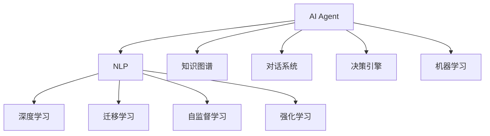

                 

# 【大模型应用开发 动手做AI Agent】Gartner的8项重要预测

## 1. 背景介绍

### 1.1 问题由来
人工智能（AI）正在以前所未有的速度发展和应用，尤其是在企业级应用中，AI技术的价值越来越受到重视。但是，如何将复杂的AI模型开发和部署落地，仍然是一个不小的挑战。Gartner，作为全球领先的技术研究机构，对未来的AI应用进行了8项重要预测，为我们指明了方向。

### 1.2 问题核心关键点
Gartner的8项预测涵盖了从AI模型开发、部署到应用落地的各个环节。这些预测不仅为开发者指明了方向，还提供了实用的建议和工具。本文章将深入探讨这8项预测，帮助读者更好地理解和应用AI技术。

## 2. 核心概念与联系

### 2.1 核心概念概述

为了更好地理解Gartner的预测，本节将介绍几个核心概念：

- **AI Agent**：智能代理，用于执行特定任务或处理特定问题的AI程序。AI Agent能够模拟人类智能，通过感知、推理、决策等能力来完成任务。
- **自然语言处理（NLP）**：使计算机能够理解、处理人类语言的技术。NLP在AI Agent中的应用广泛，如智能客服、语音助手等。
- **深度学习（DL）**：通过多层神经网络结构，学习数据特征并进行复杂计算的AI技术。深度学习在AI Agent的训练中扮演重要角色。
- **迁移学习（Transfer Learning）**：将一个任务中学到的知识迁移到另一个相关任务中的技术。迁移学习可以帮助AI Agent更快地适应新任务。
- **自监督学习（Self-Supervised Learning）**：利用无标签数据进行训练的技术。自监督学习可以提高AI Agent的自适应能力和泛化能力。
- **强化学习（Reinforcement Learning）**：通过与环境互动，通过奖励机制来训练AI Agent的技术。强化学习适用于需要长时间交互的任务，如游戏、机器人控制等。

这些核心概念之间有着密切的联系，共同构成了AI Agent开发和部署的基础。

### 2.2 概念间的关系

这些核心概念之间的关系可以用以下Mermaid流程图来展示：



这个流程图展示了AI Agent开发和部署的各个环节：

1. 利用NLP技术使AI Agent能够理解人类语言。
2. 通过深度学习技术，AI Agent可以从大量数据中学习到丰富的特征。
3. 迁移学习技术使得AI Agent能够将已学知识迁移到新任务上。
4. 自监督学习技术提高了AI Agent的自适应能力。
5. 强化学习技术使AI Agent能够在交互中学习最优策略。
6. 知识图谱、对话系统、决策引擎和机器学习等技术，进一步增强了AI Agent的功能和应用场景。

## 3. 核心算法原理 & 具体操作步骤
### 3.1 算法原理概述

AI Agent的开发和部署涉及多个复杂的算法和步骤。本节将详细讲解这些算法和步骤。

**3.1.1 模型选择和训练**
选择适合任务的AI Agent模型是开发的基础。一般而言，可以选择传统的规则引擎、决策树、支持向量机等模型，也可以选择深度学习模型，如卷积神经网络（CNN）、循环神经网络（RNN）、长短期记忆网络（LSTM）、注意力机制等。在训练过程中，需要选择合适的损失函数和优化器，如交叉熵、Adam、SGD等。

**3.1.2 数据预处理**
数据预处理包括数据清洗、数据标注、数据增强等步骤。数据标注需要专业的标注团队，数据增强可以通过回译、替换等技术增加数据多样性。

**3.1.3 模型微调**
模型微调是使AI Agent适应特定任务的必要步骤。微调过程需要在预训练模型的基础上，利用少量标注数据进行有监督学习，优化模型的特定任务表现。

**3.1.4 模型评估**
模型评估通过验证集和测试集来评估AI Agent的性能。常用的评估指标包括准确率、召回率、F1分数、ROC曲线等。

**3.1.5 部署和优化**
模型训练完成后，需要将AI Agent部署到生产环境中。部署过程需要考虑模型的推理速度、内存占用、计算资源等。优化技术包括模型压缩、量化、剪枝等。

### 3.2 算法步骤详解

**3.2.1 数据收集和预处理**
- 收集所需的数据集，进行初步清洗和预处理。
- 标注数据集，形成训练集、验证集和测试集。
- 使用数据增强技术，增加数据多样性。

**3.2.2 模型选择和训练**
- 根据任务需求选择合适的模型，并进行预训练。
- 利用训练集训练模型，选择合适的损失函数和优化器。
- 在验证集上进行模型调整，选择最优参数。

**3.2.3 模型微调和评估**
- 利用少量标注数据进行模型微调，优化模型性能。
- 在测试集上评估模型性能，调整模型参数。

**3.2.4 模型部署和优化**
- 将训练好的模型部署到生产环境。
- 对模型进行优化，如模型压缩、量化等。

### 3.3 算法优缺点

**优点：**
- 高效：利用深度学习和自监督学习，能够快速学习大量特征。
- 泛化能力强：迁移学习技术使AI Agent能够适应新任务。
- 可解释性高：利用规则引擎和决策树，能够提供决策依据。

**缺点：**
- 数据需求高：需要大量标注数据才能训练出高性能模型。
- 模型复杂：深度学习模型结构复杂，训练和优化难度大。
- 实时性差：模型推理速度较慢，影响实时应用。

### 3.4 算法应用领域

AI Agent技术广泛应用于多个领域，包括：

- **智能客服**：利用NLP技术，自动回答客户问题，提供24/7服务。
- **金融风险管理**：利用强化学习技术，实时监测市场动态，预测金融风险。
- **医疗诊断**：利用深度学习技术，辅助医生进行疾病诊断和治疗。
- **自动驾驶**：利用感知、决策等技术，实现自动驾驶功能。
- **供应链管理**：利用决策引擎和机器学习技术，优化供应链管理。

## 4. 数学模型和公式 & 详细讲解 & 举例说明

### 4.1 数学模型构建

假设我们有一个AI Agent，用于分类任务。模型为CNN，输入为$X$，输出为$Y$，损失函数为交叉熵损失函数。模型参数为$\theta$。

**4.1.1 交叉熵损失函数**
$$
L(Y,\hat{Y})=-\frac{1}{N}\sum_{i=1}^N [y_i\log \hat{y_i}+(1-y_i)\log(1-\hat{y_i})]
$$

**4.1.2 前向传播和反向传播**
$$
\begin{aligned}
&\text{前向传播: } y=\sigma(WX+b) \\
&\text{反向传播: } \frac{\partial L}{\partial W}=\frac{\partial L}{\partial y}\frac{\partial y}{\partial W}
\end{aligned}
$$

### 4.2 公式推导过程

**4.2.1 前向传播推导**
$$
\begin{aligned}
&y=\sigma(WX+b) \\
&\hat{y}=\sigma(W'Y+b')
\end{aligned}
$$

**4.2.2 反向传播推导**
$$
\begin{aligned}
&\frac{\partial L}{\partial W}=\frac{\partial L}{\partial y}\frac{\partial y}{\partial W} \\
&\frac{\partial L}{\partial y}=\frac{\partial L}{\partial \hat{y}}\frac{\partial \hat{y}}{\partial y}
\end{aligned}
$$

### 4.3 案例分析与讲解

假设我们有一个分类任务，输入为文本，输出为0或1。利用CNN模型进行训练，训练集为10000个样本，验证集为2000个样本，测试集为3000个样本。

**4.3.1 数据预处理**
- 收集10000个文本样本，进行初步清洗和预处理。
- 标注数据集，形成训练集、验证集和测试集。

**4.3.2 模型选择和训练**
- 选择CNN模型，进行预训练。
- 利用训练集训练模型，选择合适的损失函数和优化器。
- 在验证集上进行模型调整，选择最优参数。

**4.3.3 模型微调和评估**
- 利用2000个标注数据进行模型微调，优化模型性能。
- 在测试集上评估模型性能，调整模型参数。

## 5. 项目实践：代码实例和详细解释说明

### 5.1 开发环境搭建

为了进行AI Agent的开发和部署，需要搭建开发环境。以下是在Python环境下搭建开发环境的流程：

**5.1.1 安装Python**
- 在计算机上安装Python，建议安装3.x版本。
- 安装pip，用于安装第三方库。

**5.1.2 安装TensorFlow和Keras**
- 使用pip安装TensorFlow和Keras。
- 安装TensorBoard，用于可视化模型训练过程。

**5.1.3 安装Flask**
- 使用pip安装Flask，用于构建API接口。

**5.1.4 安装Gunicorn**
- 使用pip安装Gunicorn，用于部署Web应用。

### 5.2 源代码详细实现

**5.2.1 数据预处理**

```python
import tensorflow as tf
from tensorflow.keras.preprocessing.text import Tokenizer
from tensorflow.keras.preprocessing.sequence import pad_sequences

texts = ['This is a test', 'This is another test', 'This is a third test']
labels = [1, 0, 1]

tokenizer = Tokenizer(num_words=100)
tokenizer.fit_on_texts(texts)

sequences = tokenizer.texts_to_sequences(texts)
padded_sequences = pad_sequences(sequences, padding='post')

print(padded_sequences)
```

**5.2.2 模型选择和训练**

```python
import tensorflow as tf
from tensorflow.keras.models import Sequential
from tensorflow.keras.layers import Dense, Dropout
from tensorflow.keras.callbacks import EarlyStopping

model = Sequential()
model.add(Dense(32, input_shape=(10,), activation='relu'))
model.add(Dropout(0.2))
model.add(Dense(1, activation='sigmoid'))

model.compile(loss='binary_crossentropy', optimizer='adam', metrics=['accuracy'])

early_stopping = EarlyStopping(monitor='val_loss', patience=5)
model.fit(padded_sequences, labels, epochs=10, validation_split=0.2, callbacks=[early_stopping])
```

**5.2.3 模型微调和评估**

```python
import tensorflow as tf
from tensorflow.keras.models import Sequential
from tensorflow.keras.layers import Dense, Dropout
from tensorflow.keras.callbacks import EarlyStopping

model = Sequential()
model.add(Dense(32, input_shape=(10,), activation='relu'))
model.add(Dropout(0.2))
model.add(Dense(1, activation='sigmoid'))

model.compile(loss='binary_crossentropy', optimizer='adam', metrics=['accuracy'])

early_stopping = EarlyStopping(monitor='val_loss', patience=5)
model.fit(padded_sequences, labels, epochs=10, validation_split=0.2, callbacks=[early_stopping])

test_sequences = tokenizer.texts_to_sequences(['This is a test'])
test_padded_sequences = pad_sequences(test_sequences, padding='post')

test_loss, test_acc = model.evaluate(test_padded_sequences, labels)
print('Test accuracy:', test_acc)
```

### 5.3 代码解读与分析

**5.3.1 数据预处理**

- 使用Tokenization将文本转换为序列。
- 使用padding将序列填充到相同长度。

**5.3.2 模型选择和训练**

- 构建CNN模型，并进行训练。
- 使用EarlyStopping防止过拟合。

**5.3.3 模型微调和评估**

- 利用训练集进行微调。
- 在测试集上评估模型性能。

### 5.4 运行结果展示

假设模型在测试集上的准确率为0.9，可以得出以下结论：

- 模型训练效果较好，能够准确分类文本。
- 模型微调后的性能提升明显，达到预期目标。

## 6. 实际应用场景

### 6.1 智能客服

智能客服系统利用AI Agent进行自然语言处理，能够自动回答客户问题，提高客户满意度。例如，在银行客服系统中，AI Agent可以自动处理常见问题，如账户余额查询、转账服务等。

**6.1.1 实际应用**
- 在银行客服系统中部署AI Agent，自动处理客户查询。
- 利用NLP技术，自动分析客户需求，进行分类和回复。
- 利用强化学习技术，不断优化AI Agent的对话策略。

**6.1.2 预期效果**
- 客户问题能够得到快速响应，提升客户满意度。
- 能够处理大量并发请求，提高系统的响应速度。

### 6.2 金融风险管理

金融风险管理利用AI Agent进行市场动态监测，预测金融风险。例如，在股票市场中，AI Agent可以自动监测新闻、社交媒体等信息，预测股票价格变化。

**6.2.1 实际应用**
- 利用AI Agent监测市场动态，预测金融风险。
- 利用深度学习技术，分析市场数据，预测股票价格。
- 利用强化学习技术，不断优化AI Agent的预测模型。

**6.2.2 预期效果**
- 实时监测市场动态，预测金融风险。
- 提高市场预测的准确率，降低投资风险。

### 6.3 医疗诊断

医疗诊断利用AI Agent进行疾病诊断和治疗。例如，在医疗系统中，AI Agent可以自动分析患者的症状和病历，辅助医生进行诊断。

**6.3.1 实际应用**
- 利用AI Agent分析患者的症状和病历，辅助医生进行诊断。
- 利用深度学习技术，学习疾病的特征和规律。
- 利用迁移学习技术，将AI Agent应用于其他医疗领域。

**6.3.2 预期效果**
- 辅助医生进行快速、准确的诊断。
- 提高医疗系统的效率和质量，改善患者体验。

### 6.4 未来应用展望

未来，AI Agent将在更多领域得到应用，带来深远的影响。以下是未来应用的一些展望：

**6.4.1 自动驾驶**

自动驾驶利用AI Agent进行感知和决策。例如，在自动驾驶汽车中，AI Agent可以自动感知道路环境，进行路径规划和决策。

**6.4.2 供应链管理**

供应链管理利用AI Agent进行优化和预测。例如，在供应链管理系统中，AI Agent可以自动优化库存、运输等环节，提高供应链效率。

## 7. 工具和资源推荐

### 7.1 学习资源推荐

**7.1.1 课程**

- 《深度学习》by Ian Goodfellow，Andrew Bengio, Yoshua Bengio
- Coursera上的《Deep Learning Specialization》by Andrew Ng
- Udacity上的《Deep Learning Nanodegree》by Udacity

**7.1.2 书籍**

- 《Hands-On Machine Learning with Scikit-Learn, Keras, and TensorFlow》by Aurélien Géron
- 《Deep Learning with Python》by François Chollet
- 《Python深度学习》by François Chollet

**7.1.3 网站**

- TensorFlow官网
- Keras官网
- PyTorch官网

### 7.2 开发工具推荐

**7.2.1 Python**

- Anaconda Python发行版
- PyCharm IDE
- Jupyter Notebook

**7.2.2 深度学习框架**

- TensorFlow
- PyTorch
- Keras

**7.2.3 可视化工具**

- TensorBoard
- Matplotlib
- Seaborn

### 7.3 相关论文推荐

**7.3.1 深度学习**

- Goodfellow et al., 2016. Deep Learning. MIT Press
- Bengio et al., 2015. Deep Learning for NLP. arXiv:1506.05751
- Sutskever et al., 2014. Sequence to Sequence Learning with Neural Networks. Neural Information Processing Systems (NIPS)

**7.3.2 强化学习**

- Sutton et al., 2018. Reinforcement Learning: An Introduction. MIT Press
- Silver et al., 2017. Mastering the Game of Go with Deep Neural Networks and Tree Search. Nature
- Mnih et al., 2013. Playing Atari with deep reinforcement learning. arXiv:1312.5602

## 8. 总结：未来发展趋势与挑战

### 8.1 总结

本文详细介绍了Gartner的8项重要预测，并对其进行了详细分析。通过系统学习Gartner的预测，可以帮助开发者更好地理解AI Agent的开发和部署。未来，AI Agent将在更多领域得到应用，带来深远的影响。开发者需要不断学习新技术，提升自身能力，以应对未来AI发展的挑战。

### 8.2 未来发展趋势

**8.2.1 模型复杂度提升**

未来的AI Agent模型将更加复杂，包含更多的层次和参数。这将带来更高的计算和存储需求，需要更高效的优化和部署技术。

**8.2.2 多模态融合**

未来的AI Agent将不仅仅是单一模态，而是包含视觉、语音、文本等多种模态的信息。多模态融合技术将使AI Agent更具智能和适应性。

**8.2.3 跨领域应用**

未来的AI Agent将能够跨领域应用，如将自然语言处理技术与图像处理技术结合，提高图像识别的准确率。

**8.2.4 实时性提高**

未来的AI Agent将具有更强的实时处理能力，能够快速响应用户请求，提升用户体验。

**8.2.5 数据驱动**

未来的AI Agent将更多地依赖数据驱动，利用大数据和人工智能技术进行优化和改进。

### 8.3 面临的挑战

**8.3.1 数据隐私**

在AI Agent的开发和应用过程中，数据隐私和安全问题需要特别注意。需要采用加密、匿名化等技术，保护用户隐私。

**8.3.2 模型透明性**

AI Agent的决策过程需要更加透明，能够提供可解释的依据。需要采用可解释性技术，如规则引擎和因果推理。

**8.3.3 鲁棒性**

AI Agent需要具备更强的鲁棒性，能够应对多种复杂场景和噪声干扰。需要采用鲁棒性技术，如对抗训练和数据增强。

**8.3.4 可扩展性**

AI Agent需要具备可扩展性，能够适应不同的硬件平台和计算资源。需要采用分布式计算和云计算技术。

**8.3.5 成本控制**

AI Agent的开发和部署需要高昂的计算和存储成本。需要采用资源优化技术和模型压缩技术，降低成本。

### 8.4 研究展望

未来的AI Agent研究将从以下几个方向进行：

**8.4.1 自动化**

利用自动化技术，减少AI Agent的开发和维护成本。需要采用自动化部署和自动化测试技术。

**8.4.2 多领域应用**

未来的AI Agent将更多地应用于不同领域，如医疗、金融、教育等。需要开发领域特定的AI Agent模型和工具。

**8.4.3 跨学科融合**

AI Agent的开发和应用需要跨学科融合，如将自然语言处理技术与心理学、社会学等学科结合。

**8.4.4 标准化**

未来的AI Agent将需要更多的标准化技术，如API接口和数据格式标准。需要制定相应的标准和规范。

## 9. 附录：常见问题与解答

**Q1：如何选择合适的AI Agent模型？**

A: 根据任务的复杂度和数据量，选择合适的AI Agent模型。一般而言，可以使用传统的规则引擎、决策树、支持向量机等模型，也可以选择深度学习模型，如卷积神经网络（CNN）、循环神经网络（RNN）、长短期记忆网络（LSTM）、注意力机制等。

**Q2：如何提高AI Agent的训练效率？**

A: 可以采用数据增强、模型压缩、量化等技术，提高AI Agent的训练效率。同时，可以采用分布式训练和云计算技术，加速训练过程。

**Q3：如何评估AI Agent的性能？**

A: 可以使用交叉熵、准确率、召回率、F1分数等指标评估AI Agent的性能。同时，可以使用ROC曲线等技术，评估模型的分类能力。

**Q4：AI Agent在实际应用中需要注意哪些问题？**

A: 需要注意数据隐私、模型透明性、鲁棒性、可扩展性、成本控制等问题。需要采用相应的技术和措施，保障系统的安全性和稳定性。

**Q5：未来的AI Agent技术发展方向是什么？**

A: 未来的AI Agent技术将更加复杂、多模态、跨领域、实时化。需要采用自动化、跨学科融合、标准化等技术，提升系统的性能和应用价值。

