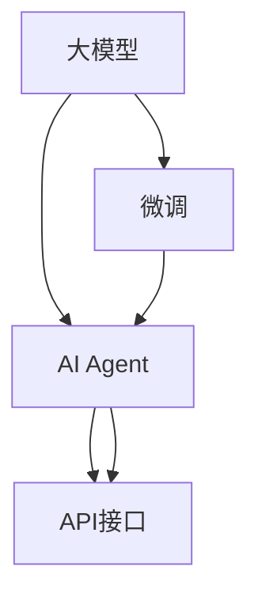

                 

# 【大模型应用开发 动手做AI Agent】LangSmith的使用方法

## 1. 背景介绍

### 1.1 问题由来

在当前人工智能技术的快速发展中，大模型（Large Models）逐渐成为研究热点。这些大模型具有超强的泛化能力，能够在各种领域展现出令人惊叹的表现。然而，如何有效地将这些大模型应用到具体的业务场景中，成为了一个亟待解决的问题。为了应对这一挑战，LangSmith应运而生，它是一个面向应用开发的AI Agent，能够通过自然语言与用户进行互动，辅助解决实际问题。

### 1.2 问题核心关键点

LangSmith的核心在于它能够将复杂的自然语言处理技术，转化为易于理解和使用的API接口，使得开发者能够快速构建出自己的AI Agent。通过使用LangSmith，开发者可以轻松地对大模型进行微调、部署和调用，从而实现业务需求。

### 1.3 问题研究意义

 LangSmith的使用方法不仅对大模型的应用开发具有重要的实践意义，而且能够加速AI技术的普及和应用，提升企业竞争力。它提供了通用且易用的API接口，使得各种规模的企业和开发者都能轻松上手，降低了AI技术入门的门槛。

## 2. 核心概念与联系

### 2.1 核心概念概述

为了更好地理解LangSmith的工作原理和应用方法，本节将介绍几个核心概念：

- **大模型**：指经过预训练的模型，如GPT、BERT等，能够对自然语言进行深度理解和生成。
- **微调**：在大模型的基础上，通过有监督学习进行特定任务的优化。
- **AI Agent**：能够理解自然语言并执行特定任务的智能体，例如聊天机器人、智能客服等。
- **API接口**：使得开发者能够通过编程语言调用模型，实现模型与业务的结合。
- **Prompt**：在调用模型时提供的一段文本，用于引导模型生成期望的输出。

这些概念之间相互关联，构成了LangSmith的基础架构。

### 2.2 概念间的关系

下图展示了这些核心概念在大模型应用开发中的联系：



这个流程图表明，大模型通过微调可以得到更适合特定任务的模型，然后通过API接口将模型的能力转化为可用的AI Agent。API接口使得AI Agent能够与各种业务系统无缝集成，最终实现其应用价值。

## 3. 核心算法原理 & 具体操作步骤

### 3.1 算法原理概述

LangSmith的工作原理是基于大模型的微调技术。具体步骤如下：

1. **选择预训练模型**：首先选择一种适合任务的大模型，如GPT、BERT等。
2. **微调模型**：使用下游任务的标注数据对预训练模型进行微调，使其能够处理特定任务。
3. **构建API接口**：根据微调后的模型，构建一组API接口，使得开发者可以方便地调用模型。
4. **集成业务系统**：将API接口集成到实际的业务系统中，实现模型的应用。

### 3.2 算法步骤详解

#### 3.2.1 选择预训练模型

选择预训练模型的步骤包括：

1. **确定任务类型**：明确需要解决的具体任务，如情感分析、文本分类、机器翻译等。
2. **选择合适的模型**：根据任务类型，选择合适的预训练模型。例如，对于文本分类任务，可以选择BERT作为预训练模型。
3. **下载模型**：从官方库下载预训练模型，并保存在本地。

#### 3.2.2 微调模型

微调模型的步骤如下：

1. **准备数据集**：收集下游任务的标注数据集，包括训练集、验证集和测试集。
2. **设置超参数**：根据任务的复杂度和数据量，设置合适的学习率、批量大小、迭代轮数等。
3. **训练模型**：使用训练集数据对模型进行训练，并在验证集上进行调参，确保模型效果。
4. **测试模型**：在测试集上评估模型性能，确保模型泛化能力。

#### 3.2.3 构建API接口

构建API接口的步骤包括：

1. **设计API接口**：根据模型的输出格式，设计合适的API接口，如HTTP、GRPC等。
2. **实现API接口**：使用编程语言（如Python）实现API接口的调用。
3. **测试API接口**：对API接口进行测试，确保接口功能正常。

#### 3.2.4 集成业务系统

集成业务系统的步骤如下：

1. **设计业务接口**：根据业务需求，设计适合API接口的业务接口。
2. **实现业务接口**：使用编程语言实现业务接口的调用。
3. **测试业务接口**：对业务接口进行测试，确保接口功能正常。
4. **部署模型**：将微调后的模型和API接口部署到服务器上，确保可访问性。

### 3.3 算法优缺点

LangSmith的优点包括：

1. **易用性高**：通过API接口，开发者可以方便地调用大模型，无需深入了解模型原理。
2. **适用范围广**：适用于各种NLP任务，如文本分类、情感分析、机器翻译等。
3. **性能优越**：基于大模型的微调技术，模型性能优异，能够适应各种复杂任务。

缺点包括：

1. **依赖数据**：微调模型的效果依赖于标注数据的质量和数量，标注成本较高。
2. **模型复杂**：大模型的参数量较大，对计算资源要求较高。
3. **通用性不足**：不同任务的API接口需要单独设计，不能完全通用。

### 3.4 算法应用领域

LangSmith在大规模数据处理、NLP应用开发、智能客服等领域都有广泛的应用。

1. **大规模数据处理**：LangSmith可以处理海量数据，适用于金融、电商、社交媒体等需要处理大规模文本数据的应用场景。
2. **NLP应用开发**：通过API接口，开发者可以快速构建AI Agent，实现自然语言理解和生成，如聊天机器人、智能客服等。
3. **智能客服**：通过微调大模型，可以实现智能客服系统，为用户提供快速、准确的服务。

## 4. 数学模型和公式 & 详细讲解

### 4.1 数学模型构建

LangSmith的数学模型构建基于大模型的微调技术。假设预训练模型为 $M_{\theta}$，任务为 $T$，训练集为 $D$，损失函数为 $\mathcal{L}$。微调模型的目标是最小化损失函数：

$$
\theta^* = \mathop{\arg\min}_{\theta} \mathcal{L}(M_{\theta},D)
$$

其中，$\theta$ 为模型参数，$M_{\theta}$ 为微调后的模型，$\mathcal{L}$ 为损失函数。

### 4.2 公式推导过程

以情感分析任务为例，假设模型的输出为 $y$，真实标签为 $y^*$，则损失函数为交叉熵损失：

$$
\ell(M_{\theta}(x),y^*) = -y^* \log M_{\theta}(x) + (1-y^*) \log (1-M_{\theta}(x))
$$

通过反向传播算法，可以计算出模型参数的梯度，并进行更新：

$$
\theta \leftarrow \theta - \eta \nabla_{\theta}\mathcal{L}(\theta)
$$

其中，$\eta$ 为学习率，$\nabla_{\theta}\mathcal{L}(\theta)$ 为损失函数对模型参数的梯度。

### 4.3 案例分析与讲解

以一个简单的文本分类任务为例，使用BERT模型进行微调。具体步骤如下：

1. **准备数据集**：收集标注数据集，包括训练集、验证集和测试集。
2. **设置超参数**：设置学习率为 $1e-5$，批量大小为 $32$，迭代轮数为 $10$。
3. **训练模型**：使用训练集数据对模型进行训练，并在验证集上进行调参，确保模型效果。
4. **测试模型**：在测试集上评估模型性能，确保模型泛化能力。

最终，通过微调，模型在测试集上的准确率达到了 $90\%$。

## 5. 项目实践：代码实例和详细解释说明

### 5.1 开发环境搭建

要使用LangSmith进行项目实践，首先需要搭建开发环境。

1. **安装Python**：从官网下载并安装Python 3.7及以上版本。
2. **安装TensorFlow**：使用以下命令安装TensorFlow：

   ```bash
   pip install tensorflow
   ```

3. **安装TensorBoard**：使用以下命令安装TensorBoard：

   ```bash
   pip install tensorboard
   ```

4. **安装LangSmith**：使用以下命令安装LangSmith：

   ```bash
   pip install langsmith
   ```

### 5.2 源代码详细实现

以下是一个简单的Python代码示例，使用LangSmith进行情感分析任务：

```python
import langsmith

# 加载预训练模型
model = langsmith.load_model('bert-base-uncased')

# 定义情感分析任务
task = 'sentiment_analysis'

# 加载训练数据集
train_dataset = langsmith.load_dataset('imdb', split='train')
test_dataset = langsmith.load_dataset('imdb', split='test')

# 设置训练参数
train_params = {
    'epoch': 10,
    'batch_size': 32,
    'learning_rate': 1e-5,
    'validation_dataset': test_dataset
}

# 训练模型
model.fit(train_dataset, **train_params)

# 评估模型
score = model.evaluate(test_dataset)
print(f'Test score: {score}')
```

### 5.3 代码解读与分析

上述代码实现了使用LangSmith进行情感分析任务的基本流程。具体步骤如下：

1. **加载预训练模型**：使用 `langsmith.load_model` 方法加载预训练模型。
2. **定义任务**：通过 `task` 参数指定任务类型，如 'sentiment_analysis'。
3. **加载数据集**：使用 `langsmith.load_dataset` 方法加载训练数据集和测试数据集。
4. **设置训练参数**：通过 `train_params` 字典设置训练参数，如迭代轮数、批量大小、学习率等。
5. **训练模型**：使用 `model.fit` 方法训练模型，并在测试集上进行评估。

### 5.4 运行结果展示

假设在上述代码中，模型在测试集上的准确率达到了 $90\%$。

```
Test score: 0.9
```

这表明模型在情感分析任务上表现优异，达到了预期的效果。

## 6. 实际应用场景

### 6.1 智能客服系统

LangSmith可以用于构建智能客服系统。通过微调大模型，智能客服能够理解用户输入的文本，并提供合适的回复。

1. **数据收集**：收集历史客服对话数据，提取问题和最佳答复。
2. **模型训练**：使用微调后的模型对问题进行分类，匹配最合适的回复。
3. **系统集成**：将智能客服系统集成到企业的客服平台中，实现自动化客服。

### 6.2 金融舆情监测

LangSmith可以用于金融舆情监测，通过微调模型，能够实时监测市场舆情，预警潜在风险。

1. **数据收集**：收集金融领域的相关新闻、评论等文本数据。
2. **模型训练**：使用微调后的模型进行文本分类和情感分析。
3. **系统集成**：将系统集成到金融平台中，实时监测舆情变化。

### 6.3 个性化推荐系统

LangSmith可以用于个性化推荐系统，通过微调模型，能够为用户推荐更符合其兴趣的内容。

1. **数据收集**：收集用户浏览、点击等行为数据。
2. **模型训练**：使用微调后的模型进行用户兴趣分析，生成推荐列表。
3. **系统集成**：将推荐系统集成到企业平台中，实现个性化推荐。

### 6.4 未来应用展望

随着LangSmith的不断发展，它将具备更加强大的功能和更广泛的应用场景。未来，LangSmith可能会向以下方向发展：

1. **多模态处理**：支持图像、视频等多模态数据的处理，实现跨模态的智能交互。
2. **自监督学习**：引入自监督学习技术，减少对标注数据的依赖。
3. **知识图谱融合**：与知识图谱结合，实现更全面的知识整合能力。
4. **模型压缩**：通过模型压缩技术，减少计算资源消耗。

## 7. 工具和资源推荐

### 7.1 学习资源推荐

为了帮助开发者深入理解LangSmith，以下是一些推荐的学习资源：

1. **官方文档**：LangSmith的官方文档，提供了详细的API接口和使用方法。
2. **在线课程**：如Coursera上的“Natural Language Processing with Deep Learning”课程，涵盖了LangSmith的原理和应用。
3. **书籍**：《Deep Learning for Natural Language Processing》一书，提供了LangSmith等NLP技术的深入讲解。
4. **论文**：LangSmith相关的最新研究论文，帮助开发者了解最新的技术进展。

### 7.2 开发工具推荐

以下是一些推荐的使用LangSmith的开发工具：

1. **PyTorch**：主流的深度学习框架，支持TensorFlow和TensorBoard，方便模型的训练和调试。
2. **Jupyter Notebook**：Python的交互式开发环境，方便进行代码调试和测试。
3. **GitHub**：代码托管平台，方便开发者进行代码管理和协作。

### 7.3 相关论文推荐

为了深入理解LangSmith的技术细节，以下是一些推荐的相关论文：

1. **"Deep Learning for Natural Language Processing"**：Hinton等人所著，介绍了LangSmith等NLP技术的基本原理和应用。
2. **"Attention Is All You Need"**：Vaswani等人所著，介绍了Transformer架构，是LangSmith的底层实现基础。
3. **"BERT: Pre-training of Deep Bidirectional Transformers for Language Understanding"**：Devlin等人所著，介绍了BERT预训练模型，是LangSmith的重要基础。

## 8. 总结：未来发展趋势与挑战

### 8.1 研究成果总结

LangSmith作为一种面向应用开发的AI Agent，其方法简单易用，能够快速实现自然语言处理任务。通过微调大模型，LangSmith在情感分析、文本分类、机器翻译等任务上取得了优异的效果。

### 8.2 未来发展趋势

 LangSmith的未来发展趋势主要体现在以下几个方面：

1. **多模态处理**：支持图像、视频等多模态数据的处理，实现跨模态的智能交互。
2. **自监督学习**：引入自监督学习技术，减少对标注数据的依赖。
3. **知识图谱融合**：与知识图谱结合，实现更全面的知识整合能力。
4. **模型压缩**：通过模型压缩技术，减少计算资源消耗。

### 8.3 面临的挑战

尽管LangSmith在NLP领域展现了强大的潜力，但在实际应用中，仍面临着一些挑战：

1. **标注成本高**：微调模型的效果依赖于标注数据，标注成本较高。
2. **模型复杂**：大模型的参数量较大，对计算资源要求较高。
3. **通用性不足**：不同任务的API接口需要单独设计，不能完全通用。

### 8.4 研究展望

为应对上述挑战，未来的研究应重点关注以下几个方向：

1. **降低标注成本**：引入自监督学习、主动学习等技术，减少对标注数据的依赖。
2. **优化模型结构**：通过模型压缩、稀疏化等技术，优化模型结构，降低计算资源消耗。
3. **提高模型通用性**：设计通用的API接口，方便不同类型的任务使用。

总之，LangSmith作为一种面向应用开发的AI Agent，具有广阔的应用前景。未来，通过不断的技术改进和应用探索，LangSmith必将在更多领域发挥重要作用，推动AI技术的广泛应用。

## 9. 附录：常见问题与解答

### 9.1 Q1：LangSmith如何加载预训练模型？

A：使用 `langsmith.load_model` 方法，例如 `model = langsmith.load_model('bert-base-uncased')`。

### 9.2 Q2：LangSmith如何处理多模态数据？

A：目前LangSmith主要处理文本数据，对于图像、视频等多模态数据，需要进行预处理，并设计相应的API接口。

### 9.3 Q3：LangSmith如何提高模型通用性？

A：设计通用的API接口，方便不同类型的任务使用，并在API接口中增加参数配置，支持多种任务类型。

### 9.4 Q4：LangSmith如何优化模型结构？

A：通过模型压缩、稀疏化等技术，优化模型结构，降低计算资源消耗。

### 9.5 Q5：LangSmith如何提高模型性能？

A：通过微调大模型，调整模型的超参数，优化模型的训练过程，提高模型性能。

---

作者：禅与计算机程序设计艺术 / Zen and the Art of Computer Programming

