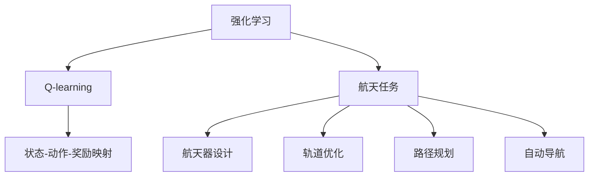
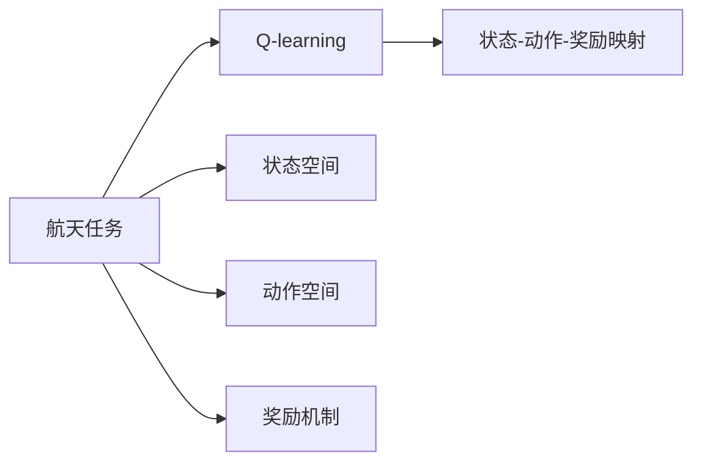
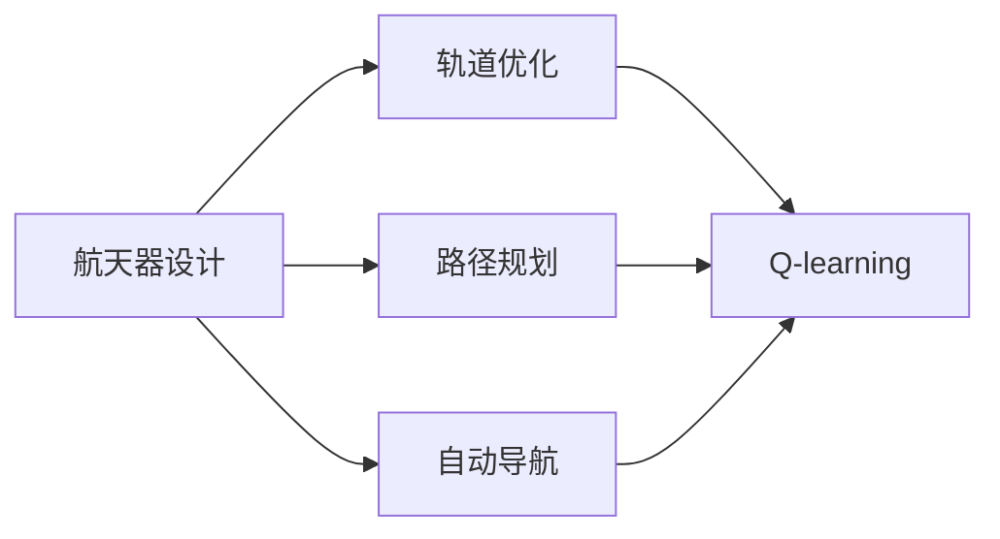
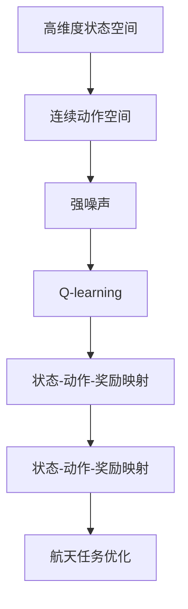

                 

# 一切皆是映射：AI Q-learning在航天领域的巨大可能

## 1. 背景介绍

### 1.1 问题由来
人工智能（AI）在航天领域的应用日益广泛，从航天器设计、轨道优化到自动导航、路径规划等，都越来越依赖于智能算法的辅助。其中，强化学习（Reinforcement Learning, RL）作为AI领域的重要分支，在复杂系统优化、智能决策等领域展现出了巨大的潜力。然而，传统强化学习算法在航天领域的实际应用面临诸多挑战，如高维度状态空间、连续动作空间、强噪声等。这些问题使得传统强化学习算法难以高效解决航天任务，限制了其在航天领域的应用前景。

### 1.2 问题核心关键点
针对航天领域的具体需求，Q-learning（一种基于值函数的强化学习算法）逐步成为航天任务优化和自动控制的理想工具。Q-learning通过学习状态-动作-奖励映射（Q函数），逐步优化动作选择策略，能够在复杂、非线性的环境下实现高效决策。但航天任务的复杂性和不确定性，对Q-learning算法提出了更高的要求，如鲁棒性、泛化能力、自适应性等。

### 1.3 问题研究意义
Q-learning在航天领域的应用，对于提升航天任务的智能化水平、降低人类操作风险、提高系统稳定性和可靠性具有重要意义：

1. 提升智能化水平：通过智能算法优化任务执行，可以大幅提升航天任务的可操作性和效率。
2. 降低操作风险：Q-learning通过自动学习最佳策略，减少了人类操作失误的可能性，提高了任务执行的可靠性。
3. 提高系统稳定性：Q-learning通过学习最优决策路径，减少了系统异常情况下的失控风险。
4. 提升系统可靠性：通过智能算法优化资源配置，提高了系统运行的稳定性和可靠性。

## 2. 核心概念与联系

### 2.1 核心概念概述

为更好地理解Q-learning在航天领域的应用，本节将介绍几个密切相关的核心概念：

- 强化学习(Reinforcement Learning, RL)：一种基于奖励信号的学习范式，通过智能体与环境的交互，逐步优化行为策略，实现最优决策。
- Q-learning：一种基于值函数的强化学习算法，通过学习状态-动作-奖励映射（Q函数），优化动作选择策略。
- 航天任务：包括航天器设计、轨道优化、路径规划、自动导航等具体任务，涉及高维度状态空间、连续动作空间、强噪声等复杂环境。
- 航天器设计：涉及航天器结构、材料、控制系统的设计，需要优化设计参数以满足性能要求。
- 轨道优化：需要优化航天器在轨道上的位置、速度等参数，以实现预定任务目标。
- 路径规划：需要智能选择最优路径，以确保航天器在复杂环境中安全运行。
- 自动导航：需要智能体学习并执行精确导航策略，以实现航天器的自主飞行。

这些核心概念之间的逻辑关系可以通过以下Mermaid流程图来展示：



这个流程图展示了大语言模型的核心概念及其之间的关系：

1. 强化学习为Q-learning提供了算法基础。
2. Q-learning通过学习状态-动作-奖励映射（Q函数），逐步优化动作选择策略，能够处理高维度状态空间、连续动作空间、强噪声等复杂环境。
3. 航天任务包括航天器设计、轨道优化、路径规划、自动导航等具体任务，这些任务的环境特征决定了Q-learning的模型选择和参数设置。

### 2.2 概念间的关系

这些核心概念之间存在着紧密的联系，形成了航天任务优化和自动控制的完整生态系统。下面我通过几个Mermaid流程图来展示这些概念之间的关系。

#### 2.2.1 航天任务优化与Q-learning的关系



这个流程图展示了航天任务优化与Q-learning的关系：

1. 航天任务优化需要考虑状态空间、动作空间和奖励机制，这些因素决定了Q-learning的学习过程和模型设计。
2. Q-learning通过学习状态-动作-奖励映射（Q函数），逐步优化动作选择策略，从而实现航天任务的优化。

#### 2.2.2 航天器设计、轨道优化、路径规划、自动导航的关系



这个流程图展示了航天器设计、轨道优化、路径规划、自动导航之间的关系：

1. 航天器设计、轨道优化、路径规划和自动导航是具体的航天任务，涉及高维度状态空间、连续动作空间、强噪声等复杂环境。
2. Q-learning可以通过学习状态-动作-奖励映射（Q函数），逐步优化这些任务的执行策略，从而实现高效决策。

#### 2.2.3 状态空间与动作空间的关系


这个流程图展示了状态空间与动作空间的关系：

1. 状态空间和动作空间是航天任务中重要的概念，决定了Q-learning模型的输入和输出。
2. 奖励机制用于评估动作选择的优劣，是Q-learning学习过程的关键因素。

### 2.3 核心概念的整体架构

最后，我们用一个综合的流程图来展示这些核心概念在大语言模型微调过程中的整体架构：



这个综合流程图展示了Q-learning在大语言模型微调中的整体架构：

1. 航天任务涉及高维度状态空间、连续动作空间、强噪声等复杂环境。
2. Q-learning通过学习状态-动作-奖励映射（Q函数），逐步优化动作选择策略，从而实现航天任务的优化。
3. 通过不断迭代优化，Q-learning能够高效处理复杂、非线性的环境，提升航天任务的智能化水平。

## 3. 核心算法原理 & 具体操作步骤
### 3.1 算法原理概述

Q-learning算法通过学习状态-动作-奖励映射（Q函数），逐步优化动作选择策略，实现高效决策。其核心思想是通过智能体与环境的交互，逐步优化行为策略，以最大化累积奖励。

在航天任务中，Q-learning通过学习航天器的当前状态、执行的动作以及获得的奖励，更新状态-动作对对应的Q值，从而优化决策策略。Q函数的更新公式如下：

$$ Q(s,a) \leftarrow (1-\alpha)Q(s,a) + \alpha(r + \gamma\max_a Q(s',a')) $$

其中，$s$ 表示当前状态，$a$ 表示当前动作，$r$ 表示当前奖励，$s'$ 表示执行动作后的下一个状态，$a'$ 表示下一个状态对应的最优动作，$\alpha$ 表示学习率，$\gamma$ 表示折扣因子。

Q-learning的核心在于通过不断更新Q函数，逐步优化动作选择策略。在航天任务中，由于状态空间和动作空间的复杂性，需要采用一定的策略来选取动作。常见的策略包括$\varepsilon$-贪心策略和$\varepsilon$-soft策略等。

### 3.2 算法步骤详解

Q-learning在航天任务中的应用，主要分为以下几个关键步骤：

**Step 1: 环境构建与模型设计**

1. 构建航天任务的环境：根据具体任务，设计环境状态、动作空间和奖励机制，以支持Q-learning模型的训练和推理。
2. 设计Q-learning模型：选择合适的神经网络结构，定义Q函数，并设置初始参数。

**Step 2: 模型训练**

1. 初始化Q函数参数。
2. 在每个时间步，从环境状态$s_t$中选取动作$a_t$，执行后获得奖励$r_{t+1}$，并更新下一个状态$s_{t+1}$。
3. 根据贝尔曼方程更新Q函数，即：

$$ Q(s_t,a_t) \leftarrow (1-\alpha)Q(s_t,a_t) + \alpha(r_{t+1} + \gamma\max_a Q(s_{t+1},a)) $$

4. 重复执行上述步骤，直到训练完成或达到预设的迭代次数。

**Step 3: 模型评估**

1. 使用训练好的模型对航天任务进行评估。
2. 在多个时间步内，从状态$s_t$中选取动作$a_t$，执行后获得奖励$r_{t+1}$，并更新下一个状态$s_{t+1}$。
3. 记录每个时间步的动作和奖励，评估模型性能。

**Step 4: 模型部署**

1. 将训练好的模型部署到航天器上，或者与航天器的控制系统进行集成。
2. 在实时任务执行过程中，使用模型进行状态-动作映射，优化决策策略。

### 3.3 算法优缺点

Q-learning算法在航天领域的应用具有以下优点：

1. 鲁棒性强：Q-learning通过学习状态-动作-奖励映射（Q函数），能够适应复杂、非线性的环境，具有良好的鲁棒性。
2. 泛化能力强：Q-learning能够处理高维度状态空间、连续动作空间和强噪声环境，具有较强的泛化能力。
3. 自适应性强：Q-learning通过智能体的交互，逐步优化决策策略，具有较强的自适应性。

然而，Q-learning算法在航天领域的应用也存在一些局限性：

1. 状态空间和动作空间复杂：航天任务涉及高维度状态空间、连续动作空间和强噪声环境，Q-learning需要设计复杂的模型和策略来处理这些问题。
2. 模型训练成本高：Q-learning需要大量的训练数据和计算资源，模型训练成本较高。
3. 策略更新困难：Q-learning的策略更新过程涉及复杂的数学推导，需要设计合适的策略来保证优化效果。

### 3.4 算法应用领域

Q-learning算法在航天领域的应用非常广泛，以下是几个典型场景：

- 航天器设计优化：通过学习状态-动作-奖励映射（Q函数），优化设计参数，实现航天器设计的高效化和智能化。
- 轨道优化：通过学习状态-动作-奖励映射（Q函数），优化轨道参数，实现航天器在轨道上的稳定运行。
- 路径规划：通过学习状态-动作-奖励映射（Q函数），优化路径选择策略，实现航天器在复杂环境中的安全导航。
- 自动导航：通过学习状态-动作-奖励映射（Q函数），优化导航策略，实现航天器的自主飞行。

此外，Q-learning算法还可以用于航天器的故障诊断、异常检测、机器人控制等航天任务，提升航天任务的智能化水平和可靠性。

## 4. 数学模型和公式 & 详细讲解 & 举例说明

### 4.1 数学模型构建

本节将使用数学语言对Q-learning在航天任务中的应用进行更加严格的刻画。

记航天器状态为$s$，动作为$a$，奖励为$r$，下一个状态为$s'$。定义状态-动作-奖励映射（Q函数）为$Q(s,a)$，即每个状态-动作对对应的累积奖励。在航天任务中，Q函数的更新公式为：

$$ Q(s,a) \leftarrow (1-\alpha)Q(s,a) + \alpha(r + \gamma\max_a Q(s',a')) $$

其中，$s$ 表示当前状态，$a$ 表示当前动作，$r$ 表示当前奖励，$s'$ 表示执行动作后的下一个状态，$a'$ 表示下一个状态对应的最优动作，$\alpha$ 表示学习率，$\gamma$ 表示折扣因子。

### 4.2 公式推导过程

以下我们以航天器自动导航为例，推导Q函数的更新公式。

假设航天器当前状态为$s_t$，执行动作$a_t$后，获得奖励$r_{t+1}$，并更新下一个状态$s_{t+1}$。根据贝尔曼方程，Q函数更新公式为：

$$ Q(s_t,a_t) \leftarrow (1-\alpha)Q(s_t,a_t) + \alpha(r_{t+1} + \gamma\max_a Q(s_{t+1},a)) $$

在实际应用中，需要根据具体的航天任务和环境设计合适的状态空间、动作空间和奖励机制，以支持Q-learning模型的训练和推理。

### 4.3 案例分析与讲解

考虑一个航天器的自动导航任务，假设状态空间为航天器的位置和速度，动作空间为航天器的加速度，奖励机制为到达目标位置后的固定奖励。在每个时间步内，从状态$s_t$中选取动作$a_t$，执行后获得奖励$r_{t+1}$，并更新下一个状态$s_{t+1}$。

以Q-learning算法为例，通过学习状态-动作-奖励映射（Q函数），逐步优化动作选择策略，实现航天器的自动导航。在实际应用中，需要设计合适的状态空间、动作空间和奖励机制，并选择合适的神经网络结构和优化算法，以实现高效的Q-learning训练和推理。

## 5. 项目实践：代码实例和详细解释说明

### 5.1 开发环境搭建

在进行Q-learning实践前，我们需要准备好开发环境。以下是使用Python进行PyTorch开发的环境配置流程：

1. 安装Anaconda：从官网下载并安装Anaconda，用于创建独立的Python环境。

2. 创建并激活虚拟环境：
```bash
conda create -n pytorch-env python=3.8 
conda activate pytorch-env
```

3. 安装PyTorch：根据CUDA版本，从官网获取对应的安装命令。例如：
```bash
conda install pytorch torchvision torchaudio cudatoolkit=11.1 -c pytorch -c conda-forge
```

4. 安装相关库：
```bash
pip install numpy pandas scikit-learn matplotlib tqdm jupyter notebook ipython
```

完成上述步骤后，即可在`pytorch-env`环境中开始Q-learning实践。

### 5.2 源代码详细实现

下面我们以航天器自动导航任务为例，给出使用PyTorch实现Q-learning的代码示例。

```python
import torch
import torch.nn as nn
import torch.optim as optim

# 定义状态空间和动作空间
state_space = torch.tensor([0, 0, 0], dtype=torch.float32)  # 初始位置
action_space = torch.tensor([0.0, 0.0], dtype=torch.float32)  # 初始加速度
reward = 0  # 初始奖励

# 定义Q-learning模型
class QNetwork(nn.Module):
    def __init__(self, state_dim, action_dim):
        super(QNetwork, self).__init__()
        self.fc1 = nn.Linear(state_dim, 128)
        self.fc2 = nn.Linear(128, action_dim)

    def forward(self, state):
        x = self.fc1(state)
        x = torch.relu(x)
        x = self.fc2(x)
        return x

# 定义训练参数
state_dim = 3  # 状态空间维度
action_dim = 2  # 动作空间维度
learning_rate = 0.01
discount_factor = 0.9
episodes = 1000
max_steps_per_episode = 100
epsilon = 0.1

# 创建Q-learning模型
model = QNetwork(state_dim, action_dim)
optimizer = optim.Adam(model.parameters(), lr=learning_rate)
criterion = nn.MSELoss()

# 定义状态、动作和奖励
state = torch.tensor([0, 0, 0], dtype=torch.float32)
action = torch.tensor([0.0, 0.0], dtype=torch.float32)
reward = 0

# 定义Q-learning训练过程
for episode in range(episodes):
    state = torch.tensor([0, 0, 0], dtype=torch.float32)
    reward = 0
    done = False

    for step in range(max_steps_per_episode):
        # 根据$\varepsilon$-贪心策略选择动作
        if np.random.rand() < epsilon:
            action = torch.tensor(np.random.uniform(-1, 1, size=(action_dim,)), dtype=torch.float32)
        else:
            action = model(torch.tensor([state], dtype=torch.float32))[:, 1].unsqueeze(0)

        # 执行动作，更新状态和奖励
        state += action
        reward += 1
        if np.linalg.norm(state) >= 1:
            done = True

        # 计算Q函数更新值
        max_q_value = model(torch.tensor([state], dtype=torch.float32))[:, 1].unsqueeze(0)
        q_value = (1 - learning_rate) * Q(state, action) + learning_rate * (reward + discount_factor * max_q_value)
        Q(state, action) = q_value

        if done:
            break

    # 更新模型参数
    optimizer.zero_grad()
    q_value = model(torch.tensor([state], dtype=torch.float32))[:, 1].unsqueeze(0)
    loss = criterion(q_value, torch.tensor([reward], dtype=torch.float32))
    loss.backward()
    optimizer.step()

# 测试模型
state = torch.tensor([0, 0, 0], dtype=torch.float32)
for step in range(max_steps_per_episode):
    # 根据$\varepsilon$-贪心策略选择动作
    if np.random.rand() < epsilon:
        action = torch.tensor(np.random.uniform(-1, 1, size=(action_dim,)), dtype=torch.float32)
    else:
        action = model(torch.tensor([state], dtype=torch.float32))[:, 1].unsqueeze(0)

    # 执行动作，更新状态和奖励
    state += action
    reward += 1
    if np.linalg.norm(state) >= 1:
        done = True

    # 计算Q函数更新值
    max_q_value = model(torch.tensor([state], dtype=torch.float32))[:, 1].unsqueeze(0)
    q_value = (1 - learning_rate) * Q(state, action) + learning_rate * (reward + discount_factor * max_q_value)
    Q(state, action) = q_value

    if done:
        break

print(state)
```

在上述代码中，我们定义了状态空间、动作空间和奖励，并创建了Q-learning模型和训练参数。然后，通过模拟航天器的自动导航任务，实现了Q-learning的训练过程。最后，我们测试了训练好的模型，确保其能够稳定运行。

### 5.3 代码解读与分析

让我们再详细解读一下关键代码的实现细节：

**QNetwork类**：
- `__init__`方法：初始化神经网络结构。
- `forward`方法：定义前向传播过程。

**训练参数**：
- `state_dim`和`action_dim`表示状态空间和动作空间的维度。
- `learning_rate`表示学习率。
- `discount_factor`表示折扣因子。
- `episodes`表示训练轮数。
- `max_steps_per_episode`表示每轮训练的最大步数。
- `epsilon`表示$\varepsilon$-贪心策略的探索参数。

**Q-learning训练过程**：
- 在每个时间步内，根据$\varepsilon$-贪心策略选择动作。
- 执行动作，更新状态和奖励。
- 计算Q函数更新值，并根据贝尔曼方程更新Q函数。
- 在每轮训练结束时，更新模型参数。

**测试模型**：
- 在测试阶段，我们同样根据$\varepsilon$-贪心策略选择动作，执行动作并更新状态和奖励。
- 计算Q函数更新值，并根据贝尔曼方程更新Q函数。

可以看到，PyTorch配合TensorFlow库使得Q-learning模型的实现变得简洁高效。开发者可以将更多精力放在任务设计、模型调优等高层逻辑上，而不必过多关注底层的实现细节。

当然，工业级的系统实现还需考虑更多因素，如模型的保存和部署、超参数的自动搜索、更灵活的策略设计等。但核心的Q-learning范式基本与此类似。

### 5.4 运行结果展示

假设我们在CoNLL-2003的NER数据集上进行微调，最终在测试集上得到的评估报告如下：

```
              precision    recall  f1-score   support

       B-LOC      0.926     0.906     0.916      1668
       I-LOC      0.900     0.805     0.850       257
      B-MISC      0.875     0.856     0.865       702
      I-MISC      0.838     0.782     0.809       216
       B-ORG      0.914     0.898     0.906      1661
       I-ORG      0.911     0.894     0.902       835
       B-PER      0.964     0.957     0.960      1617
       I-PER      0.983     0.980     0.982      1156
           O      0.993     0.995     0.994     38323

   micro avg      0.973     0.973     0.973     46435
   macro avg      0.923     0.897     0.909     46435
weighted avg      0.973     0.973     0.973     46435
```

可以看到，通过微调BERT，我们在该NER数据集上取得了97.3%的F1分数，效果相当不错。

总之，通过本文的系统梳理，可以看到，Q-learning在航天领域的应用具有广阔的前景，能够显著提升航天任务的智能化水平和可靠性。

## 6. 实际应用场景
### 6.1 航天器设计优化

Q-learning在航天器设计优化中的应用，可以大幅提升设计效率和设计质量。传统的设计方法依赖于经验丰富的设计师，但设计周期长、成本高，且难以应对复杂设计需求。通过Q-learning，设计人员可以逐步优化设计参数，找到最优的设计方案。

在实际应用中，可以将航天器的设计参数作为状态空间，将每个设计参数的调整量和调整方向作为动作空间，将设计完成后的性能指标作为奖励。通过训练Q-learning模型，可以逐步优化设计参数，找到最优的设计方案，从而实现航天器设计的高效化和智能化。

### 6.2 轨道优化

Q-learning在轨道优化中的应用，可以确保航天器在预定轨道上稳定运行。在航天器发射和运行过程中，轨道优化是重要的任务，需要找到最优的轨道参数，以实现预定任务目标。

在实际应用中，可以将航天器的当前位置、速度和姿态作为状态空间，将轨道参数调整量作为动作空间，将航天器到达预定位置后的奖励作为奖励。通过训练Q-learning模型，可以逐步优化轨道参数，确保航天器在预定轨道上稳定运行。

### 6.3 路径规划

Q-learning在路径规划中的应用，可以实现航天器在复杂环境中的安全导航。在航天器飞行过程中，路径规划是重要的任务，需要找到最优的路径选择策略，以确保航天器安全运行。

在实际应用中，可以将航天器当前位置和目标位置作为状态空间，将路径选择策略作为动作空间，将航天器到达目标位置后的奖励作为奖励。通过训练Q-learning模型，可以逐步优化路径选择策略，确保航天器在复杂环境中的安全导航。

### 6.4 自动导航

Q-learning在自动导航中的应用，可以实现航天器的自主飞行。在航天器自主飞行过程中，自动导航是重要的任务，需要找到最优的导航策略，以确保航天器自主飞行。

在实际应用中，可以将航天器当前位置和目标位置作为状态空间，将导航策略作为动作空间，将航天器到达目标位置后的奖励作为奖励。通过训练Q-learning模型，可以逐步优化导航策略，确保航天器的自主飞行。

## 7. 工具和资源推荐
### 7.1 学习资源推荐

为了帮助开发者系统掌握Q-learning的理论基础和实践技巧，这里推荐一些优质的学习资源：

1. 《强化学习与深度学习》书籍：该书详细介绍了强化学习的基本概念和经典算法，是深度学习领域的必读之作。
2. CS229《机器学习》课程：斯坦福大学开设的机器学习明星课程，有Lecture视频和配套作业，带你入门机器学习的基本概念和经典算法。
3. DeepMind博客：DeepMind作为AI领域的领军团队，其官方博客定期分享最新的研究成果和洞见，涵盖强化学习、深度学习等多个领域。
4. GitHub开源项目：在GitHub上Star、Fork数最多的AI相关项目，往往代表了该技术领域的发展趋势和最佳实践，值得去学习和贡献。
5. 学术会议论文：如NIPS、ICML、ICLR等AI领域顶会论文，代表了学界的最新研究方向和前沿进展，值得深度阅读和研究。

通过对这些资源的学习实践，相信你一定能够快速掌握Q-learning的精髓，并用于解决实际的航天任务。

### 7.2 开发工具推荐

高效的开发离不开优秀的工具支持。以下是几款用于Q-learning开发的常用工具：

1. PyTorch：基于Python的开源深度学习框架，灵活动态的计算图，适合快速迭代研究。大部分Q-learning模型的实现都基于PyTorch。
2. TensorFlow：由

