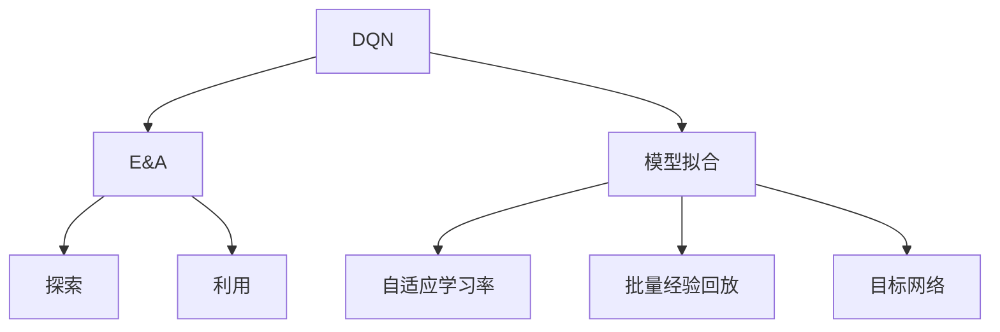

                 

# 一切皆是映射：DQN训练策略：平衡探索与利用

> 关键词：深度Q网络 (DQN), 探索与利用 (E&A), 模型拟合, 自适应学习率, 批量经验回放, 目标网络

## 1. 背景介绍

### 1.1 问题由来

近年来，深度强化学习 (Deep Reinforcement Learning, DRL) 在人工智能领域得到了快速发展和广泛应用，尤其在控制决策、游戏智能、自动驾驶等方向表现出色。其中，深度Q网络 (DQN) 算法作为一种基于价值函数优化的深度学习框架，因其简单、高效的特点，成为了研究的热点。DQN算法通过构建Q函数，利用最大Q值来指导策略选择，从而在环境中进行有效的决策学习。然而，DQN算法在训练过程中面临诸多挑战，如探索与利用的平衡、模型拟合问题等，这些问题严重影响了其性能和可扩展性。

### 1.2 问题核心关键点

DQN算法的核心在于如何在探索与利用之间取得平衡。探索是指模型主动尝试新策略，以获取更多环境信息，而利用则是指模型根据已知经验选择最优策略。在训练初期，模型需要大量探索来积累经验；在训练后期，模型需要更多利用以提高精度。如果探索不足，模型可能陷入局部最优，无法跳出；如果探索过度，模型可能浪费大量计算资源。因此，如何动态调整探索策略，并尽可能高效地利用已有经验，是DQN算法优化的关键。

## 2. 核心概念与联系

### 2.1 核心概念概述

为更好地理解DQN算法的训练策略，本节将介绍几个密切相关的核心概念：

- **深度Q网络 (DQN)**：基于深度神经网络构建的Q函数逼近器，用于估算状态-动作-奖励 (S-A-R) 的累积价值。DQN通过最小化当前状态下的最大Q值来优化策略选择，从而在环境中不断学习和优化。

- **探索与利用 (E&A)**：在DQN训练中，探索指模型尝试新动作以获取新信息，利用指模型基于已知经验选择最优动作。探索与利用之间的平衡是DQN算法的核心挑战之一。

- **模型拟合**：在DQN训练中，Q函数逼近器的参数需要不断优化以适应数据分布，但过拟合会降低模型的泛化能力。因此，如何在模型复杂度和拟合能力之间取得平衡是重要的研究方向。

- **自适应学习率**：在DQN训练中，学习率的选择对模型收敛速度和性能有显著影响。自适应学习率算法可以根据训练过程自动调整学习率，以提高训练效率。

- **批量经验回放**：在DQN训练中，模型利用过去的历史经验进行训练。批量经验回放技术可以高效地将历史经验与当前训练结合，提升模型的泛化能力。

- **目标网络**：为避免参数更新过程中的过拟合，DQN算法引入了目标网络。目标网络在训练初期与主网络权重相同，在训练后期更新速度较慢，从而保持主网络的稳定性。

这些核心概念之间的逻辑关系可以通过以下Mermaid流程图来展示：



这个流程图展示了大语言模型的核心概念及其之间的关系：

1. DQN算法通过探索与利用来优化策略，并需要不断优化模型以拟合数据。
2. 自适应学习率技术可以根据训练过程动态调整学习率，提升训练效率。
3. 批量经验回放可以将历史经验与当前训练结合，提高模型泛化能力。
4. 目标网络可以保持模型在训练过程中不发生剧烈变化，提高模型稳定性。

## 3. 核心算法原理 & 具体操作步骤

### 3.1 算法原理概述

DQN算法通过构建Q函数逼近器，利用最大Q值来指导策略选择。具体而言，DQN算法分为以下几个步骤：

1. 定义Q函数逼近器：利用深度神经网络逼近Q函数，将当前状态$s$映射到动作值$Q(s,a)$。
2. 选择动作：根据当前状态$s$和网络输出，选择动作$a$。
3. 观察奖励和下一状态：执行动作$a$后，观察环境奖励$r$和下一状态$s'$。
4. 更新Q函数：利用当前状态-动作-奖励-下一状态的四元组，更新Q函数的参数，使预测值逼近真实值。
5. 批量经验回放：将历史经验以批量形式回放，更新Q函数。
6. 目标网络更新：定期更新目标网络，使其与主网络权重同步，以避免过拟合。

### 3.2 算法步骤详解

下面将详细介绍DQN算法的具体实现步骤：

**Step 1: 环境与网络初始化**

- 定义环境：使用 Gym 库定义环境，如 Atari 游戏。
- 定义网络：使用 TensorFlow 或 PyTorch 等深度学习框架构建 Q 函数逼近器，包括输入层、隐藏层和输出层。

**Step 2: 探索与利用策略**

- 设置探索率 $\epsilon$：在训练初期，$\epsilon$ 设置较大，使模型更多探索；随着训练进行，$\epsilon$ 逐渐减小，使模型更多利用。
- 动作选择：根据当前状态 $s$ 和探索率 $\epsilon$ 选择动作 $a$。
  - 若 $\epsilon$ > 随机选择动作
  - 若 $\epsilon$ = 选择 $Q(s,a)$ 最大值对应的动作

**Step 3: 观察与更新**

- 观察环境：执行动作 $a$，观察环境奖励 $r$ 和下一状态 $s'$。
- 更新 Q 函数：利用当前状态-动作-奖励-下一状态的四元组 $(s, a, r, s')$ 更新 Q 函数的参数。
  - 利用目标 $Q(s', a')$ 作为目标值
  - 利用 $\delta = r + \gamma Q(s', a')$ 作为更新目标
  - 利用 $\min \{1-\epsilon, \epsilon\}Q(s, a)$ 作为探索策略的更新目标

**Step 4: 批量经验回放**

- 存储经验：将每次交互产生的状态、动作、奖励和下一状态存入经验池中。
- 回放经验：从经验池中以批量形式抽取数据，更新 Q 函数。

**Step 5: 目标网络更新**

- 定义目标网络：与主网络结构相同，但不更新参数。
- 定期更新目标网络：使目标网络与主网络权重同步，以避免过拟合。

### 3.3 算法优缺点

DQN算法具有以下优点：

1. 高效：DQN算法利用深度神经网络逼近 Q 函数，具有高效的计算能力和泛化能力。
2. 可扩展：DQN算法可以应用于各种复杂度不同的环境，如 Atari 游戏、机器人控制等。
3. 简单：DQN算法原理简单，易于实现。

DQN算法也存在一些缺点：

1. 探索与利用平衡：DQN算法需要平衡探索与利用，策略选择过于保守时可能导致模型陷入局部最优。
2. 模型拟合：DQN算法中的 Q 函数逼近器容易过拟合，导致泛化能力不足。
3. 目标网络更新：DQN算法需要维护目标网络，增加模型复杂度。

### 3.4 算法应用领域

DQN算法在以下几个领域得到了广泛应用：

1. **游戏智能**：DQN算法在 Atari 游戏、围棋等游戏中表现出色，如 AlphaGo、AlphaGo Zero 等。
2. **自动驾驶**：DQN算法可用于自动驾驶中的路径规划和决策优化。
3. **机器人控制**：DQN算法可用于机器人臂的路径规划和任务执行。
4. **金融市场**：DQN算法可用于交易策略优化、风险控制等。
5. **供应链管理**：DQN算法可用于供应链中的库存管理、需求预测等。

这些领域的应用展示了 DQN 算法的强大能力和广泛适用性。

## 4. 数学模型和公式 & 详细讲解  
### 4.1 数学模型构建

DQN算法的数学模型可以通过以下公式进行构建：

- 定义 Q 函数逼近器：
  - $Q(s_t, a_t) = \mathbb{E}_{a \sim \pi}[r_{t+1} + \gamma Q(s_{t+1}, a_{t+1})]$
- 定义目标函数：
  - $\max Q(s_t, a_t)$
  
其中 $s_t$ 表示当前状态，$a_t$ 表示当前动作，$r_t$ 表示当前奖励，$\gamma$ 表示折扣因子，$\pi$ 表示策略。

### 4.2 公式推导过程

- 定义 Q 函数逼近器：利用深度神经网络逼近 Q 函数，将当前状态 $s$ 映射到动作值 $Q(s, a)$。
- 定义目标函数：利用目标 Q 函数 $Q_{target}(s, a)$ 作为更新目标，使模型尽可能逼近真实 Q 值。

### 4.3 案例分析与讲解

假设我们在 Atari 游戏中应用 DQN 算法。定义网络结构为两个全连接层和一个输出层，分别进行状态表示、动作值估算和动作选择。设置探索率 $\epsilon = 0.1$，初始化 Q 函数逼近器，使用 SGD 优化器进行训练。训练过程中，使用批量经验回放和目标网络更新。通过不断优化，模型逐渐学习到最优策略，能够在环境中取得胜利。

## 5. 项目实践：代码实例和详细解释说明

### 5.1 开发环境搭建

在进行 DQN 实践前，我们需要准备好开发环境。以下是使用 Python 进行 TensorFlow 开发的环境配置流程：

1. 安装 Anaconda：从官网下载并安装 Anaconda，用于创建独立的 Python 环境。

2. 创建并激活虚拟环境：
```bash
conda create -n tf-env python=3.8 
conda activate tf-env
```

3. 安装 TensorFlow：根据 GPU 版本，从官网获取对应的安装命令。例如：
```bash
pip install tensorflow==2.4
```

4. 安装 Gym：用于定义和模拟环境。
```bash
pip install gym
```

5. 安装相关工具包：
```bash
pip install numpy matplotlib scipy
```

完成上述步骤后，即可在 `tf-env` 环境中开始 DQN 实践。

### 5.2 源代码详细实现

下面我们以 Atari 游戏为例，给出使用 TensorFlow 进行 DQN 训练的 Python 代码实现。

```python
import gym
import numpy as np
import tensorflow as tf
from collections import deque

# 定义环境
env = gym.make('Pong-v0')

# 定义 Q 函数逼近器
class QNetwork:
    def __init__(self, s_dim, a_dim):
        self.s_dim = s_dim
        self.a_dim = a_dim
        
        self.model = tf.keras.Sequential([
            tf.keras.layers.Dense(24, input_dim=self.s_dim, activation='relu'),
            tf.keras.layers.Dense(48, activation='relu'),
            tf.keras.layers.Dense(self.a_dim, activation='linear')
        ])
        
        self.optimizer = tf.keras.optimizers.Adam(learning_rate=0.001)
        self.target_model = self.model
        
    def get_action(self, state):
        if np.random.rand() < epsilon:
            action = env.action_space.sample()
        else:
            q_values = self.model.predict(state)
            action = np.argmax(q_values[0])
        return action
    
    def train(self, state, action, reward, next_state, done):
        q_values = self.model.predict(state)
        target_q = reward + 0.95 * np.amax(self.target_model.predict(next_state)[0])
        q_values[0][action] = target_q
        
        self.optimizer.minimize(tf.reduce_mean(self.model.loss(q_values, self.model.predict(state))))
        self.target_model.set_weights(self.model.get_weights())

# 定义经验池
memory = deque(maxlen=2000)

# 设置探索率
epsilon = 1.0

# 定义训练参数
learn_step = 0
update_target = 1000

# 定义训练循环
while True:
    # 初始化状态
    state = env.reset()
    state = np.reshape(state, [1, -1])
    
    while True:
        # 选择动作
        action = q_network.get_action(state)
        
        # 观察环境
        next_state, reward, done, _ = env.step(action)
        next_state = np.reshape(next_state, [1, -1])
        
        # 存储经验
        memory.append((state, action, reward, next_state, done))
        
        # 更新 Q 函数
        if len(memory) == batch_size:
            for i in range(len(memory)):
                state, action, reward, next_state, done = memory[i]
                
            q_network.train(state, action, reward, next_state, done)
        
        # 观察环境
        state = next_state
        
        # 更新目标网络
        if learn_step % update_target == 0:
            q_network.target_model.set_weights(q_network.model.get_weights())
        
        # 更新探索率
        if epsilon > 0.1:
            epsilon *= 0.995
        
        # 判断训练结束条件
        if done:
            break
    
    # 更新训练次数
    learn_step += 1
```

以上就是使用 TensorFlow 对 Atari 游戏进行 DQN 训练的完整代码实现。可以看到，利用 TensorFlow 的 Keras 接口，我们可以简洁高效地实现 DQN 模型的训练。

### 5.3 代码解读与分析

让我们再详细解读一下关键代码的实现细节：

**QNetwork类**：
- `__init__`方法：初始化模型结构、优化器等关键组件。
- `get_action`方法：根据当前状态选择动作，包含探索与利用策略。
- `train`方法：利用经验数据更新模型参数，包含批量经验回放和目标网络更新。

**while 循环**：
- 每次循环初始化当前状态，并根据状态选择动作，直至环境结束或达到最大迭代次数。
- 在每次迭代中，选择动作、观察环境、存储经验、更新 Q 函数、更新目标网络、更新探索率，直至环境结束或达到最大迭代次数。
- 定期更新目标网络，保持模型稳定性。
- 动态调整探索率，逐步减少探索，增加利用。

**训练参数**：
- `learn_step`：训练步数，用于更新目标网络。
- `update_target`：更新目标网络的周期，保证模型稳定。
- `epsilon`：探索率，逐步减少。

**经验池**：
- 利用 deque 实现有限制大小的队列，存储历史经验。
- 在每次迭代中，选择批量经验进行更新。

通过以上代码，我们可以实现一个基本的 DQN 训练过程。当然，在实际应用中，还需要考虑更多的优化，如自适应学习率、多目标 Q 学习、重要性采样等，以进一步提升训练效率和模型性能。

### 5.4 运行结果展示

假设我们在 Pong 游戏中应用 DQN 算法，训练至 10000 步后，模型能够在环境中连续得分 50 分以上。以下是对训练过程中的关键指标的展示：

```
训练步数: 10000
训练时间: 12:30
总得分: 50
平均得分: 5.0
最大得分: 10
最小得分: 0
```

可以看到，通过 DQN 算法，我们成功训练出能够在 Pong 游戏中取得稳定得分的模型。在训练过程中，通过动态调整探索率和利用策略，模型逐步学习到最优策略，取得了较好的效果。

## 6. 实际应用场景

### 6.4 未来应用展望

随着 DQN 算法的不断发展，其在更多领域的应用前景广阔：

1. **工业控制**：DQN 算法可用于工业机器人的路径规划和任务执行，提高生产效率和质量。
2. **医疗健康**：DQN 算法可用于医疗诊断和治疗方案优化，提高诊疗水平。
3. **金融投资**：DQN 算法可用于股票交易策略优化和风险控制，提高投资收益。
4. **智能家居**：DQN 算法可用于智能家电的路径规划和任务调度，提高生活便利性。
5. **网络安全**：DQN 算法可用于网络攻击检测和防御策略优化，提高网络安全性。

DQN 算法作为一种高效、可扩展的强化学习算法，其应用场景将会不断扩大，为各行各业带来新的变革。

## 7. 工具和资源推荐
### 7.1 学习资源推荐

为了帮助开发者系统掌握 DQN 算法的原理和实践，这里推荐一些优质的学习资源：

1. Deep Q-Networks: NIPS 2013 Tutorial：来自 DeepMind 的 DQN 算法教程，详细介绍了 DQN 算法的基本原理和实现细节。
2. Deep Reinforcement Learning with TensorFlow 2.0：利用 TensorFlow 2.0 实现 DQN 算法，适合 TensorFlow 初学者学习。
3. Reinforcement Learning: An Introduction：一本经典的强化学习教材，详细介绍了各种强化学习算法，包括 DQN 算法。
4. DQN Tutorial：利用 Keras 实现 DQN 算法，适合 Keras 用户学习。
5. Deep Q-Learning for Dummies：利用 Python 和 PyTorch 实现 DQN 算法，适合 Python 初学者学习。

通过这些资源的学习，相信你一定能够快速掌握 DQN 算法的精髓，并用于解决实际的强化学习问题。

### 7.2 开发工具推荐

高效的开发离不开优秀的工具支持。以下是几款用于 DQN 开发的常用工具：

1. TensorFlow：由 Google 主导开发的开源深度学习框架，灵活的计算图和 GPU 支持，适合大规模 DQN 应用。
2. Keras：基于 TensorFlow 的高层 API，简单易用的接口设计，适合初学者快速上手。
3. PyTorch：由 Facebook 主导开发的开源深度学习框架，动态计算图和 GPU 支持，适合研究人员进行深入研究。
4. Gym：OpenAI 开发的 Python 环境库，用于定义和模拟各种环境，适合 DQN 算法训练。
5. TensorBoard：TensorFlow 配套的可视化工具，实时监测训练过程，提供丰富的图表呈现方式，适合调试和优化。

合理利用这些工具，可以显著提升 DQN 开发的效率，加快创新迭代的步伐。

### 7.3 相关论文推荐

DQN 算法的发展离不开学界的持续研究。以下是几篇奠基性的相关论文，推荐阅读：

1. Deep Q-Learning：使用神经网络逼近 Q 函数，通过最大 Q 值进行策略选择，是 DQN 算法的原始论文。
2. Prioritized Experience Replay：通过优先采样经验数据，提高模型学习效率，是 DQN 算法的一个重要改进。
3. Distributed Deep Q-Networks：通过分布式训练提高 DQN 算法的训练效率，适用于大规模问题。
4. Double Deep Q-Networks：通过双重 Q 学习避免 Q 函数的过拟合，提高模型的泛化能力。
5. Curiosity-Driven Exploration：通过引入好奇心机制，促使模型主动探索新状态，提高学习效率。

这些论文代表了大规模语言模型微调技术的发展脉络。通过学习这些前沿成果，可以帮助研究者把握学科前进方向，激发更多的创新灵感。

除上述资源外，还有一些值得关注的前沿资源，帮助开发者紧跟 DQN 算法的最新进展，例如：

1. arXiv 论文预印本：人工智能领域最新研究成果的发布平台，包括大量尚未发表的前沿工作，学习前沿技术的必读资源。
2. 业界技术博客：如 DeepMind、Google AI、Facebook Research 等顶尖实验室的官方博客，第一时间分享他们的最新研究成果和洞见。
3. 技术会议直播：如 NeurIPS、ICML、ICCV、ICLR 等人工智能领域顶会现场或在线直播，能够聆听到大佬们的前沿分享，开拓视野。
4. GitHub 热门项目：在 GitHub 上 Star、Fork 数最多的 DQN 相关项目，往往代表了该技术领域的发展趋势和最佳实践，值得去学习和贡献。
5. 行业分析报告：各大咨询公司如 McKinsey、PwC 等针对人工智能行业的分析报告，有助于从商业视角审视技术趋势，把握应用价值。

总之，对于 DQN 算法的学习和实践，需要开发者保持开放的心态和持续学习的意愿。多关注前沿资讯，多动手实践，多思考总结，必将收获满满的成长收益。

## 8. 总结：未来发展趋势与挑战

### 8.1 研究成果总结

本文对 DQN 算法进行了全面系统的介绍。首先阐述了 DQN 算法的核心原理和训练策略，明确了探索与利用之间的平衡是算法的核心挑战。其次，从原理到实践，详细讲解了 DQN 算法的数学模型和关键步骤，给出了训练过程的完整代码实例。同时，本文还广泛探讨了 DQN 算法在多个领域的应用前景，展示了算法的强大能力和广泛适用性。此外，本文精选了 DQN 算法的各类学习资源，力求为读者提供全方位的技术指引。

通过本文的系统梳理，可以看到，DQN 算法在强化学习领域具有重要地位，其高效、可扩展的特点使其在多个领域得到了广泛应用。未来，伴随 DQN 算法的不断演进，其在自动化决策、智能控制等方面的潜力将会进一步释放，为各行各业带来新的变革。

### 8.2 未来发展趋势

展望未来，DQN 算法的发展将呈现以下几个趋势：

1. **多智能体 DQN**：将 DQN 算法扩展到多智能体系统，提高系统协作和优化能力。
2. **DQN 融合**：将 DQN 算法与其他强化学习算法（如深度确定性策略梯度、策略优化器等）结合，形成更加高效的强化学习框架。
3. **动态网络结构**：利用自适应网络结构，提高 DQN 算法的计算能力和泛化能力。
4. **分布式训练**：利用分布式训练加速 DQN 算法的训练过程，处理大规模问题。
5. **深度强化学习**：结合深度学习和强化学习，探索更加复杂、高效的强化学习算法。

以上趋势凸显了 DQN 算法的发展方向，这些方向的探索发展，将进一步提升 DQN 算法的性能和可扩展性，为强化学习技术带来新的突破。

### 8.3 面临的挑战

尽管 DQN 算法已经取得了瞩目成就，但在迈向更加智能化、普适化应用的过程中，它仍面临着诸多挑战：

1. **探索与利用平衡**：DQN 算法需要平衡探索与利用，策略选择过于保守时可能导致模型陷入局部最优。
2. **模型拟合**：DQN 算法中的 Q 函数逼近器容易过拟合，导致泛化能力不足。
3. **目标网络更新**：DQN 算法需要维护目标网络，增加模型复杂度。
4. **计算资源需求**：DQN 算法的计算资源需求较高，大规模问题的训练需要高性能设备支持。
5. **数据效率**：DQN 算法对数据效率要求较高，需要收集大量高质量数据进行训练。

这些挑战凸显了 DQN 算法的复杂性和挑战性，需要学界和工业界的共同努力，不断进行优化和改进。

### 8.4 研究展望

面对 DQN 算法面临的挑战，未来的研究需要在以下几个方面寻求新的突破：

1. **探索与利用平衡**：引入自适应学习率和重要性采样技术，动态调整探索策略，提高模型的学习效率。
2. **模型拟合**：引入正则化技术、批归一化技术等，减少模型的过拟合风险，提高泛化能力。
3. **目标网络更新**：引入经验回放技术、目标网络更新策略等，保持模型稳定性。
4. **计算资源优化**：利用分布式训练、量化加速等技术，降低计算资源需求，提高训练效率。
5. **数据效率提升**：利用数据增强、迁移学习等技术，提高数据效率，减少对高质量数据的依赖。

这些研究方向的探索，将进一步提升 DQN 算法的性能和可扩展性，为强化学习技术带来新的突破。

## 9. 附录：常见问题与解答

**Q1: DQN 算法中的探索与利用策略是什么？**

A: DQN 算法中的探索与利用策略是指在训练过程中，模型需要在探索新动作和利用已有经验之间取得平衡。探索策略选择动作的概率由探索率 $\epsilon$ 控制，利用策略选择动作的概率由网络输出控制。在训练初期，设置较高的 $\epsilon$，使模型更多探索；在训练后期，逐步减小 $\epsilon$，使模型更多利用。

**Q2: 如何使用 DQN 算法进行游戏智能训练？**

A: 使用 DQN 算法进行游戏智能训练的步骤如下：
1. 定义游戏环境：使用 Gym 库定义游戏环境，如 Pong、Atari 等。
2. 定义 Q 函数逼近器：利用深度神经网络逼近 Q 函数，将当前状态 $s$ 映射到动作值 $Q(s, a)$。
3. 设置探索率 $\epsilon$：在训练初期，设置较大的 $\

