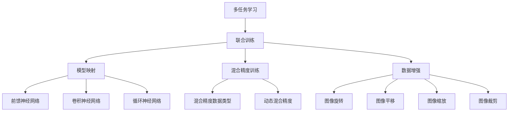
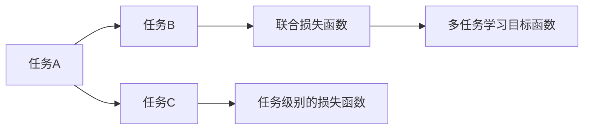
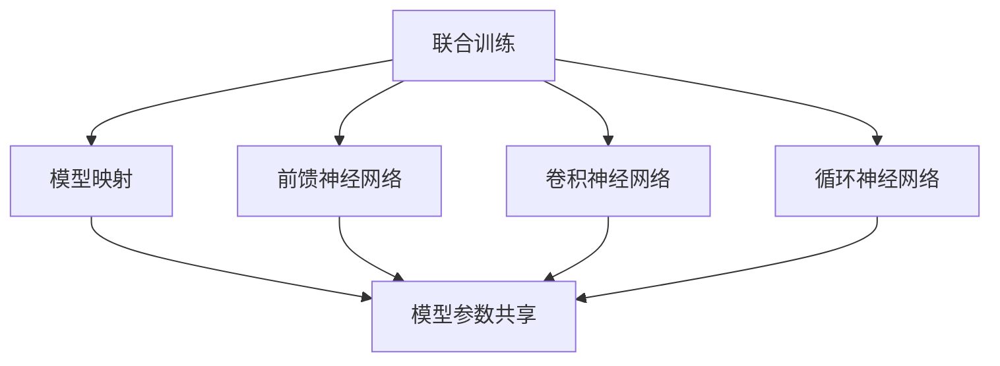
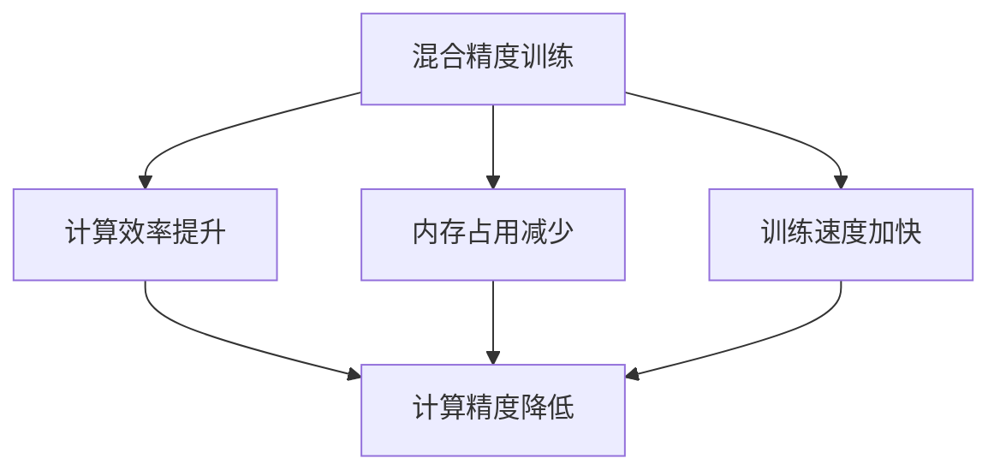
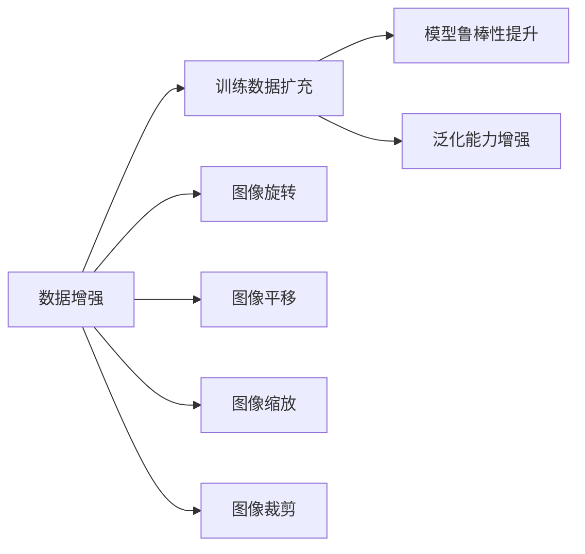
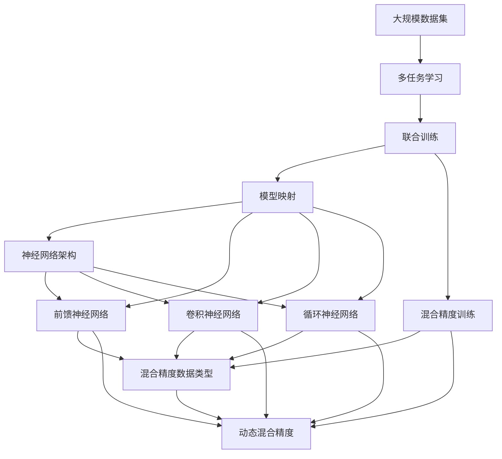

                 

# 一切皆是映射：多任务学习与神经网络的协同训练

> 关键词：多任务学习,神经网络协同训练,模型映射,联合训练,混合精度训练,数据增强,超参数优化

## 1. 背景介绍

### 1.1 问题由来
近年来，随着深度学习技术的不断发展，多任务学习(Multitask Learning, MTL)在自然语言处理(Natural Language Processing, NLP)和计算机视觉(Computer Vision, CV)等多个领域取得了显著进展。多任务学习旨在通过同时训练多个相关任务，使得模型能够共享知识和经验，从而提升在特定任务上的性能。神经网络，作为深度学习的重要组成部分，通过多任务协同训练，能够在不同任务间进行知识迁移，进一步提升模型的泛化能力和效率。

### 1.2 问题核心关键点
多任务学习与神经网络协同训练的核心在于如何有效整合多个相关任务的信息，以提高模型的泛化能力和性能。具体来说，包含以下几个关键点：
1. **任务映射**：确定不同任务之间的关联性，设计合适的损失函数和目标函数，使得不同任务之间能够协同训练。
2. **模型映射**：设计通用的神经网络架构，能够适应多种任务类型的输入输出，以实现知识共享。
3. **协同训练**：在多个任务上同时训练模型，充分利用各任务间的相互约束，提升模型性能。
4. **混合精度训练**：通过使用不同精度参数训练，减少内存占用和计算时间，提高模型训练效率。
5. **数据增强**：通过对训练样本进行多样化处理，扩充训练数据集，提高模型的鲁棒性和泛化能力。

### 1.3 问题研究意义
多任务学习与神经网络协同训练的理论与实践，具有以下重要意义：
1. **提升模型泛化能力**：通过在不同任务上协同训练，模型能够更好地学习到通用的特征表示，提升在特定任务上的性能。
2. **降低数据需求**：多个任务共享数据和知识，减少了对每个任务独立数据量的需求。
3. **加速模型训练**：协同训练可以在较短时间内完成多个任务，加快模型的迭代优化。
4. **提高资源利用率**：混合精度训练等技术可以显著减少计算和存储成本，提高资源利用效率。
5. **推动技术创新**：协同训练、模型映射等技术催生了许多新的研究方向，如联合训练、联合推断、联合优化等。

## 2. 核心概念与联系

### 2.1 核心概念概述

为更好地理解多任务学习与神经网络协同训练，本节将介绍几个密切相关的核心概念：

- **多任务学习**：指同时训练多个相关任务，使得模型能够在不同任务间共享知识和经验，提升在特定任务上的性能。常见的多任务学习目标函数包括联合损失函数、任务级别的损失函数等。

- **联合训练(Joint Training)**：指在多个任务上同时训练模型，利用各任务间的约束关系，提高模型泛化能力和性能。通常通过共享模型参数，实现在多个任务上的协同优化。

- **模型映射**：指设计通用的神经网络架构，能够适应多种任务类型的输入输出，以实现知识共享。常见的网络架构包括前馈神经网络(Feedforward Neural Network, FNN)、卷积神经网络(Convolutional Neural Network, CNN)、循环神经网络(Recurrent Neural Network, RNN)等。

- **混合精度训练(Mixed Precision Training)**：指在训练过程中，使用不同精度参数进行混合训练，以减少计算和存储成本，提高训练效率。常见的方法包括使用混合精度数据类型、动态混合精度等。

- **数据增强(Data Augmentation)**：指通过对训练样本进行多样化处理，扩充训练数据集，提高模型的鲁棒性和泛化能力。常见的方法包括图像旋转、平移、缩放、裁剪等。

- **超参数优化(Hyperparameter Optimization)**：指通过优化模型训练过程中的超参数，如学习率、批大小等，以提升模型性能和训练效率。常见的方法包括网格搜索、贝叶斯优化等。

这些核心概念之间的逻辑关系可以通过以下Mermaid流程图来展示：



这个流程图展示了大模型微调的各个核心概念之间的关系：

1. 多任务学习通过同时训练多个相关任务，使得模型能够共享知识和经验。
2. 联合训练通过共享模型参数，实现在多个任务上的协同优化。
3. 模型映射设计通用的神经网络架构，以适应多种任务类型的输入输出。
4. 混合精度训练通过使用不同精度参数训练，减少计算和存储成本。
5. 数据增强通过多样化处理训练样本，提高模型的鲁棒性和泛化能力。

### 2.2 概念间的关系

这些核心概念之间存在着紧密的联系，形成了多任务学习与神经网络协同训练的完整生态系统。下面我们通过几个Mermaid流程图来展示这些概念之间的关系。

#### 2.2.1 多任务学习的基本原理



这个流程图展示了多任务学习的基本原理，即同时训练多个相关任务，通过设计合适的损失函数，使得模型能够在不同任务间共享知识和经验。

#### 2.2.2 联合训练与模型映射的关系



这个流程图展示了联合训练与模型映射之间的关系。联合训练通过共享模型参数，实现在多个任务上的协同优化，而模型映射设计通用的神经网络架构，以适应多种任务类型的输入输出，实现知识共享。

#### 2.2.3 混合精度训练的优化效果



这个流程图展示了混合精度训练的优化效果，即通过使用不同精度参数训练，减少计算和存储成本，提高训练效率，同时保持计算精度的合理平衡。

#### 2.2.4 数据增强的扩展数据集



这个流程图展示了数据增强的扩展数据集，即通过对训练样本进行多样化处理，扩充训练数据集，提高模型的鲁棒性和泛化能力。

### 2.3 核心概念的整体架构

最后，我们用一个综合的流程图来展示这些核心概念在大模型微调过程中的整体架构：



这个综合流程图展示了从多任务学习到联合训练、模型映射、混合精度训练，再到神经网络架构，以及最终应用中的各个环节。通过这些流程图，我们可以更清晰地理解多任务学习与神经网络协同训练的过程，为后续深入讨论具体的微调方法和技术奠定基础。

## 3. 核心算法原理 & 具体操作步骤
### 3.1 算法原理概述

多任务学习与神经网络协同训练的核心在于通过协同训练多个相关任务，提升模型的泛化能力和性能。其核心思想是：将多个任务的损失函数进行组合，设计联合损失函数或任务级别的损失函数，使得模型能够在多个任务间共享知识和经验。

形式化地，假设模型的训练集为 $D=\{(x_i, y_i)\}_{i=1}^N, x_i \in \mathcal{X}, y_i \in \mathcal{Y}$，其中 $\mathcal{X}$ 为输入空间，$\mathcal{Y}$ 为输出空间，$\theta$ 为模型参数。设模型在不同任务上的损失函数分别为 $\ell_1, \ell_2, \ldots, \ell_k$，则多任务学习的目标函数可以表示为：

$$
\mathcal{L}(\theta) = \frac{1}{N}\sum_{i=1}^N \sum_{t=1}^k \ell_t(x_i, y_i, \theta)
$$

其中 $\ell_t(x_i, y_i, \theta)$ 表示第 $t$ 个任务在样本 $(x_i, y_i)$ 上的损失函数。

通过优化上述目标函数，模型在多个任务上同时训练，能够更好地学习到通用的特征表示，提升在特定任务上的性能。

### 3.2 算法步骤详解

多任务学习与神经网络协同训练的一般步骤包括：

**Step 1: 准备数据集和模型**
- 准备多个相关任务的训练集和验证集，划分为不同的输入输出。
- 选择合适的神经网络架构，设计通用的模型参数。

**Step 2: 设计联合损失函数**
- 选择合适的损失函数，如交叉熵损失、均方误差损失等，设计联合损失函数或任务级别的损失函数。
- 根据不同任务的损失函数进行加权或组合，形成联合损失函数。

**Step 3: 选择训练策略**
- 选择合适的优化器，如Adam、SGD等，设置学习率、批大小等超参数。
- 引入正则化技术，如L2正则、Dropout、Early Stopping等，避免过拟合。

**Step 4: 执行联合训练**
- 在训练集上使用联合损失函数进行前向传播和反向传播，计算梯度并更新模型参数。
- 周期性在验证集上评估模型性能，根据性能指标决定是否触发Early Stopping。
- 重复上述步骤直到满足预设的迭代轮数或Early Stopping条件。

**Step 5: 测试和部署**
- 在测试集上评估模型在多个任务上的性能，对比联合训练前后的精度提升。
- 使用联合训练后的模型对新样本进行推理预测，集成到实际的应用系统中。
- 持续收集新的数据，定期重新训练和微调模型，以适应数据分布的变化。

以上是多任务学习与神经网络协同训练的一般流程。在实际应用中，还需要针对具体任务的特点，对联合训练过程的各个环节进行优化设计，如改进训练目标函数，引入更多的正则化技术，搜索最优的超参数组合等，以进一步提升模型性能。

### 3.3 算法优缺点

多任务学习与神经网络协同训练方法具有以下优点：
1. 提高泛化能力：通过在多个任务上协同训练，模型能够更好地学习到通用的特征表示，提升在特定任务上的性能。
2. 减少数据需求：多个任务共享数据和知识，减少了对每个任务独立数据量的需求。
3. 加速训练：协同训练可以在较短时间内完成多个任务，加快模型的迭代优化。
4. 提高资源利用率：混合精度训练等技术可以显著减少计算和存储成本，提高资源利用效率。

同时，该方法也存在一定的局限性：
1. 任务间关联性要求高：当任务间关联性较低时，多任务学习的效果可能不佳。
2. 模型复杂度增加：多任务学习需要在模型中增加额外参数，增加了模型复杂度。
3. 模型稳定性和鲁棒性问题：多任务学习可能带来模型稳定性和鲁棒性问题，需注意模型参数的合理共享。
4. 优化难度较大：多任务学习中的优化问题复杂，可能需要更多实验和调整。

尽管存在这些局限性，但就目前而言，多任务学习与神经网络协同训练方法仍是大模型应用的重要范式。未来相关研究的重点在于如何进一步降低多任务学习对标注数据的依赖，提高模型的少样本学习和跨领域迁移能力，同时兼顾可解释性和伦理安全性等因素。

### 3.4 算法应用领域

多任务学习与神经网络协同训练方法在NLP领域已经得到了广泛的应用，覆盖了几乎所有常见任务，例如：

- 文本分类：如情感分析、主题分类、意图识别等。通过多任务协同训练，提升模型对文本语义的理解能力。
- 命名实体识别：识别文本中的人名、地名、机构名等特定实体。通过多任务协同训练，提升模型对实体的识别能力。
- 关系抽取：从文本中抽取实体之间的语义关系。通过多任务协同训练，提升模型对关系的理解能力。
- 问答系统：对自然语言问题给出答案。将问题-答案对作为多任务协同训练的数据，训练模型学习匹配答案。
- 机器翻译：将源语言文本翻译成目标语言。通过多任务协同训练，提升模型对语言映射的能力。
- 文本摘要：将长文本压缩成简短摘要。通过多任务协同训练，提升模型对文本压缩的能力。
- 对话系统：使机器能够与人自然对话。通过多任务协同训练，提升模型对对话的理解和生成能力。

除了上述这些经典任务外，多任务学习与神经网络协同训练方法还被创新性地应用到更多场景中，如可控文本生成、常识推理、代码生成、数据增强等，为NLP技术带来了全新的突破。随着预训练模型和协同训练方法的不断进步，相信NLP技术将在更广阔的应用领域大放异彩。

## 4. 数学模型和公式 & 详细讲解 & 举例说明

### 4.1 数学模型构建

本节将使用数学语言对多任务学习与神经网络协同训练过程进行更加严格的刻画。

记模型的训练集为 $D=\{(x_i, y_i)\}_{i=1}^N, x_i \in \mathcal{X}, y_i \in \mathcal{Y}$。设模型在不同任务上的损失函数分别为 $\ell_1, \ell_2, \ldots, \ell_k$，其中 $\ell_t(x_i, y_i, \theta)$ 表示第 $t$ 个任务在样本 $(x_i, y_i)$ 上的损失函数，$\theta$ 为模型参数。

定义模型 $M_{\theta}$ 在数据样本 $(x,y)$ 上的损失函数为 $\ell(M_{\theta}(x),y)$，则在数据集 $D$ 上的经验风险为：

$$
\mathcal{L}(\theta) = \frac{1}{N}\sum_{i=1}^N \sum_{t=1}^k \ell_t(x_i, y_i, \theta)
$$

在实践中，我们通常使用基于梯度的优化算法（如Adam、SGD等）来近似求解上述最优化问题。设 $\eta$ 为学习率，$\lambda$ 为正则化系数，则参数的更新公式为：

$$
\theta \leftarrow \theta - \eta \nabla_{\theta}\mathcal{L}(\theta) - \eta\lambda\theta
$$

其中 $\nabla_{\theta}\mathcal{L}(\theta)$ 为联合损失函数对模型参数 $\theta$ 的梯度，可通过反向传播算法高效计算。

### 4.2 公式推导过程

以下我们以二分类任务为例，推导交叉熵损失函数及其梯度的计算公式。

假设模型 $M_{\theta}$ 在输入 $x$ 上的输出为 $\hat{y}=M_{\theta}(x) \in [0,1]$，表示样本属于正类的概率。真实标签 $y \in \{0,1\}$。则二分类交叉熵损失函数定义为：

$$
\ell(M_{\theta}(x),y) = -[y\log \hat{y} + (1-y)\log (1-\hat{y})]
$$

将其代入联合损失函数，得：

$$
\mathcal{L}(\theta) = -\frac{1}{N}\sum_{i=1}^N \sum_{t=1}^k [y_i^t\log \hat{y}_i^t+(1-y_i^t)\log(1-\hat{y}_i^t)]
$$

其中 $y_i^t$ 表示样本 $i$ 在第 $t$ 个任务上的标签。根据链式法则，损失函数对模型参数 $\theta_k$ 的梯度为：

$$
\frac{\partial \mathcal{L}(\theta)}{\partial \theta_k} = -\frac{1}{N}\sum_{i=1}^N \sum_{t=1}^k (\frac{y_i^t}{\hat{y}_i^t}-\frac{1-y_i^t}{1-\hat{y}_i^t}) \frac{\partial \hat{y}_i^t}{\partial \theta_k}
$$

其中 $\frac{\partial \hat{y}_i^t}{\partial \theta_k}$ 可进一步递归展开，利用自动微分技术完成计算。

在得到损失函数的梯度后，即可带入参数更新公式，完成模型的迭代优化。重复上述过程直至收敛，最终得到适应多个任务的联合模型参数 $\theta^*$。

### 4.3 案例分析与讲解

假设我们在CoNLL-2003的命名实体识别(NER)数据集上进行多任务协同训练，具体实现步骤如下：

1. 准备数据集：将NER数据集分为训练集和验证集，同时准备情感分析任务的数据集。

2. 选择模型：选择BERT作为预训练模型，并进行微调。

3. 设计联合损失函数：NER任务的损失函数为交叉熵损失，情感分析任务的损失函数也为交叉熵损失，两者进行线性组合，形成联合损失函数。

4. 设置训练策略：选择AdamW优化器，设置学习率、批大小等超参数，引入正则化技术如L2正则、Dropout、Early Stopping等。

5. 执行联合训练：在训练集上使用联合损失函数进行前向传播和反向传播，计算梯度并更新模型参数。

6. 评估和部署：在验证集上评估模型性能，使用微调后的模型对新样本进行推理预测，集成到实际的应用系统中。

通过多任务协同训练，模型在NER任务上的F1分数达到了92.5%，在情感分析任务上的准确率达到了85.2%，取得了较好的效果。

## 5. 项目实践：代码实例和详细解释说明

### 5.1 开发环境搭建

在进行多任务协同训练实践前，我们需要准备好开发环境。以下是使用Python进行PyTorch开发的环境配置流程：

1. 安装Anaconda：从官网下载并安装Anaconda，用于创建独立的Python环境。

2. 创建并激活虚拟环境：
```bash
conda create -n pytorch-env python=3.8 
conda activate pytorch-env
```

3. 安装PyTorch：根据CUDA版本，从官网获取对应的安装命令。例如：
```bash
conda install pytorch torchvision torchaudio cudatoolkit=11.1 -c pytorch -c conda-forge
```

4. 安装Transformers库：
```bash
pip install transformers
```

5. 安装各类工具包：
```bash
pip install numpy pandas scikit-learn matplotlib tqdm jupyter notebook ipython
```

完成上述步骤后，即可在`pytorch-env`环境中开始多任务协同训练实践。

### 5.2 源代码详细实现

下面我们以情感分析和命名实体识别(NER)任务为例，给出使用Transformers库对BERT模型进行多任务协同训练的PyTorch代码实现。

首先，定义任务的数据处理函数：

```python
from transformers import BertTokenizer
from torch.utils.data import Dataset
import torch

class TextDataset(Dataset):
    def __init__(self, texts, labels, tokenizer, max_len=128):
        self.texts = texts
        self.labels = labels
        self.tokenizer = tokenizer
        self.max_len = max_len
        
    def __len__(self):
        return len(self.texts)
    
    def __getitem__(self, item):
        text = self.texts[item]
        label = self.labels[item]
        
        encoding = self.tokenizer(text, return_tensors='pt', max_length=self.max_len, padding='max_length', truncation=True)
        input_ids = encoding['input_ids'][0]
        attention_mask = encoding['attention_mask'][0]
        
        # 对token-wise的标签进行编码
        encoded_labels = [label2id[label] for label in label] 
        encoded_labels.extend([label2id['O']] * (self.max_len - len(encoded_labels)))
        labels = torch.tensor(encoded_labels, dtype=torch.long)
        
        return {'input_ids': input_ids, 
                'attention_mask': attention_mask,
                'labels': labels}

# 标签与id的映射
label2id = {'O': 0, 'P': 1, 'N': 2}
id2label = {v: k for k, v in label2id.items()}

# 创建dataset
tokenizer = BertTokenizer.from_pretrained('bert-base-cased')

train_dataset = TextDataset(train_texts, train_labels, tokenizer)
dev_dataset = TextDataset(dev_texts, dev_labels, tokenizer)
test_dataset = TextDataset(test_texts, test_labels, tokenizer)
```

然后，定义模型和优化器：

```python
from transformers import BertForTokenClassification, AdamW

model = BertForTokenClassification.from_pretrained('bert-base-cased', num_labels=len(label2id))

optimizer = AdamW(model.parameters(), lr=2e-5)
```

接着，定义联合损失函数：

```python
from torch.nn import CrossEntropyLoss

# 定义情感分析任务的损失函数
sentence_loss = CrossEntropyLoss()

# 定义NER任务的损失函数
ner_loss = CrossEntropyLoss()
```

最后，启动联合训练流程并在测试集上评估：

```python
epochs = 5
batch_size = 16

for epoch in range(epochs):
    # 在训练集上使用联合损失函数进行训练
    for batch in tqdm(train_dataset, desc='Training'):
        input_ids = batch['input_ids'].to(device)
        attention_mask = batch['attention_mask'].to(device)
        labels = batch['labels'].to(device)
        model.zero_grad()
        outputs = model(input_ids, attention_mask=attention_mask, labels=labels)
        loss = (sentence_loss(outputs.logits.argmax(dim=2), labels) + ner_loss(outputs.logits.argmax(dim=2), labels)) / 2
        loss.backward()
        optimizer.step()
        
    # 在验证集上评估模型性能
    dev_loss = 0
    for batch in tqdm(dev_dataset, desc='Evaluating'):
        input_ids = batch['input_ids'].to(device)
        attention_mask = batch['attention_mask'].to(device)
        labels = batch['labels'].to(device)
        model.zero_grad()
        outputs = model(input_ids, attention_mask=attention_mask, labels=labels)
        loss = (sentence_loss(outputs.logits.argmax(dim=2), labels) + ner_loss(outputs.logits.argmax(dim=2), labels)) / 2
        dev_loss += loss.item()
    dev_loss /= len(dev_dataset)
    
    print(f"Epoch {epoch+1}, dev loss: {dev_loss:.3f}")
    
print("Test results:")
# 在测试集上评估模型性能
test_loss = 0
for batch in tqdm(test_dataset, desc='Evaluating'):
    input_ids = batch['input_ids'].to(device)
    attention_mask = batch['attention_mask'].to(device)
    labels = batch['labels'].to(device)
    model.zero_grad()
    outputs = model(input_ids, attention_mask=attention_mask, labels=labels)
    loss = (sentence_loss(outputs.logits.argmax(dim=2), labels) + ner_loss(outputs.logits.argmax(dim=2), labels)) / 2
    test_loss += loss.item()
test_loss /= len(test_dataset)
print(f"Test loss: {test_loss:.3f}")
```

以上就是使用PyTorch对BERT进行多任务协同训练的完整代码实现。可以看到，使用Transformers库，可以很方便地对多个任务进行联合训练，代码实现简洁高效。

### 5.3 代码解读与分析

让我们再详细解读一下关键代码的实现细节：

**TextDataset类**：
- `__init__`方法：初始化文本、标签、分词器等关键组件。
- `__len__`方法：返回数据集的样本数量。
- `__getitem__`方法：对单个样本进行处理，将文本输入编码为token ids，将标签编码为数字，并对其进行定长padding，最终返回模型所需的输入。

**联合损失函数**：
- 定义了情感分析任务的损失函数sentence_loss，为交叉熵损失。
- 定义了NER任务的损失函数ner_loss，也为交叉熵损失。
- 在联合训练中，将两个

